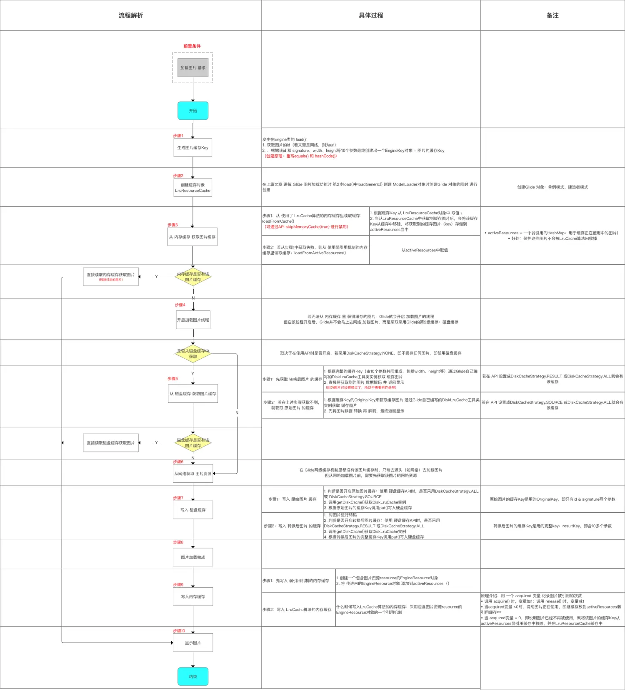

**`Glide`的图片缓存功能** 流程 & 源码分析

# 目录


# 1. Glide缓存机制简介

## 1.1 缓存的图片资源

`Glide` 需要缓存的 图片资源 分为两类：

- 原始图片（`Source`） ：即图片源的图片初始大小 & 分辨率
- 转换后的图片(`Result`) ：经过 尺寸缩放 和 大小压缩等处理后的图片

> 当使用 `Glide`加载图片时，Glide默认 根据 `View`视图对图片进行压缩 & 转换，而不显示原始图（这也是`Glide`加载速度高于`Picasso`的原因）

## 1.2 缓存机制设计

- `Glide`的缓存功能设计成 **二级缓存**：内存缓存 & 硬盘缓存

> 并不是三级缓存，**因为 从网络加载 不属于缓存**

- 缓存读取顺序：内存缓存 --> 磁盘缓存 --> 网络

> 1. 内存缓存 默认开启
> 2. `Glide`中，内存缓存 & 磁盘缓存相互不影响，独立配置

- 二级缓存的作用不同：

  1. 内存缓存：防止应用 重复将图片数据 读取到内存当中

  > 只 缓存转换过后的图片

  1. 硬盘缓存：防止应用从网络或其他地方重复下载和读取数据

  > 可缓存原始图片 & 缓存转换过后的图片，用户自行设置

`Glide`的缓存机制使得 `Glide`具备非常好的图片缓存效果，从而使得具备较高的图片加载效率。

> 如，在 `RecyclerView` 上下滑动，而`RecyclerView`中只要是`Glide`加载过的图片，都可以直接从内存中读取 & 展示，从而不需要重复从 网络或硬盘上读取，提高图片加载效率。

# 2. Glide  缓存功能介绍

`Glide` 的缓存功能分为：内存缓存 & 磁盘缓存

## 2.1 内存缓存

- 作用：防止应用 重复将图片数据 读取到内存当中

> 只 缓存转换过后的图片，而并非原始图片

- 默认情况下，`Glide`自动开启 内存缓存

```csharp
// 默认开启内存缓存，用户不需要作任何设置
Glide.with(this)
     .load(url)
     .into(imageView);

// 可通过 API 禁用 内存缓存功能
Glide.with(this)
     .load(url)
     .skipMemoryCache(true) // 禁用 内存缓存
     .into(imageView);
```

- 实现原理
   `Glide`的内存缓存实现是基于：`LruCache` 算法（`Least Recently Used`） & 弱引用机制

> 1. `LruCache`算法原理：将最近使用的对象 **用强引用的方式** 存储在`LinkedHashMap`中 ；当缓存满时 ，**将最近最少使用的对象从内存中移除**
> 2. 弱引用：弱引用的对象具备更短生命周期，因为当`JVM`进行垃圾回收时，一旦发现弱引用对象，都会进行回收（无论内存充足否）

## 2.2  磁盘缓存

- 作用：防止应用 重复从网络或其他地方重复下载和读取数据

> 可缓存原始图片 & 缓存转换过后的图片，用户自行设置

- 具体使用

```csharp
Glide.with(this)
     .load(url)
     .diskCacheStrategy(DiskCacheStrategy.NONE)
     .into(imageView);

// 缓存参数说明
// DiskCacheStrategy.NONE：不缓存任何图片，即禁用磁盘缓存
// DiskCacheStrategy.ALL ：缓存原始图片 & 转换后的图片
// DiskCacheStrategy.SOURCE：只缓存原始图片（原来的全分辨率的图像，即不缓存转换后的图片）
// DiskCacheStrategy.RESULT：（默认）只缓存转换后的图片（即最终的图像：降低分辨率后 / 或者转换后 ，不缓存原始图片
```

- 实现原理
   使用`Glide` 自定义的`DiskLruCache`算法

> 1. 该算法基于 `Lru` 算法中的`DiskLruCache`算法，具体应用在磁盘缓存的需求场景中
> 2. 该算法被封装到`Glide`自定义的工具类中，该工具类基于`Android` 提供的`DiskLruCache`工具类

# 3. Glide 缓存流程 解析

- `Glide`整个缓存流程 从 **加载图片请求** 开始，过程有内存缓存的读取 & 写入、磁盘缓存的读取 & 写入
- 具体如下


# 4. 缓存流程 源码分析

## 步骤1：生成缓存Key

- `Glide` 实现内存 & 磁盘缓存 是根据 **图片的缓存Key** 进行唯一标识

> 即根据 图片的缓存Key 去缓存区找 对应的缓存图片

- 生成缓存 `Key` 的代码发生在`Engine`类的 `load()`中

```java
public class Engine implements EngineJobListener,
        MemoryCache.ResourceRemovedListener,
        EngineResource.ResourceListener {

    public <T, Z, R> LoadStatus load(Key signature, int width, int height, DataFetcher<T> fetcher,
            DataLoadProvider<T, Z> loadProvider, Transformation<Z> transformation, ResourceTranscoder<Z, R> transcoder,
            Priority priority, boolean isMemoryCacheable, DiskCacheStrategy diskCacheStrategy, ResourceCallback cb) {
        Util.assertMainThread();
        long startTime = LogTime.getLogTime();
        
        // 获得了一个id字符串，即需加载图片的唯一标识
        // 如，若图片的来源是网络，那么该id = 这张图片的url地址
        final String id = fetcher.getId();
        
        // Glide的缓存Key生成规则复杂：根据10多个参数生成
        // 将该id 和 signature、width、height等10个参数一起传入到缓存Key的工厂方法里，最终创建出一个EngineKey对象
        // 创建原理：通过重写equals() 和 hashCode()，保证只有传入EngineKey的所有参数都相同情况下才认为是同一个EngineKey对象
        // 该EngineKey 即Glide中图片的缓存Key
        EngineKey key = keyFactory.buildKey(id, signature, width, height, loadProvider.getCacheDecoder(),loadProvider.getSourceDecoder(), transformation, loadProvider.getEncoder(),transcoder, loadProvider.getSourceEncoder());
      ...
}
```

## 步骤2：创建缓存对象 `LruResourceCache`

- `LruResourceCache`对象是在创建 `Glide` 对象时创建的
- 创建 `Glide` 对象是在 `load()`中`loadGeneric()` 创建 `ModelLoader`对象时创建的

```java
<-- 第2步load（）中的loadGeneric（）-->
    private <T> DrawableTypeRequest<T> loadGeneric(Class<T> modelClass) {
        ...
        // 创建第1个ModelLoader对象；作用：加载图片
        // Glide会根据load()方法传入不同类型参数，得到不同的ModelLoader对象
        // 此处传入参数是String.class，因此得到的是StreamStringLoader对象（实现了ModelLoader接口）
        // Glide.buildStreamModelLoader（）分析 ->>分析1
        ModelLoader<T, InputStream> streamModelLoader = Glide.buildStreamModelLoader(modelClass, context);

<--分析1：Glide.buildStreamModelLoader（） -->
public class Glide {

    public static <T, Y> ModelLoader<T, Y> buildModelLoader(Class<T> modelClass, Class<Y> resourceClass,
            Context context) {
         if (modelClass == null) {
            if (Log.isLoggable(TAG, Log.DEBUG)) {
                Log.d(TAG, "Unable to load null model, setting placeholder only");
            }
            return null;
        }
        return Glide.get(context).getLoaderFactory().buildModelLoader(modelClass, resourceClass);
        // 创建ModelLoader对象时，调用Glide.get() 创建Glide对象-->分析2
    }

<--分析2：Glide.get() -->
// 作用：采用单例模式创建Glide对象
    public static Glide get(Context context) {

        // 实现单例功能
        if (glide == null) {
            synchronized (Glide.class) {
                if (glide == null) {
                    Context applicationContext = context.getApplicationContext();
                    List<GlideModule> modules = new ManifestParser(applicationContext).parse();
                    GlideBuilder builder = new GlideBuilder(applicationContext);
                    for (GlideModule module : modules) {
                        module.applyOptions(applicationContext, builder);
                    }
                    glide = builder.createGlide();
                    // 通过建造者模式创建Glide对象 ->>分析3
                    for (GlideModule module : modules) {
                        module.registerComponents(applicationContext, glide);
                    }
                }
            }
        }
        return glide;
    }
}

<--分析3：builder.createGlide() -->
// 作用：创建Glide对象
public class GlideBuilder {
    ...

    Glide createGlide() {
        MemorySizeCalculator calculator = new MemorySizeCalculator(context);
        if (bitmapPool == null) {
            if (Build.VERSION.SDK_INT >= Build.VERSION_CODES.HONEYCOMB) {
                int size = calculator.getBitmapPoolSize();
                bitmapPool = new LruBitmapPool(size);
            } else {
                bitmapPool = new BitmapPoolAdapter();
            }
        }

        if (memoryCache == null) {
            memoryCache = new LruResourceCache(calculator.getMemoryCacheSize());
            // 创建一个LruResourceCache对象 并 赋值到memoryCache对象
            // 该LruResourceCache对象 = Glide实现内存缓存的LruCache对象
        }
        
        return new Glide(engine, memoryCache, bitmapPool, context, decodeFormat);
    }
}
```

至此，创建好了缓存对象`LruResourceCache`

## 步骤3：从 内存缓存 中获取缓存图片

- `Glide` 在图片加载前会从 内存缓存 中获取缓存图片
- 读取内存缓存代码 是在`Engine`类的`load()`中

```java
public class Engine implements EngineJobListener,
        MemoryCache.ResourceRemovedListener,
        EngineResource.ResourceListener {
    ...    

    public <T, Z, R> LoadStatus load(Key signature, int width, int height, DataFetcher<T> fetcher,
            DataLoadProvider<T, Z> loadProvider, Transformation<Z> transformation, ResourceTranscoder<Z, R> transcoder,
            Priority priority, boolean isMemoryCacheable, DiskCacheStrategy diskCacheStrategy, ResourceCallback cb) {
        Util.assertMainThread();

        final String id = fetcher.getId();
        EngineKey key = keyFactory.buildKey(id, signature, width, height, loadProvider.getCacheDecoder(),
                loadProvider.getSourceDecoder(), transformation, loadProvider.getEncoder(),
                transcoder, loadProvider.getSourceEncoder());
         // 上面讲解的生成图片缓存Key
        
        // 调用loadFromCache()获取内存缓存中的缓存图片
        EngineResource<?> cached = loadFromCache(key, isMemoryCacheable);
        
        // 若获取到，就直接调用cb.onResourceReady()进行回调
        if (cached != null) {
            cb.onResourceReady(cached);
        }
        
        // 若没获取到，就继续调用loadFromActiveResources()获取缓存图片
        // 获取到也直接回调
        EngineResource<?> active = loadFromActiveResources(key, isMemoryCacheable);
        if (active != null) {
            cb.onResourceReady(active);
        }

        // 若上述两个方法都没有获取到缓存图片，就开启一个新的线程准备加载图片
        // 即从上文提到的 Glide最基础功能：图片加载
        EngineJob current = jobs.get(key);
            return new LoadStatus(cb, current);
        }

        EngineJob engineJob = engineJobFactory.build(key, isMemoryCacheable);
        DecodeJob<T, Z, R> decodeJob = new DecodeJob<T, Z, R>(key, width, height, fetcher, loadProvider, transformation,
                transcoder, diskCacheProvider, diskCacheStrategy, priority);
        EngineRunnable runnable = new EngineRunnable(engineJob, decodeJob, priority);
        jobs.put(key, engineJob);
        engineJob.addCallback(cb);
        engineJob.start(runnable);

        return new LoadStatus(cb, engineJob);
    }

    ...
}
```

即：

- `Glide` 将 内存缓存 划分为两块：一块使用了`LruCache`算法 机制；另一块使用了弱引用 机制
- 当 获取 内存缓存 时，会通过两个方法分别从上述两块区域进行缓存获取

1. `loadFromCache()`：从 使用了 `LruCache`算法机制的内存缓存获取 缓存

   从LruResourceCache中获取到缓存图片之后会将它从缓存中移除，这样弱引用机制才能监听到该图片不再被使用

2. `loadFromActiveResources()`：从 使用了 弱引用机制的内存缓存获取 缓存

```php
// 这2个方法属于  Engine 类
public class Engine implements EngineJobListener,
        MemoryCache.ResourceRemovedListener,
        EngineResource.ResourceListener {

    private final MemoryCache cache;
    private final Map<Key, WeakReference<EngineResource<?>>> activeResources;
    ...

<-- 方法1：loadFromCache() -->
// 原理：使用了 LruCache算法
    private EngineResource<?> loadFromCache(Key key, boolean isMemoryCacheable) {
        if (!isMemoryCacheable) {
            return null;
        // 若isMemoryCacheable = false就返回null，即内存缓存被禁用
        // 即 内存缓存是否禁用的API skipMemoryCache()
        // 若设置skipMemoryCache(true)，此处的isMemoryCacheable就等于false，最终返回Null，表示内存缓存已被禁用
        }

        EngineResource<?> cached = getEngineResourceFromCache(key);
        // 获取图片缓存 ->>分析4

        // 从分析4回来看这里：
        if (cached != null) {
            cached.acquire();
			// 将获取到的缓存图片存储到activeResources当中
            // activeResources = 一个弱引用的HashMap：用于缓存正在使用中的图片
            // 好处：保护这些图片不会被LruCache算法回收掉。 ->>方法2
            activeResources.put(key, new ResourceWeakReference(key, cached, getReferenceQueue()));
        }
        return cached;
    }

<<- 分析4：getEngineResourceFromCache（） ->>
// 作用：获取图片缓存
// 具体过程：根据缓存Key 从cache中 取值 
// 注：此处的cache对象 = 在构建Glide对象时创建的LruResourceCache对象，即说明使用的是LruCache算法
    private EngineResource<?> getEngineResourceFromCache(Key key) {
        Resource<?> cached = cache.remove(key);
        // 当从LruResourceCache中获取到缓存图片后，会将它从缓存中移除->>回到方法1原处
        final EngineResource result;
        if (cached == null) {
            result = null;
        } else if (cached instanceof EngineResource) {
            result = (EngineResource) cached;
        } else {
            result = new EngineResource(cached, true /*isCacheable*/);
        }
        return result;
    }

<-- 方法2：loadFromActiveResources() -->
// 原理：使用了 弱引用机制
// 具体过程：当在方法1中无法获取内存缓存中的缓存图片时，就会从activeResources中取值
// activeResources = 一个弱引用的HashMap：用于缓存正在使用中的图片
    private EngineResource<?> loadFromActiveResources(Key key, boolean isMemoryCacheable) {
        if (!isMemoryCacheable) {
            return null;
        }
        EngineResource<?> active = null;
        WeakReference<EngineResource<?>> activeRef = activeResources.get(key);
        if (activeRef != null) {
            active = activeRef.get();
            if (active != null) {
                active.acquire();
            } else {
                activeResources.remove(key);
            }
        }
        return active;
    }

    ...
}
```

若上述两个方法都没获取到缓存图片时（即内存缓存里没有该图片的缓存），就开启新线程加载图片。

正在使用中的图片使用弱引用来进行缓存，不在使用中的图片使用LruCache来进行缓存。

至此，获取内存缓存 的步骤讲解完毕。


## 步骤4：开启 加载图片 线程

- 若无法从 内存缓存 里 获得缓存的图片，`Glide`就会开启 加载图片的线程
- 但在该线程开启后，`Glide`并不会马上去网络 加载图片，**而是采取采用`Glide`的第2级缓存：磁盘缓存** 去获取缓存图片

> 从 `Glide` 在第3步 `into()`中开启图片线程 `run()`里的 `decode()`开始（上文的分析13）

```kotlin
private Resource<?> decode() throws Exception {

// 在执行 加载图片 线程时（即加载图片时），分两种情况：
// 情况1：从磁盘缓存当中读取图片（默认情况下Glide会优先从缓存当中读取，没有才会去网络源读取图片）
// 情况2：不从磁盘缓存中读取图片

// 情况1：从磁盘缓存中读取缓存图片
    if (isDecodingFromCache()) {
    // 取决于在使用API时是否开启，若采用DiskCacheStrategy.NONE，即不缓存任何图片，即禁用磁盘缓存
        return decodeFromCache();
        // 读取磁盘缓存的入口就是这里，此处主要讲解 ->>直接看步骤5的分析9
    } else {

    // 情况2：不从磁盘缓存中读取图片        
    // 即上文讨论的从网络读取图片，此处不作过多描述
        return decodeFromSource();
    }
}
```

## 步骤5：从 磁盘缓存 中获取缓存图片

若无法从 内存缓存 里 获得缓存的图片，`Glide`就会采用第2级缓存：磁盘缓存 去获取缓存图片

```kotlin
<--分析9：decodeFromCache()  -->
private Resource<?> decodeFromCache() throws Exception {
    Resource<?> result = null;

        result = decodeJob.decodeResultFromCache();
        // 获取磁盘缓存时，会先获取 转换过后图片 的缓存
        // 即在使用磁盘缓存时设置的模式，如果设置成DiskCacheStrategy.RESULT 或DiskCacheStrategy.ALL就会有该缓存
        // 下面来分析decodeResultFromCache() ->>分析10

    }
    if (result == null) {
        result = decodeJob.decodeSourceFromCache();
        // 如果获取不到 转换过后图片 的缓存，就获取 原始图片 的缓存
        // 即在使用磁盘缓存时设置的模式，如果设置成DiskCacheStrategy.SOURCE 或DiskCacheStrategy.ALL就会有该缓存
        // 下面来分析decodeSourceFromCache() ->>分析12
    }
    return result;
}

<--分析10：decodeFromCache()  -->
public Resource<Z> decodeResultFromCache() throws Exception {
    if (!diskCacheStrategy.cacheResult()) {
        return null;
    }

    Resource<T> transformed = loadFromCache(resultKey);
    // 1. 根据完整的缓存Key（由10个参数共同组成，包括width、height等）获取缓存图片
    // ->>分析11

    Resource<Z> result = transcode(transformed);
    return result;
    // 2. 直接将获取到的图片 数据解码 并 返回
    // 因为图片已经转换过了，所以不需要再作处理
    // 回到分析9原处
}

<--分析11：decodeFromCache()  -->
private Resource<T> loadFromCache(Key key) throws IOException {
    File cacheFile = diskCacheProvider.getDiskCache().get(key);

    // 1. 调用getDiskCache()获取Glide自己编写的DiskLruCache工具类实例
    // 2. 调用上述实例的get() 并 传入完整的缓存Key，最终得到硬盘缓存的文件
    if (cacheFile == null) {
        return null;
        // 如果文件为空就返回null
    }
    Resource<T> result = null;
    try {
        result = loadProvider.getCacheDecoder().decode(cacheFile, width, height);
            } finally {
        if (result == null) {
            diskCacheProvider.getDiskCache().delete(key);
        }
    }
    return result;
    // 如果文件不为空，则将它解码成Resource对象后返回
    // 回到分析10原处
}

<--分析12：decodeFromCache()  -->
public Resource<Z> decodeSourceFromCache() throws Exception {
    if (!diskCacheStrategy.cacheSource()) {
        return null;
    }

    Resource<T> decoded = loadFromCache(resultKey.getOriginalKey());
    // 1. 根据缓存Key的OriginalKey来获取缓存图片
    // 相比完整的缓存Key，OriginalKey只使用了id和signature两个参数，而忽略了大部分的参数
    // 而signature参数大多数情况下用不到，所以基本是由id（也就是图片url）来决定的Original缓存Key
    // 关于loadFromCache（）同分析11，只是传入的缓存Key不一样

    return transformEncodeAndTranscode(decoded);
    // 2. 先将图片数据 转换 再 解码，最终返回
}
```

- 至此，硬盘缓存读取的源码分析完毕。


## 步骤6：从网络获取 图片资源

- 在 `Glide`两级缓存机制里都没有该图片缓存时，只能去源头（如网络）去加载图片了
- 但从网络加载图片前，需要先获取该图片的网络资源

## 步骤7：写入 磁盘缓存

- `Glide`将图片写入 磁盘缓存的时机：获取图片资源后 、图片加载完成前

- 写入磁盘缓存又分为：将原始图片 写入 或 将转换后的图片写入磁盘缓存

> 从 `Glide` 在 `into（）`中执行图片线程 `run（）`里的 `decode（）`开始

```kotlin
private Resource<?> decode() throws Exception {

// 在执行 加载图片 线程时（即加载图片时），分两种情况：
// 情况1：从磁盘缓存当中读取图片（默认情况下Glide会优先从缓存当中读取，没有才会去网络源读取图片）
// 情况2：不从磁盘缓存中读取图片

// 情况1：从磁盘缓存中读取缓存图片
    if (isDecodingFromCache()) {
        return decodeFromCache();
        // 读取磁盘缓存的入口就是这里，上面已经讲解
    } else {

    // 情况2：不从磁盘缓存中读取图片
        // 即上文讨论的从网络读取图片，不采用缓存
        // 写入磁盘缓存就是在 此处 写入的 ->>分析13
        return decodeFromSource();
    }
}

<--分析13：decodeFromSource()  -->
public Resource<Z> decodeFromSource() throws Exception {
    Resource<T> decoded = decodeSource();
    // 解析图片
    // 写入原始图片 磁盘缓存的入口 ->>分析14

     // 从分析16回来看这里
    return transformEncodeAndTranscode(decoded);
    // 对图片进行转码
    // 写入 转换后图片 磁盘缓存的入口 ->>分析17
}

<--分析14：decodeSource()  -->
private Resource<T> decodeSource() throws Exception {
    Resource<T> decoded = null;
    try {

        final A data = fetcher.loadData(priority);
        // 读取图片数据
        if (isCancelled) {
            return null;
        }
        decoded = decodeFromSourceData(data);
        // 对图片进行解码 ->>分析15
    } finally {
        fetcher.cleanup();
    }
    return decoded;
}

<--分析15：decodeFromSourceData()  -->
private Resource<T> decodeFromSourceData(A data) throws IOException {
    final Resource<T> decoded;
    // 判断是否允许缓存原始图片
    // 即在使用 硬盘缓存API时，是否采用DiskCacheStrategy.ALL 或 DiskCacheStrategy.SOURCE
    if (diskCacheStrategy.cacheSource()) {
        decoded = cacheAndDecodeSourceData(data);
        // 若允许缓存原始图片，则调用cacheAndDecodeSourceData()进行原始图片的缓存 ->>分析16

    } else {
        long startTime = LogTime.getLogTime();
        decoded = loadProvider.getSourceDecoder().decode(data, width, height);
    }
    return decoded;
}

<--分析16：cacheAndDecodeSourceData   -->
private Resource<T> cacheAndDecodeSourceData(A data) throws IOException {
   
    ...
    diskCacheProvider.getDiskCache().put(resultKey.getOriginalKey(), writer);
    // 1. 调用getDiskCache()获取DiskLruCache实例
    // 2. 调用put()写入硬盘缓存
    // 注：原始图片的缓存Key是用的getOriginalKey()，即只有id & signature两个参数
    // 请回到分析13

}

<--分析17：transformEncodeAndTranscode（） -->
private Resource<Z> transformEncodeAndTranscode(Resource<T> decoded) {
    
    Resource<T> transformed = transform(decoded);
    // 1. 对图片进行转换

    writeTransformedToCache(transformed);
    // 2. 将 转换过后的图片 写入到硬盘缓存中 -->分析18

    Resource<Z> result = transcode(transformed);
    return result;
}

<-- 分析18：TransformedToCache（） -->
private void writeTransformedToCache(Resource<T> transformed) {
    if (transformed == null || !diskCacheStrategy.cacheResult()) {
        return;
    }

    diskCacheProvider.getDiskCache().put(resultKey, writer);
    // 1. 调用getDiskCache()获取DiskLruCache实例
    // 2. 调用put()写入硬盘缓存
    // 注：转换后图片的缓存Key是用的完整的resultKey，即含10多个参数
}
```

- 至此，硬盘缓存的写入分析完毕。

  

## 步骤9：写入 内存缓存

- `Glide` 将图片写入 内存缓存的时机：图片加载完成后 、图片显示出来前
- 写入 内存缓存 的具体地方：当图片加载完成后，会在`EngineJob`中通过`Handler`发送一条消息将执行逻辑切回到主线程当中，从而执行`handleResultOnMainThread()`里

```java
class EngineJob implements EngineRunnable.EngineRunnableManager {

    private final EngineResourceFactory engineResourceFactory;
    ...

    private void handleResultOnMainThread() {
        ...

        // 关注1：写入 弱引用缓存
        engineResource = engineResourceFactory.build(resource, isCacheable);
        listener.onEngineJobComplete(key, engineResource);

        // 关注2：写入 LruCache算法的缓存
        engineResource.acquire();

        for (ResourceCallback cb : cbs) {
            if (!isInIgnoredCallbacks(cb)) {
                engineResource.acquire();
                cb.onResourceReady(engineResource);
            }
        }
        engineResource.release();
    }
```

写入 内存缓存分为：写入 弱引用缓存 & `LruCache`算法的缓存

> 1. 内存缓存分为：使用了  `LruCache`算法机制的区域 & 使用了 弱引用机制的缓存
> 2. 内存缓存只缓存 转换后的图片

### 关注1：写入 弱引用缓存

```java
class EngineJob implements EngineRunnable.EngineRunnableManager {

    private final EngineResourceFactory engineResourceFactory;
    ...

    private void handleResultOnMainThread() {
        ...

        // 写入 弱引用缓存
        engineResource = engineResourceFactory.build(resource, isCacheable);
        // 创建一个包含图片资源resource的EngineResource对象

        listener.onEngineJobComplete(key, engineResource);
        // 将上述创建的EngineResource对象传入到Engine.onEngineJobComplete() ->>分析6

        // 写入LruCache算法的缓存（先忽略）
        engineResource.acquire();

        for (ResourceCallback cb : cbs) {
            if (!isInIgnoredCallbacks(cb)) {
                engineResource.acquire();
                cb.onResourceReady(engineResource);
            }
        }
        engineResource.release();
    }


<<- 分析6：onEngineJobComplete()（） ->>
public class Engine implements EngineJobListener,
        MemoryCache.ResourceRemovedListener,
        EngineResource.ResourceListener {
    ...    

    @Override
    public void onEngineJobComplete(Key key, EngineResource<?> resource) {
        Util.assertMainThread();

        if (resource != null) {
            resource.setResourceListener(key, this);
            if (resource.isCacheable()) {
                activeResources.put(key, new ResourceWeakReference(key, resource, getReferenceQueue()));
                // 将 传进来的EngineResource对象 添加到activeResources（）中
                // 即写入了弱引用 内存缓存
            }
        }
        jobs.remove(key);
    }

    ...
}
```

### 关注2：写入 LruCache算法 缓存

```java
class EngineJob implements EngineRunnable.EngineRunnableManager {

    private final EngineResourceFactory engineResourceFactory;
    ...

    private void handleResultOnMainThread() {
        ...

        // 写入 弱引用缓存（忽略）
        engineResource = engineResourceFactory.build(resource, isCacheable);
        listener.onEngineJobComplete(key, engineResource);

        // 写入 LruCache算法的缓存
        engineResource.acquire();
        // 标记1

        for (ResourceCallback cb : cbs) {
            if (!isInIgnoredCallbacks(cb)) {
                engineResource.acquire();
                // 标记2
                cb.onResourceReady(engineResource);
            }
        }
        engineResource.release();
        // 标记3
    }
```

写入 `LruCache`算法 内存缓存的原理：包含图片资源`resource`的`EngineResource`对象的一个引用机制：

- 用 一个 `acquired` 变量 记录图片被引用的次数
- 加载图片时：调用 `acquire()` ，变量加1

> 上述代码的标记1、标记2 & 下面`acquire()`源码

```csharp
<-- 分析7：acquire() -->
    void acquire() {
        if (isRecycled) {
            throw new IllegalStateException("Cannot acquire a recycled resource");
        }
        if (!Looper.getMainLooper().equals(Looper.myLooper())) {
            throw new IllegalThreadStateException("Must call acquire on the main thread");
        }
        ++acquired;
        // 当调用acquire()时，acquired变量 +1
    }
```

- 不加载图片时，调用 `release()` 时，变量减1

> 上述代码的标记3 & 下面`release()`源码

```java
<-- 分析8：release()  -->
    void release() {
        if (acquired <= 0) {
            throw new IllegalStateException("Cannot release a recycled or not yet acquired resource");
        }
        if (!Looper.getMainLooper().equals(Looper.myLooper())) {
            throw new IllegalThreadStateException("Must call release on the main thread");
        }
        if (--acquired == 0) {
            listener.onResourceReleased(key, this);
            // 当调用acquire()时，acquired变量 -1
            // 若acquired变量 = 0，即说明图片已经不再被使用
            // 调用listener.onResourceReleased()释放资源
            // 该listener = Engine对象，Engine.onResourceReleased()->>分析9
        }
    }
}

<-- 分析9：onResourceReleased（）  -->
public class Engine implements EngineJobListener,
        MemoryCache.ResourceRemovedListener,
        EngineResource.ResourceListener {

    private final MemoryCache cache;
    private final Map<Key, WeakReference<EngineResource<?>>> activeResources;
    ...

    @Override
    public void onResourceReleased(Key cacheKey, EngineResource resource) {
        Util.assertMainThread();
        activeResources.remove(cacheKey);
        // 步骤1：将缓存图片从activeResources弱引用缓存中移除

        if (resource.isCacheable()) {
            cache.put(cacheKey, resource);
            // 步骤2：将该图片缓存放在LruResourceCache缓存中
        } else {
            resourceRecycler.recycle(resource);
        }
    }

    ...
}
```

- 当 `acquired` 变量 >0 时，说明图片正在使用，即该图片缓存继续存放到`activeResources`弱引用缓存中
- 当 `acquired`变量 = 0，即说明图片已经不再被使用，就将该图片的缓存Key从 `activeResources`弱引用缓存中移除，并存放到`LruResourceCache`缓存中

至此，实现了：

- 正在使用中的图片 采用 弱引用 的内存缓存
- 不在使用中的图片 采用 `LruCache`算法 的内存缓存


## 步骤10：显示图片

- 在将图片 写入 内存缓存 & 磁盘缓存后，图片最终显示出来
- 在下次加载时，将通过二级缓存 从而提高图片加载效率

至此，`Glide` 的图片缓存流程解析完毕。

# 内存缓存

为什么内存缓存同时用MemoryCache和ActiveResource两个缓存？

ActiveResource只保留正在使用的图片，也就是被应用强引用持有的。

MemoryCache是通过LruCache保存用过的图片。

所以如果用MemoryCache保存，那如果一直图片在最开始设置后就一直显示着，那在其他图片频繁设置后，最开始的设置的一直显示的图片就被LruCache给移除了，这是不应该的。

# 5. 缓存流程汇总

用一张图将整个`Glide` 的图片缓存流程 汇总



- 关于内存缓存 的总结
  1. 读取 内存缓存 时，先从`LruCache`算法机制的内存缓存读取，再从弱引用机制的 内存缓存 读取
  2. 写入 内存缓存 时，先写入 弱引用机制 的内存缓存，等到图片不再被使用时，再写入到 `LruCache`算法机制的内存缓存
- 关于磁盘缓存 的总结
  1. 读取 磁盘缓存 时，先读取 转换后图片 的缓存，再读取 原始图片 的缓存

> 是否读取 取决于 `Glide`使用API的设置

1. 写入 磁盘缓存 时，先写入 原始图片 的内存缓存，再写入的内存缓存

> 是否写入 取决于 `Glide`使用API的设置

# 问题分析：为什么Glide缓存功能不起作用？

### a. 背景

- `Glide`实现内存 & 磁盘缓存是根据 图片的缓存`Key`进行唯一标识
- 开发者为了降低成本 & 安全，往往会将图片存放在云服务器上

- 为了保护 客户的图片资源，图片云服务器 会在图片`Url`地址的基础上再加一个token参数

```cpp
http://url.com/image.jpg?token=a6cvva6b02c670b0a
```

- `Glide`加载该图片时，会使用加了`token`参数的图片`Url`地址 作为`id`参数，从而生成 缓存Key

### b. 问题

- 作为身份认证的`token`参数可能会发生变化，并不是一成不变
- 若 `token`参数变了，则图片`Url`跟着变，则生成缓存key的所需id参数发生变化，即 **缓存Key也会跟着变化**
- 这导致同一张图片，但因为`token`参数变化，而导致缓存Key发生变化，从而使得 `Glide`的缓存功能失效

> 缓存Key发生变化，即同一个图片的当前缓存key 和 之前写入缓存的key不相同，这意味着 在读取缓存时 无法根据当前缓存key 找到之前的缓存，从而使得失效

### c. 解决方案

### 3.1 原理

在 生成缓存`Key` 的id参数 前，将 带有`token`参数的图片`Url`地址 去掉 `token`参数，从而根据 初始的图片`Url`地址 生成缓存`Key`的id参数

> 实现了一个图片的缓存`Key`的id参数始终唯一 ，即等于 图片`Url`地址

### 3.2 储备知识：生成缓存Key的id参数的逻辑

生成缓存`Key`的`id`参数的逻辑为：直接将图片的 `URL` 地址作为缓存Key的`id`参数

```java
public class Engine implements EngineJobListener,
        MemoryCache.ResourceRemovedListener,
        EngineResource.ResourceListener {

    public <T, Z, R> LoadStatus load(Key signature, int width, int height, DataFetcher<T> fetcher,
            DataLoadProvider<T, Z> loadProvider, Transformation<Z> transformation, ResourceTranscoder<Z, R> transcoder,
            Priority priority, boolean isMemoryCacheable, DiskCacheStrategy diskCacheStrategy, ResourceCallback cb) {
        Util.assertMainThread();
        long startTime = LogTime.getLogTime();

        final String id = fetcher.getId();
        // 获得了一个id字符串，即需加载图片的唯一标识
        // 如，若图片的来源是网络，那么该id = 这张图片的url地址
        // fetcher = HttpUrlFetcher的实例，即调用HttpUrlFetcher.getid（）->>分析19

        EngineKey key = keyFactory.buildKey(id, signature, width, height, loadProvider.getCacheDecoder(),loadProvider.getSourceDecoder(), transformation, loadProvider.getEncoder(),transcoder, loadProvider.getSourceEncoder());
        // 将该id 和 signature、width、height等10个参数一起传入到缓存Key的工厂方法里，最终创建出一个EngineKey对象
        // 创建原理：通过重写equals() 和 hashCode()，保证只有传入EngineKey的所有参数都相同情况下才认为是同一个EngineKey对象
       // 该EngineKey 即Glide中的缓存Key
        ...
}

<-- 分析19：getId() -->
public class HttpUrlFetcher implements DataFetcher<InputStream> {
    private final GlideUrl glideUrl;
    // GlideUrl = 在上篇文章讲解 图片加载 第2步load()中传入图片url地址时，Glide在内部把图片url地址包装成一个GlideUrl对象

    @Override
    public String getId() {
        return glideUrl.getCacheKey();
        // ->>分析20
}

<-- 分析20：getCacheKey()  -->
public class GlideUrl {
    private final URL url;
    private final String stringUrl;
    ...

    // GlideUrl构造函数
     public GlideUrl(URL url) {
        this(url, Headers.DEFAULT);
    }

    public GlideUrl(String url) {
        this(url, Headers.DEFAULT);
    }

    public String getCacheKey() {
        return stringUrl != null ? stringUrl : url.toString();
        // 在生成GlideUrl对象时：
        // 若传入的是URL字符串（即图片地址），就直接返回该字符串（大多数是这种情况）
        // 若传入的是URL对象，那么就返回这个对象toString()后的结果。
    }
    ...
}
```

### 3.3 实现方案

**只需重写`getCacheKey()` & 将 带有token参数的图片`Url`地址 去掉 token参数 即可。**

```dart
/**
  * 代码实现：创建一个GlideUrl类的子类 & 重写getCacheKey()
  **/
    // 1. 继承GlideUrl 
    public class mGlideUrl extends GlideUrl {

        private String mUrl;

        // 构造函数里 传入 带有token参数的图片Url地址 
        public MyGlideUrl(String url) {
            super(url);
            mUrl = url;
        }

        // 2. 重写getCacheKey()
        @Override
        public String getCacheKey() {
            return mUrl.replace(deleteToken(), "");
            // 通过 deleteToken() 从 带有token参数的图片Url地址中 去掉 token参数
            // 最终返回一个没有token参数、初始的图片URL地址
            // ->>分析1
        }

        // 分析1：deleteToken()
        private String deleteToken() {
            String tokenParam = "";
            int tokenKeyIndex = mUrl.indexOf("?token=") >= 0 ? mUrl.indexOf("?token=") : mUrl.indexOf("&token=");
            if (tokenKeyIndex != -1) {
                int nextAndIndex = mUrl.indexOf("&", tokenKeyIndex + 1);
                if (nextAndIndex != -1) {
                    tokenParam = mUrl.substring(tokenKeyIndex + 1, nextAndIndex + 1);
                } else {
                    tokenParam = mUrl.substring(tokenKeyIndex);
                }
            }
            return tokenParam;
        }
    }

  /**
  * 使用缓存时：需要在load()中传入自定义的 mGlideUrl对象
  **/
    Glide.with(this)
         .load(new mGlideUrl(url))
         .into(imageView);

    // 注：a. 若像之前直接传入图片的url地址，那么在内部还是会使用原始的GlideUrl类
    //    b. 即直接将传入传入图片的url地址作为缓存key的Id参数，而没有对token参数作任何处理
```


# 缓存模块

关于缓存的获取、数据加载相关的逻辑在 Engine#load 方法中。先来看看缓存流程，流程如下图：


Glide 实例化时会实例化三个缓存相关的类以及一个计算缓存大小的类：

```java
//根据当前机器参数计算需要设置的缓存大小
MemorySizeCalculator calculator = new MemorySizeCalculator(context);
//创建 Bitmap 池
if (bitmapPool == null) {
    if (Build.VERSION.SDK_INT >= Build.VERSION_CODES.HONEYCOMB) {
        int size = calculator.getBitmapPoolSize();
        bitmapPool = new LruBitmapPool(size);
    } else {
        bitmapPool = new BitmapPoolAdapter();
    }
}
//创建内存缓存
if (memoryCache == null) {
    memoryCache = new LruResourceCache(calculator.getMemoryCacheSize());
}
//创建磁盘缓存
if (diskCacheFactory == null) {
    diskCacheFactory = new InternalCacheDiskCacheFactory(context);
}
```

除此之外 Engine 中还有一个 ActiveResources 作为第一级缓存。下面分别来介绍一下。

## ActiveResources

ActiveResources 是**第一级缓存**，管理的资源是正在使用的或者最近使用的（刚用完还没被 gc 回收的），没有大小限制。类路径：

```css
com.bumptech.glide.load.engine.ActiveResources
```

Engine#load 方法中构建好 Key 之后第一件事就是去这个缓存中获取资源，获取到则直接返回，获取不到才继续从其他缓存中寻找。

当资源加载成功，或者通过缓存命中资源后都会将其放入 ActiveResources 中，资源被释放时移除出 ActiveResources 。

ActiveResources 中通过一个 Map 来存储数据，数据保存在一个**弱引用**（WeakReference）中。

刚刚说的 activeResource 使用一个 Map<Key, WeakReference<EngineResource<?>>> 来存储的，此外还有一个引用队列：

```php
ReferenceQueue<EngineResource<?>> resourceReferenceQueue;
```

每当向 activeResource 中添加一个 WeakReference 对象时都会将 resourceReferenceQueue 和这个 WeakReference 关联起来，用来跟踪这个 WeakReference 的 gc，一旦这个弱引用持有的对象被 gc 掉，就会将它从 activeResource 中移除。

那么 ReferenceQueue 具体是在何时去判断 WeakReference 是否被 gc 了呢，Handler 机制大家应该都知道，但不知道大家有没有用过 MessageQueue.IdleHandler ，可以调用 MessageQueue#addIdleHandler 添加一个 MessageQueue.IdleHandler 对象，Handler 会在**线程空闲时调用这个方法**。resourceReferenceQueue 在创建时会创建一个 Engine#RefQueueIdleHandler 对象并将其添加到当前线程的 MessageQueue 中，ReferenceQueue 会在 IdleHandler 回调的方法中去判断 activeResource 中的 WeakReference 是不是被 gc 了，如果是，则将引用从 activeResource 中移除，代码如下：

```java
//MessageQueue 中的消息暂时处理完回调
@Override
public boolean queueIdle() {
    ResourceWeakReference ref = (ResourceWeakReference) queue.poll();
    if (ref != null) {
        activeResources.remove(ref.key);
    }
    //返回 true，表示下次处理完仍然继续回调
    return true;
}
```

## MemorySizeCalculator

这个类是用来计算 BitmapPool 、ArrayPool 以及 MemoryCache **大小**的。计算方式如下：

```java
//默认为 4MB，如果是低内存设备则在此基础上除以二
arrayPoolSize =
        isLowMemoryDevice(builder.activityManager)
                ? builder.arrayPoolSizeBytes / LOW_MEMORY_BYTE_ARRAY_POOL_DIVISOR
                : builder.arrayPoolSizeBytes;
//获取当前进程可使用内存大小，
//判断是否是否为低内存设备乘以相应的系数，
//普通设备是乘以 0.4，低内存为 0.33，这样得到的是 Glide 可使用的最大内存阈值 maxSize
int maxSize =
        getMaxSize(
                builder.activityManager, builder.maxSizeMultiplier, builder.lowMemoryMaxSizeMultiplier);

int widthPixels = builder.screenDimensions.getWidthPixels();
int heightPixels = builder.screenDimensions.getHeightPixels();
//计算一张格式为 ARGB_8888 ，大小为屏幕大小的图片的占用内存大小
//BYTES_PER_ARGB_8888_PIXEL 值为 4
int screenSize = widthPixels * heightPixels * BYTES_PER_ARGB_8888_PIXEL;

int targetBitmapPoolSize = Math.round(screenSize * builder.bitmapPoolScreens);

int targetMemoryCacheSize = Math.round(screenSize * builder.memoryCacheScreens);
//去掉 ArrayPool 占用的内存后还剩余的内存
int availableSize = maxSize - arrayPoolSize;

if (targetMemoryCacheSize + targetBitmapPoolSize <= availableSize) {
    //未超出内存限制
    memoryCacheSize = targetMemoryCacheSize;
    bitmapPoolSize = targetBitmapPoolSize;
} else {
    //超出内存限制
    float part = availableSize / (builder.bitmapPoolScreens + builder.memoryCacheScreens);
    memoryCacheSize = Math.round(part * builder.memoryCacheScreens);
    bitmapPoolSize = Math.round(part * builder.bitmapPoolScreens);
}
```

1. 获当前进程可使用内存大小，根据设备类型（是否低内存）和系数算出Glide能用的最大内存

## BitmapPool

BitmapPool 是用来**复用 Bitmap** 从而避免重复创建 Bitmap 而带来的内存浪费，Glide 通过 SDK 版本不同创建不同的 BitmapPool 实例，版本低于 Build.VERSION_CODES.HONEYCOMB(11) 实例为 BitmapPoolAdapter，其中的方法体几乎都是空的，也就是是个实例不做任何缓存。否则实例为 LruBitmapPool，先来看这个类。

### LruBitmapPool

LruBitmapPool 中没有做太多的事，主要任务都交给了 **LruPoolStrategy**，这里只是做一些缓存大小管理、封装、日志记录等等操作。

每次调用 put 缓存数据时都会调用 trimToSize 方法判断已缓存内容是否大于设定的最大内存，如果大于则使用 LruPoolStrategy#removeLast 方法逐步移除，直到内存小于设定的最大内存为止。

LruPoolStrategy 有两个实现类：SizeConfigStrategy 以及 AttributeStrategy，根据系统版本创建不同的实例，这两个差异不大，KITKAT 之后使用的都是 SizeConfigStrategy，这个比较重要。

#### SizeConfigStrategy

SizeConfigStrategy 顾名思义，是通过 Bitmap 的 size 与 Config 来当做 key 缓存 Bitmap，Key 也会通过 KeyPool 来缓存在一个队列（Queue）中。

与 AttributeStrategy 相同的是，其中都使用 Glide 内部自定义的数据结构：**GroupedLinkedMap** 来存储 Bitmap。

当调用 put 方法缓存一个 Bitmap 时会先通过 Bitmap 的大小以及 Bitmap.Config 创建（从 KeyPool 中获取）Key，然后将这个 Key 与 Bitmap 按照键值对的方式存入 GroupedLinkedMap 中。

此外其中还包含一个 sortedSizes，这是一个 HashMap，Key 对应 put 进来的 Bitmap.Config，value 对应一个 TreeMap，TreeMap 中记录着每一个 size 的 Bitmap 在当前缓存中的个数，即 put 时加一，get 时减一。

TreeMap 是**有序的**数据结构，当需要通过 Bitmap 的 size 与 Config 从缓存中获取一个 Biamp 时未必会一定要获取到 size 完全相同的 Bitmap，由于 TreeMap 的特性，调用其 ceilingKey 可以获取到一个相等或大于当前 size 的一个最小值，用这个 Key 去获取 Bitmap，然后重置一下大小即可。

重点看一下 GroupedLinkedMap，这是 Glide 为了 实现 [LRU 算法](https://links.jianshu.com/go?to=https%3A%2F%2Fbaike.baidu.com%2Fitem%2FLRU)自定义的一个数据结构，看名字是已分组的链表 Map？看一下下面的图就明白了：


GroupedLinkedMap

其中包含三种数据结构：哈希表（HashMap）、[循环链表](https://links.jianshu.com/go?to=https%3A%2F%2Fzh.wikipedia.org%2Fwiki%2F%E5%BE%AA%E7%8E%AF%E9%93%BE%E8%A1%A8)以及列表（ArrayList）。
这个结构其实类似 Java 里提供的 [LinkedHashMap](https://links.jianshu.com/go?to=https%3A%2F%2Fdocs.oracle.com%2Fjavase%2F8%2Fdocs%2Fapi%2Fjava%2Futil%2FLinkedHashMap.html) 类。

循环链表是通过内部类 GroupedLinkedMap$LinkedEntry 实现的，其中除了定义了链表结构需要的上下两个节点信息之外还包含着一个 Key 与一个 Values，定义如下：

```java
private static class LinkedEntry<K, V> {
    private final K key;
    private List<V> values;
    LinkedEntry<K, V> next;
    LinkedEntry<K, V> prev;
    
    ...
}
```

其实就是将 HashMap 的 Values 使用**链表**串了起来，每个 Value 中又存了个 **List**。

调用 put 方法时会先根据 Key 去这个 Map 中获取 LinkedEntry，获取不到则创建一个，并且加入到链表的尾部，然后将 value （也就是 Bitmap）存入 LinkedEntry 中的 List 中。

所以这里说的分组指的是通过 Key 来对 Bitmap 进行分组，对于同一个 Key（size 与 config 都相同）的 Bitmap 都会存入同一个 LinkedEntry 中。

调用 get 方法获取 Bitmap 时会先通过 Key 去 keyToEntry 中获取 LinkedEntry 对象，获取不到则创建一个，然后将其加入到链表头部，此时已经有了 LinkedEntry 对象，调用 LinkedEntry#removeLast 方法返回并删除 List 中的最后一个元素。

通过上面两步可以看到之所以使用链表是为了**支持 LRU 算法**，最近使用的 Bitmap 都会移动到链表的前端，使用次数越少就越靠后，当调用 removeLast 方法时就直接调用链表最后一个元素的 removeLast 方法移除元素。

好了 BitmapPool 大概就这么多内容，总结一下：

1. BitmapPool 大小通过 MemorySizeCalculator 设置；
2. 使用 LRU 算法维护 BitmapPool ；
3. Glide 会根据 Bitmap 的大小与 Config 生成一个 Key；
4. Key 也有自己对应的对象池，使用 Queue 实现；
5. 数据最终存储在 GroupedLinkedMap 中；
6. GroupedLinkedMap 使用哈希表、循环链表、List 来存储数据。

## MemoryCache

如果从 ActiveResources 中没获取到资源则开始从 MemoryCache 寻找。

内存缓存同样使用 **LRU 算法**，实现类为 LruResourceCache，继承自 LruCache。

### LruResourceCache

LruResourceCache 是在 LruCache 的基础上，拓展了一些回调方法，比如 trimMemory(int level) 回调，以及 ResourceRemovedListener 接口，当有资源从 MemoryCache 中被移除时会回调其中的方法，Engine 中接收到这个消息后就会进行 Bitmap 的回收操作。

```kotlin
public class LruResourceCache extends LruCache<Key, Resource<?>> implements MemoryCache {
}
```

缓存功能主要是在 LruCache 实现的。

### LruCache

```java
public class LruCache<T, Y> {
  private final Map<T, Entry<Y>> cache = new LinkedHashMap<>(100, 0.75f, true);
  private final long initialMaxSize;
  // 最大缓存
  private long maxSize;
  // 当前已经缓存的内存大小
  private long currentSize;

    public synchronized Y put(@NonNull T key, @Nullable Y item) {
    final int itemSize = getSize(item);
      // 1、itemSize >= maxSize，不缓存
    if (itemSize >= maxSize) {
      onItemEvicted(key, item);
      return null;
    }

    if (item != null) {
      // 2、计算新的 currentSize
      currentSize += itemSize;
    }
     // 3、put 新的 item
    @Nullable Entry<Y> old = cache.put(key, item == null ? null : new Entry<>(item, itemSize));
    if (old != null) {
      // 如果是替换，将旧的大小减去
      currentSize -= old.size;

      if (!old.value.equals(item)) {
        onItemEvicted(key, old.value);
      }
    }
      // 触发回收
    evict();

    return old != null ? old.value : null;
  }
  
  // 回收处理。遍历 item 直到 currentSize 小于 maxSize。
    protected synchronized void trimToSize(long size) {
    Map.Entry<T, Entry<Y>> last;
    Iterator<Map.Entry<T, Entry<Y>>> cacheIterator;
      // 如果 currentSize 大于 maxSize
    while (currentSize > size) {
      cacheIterator = cache.entrySet().iterator();
      last = cacheIterator.next();
      final Entry<Y> toRemove = last.getValue();
      currentSize -= toRemove.size;
      final T key = last.getKey();
      // 移除首个 item，根据 LinkedHashMap accessOrder = true 时的特性，首个 item 时最近最少使用的
      cacheIterator.remove();
      onItemEvicted(key, toRemove.value);
    }
  }

  private void evict() {
    trimToSize(maxSize);
  }
}  
```

Java 集合里面提供了一个很好的用来实现 LRU 算法的数据结构——**LinkedHashMap**。其基于 HashMap 实现，同时又将 HashMap 中的 Entity 串成了一个双向链表。LruCache 中就是使用这个集合来缓存数据，主要是在 LinkedHashMap 的基础上又提供了对内存的管理操作。

Glide LruCache 的实现策略是根据缓存资源大小来决定是否回收（移除item）的，另一种常见的实现 LruCache 方式是按照 LinkedHashMap 中 size 数量去回收的，显然 Glide 的这种实现更合适些，这样如果每张图片都很小的话，就可以缓存更多张了。

## 磁盘缓存

缓存路径默认为 Context#getCacheDir() 下面的 image_manager_disk_cache 文件夹，默认缓存大小为 250MB。

磁盘缓存实现类由 InternalCacheDiskCacheFactory 创建，最终会通过缓存路径及缓存文件夹最大值创建一个 DiskLruCacheWrapper 对象。

DiskLruCacheWrapper 实现了 DiskCache 接口，接口主要的代码如下：

```java
File get(Key key);
void put(Key key, Writer writer);
void delete(Key key);
void clear();
```

可以看到其中提供了作为一个缓存类必须的几个方法，并且文件以 Key 的形式操作。

**SafeKeyGenerator** 类用来将 Key 对象转换为字符串，Key 不同的实现类生成 Key 的方式也不同，一般来说会通过图片宽高、加密解码器、引擎等等生成一个 byte[] 然后再转为字符串，以此来保证图片资源的**唯一性**。

另外，在向磁盘写入文件时（put 方法）会使用**重入锁**来同步代码，也就是 DiskCacheWriteLocker 类，其中主要是对 **ReentrantLock** 的包装。

DiskLruCacheWrapper 顾名思义也是一个包装类，包装的是 **DiskLruCache**。

### DiskLruCache

这里考虑一个问题，磁盘缓存同样使用的是 LRU 算法，但文件是存在磁盘中的，如何在 APP 启动之后准确的按照使用次数排序读取缓存文件呢？

Glide 是使用一个**日志清单文件**来保存这种顺序，DiskLruCache 在 APP 第一次安装时会在缓存文件夹下创建一个 **journal** 日志文件来记录图片的添加、删除、读取等等操作，后面每次打开 APP 都会读取这个文件，把其中记录下来的缓存文件名读取到 LinkedHashMap 中，后面每次对图片的操作不仅是操作这个 LinkedHashMap 还要记录在 journal 文件中.
journal 文件内容如下图：


开头的 libcore.io.DiskLruCache 是魔数，用来标识文件，后面的三个 1 是版本号 valueCount 等等，再往下就是图片的操作日志了。

DIRTY、CLEAN 代表操作类型，除了这两个还有 REMOVE 以及 READ，紧接着的一长串字符串是文件的 Key，由上文提到的 SafeKeyGenerator 类生成，是由图片的宽、高、加密解码器等等生成的 SHA-256 散列码 后面的数字是图片大小。

根据这个字符串就可以在同目录下找到对应的图片缓存文件，那么打开缓存文件夹即可看到上面日志中记录的文件：


缓存文件列表

可以看到日志文件中记录的缓存文件就在这个文件夹下面。

由于涉及到磁盘缓存的外部排序问题，所以相对而言磁盘缓存比较复杂。

那么 Glide 的缓存模块至此就结束了，主要是 BitmapPool 中的数据结构以及磁盘缓存比较复杂，其他的倒也不是很复杂。


# 7. 总结

本文主要对**`Glide`的图片缓存功能** 进行流程 & 源码分析


# 问题

<font color='orange'>Q：Glide的缓存实现？</font>

分3级缓存，逐步从ActiveResource、MemoryCache（LruCache）、磁盘缓存中获取资源。

ActiveResource使用弱引用持有资源，这样可以监听到应用是否不再使用图片，从而可以将图片移到MemoryCache中，这样LruCache就可以起作用了。

<font color='orange'>Q：Glide的图片三级缓存</font>

内存缓存有两级：ActiveResource正在使用的、MemoryCache（LruCache）最近最少使用的，磁盘缓存

<font color='orange'>Q：Glide缓存特点</font>

分多级。

<font color='orange'>Q：Glide内存缓存如何控制大小？</font>

使用`MemorySizeCalculator`类来计算内存缓存的大小，会根据当前设备的RAM大小以及是否为低内存设备、屏幕大小和进程可用内存来计算出一个合适的缓存大小。

<font color='orange'>Q：图片缓存框架设计</font>


<font color='orange'>Q：Glide做了哪些内存优化</font>

实现三级缓存；Bitmap pool复用Bitmap；计算最大可用内存。


# 参考

[Android图片加载框架最全解析（三），深入探究Glide的缓存机制](https://blog.csdn.net/guolin_blog/article/details/54895665)

[Android：深入剖析图片加载库Glide缓存功能(源码分析）](https://www.jianshu.com/p/e70d16275e9a)

[Android图片加载的那些事：为什么你的Glide缓存没有起作用？](https://www.jianshu.com/p/3c2a8471361e)