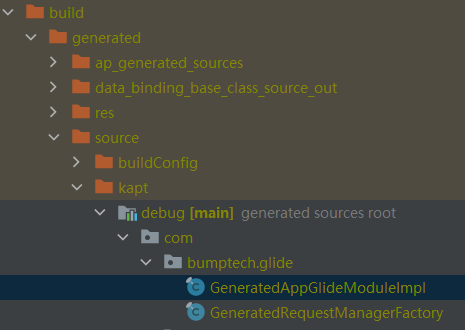
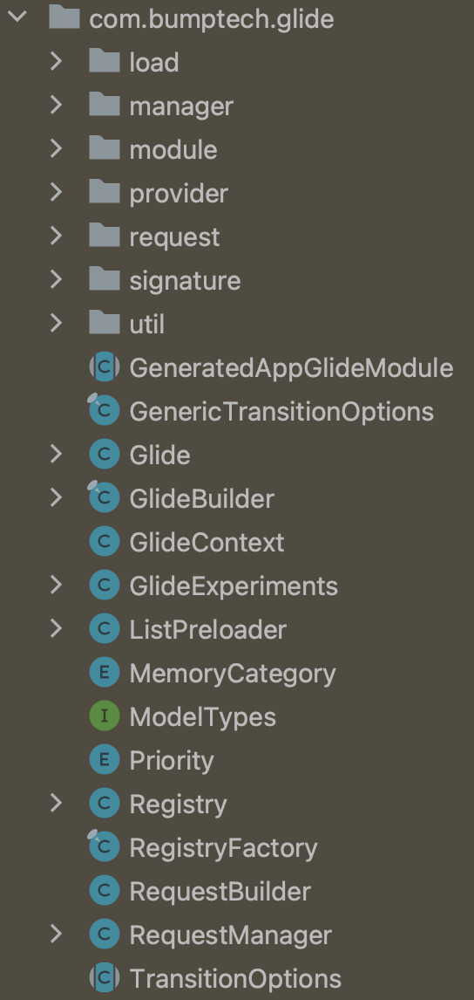
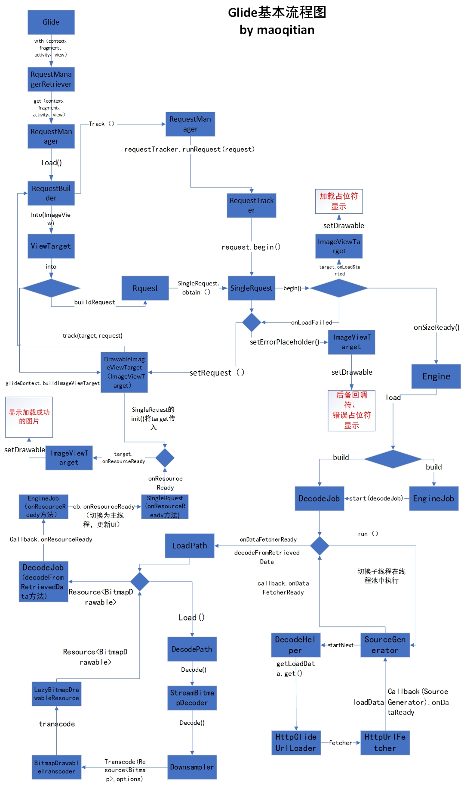

# 前置知识

GC原理，强软弱虚引用（java.lang.ref.Reference，WeakReference，ReferenceQueue），线程池，synchronized，volatile，LinkedHashMap，泛型，DiskLruCache，Bitmap，Handler，反射

Glide使用，包括自定义模块配置（比如配置通过OkHttp来请求网络）

下面对各个模块所涉及的知识点做个归纳：

加载模块：

缓存模块：

生命周期管理：androidx.lifecycle 中的Lifecycle、LifecycleRegistry、LifecycleOwner、LifecycleObserver、LifecycleEventObserver

Fragment、FragmentManager

> 基于 4.16.0
>
> 不分析 @Deprecated 标记的方法或类，比如 with() 就有几个弃用的。

# Glide 初始化流程

本节分析目标：**Glide 实例（单例）是如何完成初始化的，以及 Glide 初始化时做了什么**。

从 Glide.with() 到 Glide.get(context) 获取 Glide 实例

```kotlin
public class Glide {
	public static RequestManager with(@NonNull Context context) {
    	return getRetriever(context).get(context);
  	}

  	private static RequestManagerRetriever getRetriever(@Nullable Context context) {
    	Preconditions.checkNotNull(context, DESTROYED_ACTIVITY_WARNING);
    	return Glide.get(context).getRequestManagerRetriever();
  	}

    // 获取 Glide 单例，双重校验锁（Double checked locking）实现。
    public static Glide get(@NonNull Context context) {
    	if (glide == null) {
      		// 分析1：GeneratedAppGlideModule的作用
      		GeneratedAppGlideModule annotationGeneratedModule =
          		getAnnotationGeneratedGlideModules(context.getApplicationContext());
      		synchronized (Glide.class) {
        		if (glide == null) {
        		  checkAndInitializeGlide(context, annotationGeneratedModule);
       		 	}
     	 	}
    	}
     	return glide;
    }

  static void checkAndInitializeGlide(
      @NonNull Context context, @Nullable GeneratedAppGlideModule generatedAppGlideModule) {
    if (isInitializing) {
      throw new IllegalStateException(
          "Glide has been called recursively, this is probably an internal library error!");
    }
    
    isInitializing = true;
    try {
      initializeGlide(context, generatedAppGlideModule);
    } finally {
      isInitializing = false;
    }
  }

  private static void initializeGlide(
      @NonNull Context context, @Nullable GeneratedAppGlideModule generatedAppGlideModule) {
    // 分析2：GlideBuilder的作用
    initializeGlide(context, new GlideBuilder(), generatedAppGlideModule);
  }

  private static void initializeGlide(
      @NonNull Context context,
      @NonNull GlideBuilder builder,
      @Nullable GeneratedAppGlideModule annotationGeneratedModule) {
    // 无论with()传入的参数是什么，用于初始化 Glide 的 Context 总是 ApplicationContext
    Context applicationContext = context.getApplicationContext();
    
    // 分析3start：过时的Manifest自定义模块解析，一般项目中不会再用了
    List<GlideModule> manifestModules = Collections.emptyList();
    if (annotationGeneratedModule == null || annotationGeneratedModule.isManifestParsingEnabled()) {
      // 解析清单文件配置的自定义GlideModule的metadata标签，返回一个GlideModule集合
      manifestModules = new ManifestParser(applicationContext).parse();
    }

    if (annotationGeneratedModule != null
        && !annotationGeneratedModule.getExcludedModuleClasses().isEmpty()) {
      Set<Class<?>> excludedModuleClasses = annotationGeneratedModule.getExcludedModuleClasses();
      Iterator<GlideModule> iterator = manifestModules.iterator();
      while (iterator.hasNext()) {
        GlideModule current = iterator.next();
        if (!excludedModuleClasses.contains(current.getClass())) {
          continue;
        }
        ...
        iterator.remove();
      }
    }
    // 分析3-end
...
    // 分析4 RequestManagerRetriever 
    RequestManagerRetriever.RequestManagerFactory factory =
        annotationGeneratedModule != null
            ? annotationGeneratedModule.getRequestManagerFactory()
            : null;
    builder.setRequestManagerFactory(factory);
	
    // 已过时的Manifest处理，一搬不会用到了
    for (GlideModule module : manifestModules) {
      module.applyOptions(applicationContext, builder);
    }

    if (annotationGeneratedModule != null) {
      annotationGeneratedModule.applyOptions(applicationContext, builder);
    }
    
    // 分析2.1：GlideBuilder.build()
    // GlideBuilder会为Glide设置一默认配置，如：Engine，RequestOptions，GlideExecutor，MemorySizeCalculator
    Glide glide = builder.build(applicationContext, manifestModules, annotationGeneratedModule);
    // 分析5
    applicationContext.registerComponentCallbacks(glide);
    Glide.glide = glide;
  }
}
```

1. 创建 GeneratedAppGlideModule 对象
2. 完成 Glide 的初始化

## 分析1：GeneratedAppGlideModule的作用

作用：用于加载我们实现的自定义模块配置

```kotlin
// 分析1.1 GeneratedAppGlideModule 是什么
GeneratedAppGlideModule annotationGeneratedModule =
// 分析1.2 使用 getAnnotationGeneratedGlideModules 获取 GeneratedAppGlideModule 实例
          getAnnotationGeneratedGlideModules(context.getApplicationContext());
```

**分析1.1 GeneratedAppGlideModule 是什么**

```kotlin
abstract class GeneratedAppGlideModule extends AppGlideModule {
  /** This method can be removed when manifest parsing is no longer supported. */
  @NonNull
  Set<Class<?>> getExcludedModuleClasses() {
    return new HashSet<>();
  }

  @Nullable
  RequestManagerRetriever.RequestManagerFactory getRequestManagerFactory() {
    return null;
  }
}

public abstract class AppGlideModule extends LibraryGlideModule implements AppliesOptions {
  /**
   * Returns {@code true} if Glide should check the AndroidManifest for {@link GlideModule}s.
   * 
   * <p>Implementations should return {@code false} after they and their dependencies have migrated
   * to Glide's annotation processor.
   *
   * <p>Returns {@code true} by default.
   */
  public boolean isManifestParsingEnabled() {
    return true;
  }

  @Override
  public void applyOptions(@NonNull Context context, @NonNull GlideBuilder builder) {
    // Default empty impl.
  }
}
```

1. 项目中，会通过继承 AppGlideModule（并用注解@GlideModule标记）  来自定义模块配置Glide。比如，配置OkHttp请求网络数据并添加日志拦截器。

   ```kotlin
   @GlideModule
   class GlideOkHttpModule : AppGlideModule() {
   
       override fun registerComponents(context: Context, glide: Glide, registry: Registry) {
           val httpLoggingInterceptor = HttpLoggingInterceptor()
           httpLoggingInterceptor.setLevel(HttpLoggingInterceptor.Level.BODY)
   
           Log.i(TAG, "registerComponents: ")
           val client: OkHttpClient = OkHttpClient.Builder()
               .retryOnConnectionFailure(true)
               .addInterceptor(httpLoggingInterceptor)
               .addInterceptor(ProgressInterceptor())
               .connectTimeout(6, TimeUnit.SECONDS)
               .build()
   
           registry.replace(
               GlideUrl::class.java, InputStream::class.java, OkHttpUrlLoader.Factory(client)
           )
       }
   
       override fun applyOptions(context: Context, builder: GlideBuilder) {
           super.applyOptions(context, builder)
       }
   
       // 关闭过时的 Manifest 自定义配置解析
       override fun isManifestParsingEnabled(): Boolean {
           return false
       }
   }
   ```

   自定义模块后，build会通过注解处理器生成一个类，如下：

   

   ```kotlin
   final class GeneratedAppGlideModuleImpl extends GeneratedAppGlideModule {
     private final GlideOkHttpModule appGlideModule;
   
     public GeneratedAppGlideModuleImpl(Context context) {
       appGlideModule = new GlideOkHttpModule();
       ...
     }
   
     @Override
     public void applyOptions(@NonNull Context context, @NonNull GlideBuilder builder) {
       appGlideModule.applyOptions(context, builder);
     }
   
     @Override
     public void registerComponents(@NonNull Context context, @NonNull Glide glide,
         @NonNull Registry registry) {
       new OkHttpLibraryGlideModule().registerComponents(context, glide, registry);
       appGlideModule.registerComponents(context, glide, registry);
     }
   
     @Override
     public boolean isManifestParsingEnabled() {
       return appGlideModule.isManifestParsingEnabled();
     }
   
     @Override
     @NonNull
     public Set<Class<?>> getExcludedModuleClasses() {
       return Collections.emptySet();
     }
   
     @Override
     @NonNull
     GeneratedRequestManagerFactory getRequestManagerFactory() {
       return new GeneratedRequestManagerFactory();
     }
   }
   ```

   类名称：com.bumptech.glide.GeneratedAppGlideModuleImpl

   这个类中会把我们的自定义模块实例包含进去，这样在运行时、Glide初始化时，会通过反射加载此类（分析1.2中），从而拿到我们的自定义配置信息。

2. **实践建议**。`isManifestParsingEnabled()`注释提到：当我们的项目从 `通过 AndroidManifest 自定义模块` 迁移到 `用注解（@GlideModule）来自定义模块` 时，要将`isManifestParsingEnabled()` 的返回值设置为 false。

   `通过 AndroidManifest 自定义模块`：这种实现方式在运行时需要解析 xml，已经过时了，被 `用注解（@GlideModule）来自定义模块` 替代了，新的方式利用了编译时注解生成类，在运行时通过反射生成类，然后获取到我们的配置类。

**分析1.2 使用 getAnnotationGeneratedGlideModules 获取 GeneratedAppGlideModule 实例**

```kotlin
  private static GeneratedAppGlideModule getAnnotationGeneratedGlideModules(Context context) {
    GeneratedAppGlideModule result = null;
    try {
      Class<GeneratedAppGlideModule> clazz =
          (Class<GeneratedAppGlideModule>)
              Class.forName("com.bumptech.glide.GeneratedAppGlideModuleImpl");
      result =
          clazz.getDeclaredConstructor(Context.class).newInstance(context.getApplicationContext());
    } catch (ClassNotFoundException e) {
      ...
    }
    return result;
  }
```

通过反射生成GeneratedAppGlideModule类。

## 分析2：GlideBuilder

GlideBuilder 是用来创建 Glide 实例的类，其中包含了很多个 get/set 方法。

在GlideBuilder#build()中，设置 BitmapPool、MemoryCache、ArrayPool、RequestManagerRetriever、Engine等，最终这些设置用作参数创建 Glide 实例。

**分析2.1：GlideBuilder.build()**

```kotlin
Glide glide = builder.build(applicationContext, manifestModules, annotationGeneratedModule);
```

[GlideBuilder.build()源码解析](##GlideBuilder)

## 分析3start：过时的Manifest自定义模块解析

一般项目中不会再用了

## 分析4 RequestManagerRetriever.RequestManagerFactory

作用：RequestManager工厂，用于生成 RequestManager。

使用了自定义模块功能后，会自动生成一个类：

```kotlin
final class GeneratedRequestManagerFactory implements RequestManagerRetriever.RequestManagerFactory {
  @Override
  @NonNull
  public RequestManager build(@NonNull Glide glide, @NonNull Lifecycle lifecycle,
      @NonNull RequestManagerTreeNode treeNode, @NonNull Context context) {
    return new GlideRequests(glide, lifecycle, treeNode, context);
  }
}
```

GlideRequests 是 RequestManager 的具体实现，但是如果没有其他自定义的话，内部实现默认都是用的父类（RequestManager）的方法。

## 分析5：Glide 实现 ComponentCallbacks2 接口

Glide 实现了 ComponentCallbacks2 接口来实现内存的管理，系统内存变化时回调到 onTrimMemory 方法。


# 总览

下面将 Glide 分成了几个模块，先有个整体的印象，采用自顶向下的方法分析源码。

按照逻辑功能划分，可以把 Glide 框架大体分成如下几个部分：


加载一张网络图片的最简代码如下：

```java
Glide.with(this).load(url).into(imgView);
```

首次使用 Glide 加载一张图片，流程如下：


上面的流程是简化版，通过这张图能直观的了解到 Glide 的加载流程以及机制。

# 模块介绍

根据模块学习事半功倍，先看看 Glide 的分包结构：



## Glide

Glide 是**单例类**，通过 Glide#get(Context) 方法可以获取到实例。

Glide 类算是个**全局的配置类**，Encoder、Decoder、ModelLoader、Pool 等等都在这里设置，此外还提供了创建 RequestManager 的接口（Glide#with() 方法）。

使用 Glide 时会最先调用 Glide#with() 方法创建 RequestManager，Glide 中的 with() 方法有五个重载：

```java
RequestManager with(Context context)
RequestManager with(android.app.Activity)
RequestManager with(android.app.Fragment)
RequestManager with(android.support.v4.app.Fragment)
RequestManager with(android.support.v4.app.FragmentActivity)
```

Glide#with() 方法会将 RequestManager 的创建委托给 RequestManagerRetriever，RequestManagerRetriever 为单例类，调用 get(Context) 创建 RequestManager。

## GlideBuilder

GlideBuilder 是用来创建 Glide 实例的类，其中包含了很多个 get/set 方法，在GlideBuilder#build()中，设置 BitmapPool、MemoryCache、ArrayPool、RequestManagerRetriever、Engine等，最终这些设置用作参数创建 Glide 实例。

```kotlin
  Glide build(
      @NonNull Context context,
      List<GlideModule> manifestModules,
      AppGlideModule annotationGeneratedGlideModule) {
    if (sourceExecutor == null) {
      sourceExecutor = GlideExecutor.newSourceExecutor();
    }

    if (diskCacheExecutor == null) {
      diskCacheExecutor = GlideExecutor.newDiskCacheExecutor();
    }

    if (animationExecutor == null) {
      animationExecutor = GlideExecutor.newAnimationExecutor();
    }

    // 创建内存大小计算器
    if (memorySizeCalculator == null) {
      memorySizeCalculator = new MemorySizeCalculator.Builder(context).build();
    }

    if (connectivityMonitorFactory == null) {
      connectivityMonitorFactory = new DefaultConnectivityMonitorFactory();
    }
      
    // 创建 Bitmap 池
    if (bitmapPool == null) {
      int size = memorySizeCalculator.getBitmapPoolSize();
      if (size > 0) {
        bitmapPool = new LruBitmapPool(size);
      } else {
        bitmapPool = new BitmapPoolAdapter();
      }
    }
	// 创建数组池
    if (arrayPool == null) {
      arrayPool = new LruArrayPool(memorySizeCalculator.getArrayPoolSizeInBytes());
    }
	// 创建内存缓存
    if (memoryCache == null) {
      memoryCache = new LruResourceCache(memorySizeCalculator.getMemoryCacheSize());
    }
	// 创建磁盘缓存
    if (diskCacheFactory == null) {
      diskCacheFactory = new InternalCacheDiskCacheFactory(context);
    }

    if (engine == null) {
      engine =
          new Engine(memoryCache,diskCacheFactory,diskCacheExecutor,sourceExecutor,GlideExecutor.newUnlimitedSourceExecutor(),
              animationExecutor,isActiveResourceRetentionAllowed);
    }

    if (defaultRequestListeners == null) {
      defaultRequestListeners = Collections.emptyList();
    } else {
      defaultRequestListeners = Collections.unmodifiableList(defaultRequestListeners);
    }

    GlideExperiments experiments = glideExperimentsBuilder.build();
    // 分析：创建 RequestManagerRetriever
    RequestManagerRetriever requestManagerRetriever = new RequestManagerRetriever(requestManagerFactory);

    return new Glide(
        context,engine,memoryCache,bitmapPool,arrayPool,requestManagerRetriever,connectivityMonitorFactory,
        logLevel,defaultRequestOptionsFactory,defaultTransitionOptions,defaultRequestListeners,manifestModules,
        annotationGeneratedGlideModule,experiments);
  }
```

- 分析：创建 RequestManagerRetriever

## manager

com.bumptech.glide.manager

### RequestManagerRetriever

```kotlin
public class RequestManagerRetriever implements Handler.Callback {
  public RequestManagerRetriever(@Nullable RequestManagerFactory factory) {
    this.factory = factory != null ? factory : DEFAULT_FACTORY;
    lifecycleRequestManagerRetriever = new LifecycleRequestManagerRetriever(this.factory);
    frameWaiter = buildFrameWaiter();
  }
    
  @NonNull
  public RequestManager get(@NonNull FragmentActivity activity) {
    if (Util.isOnBackgroundThread()) {
      return get(activity.getApplicationContext());
    }
    assertNotDestroyed(activity);
    frameWaiter.registerSelf(activity);
    boolean isActivityVisible = isActivityVisible(activity);
    Glide glide = Glide.get(activity.getApplicationContext());
    return lifecycleRequestManagerRetriever.getOrCreate(
        activity,
        glide,
        activity.getLifecycle(),
        activity.getSupportFragmentManager(),
        isActivityVisible);
  }

  // 默认的 RequestManagerFactory
  private static final RequestManagerFactory DEFAULT_FACTORY =
      new RequestManagerFactory() {
        @NonNull
        @Override
        public RequestManager build(
            @NonNull Glide glide,
            @NonNull Lifecycle lifecycle,
            @NonNull RequestManagerTreeNode requestManagerTreeNode,
            @NonNull Context context) {
          return new RequestManager(glide, lifecycle, requestManagerTreeNode, context);
        }
      };    
}
```

- 构造方法中
  1. 使用默认的RequestManagerFactory
  2. 将 Lifecycle 和 RequestManager 进行绑定
  3. [LifecycleRequestManagerRetriever](##LifecycleRequestManagerRetriever)

生命周期绑定情况：

在RequestManagerRetriever中，会创建 RequestManager，并最终根据 Context 的类型决定监听Applicantion或Activity/Fragment的生命周期：

1. 对于androidx中的Activity和Fragment，会获取到 Activity和Fragment 中的Lifecycle， 并由 LifecycleRequestManagerRetriever 将 Lifecycle 和 RequestManager 进行绑定。从而实现对生命周期的监听。
2. 对于非androidx中的Activity和Fragment、以及Applicantion Context、在子线程中调用with()，都会绑定 Applicantion 的生命周期回调。
3. 子线程发起 Glide 请求或传入对象为 ApplicationContext，生命周期与 APP 周期保持一致。

### LifecycleRequestManagerRetriever

```kotlin
final class LifecycleRequestManagerRetriever {
  // 将 Lifecycle 和 RequestManager 生成 Map 键值对缓存起来
  @Synthetic final Map<Lifecycle, RequestManager> lifecycleToRequestManager = new HashMap<>();
  @NonNull private final RequestManagerFactory factory;

  LifecycleRequestManagerRetriever(@NonNull RequestManagerFactory factory) {
    this.factory = factory;
  }

  RequestManager getOnly(Lifecycle lifecycle) {
    Util.assertMainThread();
    return lifecycleToRequestManager.get(lifecycle);
  }

  RequestManager getOrCreate(
      Context context,
      Glide glide,
      final Lifecycle lifecycle,
      FragmentManager childFragmentManager,
      boolean isParentVisible) {
    Util.assertMainThread();
    RequestManager result = getOnly(lifecycle);
    if (result == null) {
      // 监听Lifecycle方法
      LifecycleLifecycle glideLifecycle = new LifecycleLifecycle(lifecycle);
      // 分析：RequestManagerFactory 生成 RequestManager
      result =
          factory.build(
              glide,
              glideLifecycle,
              new SupportRequestManagerTreeNode(childFragmentManager),
              context);
      lifecycleToRequestManager.put(lifecycle, result);
      glideLifecycle.addListener(
          new LifecycleListener() {
            @Override
            public void onStart() {}

            @Override
            public void onStop() {}

            @Override
            public void onDestroy() {
              lifecycleToRequestManager.remove(lifecycle);
            }
          });
      if (isParentVisible) {
        result.onStart();
      }
    }
    return result;
  }

  private final class SupportRequestManagerTreeNode implements RequestManagerTreeNode {
    private final FragmentManager childFragmentManager;

    SupportRequestManagerTreeNode(FragmentManager childFragmentManager) {
      this.childFragmentManager = childFragmentManager;
    }

    // 返回当前上下文的所有后代的 RequestManager。
    @NonNull
    @Override
    public Set<RequestManager> getDescendants() {
      Set<RequestManager> result = new HashSet<>();
      getChildFragmentsRecursive(childFragmentManager, result);
      return result;
    }

    private void getChildFragmentsRecursive(
        FragmentManager fragmentManager, Set<RequestManager> requestManagers) {
      List<Fragment> children = fragmentManager.getFragments();
      for (int i = 0, size = children.size(); i < size; i++) {
        Fragment child = children.get(i);
        getChildFragmentsRecursive(child.getChildFragmentManager(), requestManagers);
        RequestManager fromChild = getOnly(child.getLifecycle());
        if (fromChild != null) {
          requestManagers.add(fromChild);
        }
      }
    }
  }
}
```

- 分析：RequestManagerFactory 生成 RequestManager，最终是：new RequestManager(glide, lifecycle, requestManagerTreeNode, context)

  ```kotlin
    private static final RequestManagerFactory DEFAULT_FACTORY =
        new RequestManagerFactory() {
          @NonNull
          @Override
          public RequestManager build(
              @NonNull Glide glide,
              @NonNull Lifecycle lifecycle,
              @NonNull RequestManagerTreeNode requestManagerTreeNode,
              @NonNull Context context) {
            return new RequestManager(glide, lifecycle, requestManagerTreeNode, context);
          }
        };
  ```

### LifecycleLifecycle

作用：监听Activity和Fragment的生命周期，比如 RequestManager 就实现了 LifecycleListener，从而可以通过此类来监听生命周期方法的。

流程：

1. RequestManager 实现 LifecycleListener 接口
2. RequestManager 通过 LifecycleLifecycle#addListener 添加到 LifecycleLifecycle 中
3. RequestManager 接收回调：Activity#onDestroy() -> LifecycleLifecycle#onDestroy(LifecycleOwner owner) -> LifecycleListener#onDestroy()

com.bumptech.glide.manager.Lifecycle

```kotlin
/** An interface for listening to Activity/Fragment lifecycle events. */
public interface Lifecycle {
  /** Adds the given listener to the set of listeners managed by this Lifecycle implementation. */
  void addListener(@NonNull LifecycleListener listener);

  /**
   * Removes the given listener from the set of listeners managed by this Lifecycle implementation,
   * returning {@code true} if the listener was removed successfully, and {@code false} otherwise.
   *
   * <p>This is an optimization only, there is no guarantee that every added listener will
   * eventually be removed.
   */
  void removeListener(@NonNull LifecycleListener listener);
}
```

com.bumptech.glide.manager.LifecycleListener

```kotlin
public interface LifecycleListener {

  /**
   * Callback for when {@link android.app.Fragment#onStart()}} or {@link
   * android.app.Activity#onStart()} is called.
   */
  void onStart();

  /**
   * Callback for when {@link android.app.Fragment#onStop()}} or {@link
   * android.app.Activity#onStop()}} is called.
   */
  void onStop();

  /**
   * Callback for when {@link android.app.Fragment#onDestroy()}} or {@link
   * android.app.Activity#onDestroy()} is called.
   */
  void onDestroy();
}
```

LifecycleLifecycle 对 androidx.lifecycle.Lifecycle 做了一次包装，并注册了对 androidx.lifecycle.Lifecycle 的监听，当生命周期发生变化时，会回调到LifecycleLifecycle 的对应方法中。

Glide中对Activity和Fragment的生命周期监听是通过 LifecycleLifecycle、LifecycleListener 间接完成的。

```kotlin
final class LifecycleLifecycle implements Lifecycle, LifecycleObserver {
  @NonNull
  private final Set<LifecycleListener> lifecycleListeners = new HashSet<LifecycleListener>();

  @NonNull private final androidx.lifecycle.Lifecycle lifecycle;

  LifecycleLifecycle(androidx.lifecycle.Lifecycle lifecycle) {
    this.lifecycle = lifecycle;
    lifecycle.addObserver(this);
  }

  @OnLifecycleEvent(Event.ON_START)
  public void onStart(@NonNull LifecycleOwner owner) {
    for (LifecycleListener lifecycleListener : Util.getSnapshot(lifecycleListeners)) {
      lifecycleListener.onStart();
    }
  }

  @OnLifecycleEvent(Event.ON_STOP)
  public void onStop(@NonNull LifecycleOwner owner) {
    for (LifecycleListener lifecycleListener : Util.getSnapshot(lifecycleListeners)) {
      lifecycleListener.onStop();
    }
  }

  @OnLifecycleEvent(Event.ON_DESTROY)
  public void onDestroy(@NonNull LifecycleOwner owner) {
    for (LifecycleListener lifecycleListener : Util.getSnapshot(lifecycleListeners)) {
      lifecycleListener.onDestroy();
    }
    owner.getLifecycle().removeObserver(this);
  }

  @Override
  public void addListener(@NonNull LifecycleListener listener) {
    lifecycleListeners.add(listener);

    if (lifecycle.getCurrentState() == State.DESTROYED) {
      listener.onDestroy();
    } else if (lifecycle.getCurrentState().isAtLeast(State.STARTED)) {
      listener.onStart();
    } else {
      listener.onStop();
    }
  }

  @Override
  public void removeListener(@NonNull LifecycleListener listener) {
    lifecycleListeners.remove(listener);
  }
}
```

思考：为什么 Glide 要对 androidx.lifecycle.Lifecycle 做一次包装？

### RequestManager

RequestManager 作用：

1. 创建 RequestBuilder ；
2. 将图片加载的生命周期与Activity/Fragment的生命周期进行绑定。添加生命周期监听；实现了`LifecycleListener` 接口，处理回调
3. 通过生命周期管理请求的启动结束等。

- RequestManager构造方法

```kotlin
  RequestManager(
      Glide glide,
      Lifecycle lifecycle,
      RequestManagerTreeNode treeNode,
      RequestTracker requestTracker,
      ConnectivityMonitorFactory factory,
      Context context) {
    this.glide = glide;
    this.lifecycle = lifecycle;
    this.treeNode = treeNode;
    this.requestTracker = requestTracker;
    this.context = context;

    connectivityMonitor =
        factory.build(
            context.getApplicationContext(),
            new RequestManagerConnectivityListener(requestTracker));

    glide.registerRequestManager(this);

    if (Util.isOnBackgroundThread()) {
      Util.postOnUiThread(addSelfToLifecycle);
    } else {
      // 分析：添加生命周期监听
      lifecycle.addListener(this);
    }
    lifecycle.addListener(connectivityMonitor);

    defaultRequestListeners =
        new CopyOnWriteArrayList<>(glide.getGlideContext().getDefaultRequestListeners());
    setRequestOptions(glide.getGlideContext().getDefaultRequestOptions());
  }
```

- 分析：添加生命周期监听，并处理回调

  当前页面被销毁或者不可见时会停止加载图片

  ```kotlin
    @Override
    public synchronized void onStart() {
      // 恢复请求
      resumeRequests();
      targetTracker.onStart();
    }
  
    @Override
    public synchronized void onStop() {
      targetTracker.onStop();
      // 暂停或者清除请求，取决于是否调用过方法 RequestManager#clearOnStop()
      if (clearOnStop) {
        clearRequests();
      } else {
        pauseRequests();
      }
    }
  
    @Override
    public synchronized void onDestroy() {
      // 清除请求；移除生命周期监听；
      targetTracker.onDestroy();
      clearRequests();
      requestTracker.clearRequests();
      lifecycle.removeListener(this);
      lifecycle.removeListener(connectivityMonitor);
      Util.removeCallbacksOnUiThread(addSelfToLifecycle);
      glide.unregisterRequestManager(this);
    }
  ```

- 通过load() 创建 RequestBuilder


```java
RequestBuilder<Drawable> load(@Nullable Bitmap bitmap);
RequestBuilder<Drawable> load(@Nullable Drawable drawable);
RequestBuilder<Drawable> load(@Nullable String string);
RequestBuilder<Drawable> load(@Nullable Uri uri);
RequestBuilder<Drawable> load(@Nullable File file);
RequestBuilder<Drawable> load(@RawRes @DrawableRes @Nullable Integer resourceId);
RequestBuilder<Drawable> load(@Nullable URL url);
RequestBuilder<Drawable> load(@Nullable byte[] model);
RequestBuilder<Drawable> load(@Nullable Object model);
```

这些重载方法，每一个都代表不同的加载源。除此之外还有两个方法，是用来下载图片的：

```java
RequestBuilder<File> downloadOnly();
RequestBuilder<File> download(@Nullable Object model);
```

## RequestBuilder

```kotlin
public class RequestBuilder<TranscodeType> extends BaseRequestOptions<RequestBuilder<TranscodeType>>
    implements Cloneable, ModelTypes<RequestBuilder<TranscodeType>> {

  protected RequestBuilder(
      @NonNull Glide glide,
      RequestManager requestManager,
      Class<TranscodeType> transcodeClass,
      Context context) {
    this.glide = glide;
    this.requestManager = requestManager;
    this.transcodeClass = transcodeClass;
    this.context = context;
    this.transitionOptions = requestManager.getDefaultTransitionOptions(transcodeClass);
    this.glideContext = glide.getGlideContext();

	// 从 RequestManager 中获取请求监听器
    initRequestListeners(requestManager.getDefaultRequestListeners());
    // 从 RequestManager 中获取请求配置
    apply(requestManager.getDefaultRequestOptions());
  }

  public RequestBuilder<TranscodeType> load(@Nullable String string) {
    return loadGeneric(string);
  }

  @NonNull
  private RequestBuilder<TranscodeType> loadGeneric(@Nullable Object model) {
    if (isAutoCloneEnabled()) {
      return clone().loadGeneric(model);
    }
    this.model = model;
    isModelSet = true;
    return selfOrThrowIfLocked();
  }

  // 分析：into(ImageView view)
  @NonNull
  public ViewTarget<ImageView, TranscodeType> into(@NonNull ImageView view) {
    // 确保在主线程
    Util.assertMainThread();
    // view 不为 null
    Preconditions.checkNotNull(view);

    BaseRequestOptions<?> requestOptions = this;
    // 判断是否支持转换
    if (!requestOptions.isTransformationSet()
        && requestOptions.isTransformationAllowed()
        && view.getScaleType() != null) {
      // 支持转换，根据图片的 ScaleType 进行转换配置
      switch (view.getScaleType()) {
        case CENTER_CROP:
          requestOptions = requestOptions.clone().optionalCenterCrop();
          break;
        case CENTER_INSIDE:
          requestOptions = requestOptions.clone().optionalCenterInside();
          break;
        case FIT_CENTER:
        case FIT_START:
        case FIT_END:
          requestOptions = requestOptions.clone().optionalFitCenter();
          break;
        case FIT_XY:
          requestOptions = requestOptions.clone().optionalCenterInside();
          break;
        case CENTER:
        case MATRIX:
        default:
          // Do nothing.
      }
    }

    return into(
        // 将 View 封装到 BitmapImageViewTarget 或者 DrawableImageViewTarget 中。
        glideContext.buildImageViewTarget(view, transcodeClass),
        /* targetListener= */ null,
        requestOptions,
        // 用于将 Rununable 切换到主线程执行
        Executors.mainThreadExecutor());
  }
	
  // 分析：into(Y target, RequestListener<TranscodeType> targetListener,BaseRequestOptions<?> options,Executor callbackExecutor)
  private <Y extends Target<TranscodeType>> Y into(
      @NonNull Y target,
      @Nullable RequestListener<TranscodeType> targetListener,
      BaseRequestOptions<?> options,
      Executor callbackExecutor) {
    Preconditions.checkNotNull(target);
    if (!isModelSet) {
      throw new IllegalArgumentException("You must call #load() before calling #into()");
    }

    // 创建请求
    Request request = buildRequest(target, targetListener, options, callbackExecutor);

    Request previous = target.getRequest();
    if (request.isEquivalentTo(previous)
        && !isSkipMemoryCacheWithCompletePreviousRequest(options, previous)) {
      if (!Preconditions.checkNotNull(previous).isRunning()) {
        previous.begin();
      }
      return target;
    }

    requestManager.clear(target);
    // 请求和target进行关联
    target.setRequest(request);
    // 发起请求
    requestManager.track(target, request);

    return target;
  }
}
```

- 构造方法：从 RequestManager 中获取请求监听器；从 RequestManager 中获取请求参数RequestOption

- load()：将 需要加载的资源地址 向上转型成 Object，作为 model 持有着，用于后续加载使用

- 分析：into(ImageView view)

  将 View 封装到 BitmapImageViewTarget 或者 DrawableImageViewTarget 中。

- 分析：into(Y target, RequestListener<TranscodeType> targetListener,BaseRequestOptions<?> options,Executor callbackExecutor)

  创建请求；

  请求和target进行关联；

  将请求交给 RequestManager

  ```kotlin
  RequestManager#track
    synchronized void track(@NonNull Target<?> target, @NonNull Request request) {
      targetTracker.track(target);
      // 由 RequestTracker 负责执行请求
      requestTracker.runRequest(request);
    }
  ```


## Request

request 包下面的是封装的请求，里面有一个 Request 接口，估计所有的请求都是基于这个接口的：


接口定义了对请求的开始、结束、状态获取、回收等操作，所以请求中不仅包含基本的信息，还负责管理请求。
Request 主要的实现类有三个：

1. SingleRequest
2. ThumbnailRequestCoordinator
3. ErrorRequestCoordinator

### SingleRequest

这个类负责执行请求并将结果反映到 Target 上。

使用 Glide 加载图片时，会先根据 Target 类型创建不同的 Target，然后 RequestBuilder 将这个 target 当做参数创建 Request 对象，Request 与 Target 就是这样关联起来的。

这里就会先创建一个包含 Target 的 SingleRequest 对象。考虑到性能问题，可能会连续创建很多个 SingleRequest 对象，所以使用了对象池来做缓存。

再来说说 SingleRequest 的请求发起流程。

我们经常在 Activity#onCreate 方法中直接使用 Glide 方法，但此时的图片大小还未确定，所以调用 Request#begin 时并不会直接发起请求，而是等待 ImageView 初始化完成，对于 ViewTarget 以及其子类来说，会注册View 的 OnPreDrawListener 事件，等待 View 初始化完成后就调用 SingleRequest#onSizeReady 方法，这个方法里就会开始加载图片了。

onSizeReady 方法并不会去直接加载图片，而是调用了 Engine#load 方法加载，这个方法差不多有二十个参数，所以 onSizeReady 方法算是用来构建参数列表并且调用 Engine#load 方法的。

clear 方法用于停止并清除请求，主要就是从 Engine 中移除掉这个任务以及回调接口。
另外，SingleRequest 实现了 ResourceCallback 接口，这个接口就两个方法：

```java
void onResourceReady(Resource<?> resource, DataSource dataSource);
void onLoadFailed(GlideException e);
```

即资源加载完成和加载失败的两个回调方法，刚刚说的 Engine#load 方法中有差不多二十个参数，其中有一个参数就是这个接口。

那再来说这两个方法在 SingleRequest 中的实现。重点就是调用 Target#onResourceReady 方法以及构建图片加载完成的动画，另外还要通知 ThumbnailRequestCoordinator 图片加载完成。
onLoadFailed 方法流程大体上也类似 onResourceReady。

### ThumbnailRequestCoordinator

这个类是用来**协调两个请求**，因为有的请求需要同时加载原图和缩略图，比如启动这两个请求、原图加载完成后缩略图其实就不需要加载了等等，这些控制都由这个类来操作。
RequestBuilder 中会将缩略图和原图的两个 SingleRequest 都交给它，后面再对其操作时都由这个类来同一控制。
所以这个类其实没什么太多的功能，就是对两个对象的一个统一个管理协调包装。

### ErrorRequestCoordinator

RequestBuilder 的父类 BaseRequestOptions 中有几个 error 的重载方法：

```java
T error(@Nullable Drawable drawable);
T error(@DrawableRes int resourceId);
```

一般地，我们会使用这个方法设置一个加载失败时的填充图，大部分情况下都是一个通过 resource 资源文件中获取到的图片 ID 或者 Drawable。
但 RequestBuilder 中还提供了另一个 error 方法：

```java
RequestBuilder<TranscodeType> error(@Nullable RequestBuilder<TranscodeType> errorBuilder);
```

考虑这样的一个场景，当加载失败时可能希望继续去通过网络或者别的什么加载另一张图片，例如：

```java
Glide.with(context)
    .load((Object) null)
    .error(
        Glide.with(context)
            .load(errorModel)
            .listener(requestListener))
    .submit();
```

当这样使用 error 时最终就会创建一个 ErrorRequestCoordinator 对象，这个类的功能类似 ThumbnailRequestCoordinator，主要用来协调 ThumbnailRequestCoordinator 以及 error 中的 Request。

### Target

Target 代表一个**可被 Glide 加载并且具有生命周期的资源**。当调用 RequestBuilder#into 方法时会根据传入参数创建对应类型的 Target 实现类。

表示加载完成后的图片应该放在哪， Target 默认提供了很多很有用的实现类，我们也可以自定义 Target。

Glide 默认提供了用于放在 ImageView 上的 ImageViewTarget（以及其各种子类）、放在 AppWidget 上的 AppWidgetTarget、用于同步加载图片的 FutureTarget（只有一个实现类：RequestFutureTarget）等等。

#### ImageViewTargetFactory

根据 Class 的类型，判断使用 BitmapImageViewTarget 还是 DrawableImageViewTarget。

```kotlin
public class ImageViewTargetFactory {
  @NonNull
  @SuppressWarnings("unchecked")
  public <Z> ViewTarget<ImageView, Z> buildTarget(
      @NonNull ImageView view, @NonNull Class<Z> clazz) {
    if (Bitmap.class.equals(clazz)) {
      return (ViewTarget<ImageView, Z>) new BitmapImageViewTarget(view);
    } else if (Drawable.class.isAssignableFrom(clazz)) {
      return (ViewTarget<ImageView, Z>) new DrawableImageViewTarget(view);
    } else {
      throw new IllegalArgumentException(
          "Unhandled class: " + clazz + ", try .as*(Class).transcode(ResourceTranscoder)");
    }
  }
}
```

#### CustomViewTarget

这个是抽象类，负责加载 Bitmap、Drawable 并且放到 View 上。

如果在 View 还未初始化完成时就调用了 Glide 加载图片会等待加载完成再去执行 onSizeReady 方法，那如何监听 View 初始化完成呢？
CustomViewTarget 会调用 View#addOnAttachStateChangeListener 方法添加一个监听器，这个监听器可以监听到 View 被添加到 Widow 以及移除 Window 时的事件，从而更好的管理 Request 生命周期。

另外，构建好的 Request 会通过 View#setTag 方法存入 View 中，后面再通过 View#getTag 方法获取。

但这个抽象类并没有实现类，也没有被使用过，View 相关的 Target 都是继承 ViewTarget 抽象基类，但这个类已经被标记为过期类了，推荐将 ViewTarget 替换成 CustomViewTarget 使用。

#### ViewTarget

继承了抽象类 BaseTarget，实现了 Target 接口的 setRequest 以及 getRequest 方法。
ViewTarget 基本上类似 CustomViewTarget ，只是具体的实现上有点不同。

#### ImageViewTarget

这是加载到 ImageView 上的 Target，继承了 ViewTarget，同样也是个**抽象类**。

构造器中限定了**必须传入 ImageView 或者其子类**，图片数据加载完成后会回调其中的 onResourceReady 方法，第一步是将图片设置给 ImageView，第二部是判断是否需要使用动画，需要的话就执行动画。

ImageViewTarget 的实现类比较多，总共有 5 个，但内容都很简单，主要用于区分加载的资源时 Bitmap 类型还是 Drawable 类型，这个在构建请求时确定，默认的加载请求最终都是 Drawable 类型，但如果构建请求时调用了 asBitmap 方法那就资源就会被转成 Bitmap 类型，另外一个就是资源使用缩略图展示。

#### RequestFutureTarget

用来同步加载图片的 Target，调用 RequestBuilder#submit 将会返回一个 FutureTarget，调用 get 方法即可获取到加载的资源对象。

#### AppWidgetTarget

用于将下载的 Bitmap 设置到 RemoteView 上。

#### NotificationTarget

与 AppWidgetTarget 类似，不同的是这是用来将 Bitmap 设置到 Notification 中的 RemoteView 上。

## module

module 包下面的 GlideModel 比较重要，需要详细说一下。

这是用来**延迟设置 Glide 相关参数**的，可以通过这个接口使 Glide 在初始化时应用我们的设置，因为 Glide 是单例类，通过这个设置可以保证在 Glide 单例类初始时，所有请求发起之前应用到 Glide。

GlideModel 是个接口，所以代码很简单：

```java
@Deprecated
public interface GlideModule extends RegistersComponents, AppliesOptions { }
```

该接口被标识已过期，Glide 推荐使用 AppGlideModule 替代。

GlideModel 接口本身没有代码内容，但其继承了 RegistersComponents 与 AppliesOptions 接口，先分别看一下这两个接口。

### RegistersComponents

这是用来注册 Glide 中一些组件的，这个接口只有一个方法：

```java
void registerComponents(@NonNull Context context, @NonNull Glide glide,
      @NonNull Registry registry);
```

这个方法中提供了一个 Registry 对象，这是用来管理注册 ModelLoader、Encoder、Decoder 等等，具体可以看看 Registry 提供的公开方法。

例如我们可以在这里注册自己的 ModelLoader，比如我们的网络请求使用的 OkHttp，Glide 默认使用的是HttpURLConnection，我们想改成 OkHttp 就可以在这里设置，具体的使用方式[点此查看使用案例。](https://links.jianshu.com/go?to=https%3A%2F%2Fgithub.com%2F0xZhangKe%2FGlide-note%2Fblob%2Fmaster%2Fintegration%2Fokhttp3%2Fsrc%2Fmain%2Fjava%2Fcom%2Fbumptech%2Fglide%2Fintegration%2Fokhttp3%2FOkHttpGlideModule.java)

### AppliesOptions

这是用来管理一些 Glide 的参数设置项，同样只有一个方法。

```java
void applyOptions(@NonNull Context context, @NonNull GlideBuilder builder);
```

这个方法提供了一个 GlideBuilder 参数，这是用来构建 Glide 的，可以使用 GlideBuilder 对象提供的公开方法做一些设置，例如设置线程池、设置 BitmapPool/ArrayPoll 等等。

那么说完这两个接口，在回过头来看看 GlideModel ，通过上面的描述已经明白 GlideModel 中两个方法的作用了，再来看看如何使用。

Glide 在实例化时会解析 manifest 文件并从中获取 value 为 GlideModule 的 meta-data 配置信息，我们定义好自己的 GlideModule 之后需要在 manifest 文件中进行配置，配置方式如下：

```xml
<meta-data
        android:name="com.zhangke.glide.samples.OkHttpGlideModule"
        android:value="GlideModule"/>
```

其中 OkHttpGlideModule 必须实现 GlideModel 接口。
具体的[配置方式点此查看](https://links.jianshu.com/go?to=https%3A%2F%2Fgithub.com%2F0xZhangKe%2FGlide-note%2Ftree%2Fmaster%2Fintegration%2Fokhttp3)。

此外，Glide 默认提供了很多 ModelLoader，基本上可以满足所有场景的使用。

## load


load 包下面是加载资源的核心，里面的东西很多，也很复杂，所以我先把其中两个比较重要的接口介绍完了在介绍别的。

### ModelLoader

```kotlin
com.bumptech.glide.load.model.ModelLoader

public interface ModelLoader<Model, Data> {

  class LoadData<Data> {
    public final Key sourceKey;
    public final List<Key> alternateKeys;
    public final DataFetcher<Data> fetcher;

    public LoadData(@NonNull Key sourceKey, @NonNull DataFetcher<Data> fetcher) {
      this(sourceKey, Collections.<Key>emptyList(), fetcher);
    }

    public LoadData(
        @NonNull Key sourceKey,
        @NonNull List<Key> alternateKeys,
        @NonNull DataFetcher<Data> fetcher) {
      this.sourceKey = Preconditions.checkNotNull(sourceKey);
      this.alternateKeys = Preconditions.checkNotNull(alternateKeys);
      this.fetcher = Preconditions.checkNotNull(fetcher);
    }
  }
  
  @Nullable
  LoadData<Data> buildLoadData(
      @NonNull Model model, int width, int height, @NonNull Options options);
 
  boolean handles(@NonNull Model model);
}
```

工厂接口，用于将任意的数据模型转换为可由 DataFetcher 用于获取模型所代表的资源的数据的具体数据类型。

支持将图片按照 ImageView 大小按需加载。防止浪费内存。

Glide 初始化时会注册很多个 ModelLoader ，除了Glide 默认提供的之外还会注册用户在 manifest 中配置的 ModelLoader，就是GlideModel 一节的内容。

ModelLoader 中有两个方法以及一个内部类：LoadData：

buildLoadData 方法除了包含 Model 之外还有宽高以及 Option，所以加载图片时可以根据需要的宽高以及其他设置按需加载。返回的是 LoadData 实例。

handles 是用来判断给定模型是不是此加载器可能加载的已识别类型。

至于内部类 LoadData 呢，主要作用就是装了三个东西：

1. 用于识别资源唯一性的 Key;
2. 缓存相关的备用 Key 列表
3. DataFetcher

DataFetcher最重要，因为加载资源的根源就在这里，例如发起网络请求等等。

### DataFetcher

```java
com.bumptech.glide.load.data.DataFetcher
```

DataFetcher 是个接口，最重要的一个方法是 loadData，即**加载数据**。

内部实现是通过 HttpUrlConnect 发起网络请求，或者打开一个文件，或者使用 AssetManager 打开一个资源等。

加载完成后通过 DataFetcher$DataCallback 接口回调。

DataCallback 中包含两个方法：

```java
void onDataReady(@Nullable T data);
void onLoadFailed(@NonNull Exception e);
```

分别代表数据加载成功或者加载失败回调。

## Encoder

Encoder 是个接口，用来将给定的数据写入持久性存储介质中（文件）。

```java
public interface Encoder<T> {
  /**
   * Writes the given data to the given output stream and returns True if the write completed
   * successfully and should be committed.
   *
   * @param data The data to write.
   * @param file The File to write the data to.
   * @param options The put of options to apply when encoding.
   */
  boolean encode(@NonNull T data, 
                 @NonNull File file, 
                 @NonNull Options options);
}
```

数据加载完成之后会先使用 Encoder 将数据存入本地磁盘缓存文件中。Encoder 的实现类都是在 Glide 初始化时注册进去的。

## ResourceDecoder

与 Encoder 对应，**数据解码器**，用来**将原始数据解码成相应的数据类型**，针对不同的请求实现类都不同，例如通过网络请求最终获取到的是一个 InputStream，经过 ByteBufferBitmapDecoder 解码后再生成一个 Bitmap。

需要指出的是，这里解码时会根据 option 以及图片大小（如果有的话）按需加载 Bitmap，防止内存的浪费。

与 Encoder 一样，Glide 初始化时会注册很多个类型的 ResourceDecoder 实现类，图片数据获取到之后会根据不同的类型使用对应的解码器对其解码。

## Engine

作用：负责资源（Resource）的加载和管理（回收、加载策略）。

上面的 Request 中也讲到了 Engine 这个类，可理解为**执行引擎**，算是整个 Glide 的核心发动机。

Engine 负责管理请求以及活动资源、缓存等。主要关注 load 方法，这个方法主要做了如下几件事：

1. 通过请求构建 Key；
2. 从活动资源中获取资源（详见缓存章节），获取到则返回；
3. 从缓存中获取资源，获取到则直接返回；
4. 判断当前请求是否正在执行，是则直接返回；
5. 构建 EngineJob 与 DecodeJob 并执行。

关于缓存相关的都在缓存章节。下面说说 EngineJob 与 DecodeJob。

### Engine#load()

```kotlin
  /**
   * Starts a load for the given arguments.
   *
   * <p>Must be called on the main thread.
   *
   * <p>The flow for any request is as follows:
   *
   * <ul>
   *   <li>Check the current set of actively used resources, return the active resource if present,
   *       and move any newly inactive resources into the memory cache.
   *   <li>Check the memory cache and provide the cached resource if present.
   *   <li>Check the current set of in progress loads and add the cb to the in progress load if one
   *       is present.
   *   <li>Start a new load.
   * </ul>
   *
   * <p>Active resources are those that have been provided to at least one request and have not yet
   * been released. Once all consumers of a resource have released that resource, the resource then
   * goes to cache. If the resource is ever returned to a new consumer from cache, it is re-added to
   * the active resources. If the resource is evicted from the cache, its resources are recycled and
   * re-used if possible and the resource is discarded. There is no strict requirement that
   * consumers release their resources so active resources are held weakly.
   *
   * @param width The target width in pixels of the desired resource.
   * @param height The target height in pixels of the desired resource.
   * @param cb The callback that will be called when the load completes.
   */
  public <R> LoadStatus load(...){}
```

注释中介绍了load()方法的工作流程，即如何加载资源

1、检查当前正在活跃使用的资源列表，如果存在，就找到了，返回结果。并且移动任何新的不活跃资源到memory cache中。

**怎么理解 Active Resources（活跃资源）和 inactive resources 呢？Active Resources 的作用是什么？**

我们知道不论是 Active Resources 还是 memory cache，其实图片都已经在内存中，那区别是什么呢？为什么需要两个东西？

我们思考一个场景，有一张图片在 Activity1 中加载好了，然后用户打开了Activity2。。。这时候，系统是有可能把图片回收的。但用户之后可能又会返回Activity1，那如果不做任何处理的话，之前Activity1中加载的图片是不是又要重新加载了？这就是为什么有了  memory cache 后还要引入 Active Resources 的原因。不仅如此，注意这句话：Check the current set of actively used resources, return the active resource if present，这是不是说明 Active Resources 中的图片是支持复用的，2个 ImageView 显示一张图片时，并没有加载两张，而是共用了一张图片。

知道了为什么要用 Active Resources后，我们再来看，**Glide 是怎么把 Active Resources 移动到 memory cache 中的**。

为什么要使用弱引用呢？

There is no strict requirement that consumers release their resources so active resources are held weakly.

翻译：没有严格要求消费者释放他们的资源，因此活动资源被微弱地持有。

怎么理解这句话呢？因为Glide没有强制要求我们释放资源，所以我们在用完图片后，可能不会主动去释放图片，那就没有了告诉Glide图片不再使用的时机了。由于Glide想在我们不再使用图片时，将图片资源放到memory cache，所以Glide需要这么一个时机来做这件事。显然Glide选择通过用 WeakRef（弱引用）来实现。这就涉及到 WeakRef 的使用了，它可以监听 GC ，当监听到图片资源要被回收时，Glide会将资源添加到memory cache中，这样图片也就再次被Glide内部强引用了，也就做到了持久的保存在内存中了。

#### 小结

通过对load() 的分析，我们知道了 Glide 是怎么做缓存管理的。

### Resource 接口

作用：定义了一个资源接口，Engine 负责处理的资源都会实现此接口。

```kotlin
/**
 * A resource interface that wraps a particular type so that it can be pooled and reused.
 *
 * @param <Z> The type of resource wrapped by this class.
 */
public interface Resource<Z> {

  /** Returns the {@link Class} of the wrapped resource. */
  @NonNull
  Class<Z> getResourceClass();

  /**
   * Returns an instance of the wrapped resource.
   *
   * <p>Note - This does not have to be the same instance of the wrapped resource class and in fact
   * it is often appropriate to return a new instance for each call. For example, {@link
   * android.graphics.drawable.Drawable Drawable}s should only be used by a single {@link
   * android.view.View View} at a time so each call to this method for Resources that wrap {@link
   * android.graphics.drawable.Drawable Drawable}s should always return a new {@link
   * android.graphics.drawable.Drawable Drawable}.
   */
  @NonNull
  Z get();

  /**
   * Returns the size in bytes of the wrapped resource to use to determine how much of the memory
   * cache this resource uses.
   */
  int getSize();

  /**
   * Cleans up and recycles internal resources.
   *
   * <p>It is only safe to call this method if there are no current resource consumers and if this
   * method has not yet been called. Typically this occurs at one of two times:
   *
   * <ul>
   *   <li>During a resource load when the resource is transformed or transcoded before any consumer
   *       have ever had access to this resource
   *   <li>After all consumers have released this resource and it has been evicted from the cache
   * </ul>
   *
   * For most users of this class, the only time this method should ever be called is during
   * transformations or transcoders, the framework will call this method when all consumers have
   * released this resource and it has been evicted from the cache.
   */
  void recycle();
}
```

### EnineResource

作用：对 Resource 做了一次包装，主要是增加了【引用计数】的功能——在资源被使用或者释放时分别增加或减少计数，用来控制资源的回收。 

### ActiveResources

#### 作用

对 Active 资源进行一次缓存，并在资源不再使用时进行回收。Active 资源是什么？即正在使用的资源，是被强引用所持有的。

#### 实现原理

1、弱引用 ResourceWeakReference 的实现

作用：持有 Resource，Resource 会在 EngineResource 被回收后使用。假设这里不持有 Resource 的话，Resource 就会被 gc 掉了，也就不能做 ActiveResources 到 MemoryCache 的转化了。

ResourceWeakReference 是 ActiveResources 实现的基础，需要先知道其实现。

```Java
final class ActiveResources {
  
  static final class ResourceWeakReference extends WeakReference<EngineResource<?>> {
    final Key key;

    final boolean isCacheable;

    @Nullable
    Resource<?> resource;

    ResourceWeakReference(
        @NonNull Key key,
        @NonNull EngineResource<?> referent,
        @NonNull ReferenceQueue<? super EngineResource<?>> queue,
        boolean isActiveResourceRetentionAllowed) {
      //（1）ResourceWeakReference 直接持有的对象是 EngineResource，而不是图片资源。
      // 引用链：ResourceWeakReference -> EngineResource -> Resource -> 真正的图片资源
      //（2）支持传入 ReferenceQueue，用来在 EngineResource 被 gc 回收后，记录其对应的 ResourceWeakReference。
      super(referent, queue);
      this.key = Preconditions.checkNotNull(key);
      //（3）EngineResource 所持有的 Resource 也被 ResourceWeakReference 持有了（强引用），
      // 这意味着在 EngineResource 被回收时，Resource、图片资源其实还在内存中。
      // 这是实现 ActiveResources 转化为 MemoryCacheResource 的基础。
      this.resource =
          referent.isMemoryCacheable() && isActiveResourceRetentionAllowed
              ? Preconditions.checkNotNull(referent.getResource())
              : null;
      isCacheable = referent.isMemoryCacheable();
    }

    void reset() {
      //（4）释放资源
      resource = null;
      // 主动调用 clear 后，get方法将返回 null，即使此时 EngineResource 还没有被回收
      // 另外，主动调用，并不会将此引用加入到 ReferenceQueue 中
      // 并且之后 EngineResource 被回收了，也不会将 ResourceWeakReference 加入队列中
      clear();
    }
  }
}
```

ResourceWeakReference 是 ActiveResources 的内部类，通过这个类我们可以知道 4 个点，如注释所言。

2、缓存功能

缓存的基本功能有增加、删除、获取（查询），然后内部会有一个存储数据的集合，下面看源码：

```Java
package com.bumptech.glide.load.engine;

final class ActiveResources {
  // 通过前面对 ResourceWeakReference 的掌握，我们已经知道 ResourceWeakReference 中持有了 Resource
  // 存储结构，保存缓存资源，间接强引用了 Resource
  final Map<Key, ResourceWeakReference> activeEngineResources = new HashMap<>();
  // 引用队列，在 EngineResource 被 gc 回收后，会将 ResourceWeakReference 加入到队列中
  private final ReferenceQueue<EngineResource<?>> resourceReferenceQueue = new ReferenceQueue<>();

  // 添加（或者修改）缓存
  synchronized void activate(Key key, EngineResource<?> resource) {
    ResourceWeakReference toPut =
        new ResourceWeakReference(
            key, resource, resourceReferenceQueue, isActiveResourceRetentionAllowed);

    ResourceWeakReference removed = activeEngineResources.put(key, toPut);
    if (removed != null) {
      // 将之前的缓存对象reset。清除资源
      removed.reset();
    }
  }

  // 删除缓存
  synchronized void deactivate(Key key) {
    ResourceWeakReference removed = activeEngineResources.remove(key);
    if (removed != null) {
      removed.reset();
    }
  }

  // 获取缓存
  @Nullable
  synchronized EngineResource<?> get(Key key) {
    ResourceWeakReference activeRef = activeEngineResources.get(key);
    if (activeRef == null) {
      return null;
    }

    EngineResource<?> active = activeRef.get();
    if (active == null) {
      // activeRef.get() == null 理论上有两种情况：
      // 1、EngineResource 已经被 gc 掉了
      // 2、主动调用了 reset() 方法，我们已经知道这个方法内会将引用去除
      // 3、activate 传入的 Resource 为null。
     
      // 不管哪种情况，EngineResource 不再属于 ActiveResources 了，所以清除其对应的引用
      cleanupActiveReference(activeRef);
    }
    return active;
  }
  
  // 将资源从 ActiveResources 中移除
    void cleanupActiveReference(@NonNull ResourceWeakReference ref) {
    synchronized (this) {
      activeEngineResources.remove(ref.key);

      if (!ref.isCacheable || ref.resource == null) {
        return;
      }
    }

    // 构建一个新的 EngineResource，并将 ResourceWeakReference 中的 Resource 放入其中，回调给其他模块使用
    // 回调处理后面会分析，见：第 4 节（回调处理）
    EngineResource<?> newResource =
        new EngineResource<>(
            ref.resource,
            /* isMemoryCacheable= */ true,
            /* isRecyclable= */ false,
            ref.key,
            listener);
    listener.onResourceReleased(ref.key, newResource);
  }
}
```

3、监听资源被回收

创建 ActiveResources 时，会新建一个 monitorClearedResourcesExecutor 线程池来监视资源回收。

```java
final class ActiveResources {
  private final Executor monitorClearedResourcesExecutor;
  @VisibleForTesting final Map<Key, ResourceWeakReference> activeEngineResources = new HashMap<>();
  private final ReferenceQueue<EngineResource<?>> resourceReferenceQueue = new ReferenceQueue<>();
  
  ActiveResources(boolean isActiveResourceRetentionAllowed) {
    this(
        isActiveResourceRetentionAllowed,
        java.util.concurrent.Executors.newSingleThreadExecutor(
            new ThreadFactory() {
              @Override
              public Thread newThread(@NonNull final Runnable r) {
                return new Thread(
                    new Runnable() {
                      @Override
                      public void run() {
                        Process.setThreadPriority(Process.THREAD_PRIORITY_BACKGROUND);
                        r.run();
                      }
                    },
                    "glide-active-resources");
              }
            }));
  }

  @VisibleForTesting
  ActiveResources(
      boolean isActiveResourceRetentionAllowed, Executor monitorClearedResourcesExecutor) {
    this.isActiveResourceRetentionAllowed = isActiveResourceRetentionAllowed;
    this.monitorClearedResourcesExecutor = monitorClearedResourcesExecutor;

    monitorClearedResourcesExecutor.execute(
        new Runnable() {
          @Override
          public void run() {
            cleanReferenceQueue();
          }
        });
  }

  void cleanupActiveReference(@NonNull ResourceWeakReference ref) {
    synchronized (this) {
      activeEngineResources.remove(ref.key);

      if (!ref.isCacheable || ref.resource == null) {
        return;
      }
    }

    // 回调处理后面会分析，见：第 4 节（回调处理）
    EngineResource<?> newResource =
        new EngineResource<>(
            ref.resource,
            /* isMemoryCacheable= */ true,
            /* isRecyclable= */ false,
            ref.key,
            listener);
    listener.onResourceReleased(ref.key, newResource);
  }

  @SuppressWarnings("WeakerAccess")
  @Synthetic
  void cleanReferenceQueue() {
    // 创建死循环，不断从 resourceReferenceQueue 中读取是否有 ResourceWeakReference 被加入队列
    while (!isShutdown) {
      try {
        // 阻塞，直到获取到元素
        ResourceWeakReference ref = (ResourceWeakReference) resourceReferenceQueue.remove();
        // 清除资源，回调通知
        cleanupActiveReference(ref);

      } catch (InterruptedException e) {
        Thread.currentThread().interrupt();
      }
    }
  }
}
```

ActiveResources 会创建一个线程池，并执行死循环不断从 resourceReferenceQueue 中读取 ResourceWeakReference 元素，如果读取到就意味着 ResourceWeakReference 所指向的对象被回收了，自然也就没有外部的引用了，可进行清除和后续回调处理。

4、回调处理

第 2 和 3 节已经提到在资源（EngineResource）被回收后，会调用 cleanupActiveReference 并回调 listener.onResourceReleased(ref.key, newResource)。

```kotlin
final class ActiveResources {
    interface ResourceListener {
    void onResourceReleased(Key key, EngineResource<?> resource);
  }
  
   private ResourceListener listener;
  
    void setListener(ResourceListener listener) {
    synchronized (listener) {
      synchronized (this) {
        this.listener = listener;
      }
    }
  }
  
void cleanupActiveReference(@NonNull ResourceWeakReference ref) {
    synchronized (this) {
      activeEngineResources.remove(ref.key);

      if (!ref.isCacheable || ref.resource == null) {
        return;
      }
    }

    EngineResource<?> newResource =
        new EngineResource<>(
            ref.resource,
            /* isMemoryCacheable= */ true,
            /* isRecyclable= */ false,
            ref.key,
            listener);
    listener.onResourceReleased(ref.key, newResource);
  }
}
```

下面是 setListener 和 listener.onResourceReleased 的实现：

Engine 实现了 ResourceListener 接口，并在 Engine 构造方法中，设置了 listener，

```kotlin
public class Engine
    implements EngineJobListener,
        MemoryCache.ResourceRemovedListener,
        EngineResource.ResourceListener {
          
  Engine(
      MemoryCache cache,
      DiskCache.Factory diskCacheFactory,
      GlideExecutor diskCacheExecutor,
      GlideExecutor sourceExecutor,
      GlideExecutor sourceUnlimitedExecutor,
      GlideExecutor animationExecutor,
      Jobs jobs,
      EngineKeyFactory keyFactory,
      ActiveResources activeResources,
      EngineJobFactory engineJobFactory,
      DecodeJobFactory decodeJobFactory,
      ResourceRecycler resourceRecycler,
      boolean isActiveResourceRetentionAllowed) {
    
    if (activeResources == null) {
      activeResources = new ActiveResources(isActiveResourceRetentionAllowed);
    }
    this.activeResources = activeResources;
    activeResources.setListener(this);
  }
  
  // 回调方法：将资源从 ActiveResources 移到 MemoryCache 中
  @Override
  public void onResourceReleased(Key cacheKey, EngineResource<?> resource) {
    activeResources.deactivate(cacheKey);
    if (resource.isMemoryCacheable()) {
      // 支持内存缓存，缓存起来
      cache.put(cacheKey, resource);
    } else {
      // 不支持内存缓存，回收 resource
      resourceRecycler.recycle(resource, /* forceNextFrame= */ false);
    }
  }  
}
```

#### Why？

前面分析了 ActiveResources 的作用和实现原理，但是我们还没有回答一个问题——为什么要这么做？我们知道，ActiveResources 本质也是内存缓存，cache 也是属于内存缓存，那为什么需要两次内存缓存呢？区别又是什么？

通过对 ActiveResources 的分析，我们知道 ActiveResources 所管理的资源是被外部（应用层）正在使用的，也就是被外部强引用的。或者是刚使用完，已经不在被强引用，但是还没有被 gc 回收。这类资源，正在使用或者刚使用完，使用频率会更高，所以做了一次缓存分级。相较于全部使用MemoryCache，这类资源可以更块地加载到。

特别注意：ActiveResources 所管理的资源，指的是 EngineResource 和 Resource 实现类，并不是指真正的图片资源

#### 小结

Glide 为了实现更快的加载图片资源，在内存缓存的基础上增加了一个 ActiveResources 缓存，用来保存正在使用或刚用完但还没有被 gc 的资源。然后基于 WeakReference（强引用持有Resource） 和可监听对象被回收的机制，实现了资源从 ActiveResources 到 MemoryCache 的转化。

为什么要使用 WeakReference？是因为 Glide 想要知道外部是否正在使用资源（资源追踪），并在未使用时转化为 MemoryCache。那要知道是否在使用有两种方法，一是用户主动调用SDK告知已经释放，但用户不一定会主动调用 release 方法，所以这种方法不可靠；而 WeakReference + ReferenceQueue 提供了监听对象回收的能力，符合 Glide 此场景的需求。

Glide 在这里使用 WeakReference 的主要是为了追踪资源，即知道什么时候资源不在被使用。跟解决 Handler 持有 Activity 引起内存泄漏时的目的是不同的，需要注意。

## EngineJob

这个主要用来执行 DecodeJob 以及管理加载完成的回调，各种监听器，没有太多其他的东西。

## DecodeJob

负责从缓存或数据源中加载原始数据并通过解码器转换为相应的资源类型（Resource）。DecodeJob 实现了 Runnable 接口，由 EngineJob 将其运行在指定线程池中。

首次加载一张图片资源时，资源加载完成后会先存入到本地缓存文件中，然后再从文件中获取。

上面已经说过，图片的加载最终是通过 DataFetcher 来实现，但是此处并没有直接这么调用，考虑到缓存文件，这里面使用的是 DataFetcherGenerator，其有三个实现类，对应不同的加载方式，这里就不多做介绍了，只需要知道它会根据资源类型去 Glide 中获取已注册的 DataFetcher ，然后**通过 DataFetcher#loadData 方法获取原始数据**，获取完成后使用 Encoder 将数据存入磁盘缓存文件中，同时使用对应的解码器将原始数据转换为相应的资源文件，这样整个流程就差不多结束了。

# 缓存模块

在【Glide缓存功能.md】中

# 生命周期绑定原理

见【Glide生命周期.md】


# 图片加载源码分析

Glide 中的许多对象都是在 Glide 初始化时就创建好、后续再使用。

使用步骤：

```csharp
Glide.with(this).load(url).into(imageView);
```

## with()

- 定义：`Glide` 类中的静态方法，根据传入 不同参数 进行 方法重载
- 作用：
  1. 得到一个`RequestManager`对象
  2. 根据传入`with()`方法的参数 **将Glide图片加载的生命周期与Activity/Fragment的生命周期进行绑定，从而实现自动执行请求，暂停操作**
- 下面先说明一些重要对象名


问题

Q：为什么支持传入不同的参数？

Q：不同的参数是被怎么处理的

### 分析1：从 Glide.with() 开始

```java
public class Glide {
 	// 参数1：Application类型
  	public static RequestManager with(@NonNull Context context) {
    	return getRetriever(context).get(context);
  	}

  	// 参数2：非Application类型（Activity & Fragment ）
    public static RequestManager with(@NonNull FragmentActivity activity) {
        // 步骤1：调用 getRetriever 获取 RequestManagerRetriever 对象 - 单例实现
      	// 步骤2：调用 RequestManagerRetriever 实例的 get() 获取RequestManager对象 & 绑定图片加载的生命周期 ->>分析2
    	return getRetriever(activity).get(activity);
  	}
    
  @NonNull
  private static RequestManagerRetriever getRetriever(@Nullable Context context) {
    // context 为 null 时，抛出异常
    Preconditions.checkNotNull(context, DESTROYED_ACTIVITY_WARNING);
    // Glide.get(context)：首次初始化并获取Glide 或者 已经初始化完成，则直接获取Glide
    return Glide.get(context).getRequestManagerRetriever();
  }
    ...
}
```

1. 创建 Glide 实例（第一次），并创建了 RequestManagerRetriever 对象

   [Glide.get(context) 分析](##Glide 初始化流程)

2. 通过 RequestManagerRetriever 对象获取到 `RequestManager`对象，获取过程中将 RequestManager 与 Activity/Fragment或 Application 的生命周期绑定

   [RequestManagerRetriever](##RequestManagerRetriever)

   [RequestManager](##RequestManager)

## load()

```kotlin
public class RequestManager implements LifecycleListener {
  
  public RequestBuilder<Drawable> load(@Nullable String string) {
    return asDrawable().load(string);
  }

  public RequestBuilder<Drawable> asDrawable() {
    return as(Drawable.class);
  }

  public <ResourceType> RequestBuilder<ResourceType> as(
      @NonNull Class<ResourceType> resourceClass) {
    // 创建一个 RequestBuilder 对象。传入 Glide，RequestManaer，资源类型，Context
    return new RequestBuilder<>(glide, this, resourceClass, context);
  }
}
```

1. 传入 Glide，RequestManaer，资源类型，Context等参数，创建一个 RequestBuilder 对象。
2. 执行 RequestBuilder#load(url)：将 `要加载的资源地址` 向上转型成 model，保存到 RequestBuilder.model 字段中，以备后用。
3. 返回 RequestBuilder 对象

## into()

- 作用：构建网络请求对象 并 执行 该网络请求

> 即 获取图片资源 & 加载图片并显示

- 总体逻辑如下:

  

- 详细过程：

在第2步的`RequestManager`的`load()`中，最终返回一个`DrawableTypeRequest`对象

> 封装好了对图片进行一系列操作（加载、编解码、转码）的对象

- 但 `DrawableTypeRequest`类中并没有`load()`和第3步需要分析的`into（）`，所以`load()` 和 `into（）` 是在`DrawableTypeRequest`类的父类中：`DrawableRequestBuilder`类

> 继承关系如下


所以，第三步是调用`DrawableRequestBuilder`类的 `into（）`完成图片的最终加载。

```kotlin
  @NonNull
  public ViewTarget<ImageView, TranscodeType> into(@NonNull ImageView view) {
    Util.assertMainThread();
    Preconditions.checkNotNull(view);

    // 分析1：配置 BaseRequestOptions
    BaseRequestOptions<?> requestOptions = this;
    if (!requestOptions.isTransformationSet()
        && requestOptions.isTransformationAllowed()
        && view.getScaleType() != null) {
      // Clone in this method so that if we use this RequestBuilder to load into a View and then
      // into a different target, we don't retain the transformation applied based on the previous
      // View's scale type.
      switch (view.getScaleType()) {
        case CENTER_CROP:
          requestOptions = requestOptions.clone().optionalCenterCrop();
          break;
        case CENTER_INSIDE:
          requestOptions = requestOptions.clone().optionalCenterInside();
          break;
        case FIT_CENTER:
        case FIT_START:
        case FIT_END:
          requestOptions = requestOptions.clone().optionalFitCenter();
          break;
        case FIT_XY:
          requestOptions = requestOptions.clone().optionalCenterInside();
          break;
        case CENTER:
        case MATRIX:
        default:
          // Do nothing.
      }
    }

    return into(
      	// 分析2：构建 Target，buildImageViewTarget
     		// target 就是最终图片的使用者
        glideContext.buildImageViewTarget(view, transcodeClass),
        /* targetListener= */ null,
        requestOptions,
        Executors.mainThreadExecutor());
  }

  private <Y extends Target<TranscodeType>> Y into(
      @NonNull Y target,
      @Nullable RequestListener<TranscodeType> targetListener,
      BaseRequestOptions<?> options,
      Executor callbackExecutor) {
    Preconditions.checkNotNull(target);
    if (!isModelSet) {
      throw new IllegalArgumentException("You must call #load() before calling #into()");
    }

    // 分析3：buildRequest
    Request request = buildRequest(target, targetListener, options, callbackExecutor);

    Request previous = target.getRequest();
    if (request.isEquivalentTo(previous)
        && !isSkipMemoryCacheWithCompletePreviousRequest(options, previous)) {
      if (!Preconditions.checkNotNull(previous).isRunning()) {
        previous.begin();
      }
      return target;
    }

    requestManager.clear(target);
    target.setRequest(request);
    
    // 分析4：将请求交给 requestManager
    requestManager.track(target, request);

    return target;
  }

```

### 分析1：配置 BaseRequestOptions

### 分析2：构建 Target，buildImageViewTarget

```kotlin
  public <X> ViewTarget<ImageView, X> buildImageViewTarget(
      @NonNull ImageView imageView, @NonNull Class<X> transcodeClass) {
		// 分析2.1 transcodeClass 是传给 Target 的资源类型，默认是Drawable.class
    return imageViewTargetFactory.buildTarget(imageView, transcodeClass);
  }

public class ImageViewTargetFactory {
  @NonNull
  @SuppressWarnings("unchecked")
  public <Z> ViewTarget<ImageView, Z> buildTarget(
      @NonNull ImageView view, @NonNull Class<Z> clazz) {
    if (Bitmap.class.equals(clazz)) {
      return (ViewTarget<ImageView, Z>) new BitmapImageViewTarget(view);
    } else if (Drawable.class.isAssignableFrom(clazz)) {
      return (ViewTarget<ImageView, Z>) new DrawableImageViewTarget(view);
    } else {
      throw new IllegalArgumentException(
          "Unhandled class: " + clazz + ", try .as*(Class).transcode(ResourceTranscoder)");
    }
  }
}

public class DrawableImageViewTarget extends ImageViewTarget<Drawable> {
  public DrawableImageViewTarget(ImageView view) {
    super(view);
  }

  public DrawableImageViewTarget(ImageView view, boolean waitForLayout) {
    super(view, waitForLayout);
  }

  @Override
  protected void setResource(@Nullable Drawable resource) {
    // 分析2.2
    view.setImageDrawable(resource);
  }
}
```

分析2.2：所以等图片资源准备完成后，把图片通过 setResource 交给 Target，就能完成图片的设置。

### 分析3：buildRequest

```kotlin
  private Request buildThumbnailRequestRecursive(
      Object requestLock,
      Target<TranscodeType> target,
      RequestListener<TranscodeType> targetListener,
      @Nullable RequestCoordinator parentCoordinator,
      TransitionOptions<?, ? super TranscodeType> transitionOptions,
      Priority priority,
      int overrideWidth,
      int overrideHeight,
      BaseRequestOptions<?> requestOptions,
      Executor callbackExecutor) {
    if (thumbnailBuilder != null) {
...
    } else if (thumbSizeMultiplier != null) {
...
    } else {
      // Base case: no thumbnail.
      return obtainRequest(
          requestLock,
          target,
          targetListener,
          requestOptions,
          parentCoordinator,
          transitionOptions,
          priority,
          overrideWidth,
          overrideHeight,
          callbackExecutor);
    }
  }

  private Request obtainRequest(
      Object requestLock,
      Target<TranscodeType> target,
      RequestListener<TranscodeType> targetListener,
      BaseRequestOptions<?> requestOptions,
      RequestCoordinator requestCoordinator,
      TransitionOptions<?, ? super TranscodeType> transitionOptions,
      Priority priority,
      int overrideWidth,
      int overrideHeight,
      Executor callbackExecutor) {
    return SingleRequest.obtain(
        context,
        glideContext,
        requestLock,
      // load()设置的资源地址
        model,
        transcodeClass,
        requestOptions,
        overrideWidth,
        overrideHeight,
        priority,
        target,
        targetListener,
        requestListeners,
        requestCoordinator,
        glideContext.getEngine(),
        transitionOptions.getTransitionFactory(),
        callbackExecutor);
  }
```

在没有设置缩略图时，最终只会构建一个 SingleRequest。

### 分析4：将请求交给 requestManager

RequestManager#requestTracker

```kotlin
synchronized void track(@NonNull Target<?> target, @NonNull Request request) {
    targetTracker.track(target);
    requestTracker.runRequest(request);
  }
```

RequestTracker#runRequest：执行请求获取图片资源

```kotlin
  public void runRequest(@NonNull Request request) {
    // 将每个提交的请求加入到一个set中：管理请求
    requests.add(request);
    if (!isPaused) {
      request.begin();
    } else {
      request.clear();
      // 若处于暂停，则先将Request添加到待执行队列里面，等暂停状态解除后再执行
      pendingRequests.add(request);
    }
  }
```

SingleRequest#begin

```kotlin
  @Override
  public void begin() {
    synchronized (requestLock) {
      assertNotCallingCallbacks();
      stateVerifier.throwIfRecycled();
      startTime = LogTime.getLogTime();
...
      // 分析4.1
      if (status == Status.COMPLETE) {
        onResourceReady(
            resource, DataSource.MEMORY_CACHE, /* isLoadedFromAlternateCacheKey= */ false);
        return;
      }

      status = Status.WAITING_FOR_SIZE;
  
		// 图片加载情况分两种：
		// 1. 开发者使用了override() API为图片指定了一个固定的宽高
		// 2. 无使用
      
		// 情况1：使用了override() API为图片指定了一个固定的宽高
      if (Util.isValidDimensions(overrideWidth, overrideHeight)) {
        // 调用onSizeReady()加载
        onSizeReady(overrideWidth, overrideHeight);
      } else {
        // 4.2 添加 getSize() 回调
        // target.getSize()的内部会根据ImageView的layout_width和layout_height值做一系列的计算，来算出图片显示的宽高
        // 计算后，也会调用onSizeReady()方法进行加载
        target.getSize(this);
      }

      if ((status == Status.RUNNING || status == Status.WAITING_FOR_SIZE)
          && canNotifyStatusChanged()) {
        // 在图片请求开始时，会先显示Loading占位图
        target.onLoadStarted(getPlaceholderDrawable());
      }
    }
  }

Target#getSize
    void getSize(@NonNull SizeReadyCallback cb) {
      int currentWidth = getTargetWidth();
      int currentHeight = getTargetHeight();
      if (isViewStateAndSizeValid(currentWidth, currentHeight)) {
        cb.onSizeReady(currentWidth, currentHeight);
        return;
      }

      if (!cbs.contains(cb)) {
        cbs.add(cb);
      }
      if (layoutListener == null) {
        ViewTreeObserver observer = view.getViewTreeObserver();
        layoutListener = new SizeDeterminerLayoutListener(this);
        observer.addOnPreDrawListener(layoutListener);
      }
    }
```

分析4.1：SingleRequest 会记录自身的请求状态

分析4.2：可以看到在 begin 后请求并没有直接发出，而是先去获取 view 的宽高，只有获取到宽高后，请求才会真正发出

getSize()传入的是一个 callback，当获取到 view 的宽高后，会回调方法 SingleRequest#onSizeReady 去加载资源

```kotlin
 public void onSizeReady(int width, int height) {
    stateVerifier.throwIfRecycled();
    synchronized (requestLock) {
      if (status != Status.WAITING_FOR_SIZE) {
        return;
      }
      status = Status.RUNNING;

      float sizeMultiplier = requestOptions.getSizeMultiplier();
      this.width = maybeApplySizeMultiplier(width, sizeMultiplier);
      this.height = maybeApplySizeMultiplier(height, sizeMultiplier);

      loadStatus =
      // 分析5
          engine.load(
              glideContext,
              model,
              requestOptions.getSignature(),
              this.width,
              this.height,
              requestOptions.getResourceClass(),
              transcodeClass,
              priority,
              requestOptions.getDiskCacheStrategy(),
              requestOptions.getTransformations(),
              requestOptions.isTransformationRequired(),
              requestOptions.isScaleOnlyOrNoTransform(),
              requestOptions.getOptions(),
              requestOptions.isMemoryCacheable(),
              requestOptions.getUseUnlimitedSourceGeneratorsPool(),
              requestOptions.getUseAnimationPool(),
              requestOptions.getOnlyRetrieveFromCache(),
              this,
              callbackExecutor);

      if (status != Status.RUNNING) {
        loadStatus = null;
      }
    }
  }
```

### 分析5：engine.load

```kotlin
   public <R> LoadStatus load(
      GlideContext glideContext,
      Object model,
      Key signature,
      int width,
      int height,
      Class<?> resourceClass,
      Class<R> transcodeClass,
      Priority priority,
      DiskCacheStrategy diskCacheStrategy,
      Map<Class<?>, Transformation<?>> transformations,
      boolean isTransformationRequired,
      boolean isScaleOnlyOrNoTransform,
      Options options,
      boolean isMemoryCacheable,
      boolean useUnlimitedSourceExecutorPool,
      boolean useAnimationPool,
      boolean onlyRetrieveFromCache,
      ResourceCallback cb,
      Executor callbackExecutor) {
    long startTime = VERBOSE_IS_LOGGABLE ? LogTime.getLogTime() : 0;

     // 资源Key，用来缓存资源
    EngineKey key =
        keyFactory.buildKey(
            model,
            signature,
            width,
            height,
            transformations,
            resourceClass,
            transcodeClass,
            options);

    EngineResource<?> memoryResource;
    synchronized (this) {
      // 分析6 从内存缓存中获取资源
      memoryResource = loadFromMemory(key, isMemoryCacheable, startTime);

      if (memoryResource == null) {
        return waitForExistingOrStartNewJob(
            glideContext,
            model,
            signature,
            width,
            height,
            resourceClass,
            transcodeClass,
            priority,
            diskCacheStrategy,
            transformations,
            isTransformationRequired,
            isScaleOnlyOrNoTransform,
            options,
            isMemoryCacheable,
            useUnlimitedSourceExecutorPool,
            useAnimationPool,
            onlyRetrieveFromCache,
            cb,
            callbackExecutor,
            key,
            startTime);
      }
    }

    // Avoid calling back while holding the engine lock, doing so makes it easier for callers to
    // deadlock.
    cb.onResourceReady(
        memoryResource, DataSource.MEMORY_CACHE, /* isLoadedFromAlternateCacheKey= */ false);
    return null;
  }

  private <R> LoadStatus waitForExistingOrStartNewJob(
      GlideContext glideContext,
      Object model,
      Key signature,
      int width,
      int height,
      Class<?> resourceClass,
      Class<R> transcodeClass,
      Priority priority,
      DiskCacheStrategy diskCacheStrategy,
      Map<Class<?>, Transformation<?>> transformations,
      boolean isTransformationRequired,
      boolean isScaleOnlyOrNoTransform,
      Options options,
      boolean isMemoryCacheable,
      boolean useUnlimitedSourceExecutorPool,
      boolean useAnimationPool,
      boolean onlyRetrieveFromCache,
      ResourceCallback cb,
      Executor callbackExecutor,
      EngineKey key,
      long startTime) {

    EngineJob<?> current = jobs.get(key, onlyRetrieveFromCache);
    if (current != null) {
      current.addCallback(cb, callbackExecutor);
      return new LoadStatus(cb, current);
    }
    
    // 创建EngineJob对象
    // 作用：开启线程（作异步加载图片）
    EngineJob<R> engineJob =
        engineJobFactory.build(
            key,
            isMemoryCacheable,
            useUnlimitedSourceExecutorPool,
            useAnimationPool,
            onlyRetrieveFromCache);

    // 创建DecodeJob对象
    // 作用：对图片解码（较复杂，下面会详细说明）
    DecodeJob<R> decodeJob =
        decodeJobFactory.build(
            glideContext,
            model,
            key,
            signature,
            width,
            height,
            resourceClass,
            transcodeClass,
            priority,
            diskCacheStrategy,
            transformations,
            isTransformationRequired,
            isScaleOnlyOrNoTransform,
            onlyRetrieveFromCache,
            options,
            engineJob);

    jobs.put(key, engineJob);

    engineJob.addCallback(cb, callbackExecutor);
    
    // 执行EngineRunnable对象
    // 即在子线程中执行EngineRunnable的run()方法
    // 分析7：
    engineJob.start(decodeJob);
    return new LoadStatus(cb, engineJob);
  }
```

### 分析6：从内存缓存中获取资源

### 分析7：engineJob.start从磁盘缓存或网络获取资源

engineJob.start

```kotlin
  public synchronized void start(DecodeJob<R> decodeJob) {
    this.decodeJob = decodeJob;
    GlideExecutor executor =
        decodeJob.willDecodeFromCache() ? diskCacheExecutor : getActiveSourceExecutor();
    // 分析8：decodeJob
    executor.execute(decodeJob);
  }
```

### 分析8：decodeJob

```kotlin
  @Override 
public void run() {
    DataFetcher<?> localFetcher = currentFetcher;
      runWrapped();
  }

  private void runWrapped() {
    switch (runReason) {
      case INITIALIZE:
      // 分析8.1：计算当前状态
        stage = getNextStage(Stage.INITIALIZE);
      // 分析8.2 根据当前状态创建对应的资源获取器
        currentGenerator = getNextGenerator();
        runGenerators();
        break;
      case SWITCH_TO_SOURCE_SERVICE:
        runGenerators();
        break;
      case DECODE_DATA:
        decodeFromRetrievedData();
        break;
      default:
        throw new IllegalStateException("Unrecognized run reason: " + runReason);
    }
  }

  private Stage getNextStage(Stage current) {
    switch (current) {
      case INITIALIZE:
        return diskCacheStrategy.decodeCachedResource()
            ? Stage.RESOURCE_CACHE
            : getNextStage(Stage.RESOURCE_CACHE);
      case RESOURCE_CACHE:
        return diskCacheStrategy.decodeCachedData()
            ? Stage.DATA_CACHE
            : getNextStage(Stage.DATA_CACHE);
      case DATA_CACHE:
        // Skip loading from source if the user opted to only retrieve the resource from cache.
        return onlyRetrieveFromCache ? Stage.FINISHED : Stage.SOURCE;
      case SOURCE:
      case FINISHED:
        return Stage.FINISHED;
      default:
        throw new IllegalArgumentException("Unrecognized stage: " + current);
    }
  }

  private DataFetcherGenerator getNextGenerator() {
    switch (stage) {
      case RESOURCE_CACHE:
        return new ResourceCacheGenerator(decodeHelper, this);
      case DATA_CACHE:
        return new DataCacheGenerator(decodeHelper, this);
      case SOURCE:
        return new SourceGenerator(decodeHelper, this);
      case FINISHED:
        return null;
      default:
        throw new IllegalStateException("Unrecognized stage: " + stage);
    }
  }

  private void runGenerators() {
    currentThread = Thread.currentThread();
    startFetchTime = LogTime.getLogTime();
    boolean isStarted = false;
    while (!isCancelled
        && currentGenerator != null
           // 分析9：currentGenerator.startNext() 去获取资源
        && !(isStarted = currentGenerator.startNext())) {
      stage = getNextStage(stage);
      currentGenerator = getNextGenerator();

      if (stage == Stage.SOURCE) {
        reschedule(RunReason.SWITCH_TO_SOURCE_SERVICE);
        return;
      }
    }
  }
```

以首次网络请求为例，则会获取到 SourceGenerator

### 分析9：SourceGenerator获取资源

```kotlin
  @Override
  public boolean startNext() {
    if (dataToCache != null) {
...首次无缓存
    }
    
    loadData = null;
    boolean started = false;
    while (!started && hasNextModelLoader()) {
      // 分析9.1，loadData从何而来
      loadData = helper.getLoadData().get(loadDataListIndex++);
      if (loadData != null
          && (helper.getDiskCacheStrategy().isDataCacheable(loadData.fetcher.getDataSource())
              || helper.hasLoadPath(loadData.fetcher.getDataClass()))) {
        started = true;
        // 加载资源，loadData 中记录了 load() 传入的资源地址
        startNextLoad(loadData);
      }
    }
    return started;
  }

  private void startNextLoad(final LoadData<?> toStart) {
    // 分析9.2 加载资源
    loadData.fetcher.loadData(
        helper.getPriority(),
        new DataCallback<Object>() {
          @Override
          public void onDataReady(@Nullable Object data) {
            if (isCurrentRequest(toStart)) {
              // 9.3 拿到 InputStream
              onDataReadyInternal(toStart, data);
            }
          }

          @Override
          public void onLoadFailed(@NonNull Exception e) {
            if (isCurrentRequest(toStart)) {
              onLoadFailedInternal(toStart, e);
            }
          }
        });
  }

  void onDataReadyInternal(LoadData<?> loadData, Object data) {
    DiskCacheStrategy diskCacheStrategy = helper.getDiskCacheStrategy();
    // 分析10，拿到输入流后
    if (data != null && diskCacheStrategy.isDataCacheable(loadData.fetcher.getDataSource())) {
      dataToCache = data;
      
      cb.reschedule();
    } else {
      cb.onDataFetcherReady(
          loadData.sourceKey,
          data,
          loadData.fetcher,
          loadData.fetcher.getDataSource(),
          originalKey);
    }
  }
```

#### 分析9.1：loadData从何而来

```kotlin
  List<LoadData<?>> getLoadData() {
    if (!isLoadDataSet) {
      isLoadDataSet = true;
      loadData.clear();
      // 通过 Registry 获取 ModelLoaders
      List<ModelLoader<Object, ?>> modelLoaders = glideContext.getRegistry().getModelLoaders(model);
      //noinspection ForLoopReplaceableByForEach to improve perf
      for (int i = 0, size = modelLoaders.size(); i < size; i++) {
        ModelLoader<Object, ?> modelLoader = modelLoaders.get(i);
        LoadData<?> current = modelLoader.buildLoadData(model, width, height, options);
        if (current != null) {
          loadData.add(current);
        }
      }
    }
    return loadData;
  }
```

Glide 在创建时，会初始化一个 Registry，里面注册了各种 ModelLoader，因此通过 Registry 可以获取

```kotlin
    GlideSupplier<Registry> registry =
        RegistryFactory.lazilyCreateAndInitializeRegistry(
            this, manifestModules, annotationGeneratedModule);
```

通过ModelLoader 获取到 LoadData，LoadData 中有 DataFetcher，DataFetcher 负责数据获取。

#### 分析9.2：使用 DataFetcher 加载资源

```java
// 此处是网络请求的代码
public class HttpUrlFetcher implements DataFetcher<InputStream> {

  public void loadData(
      @NonNull Priority priority, @NonNull DataCallback<? super InputStream> callback) {
    try {
      // 分析：拿到 InputStream
      InputStream result = loadDataWithRedirects(glideUrl.toURL(), 0, null, glideUrl.getHeaders());
      // 回调到
      callback.onDataReady(result);
    } catch (IOException e) {
      callback.onLoadFailed(e);
    }
  }
  
    private InputStream loadDataWithRedirects(URL url, int redirects, URL lastUrl, Map<String, String> headers)
           ...

        // 静态工厂模式创建HttpURLConnection对象
        urlConnection = connectionFactory.build(url);
        for (Map.Entry<String, String> headerEntry : headers.entrySet()) {
          urlConnection.addRequestProperty(headerEntry.getKey(), headerEntry.getValue());
        }
        //设置请求参数
        //设置连接超时时间2500ms
        urlConnection.setConnectTimeout(2500);
        //设置读取超时时间2500ms
        urlConnection.setReadTimeout(2500);
        //不使用http缓存
        urlConnection.setUseCaches(false);
        urlConnection.setDoInput(true);

        // Connect explicitly to avoid errors in decoders if connection fails.
        urlConnection.connect();
        if (isCancelled) {
            return null;
        }
        final int statusCode = urlConnection.getResponseCode();
        if (statusCode / 100 == 2) {
              //请求成功
            return getStreamForSuccessfulRequest(urlConnection);
            // 继续往下看
        } 
    }

      private InputStream getStreamForSuccessfulRequest(HttpURLConnection urlConnection)
            throws IOException {
        if (TextUtils.isEmpty(urlConnection.getContentEncoding())) {
            int contentLength = urlConnection.getContentLength();
            stream = ContentLengthInputStream.obtain(urlConnection.getInputStream(), contentLength);
        } else {
            if (Log.isLoggable(TAG, Log.DEBUG)) {
                Log.d(TAG, "Got non empty content encoding: " + urlConnection.getContentEncoding());
            }
            stream = urlConnection.getInputStream();
        }
        // 最终返回InputStream对象（但还没开始读取数据）
        return stream;        
    }
    }
}
```

### 分析10，拿到输入流后

只看核心流程，即输入流最终去到了哪里？这里只看10.1流程

```kotlin
输入流从frtcher-callback回调到DecoderJob后

  void onDataReadyInternal(LoadData<?> loadData, Object data) {
    DiskCacheStrategy diskCacheStrategy = helper.getDiskCacheStrategy();
    if (data != null && diskCacheStrategy.isDataCacheable(loadData.fetcher.getDataSource())) {
      // 分析10.1
      dataToCache = data;
      cb.reschedule();
    } else {
      cb.onDataFetcherReady(
          loadData.sourceKey,
          data,
          loadData.fetcher,
          loadData.fetcher.getDataSource(),
          originalKey);
    }
  }

  public void reschedule() {
    // RunReason决定了下次 run 的运行逻辑
    reschedule(RunReason.SWITCH_TO_SOURCE_SERVICE);
  }

  private void reschedule(RunReason runReason) {
    this.runReason = runReason;
    // 这个callback 是 EngineJob
    callback.reschedule(this);
  }

EngineJob#reschedule
  public void reschedule(DecodeJob<?> job) {
// 再次开始执行 DecoderJob
    getActiveSourceExecutor().execute(job);
  }

  private void runWrapped() {
    switch (runReason) {
      case SWITCH_TO_SOURCE_SERVICE:
        runGenerators();
        break;
  }

  private void runGenerators() {
    currentThread = Thread.currentThread();
    startFetchTime = LogTime.getLogTime();
    boolean isStarted = false;
    while (!isCancelled
        && currentGenerator != null
           // 分析11：while循环，找到SourceGenerator后执行其startNext
        && !(isStarted = currentGenerator.startNext())) {
      // 首次从网络加载，stage ：source
      stage = getNextStage(stage);
      // 所以：SourceGenerator
      currentGenerator = getNextGenerator();

      if (stage == Stage.SOURCE) {
        reschedule(RunReason.SWITCH_TO_SOURCE_SERVICE);
        return;
      }
    }
  }

  // 此时 stage 是 source
  private Stage getNextStage(Stage current) {
    switch (current) {
      case INITIALIZE:
        return diskCacheStrategy.decodeCachedResource()
            ? Stage.RESOURCE_CACHE
            : getNextStage(Stage.RESOURCE_CACHE);
      case RESOURCE_CACHE:
        return diskCacheStrategy.decodeCachedData()
            ? Stage.DATA_CACHE
            : getNextStage(Stage.DATA_CACHE);
      case DATA_CACHE:
        // Skip loading from source if the user opted to only retrieve the resource from cache.
        return onlyRetrieveFromCache ? Stage.FINISHED : Stage.SOURCE;
      case SOURCE:
      case FINISHED:
        return Stage.FINISHED;
      default:
        throw new IllegalArgumentException("Unrecognized stage: " + current);
    }
  }

    // stage 是 source
     private DataFetcherGenerator getNextGenerator() {
    switch (stage) {
      case RESOURCE_CACHE:
        return new ResourceCacheGenerator(decodeHelper, this);
      case DATA_CACHE:
        return new DataCacheGenerator(decodeHelper, this);
      case SOURCE:
        return new SourceGenerator(decodeHelper, this);
      case FINISHED:
        return null;
      default:
        throw new IllegalStateException("Unrecognized stage: " + stage);
    }
  } 
```

[](https://github.com/maoqitian/MaoMdPhoto/raw/master/从源码角度深入理解Glide/Glide基本请求流程图.jpg)


# 相关问题

## 原理

<font color='orange'>Q：图片加载框架：Glide实现原理</font>

加载模块、缓存模块、生命周期管理模块等功能实现的一个图片加载框架。

<font color='orange'>Q：Glide：加载、缓存、LRU算法（LRUCache原理）</font>

load()传入要加载的资源；

into()创建Request，并最终执行请求加载资源；

加载资源时，会先从内存缓存和磁盘缓存获取数据，最后通过网络获取。缓存用到了LruCache（最近最少使用）算法。

加完资源完成后，先保存资源到磁盘，再加载到内存使用。

<font color='orange'>Q：Glide如何加载GIF</font>


<font color='orange'>Q：Glide如何确定图片加载完毕？</font>


<font color='orange'>Q：Glide生命周期是如何绑定的？</font>

在RequestManagerRetriever中，会创建 RequestManager，并最终根据 Context 的类型决定监听Applicantion或Activity/Fragment的生命周期：

1. 对于androidx中的Activity和Fragment，会获取到 Activity和Fragment 中的Lifecycle， 并由 LifecycleRequestManagerRetriever 将 Lifecycle 和 RequestManager 进行绑定。从而实现对生命周期的监听。
2. 对于非androidx中的Activity和Fragment、以及Applicantion Context、在子线程中调用with()，都会绑定 Applicantion 的生命周期回调。

## 缓存

在【Glide缓存功能.md】中

## 对比

<font color='orange'>Q：Fresco与Glide的对比</font>

<font color='orange'>Q：Glide和Picasso有什么区别？</font>

## 开放&拓展

<font color='orange'>Q：Glide的优点</font>

1. 使用方便
2. 支持多种数据源，本地、网络、assets、gif等都支持。
3. 可感知生命周期
4. 高效处理Bitmap；使用Bitmap pool复用Bitmap
5. 高效缓存，支持memory和disk图片缓存，默认使用二级缓存
6. 图片加载过程可以监听
7. 可配置度高，自适应高

<font color='orange'>Q：如何自己设计一个大图加载框架</font>

性能

- 异步加载：线程池
- 切换线程：Handler
- 缓存：LruCache、DiskLruCache

内存

- 防止OOM：软引用、LruCache、图片压缩、Bitmap像素存储位置
- 内存泄露：注意ImageView的正确引用，生命周期管理

# 参考

[Android图片加载框架最全解析（二），从源码的角度理解Glide的执行流程](https://blog.csdn.net/guolin_blog/article/details/53939176)

[深入理解Glide源码：三条主线分析 Glide 执行流程](https://juejin.cn/post/7028830670692548639)

[Android 【手撕Glide】--Glide缓存机制](https://www.jianshu.com/p/b85f89fce019)

[Glide 源码分析解读-基于最新版Glide 4.9.0](https://www.jianshu.com/p/9bb50924d42a)

[Glide 源码分析解读-缓存模块-基于最新版Glide 4.9.0](https://www.jianshu.com/p/62b7f990ee83)

[Carson带你学Android：手把手带你深入图片加载库Glide源码分析](https://www.jianshu.com/p/216df89bf59c)

[Android：深入了解图片加载库Glide的生命周期管理(源码分析）](https://www.jianshu.com/p/349d0e20245f)