# 待看

[Android图片加载框架最全解析（二），从源码的角度理解Glide的执行流程](https://blog.csdn.net/guolin_blog/article/details/53939176)

[Android图片加载框架最全解析（三），深入探究Glide的缓存机制](https://blog.csdn.net/guolin_blog/article/details/54895665)


# 前置知识

提前掌握这些知识，可以更容易地理解 Glide 的原理，因为这些知识点都在Glide中有用到。反之，如果不懂的话，那理解起来就有阻碍，不那么通畅。

GC原理，强软弱虚引用（java.lang.ref.Reference，WeakReference，ReferenceQueue），线程池，synchronized，volatile，LinkedHashMap，泛型，DiskLruCache，Bitmap，Handler，

下面对各个模块所涉及的知识点做个归纳：

加载模块：

缓存模块：

生命周期管理：androidx.lifecycle 中的 LifecycleRegistry、Lifecycle

这也可以说明一点，即掌握Glide原理可以给我们带了什么？首先就是对上面这些知识点的原理和运用理解的更加深刻，同时对Glide的理解也更加深入。

# Glide流程分析

## 第一条主线

构建Request请求，将请求加入到队列中。（生产者-消费者模型）

**加入队列流程：**

```java
RequestManager with = Glide.with(this);
RequestBuilder<Drawable> load = with.load(url);
load.into(iv);   // 前面的暂时先不看，当调用into方法后，说明加载图片的请求才真正开始
```

**继续调用**

```java
return into(
    glideContext.buildImageViewTarget(view, transcodeClass),
    /*targetListener=*/ null,
    requestOptions);
```

**继续跟踪，会发现以下代码**

```java
requestManager.clear(target);
target.setRequest(request);
requestManager.track(target, request);//发送请求开始的地方

void track(Target<?> target, Request request) {
  targetTracker.track(target);
  requestTracker.runRequest(request);//从名字看叫运行请求
}
```

**继续跟踪**

```java
// 通过该方法得知Glide也有两个队列；运行队列和等待队列；
public void runRequest(Request request) {
  requests.add(request);//加入运行队列；
  if (!isPaused) {
    request.begin();//开始执行
  } else {
    pendingRequests.add(request);//加入等待队列
  }
}
```

## 第二条主线

**请求如何运行？**

在第一条主线中，`request.begin()`方法就是真正开始执行请求的时候；先找到`request`的实现类：`SingleRequest`，找到其`begin`方法；

**为什么找到的是SingleRequest？**

在第一条主线的`RequestBuilder.into`方法中有一句代码；

```java
Request request = buildRequest(target, targetListener, options);
```

**继续跟踪它**

```java
buildRequestRecursive() 找到构建request的方法；
```

**在该方法中，又能跟踪到**

```java
Request mainRequest = buildThumbnailRequestRecursive()
```

**继续跟踪**

```java
Request fullRequest =
    obtainRequest(
        target,
        targetListener,
        requestOptions,
        coordinator,
        transitionOptions,
        priority,
        overrideWidth,
        overrideHeight);
```

上述代码块最终调用的是`SingleRequest.obtain()`方法，从而得到一个SingleRequest对象；所以能得出结论，`request.begin（）`方法被调用时，即调用了`SingleRequest`的`begin`方法；继续跟踪`begin`方法，会发现`onSizeReady`方法；

```java
onSizeReady(overrideWidth, overrideHeight);
```

在`begin`方法中跟踪到`engine.load`方法，如下（只抽取了部分代码）：

```java
// 从活动缓存中获取
EngineResource<?> active = loadFromActiveResources(key, isMemoryCacheable);
    if (active != null) {
      cb.onResourceReady(active, DataSource.MEMORY_CACHE);
      if (Log.isLoggable(TAG, Log.VERBOSE)) {
        logWithTimeAndKey("Loaded resource from active resources", startTime, key);
      }
      return null;
    }

// 从内存缓存中获取
    EngineResource<?> cached = loadFromCache(key, isMemoryCacheable);
    if (cached != null) {
      cb.onResourceReady(cached, DataSource.MEMORY_CACHE);
      if (Log.isLoggable(TAG, Log.VERBOSE)) {
        logWithTimeAndKey("Loaded resource from cache", startTime, key);
      }
      return null;
    }

// 硬盘缓存，硬盘缓存也是io操作，所以也使用了线程池；动画线程池
    EngineJob<?> current = jobs.get(key, onlyRetrieveFromCache);
    if (current != null) {
      current.addCallback(cb);
      if (Log.isLoggable(TAG, Log.VERBOSE)) {
        logWithTimeAndKey("Added to existing load", startTime, key);
      }
      return new LoadStatus(cb, current);
    }

    EngineJob<R> engineJob =
        engineJobFactory.build(
            key,
            isMemoryCacheable,
            useUnlimitedSourceExecutorPool,
            useAnimationPool,
            onlyRetrieveFromCache);

    DecodeJob<R> decodeJob =
        decodeJobFactory.build(
            glideContext,
            model,
            key,
            signature,
            width,
            height,
            resourceClass,
            transcodeClass,
            priority,
            diskCacheStrategy,
            transformations,
            isTransformationRequired,
            isScaleOnlyOrNoTransform,
            onlyRetrieveFromCache,
            options,
            engineJob);

    jobs.put(key, engineJob);

    engineJob.addCallback(cb);
    engineJob.start(decodeJob); //具体的加载，engineJob为加载管理类，decodeJob则为将返回的图片数据进行编码管理的类；
```

调用`engineJob.start()`方法后，则会执行以下代码：

```java
public void start(DecodeJob<R> decodeJob) {
    this.decodeJob = decodeJob;
    GlideExecutor executor = decodeJob.willDecodeFromCache()
        ? diskCacheExecutor
        : getActiveSourceExecutor();
    executor.execute(decodeJob);
  }
```

继续跟踪找到`DecodeJob`的`run`方法；

```java
DecodeJob.run() 继续调用 runWrapped(); 再继续调用getNextGenerator()

private DataFetcherGenerator getNextGenerator() {
    switch (stage) {
      case RESOURCE_CACHE:
        return new ResourceCacheGenerator(decodeHelper, this);
      case DATA_CACHE:
        return new DataCacheGenerator(decodeHelper, this);
      case SOURCE:
      // 根据主线我们目前都先不去处理跟Cache相关的类，直接进入SourceGenerator；这里使用了设计模式-状态模式；（请自行根据第二节内容进行查询）
        return new SourceGenerator(decodeHelper, this);
      case FINISHED:
        return null;
      default:
        throw new IllegalStateException("Unrecognized stage: " + stage);
    }
  }
```

继续跟踪到`SourceGenerator`类中的`startNext`方法；

```java
loadData.fetcher.loadData(helper.getPriority(), this);
```

根据`fetcher`找到`HttpUrlFetcher`，并找到对应的`loadData`方法；最终发现Glide是通过`HttpUrlConnection`访问的服务器，并返回最终的`stream`；

**问题来了？我怎么知道是这个类的？为什么不是其他类？在这里代码就看不懂了，怎么办？猜测；**

既然应该不是再继续从缓存拿，而应该要去访问网络了；**所以找到具体访问网络的；发现找不到，怎么办？**

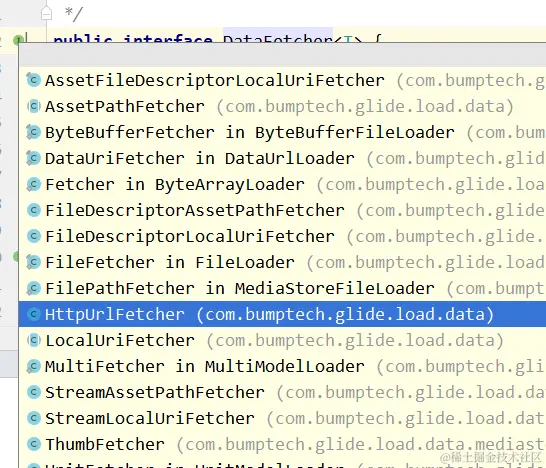

找它的实现类，有一个HttpUrlFetcher，那它在哪里初始化的？

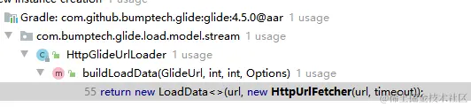

通过`Find Usages`找到哪里调用了--->找到了`HttpGlideUrlLoader`；

再看这个方法`HttpGlideUrlLoader`哪里调用了；

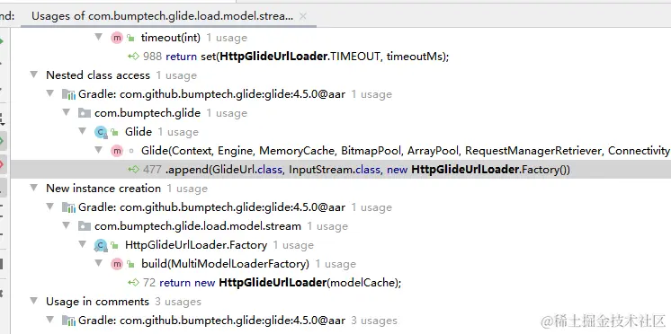

找到了Glide，继续往上寻找，找到了Glide种的`build`方法 ，找就能找到`Glide.get(context);`方法

## 第三条主线

队列怎么维护的？在`MainActivity`中我们调用了如下代码：

```java
RequestManager with = Glide.with(this);
```

**继续跟踪到**

```java
getRetriever(activity).get(activity)//这里得到了一个RequestManagerRetriever对象,再通过RequestManagerRetriever调用get方法得到RequestManager
```

**继续往下**

```java
androidx.fragment.app.FragmentManager fm = activity.getSupportFragmentManager();
return this.supportFragmentGet(activity, fm, (Fragment)null);
```

通过`this.supportFragmentGet`方法（如下代码），最终我们得到`SupportRequestManagerFragment`对象；

```java
private RequestManager supportFragmentGet(@NonNull Context context, @NonNull androidx.fragment.app.FragmentManager fm, @Nullable Fragment parentHint) {
    SupportRequestManagerFragment current = this.getSupportRequestManagerFragment(fm, parentHint);//这段代码的内部如果能够得到Fragment就得到，得不到就重新new一个，并且这个fragment中没有进行任何的UI处理；
    RequestManager requestManager = current.getRequestManager();
    if (requestManager == null) {
        Glide glide = Glide.get(context);
        requestManager = this.factory.build(glide, current.getGlideLifecycle(), current.getRequestManagerTreeNode(), context);
        current.setRequestManager(requestManager);
    }

    return requestManager;
}
```

得到`Fragment`对象后，再将`RequestManager`对象赋值进去，如果`RequestManager`为空，则帮助创建；

而`RequestManager`对象则是生命周期管理的重要一环，因为它实现了`LifecycleListener`接口，并且在创建`RequestManager`的时候，会将这个接口设置给自己；也就意味着，Glide创建了一个无UI的`fragment`，这个`fragment`又与`RequestManager`进行绑定；当用户的`activity`或者`fragment`被调用，系统会自动调用`fragment`的生命周期方法；而生命周期方法中又会回调`LifecycleListener`的方法，进而调用`RequestManager`，`RequestManager`则也拥有了生命周期；

当`RequestManager`的`onStart`方法被调用后，会通过一系列的调用，将运行中的请求全部放开，进行访问；

当`onStop`方法被调用时，则将运行中队列的数据取出来，如果当前请求正在运行则暂停，然后将所有的数据从运行队列中添加到等待队列中去；

当`onDestory`方法被调用时，则将运行队列和等待队列中的数据全部清除；再将监听移除；将`requestManager`从Glide中的绑定关系解除；


# 总览

------

下面将 Glide 分成了几个模块，先有个整体的印象，采用自顶向下的方法分析源码。

按照逻辑功能划分，可以把 Glide 框架大概的分成如下几个部分：

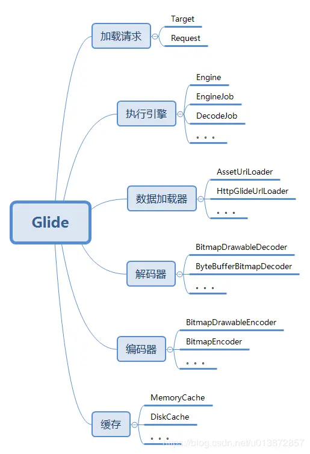

Glide 大体上可以分为如上几个模块。

下面通过一个常用案例来分析整个流程。

一般来说，我们使用如下代码加载一张网络图片：

```java
Glide.with(this)
        .load(url)
        .into(imgView);
```

假设这是我们的 APP 第一次使用 Glide 加载一张图片，那么流程如下：

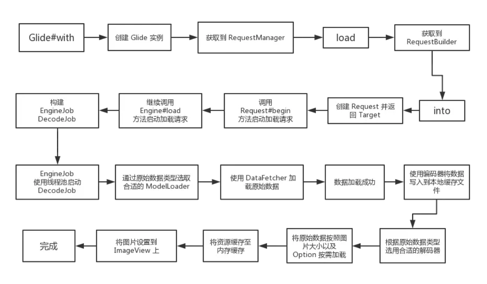上面的流程是简化版，省去了一部分东西，通过这张图能直观的了解到 Glide 的加载流程以及机制。

# 模块介绍

------

根据模块学习事半功倍，先看看 Glide 的分包结构：

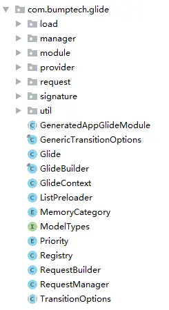

## Glide

------

Glide 是**单例类**，通过 Glide#get(Context) 方法可以获取到实例。

Glide 类算是个**全局的配置类**，Encoder、Decoder、ModelLoader、Pool 等等都在这里设置，此外还提供了创建 RequestManager 的接口（Glide#with() 方法）。

使用 Glide 时会最先调用 Glide#with() 方法创建 RequestManager，Glide 中的 with() 方法有五个重载：

```java
RequestManager with(Context context)
RequestManager with(android.app.Activity)
RequestManager with(android.app.Fragment)
RequestManager with(android.support.v4.app.Fragment)
RequestManager with(android.support.v4.app.FragmentActivity)
```

Glide#with() 方法会将 RequestManager 的创建委托给 RequestManagerRetriever，RequestManagerRetriever 为单例类，调用 get(Context) 创建 RequestManager。

## GlideBuilder

------

GlideBuilder 是用来创建 Glide 实例的类，其中包含了很多个 get/set 方法，例如设置 BitmapPool、MemoryCache、ArrayPool 等等，最终通过这些设置调用 build 方法构建 Glide，可以截取 build 方法中的一段代码来看一下：


```java
if (bitmapPool == null) {
    //创建 Bitmap 池
    int size = memorySizeCalculator.getBitmapPoolSize();
    if (size > 0) {
        bitmapPool = new LruBitmapPool(size);
    } else {
        bitmapPool = new BitmapPoolAdapter();
    }
}

//创建数组池
if (arrayPool == null) {
    arrayPool = new LruArrayPool(memorySizeCalculator.getArrayPoolSizeInBytes());
}

//创建内存缓存
if (memoryCache == null) {
    memoryCache = new LruResourceCache(memorySizeCalculator.getMemoryCacheSize());
}

//创建磁盘缓存
if (diskCacheFactory == null) {
    diskCacheFactory = new InternalCacheDiskCacheFactory(context);
}
```

上面截取的几行代码很具有代表性，这些数组池、缓存实现等等最终都会当做 Glide 构造器的参数创建 Glide 实例。

## RequestManagerRetriever

------

上面说的 5 个重载的 Glide#with() 方法对应 RequestManagerRetriever 中的 5 个重载的 get() 方法。
由于这个比较重要，而且跟我们使用息息相关，所以仔细的说一下~

创建 RequestManager 逻辑如下：

1. 如果 with 方法的参数为 Activity 或者 Fragment ，则最终调用 RequestManagerRetriever 中的 fragmentGet(Context, android.app.FragmentManager) 方法创建 RequestManager；
2. 如果 with 方法的参数为 android.support.v4.app.Fragment 或者android.support.v4.app.FragmentActivity，则最终调用 supportFragmentGet(Context, android.support.v4.app.FragmentManager) 方法创建 RequestManager；
3. 如果 with 方法的参数为 Context，则会判断其来源是否属于 FragmentActivity 及 Activity，是则按照上面的逻辑进行处理，否则最终调用 getApplicationManager(Context) 方法创建 RequestManager。

上面说的情况有个条件都是在主线程调用 Glide#with() 方法， 如果子线程调用 Glide#with() 或者系统版本小于 17，则最终会调用 getApplicationManager(Context) 方法创建 RequestManager 。

也就是说，无论使用什么参数，最终都会进入如下三个方法创建 RequestManager：

```java
RequestManager fragmentGet(Context context, android.app.FragmentManager fm);
RequestManager supportFragmentGet(Context context, android.support.v4.app.FragmentManager fm);
RequestManager getApplicationManager(Context context);
```

可以看到这三个方法作用都是用来创建 RequestManager，前两个方法主要是用来兼容 support 包中的 FragmentActivity、Fragment。

至于为什么需要传入一个 FragmentManager 参数留在后面说。

此外还有一种情况，即在**子线程**调用 Glide#with() 方法或传入 Context 对象为 ApplicationContext，此时会创建一个全局唯一的 RequestManager，生命周期与 APP 周期保持一致。

根据上述规则可以得出以下几个结论：

1. 同一个 Activity 对应一个 FragmentManager，一个 FragmentManager 对应一个 RequestManagerFragment，一个 RequestManagerFragment 对应一个 RequestManager，所以**一个 Activity 对应 一个 RequestManager**；
2. 同一个 Fragment 同样可得出上述结论；
3. 但如果 Fragment 属于 Activity，或者 Fragment 属于 Fragment，在 Activity、Framgnent 中分别创建 Glide 请求是并不会只创建一个 RequestManager；
4. **子线程**发起 Glide 请求或传入对象为 ApplicationContext，则使用全局单例的 RequestManager。

## RequestManager

------

RequestManager 主要由两个作用：

1. 创建 RequestBuilder ；
2. 通过生命周期管理请求的启动结束等。

我们都知道使用 Glide 加载图片时，如果当前页面被销毁或者不可见时会停止加载图片，但我们使用 Glide 加载图片时并没有显示的去设置 Glide 与当前页面的生命周期关联起来，只是传了个 Context 对象，那么 Glide 是如何通过一个上下文对象就能获取到页面生命周期的呢？

通过上面 RequestManagerRetriever 章节的介绍我们知道创建 RequestManager 时需要一个 FragmentManager 参数（全局 RequestManager 除外），那么再创建 RequestManager 时会**先创建一个不可见的 Fragment** ，通过 FM 加入到当前页面，用这个不可见的 Fragment 即可检测页面的生命周期。代码中保证了每个 Activity/Fragment 中只包含一个 RequestManagerFragment 与 一个 RequestManager。

创建 RequestBuilder 的 load 方法有很多：

```java
RequestBuilder<Drawable> load(@Nullable Bitmap bitmap);
RequestBuilder<Drawable> load(@Nullable Drawable drawable);
RequestBuilder<Drawable> load(@Nullable String string);
RequestBuilder<Drawable> load(@Nullable Uri uri);
RequestBuilder<Drawable> load(@Nullable File file);
RequestBuilder<Drawable> load(@RawRes @DrawableRes @Nullable Integer resourceId);
RequestBuilder<Drawable> load(@Nullable URL url);
RequestBuilder<Drawable> load(@Nullable byte[] model);
RequestBuilder<Drawable> load(@Nullable Object model);
```

看看有这么多重载方法，没一个都代表不同的加载源。
除此之外还有两个特殊的方法：

```java
RequestBuilder<File> downloadOnly();
RequestBuilder<File> download(@Nullable Object model);
```

这两个听名字就知道是用来下载图片的。

## RequestBuilder

------

RequestBuilder 用来构建请求，例如设置 RequestOption、缩略图、加载失败占位图等等。
上面说到的 RequestManager 中诸多的 load 重载方法，同样也对应 RequestBuilder 中的重载 load 方法，一般来说 load 方法之后就是调用 into 方法设置 ImageView 或者 Target，into 方法中最后会创建 Request，并启动，这个后面会详细介绍。

## Request

------

顾名思义， request 包下面的是封装的请求，里面有一个 Request 接口，估计所有的请求都是基于这个接口的，看一下：

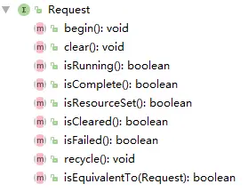

接口定义了对请求的开始、结束、状态获取、回收等操作，所以请求中不仅包含基本的信息，还负责管理请求。
Request 主要的实现类有三个：

1. SingleRequest
2. ThumbnailRequestCoordinator
3. ErrorRequestCoordinator

一个个看。

### SingleRequest

------

这个类负责执行请求并将结果反映到 Target 上。
当我们使用 Glide 加载图片时，会先根据 Target 类型创建不同的 Target，然后 RequestBuilder 将这个 target 当做参数创建 Request 对象，Request 与 Target 就是这样关联起来的。

这里就会先创建一个包含 Target 的 SingleRequest 对象。考虑到性能问题，可能会连续创建很多个 SingleRequest 对象，所以使用了对象池来做缓存。
再来说说 SingleRequest 的请求发起流程。

我们经常在 Activity#onCreate 方法中直接使用 Glide 方法，但此时的图片大小还未确定，所以调用 Request#begin 时并不会直接发起请求，而是等待 ImageView 初始化完成，对于 ViewTarget 以及其子类来说，会注册View 的 OnPreDrawListener 事件，等待 View 初始化完成后就调用 SingleRequest#onSizeReady 方法，这个方法里就会开始加载图片了。

onSizeReady 方法并不会去直接加载图片，而是调用了 Engine#load 方法加载，这个方法差不多有二十个参数，所以 onSizeReady 方法算是用来构建参数列表并且调用 Engine#load 方法的。

clear 方法用于停止并清除请求，主要就是从 Engine 中移除掉这个任务以及回调接口。
另外，SingleRequest 实现了 ResourceCallback 接口，这个接口就连个方法：

```java
void onResourceReady(Resource<?> resource, DataSource dataSource);
void onLoadFailed(GlideException e);
```

即资源加载完成和加载失败的两个回调方法，刚刚说的 Engine#load 方法中有差不多二十个参数，其中有一个参数就是这个接口。那再来说这两个方法在 SingleRequest 中的实现。
其实很简单，重点就是调用 Target#onResourceReady 方法以及构建图片加载完成的动画，另外还要通知 ThumbnailRequestCoordinator 图片加载完成。
onLoadFailed 方法流程大体上也类似 onResourceReady。
那 SingleRequest 就差不多这样了。

### ThumbnailRequestCoordinator

------

这个类是用来**协调两个请求**，因为有的请求需要同时加载原图和缩略图，比如启动这两个请求、原图加载完成后缩略图其实就不需要加载了等等，这些控制都由这个类来操作。
RequestBuilder 中会将缩略图和原图的两个 SingleRequest 都交给它，后面再对其操作时都由这个类来同一控制。
所以这个类其实没什么太多的功能，就是对两个对象的一个统一个管理协调包装。

### ErrorRequestCoordinator

------

RequestBuilder 的父类 BaseRequestOptions 中有几个 error 的重载方法：

```java
T error(@Nullable Drawable drawable);
T error(@DrawableRes int resourceId);
```

一般地，我们会使用这个方法设置一个加载失败时的填充图，大部分情况下都是一个通过 resource 资源文件中获取到的图片 ID 或者 Drawable。
但 RequestBuilder 中还提供了另一个 error 方法：

```java
RequestBuilder<TranscodeType> error(@Nullable RequestBuilder<TranscodeType> errorBuilder);
```

考虑这样的一个场景，当我们加载失败时我可能希望继续去通过网络或者别的什么加载另一张图片，例如：

```java
Glide.with(context)
    .load((Object) null)
    .error(
        Glide.with(context)
            .load(errorModel)
            .listener(requestListener))
    .submit();
```

当我们这样使用 error 时最终就会创建一个 ErrorRequestCoordinator 对象，这个类的功能类似 ThumbnailRequestCoordinator，其中也没多少代码，主要用来协调 ThumbnailRequestCoordinator 以及 error 中的 Request。

通过上面的介绍就已经对 Request 的作用以及子类有一定的了解了，上面多次提到过 Target 是另一个很重要的概念，下面接着看一下这个类。

### Target

------

Target 代表一个**可被 Glide 加载并且具有生命周期的资源**。
当我们调用 RequestBuilder#into 方法时会根据传入参数创建对应类型的 Target 实现类。

那么 Target 在 Glide 的整个加载流程中到底扮演者什么样的角色呢？Target 的中文意思为：**目标**，实际上就是指加载完成后的图片应该放在哪， Target 默认提供了很多很有用的实现类，当然我们也可以自定义 Target。

Glide 默认提供了用于放在 ImageView 上的 ImageViewTarget（以及其各种子类）、放在 AppWidget 上的 AppWidgetTarget、用于同步加载图片的 FutureTarget（只有一个实现类：RequestFutureTarget）等等，下面分别来看一下。

#### CustomViewTarget

------

这个是抽象类，负责加载 Bitmap、Drawable 并且放到 View 上。

上文提到过，如果在 View 还未初始化完成时就调用了 Glide 加载图片会等待加载完成再去执行 onSizeReady 方法，那如何监听 View 初始化完成呢？
CustomViewTarget 就针对这个问题给出了解决方案，其中会调用 View#addOnAttachStateChangeListener 方法添加一个监听器，这个监听器可以监听到 View 被添加到 Widow 以及移除 Window 时的事件，从而更好的管理 Request 生命周期。

另外，构建好的 Request 会通过 View#setTag 方法存入 View 中，后面再通过 View#getTag 方法获取。

但这个抽象类并没有实现类，也没有被使用过，View 相关的 Target 都是继承 ViewTarget 抽象基类，但这个类已经被标记为过期类了，推荐将 ViewTarget 替换成 CustomViewTarget 使用。

#### ViewTarget

------

这个类又继承了抽象类 BaseTarget，这个基类里只是实现了 Target 接口的 setRequest 以及 getRequest 方法。
ViewTarget 基本上类似 CustomViewTarget ，只是具体的实现上有点不同。

#### ImageViewTarget

------

听名字就知道，这是加载到 ImageView 上的 Target，继承了 ViewTarget，同样也是个**抽象类**。

构造器中限定了**必须传入 ImageView 或者其子类**，图片数据加载完成后会回调其中的 onResourceReady 方法，第一步是将图片设置给 ImageView，第二部是判断是否需要使用动画，需要的话就执行动画。

ImageViewTarget 的实现类比较多，总共有 5 个，但内容都很简单，主要用于区分加载的资源时 Bitmap 类型还是 Drawable 类型，这个在构建请求时确定，默认的加载请求最终都是 Drawable 类型，但如果构建请求时调用了 asBitmap 方法那就资源就会被转成 Bitmap 类型，另外一个就是资源使用缩略图展示。

#### RequestFutureTarget

------

这是用来同步加载图片的 Target，调用 RequestBuilder#submit 将会返回一个 FutureTarget，调用 get 方法即可获取到加载的资源对象。

#### AppWidgetTarget

------

用于将下载的 Bitmap 设置到 RemoteView 上。

#### NotificationTarget

------

与 AppWidgetTarget 类似，不同的是这是用来将 Bitmap 设置到 Notification 中的 RemoteView 上。

## module

------

module 包下面的 GlideModel 比较重要，需要详细说一下。

这是用来**延迟设置 Glide 相关参数**的，我们可以通过这个接口使 Glide 在初始化时应用我们的设置，因为 Glide 是单例类，通过这个设置可以保证在 Glide 单例类初始时，所有请求发起之前应用到 Glide。

GlideModel 是个接口，所以代码很简单：

```java
@Deprecated
public interface GlideModule extends RegistersComponents, AppliesOptions { }
```

可以看到该接口被标识已过期，Glide 推荐使用 AppGlideModule 替代，不用管他。

GlideModel 接口本身没有代码内容，但其继承了 RegistersComponents 与 AppliesOptions 接口，先分别看一下这两个接口。

### RegistersComponents

------

这是用来注册 Glide 中一些组件的，这个接口只有一个方法：

```java
void registerComponents(@NonNull Context context, @NonNull Glide glide,
      @NonNull Registry registry);
```

这个方法中提供了一个 Registry 对象，这是用来管理注册 ModelLoader、Encoder、Decoder 等等，具体可以看看 Registry 提供的公开方法。

例如我们可以在这里注册自己的 ModelLoader，比如我们的网络请求使用的 OkHttp，Glide 默认使用的是HttpURLConnection，我们想改成 OkHttp 就可以在这里设置，具体的使用方式[点此查看使用案例。](https://links.jianshu.com/go?to=https%3A%2F%2Fgithub.com%2F0xZhangKe%2FGlide-note%2Fblob%2Fmaster%2Fintegration%2Fokhttp3%2Fsrc%2Fmain%2Fjava%2Fcom%2Fbumptech%2Fglide%2Fintegration%2Fokhttp3%2FOkHttpGlideModule.java)

### AppliesOptions

------

这是用来管理一些 Glide 的参数设置项，同样只有一个方法。

```java
void applyOptions(@NonNull Context context, @NonNull GlideBuilder builder);
```

这个方法提供了一个 GlideBuilder 参数，这是用来构建 Glide 的，我们可以使用 GlideBuilder 对象提供的公开方法做一些设置，例如设置线程池、设置 BitmapPool/ArrayPoll 等等。

那么说完这两个接口，在回过头来看看 GlideModel ，通过上面的描述已经明白 GlideModel 中两个方法的作用了，再来看看如何使用。

Glide 在实例化时会解析 manifest 文件并从中获取 value 为 GlideModule 的 meta-data 配置信息，我们定义好自己的 GlideModule 之后需要在 manifest 文件中进行配置，配置方式如下：

```xml
<meta-data
        android:name="com.zhangke.glide.samples.OkHttpGlideModule"
        android:value="GlideModule"/>
```

其中 OkHttpGlideModule 必须实现 GlideModel 接口。
具体的[配置方式点此查看](https://links.jianshu.com/go?to=https%3A%2F%2Fgithub.com%2F0xZhangKe%2FGlide-note%2Ftree%2Fmaster%2Fintegration%2Fokhttp3)。

此外，Glide 默认提供了很多 ModelLoader，基本上可以满足所有场景的使用。
ModelLoader 的具体作用与机制后面会详细介绍。

## load

------

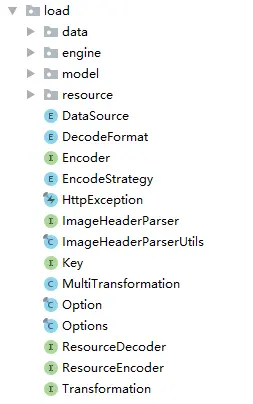

lload 包下面是加载资源的核心，里面的东西很多，也很复杂，所以我先把其中两个比较重要的接口介绍完了在介绍别的。

### ModelLoader

------

类路径：

```java
com.bumptech.glide.load.model.ModelLoader
```

工厂接口，用于将任意复杂的数据模型转换为可由 DataFetcher 用于获取模型所代表的资源的数据的具体数据类型。叫他加载器比较合适，用来加载资源的。

除此之外，还允许将图片按照 ImageView 大小按需加载。防止浪费内存。

Glide 初始化时会注册很多个 ModelLoader ，除了Glide 默认提供的之外还会注册用户在 manifest 中配置的 ModelLoader，也就是上面 GlideModel 章节介绍的内容。

ModelLoader 中有两个方法以及一个内部类：LoadData，下来看看这两个方法：

```java
@Nullable
LoadData<Data> buildLoadData(@NonNull Model model, int width, int height,
                                 @NonNull Options options);
boolean handles(@NonNull Model model);
```

buildLoadData 方法除了包含 Model 之外还有宽高以及 Option，所以光看参数列表应该能猜到，加载图片时可以根据需要的宽高以及其他设置做到按需加载。
返回的是 LoadData 实例，这个类待会再说。所以这个方法的意义就是通过参数构建一个 LoadData 实例。

handles 方法比较简单，就是用来判断给定模型是不是此加载器可能加载的已识别类型。

至于内部类 LoadData 呢，主要作用就是装了三个东西：

1. 用于识别资源唯一性的 Key;
2. 缓存相关的备用 Key 列表
3. DataFetcher

其中 DataFetcher最重要，为什么说它是最重要的呢，因为加载资源的根源就在这里（找了半天终于找到了），例如发起网络请求等等，都在这个里面。
那既然说到了 DataFetcher 就在说说它。

### DataFetcher

------

类路径：

```java
com.bumptech.glide.load.data.DataFetcher
```

DataFetcher 也是个接口，其中最重要的一个方法就是 loadData，听名字就很重要是吧：**加载数据**。

内部实现就是通过 HttpUrlConnect 发起网络请求，或者打开一个文件，或者使用 AssetManager 打开一个资源等等。。。

加载完成后通过 DataFetcher$DataCallback 接口回调。

DataCallback 中包含两个方法：

```java
void onDataReady(@Nullable T data);
void onLoadFailed(@NonNull Exception e);
```

分别代表数据加载成功或者加载失败回调。

## Encoder

------

Encoder 是个接口，在 Glide 中也是个很重要的概念，用来将给定的数据写入持久性存储介质中（文件）。

其中只有一个方法：

```java
public interface Encoder<T> {
  /**
   * Writes the given data to the given output stream and returns True if the write completed
   * successfully and should be committed.
   *
   * @param data The data to write.
   * @param file The File to write the data to.
   * @param options The put of options to apply when encoding.
   */
  boolean encode(@NonNull T data, 
                 @NonNull File file, 
                 @NonNull Options options);
}
```

比较简单，注释写的很清楚了，就是把 data 存入文件中。

数据加载完成之后会先使用 Encoder 将数据存入本地磁盘缓存文件中。
同样，Encoder 对应的实现类都是在 Glide 初始化时注册进去的。

## ResourceDecoder

------

与 Encoder 对应，**数据解码器**，用来**将原始数据解码成相应的数据类型**，针对不同的请求实现类都不同，例如通过网络请求最终获取到的是一个 InputStream，经过 ByteBufferBitmapDecoder 解码后再生成一个 Bitmap。

需要指出的是，这里解码时会根据 option 以及图片大小（如果有的话）按需加载 Bitmap，防止内存的浪费。

与 Encoder 一样，Glide 初始化时会注册很多个类型的 ResourceDecoder 实现类，图片数据获取到之后会根据不同的类型使用对应的解码器对其解码。

## Engine

作用：负责资源（Resource）的加载和管理（回收、加载策略）。

上面的 Request 中也讲到了 Engine 这个类，可理解为**执行引擎**，算是整个 Glide 的核心发动机。

Engine 负责管理请求以及活动资源、缓存等。主要关注 load 方法，这个方法主要做了如下几件事：

1. 通过请求构建 Key；
2. 从活动资源中获取资源（详见缓存章节），获取到则返回；
3. 从缓存中获取资源，获取到则直接返回；
4. 判断当前请求是否正在执行，是则直接返回；
5. 构建 EngineJob 与 DecodeJob 并执行。

关于缓存相关的都在缓存章节。下面说说 EngineJob 与 DecodeJob。

### Engine#load()

```kotlin
  /**
   * Starts a load for the given arguments.
   *
   * <p>Must be called on the main thread.
   *
   * <p>The flow for any request is as follows:
   *
   * <ul>
   *   <li>Check the current set of actively used resources, return the active resource if present,
   *       and move any newly inactive resources into the memory cache.
   *   <li>Check the memory cache and provide the cached resource if present.
   *   <li>Check the current set of in progress loads and add the cb to the in progress load if one
   *       is present.
   *   <li>Start a new load.
   * </ul>
   *
   * <p>Active resources are those that have been provided to at least one request and have not yet
   * been released. Once all consumers of a resource have released that resource, the resource then
   * goes to cache. If the resource is ever returned to a new consumer from cache, it is re-added to
   * the active resources. If the resource is evicted from the cache, its resources are recycled and
   * re-used if possible and the resource is discarded. There is no strict requirement that
   * consumers release their resources so active resources are held weakly.
   *
   * @param width The target width in pixels of the desired resource.
   * @param height The target height in pixels of the desired resource.
   * @param cb The callback that will be called when the load completes.
   */
  public <R> LoadStatus load(...){}
```

注释中介绍了load()方法的工作流程，即如何加载资源

1、检查当前正在活跃使用的资源列表，如果存在，就找到了，返回结果。并且移动任何新的不活跃资源到memory cache中。


**怎么理解 Active Resources（活跃资源）和 inactive resources 呢？Active Resources 的作用是什么？**

我们知道不论是 Active Resources 还是 memory cache，其实图片都已经在内存中，那区别是什么呢？为什么需要两个东西？

我们思考一个场景，有一张图片在 Activity1 中加载好了，然后用户打开了Activity2。。。这时候，系统是有可能把图片回收的。但用户之后可能又会返回Activity1，那如果不做任何处理的话，之前Activity1中加载的图片是不是又要重新加载了？这就是为什么有了  memory cache 后还要引入 Active Resources 的原因。不仅如此，注意这句话：Check the current set of actively used resources, return the active resource if present，这是不是说明 Active Resources 中的图片是支持复用的，2个 ImageView 显示一张图片时，并没有加载两张，而是共用了一张图片。

知道了为什么要用 Active Resources后，我们再来看，**Glide 是怎么把 Active Resources 移动到 memory cache 中的**。

为什么要使用弱引用呢？

There is no strict requirement that consumers release their resources so active resources are held weakly.

翻译：没有严格要求消费者释放他们的资源，因此活动资源被微弱地持有。

怎么理解这句话呢？因为Glide没有强制要求我们释放资源，所以我们在用完图片后，可能不会主动去释放图片，那就没有了告诉Glide图片不再使用的时机了。由于Glide想在我们不再使用图片时，将图片资源放到memory cache，所以Glide需要这么一个时机来做这件事。显然Glide选择通过用 WeakRef（弱引用）来实现。这就涉及到 WeakRef 的使用了，它可以监听 GC ，当监听到图片资源要被回收时，Glide会将资源添加到memory cache中，这样图片也就再次被Glide内部强引用了，也就做到了持久的保存在内存中了。

#### 小结

通过对load() 的分析，我们知道了 Glide 是怎么做缓存管理的。


### Resource 接口

作用：定义了一个资源接口，Engine 负责处理的资源都会实现此接口。

```kotlin
/**
 * A resource interface that wraps a particular type so that it can be pooled and reused.
 *
 * @param <Z> The type of resource wrapped by this class.
 */
public interface Resource<Z> {

  /** Returns the {@link Class} of the wrapped resource. */
  @NonNull
  Class<Z> getResourceClass();

  /**
   * Returns an instance of the wrapped resource.
   *
   * <p>Note - This does not have to be the same instance of the wrapped resource class and in fact
   * it is often appropriate to return a new instance for each call. For example, {@link
   * android.graphics.drawable.Drawable Drawable}s should only be used by a single {@link
   * android.view.View View} at a time so each call to this method for Resources that wrap {@link
   * android.graphics.drawable.Drawable Drawable}s should always return a new {@link
   * android.graphics.drawable.Drawable Drawable}.
   */
  @NonNull
  Z get();

  /**
   * Returns the size in bytes of the wrapped resource to use to determine how much of the memory
   * cache this resource uses.
   */
  int getSize();

  /**
   * Cleans up and recycles internal resources.
   *
   * <p>It is only safe to call this method if there are no current resource consumers and if this
   * method has not yet been called. Typically this occurs at one of two times:
   *
   * <ul>
   *   <li>During a resource load when the resource is transformed or transcoded before any consumer
   *       have ever had access to this resource
   *   <li>After all consumers have released this resource and it has been evicted from the cache
   * </ul>
   *
   * For most users of this class, the only time this method should ever be called is during
   * transformations or transcoders, the framework will call this method when all consumers have
   * released this resource and it has been evicted from the cache.
   */
  void recycle();
}
```


### EngineResource

作用：对 Resource 做了一次包装，主要是增加了【引用计数】的功能——在资源被使用或者释放时分别增加或减少计数，用来控制资源的回收。 


### ActiveResources

#### 作用

对 Active 资源进行一次缓存，并在资源不再使用时进行回收。Active 资源是什么？即正在使用的资源，是被强引用所持有的。

#### 实现原理

1、弱引用 ResourceWeakReference 的实现

作用：持有 Resource，Resource 会在 EngineResource 被回收后使用。假设这里不持有 Resource 的话，Resource 就会被 gc 掉了，也就不能做 ActiveResources 到 MemoryCache 的转化了。

ResourceWeakReference 是 ActiveResources 实现的基础，需要先知道其实现。

```Java
final class ActiveResources {
  
  static final class ResourceWeakReference extends WeakReference<EngineResource<?>> {
    final Key key;

    final boolean isCacheable;

    @Nullable
    Resource<?> resource;

    ResourceWeakReference(
        @NonNull Key key,
        @NonNull EngineResource<?> referent,
        @NonNull ReferenceQueue<? super EngineResource<?>> queue,
        boolean isActiveResourceRetentionAllowed) {
      //（1）ResourceWeakReference 直接持有的对象是 EngineResource，而不是图片资源。
      // 引用链：ResourceWeakReference -> EngineResource -> Resource -> 真正的图片资源
      //（2）支持传入 ReferenceQueue，用来在 EngineResource 被 gc 回收后，记录其对应的 ResourceWeakReference。
      super(referent, queue);
      this.key = Preconditions.checkNotNull(key);
      //（3）EngineResource 所持有的 Resource 也被 ResourceWeakReference 持有了（强引用），
      // 这意味着在 EngineResource 被回收时，Resource、图片资源其实还在内存中。
      // 这是实现 ActiveResources 转化为 MemoryCacheResource 的基础。
      this.resource =
          referent.isMemoryCacheable() && isActiveResourceRetentionAllowed
              ? Preconditions.checkNotNull(referent.getResource())
              : null;
      isCacheable = referent.isMemoryCacheable();
    }

    void reset() {
      //（4）释放资源
      resource = null;
      // 主动调用 clear 后，get方法将返回 null，即使此时 EngineResource 还没有被回收
      // 另外，主动调用，并不会将此引用加入到 ReferenceQueue 中
      // 并且之后 EngineResource 被回收了，也不会将 ResourceWeakReference 加入队列中
      clear();
    }
  }
}
```

ResourceWeakReference 是 ActiveResources 的内部类，通过这个类我们可以知道 4 个点，如注释所言。

2、缓存功能

缓存的基本功能有增加、删除、获取（查询），然后内部会有一个存储数据的集合，下面看源码：

```Java
package com.bumptech.glide.load.engine;

final class ActiveResources {
  // 通过前面对 ResourceWeakReference 的掌握，我们已经知道 ResourceWeakReference 中持有了 Resource
  // 存储结构，保存缓存资源，间接强引用了 Resource
  final Map<Key, ResourceWeakReference> activeEngineResources = new HashMap<>();
  // 引用队列，在 EngineResource 被 gc 回收后，会将 ResourceWeakReference 加入到队列中
  private final ReferenceQueue<EngineResource<?>> resourceReferenceQueue = new ReferenceQueue<>();

  // 添加（或者修改）缓存
  synchronized void activate(Key key, EngineResource<?> resource) {
    ResourceWeakReference toPut =
        new ResourceWeakReference(
            key, resource, resourceReferenceQueue, isActiveResourceRetentionAllowed);

    ResourceWeakReference removed = activeEngineResources.put(key, toPut);
    if (removed != null) {
      // 将之前的缓存对象reset。清除资源
      removed.reset();
    }
  }

  // 删除缓存
  synchronized void deactivate(Key key) {
    ResourceWeakReference removed = activeEngineResources.remove(key);
    if (removed != null) {
      removed.reset();
    }
  }

  // 获取缓存
  @Nullable
  synchronized EngineResource<?> get(Key key) {
    ResourceWeakReference activeRef = activeEngineResources.get(key);
    if (activeRef == null) {
      return null;
    }

    EngineResource<?> active = activeRef.get();
    if (active == null) {
      // activeRef.get() == null 理论上有两种情况：
      // 1、EngineResource 已经被 gc 掉了
      // 2、主动调用了 reset() 方法，我们已经知道这个方法内会将引用去除
      // 3、activate 传入的 Resource 为null。
     
      // 不管哪种情况，EngineResource 不再属于 ActiveResources 了，所以清除其对应的引用
      cleanupActiveReference(activeRef);
    }
    return active;
  }
  
  // 将资源从 ActiveResources 中移除
    void cleanupActiveReference(@NonNull ResourceWeakReference ref) {
    synchronized (this) {
      activeEngineResources.remove(ref.key);

      if (!ref.isCacheable || ref.resource == null) {
        return;
      }
    }

    // 构建一个新的 EngineResource，并将 ResourceWeakReference 中的 Resource 放入其中，回调给其他模块使用
    // 回调处理后面会分析，见：第 4 节（回调处理）
    EngineResource<?> newResource =
        new EngineResource<>(
            ref.resource,
            /* isMemoryCacheable= */ true,
            /* isRecyclable= */ false,
            ref.key,
            listener);
    listener.onResourceReleased(ref.key, newResource);
  }
}
```

3、监听资源被回收

创建 ActiveResources 时，会新建一个 monitorClearedResourcesExecutor 线程池来监视资源回收。

```java
final class ActiveResources {
  private final Executor monitorClearedResourcesExecutor;
  @VisibleForTesting final Map<Key, ResourceWeakReference> activeEngineResources = new HashMap<>();
  private final ReferenceQueue<EngineResource<?>> resourceReferenceQueue = new ReferenceQueue<>();
  
  ActiveResources(boolean isActiveResourceRetentionAllowed) {
    this(
        isActiveResourceRetentionAllowed,
        java.util.concurrent.Executors.newSingleThreadExecutor(
            new ThreadFactory() {
              @Override
              public Thread newThread(@NonNull final Runnable r) {
                return new Thread(
                    new Runnable() {
                      @Override
                      public void run() {
                        Process.setThreadPriority(Process.THREAD_PRIORITY_BACKGROUND);
                        r.run();
                      }
                    },
                    "glide-active-resources");
              }
            }));
  }

  @VisibleForTesting
  ActiveResources(
      boolean isActiveResourceRetentionAllowed, Executor monitorClearedResourcesExecutor) {
    this.isActiveResourceRetentionAllowed = isActiveResourceRetentionAllowed;
    this.monitorClearedResourcesExecutor = monitorClearedResourcesExecutor;

    monitorClearedResourcesExecutor.execute(
        new Runnable() {
          @Override
          public void run() {
            cleanReferenceQueue();
          }
        });
  }

  void cleanupActiveReference(@NonNull ResourceWeakReference ref) {
    synchronized (this) {
      activeEngineResources.remove(ref.key);

      if (!ref.isCacheable || ref.resource == null) {
        return;
      }
    }

    // 回调处理后面会分析，见：第 4 节（回调处理）
    EngineResource<?> newResource =
        new EngineResource<>(
            ref.resource,
            /* isMemoryCacheable= */ true,
            /* isRecyclable= */ false,
            ref.key,
            listener);
    listener.onResourceReleased(ref.key, newResource);
  }

  @SuppressWarnings("WeakerAccess")
  @Synthetic
  void cleanReferenceQueue() {
    // 创建死循环，不断从 resourceReferenceQueue 中读取是否有 ResourceWeakReference 被加入队列
    while (!isShutdown) {
      try {
        // 阻塞，直到获取到元素
        ResourceWeakReference ref = (ResourceWeakReference) resourceReferenceQueue.remove();
        // 清除资源，回调通知
        cleanupActiveReference(ref);

      } catch (InterruptedException e) {
        Thread.currentThread().interrupt();
      }
    }
  }
}
```

ActiveResources 会创建一个线程池，并执行死循环不断从 resourceReferenceQueue 中读取 ResourceWeakReference 元素，如果读取到就意味着 ResourceWeakReference 所指向的对象被回收了，自然也就没有外部的引用了，可进行清除和后续回调处理。

4、回调处理

第 2 和 3 节已经提到在资源（EngineResource）被回收后，会调用 cleanupActiveReference 并回调 listener.onResourceReleased(ref.key, newResource)。

```kotlin
final class ActiveResources {
    interface ResourceListener {
    void onResourceReleased(Key key, EngineResource<?> resource);
  }
  
   private ResourceListener listener;
  
    void setListener(ResourceListener listener) {
    synchronized (listener) {
      synchronized (this) {
        this.listener = listener;
      }
    }
  }
  
void cleanupActiveReference(@NonNull ResourceWeakReference ref) {
    synchronized (this) {
      activeEngineResources.remove(ref.key);

      if (!ref.isCacheable || ref.resource == null) {
        return;
      }
    }

    EngineResource<?> newResource =
        new EngineResource<>(
            ref.resource,
            /* isMemoryCacheable= */ true,
            /* isRecyclable= */ false,
            ref.key,
            listener);
    listener.onResourceReleased(ref.key, newResource);
  }
}
```

下面是 setListener 和 listener.onResourceReleased 的实现：

Engine 实现了 ResourceListener 接口，并在 Engine 构造方法中，设置了 listener，

```kotlin
public class Engine
    implements EngineJobListener,
        MemoryCache.ResourceRemovedListener,
        EngineResource.ResourceListener {
          
  Engine(
      MemoryCache cache,
      DiskCache.Factory diskCacheFactory,
      GlideExecutor diskCacheExecutor,
      GlideExecutor sourceExecutor,
      GlideExecutor sourceUnlimitedExecutor,
      GlideExecutor animationExecutor,
      Jobs jobs,
      EngineKeyFactory keyFactory,
      ActiveResources activeResources,
      EngineJobFactory engineJobFactory,
      DecodeJobFactory decodeJobFactory,
      ResourceRecycler resourceRecycler,
      boolean isActiveResourceRetentionAllowed) {
    
    if (activeResources == null) {
      activeResources = new ActiveResources(isActiveResourceRetentionAllowed);
    }
    this.activeResources = activeResources;
    activeResources.setListener(this);
  }
  
  // 回调方法：将资源从 ActiveResources 移到 MemoryCache 中
  @Override
  public void onResourceReleased(Key cacheKey, EngineResource<?> resource) {
    activeResources.deactivate(cacheKey);
    if (resource.isMemoryCacheable()) {
      // 支持内存缓存，缓存起来
      cache.put(cacheKey, resource);
    } else {
      // 不支持内存缓存，回收 resource
      resourceRecycler.recycle(resource, /* forceNextFrame= */ false);
    }
  }  
}
```


#### Why？

前面分析了 ActiveResources 的作用和实现原理，但是我们还没有回答一个问题——为什么要这么做？我们知道，ActiveResources 本质也是内存缓存，cache 也是属于内存缓存，那为什么需要两次内存缓存呢？区别又是什么？

通过对 ActiveResources 的分析，我们知道 ActiveResources 所管理的资源是被外部（应用层）正在使用的，也就是被外部强引用的。或者是刚使用完，已经不在被强引用，但是还没有被 gc 回收。这类资源，正在使用或者刚使用完，使用频率会更高，所以做了一次缓存分级。相较于全部使用MemoryCache，这类资源可以更块地加载到。

特别注意：ActiveResources 所管理的资源，指的是 EngineResource 和 Resource 实现类，并不是指真正的图片资源

#### 小结

Glide 为了实现更快的加载图片资源，在内存缓存的基础上增加了一个 ActiveResources 缓存，用来保存正在使用或刚用完但还没有被 gc 的资源。然后基于 WeakReference（强引用持有Resource） 和可监听对象被回收的机制，实现了资源从 ActiveResources 到 MemoryCache 的转化。

为什么要使用 WeakReference？是因为 Glide 想要知道外部是否正在使用资源（资源追踪），并在未使用时转化为 MemoryCache。那要知道是否在使用有两种方法，一是用户主动调用SDK告知已经释放，但用户不一定会主动调用 release 方法，所以这种方法不可靠；而 WeakReference + ReferenceQueue 提供了监听对象回收的能力，符合 Glide 此场景的需求。

Glide 在这里使用 WeakReference 的主要是为了追踪资源，即知道什么时候资源不在被使用。跟解决 Handler 持有 Activity 引起内存泄漏时的目的是不同的，需要注意。


## EngineJob

------

这个主要用来执行 DecodeJob 以及管理加载完成的回调，各种监听器，没有太多其他的东西。

## DecodeJob

------

负责从缓存或数据源中加载原始数据并通过解码器转换为相应的资源类型（Resource）。DecodeJob 实现了 Runnable 接口，由 EngineJob 将其运行在指定线程池中。

首次加载一张图片资源时，资源加载完成后会先存入到本地缓存文件中，然后再从文件中获取。

上面已经说过，图片的加载最终是通过 DataFetcher 来实现，但是此处并没有直接这么调用，考虑到缓存文件，这里面使用的是 DataFetcherGenerator，其有三个实现类，对应不同的加载方式，这里就不多做介绍了，只需要知道它会根据资源类型去 Glide 中获取已注册的 DataFetcher ，然后**通过 DataFetcher#loadData 方法获取原始数据**，获取完成后使用 Encoder 将数据存入磁盘缓存文件中，同时使用对应的解码器将原始数据转换为相应的资源文件，这样整个流程就差不多结束了。


# 缓存模块

关于缓存的获取、数据加载相关的逻辑在 Engine#load 方法中。先来看看缓存流程，流程如下图：

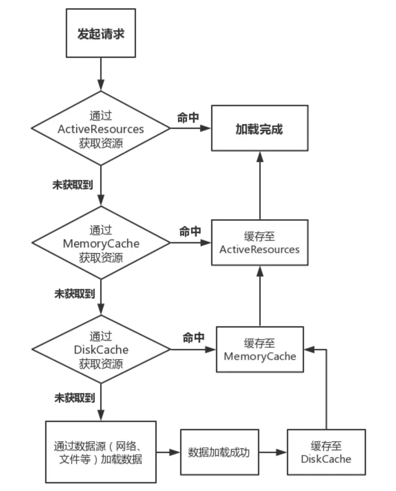

Glide 实例化时会实例化三个缓存相关的类以及一个计算缓存大小的类：

```java
//根据当前机器参数计算需要设置的缓存大小
MemorySizeCalculator calculator = new MemorySizeCalculator(context);
//创建 Bitmap 池
if (bitmapPool == null) {
    if (Build.VERSION.SDK_INT >= Build.VERSION_CODES.HONEYCOMB) {
        int size = calculator.getBitmapPoolSize();
        bitmapPool = new LruBitmapPool(size);
    } else {
        bitmapPool = new BitmapPoolAdapter();
    }
}
//创建内存缓存
if (memoryCache == null) {
    memoryCache = new LruResourceCache(calculator.getMemoryCacheSize());
}
//创建磁盘缓存
if (diskCacheFactory == null) {
    diskCacheFactory = new InternalCacheDiskCacheFactory(context);
}
```

除此之外 Engine 中还有一个 ActiveResources 作为第一级缓存。下面分别来介绍一下。

## ActiveResources

------

ActiveResources 是**第一级缓存**，管理的资源是正在使用的或者最近使用的（刚用完还没被 gc 回收的），没有大小限制。类路径：

```css
com.bumptech.glide.load.engine.ActiveResources
```

Engine#load 方法中构建好 Key 之后第一件事就是去这个缓存中获取资源，获取到则直接返回，获取不到才继续从其他缓存中寻找。

当资源加载成功，或者通过缓存命中资源后都会将其放入 ActiveResources 中，资源被释放时移除出 ActiveResources 。

ActiveResources 中通过一个 Map 来存储数据，数据保存在一个**弱引用**（WeakReference）中。

刚刚说的 activeResource 使用一个 Map<Key, WeakReference<EngineResource<?>>> 来存储的，此外还有一个引用队列：

```php
ReferenceQueue<EngineResource<?>> resourceReferenceQueue;
```

每当向 activeResource 中添加一个 WeakReference 对象时都会将 resourceReferenceQueue 和这个 WeakReference 关联起来，用来跟踪这个 WeakReference 的 gc，一旦这个弱引用持有的对象被 gc 掉，就会将它从 activeResource 中移除。

那么 ReferenceQueue 具体是在何时去判断 WeakReference 是否被 gc 了呢，Handler 机制大家应该都知道，但不知道大家有没有用过 MessageQueue.IdleHandler ，可以调用 MessageQueue#addIdleHandler 添加一个 MessageQueue.IdleHandler 对象，Handler 会在**线程空闲时调用这个方法**。resourceReferenceQueue 在创建时会创建一个 Engine#RefQueueIdleHandler 对象并将其添加到当前线程的 MessageQueue 中，ReferenceQueue 会在 IdleHandler 回调的方法中去判断 activeResource 中的 WeakReference 是不是被 gc 了，如果是，则将引用从 activeResource 中移除，代码如下：

```java
//MessageQueue 中的消息暂时处理完回调
@Override
public boolean queueIdle() {
    ResourceWeakReference ref = (ResourceWeakReference) queue.poll();
    if (ref != null) {
        activeResources.remove(ref.key);
    }
    //返回 true，表示下次处理完仍然继续回调
    return true;
}
```

## MemorySizeCalculator

------

这个类是用来计算 BitmapPool 、ArrayPool 以及 MemoryCache **大小**的。计算方式如下：

```java
//默认为 4MB，如果是低内存设备则在此基础上除以二
arrayPoolSize =
        isLowMemoryDevice(builder.activityManager)
                ? builder.arrayPoolSizeBytes / LOW_MEMORY_BYTE_ARRAY_POOL_DIVISOR
                : builder.arrayPoolSizeBytes;
//其中会先获取当前进程可使用内存大小，
//然后通过判断是否是否为低内存设备乘以相应的系数，
//普通设备是乘以 0.4，低内存为 0.33，这样得到的是 Glide 可使用的最大内存阈值 maxSize
int maxSize =
        getMaxSize(
                builder.activityManager, builder.maxSizeMultiplier, builder.lowMemoryMaxSizeMultiplier);

int widthPixels = builder.screenDimensions.getWidthPixels();
int heightPixels = builder.screenDimensions.getHeightPixels();
//计算一张格式为 ARGB_8888 ，大小为屏幕大小的图片的占用内存大小
//BYTES_PER_ARGB_8888_PIXEL 值为 4
int screenSize = widthPixels * heightPixels * BYTES_PER_ARGB_8888_PIXEL;

int targetBitmapPoolSize = Math.round(screenSize * builder.bitmapPoolScreens);

int targetMemoryCacheSize = Math.round(screenSize * builder.memoryCacheScreens);
//去掉 ArrayPool 占用的内存后还剩余的内存
int availableSize = maxSize - arrayPoolSize;

if (targetMemoryCacheSize + targetBitmapPoolSize <= availableSize) {
    //未超出内存限制
    memoryCacheSize = targetMemoryCacheSize;
    bitmapPoolSize = targetBitmapPoolSize;
} else {
    //超出内存限制
    float part = availableSize / (builder.bitmapPoolScreens + builder.memoryCacheScreens);
    memoryCacheSize = Math.round(part * builder.memoryCacheScreens);
    bitmapPoolSize = Math.round(part * builder.bitmapPoolScreens);
}
```


## BitmapPool

------

BitmapPool 是用来**复用 Bitmap** 从而避免重复创建 Bitmap 而带来的内存浪费，Glide 通过 SDK 版本不同创建不同的 BitmapPool 实例，版本低于 Build.VERSION_CODES.HONEYCOMB(11) 实例为 BitmapPoolAdapter，其中的方法体几乎都是空的，也就是是个实例不做任何缓存。否则实例为 LruBitmapPool，先来看这个类。

### LruBitmapPool

------

LruBitmapPool 中没有做太多的事，主要任务都交给了 **LruPoolStrategy**，这里只是做一些缓存大小管理、封装、日志记录等等操作。

每次调用 put 缓存数据时都会调用 trimToSize 方法判断已缓存内容是否大于设定的最大内存，如果大于则使用 LruPoolStrategy#removeLast 方法逐步移除，直到内存小于设定的最大内存为止。

LruPoolStrategy 有两个实现类：SizeConfigStrategy 以及 AttributeStrategy，根据系统版本创建不同的实例，这两个差异不大，KITKAT 之后使用的都是 SizeConfigStrategy，这个比较重要。

#### SizeConfigStrategy

------

SizeConfigStrategy 顾名思义，是通过 Bitmap 的 size 与 Config 来当做 key 缓存 Bitmap，Key 也会通过 KeyPool 来缓存在一个队列（Queue）中。

与 AttributeStrategy 相同的是，其中都使用 Glide 内部自定义的数据结构：**GroupedLinkedMap** 来存储 Bitmap。

当调用 put 方法缓存一个 Bitmap 时会先通过 Bitmap 的大小以及 Bitmap.Config 创建（从 KeyPool 中获取）Key，然后将这个 Key 与 Bitmap 按照键值对的方式存入 GroupedLinkedMap 中。

此外其中还包含一个 sortedSizes，这是一个 HashMap，Key 对应 put 进来的 Bitmap.Config，value 对应一个 TreeMap，TreeMap 中记录着每一个 size 的 Bitmap 在当前缓存中的个数，即 put 时加一，get 时减一。

TreeMap 是**有序的**数据结构，当需要通过 Bitmap 的 size 与 Config 从缓存中获取一个 Biamp 时未必会一定要获取到 size 完全相同的 Bitmap，由于 TreeMap 的特性，调用其 ceilingKey 可以获取到一个相等或大于当前 size 的一个最小值，用这个 Key 去获取 Bitmap，然后重置一下大小即可。

重点看一下 GroupedLinkedMap，这是 Glide 为了 实现 [LRU 算法](https://links.jianshu.com/go?to=https%3A%2F%2Fbaike.baidu.com%2Fitem%2FLRU)自定义的一个数据结构，看名字是已分组的链表 Map？看一下下面的图就明白了：

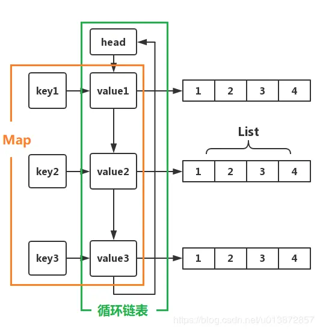

GroupedLinkedMap

其中包含三种数据结构：哈希表（HashMap）、[循环链表](https://links.jianshu.com/go?to=https%3A%2F%2Fzh.wikipedia.org%2Fwiki%2F%E5%BE%AA%E7%8E%AF%E9%93%BE%E8%A1%A8)以及列表（ArrayList）。
这个结构其实类似 Java 里提供的 [LinkedHashMap](https://links.jianshu.com/go?to=https%3A%2F%2Fdocs.oracle.com%2Fjavase%2F8%2Fdocs%2Fapi%2Fjava%2Futil%2FLinkedHashMap.html) 类。

循环链表是通过内部类 GroupedLinkedMap$LinkedEntry 实现的，其中除了定义了链表结构需要的上下两个节点信息之外还包含着一个 Key 与一个 Values，定义如下：

```java
private static class LinkedEntry<K, V> {
    private final K key;
    private List<V> values;
    LinkedEntry<K, V> next;
    LinkedEntry<K, V> prev;
    
    ...
}
```

其实就是将 HashMap 的 Values 使用**链表**串了起来，每个 Value 中又存了个 **List**。

调用 put 方法时会先根据 Key 去这个 Map 中获取 LinkedEntry，获取不到则创建一个，并且加入到链表的尾部，然后将 value （也就是 Bitmap）存入 LinkedEntry 中的 List 中。

所以这里说的分组指的是通过 Key 来对 Bitmap 进行分组，对于同一个 Key（size 与 config 都相同）的 Bitmap 都会存入同一个 LinkedEntry 中。

调用 get 方法获取 Bitmap 时会先通过 Key 去 keyToEntry 中获取 LinkedEntry 对象，获取不到则创建一个，然后将其加入到链表头部，此时已经有了 LinkedEntry 对象，调用 LinkedEntry#removeLast 方法返回并删除 List 中的最后一个元素。

通过上面两步可以看到之所以使用链表是为了**支持 LRU 算法**，最近使用的 Bitmap 都会移动到链表的前端，使用次数越少就越靠后，当调用 removeLast 方法时就直接调用链表最后一个元素的 removeLast 方法移除元素。

好了 BitmapPool 大概就这么多内容，总结一下：

1. BitmapPool 大小通过 MemorySizeCalculator 设置；
2. 使用 LRU 算法维护 BitmapPool ；
3. Glide 会根据 Bitmap 的大小与 Config 生成一个 Key；
4. Key 也有自己对应的对象池，使用 Queue 实现；
5. 数据最终存储在 GroupedLinkedMap 中；
6. GroupedLinkedMap 使用哈希表、循环链表、List 来存储数据。

## MemoryCache

------

如果从 ActiveResources 中没获取到资源则开始从 MemoryCache 寻找。

内存缓存同样使用 **LRU 算法**，实现类为 LruResourceCache，继承自 LruCache。

### LruResourceCache

LruResourceCache 是在 LruCache 的基础上，拓展了一些回调方法，比如 trimMemory(int level) 回调，以及 ResourceRemovedListener 接口，当有资源从 MemoryCache 中被移除时会回调其中的方法，Engine 中接收到这个消息后就会进行 Bitmap 的回收操作。

```kotlin
public class LruResourceCache extends LruCache<Key, Resource<?>> implements MemoryCache {
}
```

缓存功能主要是在 LruCache 实现的。

### LruCache

```java
public class LruCache<T, Y> {
  private final Map<T, Entry<Y>> cache = new LinkedHashMap<>(100, 0.75f, true);
  private final long initialMaxSize;
  // 最大缓存
  private long maxSize;
  // 当前已经缓存的内存大小
  private long currentSize;

    public synchronized Y put(@NonNull T key, @Nullable Y item) {
    final int itemSize = getSize(item);
      // 1、itemSize >= maxSize，不缓存
    if (itemSize >= maxSize) {
      onItemEvicted(key, item);
      return null;
    }

    if (item != null) {
      // 2、计算新的 currentSize
      currentSize += itemSize;
    }
     // 3、put 新的 item
    @Nullable Entry<Y> old = cache.put(key, item == null ? null : new Entry<>(item, itemSize));
    if (old != null) {
      // 如果是替换，将旧的大小减去
      currentSize -= old.size;

      if (!old.value.equals(item)) {
        onItemEvicted(key, old.value);
      }
    }
      // 触发回收
    evict();

    return old != null ? old.value : null;
  }
  
  // 回收处理。遍历 item 直到 currentSize 小于 maxSize。
    protected synchronized void trimToSize(long size) {
    Map.Entry<T, Entry<Y>> last;
    Iterator<Map.Entry<T, Entry<Y>>> cacheIterator;
      // 如果 currentSize 大于 maxSize
    while (currentSize > size) {
      cacheIterator = cache.entrySet().iterator();
      last = cacheIterator.next();
      final Entry<Y> toRemove = last.getValue();
      currentSize -= toRemove.size;
      final T key = last.getKey();
      // 移除首个 item，根据 LinkedHashMap accessOrder = true 时的特性，首个 item 时最近最少使用的
      cacheIterator.remove();
      onItemEvicted(key, toRemove.value);
    }
  }

  private void evict() {
    trimToSize(maxSize);
  }
}  
```

Java 集合里面提供了一个很好的用来实现 LRU 算法的数据结构——**LinkedHashMap**。其基于 HashMap 实现，同时又将 HashMap 中的 Entity 串成了一个双向链表。LruCache 中就是使用这个集合来缓存数据，主要是在 LinkedHashMap 的基础上又提供了对内存的管理操作。

Glide LruCache 的实现策略是根据缓存资源大小来决定是否回收（移除item）的，另一种常见的实现 LruCache 方式是按照 LinkedHashMap 中 size 数量去回收的，显然 Glide 的这种实现更合适些，这样如果每张图片都很小的话，就可以缓存更多张了。

## 磁盘缓存

------

缓存路径默认为 Context#getCacheDir() 下面的 image_manager_disk_cache 文件夹，默认缓存大小为 250MB。

磁盘缓存实现类由 InternalCacheDiskCacheFactory 创建，最终会通过缓存路径及缓存文件夹最大值创建一个 DiskLruCacheWrapper 对象。

DiskLruCacheWrapper 实现了 DiskCache 接口，接口主要的代码如下：

```java
File get(Key key);
void put(Key key, Writer writer);
void delete(Key key);
void clear();
```

可以看到其中提供了作为一个缓存类必须的几个方法，并且文件以 Key 的形式操作。

**SafeKeyGenerator** 类用来将 Key 对象转换为字符串，Key 不同的实现类生成 Key 的方式也不同，一般来说会通过图片宽高、加密解码器、引擎等等生成一个 byte[] 然后再转为字符串，以此来保证图片资源的**唯一性**。

另外，在向磁盘写入文件时（put 方法）会使用**重入锁**来同步代码，也就是 DiskCacheWriteLocker 类，其中主要是对 **ReentrantLock** 的包装。

DiskLruCacheWrapper 顾名思义也是一个包装类，包装的是 **DiskLruCache**。

### DiskLruCache

------

这里考虑一个问题，磁盘缓存同样使用的是 LRU 算法，但文件是存在磁盘中的，如何在 APP 启动之后准确的按照使用次数排序读取缓存文件呢？

Glide 是使用一个**日志清单文件**来保存这种顺序，DiskLruCache 在 APP 第一次安装时会在缓存文件夹下创建一个 **journal** 日志文件来记录图片的添加、删除、读取等等操作，后面每次打开 APP 都会读取这个文件，把其中记录下来的缓存文件名读取到 LinkedHashMap 中，后面每次对图片的操作不仅是操作这个 LinkedHashMap 还要记录在 journal 文件中.
journal 文件内容如下图：

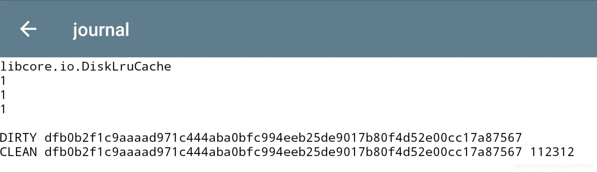

开头的 libcore.io.DiskLruCache 是魔数，用来标识文件，后面的三个 1 是版本号 valueCount 等等，再往下就是图片的操作日志了。

DIRTY、CLEAN 代表操作类型，除了这两个还有 REMOVE 以及 READ，紧接着的一长串字符串是文件的 Key，由上文提到的 SafeKeyGenerator 类生成，是由图片的宽、高、加密解码器等等生成的 SHA-256 散列码 后面的数字是图片大小。

根据这个字符串就可以在同目录下找到对应的图片缓存文件，那么打开缓存文件夹即可看到上面日志中记录的文件：


缓存文件列表

可以看到日志文件中记录的缓存文件就在这个文件夹下面。

由于涉及到磁盘缓存的外部排序问题，所以相对而言磁盘缓存比较复杂。

那么 Glide 的缓存模块至此就结束了，主要是 BitmapPool 中的数据结构以及磁盘缓存比较复杂，其他的倒也不是很复杂。


# 生命周期绑定原理

1、实现原理

在Activity中添加无UI的Fragment，通过Fragment接收Activity传递的生命周期。Fragment和RequestManager基于LifeCycle接口建立联系，并传递生命周期事件，实现生命周期感知。

如何绑定生命周期

在调用Glide.with(Activity activity)的时候，我们跟一下流程

```kotlin
 // with入口
 public static RequestManager with(@NonNull FragmentActivity activity) {
     return getRetriever(activity).get(activity);
 }

 // 此处拿到对应的 FragmentManager，为生成Fragment做准备
 public RequestManager get(@NonNull FragmentActivity activity) {
     if(Util.isOnBackgroundThread()) {
         return this.get(activity.getApplicationContext());
     } else {
         assertNotDestroyed(activity);
         android.support.v4.app.FragmentManager fm = activity.getSupportFragmentManager();
         return this.supportFragmentGet(activity, fm, (Fragment)null, isActivityVisible(activity));
     }
 }
 
 private RequestManager supportFragmentGet(@NonNull Context context, @NonNull android.support.v4.app.FragmentManager fm, @Nullable Fragment parentHint, boolean isParentVisible) {
 	// current就是一个无UI的Fragment实例
     SupportRequestManagerFragment current = this.getSupportRequestManagerFragment(fm, parentHint, isParentVisible);
     RequestManager requestManager = current.getRequestManager();
     if(requestManager == null) {
         Glide glide = Glide.get(context);
 		// 将Fragment的LifeCycle传入RequestManager中，建立起来联系
         requestManager = this.factory.build(glide, current.getGlideLifecycle(), current.getRequestManagerTreeNode(), context);
         current.setRequestManager(requestManager);
     }

     return requestManager;
 }

 //RequestManager的构造方法中绑定LifeCycle，将自己的引用存入LifeCycle，调用LifeCycle的生命周期时进行回调
 lifecycle.addListener(this);

```

 1. Glide绑定Activity时，生成一个无UI的Fragment
 2. 将无UI的Fragment的LifeCycle传入到RequestManager中
 3. 在RequestManager的构造方法中，将RequestManager存入到之前传入的Fragment的LifeCycle，在回调LifeCycle时会回调到

如何通过Fragment的生命周期回调调用Glide的对应方法

通过Fragment的回调调用到Glide的RequestManager的对应的方法即可执行不同的操作，主要绑定的三个方法为：`onStart()`,`onStop()`,`onDestroy()`。回调的源码：

```kotlin
 //RequestManager的构造方法中绑定LifeCycle，将自己的引用存入LifeCycle，调用LifeCycle的生命周期时进行回调
 //这个this是RequestManager的实例
 lifecycle.addListener(this);

 // onDestory的回调示例
 void onDestroy() {
     this.isDestroyed = true;
     Iterator var1 = Util.getSnapshot(this.lifecycleListeners).iterator();

     while(var1.hasNext()) {
         LifecycleListener lifecycleListener = (LifecycleListener)var1.next();
         lifecycleListener.onDestroy();
     }

 }

 //下面看一下RequestManager里面的onDestory方法，里面主要做一些解绑和清除操作
 public void onDestroy() {
     this.targetTracker.onDestroy();
     Iterator var1 = this.targetTracker.getAll().iterator();

     while(var1.hasNext()) {
         Target<?> target = (Target)var1.next();
         this.clear(target);
     }

     this.targetTracker.clear();
     this.requestTracker.clearRequests();
     this.lifecycle.removeListener(this);
     this.lifecycle.removeListener(this.connectivityMonitor);
     this.mainHandler.removeCallbacks(this.addSelfToLifecycle);
     this.glide.unregisterRequestManager(this);
 }
```


# 前言

- `Glide`，该功能非常强大 `Android`  图片加载开源框架 相信大家并不陌生

  

  Github截图

  

- 正由于他的功能强大，所以它的源码非常复杂，这导致很多人望而却步

- **本人尝试将 `Glide` 的功能进行分解，并单独针对每个功能进行源码分析，从而降低`Glide`源码的复杂度。**

> 接下来，我将推出一系列关于 `Glide`的功能源码分析，有兴趣可以继续关注

- 今天，我将主要源码分析`Glide`的基础功能：**图片加载** ，希望你们会喜欢。

> 由于文章较长，希望读者先收藏 & 预留足够时间进行查看。

------

# 目录


目录

------

# 1. 简介

- 定义：`Google`开发者`Sam sjudd`出品的 一个`Android`开源库
- 作用：图片加载
- 具体功能列表


功能列表

注：从上面可看出，`Glide`不仅解决了 图片异步加载 的问题，还解决了`Android`加载图片时的一些常见问题，功能十分强大。

------

# 2. 与主流图片开源库对比

关于`Glide`与主流图片开源库（`Universal-Image-Loader`、`Picasso`、`Fresco`），请看文章：[3分钟全面了解Android主流图片加载库](https://www.jianshu.com/p/97994c9693f9)

------

# 3. 具体使用

关于`Glide`的各种使用方法，请看文章：[Android图片加载库：最全面解析Glide用法
 ](https://www.jianshu.com/p/c3a5518b58b2)

------

# 4. 源码分析

在进行源码分析前，有几点需要特别说明：

1. 本次源码分析是基于 `Glide 3.7.0`，[版本下载地址](https://links.jianshu.com/go?to=https%3A%2F%2Fgithub.com%2Fbumptech%2Fglide%2Ftree%2Fv3.7.0)
2. 本次源码分析是主要分析`Glide`的基本功能：图片加载，所以关于其他功能的代码本文一律忽略

> 因为`Glide`的功能实在太多了，所以源码非常复杂，无法同时分析多个功能。但其他功能将下`Glide`的系列文章继续分析。

1. `Glide`源码较为难懂、难分析的其中一个原因是：许多对象都是很早之前就初始化好，而并非在使用前才初始化。所以当真正使用该对象时，开发者可能已经忘记是在哪里初始化、该对象是作什么用的了。**所以本文会在每个阶段进行一次总结，而读者则需要经常往返看该总结，从而解决上述问题。**

下面，我们将根据 `Glide` 的加载图片的使用步骤一步步源码分析。

- `Glide` 的使用步骤如下：


```csharp
Glide.with(this).load(url).into(imageView);
// 参数说明
// 参数1：Context context
// Context对于很多Android API的调用都是必须的，这里就不多说了

// 参数2：String imageUrl：被加载图像的Url地址
// 大多情况下，一个字符串代表一个网络图片的URL

// 参数3：ImageView targetImageView：图片最终要展示的地方。
```

- 所以

  ```
  Glide
  ```

  的源码分析分为三步：

  1. `.with（）`
  2. `.load（）`
  3. `.into（）`

------

# 4.1 with（）

- 定义：`Glide` 类中的静态方法，根据传入 不同参数 进行 方法重载
- 作用：
  1. 得到一个`RequestManager`对象
  2. 根据传入`with()`方法的参数 **将Glide图片加载的生命周期与Activity/Fragment的生命周期进行绑定，从而实现自动执行请求，暂停操作**
- 下面先说明一些重要对象名


示意图

- 具体源码


```java
public class Glide {
    ...

    // with()重载种类非常多，根据传入的参数可分为：
    // 1. 非Application类型的参数（Activity & Fragment  ）
    // 2. Application类型的参数（Context）
    // 下面将详细分析

// 参数1：Application类型
 public static RequestManager with(Context context) {
        RequestManagerRetriever retriever = RequestManagerRetriever.get();
        // 步骤1：调用RequestManagerRetriever类的静态get()获得RequestManagerRetriever对象 - 单例实现
        return retriever.get(context);
        // 步骤2：调用RequestManagerRetriever实例的get()获取RequestManager对象 & 绑定图片加载的生命周期 ->>分析1
    }

// 参数2：非Application类型（Activity & Fragment ）
    public static RequestManager with(Activity activity) {
        RequestManagerRetriever retriever = RequestManagerRetriever.get();
        return retriever.get(activity);
    }

    public static RequestManager with(Fragment fragment) {
        RequestManagerRetriever retriever = RequestManagerRetriever.get();
        return retriever.get(fragment);

  @TargetApi(Build.VERSION_CODES.HONEYCOMB)
    public static RequestManager with(android.app.Fragment fragment) {
        RequestManagerRetriever retriever = RequestManagerRetriever.get();
        return retriever.get(fragment);
    }

    }
}

<-- 分析1：RequestManagerRetriever对象的实例 get（）-->
// 作用：
  // 1. 获取RequestManager对象
  // 2. 将图片加载的生命周期与Activity/Fragment的生命周期进行绑定

  public class RequestManagerRetriever implements Handler.Callback {
      ...

    // 实例的get（）重载种类很多，参数分为：（与with（）类似）
    // 1. Application类型（Context）
    // 2. 非Application类型（Activity & Fragment ）- >>分析3
    // 下面会详细分析

// 参数1：Application类型（Context） 
   public RequestManager get(Context context) {
        return getApplicationManager(context);
        // 调用getApplicationManager（）最终获取一个RequestManager对象 ->>分析2
        // 因为Application对象的生命周期即App的生命周期
        // 所以Glide加载图片的生命周期是自动与应用程序的生命周期绑定，不需要做特殊处理（若应用程序关闭，Glide的加载也会终止）
    }

// 参数2：非Application类型（Activity & Fragment  ）
// 将Glide加载图片的生命周期与Activity生命周期同步的具体做法：向当前的Activity添加一个隐藏的Fragment
// 原因：因Fragment的生命周期 与 Activity 的是同步的，通过添加隐藏的Fragment 从而监听Activity的生命周期，从而实现Glide加载图片的生命周期与Activity的生命周期 进行同步。
 @TargetApi(Build.VERSION_CODES.HONEYCOMB)
    public RequestManager get(Activity activity) {
        if (Util.isOnBackgroundThread() || Build.VERSION.SDK_INT < Build.VERSION_CODES.HONEYCOMB) {
            return get(activity.getApplicationContext());
        } else {

            assertNotDestroyed(activity);
             //判断activity是否已经销毁

            android.app.FragmentManager fm = activity.getFragmentManager();
            // 获取FragmentManager 对象
            
            return fragmentGet(activity, fm);
           // 通过fragmentGet返回RequestManager->>分析4
           
           
        }
    }

    public RequestManager get(FragmentActivity activity) {
      // 逻辑同上，此处不作过多描述
      ...

    }

    public RequestManager get(Fragment fragment) {
        // 逻辑同上，此处不作过多描述
      ...
    }

}

<-- 分析2：getApplicationManager（context）-->
private RequestManager getApplicationManager(Context context) {

      ...

        Glide glide = Glide.get(context);
        // 通过单例模式创建Glide实例 ->>分析3
        applicationManager =
            new RequestManager(
                glide, new ApplicationLifecycle(), new EmptyRequestManagerTreeNode());
      }
    }
  }
  return applicationManager;
}

<-- 分析3：Glide.get(context) -->
public static Glide get(Context context) {
  if (glide == null) {
  // 单例模式的体现
    synchronized (Glide.class) {
      if (glide == null) {
        Context applicationContext = context.getApplicationContext();
        
        List<GlideModule> modules = new ManifestParser(applicationContext).parse();
        // 解析清单文件配置的自定义GlideModule的metadata标签，返回一个GlideModule集合

        GlideBuilder builder = new GlideBuilder(applicationContext);
        // 步骤1：创建GlideBuilder对象
        for (GlideModule module : modules) {
          module.applyOptions(applicationContext, builder);
        }
        glide = builder.createGlide();
        // 步骤2：根据GlideBuilder对象创建Glide实例
        // GlideBuilder会为Glide设置一默认配置，如：Engine，RequestOptions，GlideExecutor，MemorySizeCalculator
       
        for (GlideModule module : modules) {
          module.registerComponents(applicationContext, glide.registry);
           // 步骤3：利用GlideModule 进行延迟性的配置和ModelLoaders的注册
        }
      }
    }
  }
  return glide;
}
// 回到分析1 进入 分析2的地方


<--分析4：fragmentGet(） -->
// 作用：
           // 1. 创建Fragment
           // 2. 向当前的Activity中添加一个隐藏的Fragment
           // 3. 将RequestManager与该隐藏的Fragment进行绑定
 RequestManager fragmentGet(Context context, android.app.FragmentManager fm) {
     
        RequestManagerFragment current = getRequestManagerFragment(fm);
        // 获取RequestManagerFragment
        // 作用：利用Fragment进行请求的生命周期管理 

        RequestManager requestManager = current.getRequestManager();

        // 若requestManager 为空，即首次加载初始化requestManager 
        if (requestManager == null) {
            // 创建RequestManager传入Lifecycle实现类，如ActivityFragmentLifecycle
            requestManager = new RequestManager(context, current.getLifecycle(), current.getRequestManagerTreeNode());
            current.setRequestManager(requestManager);
            // 调用setRequestManager设置到RequestManagerFragment 
        }
        return requestManager;
    }
```

### 总结

`with（）`是为得到一个`RequestManager`对象 从而将`Glide`加载图片周期 与`Activity` 和`Fragment`进行绑定，从而管理`Glide`加载图片周期

> 1. 最终返回`RequestManager`对象
> 2. 由于本文主要讲解图片加载的功能，所以关于加载图片生命周期的内容暂时不讲解。

------

# 4.2 load（）

- 定义
   由于 `.with()` 返回的是一个`RequestManager`对象，所以 第2步中调用的是 `RequestManager` 类的 `load()`
- 作用
   预先创建好对图片进行一系列操作（加载、编解码、转码）的对象，并全部封装到 `DrawableTypeRequest` `对象中。

> 1. `Glide` 支持加载 图片的URL字符串、图片本地路径等，因此`RequestManager` 类 存在`load()`的重载
> 2. 此处主要讲解 最常见的加载图片 `URL` 字符串的`load()`，即`load(String url)`

- 具体过程


```java
public class RequestManager implements LifecycleListener {

    // 仅贴出关键代码
    ...

     public DrawableTypeRequest<String> load(String string) {
        return (DrawableTypeRequest<String>) fromString().load(string);
        // 先调用fromString（）再调用load（）
        // load（）作用：传入图片URL地址
       // fromString（）作用 ->>分析1
       
    }

<-- 分析1：fromString（）-->
    public DrawableTypeRequest<String> fromString() {
        return loadGeneric(String.class);
         // loadGeneric（）的作用 ->>分析2
    }

<-- 分析2：loadGeneric（）-->
    private <T> DrawableTypeRequest<T> loadGeneric(Class<T> modelClass) {

        ModelLoader<T, InputStream> streamModelLoader = Glide.buildStreamModelLoader(modelClass, context);
        // 创建第1个ModelLoader对象；作用：加载图片
        // Glide会根据load()方法传入不同类型参数，得到不同的ModelLoader对象
        // 此处传入参数是String.class，因此得到的是StreamStringLoader对象（实现了ModelLoader接口）

        ModelLoader<T, ParcelFileDescriptor> fileDescriptorModelLoader = Glide.buildFileDescriptorModelLoader(modelClass, context);
         // 创建第2个ModelLoader对象，作用同上：加载图片
        // 此处得到的是FileDescriptorModelLoader对象

        return optionsApplier.apply(
                new DrawableTypeRequest<T>(modelClass, streamModelLoader, fileDescriptorModelLoader, context,
                        glide, requestTracker, lifecycle, optionsApplier));
            // 创建DrawableTypeRequest对象 & 传入刚才创建的ModelLoader对象 和 其他初始化配置的参数
            // DrawableTypeRequest类分析 ->>分析3
    }

    ...


<-- 分析3：DrawableTypeRequest类（）-->
public class DrawableTypeRequest<ModelType> extends DrawableRequestBuilder<ModelType> implements DownloadOptions {

// 关注1：构造方法
      DrawableTypeRequest(Class<ModelType> modelClass, ModelLoader<ModelType, InputStream> streamModelLoader,
            ModelLoader<ModelType, ParcelFileDescriptor> fileDescriptorModelLoader, Context context, Glide glide,
            RequestTracker requestTracker, Lifecycle lifecycle, RequestManager.OptionsApplier optionsApplier) {
        super(context, modelClass,
                buildProvider(glide, streamModelLoader, fileDescriptorModelLoader, GifBitmapWrapper.class,
                        GlideDrawable.class, null),
                glide, requestTracker, lifecycle);
      // 调用buildProvider()方法 -->分析4
      // 并把上述创建的streamModelLoader和fileDescriptorModelLoader等参数传入到buildProvider()中

// 关注2：DrawableTypeRequest类主要提供2个方法： asBitmap() & asGif() 

    // asBitmap()作用：强制加载 静态图片
    public BitmapTypeRequest<ModelType> asBitmap() {
        return optionsApplier.apply(new BitmapTypeRequest<ModelType>(this, streamModelLoader,
                fileDescriptorModelLoader, optionsApplier));
        // 创建BitmapTypeRequest对象
    }

    // asGif() 作用：强制加载 动态图片
    public GifTypeRequest<ModelType> asGif() {
        return optionsApplier.apply(new GifTypeRequest<ModelType>(this, streamModelLoader, optionsApplier));
        // 创建GifTypeRequest对象

        // 注：若没指定，则默认使用DrawableTypeRequest
    }

}

<-- 分析4：buildProvider(）-->
private static <A, Z, R> FixedLoadProvider<A, ImageVideoWrapper, Z, R> buildProvider(Glide glide,
            ModelLoader<A, InputStream> streamModelLoader,
            ModelLoader<A, ParcelFileDescriptor> fileDescriptorModelLoader, Class<Z> resourceClass,
            Class<R> transcodedClass,
            ResourceTranscoder<Z, R> transcoder) {

        if (transcoder == null) {
            transcoder = glide.buildTranscoder(resourceClass, transcodedClass);
            // 创建GifBitmapWrapperDrawableTranscoder对象（实现了ResourceTranscoder接口）
            // 作用：对图片进行转码
        }

        DataLoadProvider<ImageVideoWrapper, Z> dataLoadProvider = glide.buildDataProvider(ImageVideoWrapper.class,
                resourceClass);
        // 创建ImageVideoGifDrawableLoadProvider对象（实现了DataLoadProvider接口）
        // 作用：对图片进行编解码

        ImageVideoModelLoader<A> modelLoader = new ImageVideoModelLoader<A>(streamModelLoader,
                fileDescriptorModelLoader);
        // 创建ImageVideoModelLoader
        // 并把上面创建的两个ModelLoader：streamModelLoader和fileDescriptorModelLoader封装到了ImageVideoModelLoader中

        return new FixedLoadProvider<A, ImageVideoWrapper, Z, R>(modelLoader, transcoder, dataLoadProvider);
       // 创建FixedLoadProvider对象
       // 把上面创建的GifBitmapWrapperDrawableTranscoder、ImageVideoModelLoader、ImageVideoGifDrawableLoadProvider都封装进去
      // 注：FixedLoadProvider对象就是第3步into（）中onSizeReady()的loadProvider对象
    }
      // 回到分析3的关注点2
```

- 在`RequestManager`的`load()`中，通过`fromString()`最终返回一个`DrawableTypeRequest`对象，并调用该对象的`load()` 传入图片的URL地址

> 请回看分析1上面的代码

- 但从上面的分析3可看出，`DrawableTypeRequest`类中并没有`load()`和第3步需要分析的`into（）`，所以`load()` 和 `into（）` 是在`DrawableTypeRequest`类的父类中：`DrawableRequestBuilder`类中。继承关系如下：


示意图


```java
public class DrawableRequestBuilder<ModelType>
        extends GenericRequestBuilder<ModelType, ImageVideoWrapper, GifBitmapWrapper, GlideDrawable>
        implements BitmapOptions, DrawableOptions {

        ... 

// 最终load()方法返回的其实就是一个DrawableTypeRequest对象
@Override
    public Target<GlideDrawable> into(ImageView view) {
        return super.into(view);
    }

// 特别注意：DrawableRequestBuilder类中有很多使用Glide的API方法，此处不做过多描述

}
```

至此，第2步的 `load（）`分析完成

------

### 总结

`load（）`中预先创建好对图片进行一系列操作（加载、编解码、转码）的对象，并全部封装到 `DrawableTypeRequest`对象中。


示意图

------

## 4.3 into（）

- 作用：构建网络请求对象 并 执行 该网络请求

> 即 获取图片资源 & 加载图片并显示

- 总体逻辑如下:

  

  示意图

- 详细过程：

在第2步的`RequestManager`的`load()`中，最终返回一个`DrawableTypeRequest`对象

> 封装好了对图片进行一系列操作（加载、编解码、转码）的对象

- 但 `DrawableTypeRequest`类中并没有`load()`和第3步需要分析的`into（）`，所以`load()` 和 `into（）` 是在`DrawableTypeRequest`类的父类中：`DrawableRequestBuilder`类

> 继承关系如下


示意图

所以，第三步是调用`DrawableRequestBuilder`类的 `into（）`完成图片的最终加载。


```java
public class DrawableRequestBuilder<ModelType>
        extends GenericRequestBuilder<ModelType, ImageVideoWrapper, GifBitmapWrapper, GlideDrawable>
        implements BitmapOptions, DrawableOptions {

 @Override
    public Target<GlideDrawable> into(ImageView view) {
        return super.into(view);
  // 调用DrawableRequestBuilder的父类GenericRequestBuilder的into() ->>分析1
    }
}

<-- 分析1：GenericRequestBuilder类的into（）-->
public class GenericRequestBuilder<ModelType> {

  ...

  public Target<TranscodeType> into(ImageView view) {

  // 判断是否在主线程(跟新UI只能在主线程)
  // 此处逻辑先不讲解，后面会详细说明，直接跳到方法的最后一行
    Util.assertMainThread();
    if (view == null) {
        throw new IllegalArgumentException("You must pass in a non null View");
    }
    if (!isTransformationSet && view.getScaleType() != null) {
        switch (view.getScaleType()) {
            case CENTER_CROP:
                applyCenterCrop();
                break;
            case FIT_CENTER:
            case FIT_START:
            case FIT_END:
                applyFitCenter();
                break;
            //$CASES-OMITTED$
            default:
                // Do nothing.
        }
    }
    return into(glide.buildImageViewTarget(view, transcodeClass));
    // 创建Target对象：用于最终展示图片 ->>分析2
    // 从分析3回来
  }
}

<-- 分析2：buildImageViewTarget（）-->
<R> Target<R> buildImageViewTarget(ImageView imageView, Class<R> transcodedClass) {
    return imageViewTargetFactory.buildTarget(imageView, transcodedClass);
    // ->>分析3

}

<-- 分析3：ImageViewTargetFactory的buildTarget()-->

public class ImageViewTargetFactory {

    public <Z> Target<Z> buildTarget(ImageView view, Class<Z> clazz) {


        // 根据传入的class参数构建不同的Target对象，分为三种情况：
        // 情况1：若加载图片时调用了asBitmap()，那么构建的是BitmapImageViewTarget对象
       // 情况2：否则构建的是GlideDrawableImageViewTarget对象
       // 情况3：DrawableImageViewTarget对象基本用不到，此处忽略
       // 具体请看以下代码
        if (GlideDrawable.class.isAssignableFrom(clazz)) {
            return (Target<Z>) new GlideDrawableImageViewTarget(view);
        } else if (Bitmap.class.equals(clazz)) {
            return (Target<Z>) new BitmapImageViewTarget(view);    
        } else if (Drawable.class.isAssignableFrom(clazz)) {
            return (Target<Z>) new DrawableImageViewTarget(view);   
        } else {
            throw new IllegalArgumentException("Unhandled class: " + clazz
                    + ", try .as*(Class).transcode(ResourceTranscoder)");
        }
    }
}
```


示意图

- 此处得到了`GlideDrawableImageViewTarget`对象（大多数情况下）
- 回到上面分析1 - `GenericRequestBuilder` 类的 `into（）`最后一行：将`GlideDrawableImageViewTarget`对象传入到`GenericRequestBuilder`的`into(Target target)`中

我们继续看 `GenericRequestBuilder`的`into(Target target)` 的源码：


```cpp
public <Y extends Target<TranscodeType>> Y into(Y target) {

    Request request = buildRequest(target);
    // 关注1：构建Request对象：发出加载图片请求
    target.setRequest(request);
    // 将请求设置到target
    lifecycle.addListener(target);
    // 将target加入到lifecycle
    requestTracker.runRequest(request);
    // 关注2：执行网络请求Request
    return target;

}
```

- 此处是 **发送加载图片网络请求**
- 有2个关注点：构建 `Request` 对象 & 执行 `Request`

### 4.3.1 构建Request对象

- 作用
   创建 `GenericRequest` 对象 & 初始化（即将 `load（）`中的`API`参数赋值到`GenericRequest`对象中）


```java
<-- 分析4：buildRequest() -->
// 作用：构建Request对象
private Request buildRequest(Target<TranscodeType> target) {
    return buildRequestRecursive(target, null);
    // 往下调用
}

private Request buildRequestRecursive(Target<TranscodeType> target, ThumbnailRequestCoordinator parentCoordinator) {
        // 90%的代码用于处理缩略图，此处仅关注主流程，即如何构建Request对象
        // 仅贴出关键代码（如何构建Request对象）  
        ... 

        ThumbnailRequestCoordinator coordinator = new ThumbnailRequestCoordinator(parentCoordinator);
        Request fullRequest = obtainRequest(target, sizeMultiplier, priority, coordinator);
        // 往下调用
        
private Request obtainRequest(Target<TranscodeType> target, float sizeMultiplier, Priority priority,
        RequestCoordinator requestCoordinator) {

    return GenericRequest.obtain(
            loadProvider,
            model,
            signature,
            context,
            priority,
            target,
            sizeMultiplier,
            placeholderDrawable,
            placeholderId,
            errorPlaceholder,
            errorId,
            fallbackDrawable,
            fallbackResource,
            requestListener,
            requestCoordinator,
            glide.getEngine(),
            transformation,
            transcodeClass,
            isCacheable,
            animationFactory,
            overrideWidth,
            overrideHeight,
            diskCacheStrategy);
    // 调用了GenericRequest的obtain()
    // 作用：将在load()中调用的所有API参数都组装到Request对象当中 -->分析5
}

<-- 分析5：GenericRequest的obtain()  -->
public final class GenericRequest<A, T, Z, R> implements Request, SizeReadyCallback,
        ResourceCallback {
    // 仅贴出关键代码
    ...

    public static <A, T, Z, R> GenericRequest<A, T, Z, R> obtain(
            LoadProvider<A, T, Z, R> loadProvider,
            A model,
            Key signature,
            Context context,
            Priority priority,
            Target<R> target,
            float sizeMultiplier,
            Drawable placeholderDrawable,
            int placeholderResourceId,
            Drawable errorDrawable,
            int errorResourceId,
            Drawable fallbackDrawable,
            int fallbackResourceId,
            RequestListener<? super A, R> requestListener,
            RequestCoordinator requestCoordinator,
            Engine engine,
            Transformation<Z> transformation,
            Class<R> transcodeClass,
            boolean isMemoryCacheable,
            GlideAnimationFactory<R> animationFactory,
            int overrideWidth,
            int overrideHeight,
            DiskCacheStrategy diskCacheStrategy) {
        @SuppressWarnings("unchecked")
        GenericRequest<A, T, Z, R> request = (GenericRequest<A, T, Z, R>) REQUEST_POOL.poll();
        if (request == null) {
            request = new GenericRequest<A, T, Z, R>();
            // 创建GenericRequest对象
        }
        // init（）作用：将传入的Load（）中的API参数赋值到GenericRequest的成员变量
        request.init(loadProvider,
                model,
                signature,
                context,
                priority,
                target,
                sizeMultiplier,
                placeholderDrawable,
                placeholderResourceId,
                errorDrawable,
                errorResourceId,
                fallbackDrawable,
                fallbackResourceId,
                requestListener,
                requestCoordinator,
                engine,
                transformation,
                transcodeClass,
                isMemoryCacheable,
                animationFactory,
                overrideWidth,
                overrideHeight,
                diskCacheStrategy);
        return request;
        // 返回GenericRequest对象
    }

    ...
}
```

至此，一个 发送加载图片的网络请求 `Request` 对象`GenericRequest` 创建完毕。

> 本文主要针对图片加载功能，关于发送加载图片的网络请求细节将在下篇文章进行描述。

### 总结


示意图

------

### 4.3.2 执行网络请求对象Request


```cpp
public <Y extends Target<TranscodeType>> Y into(Y target) {

    Request request = buildRequest(target);
    // 关注1：构建Request对象：发出加载图片请求
    target.setRequest(request);
    lifecycle.addListener(target);
    requestTracker.runRequest(request);
    // 关注2：执行Request ->>分析6
    return target;
}
```


```csharp
/**
  * 步骤1：加载前
**/
<-- 分析6：runRequest(request) -->
public void runRequest(Request request) {
    // 此时的Request是GenericRequest对象
    requests.add(request);
    // 将每个提交的请求加入到一个set中：管理请求
    
    // 判断Glide当前是否处于暂停状态    
    if (!isPaused) {
        // 若不处于暂停状态，则调用GenericRequest的begin()来执行Request ->>分析7
        request.begin();
    } else {
        // 若处于暂停，则先将Request添加到待执行队列里面，等暂停状态解除后再执行
        pendingRequests.add(request);
    }
}

/**
  * 步骤2：加载时
**/
<-- 分析7：GenericRequest的begin() -->
public void begin() {

// 有2个关注点

// 关注1
    // model = 第2步load()传入的图片URL地址
    // 若model（）等于null，会调用onException()
    // onException()内部调用setErrorPlaceholder()
    if (model == null) {
        onException(null);
        return;
    }
    status = Status.WAITING_FOR_SIZE;

// 关注2：
// 图片加载情况分两种：
// 1. 开发者使用了override() API为图片指定了一个固定的宽高
// 2. 无使用

// 情况1：使用了override() API为图片指定了一个固定的宽高
    if (Util.isValidDimensions(overrideWidth, overrideHeight)) {
        onSizeReady(overrideWidth, overrideHeight);
        // 调用onSizeReady()加载

// 否则，则是情况2，调用target.getSize()
    } else {
        target.getSize(this);
        // target.getSize()的内部会根据ImageView的layout_width和layout_height值做一系列的计算，来算出图片显示的宽高
        // 计算后，也会调用onSizeReady()方法进行加载
    }
    if (!isComplete() && !isFailed() && canNotifyStatusChanged()) {
        target.onLoadStarted(getPlaceholderDrawable());
        // 从分析8看回来的：在图片请求开始前，会先使用Loading占位图代替最终的图片显示
    }

}
```

在`begin（）`方法中有两个关注点：

- 关注点1：若`model`（第2步load()传入的图片URL地址）等于null，会调用`onException()`
- 关注点2：图片加载情况
   下面将详细说明

### 关注1

若`model`（第2步`load()`传入的图片`URL`地址）等于`null`，会调用`onException()`（内部调用`setErrorPlaceholder()`）


```java
private void setErrorPlaceholder(Exception e) {

    Drawable error = model == null ? getFallbackDrawable() : null;

    // 若有error的占位图，则采用先获取error的占位图
    if (error == null) {
      error = getErrorDrawable();
    }
    // 若没有error的占位图，则再去获取一个loading占位图
    if (error == null) {
        error = getPlaceholderDrawable();
    }
    target.onLoadFailed(e, error);
    // 将占位图（error / loading）传入到onLoadFailed（）中 ->>分析8
}

<-- 分析8：onLoadFailed（） -->
public abstract class ImageViewTarget<Z> extends ViewTarget<ImageView, Z> implements GlideAnimation.ViewAdapter {
    ...

    @Override
    public void onLoadFailed(Exception e, Drawable errorDrawable) {
        view.setImageDrawable(errorDrawable);
        // 将该error占位图显示到ImageView
    }

    @Override
    public void onLoadStarted(Drawable placeholder) {
        view.setImageDrawable(placeholder);
        // 在图片请求开始前，会先使用Loading占位图代替最终的图片显示
        // 在begin（）时调用（回看分析7）
    }


    ...
}
```

所以此处显示出Glide的用法：

- 若传入图片的`url`为 `Null`，会采用`error / loading`的占位图进行代替
- 图片请求开始前，会先使用 `Loading` 占位图 代替 最终的图片显示

### 关注2

图片加载情况（重点关注）


```java
<-- 分析7：GenericRequest的begin() -->
public void begin() {

// 关注1（请跳过，直接看关注2）
    // 若model（第2步load()传入的图片URL地址）等于null，会调用onException()
    // onException()内部调用setErrorPlaceholder()
    if (model == null) {
        onException(null);
        return;
    }
    status = Status.WAITING_FOR_SIZE;

// 关注2：
  // 图片加载情况分两种：
    // 1. 为图片指定加载固定的宽高（使用override() 的API）
    // 2. 无指定加载的宽高

// 情况1：为图片指定加载固定的宽高（使用override() 的API）
    if (Util.isValidDimensions(overrideWidth, overrideHeight)) {
        onSizeReady(overrideWidth, overrideHeight);
        // 调用onSizeReady()加载->>分析9

// 否则，则是情况2：无指定加载的宽高
    } else {
        target.getSize(this);
        // target.getSize()会根据ImageView的layout_width和layout_height值做一系列的计算，来算出图片显示的宽高
        // 计算后，最终也会调用onSizeReady()进行加载
    }
    
 
}

<-- 分析9：onSizeReady()-->
public void onSizeReady(int width, int height) {

    // loadProvider 对象 即 第2步load（）中的FixedLoadProvider对象 
    // 里面封装了GifBitmapWrapperDrawableTranscoder、ImageVideoModelLoader、ImageVideoGifDrawableLoadProvider对象）
    // ->>请回看第2步load（）中的 分析3：DrawableTypeRequest类

    ModelLoader<A, T> modelLoader = loadProvider.getModelLoader();
    // 从loadProvider 对象中获取ImageVideoModelLoader对象
    ResourceTranscoder<Z, R> transcoder = loadProvider.getTranscoder();
    // 从loadProvider 对象中获取GifBitmapWrapperDrawableTranscoder对象

    final DataFetcher<T> dataFetcher = modelLoader.getResourceFetcher(model, width, height);
    // ->>分析10
    // 创建ImageVideoFetcher对象（传入HttpUrlFetcher对象）
  
    loadStatus = engine.load(signature, width, height, dataFetcher, loadProvider, transformation, transcoder,
            priority, isMemoryCacheable, diskCacheStrategy, this);
    // 将上述获得的ImageVideoFetcher、GifBitmapWrapperDrawableTranscoder等一起传入到了Engine的load()方法中 ->>分析11

    }
    ...
}

<--分析10：ImageVideoModelLoader的getResourceFetcher() -->

public class ImageVideoModelLoader<A> implements ModelLoader<A, ImageVideoWrapper> {
  
    @Override
    public DataFetcher<ImageVideoWrapper> getResourceFetcher(A model, int width, int height) {
        
         DataFetcher<ParcelFileDescriptor> fileDescriptorFetcher = null;
         if (fileDescriptorLoader != null) {
            fileDescriptorFetcher = fileDescriptorLoader.getResourceFetcher(model, width, height);
            // fileDescriptorLoader是在第2步load（）中创建的FileDescriptorModelLoader：用于加载图片
           // 调用FileDescriptorModelLoader的getResourceFetcher()会得到一个HttpUrlFetcher对象
        }

        DataFetcher<InputStream> streamFetcher = null;
        if (streamLoader != null) {
            streamFetcher = streamLoader.getResourceFetcher(model, width, height);
            // streamLoader是在第2步load（）中创建的StreamStringLoader：用于加载图片
           // 调用streamLoader的getResourceFetcher()会得到一个HttpUrlFetcher对象
        }
      

        if (streamFetcher != null || fileDescriptorFetcher != null) {
            return new ImageVideoFetcher(streamFetcher, fileDescriptorFetcher);
        // 创建ImageVideoFetcher对象，并把上述获得的2个HttpUrlFetcher对象传进去
        // 即调用ImageVideoModelLoader的getResourceFetcher()得到的是ImageVideoFetcher
        } else {
            return null;
        }
    }
} 
// 回到分析9原处
```


```java
<-- 分析11：Engine的load() -->
public class Engine implements EngineJobListener,
        MemoryCache.ResourceRemovedListener,
        EngineResource.ResourceListener {

      ...
      // 省略关键代码

        EngineJob engineJob = engineJobFactory.build(key, isMemoryCacheable);
        // 创建EngineJob对象
        // 作用：开启线程（作异步加载图片）

        DecodeJob<T, Z, R> decodeJob = new DecodeJob<T, Z, R>(key, width, height, fetcher, loadProvider, transformation,
                transcoder, diskCacheProvider, diskCacheStrategy, priority);
        // 创建DecodeJob对象
        // 作用：对图片解码（较复杂，下面会详细说明）

        EngineRunnable runnable = new EngineRunnable(engineJob, decodeJob, priority);
        // 创建EngineRunnable对象
        jobs.put(key, engineJob);
        engineJob.addCallback(cb);
        engineJob.start(runnable);
        // 执行EngineRunnable对象
        // 即在子线程中执行EngineRunnable的run()方法 ->>分析12

        return new LoadStatus(cb, engineJob);
    }

    ...
}

<--分析12：EngineRunnable的run() -->
    @Override
    public void run() {
   
    try {
        resource = decode();
        // 调用decode() 并 返回了一个Resource对象 ->>分析13

    } catch (Exception e) {
        if (Log.isLoggable(TAG, Log.VERBOSE)) {
            Log.v(TAG, "Exception decoding", e);
        }
       ...
}

<--分析13：decode() -->
private Resource<?> decode() throws Exception {

// 分两种情况：从缓存当中读（解码）图片 & 不从缓存中读（解码）图片

    if (isDecodingFromCache()) {
    // 若从缓存中decode图片：执行decodeFromCache()
    // 本文先不讨论缓存情况
        return decodeFromCache();
    } else {
        // 不从缓存中读（解码）图片：执行decodeFromSource()  ->>分析14
        return decodeFromSource();
    }
}

<--分析14：decodeFromSource()  -->
private Resource<?> decodeFromSource() throws Exception {
    return decodeJob.decodeFromSource();
    // 调用了DecodeJob的decodeFromSource()方法 ->>分析15
}


<--分析15：DecodeJob.decodeFromSource() -->
class DecodeJob<A, T, Z> {
    ...

   public Resource<Z> decodeFromSource() throws Exception {
        Resource<T> decoded = decodeSource();
        // 获得Resource对象 ->>分析16
        return transformEncodeAndTranscode(decoded);
        // 调用transformEncodeAndTranscode()方法来处理该Resource对象。
    }

<--分析16： decodeSource()  -->
    private Resource<T> decodeSource() throws Exception {
    ...

        try {
            final A data = fetcher.loadData(priority);
            // 该fetcher是在分析10：onSizeReady()中得到的ImageVideoFetcher对象
            // 即调用ImageVideoFetcher的loadData() - >>分析17

            // 从分析17回来时看这里：
            decoded = decodeFromSourceData(data);
            // 将分析17创建的ImageVideoWrapper对象传入到decodeFromSourceData()，解码该对象 -->分析19

      }

    ...
}

<--分析17： fetcher.loadData（）  -->
@Override
public ImageVideoWrapper loadData(Priority priority) throws Exception {
    InputStream is = null;

    if (streamFetcher != null) {
        try {
            is = streamFetcher.loadData(priority);
           // 该streamFetcher是创建ImageVideoFetcher对象时传入的HttpUrlFetcher
          // 因此这里调用的是HttpUrlFetcher的loadData() ->>分析18
        } catch (Exception e) {

    return new ImageVideoWrapper(is, fileDescriptor);
    // 从分析18回来时看这里
    // 创建ImageVideoWrapper对象 & 传入分析18创建的InputStream ->>回到分析16
}


<--分析18：HttpUrlFetcher的loadData（）  -->
// 此处是网络请求的代码
public class HttpUrlFetcher implements DataFetcher<InputStream> {

    @Override
    public InputStream loadData(Priority priority) throws Exception {
        return loadDataWithRedirects(glideUrl.toURL(), 0 /*redirects*/, null /*lastUrl*/, glideUrl.getHeaders());
        // 继续往下看
    }

    private InputStream loadDataWithRedirects(URL url, int redirects, URL lastUrl, Map<String, String> headers)
           ...

        // 静态工厂模式创建HttpURLConnection对象
        urlConnection = connectionFactory.build(url);
        for (Map.Entry<String, String> headerEntry : headers.entrySet()) {
          urlConnection.addRequestProperty(headerEntry.getKey(), headerEntry.getValue());
        }
        //设置请求参数
        //设置连接超时时间2500ms
        urlConnection.setConnectTimeout(2500);
        //设置读取超时时间2500ms
        urlConnection.setReadTimeout(2500);
        //不使用http缓存
        urlConnection.setUseCaches(false);
        urlConnection.setDoInput(true);

        // Connect explicitly to avoid errors in decoders if connection fails.
        urlConnection.connect();
        if (isCancelled) {
            return null;
        }
        final int statusCode = urlConnection.getResponseCode();
        if (statusCode / 100 == 2) {
              //请求成功
            return getStreamForSuccessfulRequest(urlConnection);
            // 继续往下看
        } 
    }

      private InputStream getStreamForSuccessfulRequest(HttpURLConnection urlConnection)
            throws IOException {
        if (TextUtils.isEmpty(urlConnection.getContentEncoding())) {
            int contentLength = urlConnection.getContentLength();
            stream = ContentLengthInputStream.obtain(urlConnection.getInputStream(), contentLength);
        } else {
            if (Log.isLoggable(TAG, Log.DEBUG)) {
                Log.d(TAG, "Got non empty content encoding: " + urlConnection.getContentEncoding());
            }
            stream = urlConnection.getInputStream();
        }
        return stream;
        // 最终返回InputStream对象（但还没开始读取数据）
        // 回到分析17中的最后一行
    }
        
    }
}
```

### 分析19：图片的解码


```java
<--分析19：decodeFromSourceData()（）  -->
private Resource<T> decodeFromSourceData(A data) throws IOException {

        decoded = loadProvider.getSourceDecoder().decode(data, width, height);
        // 调用loadProvider.getSourceDecoder()得到的是GifBitmapWrapperResourceDecoder对象
        // 即调用GifBitmapWrapperResourceDecoder对象的decode()来对图片进行解码 ->>分析20
    
    return decoded;
}

<--分析20：GifBitmapWrapperResourceDecoder对象的decode()  -->
    public class GifBitmapWrapperResourceDecoder implements ResourceDecoder<ImageVideoWrapper, GifBitmapWrapper> {

    ...

    @Override
    public Resource<GifBitmapWrapper> decode(ImageVideoWrapper source, int width, int height) throws IOException {

            wrapper = decode(source, width, height, tempBytes);
            // 传入参数，并调用了另外一个decode（）进行重载 ->>分析21

    }

<--分析21：重载的decode（） -->
    private GifBitmapWrapper decode(ImageVideoWrapper source, int width, int height, byte[] bytes) throws IOException {
        final GifBitmapWrapper result;
        if (source.getStream() != null) {
            result = decodeStream(source, width, height, bytes);
            // 作用：从服务器返回的流当中读取数据- >>分析22
            
        } else {
            result = decodeBitmapWrapper(source, width, height);
        }
        return result;
    }

<--分析22：decodeStream（） -->
// 作用：从服务器返回的流当中读取数据
// 读取方式：
        // 1. 从流中读取2个字节的数据：判断该图是GIF图还是普通的静图
        // 2. 若是GIF图，就调用decodeGifWrapper() 解码
        // 3. 若普通静图，就调用decodeBitmapWrapper() 解码
        // 此处仅分析 对于静图解码
    private GifBitmapWrapper decodeStream(ImageVideoWrapper source, int width, int height, byte[] bytes)
            throws IOException {
        
        // 步骤1：从流中读取两个2字节数据进行图片类型的判断
        InputStream bis = streamFactory.build(source.getStream(), bytes);
        bis.mark(MARK_LIMIT_BYTES);
        ImageHeaderParser.ImageType type = parser.parse(bis);
        bis.reset();
        GifBitmapWrapper result = null;

        // 步骤2：若是GIF图，就调用decodeGifWrapper() 解码
        if (type == ImageHeaderParser.ImageType.GIF) {
            result = decodeGifWrapper(bis, width, height);
        }

        // 步骤3：若是普通静图，就调用decodeBitmapWrapper()解码
        if (result == null) {
            ImageVideoWrapper forBitmapDecoder = new ImageVideoWrapper(bis, source.getFileDescriptor());
            result = decodeBitmapWrapper(forBitmapDecoder, width, height);
            // ->>分析23
        }
        return result;
    }

<-- 分析23：decodeBitmapWrapper() -->
    private GifBitmapWrapper decodeBitmapWrapper(ImageVideoWrapper toDecode, int width, int height) throws IOException {
        GifBitmapWrapper result = null;
        Resource<Bitmap> bitmapResource = bitmapDecoder.decode(toDecode, width, height);
       //  bitmapDecoder是一个ImageVideoBitmapDecoder对象
       // 即调用ImageVideoBitmapDecoder对象的decode（）->>分析24
        if (bitmapResource != null) {
            result = new GifBitmapWrapper(bitmapResource, null);
        }
        return result;
    }

    ...
}

<-- 分析24：ImageVideoBitmapDecoder.decode() -->
public class ImageVideoBitmapDecoder implements ResourceDecoder<ImageVideoWrapper, Bitmap> {

    ...

    @Override
    public Resource<Bitmap> decode(ImageVideoWrapper source, int width, int height) throws IOException {
        Resource<Bitmap> result = null;
        InputStream is = source.getStream();
        // 步骤1：获取到服务器返回的InputStream
        if (is != null) {
            try {
                result = streamDecoder.decode(is, width, height);
                // 步骤2：调用streamDecoder.decode()进行解码
                // streamDecode是一个StreamBitmapDecoder对象 ->>分析25

            } catch (IOException e) {
    ...
}

<-- 分析25：StreamBitmapDecoder.decode() -->
public class StreamBitmapDecoder implements ResourceDecoder<InputStream, Bitmap> {

    ...

    @Override
    public Resource<Bitmap> decode(InputStream source, int width, int height) {
        Bitmap bitmap = downsampler.decode(source, bitmapPool, width, height, decodeFormat);
        // Downsampler的decode() ->>分析26

        // 从分析26回来看这里：
        return BitmapResource.obtain(bitmap, bitmapPool);
        // 作用：将分析26中返回的Bitmap对象包装成Resource<Bitmap>对象
        // 因为decode()返回的是一个Resource<Bitmap>对象；而从Downsampler中得到的是一个Bitmap对象，需要进行类型的转换
        // 经过这样一层包装后，如果还需要获取Bitmap，只需要调用Resource<Bitmap>的get()即可
        // 接下来，我们需要一层层地向上返回（请向下看直到跳出该代码块）
    }

    ...
}

<-- 分析26：downsampler.decode（）  -->
// 主要作用：读取服务器返回的InputStream & 加载图片
// 其他作用：对图片的压缩、旋转、圆角等逻辑处理
public abstract class Downsampler implements BitmapDecoder<InputStream> {

    ...

    @Override
    public Bitmap decode(InputStream is, BitmapPool pool, int outWidth, int outHeight, DecodeFormat decodeFormat) {
        final ByteArrayPool byteArrayPool = ByteArrayPool.get();
        final byte[] bytesForOptions = byteArrayPool.getBytes();
        final byte[] bytesForStream = byteArrayPool.getBytes();
        final BitmapFactory.Options options = getDefaultOptions();
        // Use to fix the mark limit to avoid allocating buffers that fit entire images.
        RecyclableBufferedInputStream bufferedStream = new RecyclableBufferedInputStream(
                is, bytesForStream);
        // Use to retrieve exceptions thrown while reading.
        // TODO(#126): when the framework no longer returns partially decoded Bitmaps or provides a way to determine
        // if a Bitmap is partially decoded, consider removing.
        ExceptionCatchingInputStream exceptionStream =
                ExceptionCatchingInputStream.obtain(bufferedStream);
        // Use to read data.
        // Ensures that we can always reset after reading an image header so that we can still attempt to decode the
        // full image even when the header decode fails and/or overflows our read buffer. See #283.
        MarkEnforcingInputStream invalidatingStream = new MarkEnforcingInputStream(exceptionStream);
        try {
            exceptionStream.mark(MARK_POSITION);
            int orientation = 0;
            try {
                orientation = new ImageHeaderParser(exceptionStream).getOrientation();
            } catch (IOException e) {
                if (Log.isLoggable(TAG, Log.WARN)) {
                    Log.w(TAG, "Cannot determine the image orientation from header", e);
                }
            } finally {
                try {
                    exceptionStream.reset();
                } catch (IOException e) {
                    if (Log.isLoggable(TAG, Log.WARN)) {
                        Log.w(TAG, "Cannot reset the input stream", e);
                    }
                }
            }
            options.inTempStorage = bytesForOptions;
            final int[] inDimens = getDimensions(invalidatingStream, bufferedStream, options);
            final int inWidth = inDimens[0];
            final int inHeight = inDimens[1];
            final int degreesToRotate = TransformationUtils.getExifOrientationDegrees(orientation);
            final int sampleSize = getRoundedSampleSize(degreesToRotate, inWidth, inHeight, outWidth, outHeight);
            final Bitmap downsampled =
                    downsampleWithSize(invalidatingStream, bufferedStream, options, pool, inWidth, inHeight, sampleSize,
                            decodeFormat);
            // BitmapFactory swallows exceptions during decodes and in some cases when inBitmap is non null, may catch
            // and log a stack trace but still return a non null bitmap. To avoid displaying partially decoded bitmaps,
            // we catch exceptions reading from the stream in our ExceptionCatchingInputStream and throw them here.
            final Exception streamException = exceptionStream.getException();
            if (streamException != null) {
                throw new RuntimeException(streamException);
            }
            Bitmap rotated = null;
            if (downsampled != null) {
                rotated = TransformationUtils.rotateImageExif(downsampled, pool, orientation);
                if (!downsampled.equals(rotated) && !pool.put(downsampled)) {
                    downsampled.recycle();
                }
            }
            return rotated;
        } finally {
            byteArrayPool.releaseBytes(bytesForOptions);
            byteArrayPool.releaseBytes(bytesForStream);
            exceptionStream.release();
            releaseOptions(options);
        }
    }

    private Bitmap downsampleWithSize(MarkEnforcingInputStream is, RecyclableBufferedInputStream  bufferedStream,
            BitmapFactory.Options options, BitmapPool pool, int inWidth, int inHeight, int sampleSize,
            DecodeFormat decodeFormat) {
        // Prior to KitKat, the inBitmap size must exactly match the size of the bitmap we're decoding.
        Bitmap.Config config = getConfig(is, decodeFormat);
        options.inSampleSize = sampleSize;
        options.inPreferredConfig = config;
        if ((options.inSampleSize == 1 || Build.VERSION_CODES.KITKAT <= Build.VERSION.SDK_INT) && shouldUsePool(is)) {
            int targetWidth = (int) Math.ceil(inWidth / (double) sampleSize);
            int targetHeight = (int) Math.ceil(inHeight / (double) sampleSize);
            // BitmapFactory will clear out the Bitmap before writing to it, so getDirty is safe.
            setInBitmap(options, pool.getDirty(targetWidth, targetHeight, config));
        }
        return decodeStream(is, bufferedStream, options);
    }

    /**
     * A method for getting the dimensions of an image from the given InputStream.
     *
     * @param is The InputStream representing the image.
     * @param options The options to pass to
     *          {@link BitmapFactory#decodeStream(InputStream, android.graphics.Rect,
     *              BitmapFactory.Options)}.
     * @return an array containing the dimensions of the image in the form {width, height}.
     */
    public int[] getDimensions(MarkEnforcingInputStream is, RecyclableBufferedInputStream bufferedStream,
            BitmapFactory.Options options) {
        options.inJustDecodeBounds = true;
        decodeStream(is, bufferedStream, options);
        options.inJustDecodeBounds = false;
        return new int[] { options.outWidth, options.outHeight };
    }

    private static Bitmap decodeStream(MarkEnforcingInputStream is, RecyclableBufferedInputStream bufferedStream,
            BitmapFactory.Options options) {
         if (options.inJustDecodeBounds) {
             // This is large, but jpeg headers are not size bounded so we need something large enough to minimize
             // the possibility of not being able to fit enough of the header in the buffer to get the image size so
             // that we don't fail to load images. The BufferedInputStream will create a new buffer of 2x the
             // original size each time we use up the buffer space without passing the mark so this is a maximum
             // bound on the buffer size, not a default. Most of the time we won't go past our pre-allocated 16kb.
             is.mark(MARK_POSITION);
         } else {
             // Once we've read the image header, we no longer need to allow the buffer to expand in size. To avoid
             // unnecessary allocations reading image data, we fix the mark limit so that it is no larger than our
             // current buffer size here. See issue #225.
             bufferedStream.fixMarkLimit();
         }

        final Bitmap result = BitmapFactory.decodeStream(is, null, options);
        return result;
        // decode()方法执行后会返回一个Bitmap对象
        // 此时图片已经被加载出来
        // 接下来的工作是让加载了的Bitmap显示到界面上
        // 请回到分析25
    }

    ...
}
```

------

#### 步骤3：返回图片资源

加载完图片后，需要一层层向上返回

- 返回路径
   `StreamBitmapDecoder`（分析25）-> `ImageVideoBitmapDecoder`（分析24）-> `GifBitmapWrapperResourceDecoder``decodeBitmapWrapper()`（分析23）
- 由于隔得太远，我重新把（分析23）`decodeBitmapWrapper()`贴出


```java
<-- 分析23：decodeBitmapWrapper -->
private GifBitmapWrapper decodeBitmapWrapper(ImageVideoWrapper toDecode, int width, int height) throws IOException {
    GifBitmapWrapper result = null;
    Resource<Bitmap> bitmapResource = bitmapDecoder.decode(toDecode, width, height);
    if (bitmapResource != null) {
        result = new GifBitmapWrapper(bitmapResource, null);
        // 将Resource<Bitmap>封装到了一个GifBitmapWrapper对象
    }
    return result;
   // 最终返回的是一个GifBitmapWrapper对象：既能封装GIF，又能封装Bitmap，从而保证了不管是什么类型的图片，Glide都能加载
   // 接下来我们分析下GifBitmapWrapper（） ->>分析27
}

<-- 分析27：GifBitmapWrapper（） -->
// 作用：分别对gifResource和bitmapResource做了一层封装
public class GifBitmapWrapper {
    private final Resource<GifDrawable> gifResource;
    private final Resource<Bitmap> bitmapResource;

    public GifBitmapWrapper(Resource<Bitmap> bitmapResource, Resource<GifDrawable> gifResource) {
        if (bitmapResource != null && gifResource != null) {
            throw new IllegalArgumentException("Can only contain either a bitmap resource or a gif resource, not both");
        }
        if (bitmapResource == null && gifResource == null) {
            throw new IllegalArgumentException("Must contain either a bitmap resource or a gif resource");
        }
        this.bitmapResource = bitmapResource;
        this.gifResource = gifResource;
    }

    /**
     * Returns the size of the wrapped resource.
     */
    public int getSize() {
        if (bitmapResource != null) {
            return bitmapResource.getSize();
        } else {
            return gifResource.getSize();
        }
    }

    /**
     * Returns the wrapped {@link Bitmap} resource if it exists, or null.
     */
    public Resource<Bitmap> getBitmapResource() {
        return bitmapResource;
    }

    /**
     * Returns the wrapped {@link GifDrawable} resource if it exists, or null.
     */
    public Resource<GifDrawable> getGifResource() {
        return gifResource;
    }
}
```

- 然后该`GifBitmapWrapper`对象会一直向上返回
- 直到返回到`GifBitmapWrapperResourceDecoder的decode()`时（分析20），会对`GifBitmapWrapper`对象再做一次封装，如下所示：

> 此处将上面的分析20再次粘贴过来


```java
<--分析20：GifBitmapWrapperResourceDecoder对象的decode()  -->
public class GifBitmapWrapperResourceDecoder implements ResourceDecoder<ImageVideoWrapper, GifBitmapWrapper> {

    ...
    @Override
    public Resource<GifBitmapWrapper> decode(ImageVideoWrapper source, int width, int height) throws IOException {

        try {
            wrapper = decode(source, width, height, tempBytes);
        } finally {
            pool.releaseBytes(tempBytes);
        }

        // 直接看这里
        return wrapper != null ? new GifBitmapWrapperResource(wrapper) : null;
        // 将GifBitmapWrapper封装到一个GifBitmapWrapperResource对象中（Resource<GifBitmapWrapper>类型） 并返回
        // 该GifBitmapWrapperResource和上述的BitmapResource类似- 实现了Resource接口，可通过get()来获取封装的具体内容
        // GifBitmapWrapperResource（）源码分析 - >>分析28
    }

<-- 分析28： GifBitmapWrapperResource（）-->
// 作用：经过这层封装后，我们从网络上得到的图片就能够以Resource接口的形式返回，并且还能同时处理Bitmap图片和GIF图片这两种情况。
public class GifBitmapWrapperResource implements Resource<GifBitmapWrapper> {
    private final GifBitmapWrapper data;

    public GifBitmapWrapperResource(GifBitmapWrapper data) {
        if (data == null) {
            throw new NullPointerException("Data must not be null");
        }
        this.data = data;
    }

    @Override
    public GifBitmapWrapper get() {
        return data;
    }

    @Override
    public int getSize() {
        return data.getSize();
    }

    @Override
    public void recycle() {
        Resource<Bitmap> bitmapResource = data.getBitmapResource();
        if (bitmapResource != null) {
            bitmapResource.recycle();
        }
        Resource<GifDrawable> gifDataResource = data.getGifResource();
        if (gifDataResource != null) {
            gifDataResource.recycle();
        }
    }
}
```

继续返回到`DecodeJob`的`decodeFromSourceData()`（分析19）中：


```kotlin
<-- 分析19：decodeFromSourceData()（）  -->
private Resource<T> decodeFromSourceData(A data) throws IOException {

        decoded = loadProvider.getSourceDecoder().decode(data, width, height);

    return decoded;
    // 该方法返回的是一个`Resource<T>`对象，其实就是Resource<GifBitmapWrapper>对象
}
```

- 继续向上返回，最终返回到`DecodeJob`的`decodeFromSource()`中（分析15）
- 如下所示：


```java
<-- 分析15：DecodeJob的decodeFromSource()  -->
class DecodeJob<A, T, Z> {
    ...

 public Resource<Z> decodeFromSource() throws Exception {
        Resource<T> decoded = decodeSource();
        // 返回到这里，最终得到了这个Resource<T>对象，即Resource<GifBitmapWrapper>对象
        return transformEncodeAndTranscode(decoded);
        // 作用：将该Resource<T>对象 转换成 Resource<Z>对象 -->分析29
    }


<--分析29：transformEncodeAndTranscode（） -->
private Resource<Z> transformEncodeAndTranscode(Resource<T> decoded) {

    Resource<Z> result = transcode(transformed);
     // 把Resource<T>对象转换成Resource<Z>对象 ->>分析30
    if (Log.isLoggable(TAG, Log.VERBOSE)) {
        logWithTimeAndKey("Transcoded transformed from source", startTime);
    }
    return result;
}

<-- 分析30：transcode(transformed)  -->

private Resource<Z> transcode(Resource<T> transformed) {
    if (transformed == null) {
        return null;
    }
    return transcoder.transcode(transformed);
    // 调用了transcoder的transcode()
    // 这里的transcoder就是第二步load（）中的GifBitmapWrapperDrawableTranscoder对象（回看下第2步生成对象的表） 
    // 接下来请看 ->>分析31
}

<-- 分析31：GifBitmapWrapperDrawableTranscoder.transcode(transformed) -->
// 作用：转码，即从Resource<GifBitmapWrapper>中取出GifBitmapWrapper对象，然后再从GifBitmapWrapper中取出Resource<Bitmap>对象。
// 因为GifBitmapWrapper是无法直接显示到ImageView上的，只有Bitmap或者Drawable才能显示到ImageView上。

public class GifBitmapWrapperDrawableTranscoder implements ResourceTranscoder<GifBitmapWrapper, GlideDrawable> {

...

    @Override
    public Resource<GlideDrawable> transcode(Resource<GifBitmapWrapper> toTranscode) {
        GifBitmapWrapper gifBitmap = toTranscode.get();
        // 步骤1：从Resource<GifBitmapWrapper>中取出GifBitmapWrapper对象（上面提到的调用get（）进行提取）
        Resource<Bitmap> bitmapResource = gifBitmap.getBitmapResource();
        // 步骤2：从GifBitmapWrapper中取出Resource<Bitmap>对象

        final Resource<? extends GlideDrawable> result;


        // 接下来做了一个判断：

        // 1. 若Resource<Bitmap>不为空
        if (bitmapResource != null) {
            result = bitmapDrawableResourceTranscoder.transcode(bitmapResource);
            // 则需要再做一次转码：将Bitmap转换成Drawable对象
            // 因为要保证静图和动图的类型一致性，否则难以处理->>分析32
        } else {

      // 2. 若Resource<Bitmap>为空（说明此时加载的是GIF图）
      // 那么直接调用getGifResource()方法将图片取出
      // 因为Glide用于加载GIF图片是使用的GifDrawable这个类，它本身就是一个Drawable对象
            result = gifBitmap.getGifResource();
        }
        return (Resource<GlideDrawable>) result;
    }

    ...
}

<-- 分析32：bitmapDrawableResourceTranscoder.transcode(bitmapResource)-->
// 作用：再做一次转码：将Bitmap转换成Drawable对象
public class GlideBitmapDrawableTranscoder implements ResourceTranscoder<Bitmap, GlideBitmapDrawable> {

...

    @Override
    public Resource<GlideBitmapDrawable> transcode(Resource<Bitmap> toTranscode) {

        GlideBitmapDrawable drawable = new GlideBitmapDrawable(resources, toTranscode.get());
        // 创建GlideBitmapDrawable对象，并把Bitmap封装到里面

        return new GlideBitmapDrawableResource(drawable, bitmapPool);
        // 对GlideBitmapDrawable再进行一次封装，返回Resource<GlideBitmapDrawable>对象
    }

}
```

- 此时，无论是静图的 `Resource<GlideBitmapDrawable>` 对象，还是动图的`Resource<GifDrawable>` 对象，它们都属于父类`Resource<GlideDrawable>`对象
- 因此`transcode()`返回的是`Resource<GlideDrawable>`对象，即转换过后的`Resource<Z>`

------

所以，分析15`DecodeJob的decodeFromSource()`中，得到的Resource<Z>对象  是  `Resource<GlideDrawable>`对象

------

### 步骤4：在主线程显示图片

继续向上返回，最终返回到 `EngineRunnable` 的 `run()` 中（分析12）

> 重新贴出这部分代码


```java
<--分析12：EngineRunnable的run() -->
@Override
public void run() {

    try {
        resource = decode();
        // 最终得到了Resource<GlideDrawable>对象
        // 接下来的工作：将该图片显示出来

    } catch (Exception e) {
        if (Log.isLoggable(TAG, Log.VERBOSE)) {
            Log.v(TAG, "Exception decoding", e);
        }
        exception = e;
    }
    if (isCancelled) {
        if (resource != null) {
            resource.recycle();
        }
        return;
    }
    if (resource == null) {
        onLoadFailed(exception);
    } else {
        onLoadComplete(resource);
        // 表示图片加载已经完成 ->>分析33
    }
}

<-- 分析33：  onLoadComplete(resource) -->
private void onLoadComplete(Resource resource) {
    manager.onResourceReady(resource);
    // 该manager即EngineJob对象
    // 实际上调用的是EngineJob的onResourceReady() - >>分析34
}

<-- 分析34：EngineJob的onResourceReady() ： -->
class EngineJob implements EngineRunnable.EngineRunnableManager {
    ...

    private static final Handler MAIN_THREAD_HANDLER = new Handler(Looper.getMainLooper(), new MainThreadCallback());
    // 创建线程，并绑定主线程的Looper
    private final List<ResourceCallback> cbs = new ArrayList<ResourceCallback>();

    @Override
    public void onResourceReady(final Resource<?> resource) {
        this.resource = resource;
        MAIN_THREAD_HANDLER.obtainMessage(MSG_COMPLETE, this).sendToTarget();
       // 使用Handler发出一条 MSG_COMPLETE 消息
      // 那么在MainThreadCallback的handleMessage()方法中就会收到这条消息 ->>分析35
      // 从此处开始，所有逻辑又回到主线程中进行了，即更新UI

    }

<-- 分析35：MainThreadCallback的handleMessage()-->
    private static class MainThreadCallback implements Handler.Callback {

        @Override
        public boolean handleMessage(Message message) {
            if (MSG_COMPLETE == message.what || MSG_EXCEPTION == message.what) {
                EngineJob job = (EngineJob) message.obj;
                if (MSG_COMPLETE == message.what) {
                    job.handleResultOnMainThread();
                    // 调用 EngineJob的handleResultOnMainThread() ->>分析36
                } else {
                    job.handleExceptionOnMainThread();
                }
                return true;
            }
            return false;
        }
    }

    ...
}

<-- 分析36：handleResultOnMainThread() -->
private void handleResultOnMainThread() {

        // 通过循环，调用了所有ResourceCallback的onResourceReady()
        for (ResourceCallback cb : cbs) {
            if (!isInIgnoredCallbacks(cb)) {
                engineResource.acquire();
                cb.onResourceReady(engineResource);
                // ResourceCallback 是在addCallback()方法当中添加的->>分析37
            }
        }
        engineResource.release();
    }

<-- 分析37：addCallback() -->
//
    public void addCallback(ResourceCallback cb) {
        Util.assertMainThread();
        if (hasResource) {
            cb.onResourceReady(engineResource);
            // 会向cbs集合中去添加ResourceCallback
        } else if (hasException) {
            cb.onException(exception);
        } else {
            cbs.add(cb);
        }
    }

// 而addCallback()是在分析11：Engine的load()中调用的：
<-- 上面的分析11：Engine的load() -->
public class Engine implements EngineJobListener,
        MemoryCache.ResourceRemovedListener,
        EngineResource.ResourceListener {

      ...

      public <T, Z, R> LoadStatus load(Key signature, int width, int height, DataFetcher<T> fetcher,
            DataLoadProvider<T, Z> loadProvider, Transformation<Z> transformation, ResourceTranscoder<Z, R> transcoder, Priority priority, 
            boolean isMemoryCacheable, DiskCacheStrategy diskCacheStrategy, ResourceCallback cb) {

              engineJob.addCallback(cb);
           // 调用addCallback()注册了一个ResourceCallback
           // 上述参数cb是load()传入的的最后一个参数
            // 而load（）是在GenericRequest的onSizeReady()调用的->>回到分析9（下面重新贴多了一次）
        return new LoadStatus(cb, engineJob);
    }

    ...
}

<-- 上面的分析9：onSizeReady() -->
public void onSizeReady(int width, int height) {

... 
    loadStatus = engine.load(signature, width, height, dataFetcher, loadProvider, transformation, transcoder,
            priority, isMemoryCacheable, diskCacheStrategy, this);
            // load（）最后一个参数是this
            // 所以，ResourceCallback类型参数cb是this
            // 而GenericRequest本身实现了ResourceCallback接口
            // 因此，EngineJob的回调 = cb.onResourceReady(engineResource) = 最终回调GenericRequest的onResourceReady() -->>分析6

    }
}

<-- 分析38：GenericRequest的onResourceReady() -->
// onResourceReady()存在两个方法重载

// 重载1
public void onResourceReady(Resource<?> resource) {
    Object received = resource.get();
    // 获取封装的图片对象（GlideBitmapDrawable对象 或 GifDrawable对象

       onResourceReady(resource, (R) received);
      // 然后将该获得的图片对象传入到了onResourceReady()的重载方法中 ->>看重载2
}


// 重载2
private void onResourceReady(Resource<?> resource, R result) {
    
        ...

        target.onResourceReady(result, animation);
        // Target是在第3步into()的最后1行调用glide.buildImageViewTarget()方法来构建出的Target：GlideDrawableImageViewTarget对象
        // ->>分析39

    }

<-- 分析39：GlideDrawableImageViewTarget.onResourceReady  -->
public class GlideDrawableImageViewTarget extends ImageViewTarget<GlideDrawable> {

    @Override
    public void onResourceReady(GlideDrawable resource, GlideAnimation<? super GlideDrawable> animation) {
        if (!resource.isAnimated()) {
            float viewRatio = view.getWidth() / (float) view.getHeight();
            float drawableRatio = resource.getIntrinsicWidth() / (float) resource.getIntrinsicHeight();
            if (Math.abs(viewRatio - 1f) <= SQUARE_RATIO_MARGIN
                    && Math.abs(drawableRatio - 1f) <= SQUARE_RATIO_MARGIN) {
                resource = new SquaringDrawable(resource, view.getWidth());
            }
        }
        super.onResourceReady(resource, animation);
        // 若是静态图片，就调用父类的.onResourceReady() 将GlideDrawable显示到ImageView上
        // GlideDrawableImageViewTarget的父类是ImageViewTarget ->>分析40
        this.resource = resource;
        resource.setLoopCount(maxLoopCount);
        resource.start();
        // 如果是GIF图片，就调用resource.start()方法开始播放图片
    }

    @Override
    protected void setResource(GlideDrawable resource) {
        view.setImageDrawable(resource);
    }

 ...
}

<-- 分析40：ImageViewTarget.onResourceReady（） -->
public abstract class ImageViewTarget<Z> extends ViewTarget<ImageView, Z> implements GlideAnimation.ViewAdapter {

    ...

    @Override
    public void onResourceReady(Z resource, GlideAnimation<? super Z> glideAnimation) {
        if (glideAnimation == null || !glideAnimation.animate(resource, this)) {
            setResource(resource);
            // 继续往下看
        }
    }

    protected abstract void setResource(Z resource);
    // setResource()是一个抽象方法
   // 需要在子类具体实现：请回看上面分析39子类GlideDrawableImageViewTarget类重写的setResource()：调用view.setImageDrawable()，而这个view就是ImageView
  // 即setResource()的具体实现是调用ImageView的setImageDrawable() 并 传入图片，于是就实现了图片显示。

}
```

终于，静图 / Gif图 成功显示出来

### 总结


image.png

至此，`Glide`的基本功能 **图片加载**的全功能 解析完毕。

# 5. 总结

一图总结`Glide`的基本功能 **图片加载**的全过程


# 相关问题

<font color='orange'>Q：</font>


<font color='orange'>Q：</font>


<font color='orange'>Q：</font>


### 原理

图片加载框架：Glide实现原理

Glide：加载、缓存、LRU算法（LRUCache原理）

Glide如何加载GIF

Glide如何确定图片加载完毕？

Glide生命周期是如何绑定的？

### 缓存

Glide的缓存实现？

Glide的图片三级缓存

Glide缓存特点

Glide内存缓存如何控制大小？

Glide为我们做了哪些内存优化

LruCache的底层实现？

图片缓存框架设计

### 对比

Fresco与Glide的对比

Glide和Picasso有什么区别？

### 开放&拓展

Glide的优点

如何自己设计一个大图加载框架


# 参考

1、[深入理解Glide源码：三条主线分析 Glide 执行流程](https://juejin.cn/post/7028830670692548639)

2、[Android 【手撕Glide】--Glide缓存机制](https://www.jianshu.com/p/b85f89fce019)

3、[Glide 源码分析解读-基于最新版Glide 4.9.0](https://www.jianshu.com/p/9bb50924d42a)

4、[Glide 源码分析解读-缓存模块-基于最新版Glide 4.9.0](https://www.jianshu.com/p/62b7f990ee83)

[Carson带你学Android：手把手带你深入图片加载库Glide源码分析](https://www.jianshu.com/p/216df89bf59c)