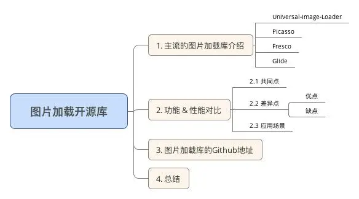
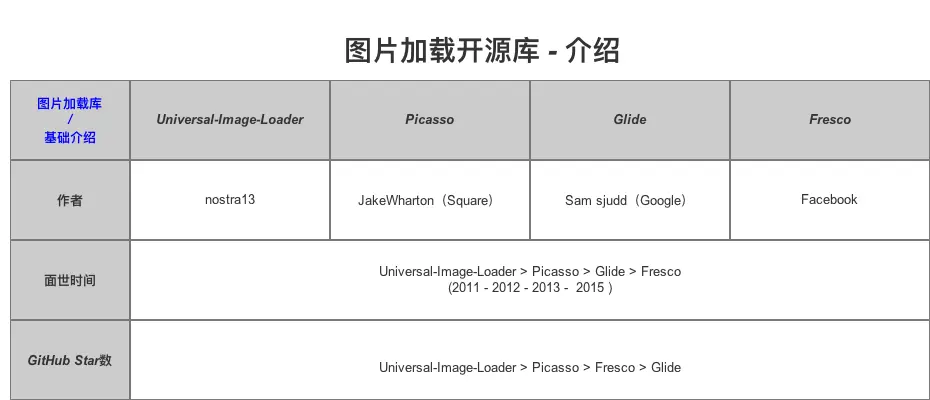
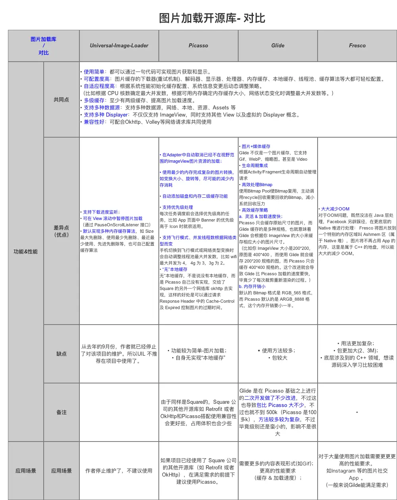

# 前言

- 图片加载在 `Android`开发项目中十分常见
- 为了降低开发周期 & 难度，我们经常会选用一些图片加载的开源库，而现在图片加载开源库越来越多，我们应该选用哪种呢？

# 1. 主流的图片加载库-介绍

从Github上的Star数排序来看，现在主流的Android图片加载库有

- Universal-Image-Loader
- Picasso
- Fresco
- Glide

下面是简单的介绍

图片加载库-介绍

------

# 2. 图片加载库- 对比

一图让你了解全部的图片加载库和他们之间的区别！

# Glide

## 特点

#### 4.1 优点

- 多样化媒体加载
  Glide 不仅是一个图片缓存，它支持 Gif、WebP、缩略图。甚至是 Video
- 生命周期集成
  通过设置绑定生命周期，我们可以更加高效的使用Glide提供的方式进行绑定，这样可以更好的让加载图片的请求的生命周期动态管理起来
- 高效的缓存策略
  A. 支持Memory和Disk图片缓存
  B. Picasso 只会缓存原始尺寸的图片，而 Glide 缓存的是多种规格，也就意味着 Glide 会根据你 ImageView 的大小来缓存相应大小的图片尺寸

> 比如你 ImageView 大小是200*200，原图是 400*400 ，而使用 Glide 就会缓存 200*200 规格的图，而 Picasso 只会缓存 400*400 规格的。这个改进就会导致 Glide 比 Picasso 加载的速度要快，毕竟少了每次裁剪重新渲染的过程，非常灵活 & 加载速度快

C. 内存开销小
 默认的 Bitmap 格式是 RGB_565 格式，而 Picasso 默认的是 ARGB_8888 格式，这个内存开销要小一半。

> Android关于图片内存计算，共有四种，分别是：
>
> 1. ALPHA_8：每个像素占用1byte内存
> 2. ARGB_4444:每个像素占用2byte内存
> 3. ARGB_8888:每个像素占用4byte内存（默认，色彩最细腻=显示质量最高=占用的内存也最大）
> 4. RGB_565:每个像素占用2byte内存（8bit = 1byte）
>    举例说明：一个32位的PNG=ARGB_8888=1204x1024,那么占用空间是:1024x1024x(32/8) = 4,194,304kb=4M左右
>    在解析图片的时候，为了避免oom和节省内存，最好使用ARGB_4444模式（节省一半的内存空间）

#### 4.2 缺点

- 使用方法复杂
  由于Glide其功能强大，所以使用的方法非常多，其源码也相对的复杂
- 包较大

## 相比其他图片加载库（Picasso & Fresco）

- 对比Picasso
  Glide 是在Picasso 基础之上进行的二次开发做了不少改进，不过这也导致包比 Picasso 大不少，不过也就不到 500k（Picasso 是100多k），用法较为复杂，不过毕竟级别还是蛮小的，影响不是很大
- 对比Fresco
  使用较Fresco简单，但性能（加载速度 & 缓存）却比不上Fresco

# 3. 各个主流图片加载库的Github地址

- [UniversalImageLoader](https://links.jianshu.com/go?to=https%3A%2F%2Fgithub.com%2Fnostra13%2FAndroid-Universal-Image-Loader)
- [Picasso](https://links.jianshu.com/go?to=https%3A%2F%2Fgithub.com%2Fsquare%2Fpicasso)
- [Glide](https://links.jianshu.com/go?to=https%3A%2F%2Fgithub.com%2Fbumptech%2Fglide)
- [Fresco](https://links.jianshu.com/go?to=https%3A%2F%2Fgithub.com%2Ffacebook%2Ffresco)

# 4. 总结

# 参考

[Carson带你学Android：主流开源图片加载库对比(UIL、Picasso、Glide、Fresco)](https://www.jianshu.com/p/97994c9693f9)