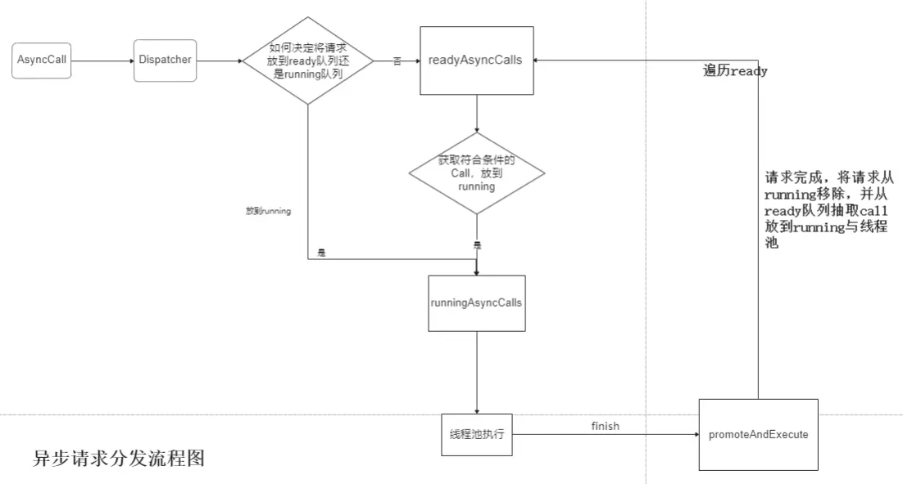

[okhttp项目地址](https://links.jianshu.com/go?to=https%3A%2F%2Fgithub.com%2Fsquare%2Fokhttp)

基于：3.14.9

# 同步请求

```cpp
 //  构建okHttpClient，相当于请求的客户端，Builder设计模式
 OkHttpClient okHttpClient = new OkHttpClient.Builder().readTimeout(5, TimeUnit.SECONDS).build();
        // 构建一个请求体，同样也是Builder设计模式
        Request request = new Request.Builder().url("http://www.baidu.com").build();
        //  生成一个Call对象，该对象是接口类型
        Call call = okHttpClient.newCall(request);
        try {
            //  拿到Response
            Response response = call.execute();
            Log.i("TAG",response.body().string());
        } catch (IOException e) {
            
        }
```

同步请求步骤：

1. 通过Builder模式创建OkHttpClient对象和Request对象
2. 调用OkHttpClient的newCall方法，获取一个Call对象，参数是Request
3. 调用execute方法获取一个Respone

### （一） OkHttpClient源码分析

```java
public static final class Builder {
    Dispatcher dispatcher;
    ...
    ...
    public Builder() {
      dispatcher = new Dispatcher();
      protocols = DEFAULT_PROTOCOLS;
      connectionSpecs = DEFAULT_CONNECTION_SPECS;
      eventListenerFactory = EventListener.factory(EventListener.NONE);
      proxySelector = ProxySelector.getDefault();
      if (proxySelector == null) {
        proxySelector = new NullProxySelector();
      }
      cookieJar = CookieJar.NO_COOKIES;
      socketFactory = SocketFactory.getDefault();
      hostnameVerifier = OkHostnameVerifier.INSTANCE;
      certificatePinner = CertificatePinner.DEFAULT;
      proxyAuthenticator = Authenticator.NONE;
      authenticator = Authenticator.NONE;
      connectionPool = new ConnectionPool();
      dns = Dns.SYSTEM;
      followSslRedirects = true;
      followRedirects = true;
      retryOnConnectionFailure = true;
      callTimeout = 0;
      connectTimeout = 10_000;
      readTimeout = 10_000;
      writeTimeout = 10_000;
      pingInterval = 0;
    }
   
}

 public ConnectionPool(int maxIdleConnections, long keepAliveDuration, TimeUnit timeUnit) {
    this.maxIdleConnections = maxIdleConnections;
    this.keepAliveDurationNs = timeUnit.toNanos(keepAliveDuration);

    // Put a floor on the keep alive duration, otherwise cleanup will spin loop.
    if (keepAliveDuration <= 0) {
      throw new IllegalArgumentException("keepAliveDuration <= 0: " + keepAliveDuration);
    }
  }
```

Builder是OkHttpClient一个静态内部类，在Builder的构造函数中进行了一系列的初始化操作，其中**Dispatcher是分发器的意思，和拦截器不同的是分发器不做事件处理，只做事件流向，负责将每一次Requst进行分发，压栈到自己的线程池，并通过调用者自己不同的方式进行异步和同步处理**。ConnectionPool是一个连接池对象，它可以用来管理连接对象，从它的构造方法中可以看到连接池的默认空闲连接数为5个，keepAlive时间为5分钟。

### （二） Request源码分析

```java
Request(Builder builder) {
    this.url = builder.url;
    this.method = builder.method;
    this.headers = builder.headers.build();
    this.body = builder.body;
    this.tags = Util.immutableMap(builder.tags);
}

public static class Builder {
    @Nullable HttpUrl url;
    String method;
    Headers.Builder headers;
    @Nullable RequestBody body;

    public Builder() {
      this.method = "GET";
      this.headers = new Headers.Builder();
    }
  
    public Request build() {
      if (url == null) throw new IllegalStateException("url == null");
      return new Request(this);
    }
}
```

Request.Builder()构造函数中设置了默认的请求方法是GET方法，Request类的build()方法是用来创建一个Request对象，将当前的Builder对象传进去，并完成了对象的赋值。将Builder类的相关属性赋值给Request的相关属性，这也是Builder模式的精髓。

### （三） Call对象的创建：newCall()执行分析

```kotlin
@Override public Call newCall(Request request) {
    return RealCall.newRealCall(this, request, false);
  }
```

调用了RealCall的newRealCall方法，Call是一个接口，RealCall是它的实现类

```java
static RealCall newRealCall(OkHttpClient client, Request originalRequest, boolean forWebSocket) {
    // Safely publish the Call instance to the EventListener.
    RealCall call = new RealCall(client, originalRequest, forWebSocket);
    call.eventListener = client.eventListenerFactory().create(call);
    return call;
  }
```

在newRealCall方法里，完成了RealCall对象的创建，并把它返回出去。至此，Call对象已经创建完毕，**实际上创建的对象是Call的实现类RealCall 对象。**

### （四） Response对象的创建： call.execute()执行分析

Call call = okHttpClient.newCall(request) 拿到的是 RealCall 对象，所以直接看 RealCall 类的 execute()

```kotlin
@Override public Response execute() throws IOException {
    synchronized (this) {
      if (executed) throw new IllegalStateException("Already Executed");
      executed = true;
    }
    captureCallStackTrace();
    timeout.enter();
    eventListener.callStart(this);
    try {
      // 分析1
      client.dispatcher().executed(this);
      // 分析2
      Response result = getResponseWithInterceptorChain();
      if (result == null) throw new IOException("Canceled");
      return result;
    } catch (IOException e) {
      e = timeoutExit(e);
      eventListener.callFailed(this, e);
      throw e;
    } finally {
      // 分析3
      client.dispatcher().finished(this);
    }
  }
```

在同步代码块中，首先判断excuted是不是true，它的含义是否有在执行，如果是，抛出异常，如果没有执行过，将excuted置为true。eventListener.callStart(this)开启事件监听，eventListener在RealCall对象创建的时候，也一起创建了。

execute()的核心方法: 

- client.dispatcher().executed(this)
- Response result = getResponseWithInterceptorChain()
- client.dispatcher().finished(this)

分析1：dispatcher().executed(this)

```csharp
public Dispatcher dispatcher() {
    return dispatcher;
  }

  synchronized void executed(RealCall call) {
    runningSyncCalls.add(call);
  }
```

首先调用了Dispatcher的dispatcher() 获取 Dispatcher 对象，紧接着调用Dispatcher的executed方法，往runningSyncCalls对象中添加了一个 call 对象，runningSyncCalls是一个存放同步请求的队列，Dispatcher类中维护了3种类型的请求队列：

```php
  /** Ready async calls in the order they'll be run. */
  private final Deque<AsyncCall> readyAsyncCalls = new ArrayDeque<>();

  /** Running asynchronous calls. Includes canceled calls that haven't finished yet. */
  private final Deque<AsyncCall> runningAsyncCalls = new ArrayDeque<>();

  /** Running synchronous calls. Includes canceled calls that haven't finished yet. */
  private final Deque<RealCall> runningSyncCalls = new ArrayDeque<>();
```

- **readyAsyncCalls** 是异步请求的就绪队列
- **runningAsyncCalls** 是异步请求的执行队列
- **runningSyncCalls** 是同步请求的执行队列

分析2：getResponseWithInterceptorChain()

调用完Dispatcher的execute()方法后，紧接着调用了getResponseWithInterceptorChain()方法。

```csharp
Response getResponseWithInterceptorChain() throws IOException {
    // Build a full stack of interceptors.
    List<Interceptor> interceptors = new ArrayList<>();
    interceptors.addAll(client.interceptors());
    interceptors.add(retryAndFollowUpInterceptor);
    interceptors.add(new BridgeInterceptor(client.cookieJar()));
    interceptors.add(new CacheInterceptor(client.internalCache()));
    interceptors.add(new ConnectInterceptor(client));
    if (!forWebSocket) {
      interceptors.addAll(client.networkInterceptors());
    }
    interceptors.add(new CallServerInterceptor(forWebSocket));

    Interceptor.Chain chain = new RealInterceptorChain(interceptors, null, null, null, 0,
        originalRequest, this, eventListener, client.connectTimeoutMillis(),
        client.readTimeoutMillis(), client.writeTimeoutMillis());

    return chain.proceed(originalRequest);
  }
```

该方法返回一个Response对象。在方法中创建了 interceptors 集合，添加了数个拦截器对象，**此处使用了责任链设计模式**，创建了 Interceptor.Chain 拦截器链，并执行proceed处理请求，后续可依次在拦截器中做相应的操作。

分析3：dispatcher().finished(this)

在Response的excute方法的finally模块中，调用了 client.dispatcher().finished(this)：

```cpp
void finished(RealCall call) {
    finished(runningSyncCalls, call);
  }
```

finished方法内部调用了它的重载方法，并把**同步请求的消息队列对象和RealCall对象**传过去：

```java
private <T> void finished(Deque<T> calls, T call) {
    Runnable idleCallback;
    synchronized (this) {
      if (!calls.remove(call)) throw new AssertionError("Call wasn't in-flight!");
      idleCallback = this.idleCallback;
    }

    boolean isRunning = promoteAndExecute();

    if (!isRunning && idleCallback != null) {
      idleCallback.run();
    }
  }
```

在同步代码快中，将call对象从同步请求消息队列中移除。紧接着调用了promoteAndExecute方法：

```csharp
 private boolean promoteAndExecute() {
    assert (!Thread.holdsLock(this));

    List<AsyncCall> executableCalls = new ArrayList<>();
    boolean isRunning;
    synchronized (this) {
      for (Iterator<AsyncCall> i = readyAsyncCalls.iterator(); i.hasNext(); ) {
        AsyncCall asyncCall = i.next();

        if (runningAsyncCalls.size() >= maxRequests) break; // Max capacity.
        if (asyncCall.callsPerHost().get() >= maxRequestsPerHost) continue; // Host max capacity.

        i.remove();
        asyncCall.callsPerHost().incrementAndGet();
        executableCalls.add(asyncCall);
        runningAsyncCalls.add(asyncCall);
      }
      isRunning = runningCallsCount() > 0;
    }

    for (int i = 0, size = executableCalls.size(); i < size; i++) {
      AsyncCall asyncCall = executableCalls.get(i);
      asyncCall.executeOn(executorService());
    }

    return isRunning;
  }
```

同步代码块有一个for循环，去迭代readyAsyncCalls，也就是待准备消息队列。但是从前面一步步分析过来，并没有往readyAsyncCalls添加过数据，所以当前的for循环并不会执行，之后的一个for循环也不会执行，isRunning返回false。

promoteAndExecute()方法返回false。

```java
private <T> void finished(Deque<T> calls, T call) {
    Runnable idleCallback;
    synchronized (this) {
      if (!calls.remove(call)) throw new AssertionError("Call wasn't in-flight!");
      idleCallback = this.idleCallback;
    }

    boolean isRunning = promoteAndExecute();

    if (!isRunning && idleCallback != null) {
      idleCallback.run();
    }
  }
```

并且idleCallback 已经完成了初始化，所以会执行 idleCallback的run()方法

## 总结

在同步请求中Dispatcher主要负责了两件事，同步请求的保存和移除。

# 异步请求

```java
        val okHttpClient = OkHttpClient.Builder().build()
        val request: Request = Request.Builder().url("http://wwww.baidu.com").build()
        val call: Call = okHttpClient.newCall(request)
        call.enqueue(object : Callback {
            override fun onFailure(call: Call, e: IOException) {
                Log.d(TAG, "onFailure: ")
            }
            
            @Throws(IOException::class)
            override fun onResponse(call: Call, response: Response) {
                //response.body().string() 获得服务器返回的数据
                Log.d(TAG, "onResponse: " + response.body()?.string())
            }
        })
```

异步请求的几个步骤：

1. ##### 通过Builder模式创建OkHttpClient对象和Request对象

2. ##### 调用OkHttpClient的newCall方法，获取一个Call对象，参数是Request

3. ##### 调用call对象的enqueue()方法


步骤1和步骤2跟同步请求的步骤一致，都是在做准备工作，并没有发起请求，下面主要看一下步骤3

## call.enqueue() 源码分析

RealCall#enqueue方法：

```java
@Override public void enqueue(Callback responseCallback) {
    synchronized (this) {
      if (executed) throw new IllegalStateException("Already Executed");
      executed = true;
    }
    captureCallStackTrace();
    eventListener.callStart(this);
    // 分析1：AsyncCall是什么
    // 分析2：dispatcher().enqueue()
    client.dispatcher().enqueue(new AsyncCall(responseCallback));
  }
```

### 分析1：AsyncCall是什么

client.dispatcher()返回一个Dispatcher对象，Dispatcher的enqueue方法，参数是AsyncCall对象，AsyncCall是什么？

```java
final class AsyncCall extends NamedRunnable {
    private final Callback responseCallback;
    private volatile AtomicInteger callsPerHost = new AtomicInteger(0);

    AsyncCall(Callback responseCallback) {
      super("OkHttp %s", redactedUrl());
      this.responseCallback = responseCallback;
    }

    AtomicInteger callsPerHost() {
      return callsPerHost;
    }
}
```

只截取了部分代码，该类继承自NamedRunnable：

```java
public abstract class NamedRunnable implements Runnable {
  protected final String name;

  public NamedRunnable(String format, Object... args) {
    this.name = Util.format(format, args);
  }

  @Override public final void run() {
    String oldName = Thread.currentThread().getName();
    Thread.currentThread().setName(name);
    try {
      execute();
    } finally {
      Thread.currentThread().setName(oldName);
    }
  }

  protected abstract void execute();
}
```

NamedRunnable 实现了Runnable 接口。execute()是一个抽象方法，AsyncCall 类提供实现：

AsyncCall#execute()

```kotlin
@Override protected void execute() {
      boolean signalledCallback = false;
      timeout.enter();
      try {
        Response response = getResponseWithInterceptorChain();
        if (retryAndFollowUpInterceptor.isCanceled()) {
          signalledCallback = true;
          responseCallback.onFailure(RealCall.this, new IOException("Canceled"));
        } else {
          signalledCallback = true;
          responseCallback.onResponse(RealCall.this, response);
        }
      } catch (IOException e) {
        e = timeoutExit(e);
        if (signalledCallback) {
          // Do not signal the callback twice!
          Platform.get().log(INFO, "Callback failure for " + toLoggableString(), e);
        } else {
          eventListener.callFailed(RealCall.this, e);
          responseCallback.onFailure(RealCall.this, e);
        }
      } finally {
        client.dispatcher().finished(this);
      }
}
```

**这段代码是真正执行异步请求的逻辑**：

getResponseWithInterceptorChain()返回Response对象；

然后判断retryAndFollowUpInterceptor是否取消回调，决定调用CallBack接口的onFailure()或onResponse()方法；

最后finally中，和同步请求的处理一样，调用了Dispatcher对象的finished()方法。

```java
void finished(RealCall call) {
    finished(runningSyncCalls, call);
  }

  private <T> void finished(Deque<T> calls, T call) {
    Runnable idleCallback;
    synchronized (this) {
      if (!calls.remove(call)) throw new AssertionError("Call wasn't in-flight!");
      idleCallback = this.idleCallback;
    }

    boolean isRunning = promoteAndExecute();

    if (!isRunning && idleCallback != null) {
      idleCallback.run();
    }
  }
```

### 分析2：dispatcher().enqueue()做了什么

```csharp
void enqueue(AsyncCall call) {
   synchronized (this) {
     readyAsyncCalls.add(call);

     // Mutate the AsyncCall so that it shares the AtomicInteger of an existing running call to
     // the same host.
     if (!call.get().forWebSocket) {
       AsyncCall existingCall = findExistingCallWithHost(call.host());
       if (existingCall != null) call.reuseCallsPerHostFrom(existingCall);
     }
   }
   promoteAndExecute();
 }
```

在同步代码块中，将当前的call请求添加到**readyAsyncCalls（准备消息队列）**中去，**注意这里跟同步请求的区别，同步请求的时候，并没有把当前的call添加到准备消息队列中去。**然后又调用了 promoteAndExecute()方法，同步请求的时候也调用了promoteAndExecute()方法

```csharp
private boolean promoteAndExecute() {
    assert (!Thread.holdsLock(this));

    List<AsyncCall> executableCalls = new ArrayList<>();
    boolean isRunning;
    synchronized (this) {
      // 分析2.1 遍历 readyAsyncCalls
      for (Iterator<AsyncCall> i = readyAsyncCalls.iterator(); i.hasNext(); ) {
        AsyncCall asyncCall = i.next();
        // 如果正在运行的异步请求队列长度 >= 请求最大值，退出循环。maxRequests的值为64
        if (runningAsyncCalls.size() >= maxRequests) break; // Max capacity.
		// 如果当前执行的异步请求队列中，相同host的请求数 >= maxRequestsPerHost（每个主机最大请求数，默认为5），跳过，遍历下一个
        if (asyncCall.callsPerHost().get() >= maxRequestsPerHost) continue; // Host max capacity.

        i.remove();
        asyncCall.callsPerHost().incrementAndGet();
        executableCalls.add(asyncCall);
        runningAsyncCalls.add(asyncCall);
      }
      isRunning = runningCallsCount() > 0;
    }

    // 分析2.2 遍历 executableCalls
    for (int i = 0, size = executableCalls.size(); i < size; i++) {
      AsyncCall asyncCall = executableCalls.get(i);
      asyncCall.executeOn(executorService());
    }

    return isRunning;
  }
```

此时，readyAsyncCalls不为空了，我们单独的把这个for循环拎出来讲：

**分析2.1 遍历 readyAsyncCalls**

目的是把符合条件的call请求从readyAsyncCalls提升为runningAsyncCalls。

并把符合条件的 AsyncCall 从 readyAsyncCalls 取出来，存到临时的 executableCalls 队列中去

**分析2.2 遍历 executableCalls**

从 executableCalls 中获取 AsyncCall 对象，并且调用其 executeOn() 方法，参数是executorService()：

```java
 public synchronized ExecutorService executorService() {
    if (executorService == null) {
      executorService = new ThreadPoolExecutor(0, Integer.MAX_VALUE, 60, TimeUnit.SECONDS,
          new SynchronousQueue<>(), Util.threadFactory("OkHttp Dispatcher", false));
    }
    return executorService;
  }
```

该方法是一个同步方法，返回了一个线程池对象，ThreadPoolExecutor()的第二个参数传入了Integer的最大值，即线程池所能容纳的最大线程数为Integer.MAX_VALUE，虽然这里设置了很大的值，但是实际情况下并非会达到最大值，因为上面enqueue()方法中做了判断。

**asyncCall.executeOn(executorService())**

```kotlin
    void executeOn(ExecutorService executorService) {
      assert (!Thread.holdsLock(client.dispatcher()));
      boolean success = false;
      try {
        // 分析2.3 执行 asyncCall Runnable
        executorService.execute(this);
        success = true;
      } catch (RejectedExecutionException e) {
        InterruptedIOException ioException = new InterruptedIOException("executor rejected");
        ioException.initCause(e);
        transmitter.noMoreExchanges(ioException);
        responseCallback.onFailure(RealCall.this, ioException);
      } finally {
        if (!success) {
          // 成功请求后，这里不会执行，因为在 asyncCall#execute() 中会调用回调。
          client.dispatcher().finished(this); // This call is no longer running!
        }
      }
    }
```

**分析2.3 执行 asyncCall Runnable**

分析1中已经知道，asyncCall 是一个 Runnable 对象，在这里通过线程池执行，最终会调用到 asyncCall#execute()。

## 总结

异步请求中，会先去遍历**readyAsyncCalls**队列，判断readyAsyncCalls的队列大小是否小于设置的最大数，如果条件满足，把该请求添加到runningAsyncCalls队列中去，同时把该请求添加到临时的 executableCalls 队列去中。之后，遍历 executableCalls，去执行 AsyncCall的execute()方法。




# 参考

[盘它，okhttp3吊炸天源码分析(一)：同步、异步请求源码解析](https://www.jianshu.com/p/5bb1709f3729)