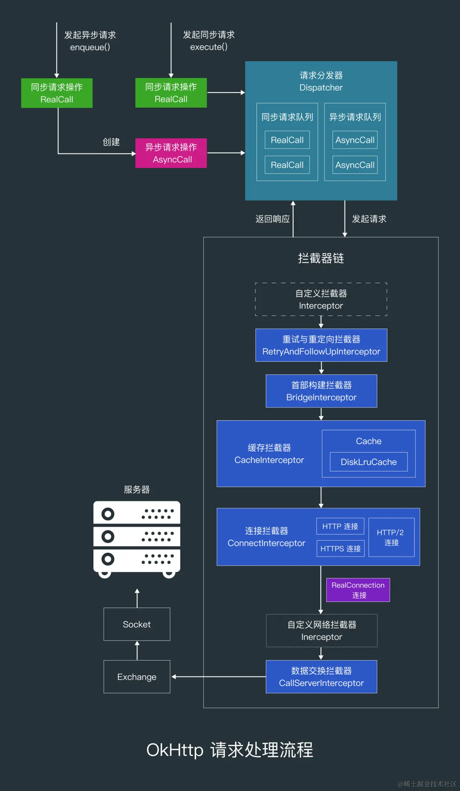
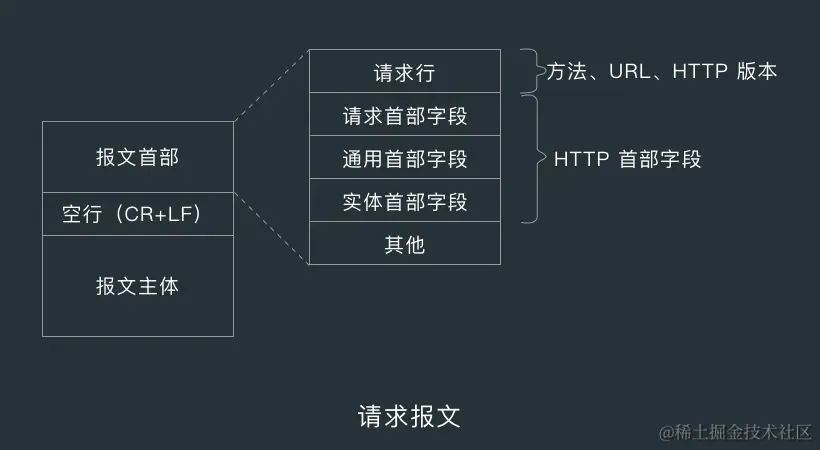
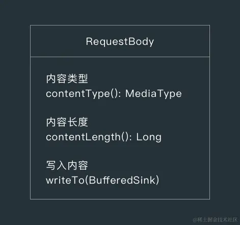
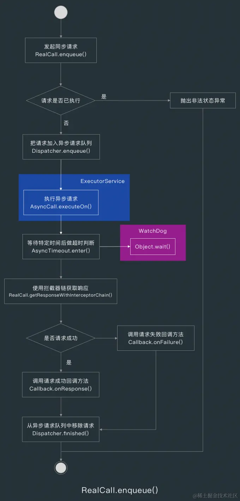
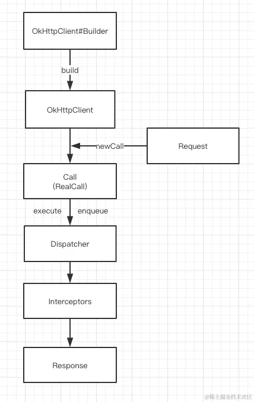
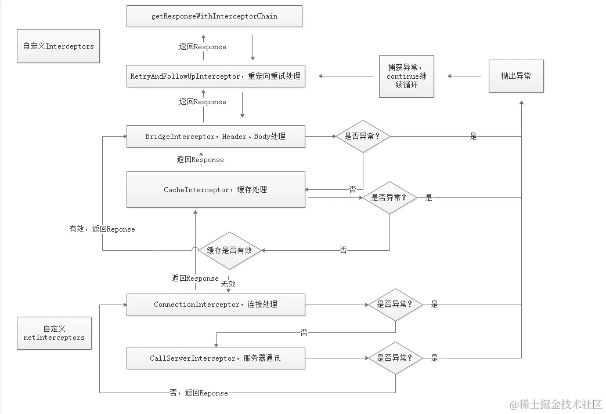
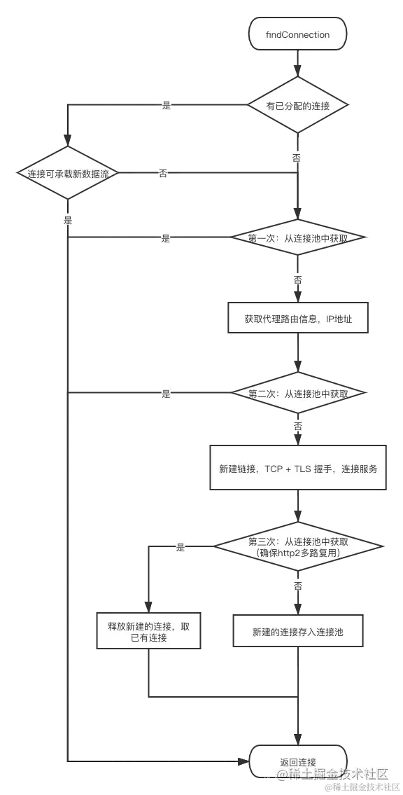
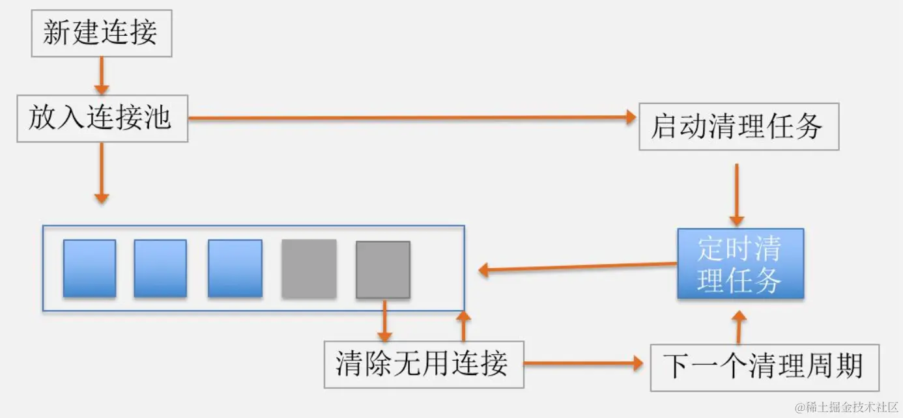

# 1. OkHttp 原理概述



OkHttp 支持发起同步请求和异步请求，同步请求对应类的是 `RealCall` ，异步请求对应的是 `AsyncCall` ，AsynCall 是 RealCall 的`内部类`。RealCall 和 AsyncCall 可以理解为`同步请求操作`和`异步请求操作`。

当用 RealCall 的 `execute()` 方法`发起同步请求`时，请求会被请求分发器 `Dispatcher` 放到`同步请求操作队列`中，然后用 Dispatcher 的 `executed()` 方法执行请求。

当用 RealCall 的 `enqueue()` 方法`发起异步请求`时，RealCall 会创建一个 `AsyncCall` 并传到 Dispatcher 的 enqueue() 方法中。Dispatcher 会把异步请求放到`异步请求操作队列`，然后把异步请求提交到`线程池`中执行，当异步请求被执行时，RealCall 会通过`拦截器链` 发起请求，拦截器链中各个拦截器处理请求的顺序为：`自定义拦截器`—`重试与重定向拦截器`—`首部填充拦截器`—`缓存拦截器`—`连接拦截器 `——`自定义网络拦截器`—`数据交换拦截器`。

`Dispatcher` 主要是做一些请求数量判断，`比如同一host的最大请求数量默认为 5`， `同时进行的异步请求数量最大为 64` ，超过这两个值时异步请求就不会立刻提交到线程池中。

OkHttp 允许我们`自定义拦截器`和`自定义网络拦截器`，自定义拦截器是`最先执行的拦截器`，而网络拦截器是`连接建立后`才会处理请求的拦截器，而且网络拦截器不会处理 WebSocket 连接。

拦截器链 `RealInterceptorChain` 中有一个 `proceed()` 方法，各个拦截器在处理完自己的逻辑后，就要调用 proceed() 方法让下一个拦截器处理请求。

在`重试与重定向拦截器` 中，proceed() 方法是放在一个 `while` 循环中执行的，而且还用 `try-catch` 代码块包住了，这样其他拦截器抛出异常时，重试与重定向拦截器才能处理这些`路线异常`和 `IO 异常`。RetryAndFollowUpInterceptor 中的`重定向逻辑`主要是在重试与重定向拦截器的 `followUpRequest()` 方法中，在这个方法中会根据不同的响应状态码构建重定向请求，比如状态码为 `407` 时，就会返回一个包含`认证挑战`的请求。

重试与重定向拦截器的下一个拦截器是 `BridgeInterceptor` ，这个拦截器负责给`填写一些请求首部`，比如把请求地址的 `host` 组件拿出来，放到 host 首部中。当 BridgeInterceptor 把默认需要填写信息的首部的信息填写完后，就会把请求交给缓存拦截器 `CacheInterceptor` 处理。

OkHttp 默认是不进行缓存的，如果想要`缓存请求和响应`的话，就要用`缓存目录`和`缓存大小`创建一个 `Cache` ，Cache 中使用了一个 `DiskLruCachec` ，也就是 Cache 使用了`最近最少使用缓存算法`来缓存请求和响应数据，创建好 Cache 后设置给 OkHttpClient 就可以缓存响应数据了。设置了 Cache 后，默认情况下缓存拦截器只会缓存 `GET` 和 `HEAD` 等获取资源的方法的请求，如果想对 `POST` 或 `PUT` 等修改资源的方法做缓存，就要自定义缓存拦截器。

OkHttp 的连接机制是从`连接拦截器` ConnectInterceptor 的 intercept() 方法开始的，连接机制可以分为 `HTTP 连接机制`，`HTTPS 连接机制`和 `HTTP/2 连接机制`。

`ConnectInterceptor` 的 intercept() 方法主要是调用 `RealCall` 的 `initExchange()` 方法`复用或建立新的连接`。在 initExchange() 方法中，会调用 `ExchangeFinder` 的 `find()` 方法`查找可重用的连接或创建新连接`，find() 方法会通过 findHealthyConnection() 方法间接调用到连接查找方法 `findConnection()` 。

在 `findConnection()` 方法中，首先会`尝试复用 RealCall 已有的连接`，当 RealCall 没有连接，也就是 RealCall 的 connection 字段为空的话，就会`尝试从连接池中获取连接`，连接池中也没有连接的话，就会`创建一个新的连接 RealConnection`，并调用 RealConnection 的 `connect()` 方法建立连接。在 findConnection() 方法返回 RealConnection 后，find() 方法就会调用 RealConnection 的 `newCodec()` 方法获取并返回一个数据编译码器 `ExchangeCodec` 。RealCall 的 initExchange() 方法获取到 ExchangeCodec 后，会用它来创建一个数据交换器 `Exchange` 。

RealConnection 的 `connect()` 方法的核心逻辑是放在 `while` 循环中执行的，如果需要用到隧道（tunnel）的话，就调用 `connectTunnel()` 方法透传客户端和服务器的数据。否则调用 `connectSocket()` 方法与服务端 Socket 建立连接，再调用 `establishProtocol()` 方法建立协议，这个方法中涉及了 `HTTPS 连接`和 `HTTPS/2 连接`的逻辑。

在 RealConnection 的 `connectSocket()` 方法中，首先会用 `SocketFactory` 创建一个 `Socket`，然后会调用 `Platform`的 `connectSocket()` 方法建立与服务端 Socket 的连接，然后把服务端 Socket 的输入流和输出流初始化自己的 `source` 和 `sink` 字段，到这里连接就建立完成了，连接建立完成后，RealCall 的 initExchange() 方法就会把 RealConnection 返回给 ConnectInterceptor，然后 ConnectInterceptor 就会把请求交给下一个拦截器 CallServerInterceptor 处理。

在 RealConnection 的 `establishProtocol()` 方法中，首先会判断当前请求是否有对应的 `SSLSocketFactory` ，也就是当前请求是否为 HTTPS 请求，如果不是的话，就会遍历请求地址 address 的协议列表 `protocols` ，如果协议列表中有 `H2_PRIOR_KNOWLEDGE` 协议的话，则调用 `startHttp2()` 方法发送一个 `Upgrade` 报文，看下服务器支不支持 HTTP/2。establishProtocol() 方法做的第二件事就是调用 `connecTls()` 开始 `SSL/TLS 握手`。 establishProtocol() 做的第三件事就是看下 RealConnection 的 protocol 是不是 HTTP/2 协议，是的话就调用 `startHttp2()` 建立 HTTP/2 连接。

在 `startHttp2()` 方法中做了两件事，一是创建一个 `Http2Connection`，二是调用 Http2Connection 的 `start()` 方法发送前奏消息、SETTINGS 帧以及 WINDOW_UPGRADE 帧。在 Http2Connection 的 start() 方法中，首先会用 `Http2Writer` 的 `connectionPreface()` 和 `settings()` 方法写入`前奏消息`和 `SETTING 帧`，然后调用 Http2Writer 的 `windowUpdate()` 方法发送`窗口更新（WINDOW_UPDATE）帧`，最后把流读取任务 `ReaderRunnable` 提交到队列中执行。

而在 `connectTls()` 方法中，首先会调用 `SSLSocketFactory` 的 `createSocket()` 方法创建一个 `SSLSocket` ，然后用 `ConnectionSpecSelector` 的 `configureSecureSocket()` 方法获取 SSLSocket 的连接规格 `ConnectionSpec` ，如果 ConnectionSpec 支持 TLS 扩展，就调用 Platform 的 `configureTlsExtensions()` 方法配置 TLS 扩展，然后再调用 SSLSocket 的 `startHandshake()` 方法开始 TLS 握手，然后再用 `HostNameVerifier` 验证 host 是否合法，然后再用 `CertificatePinner` 检查 host 的证书是否合法，然后把连接成功的 SSLSocket 中的输入流和输出流用来初始化 `source` 和 `sink`，最后调用 Platform 的 `afterHandshake()` 方法结束握手。

当 `数据交换拦截器` CallServerInterceptor 接收到请求时，就会用 `数据交换器 Exchange` 写入请求头和请求体，而 `Exchange` 会通过 `Socket` 提供的的`输出流`写入请求信息，通过`输入流`读取响应信息，当 CallServerInterceptor 读取完了响应信息后，就会往上传递，直到把响应信息返回给最开始发起请求的地方。

# 2. OkHttp 基本用法

```kotlin
    fun asyncGet() {
        val url = "http://wwww.baidu.com"
        val okHttpClient = OkHttpClient()
        val request: Request = Request.Builder().url(url).get() //默认就是GET请求，可以省略
                .build()
        val call: Call = okHttpClient.newCall(request)
        call.enqueue(object : Callback {
            override fun onFailure(call: Call, e: IOException) {
                Log.d(TAG, "onFailure: ")
            }
            
            @Throws(IOException::class)
            override fun onResponse(call: Call, response: Response) {
                //response.body().string() 获得服务器返回的数据
                Log.d(TAG, "onResponse: " + response.body()?.string())
            }
        })
    }
```

# 3. 请求信息 Request

Request 包含了请求相关信息，比如请求方法和请求地址和请求头等信息，下面来看一下 Request 中这些字段的作用。

## 3.1统一资源定位器 HttpUrl

Request 会把传入 url() 函数中的请求地址转化为 HttpUrl 对象，HttpUrl 包含了`协议 scheme`、`登录信息（用户名/密码）`、`主机地址`、`端口号`、`查询路径`、`查询参数`以及`片段标识符 fragment`。

- ##### 协议

  使用 http: 或 https 等协议方案名获取访问资源时，要指定协议类型，不区分字母大小写，最后加一个冒号（ : ）。

- ##### 登录信息（认证）

  指定用户名和密码作为从服务端获取资源时必要的登录信息（身份认证），这是可选项。

- ##### 主机

  主机组件标识了因特网上能够访问资源的宿主机器，比如 `www.xxx.com` 或 `192.168.1.66` 。

- ##### 端口号

  端口组件标识了服务器正在监听的网络端口，对下层使用了 TCP 协议的 HTTP 来说，默认端口为 `80` 。

- ##### 查询路径

  服务器上资源的本地名，由斜杠（ / ）将其与前面的 URL 组件分隔开来，路径组件的语法与服务器的方案有关。

  路径组件说明了资源位于服务器的什么地方，类似于分级的文件系统路径，比如 `/goods/details` 。

- ##### 查询参数

  比如数据库服务是可以通过提供查询参数缩小请求资源范围的，传入页码和页大小查询列表 `http://www.xxx.com/?page=1&pageNum=20` 。

- ##### 片段标识符

  片段（fragment）表示一部分资源的名字，该字段不会发送给服务器，是在客户端内部使用的，通过井号（#）将其与 URL 其余部分分割开来。


## 3.2 首部字段 Headers

Header 用于存放 HTTP 首部，Headers 中只有一个 `namesAndValues` 字段，类型为 Array<String> ，比如 `addHeader(a, 1)` 对应的 namesAndValues 为 `[a, 1]`。

HTTP 协议的请求和响应报文中必定包含 HTTP 首部，首部内容为客户端和服务器分别处理请求和响应提供所需要的信息，HTTP 报文由方法、URI、HTTP 版本、HTTP 首部字段等部分构成。



## 3.3 请求体 RequestBody



RequestBody 是一个抽象类，有下面 3 个方法。

1. 内容类型 contentType()

   比如 `application/x-www-form-urlencoded` ；

2. 内容长度 contentLength()

3. 写入内容 writeTo()

   把请求的内容写入到 okio 提供的 Sink 中；

   RequestBody 中还有 4 个用于创建 RequestBody 的扩展方法 xxx.toRequestBody() ，比如 Map.toString().toRequestBody()。

## 3.4 标签

我们可以用 tag() 方法给请求加上标签，然后在拦截器中根据不同的标签栏做不同的操作。

```kotlin
val request = Request.Builder()
    .url(...)
    .tag("666")
    .build()
```

在 Retrofit 中用的则是 @Tag 注解，比如下面这样。

```kotlin
@POST("app/login")
suspend fun login(
  @Query("account") phone: String,
  @Query("password") password: String,
  @Tag tag: String
) : BaseResponse<User>
```

然后在自定义拦截器中，就能根据 tag 的类型来获取标签。

```kotlin
override fun intercept(chain: Interceptor.Chain): Response {
    val request = chain.request()
    val tag = request.tag(String::class.java)
    Log.e("intercept", "tag: ${tag}")
    return chain.proceed(request)
}
```

# 4. OkHttp 请求分发机制

## 4.1 请求操作 Call

在创建请求 Request 后，要用 `OkHttpClient` 的 `newCall()` 方法创建一个 RealCall 对象，然后调用 execute() 发起同步请求或调用 enqueue() 发起异步请求。

RealCall 实现了 Call 接口，也是这个接口唯一的实现类，按注释来说，RealCall 是一个 OkHttp 应用与网络层之间的桥梁，该类暴露了高级应用层的原语（primitives）：连接、请求、响应与流，可以把 RealCall 理解为`同步请求操作`，而 RealCall 的内部类 AsyncCall 则是`异步请求操作`。

下面是 RealCall 中比较中要的两个方法的实现：`execute()` 与 `enqueue()` 。

### 1. 发起同步请求 execute()

当调用 RealCall 的 `execute()` 方法发起同步请求时，如果该请求已执行，那么会抛出非法状态异常，所以`发起同步请求时要注意捕获异常`。

如果请求没有被执行的话，execute() 方法则会调用 AsyncTimeout 的 `enter()` 让 `AsyncTimeout` 在请求超时的时候关闭 Socket 或流，AsyncTimeout 中有一个继承了 Thread 的内部类 `WatchDog`，AsyncTimeout 会用 `Object.wait()/notify()` 阻塞和唤醒 `Watchdog` 线程。

```kotlin
  override fun execute(): Response {
    check(executed.compareAndSet(false, true)) { "Already Executed" }
	// 超时的话就关闭 Socket 或流
    timeout.enter()
    callStart()
    try {
      // 把 RealCall 添加到同步请求操作队列
      client.dispatcher.executed(this)
      // 执行请求
      return getResponseWithInterceptorChain()
    } finally {
      // 把当前请求 RealCall 从同步请求操作队列中删除
      client.dispatcher.finished(this)
    }
  }

Dispatcher
  @Synchronized internal fun executed(call: RealCall) {
    runningSyncCalls.add(call)
  }
```

AsyncTimeout 有 SocketAsyncTimeout 和 StreamTimeout 两个内部类，当请求超时时，AsyncTimeout 的 timeOut() 方法就会被调用，在 SocketAsyncTimeout 中，timeOut() 的方法的实现就是关闭 Socket ，而在 StreamTimeout 中的实现就是关闭流。

在 RealCall 的 execute() 方法调用完 enter() 方法后，会调用 Dispatcher 的 executed() 把请求加入同步请求队列，然后调用 `getResponseWithInterceptorChain()` 方法获取响应，获取到响应后，就会让 Dispatcher 把请求从同步请求操作队列中移除。

### 2. 发起异步请求 enqueue()

RealCall 的 execute() 方法会创建一个异步请求操作 `AsyncCall`，并把它交给 Dispatcher 处理。

AsyncCall 实现了 Runnable 接口，Dispatcher 接收到 AsyncCall 后，会把 AsyncCall 添加到待执行异步请求队列 `readyAsyncCalls` 中，然后调用自己的 `promoteAndExecute()` 方法。

把 AsyncCall 加入到异步请求队列后，Dispatcher 会看情况决定什么时候执行该异步请求，要执行的时候就会把请求任务提交到线程池 ExecutorService 中。

和同步请求一样，在 AsyncCall 的 `run()` 方法中做的第一件事情就是让 AsyncTimeout 进入超时判断逻辑，然后用拦截器链获取响应。



当请求的过程中没有遇到异常时，AsyncCall 的 run() 方法就会调用我们设定的 Callback 的 onResposne() 回调，如果遇到了异常，则会调用 onFailure() 方法。

不论异步请求是成功还是失败，RealCall 最后都会调用 Dispatcher 的 `finished()` 方法把请求从已运行异步请求队列 `runningAsyncCalls` 中移除。

```kotlin
  override fun enqueue(responseCallback: Callback) {
    check(executed.compareAndSet(false, true)) { "Already Executed" }

    callStart()
    // 把 AsyncCall 添加到异步请求操作队列
    client.dispatcher.enqueue(AsyncCall(responseCallback))
  }
```

Dispatcher 的 enqueue() 方法实现如下。

```kotlin
  internal fun enqueue(call: AsyncCall) {
    synchronized(this) {
      // 把 AsyncCall 添加到待执行异步请求操作队列中
      readyAsyncCalls.add(call)
	  
      // 不是 WebSocket 连接请求
      if (!call.call.forWebSocket) {
        // 找出与当前请求地址的host相同的 AsyncCall
        val existingCall = findExistingCallWithHost(call.host)
        // 沿用已有 AsyncCall 的 callsPerHost 字段
        if (existingCall != null) call.reuseCallsPerHostFrom(existingCall)
      }
    }
    // 找出并执行请求
    promoteAndExecute()
  }
```

### 4.2 请求分发器 Dispatcher

请求分发器 Dispatcher 维护了三个队列和一个线程池，三个队列分别是`待执行异步请求队列`、`运行中异步请求队列`以及`运行中同步请求队列`。

Dispatcher 的 `enqueue()` 方法首先会把 `AsyncCall` 加入到待执行请求队列，然后从待运行和已运行请求队列中找出与当前请求的主机地址相同的其他请求，找到的话就找到的请求的重用 AsyncCall 的 `callsPerHost` 字段，`callsPerHost 表示当前请求的主机地址的已执行请求数量`，每执行一个相同主机地址的请求时， callsPerHost 的值就会加 1 ，如果我们的应用中经常会发起多个请求，并且不会请求多个不同的主机地址的话，我们就可以修改 Dispatcher 中的 `maxRequestsPerHost` 的值，`maxRequetsPerHost 表示单个主机地址在某一个时刻的并发请求的最大值`，修改方式如下。

```kotlin
okHttpClient.dispatcher.maxRequestsPerHost = 10
```

maxRequestsPerHost 默认为 5 ，如果对应主机地址的请求数量没有超过最大值的话，Dispatcher 就会遍历待运行异步请求队列，在遍历时，Dispatcher 会判断已运行的异步请求数量是否超出了允许的并发请求的最大值 `maxRequests` ，这个值默认为 `64` ，也是可以被修改的，当异步请求数量不超过最大值，并且对应主机地址的请求数量不超过最大值时，就会把待运行请求`提交到线程池中执行`。

```kotlin
// 遍历执行请求
private fun promoteAndExecute(): Boolean {
    this.assertThreadDoesntHoldLock()

    // 可执行请求操作列表
    val executableCalls = mutableListOf<AsyncCall>()
    val isRunning: Boolean
    synchronized(this) {
      val i = readyAsyncCalls.iterator()
      while (i.hasNext()) {
        val asyncCall = i.next()

        // 超出最大请求数
        if (runningAsyncCalls.size >= this.maxRequests) break // Max capacity.
        // 超出单个host最大请求数
        if (asyncCall.callsPerHost.get() >= this.maxRequestsPerHost) continue // Host max capacity.

        // 把 AsyncCall 从待执行异步请求队列中移除
        i.remove()
        // callsPerHost 字段加 1
        asyncCall.callsPerHost.incrementAndGet()
        // 添加到可执行请求操作队列
        executableCalls.add(asyncCall)
        // 添加到已运行请求操作队列
        runningAsyncCalls.add(asyncCall)
      }
      isRunning = runningCallsCount() > 0
    }

    // 遍历执行可执行的 AsyncCall
    for (i in 0 until executableCalls.size) {
      // 把 AsyncCall 提交到线程池中执行
      val asyncCall = executableCalls[i]
      asyncCall.executeOn(executorService)
    }

    return isRunning
  }
```

当同步请求或异步请求执行时，RealCall 就会调用`getResponseWithInterceptorChain()` 方法发起请求，在 getResponseWithInterceptorChain() 方法中，首先会创建一个 `interceptors` 列表，然后添加拦截器到列表中，再用 interceptors 创建一个拦截器链 `RealInterceptorChain` ，然后调用拦截器链的 `proceed()` 方法。

```kotlin
RealCall.kt
// 使用拦截器链获取响应
@Throws(IOException::class)
  internal fun getResponseWithInterceptorChain(): Response {
    // 构建拦截器
    val interceptors = mutableListOf<Interceptor>()
    interceptors += client.interceptors
    interceptors += RetryAndFollowUpInterceptor(client)
    interceptors += BridgeInterceptor(client.cookieJar)
    interceptors += CacheInterceptor(client.cache)
    interceptors += ConnectInterceptor
    // 不处理 WebSocket
    if (!forWebSocket) {
      interceptors += client.networkInterceptors
    }
    interceptors += CallServerInterceptor(forWebSocket)

    val chain = RealInterceptorChain(
        ...
    )

    var calledNoMoreExchanges = false
    try {
      // 处理请求
      val response = chain.proceed(originalRequest)
      ...
      return response
    } catch (e: IOException) {
      calledNoMoreExchanges = true
      throw noMoreExchanges(e) as Throwable
    } finally {
      if (!calledNoMoreExchanges) {
        noMoreExchanges(null)
      }
    }
  }
```

# 5. OkHttp 重试与重定向机制

##### 1. 重试机制

重试与重定向拦截器负责在请求失败时`重试和重定向`，在 RetryAndFollowUpInterceptor 的 `intercept()` 方法中的代码是放在 while 中执行的，只有当重试的条件不成立时，请求才会被中断，而且这个拦截器没有设定重试次数的上限，最大重定向次数是写死的 20 次，如果有特殊需求的话，则要自定义一个重试拦截器和重定向拦截器。

在重试与重定向拦截器的 intercept() 方法中，当请求在后续的拦截器中处理时遇到路线异常（RouteException）或 IO 异常（IOException 时）才会调用 recover() 方法判断是否要重试，不重试则抛出异常。


当下面 4 个条件之一满足时，则不进行重试。

- OkHttpClient 的 retryOnConnectionFailure 的值为 false

- 不能再次发送请求体

  满足下面两个条件时表示不能再次发送请求体。

  - 请求执行过程中遇到 IO 异常（不包括 Http2Connection 抛出的 ConnectionShutdownException）
  - requestIsOneShot() 返回 true，这个方法默认为 false ，除非我们自己重写了这个方法）

- 致命异常

  - 协议异常 ProtocalException
  - Socket 超时异常 SocketTimeoutException
  - 证书验证异常 CertificateExeption
  - SSL 对端验证异常 SSLPeerUnverifiedException

- 没有更多路线可重试

  只有下面两种情况发生时，才有可能有更多路线可重试

  - 给 OkHttpClient 设置了代理
  - DNS 服务器返回多个 IP 地址

```kotlin
kotlin
复制代码private fun recover(): Boolean {
    // 应用层禁止重试
    if (!client.retryOnConnectionFailure) return false

    // 不能再次发送请求体
    if (requestSendStarted && requestIsOneShot(e, userRequest)) return false

    // 致命异常
    if (!isRecoverable(e, requestSendStarted)) return false

    // 没有更多路线可重试
    if (!call.retryAfterFailure()) return false

    // 使用新的连接和同一个路线选择器进行重试
    return true
  }
```

RealCall 的 `enterNetworkInterceptorExchange()` 方法用于初始化一个 ExchangeFinder，`ExchangeFinder 的作用是查找可重用的连接`，关于 ExchangeFinder 的实现后面会讲。

初始化 ExchangeFinder 后会把 Request 给其他拦截器处理，如果在这个过程中遇到了 IO 异常或路线异常，则会调用 rocover() 方法判断是否恢复请求，不恢复的话则抛出异常。

##### 2. 重定向机制


如果其他拦截器处理当前请求时没有抛出异常的话，那么 `RetryAndFollowUpInterceptor` 的 intercept() 方法就会判断上一个响应（priorResponse）是否为空，如果不为空的话，则用上一个响应的信息创建一个新的响应（Response），创建完新响应后，就会调用 `followUpRequest() 方法` 获取重定向请求。


`followUpRequest()` 方法会根据不同的响应状态码构建重定向请求，当状态码为 407 ，并且协议为 HTTP ，则返回一个包含认证挑战的请求，而获取这个请求用的是 `Authenticator` 。Authenticator 有一个 `authenticate()` 方法，默认的是一个空实现 NONE，如果我们想替换的话，可以在创建 OkHttpClient 的时候调用 authenticator() 方法替换默认的空实现。

除了 NONE 以外，Authenticator 中还提供了另一个实现 `JavaNetAutheitcator`，对应的静态变量为 `Authenticator.JAVA_NET_AUTHENTICATOR` 。

在 JavaNetAuthenticator 的 `authenticate()` 方法中，会获取响应中的 Challenge（质询）列表，Challenge 列表就是对 `WWW-Authenticate` 和 `Proxy-Authenticate` 响应头解析后生成的。

##### 3. 处理 3XX 重定向状态码


当响应的状态码为 300、301、302、303、307、308 时， `followUpRequest()` 方法就会调用 `buildRedirectRequest()` 构建重定向请求，3xx 重定向状态码要么告诉客户端使用替代位置访问客户端感兴趣的资源，要么提供一个替代的响应而不是资源的内容。

当资源被移动后，服务器可发送一个重定向状态码和一个可选的 Location 首部告诉客户端资源已被移走，以及现在哪里可以找到该资源，这样客户端就可以在不打扰使用者的情况在新的位置获取资源了。

## 6.OkHttp 首部填充机制

重试与重定向拦截器只有在请求的过程中遇到异常或需要重定向的时候才有事做，在它收到请求后会把请求直接通过拦截器链交给下一个拦截器，也就是 `BridgeInterceptor` 处理。

之所以把 BridgeInterceptor 叫首部构建拦截器，是因为我们给 Request 设置的信息缺少了部分首部信息，这时就要 BridgeInterceptor 把缺失的首部放到 Request 中，下面是 BridgeInterceptor 为请求添加的首部字段。

- Content-Type：实体主体的媒体类型
- Content-Length：实体主体的大小（字节）
- Transfer-Encoding：指定报文主体的传输方式
- Host：请求资源所在的服务器
- Connection：逐跳首部、连接的管理
- Accept-Encoding：优先的内容编码
- Cookie：本地缓存
- User-Agent：HTTP 客户端程序的信息

```kotlin
kotlin
复制代码class BridgeInterceptor(private val cookieJar: CookieJar) : Interceptor {

  @Throws(IOException::class)
  override fun intercept(chain: Interceptor.Chain): Response {

    val userRequest = chain.request()

    // 新建一个请求
    val requestBuilder = userRequest.newBuilder()

    val body = userRequest.body
    if (body != null) {
      // 内容类型
      val contentType = body.contentType()
      if (contentType != null) {
        requestBuilder.header("Content-Type", contentType.toString())
      }

      // 内容长度
      val contentLength = body.contentLength()
      if (contentLength != -1L) {
        requestBuilder.header("Content-Length", contentLength.toString())
        requestBuilder.removeHeader("Transfer-Encoding")
      } else {
        requestBuilder.header("Transfer-Encoding", "chunked")
        requestBuilder.removeHeader("Content-Length")
      }
    }

    // 从 url 中拿出 host 组件
    if (userRequest.header("Host") == null) {
      requestBuilder.header("Host", userRequest.url.toHostHeader())
    }

    // 逐跳首部
    if (userRequest.header("Connection") == null) {
      requestBuilder.header("Connection", "Keep-Alive")
    }

    // 内容编码
    var transparentGzip = false
    if (userRequest.header("Accept-Encoding") == null && userRequest.header("Range") == null) {
      transparentGzip = true
      requestBuilder.header("Accept-Encoding", "gzip")
    }

    // 本地缓存
    val cookies = cookieJar.loadForRequest(userRequest.url)
    if (cookies.isNotEmpty()) {
      requestBuilder.header("Cookie", cookieHeader(cookies))
    }

    // 用户代理
    if (userRequest.header("User-Agent") == null) {
      requestBuilder.header("User-Agent", userAgent)
    }

    val networkResponse = chain.proceed(requestBuilder.build())

    // ...
    }

    return responseBuilder.build()
  }

  // ...
}
```

下面我们来看下这些首部的作用。

##### 1. Content-Type：实体主体的媒体类型

```
Content-Type: text/html; charset-UTF-8
```

首部字段 Content-Type 说明了实体主体内对象的媒体类型，字段值用 type/subtype 形式赋值，比如 image/jpeg 。

##### 2. Content-Length：实体主体的大小

首部字段 Content-Length 表明了实体主体部分的大小（单位是字节），对实体主体进行内容编码传输时，不能再使用 Content-Length 首部字段。

##### 3. Transfer-Encoding：指定报文主体的传输方式

```
Transfer-Encoding: chunked
```

首部字段 Transfer-Encoding 规定了传输报文主体时采用的编码方式，HTTP/1.1 的传输编码方式仅对分块传输编码有效。

##### 4. Host：请求资源所在的服务器

```
Host: www.xxx.com
```

首部字段 Host 告诉服务器请求的资源所处的互联网主机名和端口号，Host 首部字段在 HTTP/1.1 规范中是一个必须被包含在请求内的首部字段。

##### 5. Connection

HTTP 允许在客户端和最终的源服务器之间存在一串 HTTP 的中间实体（代理、高速缓存等），可以从客户端开始，逐跳地将 HTTP 报文经过这些中间设备转发到源服务器上。

在某些情况下，两个相邻的 HTTP 应用程序会为它们共享的连接应用一组选项，而 Connection 首部字段中有一个由逗号分隔的链接标签列表，这些标签为此连接指定了一些不会被传播到其他连接中的选项，比如用 `Connection:close` 说明发送完下一条报文后必须关闭的连接。

Connection 首部可以承载 3 种不同类型的标签。

- HTTP 首部字段名，列出了只与此连接有关的首部；
- 任意标签值，用于描述此连接的非标准选项；
- close，说明操作完成后要关闭这条持久连接；

在 BridgeInterceptor 中，当我们没有设置 Connection 首部时，BridgeInterceptor 会传一个值为 Keep-Alive 的 Connection 首部用于开启持久连接，关于持久连接后面会讲到。

##### 6. Cookie

两个与 Cookie 有关的首部字段。

- 响应首部字段 Set-Cookie：开始状态管理所使用的 Cookie 信息
- 请求首部字段 Cookie：服务器接收到的 Cookie 信息

```
Cookie: status=enable
```

首部字段 Cookie 会告诉服务器，当客户端想获得 HTTP 状态管理支持时，就会在请求中包含从服务器接收到的 Cookie，接收到多个 Cookie 时，同样可以以多个 Cookie 形式发送。

在 BridgeInterceptor 中，与 Cookie 相关的实现为 CookieJar 接口，默认是一个空实现类，如果我们想传 Cookie 给服务器端的话，可以在创建 OkHttpClient 时调用 cookieJar() 传入我们自己的实现。

##### 7. User-Agent：HTTP 客户端程序的信息

首部字段 User-Agent 会将创建请求的浏览器和用户代理名称等信息传达给服务器，由网络爬虫发起请求时，有可能会在字段内添加爬虫作者的电子邮件地址，如果请求经过代理，中间也有可能被添加上代理服务器的名称。

在 BridgeInterceptor 中，当我们没有设置 User-Agent 时，默认的 UserAgent 为 okhttp:版本号，也就是`User-Agent: okhttp:4.9.0`。

## 7. OkHttp 缓存机制

当 BridgeInterceptor 把要传给服务器端的首部放到 Request 中后，就会把请求交给缓存拦截器 CacheInterceptor 处理。

### 5.1 HTTP 缓存的处理步骤


对一条 HTTP GET 报文的基本缓存处理包括`接收`、`解析`、`查询`、`新鲜度检测`、`创建响应`、`发送`和`创建日志` 7 个步骤。

`接收`就是缓存从网络中读取抵达的请求报文。`解析`就是缓存对报文进行解析，提取出 URL 和各种首部。`查询`就是缓存查看是否有本地副本可用，如果没有就获取一份副本并将其保存在本地。`新鲜度检测`就是缓存查看已缓存副本是否足够新鲜，如果不是就询问服务器是否有新的资源。`创建响应`就是缓存会用新的首部和已缓存的主体来构建一条响应报文。`发送`就是缓存通过网络把响应发给客户端。`创建日志`就是缓存可以创建一个日志文件条目描述这个事务。

`CacheInterceptor` 大致上也是按这 7 个步骤来处理缓存的，只是在这个而基础上进行了一些细化。

缓存控制首部 `Cache-Control` 在 OkHttp 的缓存机制中发挥着主要作用，通过指定 Cache-Control 的指令，就能操作缓存的工作机制，该指令的参数是可选的，多个指令之间通过`,`分隔，比如下面这样。

```ini
ini
复制代码Cache-Control: private, max-age=0, no-cache
```

### 5.2 获取缓存

RealCall 的 `getResponseWithInterceptorChain()` 方法在创建 CacheInterceptor 时，会把 OkHttpClient 中的 `cache`字段赋值给 CacheInterceptor ，默认为空，如果我们想使用缓存的话，要在创建 OkHttpClient 初始化时用 `cache()`方法设置缓存，比如下面这样。

```kotlin
kotlin
复制代码/**
 * 网络缓存数据的最大值（字节）
 */
const val MAX_SIZE_NETWORK_CACHE = 50 * 1024 * 1024L

private fun initOkHttpClient() {
  val networkCacheDirectory = File(cacheDir?.absolutePath + "networkCache")

    if (!networkCacheDirectory.exists()) {
      networkCacheDirectory.mkdir()
    }

    val cache = Cache(networkCacheDirectory, MAX_SIZE_NETWORK_CACHE)

    okHttpClient = OkHttpClient.Builder()
        .cache(cache)
        .build()
}
```

这里要注意的是，CacheInterceptor 只会缓存 `GET` 和 `HEAD` 等获取资源的方法的请求，而对于 `POST` 和 `PUT` 等修改资源的请求和响应数据是不会进行缓存的。

在 CacheInterceptor 的 intercept() 方法中，首先会通过 Cache.get() 获取候选缓存，而在 Cache 的 get() 方法中，首先会根据请求地址获取 key ，缓存快照的 key 就是 URL 经过 md5 处理后的值，而缓存快照 Snapshot 就是 Cache 中的磁盘缓存 `DiskLruCache` 缓存的值，并且快照中有对应缓存文件的输入流。

当 get() 方法获取到快照后，就会用快照的输入流创建 Entry ，在 Entry 的构造方法中，会从输入流读取缓存的请求和响应的相关信息，读取完后就会关闭输入流。


创建完 Entry 后，Cache.get() 就会判断缓存中的请求地址和请求方法与当前请求是否匹配，匹配的话则返回响应，不匹配的话则关闭响应体并返回 null ，这里说的关闭响应体指的是关闭要用来写入响应体的文件输入流。

### 5.3 缓存策略 CacheStrategy

获取到候选缓存响应后，CacheInterceptor 就会用缓存策略工厂的 `compute()` 方法生产一个缓存策略 CacheStrategy ，CacheStrategy 中比较重要的方法就是用来判断是否对当前请求和响应进行缓存的 `isCacheable()`。

##### 1. 可缓存响应的状态码

在 CacheStrategy 的 isCacheable() 方法中，首先会判断响应的状态码是否为“可缓存的状态码”。

为了简化 isCacheable() 的活动图，我把下面的状态码称为“可缓存的状态码”；

- 200 OK
- 203 Not Authoritative Information
- 204 No Content
- 300 Multiple Choices
- 301 Moved Permanently
- 308 Permanent Redirect
- 404 Not Found
- 405 Method Not Allowed
- 410 Gone
- 414 Request-URI Too Large
- 501 Not Implemented

##### 2. 临时重定向状态码的缓存判断


当响应的状态码为 302 或 307 时，isCacheable() 方法就会根据响应的 Expires 首部和 Cache-Control 首部判断是否返回 false（不缓存）。

Expires 首部的作用是服务器端可以指定一个绝对的日期，如果已经过了这个日期，就说明文档不“新鲜”了。

### 5.4 获取响应


在 CacheInterceptor 调用 compute() 方法创建 CacheStrategy 时，如果 CacheControl 中有 `onlyIfCached`（不重新加载响应）指令，那么 CacheStrategy 的 cacheResponse 字段也为空。

当 CacheControl 中有 onlyIfCached 指令时，表明不再用其他拦截器获取响应，这时 CacheInterceptor 就会直接返回一个内容为空的响应。

当请求还是`新鲜`的（存在时间 age 小于新鲜时间 fresh ），那么 CacheStrategy 的 `networkRequest` 字段就为空，这时 CacheInterceptor 就会返回缓存中的响应。

当请求已经不新鲜时，CacheInterceptor 就会通过 ConnectInterceptor 和 CallServerInterceptor 获取响应。

### 5.5 保存响应


在获取到响应后，CacheInterceptor 会判断缓存响应的是否为空，如果不为空，并且状态码为 `304`（未修改）的话，则用新的响应替换 LruCache 中的缓存。

如果缓存响应为空，就把响应通过 Cache.put() 方法保存到磁盘中，保存后，如果请求方法为 PATCH、PUT、DELETE 会 MOVE 等修改资源的方法，那就把响应从缓存中删除。

## 8. OkHttp 连接建立机制

看完了缓存处理机制后，我们来看下 OkHttp 中负责建立连接的 `ConnectInterceptor`。

ConnectInterceptor 的 intercept() 方法没做什么事情，主要就是调用了 RealCall 的 initExchange() 方法建立连接。


在 RealCall 的 initExchange() 方法中，会用 ExchangeFinder.find() 查找可重用的连接或创建新连接，ExchangeFinder.find() 方法会返回一个数据编译码器 `ExchangeCodec`。ExchangeCodec 负责编码 HTTP 请求进行以及解码 HTTP 响应，Codec 为 Coder-Decoder （编码器—解码器）的缩写。

RealCall 获取到 ExchangeCodec 后，就会用 ExchangeCodec 创建一个数据交换器 Exchange ，而下一个拦截器 CallServerInterceptor 就会用 Exchange 来写入请求报文和获取响应报文。

ExchangeFinder 的 find() 方法会辗转调用到它最核心的 `findConnection()` 方法，在看 findConnection() 方法的实现前，我们先来了解一些 HTTP 连接相关的知识。

```kotlin
kotlin
复制代码class ExchangeFinder(
  //... 
) {

  // ...

  fun find(client: OkHttpClient, 
           chain: RealInterceptorChain): ExchangeCodec {
    try {
      val resultConnection = findHealthyConnection(
        // ...
      )
      return resultConnection.newCodec(client, chain)
    } // ... 
  }

  @Throws(IOException::class)
  private fun findHealthyConnection(
    // ...
  ): RealConnection {
    while (true) {
      val candidate = findConnection(
        // ...
      )

      // ...
    }
  }

}
```

### 6.1 HTTP 连接管理

HTTP 规范对 HTTP 报文解释得很清楚，但对 HTTP 连接介绍的并不多，HTTP 连接是 HTTP 报文传输的文件通道，为了更好地理解网络编程中可能遇到的问题，HTTP 应用程序的开发者需要理解 HTTP 连接的来龙去脉以及如何使用这些连接。

世界上几乎所有的 HTTP 通信都是由 TCP/IP 承载的，TCP/IP 是全球计算机及网络设备都在使用的一种常用的分组交换网络分层鞋以及。

客户端应用程序可以打开一条 TCP/IP 连接，连接到可能运行在世界任何地方的服务器应用程序，一旦连接建立起来了，在客户端与服务器的计算机之间交换的报文就永远不会丢失、受损或失序。

##### 1. TCP/IP 通信传输流


用 TCP/IP 协议族进行网络通信时，会通过分层顺序与对方进行通信，发送端从应用层往下走，接收端从链路层往上走。

以 HTTP 为例，首先作为发送端的客户端在应用层（HTTP 协议）发出一个想看某个 Web 页面的 HTTP 请求。

接着发送端在传输层把从应用层收到的 HTTP 报文进行分割，并在各个报文上打上标记序号及端口号转发给网络层，然后接收端的服务器在链路层接收到数据，按顺序往上层发送，一直到应用层。

也就是发送端在层与层之间传输数据时，每经过一层就会被打上该层所属的首部信息，接收端在层与层传输数据时，每经过一层就会把对应的首部消去，这种把数据信息包装起来的做法称为`封装`（encapsulate）。

##### 2. TCP 套接字编程


操作系统提供了一些操作 TCP 连接的工具，下面是 Socket API 提供的一些主要接口，Socket API 最初是为 Unix 操作系统开发的，但现在几乎所有的操作系统和语言中都有其变体存在。

- socket()：创建一个新的、未命名、未关联的套接字；
- bind()：向 Socket 赋一个本地端口号和接口；
- listen()：标识一个本地 Socket，使其可以合法地接收连接；
- accept()：等待某人建立一条到本地端口的连接；
- connect()：创建一条连接本地 Socket 与远程主机及端口的连接；
- read()：尝试从套接字向缓冲区读取 n 个字符；
- write()：尝试从缓冲区向套接字写入 n 个字节；
- close()：完全关闭 TCP 连接；
- shutdown()：只关闭 TCP 连接的输入或输出端；

Socket API 允许用户创建 TCP 的端点和数据结构，把这些端点与远程服务器的 TCP 端点进行连接，并对数据流进行读写。

### 6.2 释放连接

看完了 HTTP 连接的相关知识，下面我们来看下 ExchangeFinder 的 `findConnection()` 方法的实现。

findConnection() 方法大致做了 3 件事，首先会`尝试复用 RealCall 已有的连接`，没有已有连接的话则`尝试从连接池获取连接复用`，如果连接池没有可复用连接的话，则`创建一个新连接并返回给 CallServerInterceptor 使用`。

在 findConnection() 方法中，首先会看下是否要释放当前 RealCall 的连接ExchangeFInder 会判断 RealCall 的 connection 字段是否为空，如果不为空，表示该请求已经被调用过并且成功建立了连接。这时 ExchangeFinder 就会判断 RealCall 的 connection 的 noNewExchanges 是否为 true，这个值表示不能创建新的数据交换器，默认为 false。

当请求或响应有 Connection 首部，并且 Connection 首部的值为 close 时，那么 Connection 的 noNewExchanges 的值就会被改为 true ，因为 `Connection:close` 表示不重用连接，如果你忘了 Connection 首部的作用，可以回到第 4 大节首部拦截器看一下。

当连接的 `noNewExchanges` 的值为 true 时，或当前请求地址的主机和端口号和与有连接中的主机和端口号不相同时，ExchangeFinder 就会调用 RealCall 的 `releaseConnectionNoevents()` 方法尝试释放连接，如果如果连接未释放，则返回该连接，否则关闭连接对应的 Socket。

RealCall 的 connection 的类型为 RealConnection，RealConnection 中维护了一个 Call 列表，每当有一个 RealCall 复用该连接时，RealConnection 就会把它添加到这个列表中。

而释放连接的操作，其实就是看下 RealConnection 的 Call 列表中有没有当前 RealCall ，有的话就把当前 RealCall 从列表中移除，这时就表示连接已释放，如果连接的 Call 列表中没有当前 Call 的话，则返回当前 Call 的连接给 CallServerInterceptor 用。

### 6.3 从连接池获取连接

当 `RealCall` 的连接释放后， `ExchangeFinder` 就会尝试从连接池 `RealConnectionPool` 获取连接，RealConnectionPool 中比较重要的两个成员是 `keepAliveDuration` 和 `connection`。

keepAliveDuration 是持久连接时间，默认为 5 分钟，也就是`一条连接默认最多只能存活 5 分钟`，而 connections 是连接队列，类型为 `ConcurrentLinkedQueue` 。

每次建立一条连接时，连接池就会启动一个`清理连接任务`，清理任务会交给 `TaskRunner` 运行，在 DiskLruCache 中，也会用 TaskRunner 来清理缓存。

当第一次从连接池获取不到连接时，ExchangeFinder 会尝试用路线选择器 RouteSelector 来选出其他可用路线，然后把这些路线（routes）传给连接池，再次尝试获取连接，获取到则返回连接。

### 6.4 创建新连接

当两次从尝试从连接池连接都获取不到时，ExchangeFinder 就会创建一个新的连接 RealConnection，然后调用它的 connect() 方法，并返回该连接。

```kotlin
kotlin
复制代码class ExchangeFinder(
  private val connectionPool: RealConnectionPool,
  internal val address: Address,
  private val call: RealCall,
  private val eventListener: EventListener
) {
  @Throws(IOException::class)
  private fun findConnection(
    // ...
  ): RealConnection {
    // ..

    // 尝试重用 RealCall 中已有的连接
    val callConnection = call.connection 
    if (callConnection != null) {
      var toClose: Socket? = null
      synchronized(callConnection) {
        if (callConnection.noNewExchanges || !sameHostAndPort(callConnection.route().address.url)) {
          toClose = call.releaseConnectionNoEvents()
        }
      }

      if (call.connection != null) {
        check(toClose == null)
        return callConnection
      }

      // ...
    }

    // 尝试从连接池中获取连接
    if (connectionPool.callAcquirePooledConnection(address, call, null, false)) {
      val result = call.connection!!
      eventListener.connectionAcquired(call, result)
      return result
    }

    // ...

    // 创建新连接
    val newConnection = RealConnection(connectionPool, route)
    call.connectionToCancel = newConnection
    try {
      newConnection.connect(
          // ...
      )
    } finally {
      call.connectionToCancel = null
    }
    call.client.routeDatabase.connected(newConnection.route())

    // ...

    // 返回连接
    return newConnection
  }

  // ...

}
```

### 6.5 连接 Socket


在 `RealConnection` 的 `connect()` 方法中首先会判断当前连接是否已连接，也就是 connect() 方法被调用过没有，如果被调用过的话，则抛出非法状态异常。

如果没有连接过的话，则判断请求用的是不是 HTTPS 方案，是的话则连接隧道，不是的话则调用 connectSocket() 方法连接 Socket。 

关于连接隧道在后面讲 HTTPS 的时候会讲到，下面先来看下 `connectSocket()` 方法的实现。


在 RealConnection 的 connectSocket() 方法中，首先会判断代理方式，如果代理方式为无代理（DIRECT）或 HTTP 代理，则使用 Socket 工厂创建 Socket，否则使用 `Socket(proxy)` 创建 Socket。

创建完 Socket 后，RealConnection 就会调用 Platform 的 connectSocket() 方法连接 Socket ，再初始化用来与服务器交换数据的 Source 和 Sink。

Platform 的 connectSocket() 方法调用了 Socket 的 connect() 方法，后面就是 Socket API 的活了。

### 6.6 建立协议


创建完 Socket 后，RealConnection 的 connect() 方法就会调用 establishProtocol() 方法建立协议。


在 establishProtocol() 方法中会判断，如果使用的方案是 HTTP 的话，则判断是否基于先验启动 HTTP/2（`rfc_7540_34`），先验指的是预先知道，也就是`客户端知道服务器端支持 HTTP/2` ，不需要不需要升级请求，如果不是基于先验启动 HTTP/2 的话，则把协议设为 HTTP/1.1 。

OkHttpClient 默认的协议有 HTTP/1.1 和 HTTP/2 ，如果我们已经知道`服务器端支持明文 HTTP/2` ，我们就可以把协议改成下面这样。

```kotlin
kotlin
复制代码val client = OkHttpClient.Builder()
    .protocols(mutableListOf(Protocol.H2_PRIOR_KNOWLEDGE))
    .build()
```

如果请求使用的方案为 HTTP 的话，establishProtocol() 方法则会调用 `connectTls()` 方法连接 TLS ，如果使用的 HTTP 版本为 HTTP/2.0 的话，则开始 HTTP/2.0 请求。

## 9. HTTPS 连接建立机制

在看 `connectTls()` 方法的实现前，我们先来看一些 HTTPS 相关的基础知识，如果你已经了解的话，可以跳过这一段直接从 8.2 小节看起。

### 9.1 HTTPS 基础知识


在 `HTTP` 模式下，搜索或访问请求是以`明文信息`传输，经过`代理服务器`、`路由器`、`WiFi 热点`、`服务运营商`等`中间人`通路，形成了“中间人”获取数据、篡改数据的可能。

但是从 HTTP 升级到 HTTPS，并不是让 Web 服务器支持 `HTTPS` 协议这么简单，还要考虑 `CDN`、`负载均衡`、`反向代理`等服务器、考虑在哪种设备上部署`证书`与`私钥`，涉及网络架构和应用架构的变化。

#### 9.1.1 中间人攻击

接下来我们来看下什么是`中间人攻击`，中间人攻击分为`被动攻击`和`主动攻击`两种。

中间人就是在客户端和服务器通信之间有个无形的黑手，而对于客户端和服务器来说，根本没有意识到中间人的存在，也没有办法进行防御。

##### 1. 被动攻击

是对着手机设备越来越流行，而移动流量的资费又很贵，很多用户会选择使用 WiFi 联网，尤其是在户外，用户想方设法使用免费的 WiFI 。

很多攻击者会提供一些免费的 WiFi，一旦连接上恶意的 WiFI 网络，用户将毫无隐私。提供 WiFI 网络的攻击者可以截获所有的 HTTP 流量，而 HTTP 流量是明文的，攻击者可以知道用户的密码、银行卡信息以及浏览习惯，不用进行任何分析就能获取用户隐私，而用户并不知道自己的信息已经泄露，这种攻击方式也叫`被动攻击`。

##### 2. 主动攻击

很多用户浏览某个网页时，经常会发现页面上弹出一个广告，而这个广告和访问的网页毫无关系，这种攻击主要是 ISP（互联网服务提供商，Internet Service Provider）发送的攻击，用户根本无法防护。

用户访问网站时肯定经过 ISP ，ISP 为了获取广告费等目的，在响应中插入一段 HTML 代码，就导致了该攻击的产生，这种攻击称为`主动攻击`，也就是攻击者知道攻击的存在。

更严重的是 ISP 或攻击者在页面插入一些恶意的 JavaScript 脚本，脚本一旦在客户端运行，可能会产生更恶劣的后果，比如 XSS 攻击（跨站脚本攻击，Cross Site Scripting）。

#### 9.1.2 握手层与加密层


HTTPS（TLS/SSL协议）设计得很巧妙，主要由握手层和加密层两层组成，握手层在加密层的上层，提供加密所需要的信息（密钥块）。

对于一个 HTTPS 请求来说，HTTP 消息在没有完成握手前，是不会传递给加密层的，一旦握手层处理完毕，最终应用层所有的 HTTP 消息都会交给密钥层进行加密。

##### 1. 握手层

客户端与服务器端交换一些信息，比如协议版本号、随机数、密码套件（密码学算法组合）等，经过协商，服务器确定本次连接使用的密码套件，该密码套件必须双方都认可。

客户端通过服务器发送的证书确认身份后，双方开始密钥协商，最终双方`协商出预备主密钥、主密钥、密钥块`，有了密钥块，代表后续的应用层数据可以进行机密性和完整性保护了，接下来由加密层处理。

##### 2. 加密层

加密层有了握手层提供的密钥块，就可以进行机密性和完整性保护了，加密层相对来说逻辑比较简单明了，而握手层在完成握手前，客户端和服务器需要经过多个来回才能握手完成，这也是 TLS/SSL 协议缓慢的原因。

下面分别是使用 RSA 密码套件和 DHE_RSA 密码套件的 TLS 协议流程图。


#### 9.1.3 握手

握手指的是`客户端和服务器端互相传数据前要互相协商`，达成一致后才能进行数据的`加密`和`完整性处理`，`认证`和`密码套件协商`握手的关键步骤和概念。

##### 1. 认证

`客户端在进行密钥交换前，必须认证服务器的身份`，否则就会存在中间人攻击，而服务器实体并不能自己证明自己，所以要通过 `CA 机构`来认证。

认证的技术解决方案就是签名的数字证书，证书中会说明 CA 机构采用的数字签名算法，客户端获取到证书后，会采用相应的签名算法进行验证，一旦验证通过，则表示客户端成功认证了服务器端的身份。

##### 2. 密码套件协商

密码套件是 TLS/SSL 中最重要的一个概念，`理解了密码套件就相当于理解了 TLS/SSL 协议`，客户端与服务器端需要协商出双方都认可的密码套件，密码套件决定了本次连接客户端和服务器端采用的加密算法、HMAC 算法、密钥协商算法等各类算法。

密码套件协商的过程类似于客户采购物品的过程，客户（客户端）在向商家（服务器）买东西前要告诉商家自己的需求、预算，商家了解了客户的需求后，根据客户的具体情况给用户推荐商品，只有双方都满意时，交易才能完成。

而对于 TLS/SSl 协议来说，只有协商出密码套件，才能进行下一步的工作。

HTTP 是没有握手过程的，完成一次 HTTP 交互，客户端和服务器端只要一次请求/响应就能完成。

而一次 HTTP 交互，客户端和服务器端要进行多次交互才能完成，交互的过程就是协商，泌乳客户端告诉服务器端其支持的密码套件，服务器端从中选择一个双方都支持的密码套件。

密码套件的构成如下图所示。


#### 9.1.4 加密

与握手层相比，加密层的处理相对简单，握手层协商出加密层需要的算法和算法对应的密钥块，加密层接下进行加密运算和完整性保护。

在 TLS/SSL 协议中，主要有流密码加密模式、分组加密模式、AEAD 模式三种常见的加密模式。

#### 9.1.5 TLS/SSL 握手协议

TLS 记录协议中加密参数（Security Paramters）的值都是 TLS/SSL 握手协议填充完成的，对应的值是由客户端和服务器端共同协商完成的，独一无二。

对于一个完整握手会话，客户端和服务器端要经过几个来回才能协商出加密参数。

与加密参数关联最大的就是密码套件，客户端与服务器端会列举出支持的密码套件，然后选择一个双方都支持的密码套件，基于密码套件协商出所有的加密参数，加密参数中最重要的是主密钥（master secret）。

在讲解流程前，有几点要说明。

`握手协议由很多子消息构成`，对于完整握手来说，客户端与服务器端一般要经过两个来回才会完成握手。

`ChangeCipherSpec 不是握手协议的一部分`，在理解时可以认为 ChangeCipherSpec 是握手协议的一个子消息。

星号标记（ * ）表示`对应的子消息是否发送，取决于不同的密码套件`，比如 RSA 密码套件不会出现 ServerKeyExchange 子消息。

在 HTTPS 中，`服务器和客户端都可以提供证书让对方进行身份校验`。

下面是完整的 TLS/SSL 握手协议交互流程。


握手协议的主要步骤如下：

`互相交互 hello 子消息`，该消息交换随机值和支持的密码套件列表，协商出密码套件以及对应的算法，检查会话是否可恢复；

`交换证书和密码学信息`，允许服务器端与客户端相互校验身份；

`交互必要的密码学参数`，客户端与服务器端获得一致的预备主密钥；

通过预备主密钥和服务器/客户端的随机值`生成主密钥`；

握手协议`提供加密参数`（主要是密码块）给 TLS 记录层协议；

客户端与服务器端`校验对方的 Finished 子消息`，以避免握手协议的消息被篡改；

#### 9.1.6 扩展

通过扩展，客户端与服务器端可以在不更新 TLS/SSL 协议的基础上获取更多的能力。

在 RFC 5246 文档中，只对扩展定义了一些概念框架和设计规范，具体扩展的详细定义由 RFC 6066 制定，每个扩展由 IANA 统一注册和管理。

扩展的工作方式如下：

- 客户端根据自己的需求发送多个扩展给服务器，扩展列表消息包含在 Client Hello 消息中；
- 服务器解析 Client Hello 消息中的扩展，根据 RFC 的定义逐一解析，并在 Server Hello 消息中返回相同类型的扩展；

#### 9.1.7 基于 Session Ticket 的会话恢复

SessionTicket 解决了 Session ID 会话恢复存在的缺点，是一种更好地会话恢复方式。SessionTicket 的处理标准定义在 RFC 5077 中，在 TLS/SSL 协议中，SessionTicket 以 TLS 扩展的方式完成会话恢复，SessionTicket 扩展的实现定义在 RFC 4507 上。

如果遇到以下问题，那就特别适合用 SessionTicket。

Session ID 会话信息存储在服务器端，对于大型 HTTPS 网站来说，`占用的内存量非常大`，是非常大的开销。

HTTPS 网站提供者`希望会话信息的生命周期更长一些`，尽量使用简短的握手。

HTTPS 网站提供者`希望会话信息能够跨主机访问`，Session ID 会话恢复显然不能。

嵌入式的服务器`没有太多的内存存储会话信息`。

#### 9.1.8 SessionTicket 的交互流程

SessionTicket 从应用的角度来看，原理很简单，服务器将会话信息加密后，以票据（ticket）的方式发送给客户端，`服务器本身不存储会话信息`。

客户端受到票据后，将其存储到内存中，如果想恢复会话，则下一次连接时把票据发送给服务器端，服务器端解密后，如果确认无误，则表示可以进行会话恢复，这就完成了一次简短的握手。

SessionTicket 相对于 Session ID 来说，有两点变化：

- 会话信息由客户端保存

- 会话信息需要由服务器端解密

  客户端不参与解密过程，只负责存储和传输；

SessionTicket 在具体实现时有很多种情况，下面一一说明。

##### 1. 基于 SessionTIcket 进行完整的握手


对于一次新连接，如果期望服务器支持 SessionTicket 会话恢复，则在客户端` Client Hello 消息中包含一个空的 SessionTicket TLS 扩展`。

如果服务器支持 SessionTicket 会话恢复，那么服务器的 `Server Hello 消息中也要包含一个空的 SessionTicket TLS 扩展`。

服务器端对会话信息进行加密保护，生成一个票据，然后`在 NewSessionTicket 子消息中发送该票据`，NewSessionTicket 子消息是握手协议的一个独立子消息。由于是完整的握手，其他的一些子消息也会正常处理。

客户端收到 NewSessionTicket 子消息后，`把票据存储起来`，以便下次使用。

##### 2. 基于 SessionTicket 进行简短的握手


基于 SessionTicket 进行会话恢复的流程如下。

1. 客户端存储一个票据，如果恢复会话，则在客户端的 Client Hello 消息中包含一个非空的 SessionTicket TLS 扩展；
2. 服务器端接收到非空票据后，对票据进行解密校验，如果可以恢复，则在服务器 Server Hello 消息中发送一个空的 SessionTicket TLS 扩展；
3. 由于是简短握手，所以 Certificate 和 ServerKeyChange 等子消息不发送，接下来发送一个 NewSessionTicket 子消息更新票据，票据也是有有效期的；
4. 客户端与服务器端接着校验 Finished 子消息表示简单握手完成，顺利完成会话恢复；

### 9.2 连接隧道

##### 1. 隧道


隧道（tunnel）是建立起来后，就会在两条连接之间对原始数据进行盲转发的 HTTP 应用程序，HTTP 隧道通常用来在一条或多条 HTTP 连接上转发非 HTTP 数据，转发时不会窥探数据。

HTTP 隧道的一种常见用途是通过 HTTP 连接承载 SSL（加密的安全套接字层，Secure Sockets Layer）流量，这样 SSL 流量就可以穿过只允许 Web 流量通过的防火墙了。

HTTP/SSL 隧道收到一条 HTTP 请求，要求建立一条到目的地之和端口的输出连接，然后在 HTTP 信道上通过隧道传输加密的 SSL 流量，这样就可以将其盲转发到目的服务器上去了。

##### 2. connectTunnel()


RealConnection 的 connect() 方法首先会判断当前连接是否已连接，也就是 connect() 方法被调用过没有，如果被调用过的话，则抛出非法状态异常。

如果没有连接过的话，则判断 URL 是否用的 HTTPS 方案，是的话则连接隧道。


而 RealConnection 调用 connectTunnel() 方法后，connectTunnel() 会调用 connectSocket() 和 createTunnel() 方法创建Socket 和隧道。

### 9.3 创建隧道


在 RealConnection 的 createTunnel() 方法中，首先会创建 Http1ExchangeCodec ，然后用它来写入请求行，写完了就再刷新缓冲区，然后读取响应报文首部。

如果状态码为 200 ，表示服务器要等待客户端发送 ClientHello 消息后才会发送 ServerHello 消息。

如果状态码为 407 ，表示需要进行代理认证，这时就会使用 Authenticator 的 authenticate() 方法创建并返回一个认证请求。

### .4 获取连接规格


在前面提到了 connectTls() 方法，下面来看下这个方法的实现。

在 connectTls() 方法中，首先会用 SSLSocket 工厂创建 SSLSocket，SSLSocket 是使用 TLS/SSL 协议的安全套接字，在基础网络传输协议（如 TCP）上添加了安全保护层，关于 SSLSocket 相关的实现在本文不会展开讲。

创建完 SSLSocket 后，connectTls() 方法就会调用 ConnectionSpecSelector 的 创建连接规格 ConnectionSpec，ConnectionSpec 包含了密码套件、 TLS 版本以及是否支持 TLS 扩展。

在 OkHttpClient 中默认的连接规格有 `MODERN_TLS` 与 `CLEARTEXT` 两种。MODERN_TLS 表示支持 `TLS 扩展`，TLS 版本为 1.2 和 1.3 ，密码套件列表对应的数组为 APPROVED_CIPHER_SUITES ，这个数组中的密码套件与 Chrome 72 使用的密码套件差不多；CLEARTEDX 表示是`明文`，不支持 TLS 扩展，无 TLS 版本和密码套件；

如果我们想修改密码套件或使用的 TLS 版本的话，我们只需要在创建 OkHttpClient 时通过 connectionSpecs() 方法设置即可。

当 URL 的方案为 HTTPS 时，对应的连接规格就是 MODENR_TLS 。

### 9.5 TLS 扩展

##### 1. ALPN 扩展

ALPN（应用层协议协商扩展，Application Layer Protocol Negotiation），HTTP 有两个版本，分别是 HTTP/1.1 和 HTTP/2 ，当用户在浏览器输入一个网址时，浏览器连接服务器时，并不知道服务器是否支持 HTTP/2 。

为了询问服务器是否支持特定的应用层协议，出现了 ALPN 扩展，客户端会在 Client Hello 消息中发送该扩展，一旦服务器支持 HTTP/2 ，则会在 Server Hello 消息中响应该扩展，`这样客户端和服务器端就能统一使用 HTTP/2`。

##### 2. 配置 TLS 扩展


RealConnection 的 connectTls() 方法在获取到 ConnectionSpec 后，会判断 ConnectionSpec 是否支持 TLS 扩展，如果支持的话，则调用特定平台（Platform）的 configureTlsExtentions() 方法配置 TLS 扩展。

比如 Android10Platform 会调用 Android10SocketAdapter 的 configureTlsExtrentions() 方法，而 Android10SocketAdapter 会 SSLSocket 设为使用 SessionTicket（useSessionTickets），然后再开启 ALPN 扩展。

配置完 TLS 扩展后，RealConnection 就会调用 SSLSocket 的 startHandshake() 方法开始 TLS/SSL 握手，SSLSocket 是一个抽象类，默认的 startHandshake() 的实现在 ConscryptFileDescriptorSocket 中，而 ConscryptFileDescriptor 最终会调用到 OpenSSL 提供的 SSL_do_handshake() 方法。

### 9.6 证书锁定


在调用了 SSLSocket 的 startHandshake() 方法后，RealConnection 就会创建一个 Handshake 对象，Handshake 包含了对端证书，对于我们客户端来说也就是服务器端的证书。

创建了 Handshake 后，RealConnection 就会用证书锁定器 CertificatePinner 检查对端证书与我们设定的 pin 是否匹配，如果匹配的话，则初始化用来交换数据的 Source 与 Sink。

CertificatePinner 会通过公钥锁定限制客户端信任的证书，在 CertificatePinner 的 check() 方法中，会把对端证书（peerCerficates）转换为 X509 证书（X509Certificate），然后判断对端证书公钥的哈希值与我们设定的 Pin 的哈希值是否相同，默认是不进行锁定的，如果我们想锁定的话，可以像下面这样做。

首先配置一个错误的哈希值。

```kotlin
val certificatePinner = CertificatePinner.Builder()
        .add(
            "publicobject.com", 
          "sha256/AAAAAAAAAAAAAAAAAAAAAAAAAAAAAAAAAAAAAAAAAAA=")
        .build()

val client = OkHttpClient.Builder()
                .certificatePinner(certificatePinner)
                .build()
```

然后就会看到包含服务器端证书的公钥哈希值的信息，比如下面这样（前提是服务器端配置了证书）。

```ini
javax.net.ssl.SSLPeerUnverifiedException: Certificate pinning failure!
   Peer certificate chain:
     sha256/afwiKY3RxoMmLkuRW1l7QsPZTJPwDS2pdDROQjXw8ig=: CN=publicobject.com, OU=PositiveSSL
     sha256/klO23nT2ehFDXCfx3eHTDRESMz3asj1muO+4aIdjiuY=: CN=COMODO RSA Secure Server CA
     sha256/grX4Ta9HpZx6tSHkmCrvpApTQGo67CYDnvprLg5yRME=: CN=COMODO RSA Certification Authority
     sha256/lCppFqbkrlJ3EcVFAkeip0+44VaoJUymbnOaEUk7tEU=: CN=AddTrust External CA Root
   Pinned certificates for publicobject.com:
     sha256/AAAAAAAAAAAAAAAAAAAAAAAAAAAAAAAAAAAAAAAAAAA=
   at okhttp3.CertificatePinner.check(CertificatePinner.java)
   at okhttp3.Connection.upgradeToTls(Connection.java)
   at okhttp3.Connection.connect(Connection.java)
   at okhttp3.Connection.connectAndSetOwner(Connection.java)
```

然后把这些哈希值作为 pin 添加到 CertificatePinner 中即可。

```kotlin
val certificatePinner = CertificatePinner.Builder()
    .add("publicobject.com", "sha256/afwiKY3RxoMmLkuRW1l7QsPZTJPwDS2pdDROQjXw8ig=")
    .add("publicobject.com", "sha256/klO23nT2ehFDXCfx3eHTDRESMz3asj1muO+4aIdjiuY=")
    .add("publicobject.com", "sha256/grX4Ta9HpZx6tSHkmCrvpApTQGo67CYDnvprLg5yRME=")
    .add("publicobject.com", "sha256/lCppFqbkrlJ3EcVFAkeip0+44VaoJUymbnOaEUk7tEU=")
    .build()
```

## 10. HTTP/2 连接建立机制

### 10.1 HTTP/2 基础知识

HTTP/2 主要用来解决 HTTP/1 的性能问题，HTTP/2 新增了以下概念：

- 二进制协议
- 多路复用
- 流量控制功能
- 数据流优先级
- 首部压缩
- 服务端推送

HTTP/2 与 HTTPS 有很多相似点，它们都在发送前把标准 HTTP 消息用特殊的格式封装，收到响应时再解开，所以尽管客户端和服务器端需要了解发送和接收消息的细节，上层应用却不用区别对待不同的版本，因为它们所使用的 HTTP 概念相似。

##### 1. 二进制格式

HTTP/1 和 HTTP/2 的主要区别之一，就是 HTTP/2 是一个二进制、基于数据报的协议，而 HTTP/1 是完全基于文本的，基于文本的协议方便人类阅读，但是机器解析起来比较困难。

使用基于文本的协议，要先发送请求，并接受完响应后，才能开始下一个请求。

HTTP/2 是一个完全的二进制协议，HTTP 消息被清晰定义的数据帧发送，所有的 HTTP/2 消息都使用分块的编码技术，这是标准行为，不需要显式地设置。

帧和支撑 HTTP 连接的 TCP 数据报类似，当收到所有的数据帧后，可以将它们组合为完整的 HTTP 消息。

HTTP/2 中的二进制表示用于发送和接收消息数据，但是消息本身和之前的 HTTP/1 消息类似，二进制帧通常由下层客户端或类库处理。

##### 2. 多路复用

HTTP/1 是一种同步的、独占的请求—响应协议，客户端发送 HTTP/1 消息，然后服务器返回 HTTP/1 响应，为了能更快地收发更多数据，HTTP/1 的解决办法就是打开多个连接，并且使用资源合并，以减少请求数，但是这种解决办法会引入其他问题和带来性能开销。


而 HTTP/2 允许在单个连接上同时执行多个请求，每个 HTTP 请求或响应使用不同的流，通过使用二进制分帧层（Binary Framing Layer）给每个镇分配一个流标识符，以支持同时发出多个独立请求，当接收到该流的所有帧时，接收方可以把帧组合成完整消息。

帧是同时发送多个消息的关键，每个镇都有标签表明它属于哪个消息（流），这样在一个连接上就可以同时有两个、三个甚至上百个消息。

从严格意义上来说，HTTP/2 请求并不是同时发出去的，因为帧在 HTTP/TCP 连接上也需要依次发送，HTTP/1.1 本质上也是这样的，因为虽然看起来有多个连接，但是在网络层上通常只有一个连接，所以最终会从网络层排队发送每个请求。

HTTP/1 与 HTTP/2 同时发送多个请求的重要区别就是 HTTP/2 连接在请求发出后不需要阻塞到响应返回。

HTTP/2 使用多个二进制帧发送 HTTP 请求和响应，使用单个 TCP 连接，以流的方式`多路复用`。

HTTP2 与 HTTP/1 的不同主要在消息发送的层面上，在更上层，HTTP 的核心概念不变，比如请求包含一个方法（如 GET）、想要获取的资源（如 Img.png）、首部、正文、状态码、缓存和 Cookie 等，这些与 HTTP/1 保持一致。

##### 3. HTTP/2 中的流


HTTP2 中每个流的作用类似于 HTTP/1 中的连接，但是 HTTP/2 中没有重用流，而且流不是完全独立的。

流在传输完资源后会被关闭，当请求信资源时，会弃用一个新的流，流是一个虚拟的概念，它是在每个帧上标示的一个数字，也就是流 iD 。

关闭或创建一个流的开销远小于创建 HTTP/1.1 连接，HTTP/1.1 连接包含三次握手，可能在发送请求前还有 HTTPS 协议协商的开销。

HTTP/2 连接比 HTTP/1 连接开销更高，因为它额外添加了前奏消息和 SETTINGS 帧，但是 HTTP/2 的流开销很低。

##### 4. HTTP/2 前奏消息

不管使用哪种方法启用 HTTP/2 连接，在 HTTP/2 连接上发送的第一个消息必须是 HTTP/2 连接前奏，该消息是客户端在 HTTP/2 连接上发送的第一个消息，是一个 24 个 8 位字节的序列，这个序列被转换为 ASCII 字符串后如下所示：

```
复制代码PRI * HTTP/2.0

SM
```

该消息说明，HTTP 请求方法是 PRI，而不是 GET 或 POST ，请求的资源是 * ，所用的 HTTP 版本是 HTTP/2.0 ，然后是请求体 SM 。

前奏消息的作用是检测兼容性，让客户端提前发现服务器端支不支持 HTTP/2 ，如果服务器器不支持 HTTP/2 ，则无法进行解析，这时会拒绝此消息。

如果服务器端支持 HTTP/2 ，则可以根据前奏消息推断出客户端支持 HTTP/2 ，这时客户端必须发送 SETTINGS 帧作为第一条消息（可以为空）。

##### 5. SETTINGS 帧

SETTINGS 帧是服务器和客户端必须发送的第一个帧（在前奏消息后），该帧不包含数据或只包含若干键值对。

##### 6. HTTP/2 帧组成结构

每个 HTTP/2 帧由一个固定长度的头部和不定长度的负载组成，包含下面 4 个字段：

- 帧长度 Length

- 帧类型 Type

- 标志位 Flags

- 保留位 Reserved Bit

- 流标识符 Stream Identifier

  用于标记帧所属的流 ID ；

### 10.2 Http2Connection.start()


前面讲到了在 establishProtocol() 方法中会判断是否使用 HTTPS，如果使用 HTTPS，则调用 connectTls() 方法连接 TLS，也就是第 7 大节讲的内容。

连接 TLS 后，establishProtocol() 方法就会判断是否使用 HTTP/2.0 ，是的话则调用 startHttp2() 方法发送初始帧，并且开始从对端（服务器端）读取帧。

在 startHttp2() 方法中，首先会创建一个 Http2Connection，然后调用 Http2Connection.start() 方法。


在 Http2Connection 的 start() 方法中，首先会用 Http2Writer 的 connectionPreface() 方法发送前奏消息，这时 Http2Writer 就会用把下面这个常量发送到服务器端。

```kotlin
kotlin
复制代码object Http2 {

  // 前奏消息
  val CONNECTION_PREFACE = "PRI * HTTP/2.0\r\n\r\nSM\r\n\r\n".encodeUtf8()

  // ...
}
```

发送了前奏消息后，start() 方法就会发送 SETTINGS 帧。

##### 

发送完前奏消息和 SETTINGS 帧后，start() 方法就会判断初始化窗口大小（initialWindowSize）的值是否为默认值，如果不是的话，则把这个值与默认值的差发送给服务器端。


发送完初始窗口大小的变化给服务器端后，start() 方法就会用 TaskRunner 创建一个新的 TaskQueue ，然后调用 TaskQueue 的 execute() 方法把 ReaderRunnable 放到队列中执行。

ReaderRunnable 实现了 Http2Reader.Handler 和 Kotlin 提供的 Function 0 接口，Function0 也就是高阶函数 `() -> Unit`。

TaskQueue 的 execute() 方法中会创建一个 Task，并在 runOnce() 方法中执行 ReaderRunnable 的 invoke() 方法。

在 ReaderRunnavle 的 invoke(() 方法中，调用了 Http2Reader 的 nextFrame() 方法，在 Http2Reader 中，会根据不同的帧类型调用不同的方法发送对应类型的数据，比如当帧类型为 DATA 时，就会调用 ReaderRunnable 的 data() 方法获取发送数据。

# 相关问题

## 问题自检

OkHttp框架解决了你什么问题？

### 原理

OkHttp原理？

okhttp源码分析

OKHttp请求的整体流程是怎样的？

OkHttp怎么把参数组装的

### 分发器

OKHttp分发器是怎样工作的？

### 拦截器

OKHttp拦截器是如何工作的？

应用拦截器和网络拦截器有什么区别？

OKHttp的所有拦截器有哪些，请求失败了重试1、2次怎么做

### 缓存

OKHttp如何实现缓存

网络请求缓存处理，okhttp如何处理网络缓存的

### 连接

OKHttp如何复用TCP连接？

OKHttp空闲连接如何清除？

### 其他

OKHttp框架中用到了哪些设计模式？

有没有做过一些网络优化？比如弱网环境

OKhttp针对网络层有哪些优化？

OKHttp的超时时间，有考虑DNS超时吗

OKHttp线程池讲下

HttpUrlConnection和okhttp关系

### 开放

OKHttp有哪些优点？

对OKHttp有哪些了解？这个框架设计怎么样？

### 对比

okHttp、volley、retrofit等网络框架的使用和原理

volley 和 xutils的区别？

Volley与OKHttp有什么区别？


## 1. `OKHttp`请求整体流程介绍

首先来看一个最简单的`Http`请求是如何发送的。

```kotlin
	val okHttpClient = OkHttpClient()
  val request: Request = Request.Builder()
       .url("https://www.google.com/")
       .build()

   okHttpClient.newCall(request).enqueue(object :Callback{
       override fun onFailure(call: Call, e: IOException) {
       }

       override fun onResponse(call: Call, response: Response) {
       }
   })
```

`OkHttp`请求过程中最少只需要接触`OkHttpClient`、`Request`、`Call`、 `Response`，但是框架内部会进行大量的逻辑处理。
所有网络请求的逻辑大部分集中在拦截器中，但是在进入拦截器之前还需要依靠分发器来调配请求任务。
关于分发器与拦截器，这里先简单介绍下，后续会有更加详细的讲解

- 分发器:内部维护队列与线程池，完成请求调配;
- 拦截器:五大默认拦截器完成整个请求过程。



整个网络请求过程大致如上所示

1. 通过建造者模式构建`OKHttpClient`与 `Request`
2. `OKHttpClient`通过`newCall`发起一个新的请求
3. 通过分发器维护请求队列与线程池，完成请求调配
4. 通过五大默认拦截器完成请求重试，缓存处理，建立连接等一系列操作
5. 得到网络请求结果

## 2. `OKHttp`分发器是怎样工作的?

分发器的主要作用是维护请求队列与线程池，比如我们有100个异步请求，肯定不能把它们同时请求，而是应该把它们排队分个类，分为正在请求中的列表和正在等待的列表， 等请求完成后，即可从等待中的列表中取出等待的请求，从而完成所有的请求。

而这里同步请求各异步请求又略有不同

**同步请求**

```java
synchronized void executed(RealCall call) {
	runningSyncCalls.add(call);
}
```

因为同步请求不需要线程池，也不存在任何限制。所以分发器仅做一下记录。后续按照加入队列的顺序同步请求即可

**异步请求**

```java
synchronized void enqueue(AsyncCall call) {
	// 请求数最大不超过64,同一Host请求不能超过5个
	if (runningAsyncCalls.size() < maxRequests && runningCallsForHost(call) < maxRequestsPerHost) 	  {
		runningAsyncCalls.add(call);
		executorService().execute(call);
	} else {
		readyAsyncCalls.add(call);
	}
}
```

当正在执行的任务未超过最大限制64，同时同一`Host`的请求不超过5个，则会添加到正在执行队列，同时提交给线程池。否则先加入等待队列。
每个任务完成后，都会调用分发器的`finished`方法，这里面会取出等待队列中的任务继续执行

## 3. `OKHttp`拦截器是怎样工作的?

经过上面分发器的任务分发，下面就要利用拦截器开始一系列配置了

```kotlin
# RealCall
  override fun execute(): Response {
    try {
      client.dispatcher.executed(this)
      return getResponseWithInterceptorChain()
    } finally {
      client.dispatcher.finished(this)
    }
  }
```

我们再来看下`RealCall`的`execute`方法，可以看出，最后返回了`getResponseWithInterceptorChain`，责任链的构建与处理其实就是在这个方法里面

```kotlin
internal fun getResponseWithInterceptorChain(): Response {
    // Build a full stack of interceptors.
    val interceptors = mutableListOf<Interceptor>()
    interceptors += client.interceptors
    interceptors += RetryAndFollowUpInterceptor(client)
    interceptors += BridgeInterceptor(client.cookieJar)
    interceptors += CacheInterceptor(client.cache)
    interceptors += ConnectInterceptor
    if (!forWebSocket) {
      interceptors += client.networkInterceptors
    }
    interceptors += CallServerInterceptor(forWebSocket)

    val chain = RealInterceptorChain(
        call = this,interceptors = interceptors,index = 0
    )
    val response = chain.proceed(originalRequest)
  }
```

如上所示，构建了一个`OkHttp`拦截器的责任链
责任链，顾名思义，就是用来处理相关事务责任的一条执行链，执行链上有多个节点，每个节点都有机会（条件匹配）处理请求事务，如果某个节点处理完了就可以根据实际业务需求传递给下一个节点继续处理或者返回处理完毕。
如上所示责任链添加的顺序及作用如下表所示：

| 拦截器                            | 作用                                                         |
| --------------------------------- | ------------------------------------------------------------ |
| 应用拦截器                        | 拿到的是原始请求，可以添加一些自定义header、通用参数、参数加密、网关接入等等。 |
| RetryAndFollowUpInterceptor       | 处理错误重试和重定向                                         |
| BridgeInterceptor                 | 应用层和网络层的桥接拦截器，主要工作是为请求添加cookie、添加固定的header，比如Host、Content-Length、Content-Type、User-Agent等等，然后保存响应结果的cookie，如果响应使用gzip压缩过，则还需要进行解压。 |
| CacheInterceptor                  | 缓存拦截器，如果命中缓存则不会发起网络请求。                 |
| ConnectInterceptor                | 连接拦截器，内部会维护一个连接池，负责连接复用、创建连接（三次握手等等）、释放连接以及创建连接上的socket流。 |
| networkInterceptors（网络拦截器） | 用户自定义拦截器，通常用于监控网络层的数据传输。             |
| CallServerInterceptor             | 请求拦截器，在前置准备工作完成后，真正发起了网络请求。       |

我们的网络请求就是这样经过责任链一级一级的传递下去，最终会执行到`CallServerInterceptor`的`intercept`方法，此方法会将网络响应的结果封装成一个`Response`对象并`return`。之后沿着责任链一级一级的回溯，最终就回到`getResponseWithInterceptorChain`方法的返回,如下图所示：


## 4.  应用拦截器和网络拦截器有什么区别?

从整个责任链路来看，应用拦截器是最先执行的拦截器，也就是用户自己设置`request`属性后的原始请求，而网络拦截器位于`ConnectInterceptor`和`CallServerInterceptor`之间，此时网络链路已经准备好，只等待发送请求数据。它们主要有以下区别

1. 首先，应用拦截器在`RetryAndFollowUpInterceptor`和`CacheInterceptor`之前，所以一旦发生错误重试或者网络重定向，网络拦截器可能执行多次，因为相当于进行了二次请求，但是应用拦截器永远只会触发一次。另外如果在`CacheInterceptor`中命中了缓存就不需要走网络请求了，因此会存在短路网络拦截器的情况。
2. 其次，除了`CallServerInterceptor`之外，每个拦截器都应该至少调用一次`realChain.proceed`方法。实际上在应用拦截器这层可以多次调用`proceed`方法（本地异常重试）或者不调用`proceed`方法（中断），但是网络拦截器这层连接已经准备好，可且仅可调用一次`proceed`方法。
3. 最后，从使用场景看，应用拦截器因为只会调用一次，通常用于统计客户端的网络请求发起情况；而网络拦截器一次调用代表了一定会发起一次网络通信，因此通常可用于统计网络链路上传输的数据。

## 5. `OKHttp`如何复用`TCP`连接?

`ConnectInterceptor`的主要工作就是负责建立`TCP`连接，建立`TCP`连接需要经历三次握手四次挥手等操作，如果每个`HTTP`请求都要新建一个`TCP`消耗资源比较多
而`Http1.1`已经支持`keep-alive`,即多个`Http`请求复用一个`TCP`连接，`OKHttp`也做了相应的优化，下面我们来看下`OKHttp`是怎么复用`TCP`连接的

`ConnectInterceptor`中查找连接的代码会最终会调用到`ExchangeFinder.findConnection`方法，具体如下：

```java
# ExchangeFinder
//为承载新的数据流 寻找 连接。寻找顺序是 已分配的连接、连接池、新建连接
private RealConnection findConnection(int connectTimeout, int readTimeout, int writeTimeout,
    int pingIntervalMillis, boolean connectionRetryEnabled) throws IOException {
  synchronized (connectionPool) {
    // 1.尝试使用 已给数据流分配的连接.（例如重定向请求时，可以复用上次请求的连接）
    releasedConnection = transmitter.connection;
    result = transmitter.connection;

    if (result == null) {
      // 2. 没有已分配的可用连接，就尝试从连接池获取。（连接池稍后详细讲解）
      if (connectionPool.transmitterAcquirePooledConnection(address, transmitter, null, false)) {
        result = transmitter.connection;
      }
    }
  }

  synchronized (connectionPool) {
    if (newRouteSelection) {
      //3. 现在有了IP地址，再次尝试从连接池获取。可能会因为连接合并而匹配。（这里传入了routes，上面的传的null）
      routes = routeSelection.getAll();
      if (connectionPool.transmitterAcquirePooledConnection(address, transmitter, routes, false)) {
        foundPooledConnection = true;
        result = transmitter.connection;
      }
    }

  // 4.第二次没成功，就把新建的连接，进行TCP + TLS 握手，与服务端建立连接. 是阻塞操作
  result.connect(connectTimeout, readTimeout, writeTimeout, pingIntervalMillis,
      connectionRetryEnabled, call, eventListener);

  synchronized (connectionPool) {
    // 5. 最后一次尝试从连接池获取，注意最后一个参数为true，即要求 多路复用（http2.0）
    //意思是，如果本次是http2.0，那么为了保证 多路复用性，（因为上面的握手操作不是线程安全）会再次确认连接池中此时是否已有同样连接
    if (connectionPool.transmitterAcquirePooledConnection(address, transmitter, routes, true)) {
      // 如果获取到，就关闭我们创建里的连接，返回获取的连接
      result = transmitter.connection;
    } else {
      //最后一次尝试也没有的话，就把刚刚新建的连接存入连接池
      connectionPool.put(result);
    }
  }
 
  return result;
}
```

上面精简了部分代码，可以看出，连接拦截器使用了5种方法查找连接

1. 首先会尝试使用 已给请求分配的连接。（已分配连接的情况例如重定向时的再次请求，说明上次已经有了连接）
2. 若没有 已分配的可用连接，就尝试从连接池中 匹配获取。因为此时没有路由信息，所以匹配条件：`address`一致——`host`、`port`、代理等一致，且匹配的连接可以接受新的请求。
3. 若从连接池没有获取到，则传入`routes`再次尝试获取，这主要是针对`Http2.0`的一个操作,`Http2.0`可以复用`square.com`与`square.ca`的连接
4. 若第二次也没有获取到，就创建`RealConnection`实例，进行`TCP + TLS`握手，与服务端建立连接。
5. 此时为了确保`Http2.0`连接的多路复用性，会第三次从连接池匹配。因为新建立的连接的握手过程是非线程安全的，所以此时可能连接池新存入了相同的连接。
6. 第三次若匹配到，就使用已有连接，释放刚刚新建的连接；若未匹配到，则把新连接存入连接池并返回。

以上就是连接拦截器尝试复用连接的操作，流程图如下：


## 6. `OKHttp`空闲连接如何清除?

上面说到我们会建立一个`TCP`连接池，但如果没有任务了，空闲的连接也应该及时清除，`OKHttp`是如何做到的呢?

```kotlin
# RealConnectionPool
  private val cleanupQueue: TaskQueue = taskRunner.newQueue()
  private val cleanupTask = object : Task("$okHttpName ConnectionPool") {
    override fun runOnce(): Long = cleanup(System.nanoTime())
  }

  long cleanup(long now) {
    int inUseConnectionCount = 0;//正在使用的连接数
    int idleConnectionCount = 0;//空闲连接数
    RealConnection longestIdleConnection = null;//空闲时间最长的连接
    long longestIdleDurationNs = Long.MIN_VALUE;//最长的空闲时间

    //遍历连接：找到待清理的连接, 找到下一次要清理的时间（还未到最大空闲时间）
    synchronized (this) {
      for (Iterator<RealConnection> i = connections.iterator(); i.hasNext(); ) {
        RealConnection connection = i.next();

        //若连接正在使用，continue，正在使用连接数+1
        if (pruneAndGetAllocationCount(connection, now) > 0) {
          inUseConnectionCount++;
          continue;
        }
		//空闲连接数+1
        idleConnectionCount++;

        // 赋值最长的空闲时间和对应连接
        long idleDurationNs = now - connection.idleAtNanos;
        if (idleDurationNs > longestIdleDurationNs) {
          longestIdleDurationNs = idleDurationNs;
          longestIdleConnection = connection;
        }
      }
	  //若最长的空闲时间大于5分钟 或 空闲数 大于5，就移除并关闭这个连接
      if (longestIdleDurationNs >= this.keepAliveDurationNs
          || idleConnectionCount > this.maxIdleConnections) {
        connections.remove(longestIdleConnection);
      } else if (idleConnectionCount > 0) {
        // else，就返回 还剩多久到达5分钟，然后wait这个时间再来清理
        return keepAliveDurationNs - longestIdleDurationNs;
      } else if (inUseConnectionCount > 0) {
        //连接没有空闲的，就5分钟后再尝试清理.
        return keepAliveDurationNs;
      } else {
        // 没有连接，不清理
        cleanupRunning = false;
        return -1;
      }
    }
	//关闭移除的连接
    closeQuietly(longestIdleConnection.socket());

    //关闭移除后 立刻 进行下一次的 尝试清理
    return 0;
  }
```

思路还是很清晰的：

1. 在将连接加入连接池时就会启动定时任务
2. 有空闲连接的话，如果最长的空闲时间大于5分钟 或 空闲数 大于5，就移除关闭这个最长空闲连接；如果 空闲数 不大于5 且 最长的空闲时间不大于5分钟，就返回到5分钟的剩余时间，然后等待这个时间再来清理。
3. 没有空闲连接就等5分钟后再尝试清理。
4. 没有连接不清理。

流程如下图所示：


## 7. `OKHttp`有哪些优点?

1. 使用简单，在设计时使用了外观模式，将整个系统的复杂性给隐藏起来，将子系统接口通过一个客户端`OkHttpClient`统一暴露出来。
2. 扩展性强，可以通过自定义应用拦截器与网络拦截器，完成用户各种自定义的需求
3. 功能强大，支持`Spdy`、`Http1.X`、`Http2`、以及`WebSocket`等多种协议
4. 通过连接池复用底层`TCP`(`Socket`)，减少请求延时
5. 无缝的支持`GZIP`减少数据流量
6. 支持数据缓存，减少重复的网络请求
7. 支持请求失败自动重试主机的其他`ip`，自动重定向

## 8. `OKHttp`框架中用到了哪些设计模式?

1. 构建者模式：`OkHttpClient`与`Request`的构建都用到了构建者模式
2. 外观模式： `OkHttp`使用了外观模式，将整个系统的复杂性给隐藏起来，将子系统接口通过一个客户端`OkHttpClient`统一暴露出来。
3. 责任链模式: `OKHttp`的核心就是责任链模式，通过5个默认拦截器构成的责任链完成请求的配置
4. 享元模式: 享元模式的核心即池中复用,`OKHttp`复用`TCP`连接时用到了连接池，同时在异步请求中也用到了线程池


# 参考

1、[【知识点】OkHttp 原理 8 连问](https://juejin.cn/post/7020027832977850381)

2、[探索 OkHttp 原理](https://juejin.cn/post/6968773787374321677)
