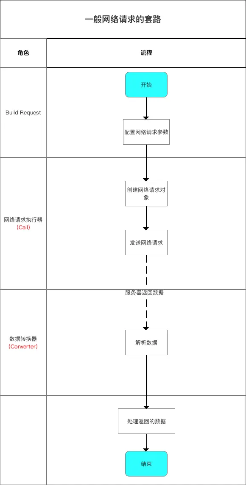
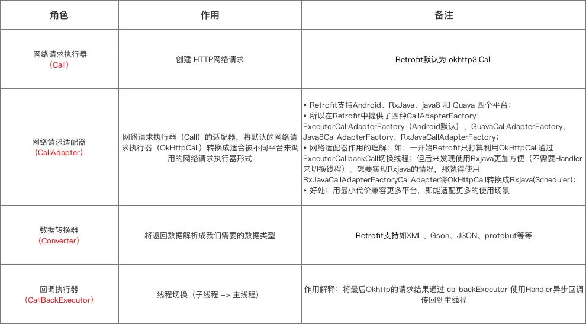

# 一、 源码分析

### Retrofit的本质流程

一般从网络通信过程（网络请求的过程）如下图：



- 其实Retrofit的本质和上面是一样的套路
- 只是Retrofit通过使用**大量的设计模式**进行**功能模块的解耦**，使得上面的过程进行得更加简单 & 流畅

如下图：


Retrofit的本质

具体过程解释如下：

1. 通过解析 网络请求接口的注解 配置 网络请求参数
2. 通过 动态代理 生成 网络请求对象
3. 通过 网络请求适配器 将 网络请求对象 进行平台适配

> 平台包括：Android、Rxjava、Guava和java8

1. 通过 网络请求执行器 发送网络请求
2. 通过 数据转换器 解析服务器返回的数据
3. 通过 回调执行器 切换线程（子线程 ->>主线程）
4. 用户在主线程处理返回结果

下面介绍上面提到的几个角色



### 4.2 源码分析

先来回忆Retrofit的使用步骤：

1. 创建Retrofit实例
2. 创建 网络请求接口实例 并 配置网络请求参数
3. 发送网络请求

> 封装了 数据转换、线程切换的操作

1. 处理服务器返回的数据

### 4.2.1 创建Retrofit实例

#### a. 使用步骤

```cpp
 Retrofit retrofit = new Retrofit.Builder()
                                 .baseUrl("http://fanyi.youdao.com/")
                                 .addConverterFactory(GsonConverterFactory.create())
                                 .build();
```

#### b. 源码分析

Retrofit实例是**使用建造者模式通过Builder类**进行创建的

> 建造者模式：将一个复杂对象的构建与表示分离，使得用户在不知道对象的创建细节情况下就可以直接创建复杂的对象。具体请看文章：建造者模式.md

接下来，我将分五个步骤对创建Retrofit实例进行逐步分析


### 步骤1


```kotlin
<-- Retrofit类 -->
 public final class Retrofit {
  
  private final Map<Method, ServiceMethod> serviceMethodCache = new LinkedHashMap<>();
  // 网络请求配置对象（对网络请求接口中方法注解进行解析后得到的对象）
  // 作用：存储网络请求相关的配置，如网络请求的方法、数据转换器、网络请求适配器、网络请求工厂、基地址等
  
  private final HttpUrl baseUrl;
  // 网络请求的url地址

  private final okhttp3.Call.Factory callFactory;
  // 网络请求器的工厂
  // 作用：生产网络请求器（Call）
  // Retrofit是默认使用okhttp
  
   private final List<CallAdapter.Factory> adapterFactories;
  // 网络请求适配器工厂的集合
  // 作用：放置网络请求适配器工厂
  // 网络请求适配器工厂作用：生产网络请求适配器（CallAdapter）
  // 下面会详细说明


  private final List<Converter.Factory> converterFactories;
  // 数据转换器工厂的集合
  // 作用：放置数据转换器工厂
  // 数据转换器工厂作用：生产数据转换器（converter）

  private final Executor callbackExecutor;
  // 回调方法执行器

private final boolean validateEagerly; 
// 标志位
// 作用：是否提前对业务接口中的注解进行验证转换的标志位


<-- Retrofit类的构造函数 -->
Retrofit(okhttp3.Call.Factory callFactory, HttpUrl baseUrl,  
      List<Converter.Factory> converterFactories, List<CallAdapter.Factory> adapterFactories,  
      Executor callbackExecutor, boolean validateEagerly) {  
    this.callFactory = callFactory;  
    this.baseUrl = baseUrl;  
    this.converterFactories = unmodifiableList(converterFactories); 
    this.adapterFactories = unmodifiableList(adapterFactories);   
    // unmodifiableList(list)近似于UnmodifiableList<E>(list)
    // 作用：创建的新对象能够对list数据进行访问，但不可通过该对象对list集合中的元素进行修改
    this.callbackExecutor = callbackExecutor;  
    this.validateEagerly = validateEagerly;  
  ...
  // 仅贴出关键代码
}
```

**成功建立一个Retrofit对象的标准：配置好Retrofit类里的成员变量**，即配置好：

- `serviceMethod`：包含所有网络请求信息的对象
- `baseUrl`：网络请求的url地址
- `callFactory`：网络请求工厂
- `adapterFactories`：网络请求适配器工厂的集合
- `converterFactories`：数据转换器工厂的集合
- `callbackExecutor`：回调方法执行器

所谓`xxxFactory`、“xxx工厂”其实是设计模式中**工厂模式**的体现：将“类实例化的操作”与“使用对象的操作”分开，使得使用者不用知道具体参数就可以实例化出所需要的“产品”类。

> 具体请看我写的文章
>  简单工厂模式.md
>  工厂方法模式.md
>  抽象工厂模式.md

这里详细介绍一下：`CallAdapterFactory`：该`Factory`生产的是`CallAdapter`，那么`CallAdapter`又是什么呢？

#### `CallAdapter`详细介绍

- 定义：网络请求执行器（Call）的适配器

> 1. Call在Retrofit里默认是`OkHttpCall`
> 2. 在Retrofit中提供了四种CallAdapterFactory： ExecutorCallAdapterFactory（默认）、GuavaCallAdapterFactory、Java8CallAdapterFactory、RxJavaCallAdapterFactory

- 作用：将默认的网络请求执行器（OkHttpCall）转换成适合被不同平台来调用的网络请求执行器形式

> 1. 如：一开始`Retrofit`只打算利用`OkHttpCall`通过`ExecutorCallbackCall`切换线程；但后来发现使用`Rxjava`更加方便（不需要Handler来切换线程）。想要实现`Rxjava`的情况，那就得使用`RxJavaCallAdapterFactoryCallAdapter`将`OkHttpCall`转换成`Rxjava(Scheduler)`：

```cpp
// 把response封装成rxjava的Observeble，然后进行流式操作
Retrofit.Builder.addCallAdapterFactory(newRxJavaCallAdapterFactory().create()); 
// 关于RxJava的使用这里不作更多的展开
```

> 1. Retrofit还支持java8、Guava平台。

- 好处：用最小代价兼容更多平台，即能适配更多的使用场景

**所以，接下来需要分析的步骤2、步骤3、步骤4、步骤4的目的是配置好上述所有成员变量**

### 步骤2


我们先来看Builder类

> 请按下面提示的步骤进行查看

```java
<-- Builder类-->
public static final class Builder {
    private Platform platform;
    private okhttp3.Call.Factory callFactory;
    private HttpUrl baseUrl;
    private List<Converter.Factory> converterFactories = new ArrayList<>();
    private List<CallAdapter.Factory> adapterFactories = new ArrayList<>();
    private Executor callbackExecutor;
    private boolean validateEagerly;

// 从上面可以发现， Builder类的成员变量与Retrofit类的成员变量是对应的
// 所以Retrofit类的成员变量基本上是通过Builder类进行配置
// 开始看步骤1

<-- 步骤1 -->
// Builder的构造方法（无参）
 public Builder() {
      this(Platform.get());
// 用this调用自己的有参构造方法public Builder(Platform platform) ->>步骤5（看完步骤2、3、4再看）
// 并通过调用Platform.get（）传入了Platform对象
// 继续看Platform.get()方法 ->>步骤2
// 记得最后继续看步骤5的Builder有参构造方法
    }
...
}

<-- 步骤2 -->
class Platform {

  private static final Platform PLATFORM = findPlatform();
  // 将findPlatform()赋给静态变量

  static Platform get() {
    return PLATFORM;    
    // 返回静态变量PLATFORM，即findPlatform() ->>步骤3
  }

<-- 步骤3 -->
private static Platform findPlatform() {
    try {

      Class.forName("android.os.Build");
      // Class.forName(xxx.xx.xx)的作用：要求JVM查找并加载指定的类（即JVM会执行该类的静态代码段）
      if (Build.VERSION.SDK_INT != 0) {
        return new Android(); 
        // 此处表示：如果是Android平台，就创建并返回一个Android对象 ->>步骤4
      }
    } catch (ClassNotFoundException ignored) {
    }

    try {
      // 支持Java平台
      Class.forName("java.util.Optional");
      return new Java8();
    } catch (ClassNotFoundException ignored) {
    }

    try {
      // 支持iOS平台
      Class.forName("org.robovm.apple.foundation.NSObject");
      return new IOS();
    } catch (ClassNotFoundException ignored) {
    }

// 从上面看出：Retrofit2.0支持3个平台：Android平台、Java平台、IOS平台
// 最后返回一个Platform对象（指定了Android平台）给Builder的有参构造方法public Builder(Platform platform)  --> 步骤5
// 说明Builder指定了运行平台为Android
    return new Platform();
  }
...
}

<-- 步骤4 -->
// 用于接收服务器返回数据后进行线程切换在主线程显示结果

static class Android extends Platform {

    @Override
      CallAdapter.Factory defaultCallAdapterFactory(Executor callbackExecutor) {

      return new ExecutorCallAdapterFactory(callbackExecutor);
    // 创建默认的网络请求适配器工厂
    // 该默认工厂生产的 adapter 会使得Call在异步调用时在指定的 Executor 上执行回调
    // 在Retrofit中提供了四种CallAdapterFactory： ExecutorCallAdapterFactory（默认）、GuavaCallAdapterFactory、Java8CallAdapterFactory、RxJavaCallAdapterFactory
    // 采用了策略模式
    
    }

    @Override 
      public Executor defaultCallbackExecutor() {
      // 返回一个默认的回调方法执行器
      // 该执行器作用：切换线程（子->>主线程），并在主线程（UI线程）中执行回调方法
      return new MainThreadExecutor();
    }

    static class MainThreadExecutor implements Executor {
   
      private final Handler handler = new Handler(Looper.getMainLooper());
      // 获取与Android 主线程绑定的Handler 

      @Override 
      public void execute(Runnable r) {
        
        
        handler.post(r);
        // 该Handler是上面获取的与Android 主线程绑定的Handler 
        // 在UI线程进行对网络请求返回数据处理等操作。
      }
    }

// 切换线程的流程：
// 1. 回调ExecutorCallAdapterFactory生成了一个ExecutorCallbackCall对象
//2. 通过调用ExecutorCallbackCall.enqueue(CallBack)从而调用MainThreadExecutor的execute()通过handler切换到主线程
  }

// 下面继续看步骤5的Builder有参构造方法
<-- 步骤5 -->
//  Builder类的构造函数2（有参）
  public  Builder(Platform platform) {

  // 接收Platform对象（Android平台）
      this.platform = platform;

// 通过传入BuiltInConverters()对象配置数据转换器工厂（converterFactories）

// converterFactories是一个存放数据转换器Converter.Factory的数组
// 配置converterFactories即配置里面的数据转换器
      converterFactories.add(new BuiltInConverters());

// BuiltInConverters是一个内置的数据转换器工厂（继承Converter.Factory类）
// new BuiltInConverters()是为了初始化数据转换器
    }
```

对Builder类分析完毕，总结：Builder设置了默认的

- 平台类型对象：Android
- 网络请求适配器工厂：CallAdapterFactory

> CallAdapter用于对原始Call进行再次封装，如Call<R>到Observable<R>

- 数据转换器工厂： converterFactory
- 回调执行器：callbackExecutor

**特别注意，这里只是设置了默认值，但未真正配置到具体的Retrofit类的成员变量当中**

### 步骤3


还是按部就班按步骤来观看

```csharp
<-- 步骤1 -->
public Builder baseUrl(String baseUrl) {

      // 把String类型的url参数转化为适合OKhttp的HttpUrl类型
      HttpUrl httpUrl = HttpUrl.parse(baseUrl);     

    // 最终返回带httpUrl类型参数的baseUrl（）
    // 下面继续看baseUrl(httpUrl) ->> 步骤2
      return baseUrl(httpUrl);
    }


<-- 步骤2 -->
    public Builder baseUrl(HttpUrl baseUrl) {

      //把URL参数分割成几个路径碎片
      List<String> pathSegments = baseUrl.pathSegments();   

      // 检测最后一个碎片来检查URL参数是不是以"/"结尾
      // 不是就抛出异常    
      if (!"".equals(pathSegments.get(pathSegments.size() - 1))) {
        throw new IllegalArgumentException("baseUrl must end in /: " + baseUrl);
      }     
      this.baseUrl = baseUrl;
      return this;
    }
```

- 至此，步骤3分析完毕
- 总结：**baseUrl（）用于配置Retrofit类的网络请求url地址**

> 将传入的String类型url转化为适合OKhttp的HttpUrl类型的url

### 步骤4


我们从里往外看，即先看`GsonConverterFactory.creat()`

```java
public final class GsonConverterFactory extends Converter.Factory {

<-- 步骤1 -->
  public static GsonConverterFactory create() {
    // 创建一个Gson对象
    return create(new Gson()); ->>步骤2
  }

<-- 步骤2 -->
  public static GsonConverterFactory create(Gson gson) {
    // 创建了一个含有Gson对象实例的GsonConverterFactory
    return new GsonConverterFactory(gson); ->>步骤3
  }

  private final Gson gson;

<-- 步骤3 -->
  private GsonConverterFactory(Gson gson) {
    if (gson == null) throw new NullPointerException("gson == null");
    this.gson = gson;
  }
```

- 所以，GsonConverterFactory.creat()是创建了一个含有Gson对象实例的GsonConverterFactory，并返回给`addConverterFactory（）`
- 接下来继续看：`addConverterFactory（）`


```csharp
// 将上面创建的GsonConverterFactory放入到 converterFactories数组
// 在第二步放入一个内置的数据转换器工厂BuiltInConverters(）后又放入了一个GsonConverterFactory
  public Builder addConverterFactory(Converter.Factory factory) {
      converterFactories.add(checkNotNull(factory, "factory == null"));
      return this;
    }
```

- 至此，分析完毕
- 总结：步骤4用于创建一个含有Gson对象实例的GsonConverterFactory并放入到数据转换器工厂converterFactories里

> 1. 即Retrofit默认使用Gson进行解析
> 2. 若使用其他解析方式（如Json、XML或Protocobuf），也可通过自定义数据解析器来实现（必须继承 Converter.Factory）

### 步骤5


终于到了最后一个步骤了。

```csharp
    public Retrofit build() {
 
 <--  配置网络请求执行器（callFactory）-->
      okhttp3.Call.Factory callFactory = this.callFactory;
      // 如果没指定，则默认使用okhttp
      // 所以Retrofit默认使用okhttp进行网络请求
      if (callFactory == null) {
        callFactory = new OkHttpClient();
      }

 <--  配置回调方法执行器（callbackExecutor）-->
      Executor callbackExecutor = this.callbackExecutor;
      // 如果没指定，则默认使用Platform检测环境时的默认callbackExecutor
      // 即Android默认的callbackExecutor
      if (callbackExecutor == null) {
        callbackExecutor = platform.defaultCallbackExecutor();
      }

 <--  配置网络请求适配器工厂（CallAdapterFactory）-->
      List<CallAdapter.Factory> adapterFactories = new ArrayList<>(this.adapterFactories);
      // 向该集合中添加了步骤2中创建的CallAdapter.Factory请求适配器（添加在集合器末尾）
      adapterFactories.add(platform.defaultCallAdapterFactory(callbackExecutor));
    // 请求适配器工厂集合存储顺序：自定义1适配器工厂、自定义2适配器工厂...默认适配器工厂（ExecutorCallAdapterFactory）

 <--  配置数据转换器工厂：converterFactory -->
      // 在步骤2中已经添加了内置的数据转换器BuiltInConverters(）（添加到集合器的首位）
      // 在步骤4中又插入了一个Gson的转换器 - GsonConverterFactory（添加到集合器的首二位）
      List<Converter.Factory> converterFactories = new ArrayList<>(this.converterFactories);
      // 数据转换器工厂集合存储的是：默认数据转换器工厂（ BuiltInConverters）、自定义1数据转换器工厂（GsonConverterFactory）、自定义2数据转换器工厂....

// 注：
//1. 获取合适的网络请求适配器和数据转换器都是从adapterFactories和converterFactories集合的首位-末位开始遍历
// 因此集合中的工厂位置越靠前就拥有越高的使用权限

      // 最终返回一个Retrofit的对象，并传入上述已经配置好的成员变量
      return new Retrofit(callFactory, baseUrl, converterFactories, adapterFactories,
          callbackExecutor, validateEagerly);
    }
```

- 至此，步骤5分析完毕
- 总结：在最后一步中，通过前面步骤设置的变量，将Retrofit类的所有成员变量都配置完毕。
- 所以，成功创建了Retrofit的实例

# 总结

Retrofit**使用建造者模式通过Builder类**建立了一个Retrofit实例，具体创建细节是配置了：

- 平台类型对象（Platform - Android）
- 网络请求的url地址（baseUrl）
- 网络请求工厂（callFactory）

> 默认使用OkHttpCall

- 网络请求适配器工厂的集合（adapterFactories）

> 本质是配置了网络请求适配器工厂- 默认是ExecutorCallAdapterFactory

- 数据转换器工厂的集合（converterFactories）

> 本质是配置了数据转换器工厂

- 回调方法执行器（callbackExecutor）

> 默认回调方法执行器作用是：切换线程（子线程 - 主线程）

由于使用了建造者模式，所以开发者并不需要关心配置细节就可以创建好Retrofit实例，建造者模式get。

在创建Retrofit对象时，你可以通过更多更灵活的方式去处理你的需求，如使用不同的Converter、使用不同的CallAdapter，这也就提供了你使用RxJava来调用Retrofit的可能

------

# 二、创建网络请求接口的实例

### 使用步骤

```java
<-- 步骤1：定义接收网络数据的类 -->
<-- JavaBean.java -->
public class JavaBean {
  .. // 这里就不介绍了
  }

<-- 步骤2：定义网络请求的接口类 -->
<-- AccessApi.java -->
public interface AccessApi {
    // 注解GET：采用Get方法发送网络请求
    // Retrofit把网络请求的URL分成了2部分：1部分baseurl放在创建Retrofit对象时设置；另一部分在网络请求接口设置（即这里）
    // 如果接口里的URL是一个完整的网址，那么放在创建Retrofit对象时设置的部分可以不设置
    @GET("openapi.do?keyfrom=Yanzhikai&key=2032414398&type=data&doctype=json&version=1.1&q=car")

    // 接受网络请求数据的方法
    Call<JavaBean> getCall();
    // 返回类型为Call<*>，*是解析得到的数据类型，即JavaBean
}

<-- 步骤3：在MainActivity创建接口类实例  -->
AccessApi NetService = retrofit.create(AccessApi.class);
       
<-- 步骤4：对发送请求的url进行封装，即生成最终的网络请求对象  --> 
        Call<JavaBean> call = NetService.getCall();
```

### 源码分析

- 结论：Retrofit是**通过外观模式 & 代理模式 使用create（）方法**创建网络请求接口的实例（同时，通过网络请求接口里设置的注解进行了网络请求参数的配置）

> 1. 外观模式：定义一个统一接口，外部与通过该统一的接口对子系统里的其他接口进行访问。具体请看：**外观模式.md**
> 2. 代理模式：通过访问代理对象的方式来间接访问目标对象。具体请看：**代理模式.md**

- 下面主要分析步骤3和步骤4：

```xml
<-- 步骤3：在MainActivity创建接口类实例  -->
AccessApi NetService = retrofit.create(NetService.class);

<-- 步骤4：对发送请求的url进行封装，即生成最终的网络请求对象  --> 
        Call<JavaBean> call = NetService.getCall();
```

### 步骤3讲解：`AccessApi NetService = retrofit.create(NetService.class);`

```php
 public <T> T create(final Class<T> service) {

       if (validateEagerly) {  
      // 判断是否需要提前验证
      eagerlyValidateMethods(service); 
      // 具体方法作用：
      // 1. 给接口中每个方法的注解进行解析并得到一个ServiceMethod对象
      // 2. 以Method为键将该对象存入LinkedHashMap集合中
     // 特别注意：如果不是提前验证则进行动态解析对应方法（下面会详细说明），得到一个ServiceMethod对象，最后存入到LinkedHashMap集合中，类似延迟加载（默认）
    }  


        // 创建了网络请求接口的动态代理对象，即通过动态代理创建网络请求接口的实例 （并最终返回）
        // 该动态代理是为了拿到网络请求接口实例上所有注解
    return (T) Proxy.newProxyInstance(
          service.getClassLoader(),      // 动态生成接口的实现类 
          new Class<?>[] { service },    // 动态创建实例
          new InvocationHandler() {     // 将代理类的实现交给 InvocationHandler类作为具体的实现（下面会解释）
          private final Platform platform = Platform.get();

         // 在 InvocationHandler类的invoke（）实现中，除了执行真正的逻辑（如再次转发给真正的实现类对象），还可以进行一些有用的操作
         // 如统计执行时间、进行初始化和清理、对接口调用进行检查等。
          @Override 
           public Object invoke(Object proxy, Method method, Object... args)
              throws Throwable {
          
            // 下面会详细介绍 invoke（）的实现
            // 即下面三行代码
            ServiceMethod serviceMethod = loadServiceMethod(method);     
            OkHttpCall okHttpCall = new OkHttpCall<>(serviceMethod, args);
            return serviceMethod.callAdapter.adapt(okHttpCall);
          }
        });
  }

// 特别注意
// return (T) roxy.newProxyInstance(ClassLoader loader, Class<?>[] interfaces,  InvocationHandler invocationHandler)
// 可以解读为：getProxyClass(loader, interfaces) .getConstructor(InvocationHandler.class).newInstance(invocationHandler);
// 即通过动态生成的代理类，调用interfaces接口的方法实际上是通过调用InvocationHandler对象的invoke（）来完成指定的功能
// 先记住结论，在讲解步骤4的时候会再次详细说明


<-- 关注点1：eagerlyValidateMethods（） -->
private void eagerlyValidateMethods(Class<?> service) {  
    Platform platform = Platform.get();  
    for (Method method : service.getDeclaredMethods()) {  
      if (!platform.isDefaultMethod(method)) {  loadServiceMethod(method); } 
      // 将传入的ServiceMethod对象加入LinkedHashMap<Method, ServiceMethod>集合
     // 使用LinkedHashMap集合的好处：lruEntries.values().iterator().next()获取到的是集合最不经常用到的元素，提供了一种Lru算法的实现
    }  
}  
```

创建网络接口实例用了外观模式 & 代理模式：

> 使用外观模式进行访问，里面用了代理模式

### 1. 外观模式

- 外观模式：定义一个统一接口，外部与通过该统一的接口对子系统里的其他接口进行访问。具体请看：**外观模式.md**
- Retrofit对象的外观（门店） =  `retrofit.create()`
- 通过**这一外观方法**就可以在内部调用各个方法**创建网络请求接口的实例**和**配置网络请求参数**

> 大大降低了系统的耦合度

### 2. 代理模式

- 代理模式：通过访问代理对象的方式来间接访问目标对象

> 分为静态代理 & 动态代理：
>
> 1. 静态代理：代理类在程序运行前已经存在的代理方式
> 2. 动态代理：代理类在程序运行前不存在、运行时由程序动态生成的代理方式
>     具体请看文章：**代理模式.md**

- `return (T) roxy.newProxyInstance(ClassLoader loader, Class<?>[] interfaces, InvocationHandler invocationHandler)`通过代理模式中的动态代理模式，动态生成网络请求接口的代理类，并将代理类的实例创建交给`InvocationHandler类` 作为具体的实现，并最终返回一个动态代理对象。

> 生成实例过程中含有生成实现类的缓存机制（单例模式），下面会详细分析

使用动态代理的好处：

- 当`NetService`对象调用`getCall（）`接口中方法时会进行拦截，调用都会集中转发到 InvocationHandler#invoke （），可集中进行处理
- 获得网络请求接口实例上的所有注解
- 更方便封装ServiceMethod

### 下面看源码分析

下面将详细分析`InvocationHandler类 # invoke（）`里的具体实现

```dart
 new InvocationHandler() {   
          private final Platform platform = Platform.get();

  @Override 
           public Object invoke(Object proxy, Method method, Object... args)
              throws Throwable {

            // 将详细介绍下面代码
            // 关注点1
            // 作用：读取网络请求接口里的方法，并根据前面配置好的属性配置serviceMethod对象
            ServiceMethod serviceMethod = loadServiceMethod(method);     
           
            // 关注点2
            // 作用：根据配置好的serviceMethod对象创建okHttpCall对象 
            OkHttpCall okHttpCall = new OkHttpCall<>(serviceMethod, args);

            // 关注点3
            // 作用：调用OkHttp，并根据okHttpCall返回rejava的Observe对象或者返回Call
            return serviceMethod.callAdapter.adapt(okHttpCall);
          }
```

下面将详细介绍3个关注点的代码。

### 关注点1： `ServiceMethod serviceMethod = loadServiceMethod(method);`

```csharp
<-- loadServiceMethod(method)方法讲解 -->
// 一个 ServiceMethod 对象对应于网络请求接口里的一个方法
// loadServiceMethod（method）负责加载 ServiceMethod：

  ServiceMethod loadServiceMethod(Method method) {
    ServiceMethod result;
      // 设置线程同步锁
    synchronized (serviceMethodCache) {

      result = serviceMethodCache.get(method);
      // ServiceMethod类对象采用了单例模式进行创建
      // 即创建ServiceMethod对象前，先看serviceMethodCache有没有缓存之前创建过的网络请求实例
      
      // 若没缓存，则通过建造者模式创建 serviceMethod 对象
      if (result == null) {
      // 下面会详细介绍ServiceMethod生成实例的过程
        result = new ServiceMethod.Builder(this, method).build();
        serviceMethodCache.put(method, result);
      }
    }
    return result;
  }
// 这里就是上面说的创建实例的缓存机制：采用单例模式从而实现一个 ServiceMethod 对象对应于网络请求接口里的一个方法
// 注：由于每次获取接口实例都是传入 class 对象
// 而 class 对象在进程内单例的，所以获取到它的同一个方法 Method 实例也是单例的，所以这里的缓存是有效的。
```

下面，我将分3个步骤详细分析`serviceMethod`实例的创建过程：


Paste_Image.png

### 步骤1：`ServiceMethod类` 构造函数


```kotlin
<-- ServiceMethod 类 -->
public final class ServiceMethod {
final okhttp3.Call.Factory callFactory;   // 网络请求工厂  
final CallAdapter<?> callAdapter;  
// 网络请求适配器工厂
// 具体创建是在new ServiceMethod.Builder(this, method).build()最后的build()中
// 下面会详细说明

private final Converter<ResponseBody, T> responseConverter; 
// Response内容转换器  
// 作用：负责把服务器返回的数据（JSON或者其他格式，由 ResponseBody 封装）转化为 T 类型的对象；
  
private final HttpUrl baseUrl; // 网络请求地址  
private final String relativeUrl; // 网络请求的相对地址  
private final String httpMethod;   // 网络请求的Http方法  
private final Headers headers;  // 网络请求的http请求头 键值对  
private final MediaType contentType; // 网络请求的http报文body的类型  

private final ParameterHandler<?>[] parameterHandlers;  
  // 方法参数处理器
  // 作用：负责解析 API 定义时每个方法的参数，并在构造 HTTP 请求时设置参数；
  // 下面会详细说明

// 说明：从上面的成员变量可以看出，ServiceMethod对象包含了访问网络的所有基本信息

<-- ServiceMethod 类的构造函数 -->
// 作用：传入各种网络请求参数
ServiceMethod(Builder<T> builder) {

    this.callFactory = builder.retrofit.callFactory();  
    this.callAdapter = builder.callAdapter;   
    this.responseConverter = builder.responseConverter;   
  
    this.baseUrl = builder.retrofit.baseUrl();   
    this.relativeUrl = builder.relativeUrl;   
    this.httpMethod = builder.httpMethod;  
    this.headers = builder.headers;  
    this.contentType = builder.contentType; .  
    this.hasBody = builder.hasBody; y  
    this.isFormEncoded = builder.isFormEncoded;   
    this.isMultipart = builder.isMultipart;  
    this.parameterHandlers = builder.parameterHandlers;  
}
```

## 步骤2：`ServiceMethod的Builder（）`


```kotlin
   public Builder(Retrofit retrofit, Method method) {
      this.retrofit = retrofit;
      this.method = method;

      // 获取网络请求接口方法里的注释
      this.methodAnnotations = method.getAnnotations();
      // 获取网络请求接口方法里的参数类型       
      this.parameterTypes = method.getGenericParameterTypes();  
      //获取网络请求接口方法里的注解内容    
      this.parameterAnnotationsArray = method.getParameterAnnotations();    
    }
```

## 步骤3：`ServiceMethod的build（）`


```kotlin
// 作用：控制ServiceMethod对象的生成流程

 public ServiceMethod build() {

      callAdapter = createCallAdapter();    
      // 根据网络请求接口方法的返回值和注解类型，从Retrofit对象中获取对应的网络请求适配器  -->关注点1
     
      responseType = callAdapter.responseType();    
     // 根据网络请求接口方法的返回值和注解类型，从Retrofit对象中获取该网络适配器返回的数据类型
     
      responseConverter = createResponseConverter();    
      // 根据网络请求接口方法的返回值和注解类型，从Retrofit对象中获取对应的数据转换器  -->关注点3
      // 构造 HTTP 请求时，我们传递的参数都是String
      // Retrofit 类提供 converter把传递的参数都转化为 String 
      // 其余类型的参数都利用 Converter.Factory 的stringConverter 进行转换
      // @Body 和 @Part 类型的参数利用Converter.Factory 提供的 requestBodyConverter 进行转换
      // 这三种 converter 都是通过“询问”工厂列表进行提供，而工厂列表我们可以在构造 Retrofit 对象时进行添加。
      
       
       for (Annotation annotation : methodAnnotations) {
        parseMethodAnnotation(annotation);
      }
      // 解析网络请求接口中方法的注解
      // 主要是解析获取Http请求的方法
     // 注解包括：DELETE、GET、POST、HEAD、PATCH、PUT、OPTIONS、HTTP、retrofit2.http.Headers、Multipart、FormUrlEncoded
     // 处理主要是调用方法 parseHttpMethodAndPath(String httpMethod, String value, boolean hasBody) ServiceMethod中的httpMethod、hasBody、relativeUrl、relativeUrlParamNames域进行赋值
      
     int parameterCount = parameterAnnotationsArray.length;
     // 获取当前方法的参数数量
      
      parameterHandlers = new ParameterHandler<?>[parameterCount];
      for (int p = 0; p < parameterCount; p++) {
        Type parameterType = parameterTypes[p];
        Annotation[] parameterAnnotations = parameterAnnotationsArray[p];
        // 为方法中的每个参数创建一个ParameterHandler<?>对象并解析每个参数使用的注解类型
        // 该对象的创建过程就是对方法参数中注解进行解析
        // 这里的注解包括：Body、PartMap、Part、FieldMap、Field、Header、QueryMap、Query、Path、Url 
        parameterHandlers[p] = parseParameter(p, parameterType, parameterAnnotations);
      } 
      return new ServiceMethod<>(this);

<-- 总结 -->
// 1. 根据返回值类型和方法标注从Retrofit对象的的网络请求适配器工厂集合和内容转换器工厂集合中分别获取到该方法对应的网络请求适配器和Response内容转换器；
// 2. 根据方法的标注对ServiceMethod的域进行赋值
// 3. 最后为每个方法的参数的标注进行解析，获得一个ParameterHandler<?>对象
// 该对象保存有一个Request内容转换器——根据参数的类型从Retrofit的内容转换器工厂集合中获取一个Request内容转换器或者一个String内容转换器。
    }


<-- 关注点1：createCallAdapter() -->
 private CallAdapter<?> createCallAdapter() {

      // 获取网络请求接口里方法的返回值类型
      Type returnType = method.getGenericReturnType();      

      // 获取网络请求接口接口里的注解
      // 此处使用的是@Get
      Annotation[] annotations = method.getAnnotations();       
      try {

      return retrofit.callAdapter(returnType, annotations); 
      // 根据网络请求接口方法的返回值和注解类型，从Retrofit对象中获取对应的网络请求适配器
      // 下面会详细说明retrofit.callAdapter（） -- >关注点2
      }
...


<-- 关注点2：retrofit.callAdapter()  -->
 public CallAdapter<?> callAdapter(Type returnType, Annotation[] annotations) {
    return nextCallAdapter(null, returnType, annotations);
  }

 public CallAdapter<?> nextCallAdapter(CallAdapter.Factory skipPast, Type returnType,
      Annotation[] annotations) {

    // 创建 CallAdapter 如下
    // 遍历 CallAdapter.Factory 集合寻找合适的工厂（该工厂集合在第一步构造 Retrofit 对象时进行添加（第一步时已经说明））
    // 如果最终没有工厂提供需要的 CallAdapter，将抛出异常
    for (int i = start, count = adapterFactories.size(); i < count; i++) {
      CallAdapter<?> adapter = adapterFactories.get(i).get(returnType, annotations, this);      
      if (adapter != null) {
        return adapter;
      }
    }


<--   关注点3：createResponseConverter（） -->

 private Converter<ResponseBody, T> createResponseConverter() {
      Annotation[] annotations = method.getAnnotations();
      try {
    
        // responseConverter 还是由 Retrofit 类提供  -->关注点4
        return retrofit.responseBodyConverter(responseType, annotations);
      } catch (RuntimeException e) { 
        throw methodError(e, "Unable to create converter for %s", responseType);
      }
    }

<--   关注点4：responseBodyConverter（） -->
  public <T> Converter<ResponseBody, T> responseBodyConverter(Type type, Annotation[] annotations) {
    return nextResponseBodyConverter(null, type, annotations);
  }

 public <T> Converter<ResponseBody, T> nextResponseBodyConverter(Converter.Factory skipPast,

    int start = converterFactories.indexOf(skipPast) + 1;
    for (int i = start, count = converterFactories.size(); i < count; i++) {

       // 获取Converter 过程：（和获取 callAdapter 基本一致）
         Converter<ResponseBody, ?> converter =
          converterFactories.get(i).responseBodyConverter(type, annotations, this); 
       // 遍历 Converter.Factory 集合并寻找合适的工厂（该工厂集合在构造 Retrofit 对象时进行添加（第一步时已经说明））
       // 由于构造Retroifit采用的是Gson解析方式，所以取出的是GsonResponseBodyConverter
       // Retrofit - Converters 还提供了 JSON，XML，ProtoBuf 等类型数据的转换功能。
       // 继续看responseBodyConverter（） -->关注点5    
    }


<--   关注点5：responseBodyConverter（） -->
@Override
public Converter<ResponseBody, ?> responseBodyConverter(Type type, 
    Annotation[] annotations, Retrofit retrofit) {

  
  TypeAdapter<?> adapter = gson.getAdapter(TypeToken.get(type));
  // 根据目标类型，利用 Gson#getAdapter 获取相应的 adapter
  return new GsonResponseBodyConverter<>(gson, adapter);
}

// 做数据转换时调用 Gson 的 API 即可。
final class GsonResponseBodyConverter<T> implements Converter<ResponseBody, T> {
  private final Gson gson;
  private final TypeAdapter<T> adapter;

  GsonResponseBodyConverter(Gson gson, TypeAdapter<T> adapter) {
    this.gson = gson;
    this.adapter = adapter;
  }

  @Override 
   public T convert(ResponseBody value) throws IOException {
    JsonReader jsonReader = gson.newJsonReader(value.charStream());
    try {
      return adapter.read(jsonReader);
    } finally {
      value.close();
    }
  }
}
```

- 当选择了RxjavaCallAdapterFactory后，Rxjava通过策略模式选择对应的adapter

> 关于策略模式的讲解，请看文章：策略模式.md

- 具体过程是：根据网络接口方法的返回值类型来选择具体要用哪种CallAdapterFactory，然后创建具体的CallAdapter实例

### 采用工厂模式使得各功能模块高度解耦

- 上面提到了两种工厂：CallAdapter.Factory & Converter.Factory分别负责提供不同的功能模块
- 工厂负责如何提供、提供何种功能模块
- Retrofit 只负责提供选择何种工厂的决策信息（如网络接口方法的参数、返回值类型、注解等）

这正是所谓的**高内聚低耦合**，工厂模式get。

> 关于工厂模式请看我写的文章：
>  **简单工厂模式.md**
>  **工厂方法模式.md**
>  **抽象工厂模式.md**

终于配置完网络请求参数（即配置好`ServiceMethod`对象）。接下来将讲解第二行代码：`okHttpCall对象`的创建

### 第二行：`OkHttpCall okHttpCall = new OkHttpCall<>(serviceMethod, args);`

根据第一步配置好的`ServiceMethod`对象和输入的请求参数创建`okHttpCall`对象


```java
<--OkHttpCall类 -->
public class OkHttpCall {
    private final ServiceMethod<T> serviceMethod; // 含有所有网络请求参数信息的对象  
    private final Object[] args; // 网络请求接口的参数 
    private okhttp3.Call rawCall; //实际进行网络访问的类  
    private Throwable creationFailure; //几个状态标志位  
    private boolean executed;  
    private volatile boolean canceled;  
  
<--OkHttpCall构造函数 -->
  public OkHttpCall(ServiceMethod<T> serviceMethod, Object[] args) {  
    // 传入了配置好的ServiceMethod对象和输入的请求参数
    this.serviceMethod = serviceMethod;  
    this.args = args;  
}  
```

### 第三行：`return serviceMethod.callAdapter.adapt(okHttpCall);`

将第二步创建的`OkHttpCall`对象传给第一步创建的`serviceMethod`对象中对应的网络请求适配器工厂的`adapt（）`

> 返回对象类型：Android默认的是`Call<>`；若设置了RxJavaCallAdapterFactory，返回的则是`Observable<>`


```csharp
<--  adapt（）详解-->
public <R> Call<R> adapt(Call<R> call) {
        return new ExecutorCallbackCall<>(callbackExecutor, call);  
      }

   ExecutorCallbackCall(Executor callbackExecutor, Call<T> delegate) {
      this.delegate = delegate; 
      // 把上面创建并配置好参数的OkhttpCall对象交给静态代理delegate
      // 静态代理和动态代理都属于代理模式
     // 静态代理作用：代理执行被代理者的方法，且可在要执行的方法前后加入自己的动作，进行对系统功能的拓展
      
      this.callbackExecutor = callbackExecutor;
      // 传入上面定义的回调方法执行器
      // 用于进行线程切换   
    }
```

- 采用了**装饰模式**：ExecutorCallbackCall = 装饰者，而里面真正去执行网络请求的还是OkHttpCall
- 使用装饰模式的原因：希望在OkHttpCall发送请求时做一些额外操作。这里的额外操作是线程转换，即将子线程切换到主线程

> 1. OkHttpCall的enqueue()是进行网络异步请求的：当你调用OkHttpCall.enqueue（）时，回调的callback是在子线程中，需要通过Handler转换到主线程进行回调。ExecutorCallbackCall就是用于线程回调；
> 2. 当然以上是原生Retrofit使用的切换线程方式。如果你用Rxjava，那就不会用到这个ExecutorCallbackCall而是RxJava的Call，此处不过多展开

### 步骤4讲解：`Call<JavaBean> call = NetService.getCall();`

- `NetService`对象实际上是动态代理对象`Proxy.newProxyInstance（）`（步骤3中已说明），并不是真正的网络请求接口创建的对象
- 当`NetService`对象调用`getCall（）`时会被动态代理对象`Proxy.newProxyInstance（）`拦截，然后调用自身的`InvocationHandler # invoke（）`
- `invoke(Object proxy, Method method, Object... args)`会传入3个参数：`Object proxy:`（代理对象）、
   `Method method`（调用的`getCall()`）
   `Object... args`（方法的参数，即`getCall（*）`中的*）
- 接下来利用Java反射获取到`getCall（）`的注解信息，配合args参数创建`ServiceMethod对象`。

> 如上面步骤3描述，此处不再次讲解

**最终创建并返回一个`OkHttpCall`类型的Call对象**

> 1. `OkHttpCall`类是`OkHttp`的包装类
> 2. 创建了`OkHttpCall`类型的Call对象还不能发送网络请求，需要创建`Request`对象才能发送网络请求

# 总结

Retrofit采用了外观模式统一调用创建网络请求接口实例和网络请求参数配置的方法，具体细节是：

- 动态创建网络请求接口的实例**（代理模式 - 动态代理）**
- 创建 `serviceMethod` 对象**（建造者模式 & 单例模式（缓存机制））**
- 对 `serviceMethod` 对象进行网络请求参数配置：通过解析网络请求接口方法的参数、返回值和注解类型，从Retrofit对象中获取对应的网络请求的url地址、网络请求执行器、网络请求适配器 & 数据转换器。**（策略模式）**
- 对 `serviceMethod` 对象加入线程切换的操作，便于接收数据后通过Handler从子线程切换到主线程从而对返回数据结果进行处理**（装饰模式）**
- 最终创建并返回一个`OkHttpCall`类型的网络请求对象

------

# 3. 执行网络请求

- `Retrofit`默认使用`OkHttp`，即`OkHttpCall类`（实现了 `retrofit2.Call<T>`接口）

> 但可以自定义选择自己需要的Call类

- ```
  OkHttpCall
  ```

  提供了两种网络请求方式：

  1. 同步请求：`OkHttpCall.execute()`
  2. 异步请求：`OkHttpCall.enqueue()`

下面将详细介绍这两种网络请求方式。

> 对于OkHttpCall的enqueue（）、execute（）此处不往下分析，有兴趣的读者可以看OkHttp的源码

### 3.1 同步请求`OkHttpCall.execute()`

#### 3.1.1 发送请求过程

- **步骤1：**对网络请求接口的方法中的每个参数利用对应`ParameterHandler`进行解析，再根据`ServiceMethod`对象创建一个`OkHttp`的`Request`对象
- **步骤2：**使用`OkHttp`的`Request`发送网络请求；
- **步骤3：**对返回的数据使用之前设置的数据转换器（GsonConverterFactory）解析返回的数据，最终得到一个`Response<T>`对象

#### 3.1.2 具体使用


```xml
Response<JavaBean> response = call.execute();  
```

上面简单的一行代码，其实包含了整个发送网络同步请求的三个步骤。

#### 3.1.3 源码分析


```java
@Override 
public Response<T> execute() throws IOException {
  okhttp3.Call call;

 // 设置同步锁
  synchronized (this) {
    call = rawCall;
    if (call == null) {
      try {
        call = rawCall = createRawCall();
        // 步骤1：创建一个OkHttp的Request对象请求 -->关注1
      } catch (IOException | RuntimeException e) {
        creationFailure = e;
        throw e;
      }
    }
  }

  return parseResponse(call.execute());
  // 步骤2：调用OkHttpCall的execute()发送网络请求（同步）
  // 步骤3：解析网络请求返回的数据parseResponse（） -->关注2
}

<-- 关注1：createRawCall()  -->
private okhttp3.Call createRawCall() throws IOException {
  
  Request request = serviceMethod.toRequest(args);
  // 从ServiceMethod的toRequest（）返回一个Request对象
  okhttp3.Call call = serviceMethod.callFactory.newCall(request);
  // 根据serviceMethod和request对象创建 一个okhttp3.Request

  if (call == null) {
    throw new NullPointerException("Call.Factory returned null.");
  }
  return call;
}

<--  关注2：parseResponse（）-->
Response<T> parseResponse(okhttp3.Response rawResponse) throws IOException {
  ResponseBody rawBody = rawResponse.body();

  rawResponse = rawResponse.newBuilder()
      .body(new NoContentResponseBody(rawBody.contentType(), rawBody.contentLength()))
      .build();
  // 收到返回数据后进行状态码检查
  // 具体关于状态码说明下面会详细介绍
  int code = rawResponse.code();
  if (code < 200 || code >= 300) {
  }

  if (code == 204 || code == 205) {
    return Response.success(null, rawResponse);
  }

  ExceptionCatchingRequestBody catchingBody = new ExceptionCatchingRequestBody(rawBody);
  try {
    T body = serviceMethod.toResponse(catchingBody);
   // 等Http请求返回后 & 通过状态码检查后，将response body传入ServiceMethod中，ServiceMethod通过调用Converter接口（之前设置的GsonConverterFactory）将response body转成一个Java对象，即解析返回的数据
 

// 生成Response类
    return Response.success(body, rawResponse);
  } catch (RuntimeException e) {
    ... // 异常处理
  }
}
```

特别注意：

- `ServiceMethod`几乎保存了一个网络请求所需要的数据
- 发送网络请求时，`OkHttpCall`需要从`ServiceMethod`中获得一个Request对象
- 解析数据时，还需要通过`ServiceMethod`使用`Converter`（数据转换器）转换成Java对象进行数据解析

> 为了提高效率，Retrofit还会对解析过的请求`ServiceMethod`进行缓存，存放在`Map<Method, ServiceMethod> serviceMethodCache = new LinkedHashMap<>();`对象中，即第二步提到的单例模式

- 关于状态码检查时的状态码说明：


以上便是整个以**同步的方式**发送网络请求的过程。

### 3.2 异步请求`OkHttpCall.enqueue()`

##### 3.2.1 发送请求过程

- **步骤1：**对网络请求接口的方法中的每个参数利用对应`ParameterHandler`进行解析，再根据`ServiceMethod`对象创建一个`OkHttp`的`Request`对象
- **步骤2：**使用`OkHttp`的`Request`发送网络请求；
- **步骤3：**对返回的数据使用之前设置的数据转换器（GsonConverterFactory）解析返回的数据，最终得到一个`Response<T>`对象
- **步骤4：**进行线程切换从而在主线程处理返回的数据结果

> 若使用了RxJava，则直接回调到主线程

异步请求的过程跟同步请求类似，**唯一不同之处在于：异步请求会将回调方法交给回调执行器在指定的线程中执行。**

> 指定的线程此处是指主线程（UI线程）

##### 3.2.2 具体使用


```csharp
call.enqueue(new Callback<JavaBean>() {
            @Override
            public void onResponse(Call<JavaBean> call, Response<JavaBean> response) {
                System.out.println(response.isSuccessful());
                if (response.isSuccessful()) {
                    response.body().show();
                }
                else {
                    try {
                        System.out.println(response.errorBody().string());
                    } catch (IOException e) {
                        e.printStackTrace();
                    } ;
                }
            }
```

- 从上面分析有：`call`是一个静态代理
- 使用静态代理的作用是：在okhttpCall发送网络请求的前后进行额外操作

> 这里的额外操作是：线程切换，即将子线程切换到主线程，从而在主线程对返回的数据结果进行处理

##### 3.2.3 源码分析


```java
<--  call.enqueue（）解析  -->
@Override 
public void enqueue(final Callback<T> callback) {

      delegate.enqueue(new Callback<T>() {
     // 使用静态代理 delegate进行异步请求 ->>分析1
     // 等下记得回来
        @Override 
        public void onResponse(Call<T> call, final Response<T> response) {
          // 步骤4：线程切换，从而在主线程显示结果
          callbackExecutor.execute(new Runnable() {
          // 最后Okhttp的异步请求结果返回到callbackExecutor
          // callbackExecutor.execute（）通过Handler异步回调将结果传回到主线程进行处理（如显示在Activity等等），即进行了线程切换
          // 具体是如何做线程切换 ->>分析2
              @Override 
               public void run() {
              if (delegate.isCanceled()) {
                callback.onFailure(ExecutorCallbackCall.this, new IOException("Canceled"));
              } else {
                callback.onResponse(ExecutorCallbackCall.this, response);
              }
            }
          });
        }

        @Override 
        public void onFailure(Call<T> call, final Throwable t) {
          callbackExecutor.execute(new Runnable() {
            @Override public void run() {
              callback.onFailure(ExecutorCallbackCall.this, t);
            }
          });
        }
      });
    }


<-- 分析1：delegate.enqueue（）解析 -->
@Override 
public void enqueue(final Callback<T> callback) {
   
    okhttp3.Call call;
    Throwable failure;

// 步骤1：创建OkHttp的Request对象，再封装成OkHttp.call
     // delegate代理在网络请求前的动作：创建OkHttp的Request对象，再封装成OkHttp.call
    synchronized (this) {
      if (executed) throw new IllegalStateException("Already executed.");
      executed = true;

      call = rawCall;
      failure = creationFailure;
      if (call == null && failure == null) {
        try {
         
          call = rawCall = createRawCall(); 
          // 创建OkHttp的Request对象，再封装成OkHttp.call
         // 方法同发送同步请求，此处不作过多描述  
        } catch (Throwable t) {
          failure = creationFailure = t;
        }
      }

// 步骤2：发送网络请求
    // delegate是OkHttpcall的静态代理
    // delegate静态代理最终还是调用Okhttp.enqueue进行网络请求
    call.enqueue(new okhttp3.Callback() {
      @Override 
        public void onResponse(okhttp3.Call call, okhttp3.Response rawResponse)
          throws IOException {
        Response<T> response;
        try {
        
          // 步骤3：解析返回数据
          response = parseResponse(rawResponse);
        } catch (Throwable e) {
          callFailure(e);
          return;
        }
        callSuccess(response);
      }

      @Override 
         public void onFailure(okhttp3.Call call, IOException e) {
        try {
          callback.onFailure(OkHttpCall.this, e);
        } catch (Throwable t) {
          t.printStackTrace();
        }
      }

      private void callFailure(Throwable e) {
        try {
          callback.onFailure(OkHttpCall.this, e);
        } catch (Throwable t) {
          t.printStackTrace();
        }
      }

      private void callSuccess(Response<T> response) {
        try {
          callback.onResponse(OkHttpCall.this, response);
        } catch (Throwable t) {
          t.printStackTrace();
        }
      }
    });
  }

// 请回去上面分析1的起点

<-- 分析2：异步请求后的线程切换-->
// 线程切换是通过一开始创建Retrofit对象时Platform在检测到运行环境是Android时进行创建的：（之前已分析过）
// 采用适配器模式
static class Android extends Platform {

    // 创建默认的回调执行器工厂
    // 如果不将RxJava和Retrofit一起使用，一般都是使用该默认的CallAdapter.Factory
    // 后面会对RxJava和Retrofit一起使用的情况进行分析
    @Override
      CallAdapter.Factory defaultCallAdapterFactory(Executor callbackExecutor) {
      return new ExecutorCallAdapterFactory(callbackExecutor);
    }

    @Override 
      public Executor defaultCallbackExecutor() {
      // 返回一个默认的回调方法执行器
      // 该执行器负责在主线程（UI线程）中执行回调方法
      return new MainThreadExecutor();
    }

    // 获取主线程Handler
    static class MainThreadExecutor implements Executor {
      private final Handler handler = new Handler(Looper.getMainLooper());


      @Override 
      public void execute(Runnable r) {
        // Retrofit获取了主线程的handler
        // 然后在UI线程执行网络请求回调后的数据显示等操作。
        handler.post(r);
      }
    }

// 切换线程的流程：
// 1. 回调ExecutorCallAdapterFactory生成了一个ExecutorCallbackCall对象
// 2. 通过调用ExecutorCallbackCall.enqueue(CallBack)从而调用MainThreadExecutor的execute()通过handler切换到主线程处理返回结果（如显示在Activity等等）
  }
```

以上便是整个以**异步方式**发送网络请求的过程。

# 5. 总结

`Retrofit` 本质上是一个 `RESTful` 的`HTTP` 网络请求框架的封装，即通过 大量的设计模式 封装了 `OkHttp` ，使得简洁易用。具体过程如下：

1. `Retrofit` 将 `Http`请求 抽象 成 `Java`接口
2. 在接口里用 注解 描述和配置 网络请求参数
3. 用动态代理 的方式，动态将网络请求接口的注解 解析 成`HTTP`请求
4. 最后执行`HTTP`请求

最后贴一张非常详细的`Retrofit`源码分析图：


# 参考

[Carson带你学Android：手把手带你深入读懂Retrofit 2.0源码](https://www.jianshu.com/p/0c055ad46b6c)
