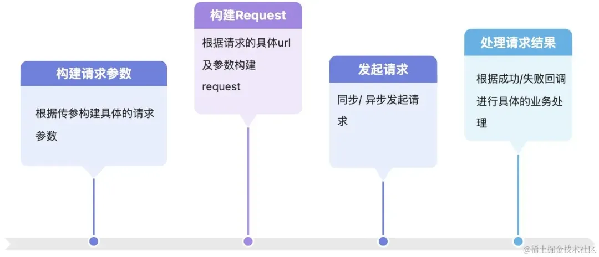

# 前言

Retrofit 是对 OkHttp 做了封装的库。那一个基于OkHttp二次封装的网络请求库，是怎么做到以其优秀的易用性、拓展性为人称道的呢？

我们先来看看OkHttp的工作流程，使用OkHttp调用 WanAndroid 的登录接口：

```kotlin
// UserRepository.kt
private val baseUrl = "https://www.wanandroid.com/"

private fun fetchLoginByOkHttp(
    username: String,
    password: String,
) {
    val body = FormBody.Builder()
        .addEncoded("username", username)
        .addEncoded("password", password)
        .build()
    val request = Request.Builder()
        .url("$baseUrl user/login")
        .post(body)
        .build()
    okHttpClient.newCall(request).enqueue(object : Callback {
        override fun onFailure(call: Call, e: IOException) {
            // 失败回调
            e.printStackTrace()
        }

        override fun onResponse(call: Call, response: Response) {
            // 成功回调
            Log.d(TAG, response.body.toString())
        }
    })
}
```

看起来没有任何问题...我们继续，既然有登录，那也应该有注册功能吧？我们来调用注册接口看看：

```kotlin
private fun fetchRegisterByOkHttp(
    username: String,
    password: String,
    repeatPassword: String,
) {
    val body = FormBody.Builder()
        .addEncoded("username", username)
        .addEncoded("password", password)
        .addEncoded("repassword", repeatPassword)
        .build()
    val request = Request.Builder()
        .url("$baseUrl user/register")
        .post(body)
        .build()
    okHttpClient.newCall(request).enqueue(object : Callback {
        override fun onFailure(call: Call, e: IOException) {
            // 失败回调
            e.printStackTrace()
        }

        override fun onResponse(call: Call, response: Response) {
            // 成功回调
            Log.d(TAG, response.body.toString())
        }
    })
}
```

上面的代码有什么问题呢？

### **模版代码出现了**

**注册的代码怎么有似曾相识的感觉？**

没错，对比登录和注册，我们不难发现，两段代码虽然实现的功能各不相同，但是代码大体上是一致的：



除了请求结果需业务方结合业务需求自行处理外，其余步骤其实相对来说是比较固定的，无非是客户端根据后端提供的接口文档组装请求体，然后发起请求，两段代码唯一的区别就是构建请求体的过程稍有区别（注册的方法多了一个参数），这样看起来，构建请求参数、构建Request以及发起请求的代码就显得如出一辙了，我们称之为模版代码，在实际开发中，我们要尽量消除模版代码。

### **构建请求体的代码写起来好麻烦啊**

上面两段请求代码，在构造Request时要做很多繁琐的工作，作为调用方，我们真的需要关注如何构建Request么？答案当然是否定的。我们想要的，只不过是发起网络请求拿到数据，至于请求的解析、构造以及真正的发起请求要怎么处理，调用者不需要也不应该需要知道，上面的实现也违反了软件设计很重要的一条原则：迪米特法则。

迪米特法则（Law of Demeter，简称LOD）又称为最少知识原则（Least Knowledge Principle），是一种面向对象设计的原则，旨在减少类和类之间交互的必要性，以降低耦合并提高系统的可维护性和可复用性。迪米特法则的核心思想是：

- 一个对象应当对其他对象保持尽可能少的了解。
- 两个对象之间不应发生不必要的直接交互，除非它们是不可分割地绑定的。

# Retrofit能解决问题？

同样的接口，我们使用Retrofit请求看看：

```kotlin
#LoginService.kt
interface LoginService {

    @POST("user/login")
    @FormUrlEncoded
    suspend fun login(
        @Field("username") username: String,
        @Field("password") password: String,
    ): Result<ApiResponse<LoginResponse>>

    @POST("user/register")
    suspend fun register(
        @Field("username") username: String,
        @Field("password") password: String,
        @Field("repassword") repeatPassword: String,
    ): Result<ApiResponse<LoginResponse>>
}

private suspend fun fetchLoginByRetrofit(
    username: String,
    password: String,
) {
    val loginService = retrofit.create(LoginService::class.java)
    loginService.login(username, password).onFailure {
        // 失败回调
    }.onSuccess {
        // 成功回调
    }
}
```

对比OkHttp的登录方法，我们能看到Retrofit的请求更简洁了，简简单单的调用接口，处理成功/失败，完全解决了我们上面提到的两个问题：

- 消除了模板代码
- 屏蔽了和调用者无关的处理，完全符合软件设计六大原则中的迪米特法则

通过注解的形式将构建Request所需的必要信息依附在接口方法上，撇除了所有的多余信息，使得调用方能够集中精力干需求。那它是怎么做到的？

## 动态代理？

上面啰嗦了一大堆，只是为了让你切身体验到Retrofit的魅力。网上很多文章讲起Retrofit都喜欢一上来直接给你讲动态代理，殊不知动态代理只是一个工具，本质上只是代理模式的一种体现。Retrofit是使用了动态代理消除了模版代码，但切不可将Retrofit与动态代理画上等号。接下来我们通过现象看本质，一步一步探究其中奥妙。

### **Retrofit的构建**

我们从retrofit的构建看起：

> Retrofit代码基于v2.9.0

```kotlin
Retrofit.Builder()
    .client(okHttpClient)
    // 使用Gson进行反序列化
    .addConverterFactory(GsonConverterFactory.create())
    // 配置Rxjava
    .addCallAdapterFactory(RxJava2CallAdapterFactory.create())
    // 设置baseUrl
    .baseUrl(BASE_URL)
    .build()
```

我们点进build方法看看Retrofit构建时有没有使用上什么黑魔法：

```kotlin
#Retrofit.java
public Retrofit build() {
    if (baseUrl == null) {
        throw new IllegalStateException("Base URL required.");
    }

    okhttp3.Call.Factory callFactory = this.callFactory;
    if (callFactory == null) {
        callFactory = new OkHttpClient();
    }

    Executor callbackExecutor = this.callbackExecutor;
    if (callbackExecutor == null) {
        callbackExecutor = platform.defaultCallbackExecutor();
    }

    List<CallAdapter.Factory> callAdapterFactories = new ArrayList<>(this.callAdapterFactories);
    callAdapterFactories.addAll(platform.defaultCallAdapterFactories(callbackExecutor));

    List<Converter.Factory> converterFactories =
    new ArrayList<>(
        1 + this.converterFactories.size() + platform.defaultConverterFactoriesSize());

    converterFactories.add(new BuiltInConverters());
    converterFactories.addAll(this.converterFactories);
    converterFactories.addAll(platform.defaultConverterFactories());

    return new Retrofit(
        callFactory,
        baseUrl,
        unmodifiableList(converterFactories),
        unmodifiableList(callAdapterFactories),
        callbackExecutor,
        validateEagerly);
}
```

简简单单的Builder模式，不是这边，换，接下来看Service的创建：

```kotlin
#Retrofit.java
public <T> T create(final Class<T> service) {
    validateServiceInterface(service);
    return (T)
            Proxy.newProxyInstance(
                service.getClassLoader(),
                new Class<?>[] {service},
                new InvocationHandler() {
                    private final Platform platform = Platform.get();
                    private final Object[] emptyArgs = new Object[0];

                    @Override
                    public @Nullable Object invoke(Object proxy, Method method, @Nullable Object[] args)
                    throws Throwable {
                        // If the method is a method from Object then defer to normal invocation.
                        if (method.getDeclaringClass() == Object.class) {
                            return method.invoke(this, args);
                        }
                        args = args != null ? args : emptyArgs;
                        return platform.isDefaultMethod(method)
                        ? platform.invokeDefaultMethod(method, service, proxy, args)
                        : loadServiceMethod(method).invoke(args);
                    }
                });
}
```

很显然，这段代码就是要找的“黑魔法”所在之处了。分析这段代码之前，我们首先要对动态代理有个基本的认知，即何为动态代理？它的作用是什么？它的应用场景？不着急，我们一点一点来看：

### **何为动态代理？**

动态代理是一种在程序运行时创建代理对象的技术。它可以用于在不修改原始类代码的情况下，向其添加额外的功能。在 Java 中，动态代理主要有两种方式：

- JDK 动态代理：使用 Proxy 类和 InvocationHandler 接口来创建代理对象。
- CGLIB 代理：使用 CGLIB 库来创建代理对象。

举个例子看看？

### **动态代理一秒解决抖动问题**

```kotlin
fun <T> T.throttle(during: Long = 500L): T {
    return Proxy.newProxyInstance(this!!::class.java.classLoader, this!!::class.java.interfaces,
        object : InvocationHandler {

            private var lastInvokeTime = System.currentTimeMillis()

            override fun invoke(proxy: Any, method: Method, args: Array<out Any>?): Any? {
                val current = System.currentTimeMillis()
                return if (current - lastInvokeTime > during) {
                    lastInvokeTime = current;
                    method.invoke(this@throttle, *args.orEmpty())
                } else {
                    resolveDefaultReturnValue(method)
                }

            }
        }
    ) as T
}

private fun resolveDefaultReturnValue(method: Method): Any? {
    return when (method.returnType.name.lowercase(Locale.US)) {
        Void::class.java.simpleName.lowercase(Locale.US) -> null
        else -> throw IllegalArgumentException("throttle只能作用于无返回值函数")
    }
}

button.setOnClickListener(View.OnClickListener {
    // 此处的代码会被代理，支持防抖
}.throttle())
```

上述代码虽然简单，但是高效的解决了实际开发中的抖动问题，例如最常用的点击事件防抖，即500毫秒内多次点击，只会真正执行一次点击事件。先不去探究其内部的实现原理，我们来想想不使用动态代理的话，我们要怎么实现这种功能？还是以点击防抖为例，代码大概是这样的：

```kotlin
val buttonALastClickedTime = System.System.currentTimeMillis()
buttonA.setOnClickListener {
    val currentTime = System.System.currentTimeMillis()
    if (current - buttonALastClickedTime > 500L) {
        lastInvokeTime = current;
        // 执行具体的点击业务逻辑
    } else {
        // 过快点击，进行防抖处理
    }
}
```

如果其他button也需要同样的防抖代码，我们很容易写出类似的代码：

```kotlin
val buttonBLastClickedTime = System.System.currentTimeMillis()
buttonB.setOnClickListener {
    val currentTime = System.System.currentTimeMillis()
    if (current - buttonBLastClickedTime > 500L) {
        lastInvokeTime = current;
        // 执行具体的点击业务逻辑
    } else {
        // 过快点击，进行防抖处理
    }
}
//省略 buttonC、buttonD...
```

是的，这里又出现了我们上文提到过的模板代码。想必到这里，你已经能对动态代理最重要的一个特点有一个初步认识了，那就是消除模版代码。动态代理是实现代理模式的一种方式，与之对应的则是静态代理，他们之间的区别就是程序运行前代理类是否已经存在，即动态代理的代理类在程序运行前还不存在。

**代理模式的定义是：为其他对象提供一种代理以控制对这个对象的访问。在某些情况下，一个对象不想或者不能直接引用另一个对象，而代理对象可以在客户端和目标对象之间起到中介的作用。代理模式的思想是为了提供额外的处理或者不同的操作而在实际对象与调用者之间插入一个代理对象。这些额外的操作通常需要与实际对象进行通信。**

说人话就是一句话：代理模式可以在不修改被代理对象的基础上，通过扩展代理类，进行一些功能的附加与增强。例如上面的防抖例子，我们通过动态创建代理类，在不影响原有的点击事件的基础上，拓展了防抖功能。Android开发中很多场景都有动态代理的影子，除了上述的Retrofit之外，还经常运用于以下场景：

- 性能监控 。在Android开发中，动态代理可以用于性能监控，例如测量方法执行的时间。
- AOP（面向切面编程）。AOP是一种编程范型，通过预编译方式和运行期动态代理实现程序功能的统一维护，降低业务逻辑各部分之间的耦合度，提高程序的可重用性。
- 事件处理 。在Android开发中，动态代理可以用于事件处理，例如在方法调用前后执行额外的逻辑。

### 动态代理大显神威？

回到 Retrofit创建service 的代码中，我们来看下动态代理是如何在其中大显神威的。

```kotlin
#Retrofit.java
public <T> T create(final Class<T> service) {
    validateServiceInterface(service);
    return (T)
            Proxy.newProxyInstance(
                service.getClassLoader(),
                new Class<?>[] {service},
                new InvocationHandler() {
                    private final Platform platform = Platform.get();
                    private final Object[] emptyArgs = new Object[0];

                    @Override
                    public @Nullable Object invoke(Object proxy, Method method, @Nullable Object[] args)
                    throws Throwable {
                        // If the method is a method from Object then defer to normal invocation.
                        if (method.getDeclaringClass() == Object.class) {
                            return method.invoke(this, args);
                        }
                        args = args != null ? args : emptyArgs;
                        return platform.isDefaultMethod(method)
                        ? platform.invokeDefaultMethod(method, service, proxy, args)
                        : loadServiceMethod(method).invoke(args);
                    }
                });
}
```

这块代码的逻辑还是十分清晰的：

- validateServiceInterface(service)校验service的有效性，与我们的关注点无关，暂且忽略；
- Proxy.newProxyInstance使用动态代理代理service，重点就在这里。

**public static Object newProxyInstance(ClassLoader loader, Class<?>[] interfaces, InvocationHandler h)**

- **参数ClassLoader loader：定义代理类接口的类加载器**
- **参数Class<?>[] interfaces：代理类要实现的接口列表**
- **参数InvocationHandler h：将方法调用分派到调用处理程序**
- **返回值Object：代理实例**

Proxy.newProxyInstance 返回指定接口的代理类的实例，该接口将方法调用分派给指定的调用处理程序。 关键的invoke方法里做了一些和平台相关的判断，我们重点关注loadServiceMethod(method)方法。

```kotlin
#Retrofit.java
ServiceMethod<?> loadServiceMethod(Method method) {
    ServiceMethod<?> result = serviceMethodCache.get(method);
    if (result != null) return result;

    synchronized (serviceMethodCache) {
        result = serviceMethodCache.get(method);
        if (result == null) {
            // 以上都是缓存相关的逻辑，暂时不必理会，重点是parseAnnotations方法
            result = ServiceMethod.parseAnnotations(this, method);
            serviceMethodCache.put(method, result);
        }
    }
    return result;
}
```

loadServiceMethod方法做了一些很常见的缓存操作以提升代码性能，我们暂时不care，继续跟踪ServiceMethod.parseAnnotations方法：

```kotlin
#ServiceMethod.java
static <T> ServiceMethod<T> parseAnnotations(Retrofit retrofit, Method method) {
    // 1.解析servie中的注解并保存信息至RequestFactory
    RequestFactory requestFactory = RequestFactory.parseAnnotations(retrofit, method);
    // 2.获取并校验返回类型
    Type returnType = method.getGenericReturnType();
    if (Utils.hasUnresolvableType(returnType)) {
      throw methodError(
          method,
          "Method return type must not include a type variable or wildcard: %s",
          returnType);
    }
    if (returnType == void.class) {
      throw methodError(method, "Service methods cannot return void.");
    }
    // 3.调用HttpServiceMethod.parseAnnotations方法创建ServiceMethod
    return HttpServiceMethod.parseAnnotations(retrofit, method, requestFactory);
  }
```

重点在于最后一步调用HttpServiceMethod.parseAnnotations方法获取ServiceMethod。这部分的代码相对来说复杂了些，包含了请求以及请求结果的处理，但是和我们这part讲的动态代理解决模版代码关系不大，我们暂且按下不表。 至此，Retrofit是如何解决模版代码的我们已经探究完毕：

**使用注解**

Retrofit提供了一系列的注解，例如@GET、@POST、@PUT、@DELETE等，开发者可以使用这些注解来描述HTTP请求的方法、URL、请求参数等信息。

**动态代理**

Retrofit在运行时动态地创建了一个实现了该接口的代理类，该代理类将网络请求的细节封装起来，通过注解拿到请求的具体信息，通过接口方法来调用网络请求。

**总结：基于以上这两点，Retrofit将于本复杂啰嗦的HTTP请求大大简化，使得开发者可以专注于业务逻辑，而不是花费大量时间编写网络请求相关的代码。**

然而，Retrofit的奇妙之处还不仅仅只有动态代理。

> Retrofit 解决了什么？
>
> 有哪些实现方式？
>
> 为什么是用了动态代理？而非其他方案?

# 高扩展性的Retrofit

Retrofit 能够进入开发者的视野，很大一部分原因是它仅需一行代码，就能够支持直接返回RxJava中的Observable：

```kotlin
Retrofit retrofit = new Retrofit.Builder()
    .baseUrl("https://api.example.com")
    // 添加RxJava适配器
    .addCallAdapterFactory(RxJavaCallAdapterFactory.create())
    .build();
```

除了RxJava以及默认的Call，它还支持Kotlin协程。甚至连序列化框架他都支持多种：

```kotlin
Retrofit retrofit = new Retrofit.Builder()
    .baseUrl("https://api.example.com")
    // 添加Gson作为反序列化框架
    .addConverterFactory(GsonConverterFactory.create())
    .build();
```

除了Gson外，它还支持kotlinx-serialization、moshi、jackson等等等等序列化框架。如此高的可扩展性，它是如何做到的？

```kotlin
Inspects the annotations on an interface method to construct a reusable service method that speaks HTTP. This requires potentially-expensive reflection so it is best to build each service method only once and reuse it.
static <ResponseT, ReturnT> HttpServiceMethod<ResponseT, ReturnT> parseAnnotations(
      Retrofit retrofit, Method method, RequestFactory requestFactory) {
    boolean isKotlinSuspendFunction = requestFactory.isKotlinSuspendFunction;
    boolean continuationWantsResponse = false;
    boolean continuationBodyNullable = false;

    Annotation[] annotations = method.getAnnotations();

    // 1.获取adapterType
    Type adapterType;
    if (isKotlinSuspendFunction) {
      Type[] parameterTypes = method.getGenericParameterTypes();
      Type responseType =
          Utils.getParameterLowerBound(
              0, (ParameterizedType) parameterTypes[parameterTypes.length - 1]);
      if (getRawType(responseType) == Response.class && responseType instanceof ParameterizedType) {
        responseType = Utils.getParameterUpperBound(0, (ParameterizedType) responseType);
        continuationWantsResponse = true;
      } else {
      }

      adapterType = new Utils.ParameterizedTypeImpl(null, Call.class, responseType);
      annotations = SkipCallbackExecutorImpl.ensurePresent(annotations);
    } else {
      adapterType = method.getGenericReturnType();
    }

    // 2.根据adapterType创建CallAdapter
    CallAdapter<ResponseT, ReturnT> callAdapter =
        createCallAdapter(retrofit, method, adapterType, annotations);

    // 3.校验responseType
    Type responseType = callAdapter.responseType();
    if (responseType == okhttp3.Response.class) {
      throw methodError(
          method,
          "'"
              + getRawType(responseType).getName()
              + "' is not a valid response body type. Did you mean ResponseBody?");
    }
    if (responseType == Response.class) {
      throw methodError(method, "Response must include generic type (e.g., Response<String>)");
    }
    if (requestFactory.httpMethod.equals("HEAD") && !Void.class.equals(responseType)) {
      throw methodError(method, "HEAD method must use Void as response type.");
    }

    // 4.创建responseConverter
    Converter<ResponseBody, ResponseT> responseConverter =
        createResponseConverter(retrofit, method, responseType);
    okhttp3.Call.Factory callFactory = retrofit.callFactory;

    // 5.最终创建HttpServiceMethod实例
    if (!isKotlinSuspendFunction) {
      return new CallAdapted<>(requestFactory, callFactory, responseConverter, callAdapter);
    } else if (continuationWantsResponse) {
      return (HttpServiceMethod<ResponseT, ReturnT>)
          new SuspendForResponse<>(
              requestFactory,
              callFactory,
              responseConverter,
              (CallAdapter<ResponseT, Call<ResponseT>>) callAdapter);
    } else {
      return (HttpServiceMethod<ResponseT, ReturnT>)
          new SuspendForBody<>(
              requestFactory,
              callFactory,
              responseConverter,
              (CallAdapter<ResponseT, Call<ResponseT>>) callAdapter,
              continuationBodyNullable);
    }
  }
```

Retrofit里面对返回的数据定义了两个概念：ResponseT和ReturnT，也就响应类型和返回类型，Retrofit会使用适配器模式对其做一次“适配”，这么做的用意是什么？和Retrofit的高扩展性有无关系，我们一起去源码里找答案。 上面的代码大概分为五个步骤：

1. 根据对应的method是否为Kotlin的挂起函数以及responseType的类型获取adapterType，默认为mothod的返回值类型
2. 根据adapterType创建CallAdapter
3. 校验responseType
4. 创建responseConverter
5. 创建HttpServiceMethod实例

**AdapterType 指的就是Retrofit接口方法的返回值类型，和我们在构建Retrofit时指定的addCallAdapterFactory是一个意思。如果接口方法返回Observable，那AdapterType就是Observable，默认是Call。**

这里的第1点、第3点没啥好说的，我们重点来看2、4、5。

### **创建CallAdapter**

```kotlin
#HttpServiceMethod.java
private static <ResponseT, ReturnT> CallAdapter<ResponseT, ReturnT> createCallAdapter(
    Retrofit retrofit, Method method, Type returnType, Annotation[] annotations) {
    try {
        //noinspection unchecked
        return (CallAdapter<ResponseT, ReturnT>) retrofit.callAdapter(returnType, annotations);
    } catch (RuntimeException e) { // Wide exception range because factories are user code.
        throw methodError(method, e, "Unable to create call adapter for %s", returnType);
    }
}
```

很简单，根据上面说的adapterType从retrofit实例始终获取CallAdapter，继续跟进去：

```kotlin
#Retrofit.java
public CallAdapter<?, ?> callAdapter(Type returnType, Annotation[] annotations) {
    return nextCallAdapter(null, returnType, annotations);
}

public CallAdapter<?, ?> nextCallAdapter(
    @Nullable CallAdapter.Factory skipPast, Type returnType, Annotation[] annotations) {

    // 省略不相关代码...
    int start = callAdapterFactories.indexOf(skipPast) + 1;
    for (int i = start, count = callAdapterFactories.size(); i < count; i++) {
        CallAdapter<?, ?> adapter = callAdapterFactories.get(i).get(returnType, annotations, this);
        if (adapter != null) {
            return adapter;
        }
    }
    // 继续省略...
}
```

省略不相关代码后，逻辑非常清楚，简简单单从构建Retrofit时通过addCallAdapterFactory方法中添加的callAdapterFactory中获取CallAdaptr并返回。

callAdapterFactories除了包含我们通过addCallAdapterFactory添加的适配器，默认还包含了platform默认的适配器。

这里很明显使用了两种设计模式：适配器模式和策略模式。 通过适配器模式，将原本的Call<T>适配成业务调用方期望的Observable<T>或者其他任意Retrofit支持的返回值类型 —— 这些本来也不是调用方应该关注的逻辑。

而通过策略模式，根据不同的ReturnType选择合适的适配器，大大提高了代码的灵活性和可拓展性，即使后面有了新的适配器，也可以在不更改原本代码的前提下，新增ReturnT及其对应的工厂就实现。

创建responseConverter的代码和创建CallAdapter的思路、代码如出一辙，这里就不再赘述。ResonseConverter的职责就是将服务器返回的响应信息转换成指定的类型，例如我们想使用Gson将服务器返回的响应信息进行反序列化，只需要在构建Retrofit时指定GsonConverterFactory作为反序列化框架即可：addConverterFactory(GsonConverterFactory.create())。

### **创建HttpServiceMethod实例**

有了CallAdapte和ResponseConverter实例后，接下来就是创建HttpServiceMethod实例了。HttpServiceMethod有3个具体的实现类，分别是：

- CallAdapted，默认类型
- SuspendForResponse，兼容Kotlin协程
- SuspendForBody，兼容Kotlin协程，与SuspendForResponse不同的是它的返回值是服务器返回的响应体对象 (T)，不包含状态码和响应头

他们内部也都只是重写了adapt方法，对Call做适配，感兴趣的读者可以自己探究一下具体实现，这里按下不表。

# Retrofit再牛离不开OkHttp

上面所有的所有都是在为使用OkHttp发起真正的网络请求做准备，毕竟Retrofit并不具备网络请求的功能。通过前文的分析，我们知道了真正的网络请求发生在HttpServiceMethod.invoke方法中，他是一个抽象方法，我们以默认的CallAdapted为例，来看下它是怎么真正发起网络请求的。

```kotlin
@Override
protected ReturnT adapt(Call<ResponseT> call, Object[] args) {
    return callAdapter.adapt(call);
}
```

代码也很简单，调用CallAdapter.adapte方法，以默认的DefaultCallAdapterFactory为例，在创建CallAdapter小结中我们分析过通过策略模式拿到默认的DefaultCallAdapterFactory，代码如下：

```kotlin
#DefaultCallAdapterFactory.java
public CallAdapter<?, ?> get(Type returnType, Annotation[] annotations, Retrofit retrofit) {
    // 省略不相关代码...
    return new CallAdapter<Object, Call<?>>() {
        public Type responseType() {
            return responseType;
        }

        public Call<Object> adapt(Call<Object> call) {
            return (Call)(executor == null ? call : new ExecutorCallbackCall(executor, call));
        }
    };
}
```

可以看到，代码最终是走到了ExecutorCallbackCall里：

```kotlin
#ExecutorCallbackCall.java
public void enqueue(final Callback<T> callback) {
    Objects.requireNonNull(callback, "callback == null");
    this.delegate.enqueue(new Callback<T>() {
        public void onResponse(Call<T> call, Response<T> response) {
            ExecutorCallbackCall.this.callbackExecutor.execute(() -> {
                if (ExecutorCallbackCall.this.delegate.isCanceled()) {
                    callback.onFailure(ExecutorCallbackCall.this, new IOException("Canceled"));
                } else {
                    callback.onResponse(ExecutorCallbackCall.this, response);
                }

            });
        }

        public void onFailure(Call<T> call, Throwable t) {
            ExecutorCallbackCall.this.callbackExecutor.execute(() -> {
                callback.onFailure(ExecutorCallbackCall.this, t);
            });
        }
    });
}
```

看到这里，是不是有种眼前一亮、豁然开朗的感觉，没错，和我们一开始使用OkHttp发起网络请求没什么不同，都是通过具体的Call发起异步网络请求。

# 总结

Retrofit通过动态代理消灭了模版代码，巧妙运用适配器模式以及策略模式，将反序列化以及请求适配等与具体业务无关的、偏网络请求方面的工作收敛到了内部，同时又具备高度灵活性和可拓展性。

# 参考

[都说Retrofit好，好在哪里？只有动态代理么？](https://mp.weixin.qq.com/s/Yb5cuyoI7nPCUvQkolm27g)