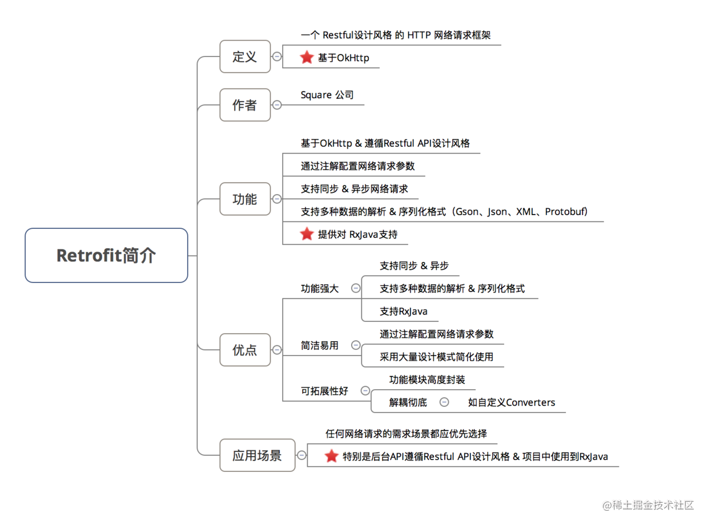

`Retrofit`是一个网络请求库。

# 一、简介

- 准确来说，**Retrofit 是一个 RESTful 的 HTTP 网络请求框架的封装。**
- 原因：网络请求的工作本质上是 `OkHttp` 完成，而 Retrofit 仅负责 网络请求接口的封装

- App应用程序通过 Retrofit 请求网络，实际上是使用 Retrofit 接口层封装请求参数、Header、Url 等信息，之后由 OkHttp 完成后续的请求操作
- 在服务端返回数据之后，OkHttp 将原始的结果交给 Retrofit，Retrofit根据用户的需求对结果进行解析

# 二、