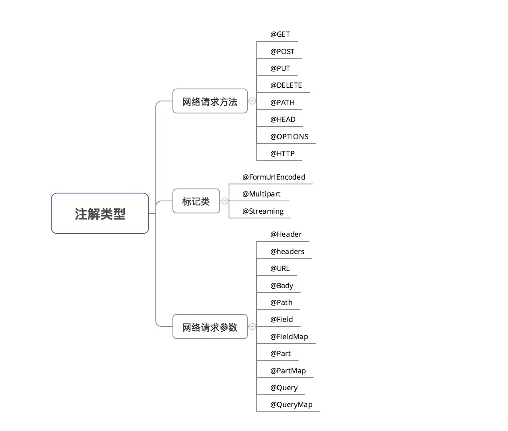
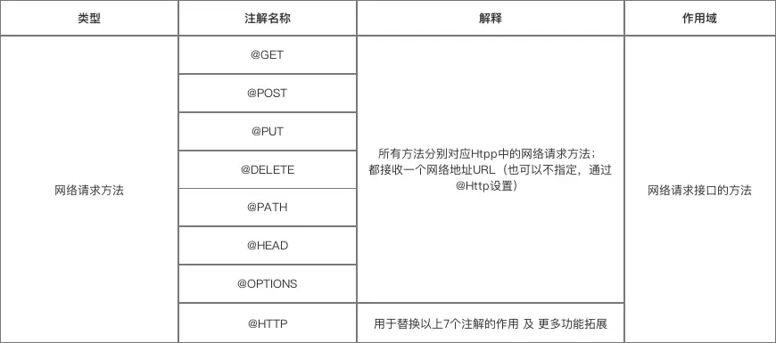
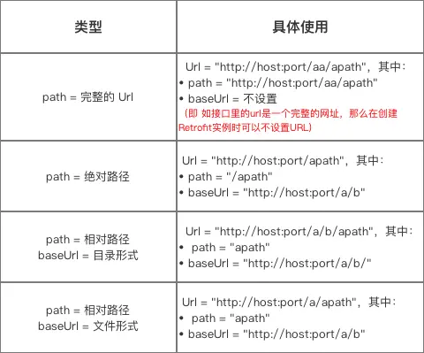
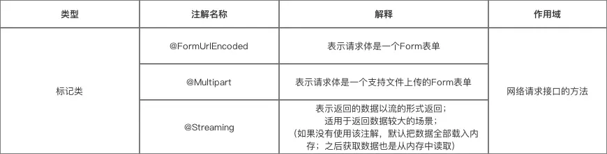
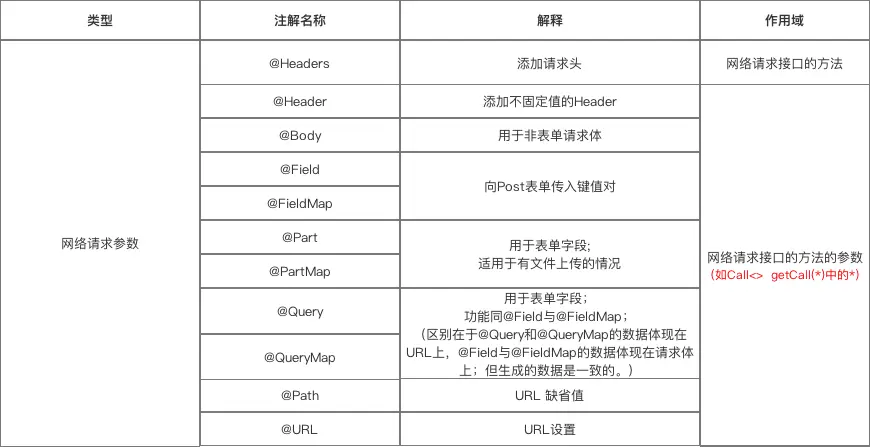
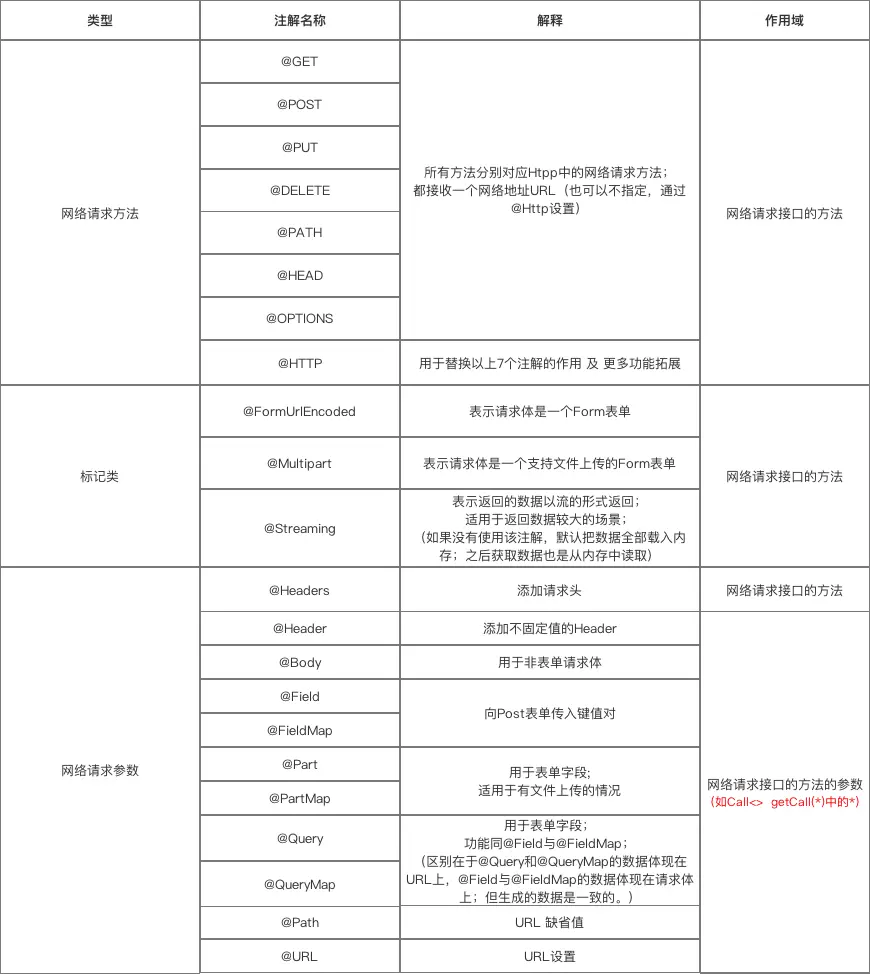
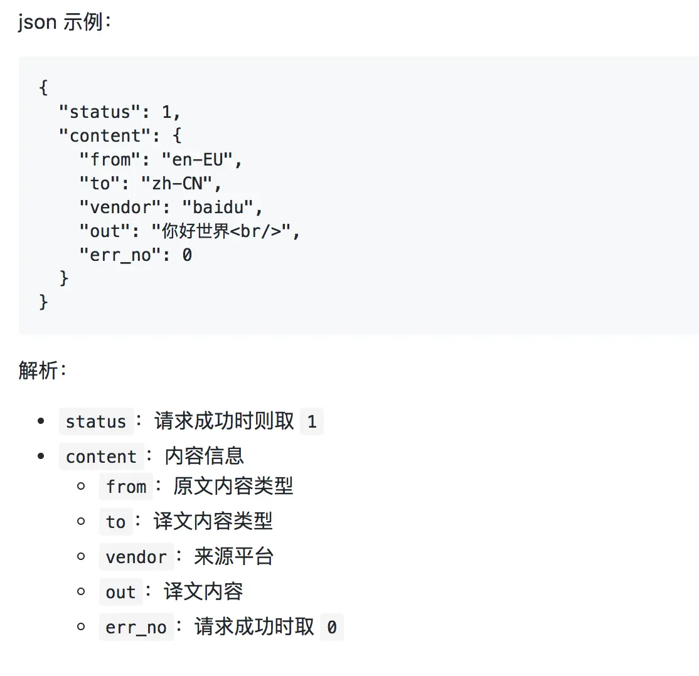

使用示例看：第四节


# 一、简介

`Retrofit`是一个网络请求库。


- 准确来说，**Retrofit 是一个 RESTful 的 HTTP 网络请求框架的封装。**
- 原因：网络请求的工作本质上是 `OkHttp` 完成，而 Retrofit 仅负责 网络请求接口的封装


- App应用程序通过 Retrofit 请求网络，实际上是使用 Retrofit 接口层封装请求参数、Header、Url 等信息，之后由 OkHttp 完成后续的请求操作
- 在服务端返回数据之后，OkHttp 将原始的结果交给 Retrofit，Retrofit根据用户的需求对结果进行解析


# 二、使用介绍

使用 Retrofit 的步骤共有7个：

**步骤1：**添加 Retrofit库的依赖
**步骤2：**创建 接收服务器返回数据的类
**步骤3：**创建 用于描述网络请求 的接口
**步骤4：**创建 Retrofit 实例
**步骤5：**创建 网络请求接口实例 并 配置网络请求参数
**步骤6：**发送网络请求（异步 / 同步）

> 封装了 数据转换、线程切换的操作

**步骤7： **处理服务器返回的数据

## 步骤1：添加Retrofit库的依赖

##### 仓库地址

https://github.com/square/retrofit

**1. 在 build.gradle加入`Retrofit`库的依赖**

```csharp
dependencies {
    compile 'com.squareup.retrofit2:retrofit:2.9.0'
    // Retrofit库
  }
```

**2. AndroidManifest.xml 中添加网络权限**

```xml
<uses-permission android:name="android.permission.INTERNET"/>
```

## 步骤2：创建 接收服务器返回数据 的类

```cpp
public class Reception {
    ...
    // 根据返回数据的格式和数据解析方式（Json、XML等）定义
    // 下面会在实例进行说明
}
```

## 步骤3：创建 用于描述网络请求 的接口

- Retrofit将 Http请求 抽象成 Java接口：采用 **注解** 描述网络请求参数 和配置网络请求参数

> 1. 用 动态代理 动态 将该接口的注解“翻译”成一个 Http 请求，最后再执行 Http 请求
> 2. 注：接口中的每个方法的参数都需要使用注解标注，否则会报错

```java
public interface GetRequest_Interface {

    // @GET注解的作用:采用Get方法发送网络请求
    // getCall() = 接收网络请求数据的方法
    // 其中返回类型为Call<*>，*是接收数据的类（即上面定义的Translation类）
    // 如果想直接获得Responsebody中的内容，可以定义网络请求返回值为Call<ResponseBody>
    @GET("openapi.do?keyfrom=Yanzhikai&key=2032414398&type=data&doctype=json&version=1.1&q=car")
    Call<Translation>  getCall();
}
```

下面详细介绍Retrofit 网络请求接口 的注解类型。

### 注解类型



### 注解说明

#### 第一类：网络请求方法



**详细说明：**
 a. @GET、@POST、@PUT、@DELETE、@HEAD
 以上方法分别对应 HTTP 中的网络请求方式

```java
public interface GetRequest_Interface {
    
	// @GET注解的作用:采用Get方法发送网络请求
    // getCall() = 接收网络请求数据的方法
    // 其中返回类型为Call<*>，*是接收数据的类（即上面定义的Translation类）
    @GET("openapi.do?keyfrom=Yanzhikai&key=2032414398&type=data&doctype=json&version=1.1&q=car")
    Call<Translation>  getCall();
}
```

此处特意说明URL的组成：Retrofit把 网络请求的URL 分成了两部分设置：

```java
// 第1部分：在网络请求接口的注解设置
 @GET("openapi.do?keyfrom=Yanzhikai&key=2032414398&type=data&doctype=json&version=1.1&q=car")
Call<Translation>  getCall();

// 第2部分：在创建Retrofit实例时通过.baseUrl()设置
Retrofit retrofit = new Retrofit.Builder()
                .baseUrl("http://fanyi.youdao.com/") //设置网络请求的Url地址
                .addConverterFactory(GsonConverterFactory.create()) //设置数据解析器
                .build();

// 从上面看出：一个请求的URL可以通过 替换块 和 请求方法的参数 来进行动态的URL更新。
// 替换块是由 被{}包裹起来的字符串构成
// 即：Retrofit支持动态改变网络请求根目录
```

- 网络请求的完整 Url =在创建Retrofit实例时通过.baseUrl()设置 + 网络请求接口的注解设置（下面称 “path“ ）
- 具体整合的规则如下：



URL整合规则

> 建议采用第三种方式来配置，并尽量使用同一种路径形式。

b. @HTTP

- 作用：替换**@GET、@POST、@PUT、@DELETE、@HEAD**注解的作用 及 更多功能拓展
- 具体使用：通过属性**method、path、hasBody**进行设置

```dart
public interface GetRequest_Interface {
    /**
     * method：网络请求的方法（区分大小写）
     * path：网络请求地址路径
     * hasBody：是否有请求体
     */
    @HTTP(method = "GET", path = "blog/{id}", hasBody = false)
    Call<ResponseBody> getCall(@Path("id") int id);
    // {id} 表示是一个变量
    // method 的值 retrofit 不会做处理，所以要自行保证准确
}
```

#### 第二类：标记



a. @FormUrlEncoded

- 作用：表示发送form-encoded的数据

> 每个键值对需要用@Filed来注解键名，随后的对象需要提供值。

b. @Multipart

- 作用：表示发送form-encoded的数据（适用于 有文件 上传的场景）

> 每个键值对需要用@Part来注解键名，随后的对象需要提供值。

具体使用如下：

```kotlin
public interface GetRequest_Interface {
        /**
         *表明是一个表单格式的请求（Content-Type:application/x-www-form-urlencoded）
         * <code>Field("username")</code> 表示将后面的 <code>String name</code> 中name的取值作为 username 的值
         */
        @POST("/form")
        @FormUrlEncoded
        Call<ResponseBody> testFormUrlEncoded1(@Field("username") String name, @Field("age") int age);
         
        /**
         * {@link Part} 后面支持三种类型，{@link RequestBody}、{@link okhttp3.MultipartBody.Part} 、任意类型
         * 除 {@link okhttp3.MultipartBody.Part} 以外，其它类型都必须带上表单字段({@link okhttp3.MultipartBody.Part} 中已经包含了表单字段的信息)，
         */
        @POST("/form")
        @Multipart
        Call<ResponseBody> testFileUpload1(@Part("name") RequestBody name, @Part("age") RequestBody age, @Part MultipartBody.Part file);

}

// 具体使用
       GetRequest_Interface service = retrofit.create(GetRequest_Interface.class);
        // @FormUrlEncoded 
        Call<ResponseBody> call1 = service.testFormUrlEncoded1("Carson", 24);
        
        //  @Multipart
        RequestBody name = RequestBody.create(textType, "Carson");
        RequestBody age = RequestBody.create(textType, "24");

        MultipartBody.Part filePart = MultipartBody.Part.createFormData("file", "test.txt", file);
        Call<ResponseBody> call3 = service.testFileUpload1(name, age, filePart);
```

#### 第三类：网络请求参数



#### 详细说明

a. @Header & @Headers

- 作用：添加请求头 &添加不固定的请求头
- 具体使用如下：

```kotlin
// @Header
@GET("user")
Call<User> getUser(@Header("Authorization") String authorization)

// @Headers
@Headers("Authorization: authorization")
@GET("user")
Call<User> getUser()

// 以上的效果是一致的。
// 区别在于使用场景和使用方式
// 1. 使用场景：@Header用于添加不固定的请求头，@Headers用于添加固定的请求头
// 2. 使用方式：@Header作用于方法的参数；@Headers作用于方法
```

b. @Body

- 作用：以 `Post`方式 传递 自定义数据类型 给服务器
- 特别注意：如果提交的是一个Map，那么作用相当于 `@Field`

> 不过Map要经过 `FormBody.Builder` 类处理成为符合 Okhttp 格式的表单，如：

```csharp
FormBody.Builder builder = new FormBody.Builder();
builder.add("key","value");
```

c. @Field & @FieldMap

- 作用：发送 Post请求 时提交请求的表单字段
- 具体使用：与 `@FormUrlEncoded` 注解配合使用

```dart
public interface GetRequest_Interface {
        /**
         *表明是一个表单格式的请求（Content-Type:application/x-www-form-urlencoded）
         * <code>Field("username")</code> 表示将后面的 <code>String name</code> 中name的取值作为 username 的值
         */
        @POST("/form")
        @FormUrlEncoded
        Call<ResponseBody> testFormUrlEncoded1(@Field("username") String name, @Field("age") int age);

/**
         * Map的key作为表单的键
         */
        @POST("/form")
        @FormUrlEncoded
        Call<ResponseBody> testFormUrlEncoded2(@FieldMap Map<String, Object> map);

}

// 具体使用
         // @Field
        Call<ResponseBody> call1 = service.testFormUrlEncoded1("Carson", 24);

        // @FieldMap
        // 实现的效果与上面相同，但要传入Map
        Map<String, Object> map = new HashMap<>();
        map.put("username", "Carson");
        map.put("age", 24);
        Call<ResponseBody> call2 = service.testFormUrlEncoded2(map);
```

d. @Part & @PartMap

- 作用：发送 Post请求 时提交请求的表单字段

> 与@Field的区别：功能相同，但携带的参数类型更加丰富，包括数据流，所以适用于 有文件上传 的场景

- 具体使用：与 `@Multipart` 注解配合使用

```kotlin
public interface GetRequest_Interface {

          /**
         * {@link Part} 后面支持三种类型，{@link RequestBody}、{@link okhttp3.MultipartBody.Part} 、任意类型
         * 除 {@link okhttp3.MultipartBody.Part} 以外，其它类型都必须带上表单字段({@link okhttp3.MultipartBody.Part} 中已经包含了表单字段的信息)，
         */
        @POST("/form")
        @Multipart
        Call<ResponseBody> testFileUpload1(@Part("name") RequestBody name, @Part("age") RequestBody age, @Part MultipartBody.Part file);

        /**
         * PartMap 注解支持一个Map作为参数，支持 {@link RequestBody } 类型，
         * 如果有其它的类型，会被{@link retrofit2.Converter}转换，如后面会介绍的 使用{@link com.google.gson.Gson} 的 {@link retrofit2.converter.gson.GsonRequestBodyConverter}
         * 所以{@link MultipartBody.Part} 就不适用了,所以文件只能用<b> @Part MultipartBody.Part </b>
         */
        @POST("/form")
        @Multipart
        Call<ResponseBody> testFileUpload2(@PartMap Map<String, RequestBody> args, @Part MultipartBody.Part file);

        @POST("/form")
        @Multipart
        Call<ResponseBody> testFileUpload3(@PartMap Map<String, RequestBody> args);
}

// 具体使用
 MediaType textType = MediaType.parse("text/plain");
        RequestBody name = RequestBody.create(textType, "Carson");
        RequestBody age = RequestBody.create(textType, "24");
        RequestBody file = RequestBody.create(MediaType.parse("application/octet-stream"), "这里是模拟文件的内容");

        // @Part
        MultipartBody.Part filePart = MultipartBody.Part.createFormData("file", "test.txt", file);
        Call<ResponseBody> call3 = service.testFileUpload1(name, age, filePart);
        ResponseBodyPrinter.printResponseBody(call3);

        // @PartMap
        // 实现和上面同样的效果
        Map<String, RequestBody> fileUpload2Args = new HashMap<>();
        fileUpload2Args.put("name", name);
        fileUpload2Args.put("age", age);
        //这里并不会被当成文件，因为没有文件名(包含在Content-Disposition请求头中)，但上面的 filePart 有
        //fileUpload2Args.put("file", file);
        Call<ResponseBody> call4 = service.testFileUpload2(fileUpload2Args, filePart); //单独处理文件
        ResponseBodyPrinter.printResponseBody(call4);
}
```

e. @Query和@QueryMap

- 作用：用于 `@GET` 方法的查询参数（Query =  Url 中 ‘?’ 后面的 key-value）

> 如：url = [http://www.println.net/?cate=android](https://links.jianshu.com/go?to=http%3A%2F%2Fwww.println.net%2F%3Fcate%3Dandroid)，其中，Query = cate

- 具体使用：配置时只需要在接口方法中增加一个参数即可：

```dart
   @GET("/")    
   Call<String> cate(@Query("cate") String cate);
}

// 其使用方式同 @Field与@FieldMap，这里不作过多描述
```

f. @Path

- 作用：URL地址的缺省值
- 具体使用：

```kotlin
public interface GetRequest_Interface {

        @GET("users/{user}/repos")
        Call<ResponseBody>  getBlog（@Path("user") String user ）;
        // 访问的API是：https://api.github.com/users/{user}/repos
        // 在发起请求时， {user} 会被替换为方法的第一个参数 user（被@Path注解作用）
    }
```

g. @Url

- 作用：直接传入一个请求的 URL变量 用于URL设置
- 具体使用：

```tsx
public interface GetRequest_Interface {

        @GET
        Call<ResponseBody> testUrlAndQuery(@Url String url, @Query("showAll") boolean showAll);
       // 当有URL注解时，@GET传入的URL就可以省略
       // 当GET、POST...HTTP等方法中没有设置Url时，则必须使用 {@link Url}提供

}
```

### 汇总



## 步骤4：创建 Retrofit 实例

```cpp
 Retrofit retrofit = new Retrofit.Builder()
                .baseUrl("http://fanyi.youdao.com/") // 设置网络请求的Url地址
                .addConverterFactory(GsonConverterFactory.create()) // 设置数据解析器
                .addCallAdapterFactory(RxJavaCallAdapterFactory.create()) // 支持RxJava平台
                .build();
```

### a. 关于数据解析器（Converter）

- Retrofit支持多种数据解析方式
- 使用时需要在Gradle添加依赖

| 数据解析器 |                    Gradle依赖                    |
| ---------- | :----------------------------------------------: |
| Gson       |   com.squareup.retrofit2:converter-gson:2.0.2    |
| Jackson    |  com.squareup.retrofit2:converter-jackson:2.0.2  |
| Simple XML | com.squareup.retrofit2:converter-simplexml:2.0.2 |
| Protobuf   | com.squareup.retrofit2:converter-protobuf:2.0.2  |
| Moshi      |   com.squareup.retrofit2:converter-moshi:2.0.2   |
| Wire       |   com.squareup.retrofit2:converter-wire:2.0.2    |
| Scalars    |  com.squareup.retrofit2:converter-scalars:2.0.2  |

### b. 关于网络请求适配器（CallAdapter）

- Retrofit支持多种网络请求适配器方式：guava、Java8和rxjava

> 使用时如使用的是 `Android` 默认的 `CallAdapter`，则不需要添加网络请求适配器的依赖，否则则需要按照需求进行添加
>  Retrofit 提供的 `CallAdapter`

- 使用时需要在Gradle添加依赖：

| 网络请求适配器 |                 Gradle依赖                  |
| -------------- | :-----------------------------------------: |
| guava          | com.squareup.retrofit2:adapter-guava:2.0.2  |
| Java8          | com.squareup.retrofit2:adapter-java8:2.0.2  |
| rxjava         | com.squareup.retrofit2:adapter-rxjava:2.0.2 |

## 步骤5：创建 网络请求接口实例

```java
        // 创建 网络请求接口 的实例
        GetRequest_Interface request = retrofit.create(GetRequest_Interface.class);

        //对 发送请求 进行封装
        Call<Reception> call = request.getCall();
```

## 步骤6：发送网络请求（异步 / 同步）

> 封装了 数据转换、线程切换的操作

```java
//发送网络请求(异步)
        call.enqueue(new Callback<Translation>() {
            //请求成功时回调
            @Override
            public void onResponse(Call<Translation> call, Response<Translation> response) {
                //请求处理,输出结果
                response.body().show();
            }

            //请求失败时候的回调
            @Override
            public void onFailure(Call<Translation> call, Throwable throwable) {
                System.out.println("连接失败");
            }
        });

// 发送网络请求（同步）
Response<Reception> response = call.execute();
```

## 步骤7：处理返回数据

通过`response`类的 `body（）`对返回的数据进行处理

```java
//发送网络请求(异步)
        call.enqueue(new Callback<Translation>() {
            //请求成功时回调
            @Override
            public void onResponse(Call<Translation> call, Response<Translation> response) {
                // 对返回数据进行处理
                response.body().show();
            }

            //请求失败时候的回调
            @Override
            public void onFailure(Call<Translation> call, Throwable throwable) {
                System.out.println("连接失败");
            }
        });

// 发送网络请求（同步）
  Response<Reception> response = call.execute();
  // 对返回数据进行处理
  response.body().show();
```

------

# 三、示例讲解

接下来，我将用两个实例分别对 Retrofit  GET方式 和 POST方式进行 网络请求 讲解。

## 1、实例1

- 实现功能：将中文翻译成英文
- 实现方案：采用`Get`方法对 金山词霸API 发送网络请求

> 采用 `Gson` 进行数据解析


金山词典

- 步骤说明

**步骤1：**添加Retrofit库的依赖
**步骤2：**创建 接收服务器返回数据 的类
**步骤3：**创建 用于描述网络请求 的接口
**步骤4：**创建 Retrofit 实例
**步骤5：**创建 网络请求接口实例 并 配置网络请求参数
**步骤6：**发送网络请求（采用最常用的异步方式）

> 封装了 数据转换、线程切换的操作

**步骤7： **处理服务器返回的数据

接下来，我们一步步进行讲解。

- ## 具体使用

### 步骤1：添加Retrofit库的依赖

**1. 在 `Gradle`加入`Retrofit`库的依赖**

```csharp
dependencies {
    compile 'com.squareup.retrofit2:retrofit:2.0.2'
    // Retrofit库
  }
```

**2. 添加 网络权限**

```xml
<uses-permission android:name="android.permission.INTERNET"/>
```

### 步骤2：创建 接收服务器返回数据 的类

- 金山词霸API 的数据格式说明如下：

```cpp
// URL模板
http://fy.iciba.com/ajax.php

// URL实例
http://fy.iciba.com/ajax.php?a=fy&f=auto&t=auto&w=hello%20world

// 参数说明：
// a：固定值 fy
// f：原文内容类型，日语取 ja，中文取 zh，英语取 en，韩语取 ko，德语取 de，西班牙语取 es，法语取 fr，自动则取 auto
// t：译文内容类型，日语取 ja，中文取 zh，英语取 en，韩语取 ko，德语取 de，西班牙语取 es，法语取 fr，自动则取 auto
// w：查询内容
```

数据格式说明：

- 根据 金山词霸API 的数据格式，创建 接收服务器返回数据 的类：

```csharp
public class Translation {
        private int status;

    private content content;
    private static class content {
        private String from;
        private String to;
        private String vendor;
        private String out;
        private int errNo;
    }

    //定义 输出返回数据 的方法
    public void show() {
        System.out.println(status);
        
        System.out.println(content.from);
        System.out.println(content.to);
        System.out.println(content.vendor);
        System.out.println(content.out);
        System.out.println(content.errNo);
    }
}
```

### 步骤3：创建 用于描述网络请求 的接口

采用 **注解 ** 描述 网络请求参数。

```java
public interface GetRequest_Interface {
    
 @GET("ajax.php?a=fy&f=auto&t=auto&w=hello%20world")
    Call<Translation> getCall();
    // 注解里传入 网络请求 的部分URL地址
    // Retrofit把网络请求的URL分成了两部分：一部分放在Retrofit对象里，另一部分放在网络请求接口里
    // 如果接口里的url是一个完整的网址，那么放在Retrofit对象里的URL可以忽略
    // getCall()是接受网络请求数据的方法
}
```

### 接下来的步骤均在*GetRequest.java*内实现（看注释）

步骤4：创建Retrofit对象
步骤5：创建 网络请求接口 的实例
步骤6：发送网络请求

> 以最常用的 异步请求 为例

步骤7：处理返回数据

```java
public class GetRequest extends AppCompatActivity {

    @Override
    protected void onCreate(Bundle savedInstanceState) {
        super.onCreate(savedInstanceState);
        setContentView(R.layout.activity_main);

        // 使用Retrofit封装的方法
        request();
    }
    
    public void request() {

        // 步骤4:创建Retrofit对象
        Retrofit retrofit = new Retrofit.Builder()
                .baseUrl("http://fy.iciba.com/") // 设置 网络请求 Url
                .addConverterFactory(GsonConverterFactory.create()) //设置使用Gson解析(记得加入依赖)
                .build();

        // 步骤5:创建 网络请求接口 的实例
        GetRequest_Interface request = retrofit.create(GetRequest_Interface.class);

        // 对 发送请求 进行封装
        Call<Translation> call = request.getCall();

        // 步骤6:发送网络请求(异步)
        call.enqueue(new Callback<Translation>() {
            //请求成功时回调
            @Override
            public void onResponse(Call<Translation> call, Response<Translation> response) {
                // 步骤7：处理返回的数据结果
                response.body().show();
            }

            // 请求失败时回调
            @Override
            public void onFailure(Call<Translation> call, Throwable throwable) {
                System.out.println("连接失败");
            }
        });
    }
}
```

由于此处采用了 Gson 解析，所以需要在 Gradle加入依赖

```bash
compile 'com.squareup.retrofit2:converter-gson:2.0.2'
```

### 运行结果


### Demo地址

Carson_Ho的Github：[https://github.com/Carson-Ho/RetrofitDemo](https://links.jianshu.com/go?to=https%3A%2F%2Fgithub.com%2FCarson-Ho%2FRetrofitDemo)

------

## 2、实例2

- 实现的功能：将 英文 翻译成 中文
- 实现方法：采用`Post方法`对 有道API 发送网络请求

> 采用 `Gson` 进行数据解析


有道翻译

- 使用步骤

**步骤1：**添加Retrofit库的依赖
**步骤2：**创建 接收服务器返回数据 的类
**步骤3：**创建 用于描述网络请求 的接口
**步骤4：**创建 Retrofit 实例
**步骤5：**创建 网络请求接口实例 并 配置网络请求参数
**步骤6：**发送网络请求（采用最常用的异步方式）

> 封装了 数据转换、线程切换的操作

**步骤7： **处理服务器返回的数据

接下来，我们一步步进行Retrofit的使用。

- 具体使用

### 步骤1：添加Retrofit库的依赖

**1. 在 `Gradle`加入`Retrofit`库的依赖**

```csharp
dependencies {
    compile 'com.squareup.retrofit2:retrofit:2.0.2'
    // Retrofit库
  }
```

**2. 添加 网络权限**

```xml
<uses-permission android:name="android.permission.INTERNET"/>
```

### 步骤2：创建 接收服务器返回数据 的类

- API 的数据格式说明如下：

```cpp
// URL
http://fanyi.youdao.com/translate

// URL实例
http://fanyi.youdao.com/translate?doctype=json&jsonversion=&type=&keyfrom=&model=&mid=&imei=&vendor=&screen=&ssid=&network=&abtest=


// 参数说明
// doctype：json 或 xml
// jsonversion：如果 doctype 值是 xml，则去除该值，若 doctype 值是 json，该值为空即可
// xmlVersion：如果 doctype 值是 json，则去除该值，若 doctype 值是 xml，该值为空即可
// type：语言自动检测时为 null，为 null 时可为空。英译中为 EN2ZH_CN，中译英为 ZH_CN2EN，日译中为 JA2ZH_CN，中译日为 ZH_CN2JA，韩译中为 KR2ZH_CN，中译韩为 ZH_CN2KR，中译法为 ZH_CN2FR，法译中为 FR2ZH_CN
// keyform：mdict. + 版本号 + .手机平台。可为空
// model：手机型号。可为空
// mid：平台版本。可为空
// imei：???。可为空
// vendor：应用下载平台。可为空
// screen：屏幕宽高。可为空
// ssid：用户名。可为空
// abtest：???。可为空

// 请求方式说明
// 请求方式：POST
// 请求体：i
// 请求格式：x-www-form-urlencoded
```

数据格式说明：


- 根据 有道API 的数据格式，创建 接收服务器返回数据 的类：

```cpp
public class Translation1 {

    private String type;
    private int errorCode;
    private int elapsedTime;
    private List<List<TranslateResultBean>> translateResult;

    public String getType() {
        return type;
    }

    public void setType(String type) {
        this.type = type;
    }

    public int getErrorCode() {
        return errorCode;
    }

    public void setErrorCode(int errorCode) {
        this.errorCode = errorCode;
    }

    public int getElapsedTime() {
        return elapsedTime;
    }

    public void setElapsedTime(int elapsedTime) {
        this.elapsedTime = elapsedTime;
    }

    public List<List<TranslateResultBean>> getTranslateResult() {
        return translateResult;
    }

    public void setTranslateResult(List<List<TranslateResultBean>> translateResult) {
        this.translateResult = translateResult;
    }

    public static class TranslateResultBean {
        /**
         * src : merry me
         * tgt : 我快乐
         */

        public String src;
        public String tgt;

        public String getSrc() {
            return src;
        }

        public void setSrc(String src) {
            this.src = src;
        }

        public String getTgt() {
            return tgt;
        }

        public void setTgt(String tgt) {
            this.tgt = tgt;
        }
    }

}
```

### 步骤3：创建 用于描述网络请求 的接口

采用 注解 描述 网络请求参数。

```kotlin
public interface PostRequest_Interface {

    @POST("translate?doctype=json&jsonversion=&type=&keyfrom=&model=&mid=&imei=&vendor=&screen=&ssid=&network=&abtest=")
    @FormUrlEncoded
    Call<Translation1> getCall(@Field("i") String targetSentence);
    //采用@Post表示Post方法进行请求（传入部分url地址）
    // 采用@FormUrlEncoded注解的原因:API规定采用请求格式x-www-form-urlencoded,即表单形式
    // 需要配合@Field 向服务器提交需要的字段
}
```

### 接下来的步骤均在PostRequest.java内实现（看注释）

**步骤4：**创建Retrofit对象

**步骤5：**创建 网络请求接口 的实例
**步骤6：**发送网络请求

> 以最常用的 异步请求 为例

**步骤7：**处理返回数据

```java
public class PostRequest extends AppCompatActivity {

    @Override
    protected void onCreate(Bundle savedInstanceState) {
        super.onCreate(savedInstanceState);
        setContentView(R.layout.activity_main);

        request();
    }
    
    public void request() {

        // 步骤4:创建Retrofit对象
        Retrofit retrofit = new Retrofit.Builder()
                .baseUrl("http://fanyi.youdao.com/") // 设置 网络请求 Url
                .addConverterFactory(GsonConverterFactory.create()) //设置使用Gson解析(记得加入依赖)
                .build();

        // 步骤5:创建 网络请求接口 的实例
        PostRequest_Interface request = retrofit.create(PostRequest_Interface.class);

        // 对 发送请求 进行封装(设置需要翻译的内容)
        Call<Translation1> call = request.getCall("I love you");

        // 步骤6:发送网络请求(异步)
        call.enqueue(new Callback<Translation1>() {

            //请求成功时回调
            @Override
            public void onResponse(Call<Translation1> call, Response<Translation1> response) {
                // 步骤7：处理返回的数据结果：输出翻译的内容
                System.out.println(response.body().getTranslateResult().get(0).get(0).getTgt());
            }

            //请求失败时回调
            @Override
            public void onFailure(Call<Translation1> call, Throwable throwable) {
                System.out.println("请求失败");
                System.out.println(throwable.getMessage());
            }
        });
    }


}
```

由于此处采用了 Gson 解析，所以需要在 `Gradle` 加入依赖

```bash
compile 'com.squareup.retrofit2:converter-gson:2.0.2'
```

### 运行结果


### Demo地址

Carson_Ho的Github：[https://github.com/Carson-Ho/RetrofitDemo](https://links.jianshu.com/go?to=https%3A%2F%2Fgithub.com%2FCarson-Ho%2FRetrofitDemo)

------

# 四. Retrofit 的拓展使用

- Retrofit的使用场景非常丰富，如支持`RxJava`和`Prototocobuff`
- 具体设置也非常简单 & 方便：

```cpp
<-- 主要在创建Retrofit对象中设置 -->
Retrofit retrofit = new Retrofit.Builder()
  .baseUrl(""http://fanyi.youdao.com/"")
  .addConverterFactory(ProtoConverterFactory.create()) // 支持Prototocobuff解析
  .addConverterFactory(GsonConverterFactory.create()) // 支持Gson解析
  .addCallAdapterFactory(RxJavaCallAdapterFactory.create()) // 支持RxJava
  .build();
```


# 五、与其他开源请求库对比

除了Retrofit，如今Android中主流的网络请求框架有：

- Android-Async-Http
- Volley
- OkHttp

下面是简单介绍：


网络请求加载 - 介绍

一图让你了解全部的网络请求库和他们之间的区别！


网络请求库 - 对比

------

附：各个主流网络请求库的Github地址

- [Android-Async-Http](https://links.jianshu.com/go?to=https%3A%2F%2Fgithub.com%2Floopj%2Fandroid-async-http)
- [Volley](https://links.jianshu.com/go?to=https%3A%2F%2Fgithub.com%2Fstormzhang%2FAndroidVolley)
- [OkHttp](https://links.jianshu.com/go?to=https%3A%2F%2Fgithub.com%2Fsquare%2Fokhttp)
- [Retrofit](https://links.jianshu.com/go?to=https%3A%2F%2Fgithub.com%2Fsquare%2Fretrofit)


# 参考

1、https://www.jianshu.com/p/a3e162261ab6