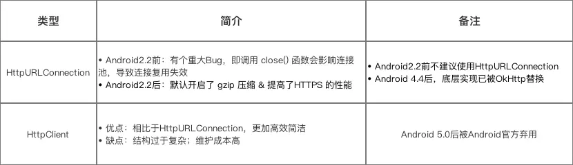

# 前言

- 网络请求在 `Android` 开发中非常常见，为了降低开发周期和难度，我们经常会选用网络请求的开源库
- 而现在网络请求的开源库越来越多，我们应该选用哪种呢？

目录


# 1. 为什么要用网络请求开源库？

网络请求开源库是一个将 **网络请求的相关功能**封装好的类库

- 没有网络请求框架之前
   App想与服务器进行网络请求交互是一件很痛苦的事：因为Android的主线程不能进行网络请求，需另开1个线程请求、考虑到线程池,缓存等一堆问题

- 使用网络请求库后
   实现网络请求的需求同时不需要考虑:

  - 异步请求
  - 线程池
  - 缓存

  同时还：

  - 降低开发难度
  - 缩短开发周期
  - 使用方便

# 2. 储备知识

### 2.1 Android实现网络请求的主流方法（SDK自带）

```
HttpClient`、`HttpURLConnection
```




#### 2.2 网络请求库 与 Android网络请求方法的关系

- 网络请求库的本质 = 封装了 **网络请求 + 异步 + 数据处理**功能的库
- 其中，网络请求功能则是采用`Android`网络请求的原生方法（`HttpClient`或`HttpURLConnection`）
- 具体如下图


# 3. 主流的网络请求库 简介

如今`Android`中主流的网络请求框架有：

- `Android-Async-Http`
- `Volley`
- `OkHttp`
- `Retrofit`

下面是简单介绍：


# 4. 网络请求库- 对比

一图让你了解全部的网络请求库和他们之间的区别！


# 5. 主流网络请求库的Github地址

- [Android-Async-Http](https://links.jianshu.com/go?to=https%3A%2F%2Fgithub.com%2Floopj%2Fandroid-async-http)
- [Volley](https://links.jianshu.com/go?to=https%3A%2F%2Fgithub.com%2Fstormzhang%2FAndroidVolley)
- [OkHttp](https://links.jianshu.com/go?to=https%3A%2F%2Fgithub.com%2Fsquare%2Fokhttp)
- [Retrofit](https://links.jianshu.com/go?to=https%3A%2F%2Fgithub.com%2Fsquare%2Fretrofit)

# 6. 总结

- 总的来说：**网络请求库没有最好，只有最合适**，只有真的了解其使用场景才能很好的选择网络请求库

# 参考

[Carson带你学Android：主流开源网络请求库对比(Volley、OkHttp、Retrofit)](https://www.jianshu.com/p/050c6db5af5a)