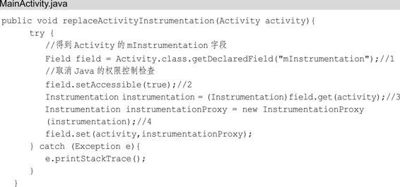
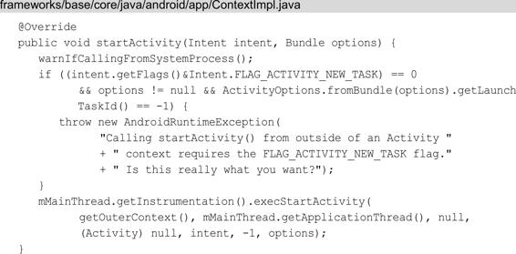

# Hook技术

关联章节：第4章四大组件的工作过程

本章主要的目的是为下一章讲插件化原理做铺垫，插件化涉及的技术非常多，比如应用程序启动流程、四大组件启动流程、AMS原理、ClassLoader原理、上下文Context等，这些技术在本书前面部分已经介绍过，还有很多技术由于书的篇幅原因没有介绍，比如包管理机制、Gradle、Binder机制等，除此之外还有一个技术是必须介绍的，这就是Hook技术，可见它在插件化技术中的重要性，Hook技术的知识点非常多，本章只涉及插件化相关的部分。

说到Hook技术得先提到逆向工程，逆向工程源于商业及军事领域中的硬件分析，其主要目的是在不能轻易获得必要的生产信息的情况下，直接从成品分析，推导出产品的设计原理。逆向分析分为静态分析和动态分析，其中静态分析指的是一种在不执行程序的情况下对程序行为进行分析的技术；动态分析是指在程序运行时对程序进行调试的技术。Hook技术就属于动态分析，它不仅在Android平台中被应用，早在Windows平台中就已经被应用了。

# 14.1Hook技术概述

我们知道Android系统的代码调用和回调都是按照一定顺序执行的，这里举一个简单的例子，如图14-1所示。

图14-1正常的调用和回调

对象A调用类对象，对象B处理后将数据回调给对象A，接着来看采用Hook的调用流程，如图14-2所示。

图14-2Hook的调用和回调

图14-2中的Hook可以是一个方法或者一个对象，它像一个钩子一样挂在对象A和对象B之间，当对象A调用对象B之前做一些处理（比如修改方法的参数和返回值），起到了“欺上瞒下”的作用，与其说Hook是钩子，不如说是劫持来的更贴切些。我们知道应用程序进程之间是彼此独立的，应用程序进程和系统进程之间也是如此，想要在应用程序进程更改系统进程的某些行为很难直接实现，有了Hook技术，我们就可以在进程间进行行为更改，如图14-3所示。

图14-3Hook

可以看到Hook可以将自己融入到它所要劫持的对象（对象B）所在的进程中，成为系统进程的一部分，这样我们就可以通过Hook来更改对象B的行为。被劫持的对象（对象B），称作Hook点，为了保证Hook的稳定性，Hook点一般选择容易找到并且不易变化的对象，静态变量和单例就符合这一条件。

# 14.2Hook技术分类

Hook技术知识点比较多，因此Hook技术根据不同的角度会有很多种分类，这里介绍其中的三种分类。根据Hook的API语言划分，分为HookJava和HookNative。

- HookJava主要通过反射和代理来实现，应用于在SDK开发环境中修改Java代码。

- HookNative则应用于在NDK开发环境和系统开发中修改Native代码。根据Hook的进程划分，分为应用程序进程Hook和全局Hook。

- 应用程序进程Hook只能Hook当前所在的应用程序进程。

- 应用程序进程是Zygote进程fock出来的，如果对Zygote进行Hook，就可以实现Hook系统所有的应用程序进程，这就是全局Hook。根据Hook的实现方式划分，分为如下两种。

- 通过反射和代理实现，只能Hook当前的应用程序进程。

- 通过Hook框架来实现，比如Xposed，可以实现全局Hook，但是需要root。

Hook Native、全局Hook和通过Hook框架实现这些分类和插件化技术关联不大，本章主要需要学习的是Hook Java，想要更好地学习Hook Java，首先要了解代理模式。

# 14.3代理模式

代理模式也叫委托模式，是结构型设计模式的一种。在现实生活中我们用到类似代理模式的场景有很多，比如代购、代理上网、打官司等。

定义：为其他对象提供一种代理以控制对这个对象的访问称为代理模式。代理模式结构图如图14-4所示。

在代理模式中有如下角色。

- Subject：抽象主题类，声明真实主题与代理的共同接口方法。

- RealSubject：真实主题类，定义了代理所表示的集体对象，客户端通过代理类间接调用真实主题类的方法。

- Proxy：代理类，持有对真实主题类的引用，在其所实现的接口方法中调用真实主题类中相应的接口方法执行。

- Client：客户端类。

图14-4代理模式结构图

## 14.3.1代理模式简单实现

假设我要买哈尔滨的红肠，但是工作忙也没时间回哈尔滨，就委托在哈尔滨的朋友帮我购买。

### 1.抽象主题类

抽象主题类具有真实主题类和代理的共同接口方法，我想要代购，那共同的方法就是购买：

### 2.真实主题类

这个购买者LiuWangShu也就是我，实现了IShop接口提供的buy（）方法，如下所示：

### 3.代理类

我找的朋友就是代理类，同样也需要实现IShop接口，并且要持有被代理者，在buy方法中调用了被代理者的buy方法：

### 4.客户端类

客户端类的代码就是代理类包含了真实主题类（被代理者），最终调用的都是真实主题类（被代理者）实现的方法，在上面的例子就是LiuWangShu类的buy方法，所以运行的结果就是“购买”。

## 14.3.2动态代理的简单实现

从编码的角度来说，代理模式分为静态代理和动态代理，14.2.1节的例子是静态代理，在代码运行前就已经存在了代理类的class编译文件，而动态代理则是在代码运行时通过反射来动态地生成代理类的对象，并确定到底来代理谁。也就是我们在编码阶段不需要知道代理谁，代理谁我们将在代码运行时决定。Java提供了动态的代理接口InvocationHandler，实现该接口需要重写invoke方法。下面我们在上面静态代理的例子上做修改，首先创建动态代理类，代码如下所示：

在动态代理类中我们声明一个Object的引用，该引用指向被代理类，我们调用被代理类的具体方法在invoke方法中执行。接下来我们修改客户端类代码：

调用Proxy.newProxyInstance（）来生成动态代理类，调用purchasing的buy方法会调用DynamicPurchasing的invoke方法。代理模式从编码的角度可以分为静态代理和动态代理。

# 14.4Hook startActivity方法

我们知道Hook可以用来劫持对象，被劫持的对象叫作Hook点，用代理对象来替代Hook点，这样我们就可以在代理上实现自己想做的操作。这里以Hook常用的startActivity方法来举例，startActivity方法分为两个，如下所示：

第一个是Actvity的startActivity方法，第二个是Context的startActivity方法，这两个方法的调用链是不同的，这里分开进行讲解。

## 14.4.1Hook Activity的startActivity方法

Activity的startActivity方法在4.1.1节中提到过，代码如下所示：

又调用了startActivity方法：

接着查看startActivityForResult方法，如下所示：

在注释1处调用了mInstrumentation的execStartActivity方法来启动Activity，剩余的调用代码已经在4.1节介绍了，这里不再赘述。这个mInstrumentation是Activity的成员变量，我们就选择Instrumentation为Hook点，用代理Instrumentation来替代原始的Instrumentation来完成Hook。首先我们先写出代理Instrumentation类，如下所示：

InstrumentationProxy继承了Instrumentation，并包含Instrumentation的引用。InstrumentationProxy实现了execStartActivity方法，其内部会通过反射找到并调用Instrumentation的execStartActivity方法。接下来我们用InstrumentationProxy来替换Instrumentation，代码如下所示：

在注释1处得到Activity的成员变量mInstrumentation，这个成员变量是私用的，因此在注释2处取消Java的权限控制检查，这样就可以访问mInstrumentation字段。在注释3处得到Activity中的Instrumentation对象，在注释4处创建InstrumentationProxy并传入注释3处得到的Instrumentation对象，最后用InstrumentationProxy来替换Instrumentation，这样就实现了代理Instrumentation替换Instrumentation的目的。最后在MainActivity的onCreate方法中使用replaceActivityInstrumentation方法，如下所示：

在onCreate方法中访问了我的独立博客，打印的Log如下：

## 14.4.2HookContext的startActivity方法

在第5章讲过，Context的实现类为ContextImpl，ContextImpl的startActivity方法如下所示：

最后一行调用了ActivityThread的getInstrumentation方法获取Instrumentation。ActivityThread是主线程的管理类，Instrumentation是ActivityThread的成员变量，一个进程中只有一个ActivityThread，因此仍旧选择Instrumentation作为Hook点，用代理Instrumentation来替换Instrumentation。代理Instrumentation和14.3.1节给出的InstrumentationProxy代码是一样的，接下来我们用InstrumentationProxy来替换Instrumentation，代码如下所示：

首先我们通过反射获取ActivityThread类，ActivityThread类中有一个静态变量sCurrentActivityThread，用于表示当前的ActivityThread对象，因此在注释1处获取ActivityThread中定义的sCurrentActivityThread字段，在注释2处获取Field类型的activityThreadField对象的值，这个值就是sCurrentActivityThread对象。同理获取当前ActivityThread的mInstrumentation对象。在注释3处创建InstrumentationProxy并传入此前得到的mInstrumentation对象，最后用InstrumentationProxy来替换mInstrumentation。在MainActivity中使用replaceContextInstrumentation方法，如下所示：

在onCreate方法中仍旧访问了我的独立博客，打印的Log为：

## 14.4.3HookstartActivity总结

HookContext的startActivity方法和HookActivity的startActivity方法最大的区别就是替换的Instrumentation不同，前者是ActivityThread中的Instrumentation，后者是Activity中的Instrumentation。另外有一点需要注意的是，这里举的例子都是在MainActivity的onCreate方法中进行Instrumentation替换的，这里未必是最佳的替换时间点，只是为了方便举例。可以尝试在Activity的attachBaseContext方法中进行Instrumentation替换，因为这个方法要先于Activity的onCreate方法被调用。讲到这里，我们知道了如何使用代理来HookstartActivity方法，简单说就是找到Hook点，再用代理对象来替换Hook点。

# 14.5本章小结

本章原本是下一章的内容，但是为了讲解得更清晰，所以就单拿出来作为一章。本章简单地介绍了Hook技术概述、Hook技术分类和HookstartActivity方法，这些内容主要是为了下一章讲解插件化做铺垫，因此并没有讲解Hook技术的全部内容，想要更多地了解Hook技术请查阅相关专业书籍。

# 参考

《Android进阶解密》