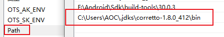
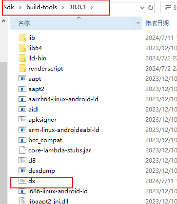
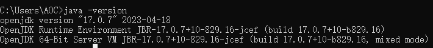
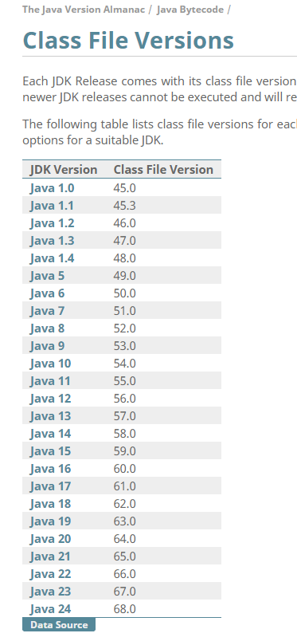

dx工具在热修复中会用到。


# 开始

## 配置环境

1、配置jdk

将 jdk 添加到环境变量-系统变量-path 中，这样系统就能访问到 jdk\bin 目录下的 java 程序了。




2、配置 dx

dx 程序在 sdk/build-tools/sdk版本 中。添加后就可以在 cmd 中使用 dx 程序了。




## dx 使用

将一个jar文件转换为dex文件：

```kotlin
dx --dex --output=SayHotFix.jar target.jar
```


# 问题记录

问题1：dx运行失败

jdk版本引起的问题。使用 **jdk-17.0.7** 时，报错如下：

```kotlin
C:\Users\AOC>dx
-Djava.ext.dirs=F:\Android\Sdk\build-tools\30.0.3\lib is not supported.  Use -classpath instead.
Error: Could not create the Java Virtual Machine.
Error: A fatal exception has occurred. Program will exit.
```

解决：编辑dx文件，在 dx 文件的最后一行，将 -Djava.ext.dirs 替换成 -classpath

```kotlin
call "%java_exe%" %javaOpts% -Djava.ext.dirs="%frameworkdir%" -jar "%jarpath%" %params%
// 上面是修改前，下面是修改后
call "%java_exe%" %javaOpts% -classpath="%frameworkdir%" -jar "%jarpath%" %params%
```

> 注意：如果是用的 jdk1.8，不需要改。


问题2：

```kotlin
C:\Users\AOC> dx --dex --output=SayHotFix.jar F:\00mine\mystudio\projects\myprojects\Demos-AndroidCoreLibs\core_apis\TestHotFix\build\libs\TestHotFix.jar

PARSE ERROR:
unsupported class file version 61.0
...while parsing com/lizw/core_apis/android/hotfix/ISay.class
1 error; aborting
```

原因：这个错误表明正在尝试运行一个使用Java版本61.0（即Java 17）编译的类文件，但是你的运行环境不支持这个版本。

分析：奇怪的是，我用的 jdk 是 17.0.7，按理说应该不会出现这个问题才对。



推测：应该是跟Kotlin有关，我这两个文件是用 Kotlin 写的。


# 拓展

查看版本对应情况https://javaalmanac.io/bytecode/versions/

