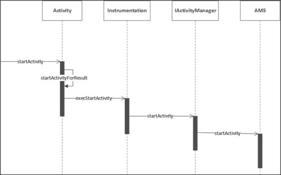
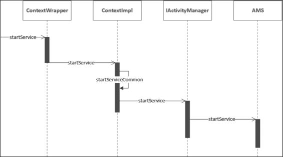
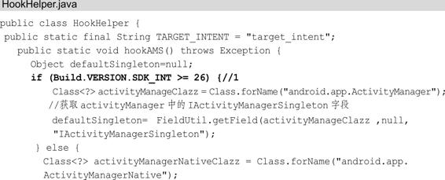
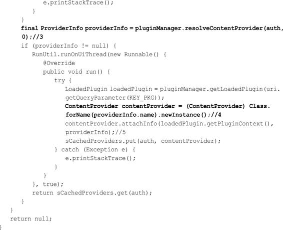
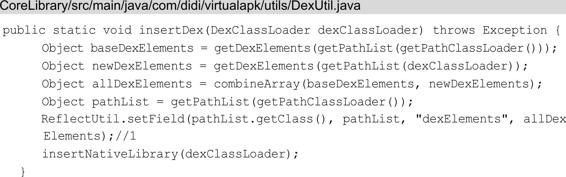

# 插件化原理

关联章节：第2章Android系统启动；第4章四大组件的工作过程；第6章理解ActivityManagerService；第9章JNI原理；第12章理解ClassLoader；第13章热修复原理；第14章Hook技术

随着应用开发的规模和复杂度越来越高，插件化技术被广泛地应用在各个较大规模的应用开发中。插件化技术和热修复技术都属于动态加载技术，从普及率的角度来看，插件化技术没有热修复的普及率高，主要原因是占大多数的中小型应用很少也没有必要去采用插件化技术。虽然插件化技术普及率现在不算高，但是插件化的原理对于应用开发的技术提升有很大的帮助，可以使你更好地理解系统的源码，并将系统源码和应用开发相结合。插件化是一个很庞大的知识体系，用一章的内容只能介绍部分的插件化原理，本章更多的是起一个抛砖引玉的作用。在本书截稿之前，AndroidPpreview开始限制调用隐藏API，很快也出现了一些绕过限制的方案，但无论采用什么方案，插件化的基本原理还是需要去了解的。阅读本章前请先阅读开头列出的关联章节，以达到最好的阅读理解效果。

# 15.1动态加载技术

在讲到插件化原理之前，需要先了解它的前身：动态加载技术。动态加载技术不只应用在Android开发领域，在很多开发领域都应用过，这里我们讨论的只是动态加载技术在Android开发领域的应用。在Android传统开发中，一旦应用的代码被打包成APK并被上传到各个渠道市场，我们就不能修改应用的源码了，只能通过服务器来控制应用中预留的分支代码。但是很多时候我们无法提前预知需求和突然发生的情况，也就不能提前在应用代码中预留分支代码，这时就需要采用动态加载技术。在应用程序运行时，动态加载一些程序中原本不存在的可执行文件并运行这些文件里的代码逻辑。可执行文件总的来说分为两种，一种是动态链接库so，另一种是dex相关文件（dex以及包含dex的jar/apk文件）。看到这里很多读者可能发现了，在第13章我们讲解热修复原理时也提到了上述的可执行文件的加载，这是因为热修复技术本身就是动态加载技术派生出来的。随着应用开发技术和业务的逐步发展，动态加载技术派生出两个技术，分别是热修复技术和插件化技术，如图15-1所示。

图15-1动态加载技术的派生技术

其中热修复技术主要用来修复Bug，插件化技术则主要用于解决应用越来越庞大以及功能模块的解耦，围绕着两个技术出现了很多的热修复框架和插件化框架，在第13章我们了解了很多热修复框架，这一章我们将了解一些插件化框架。需要注意的是，动态加载技术本身并没有被官方认可，并且是一个非常规的技术，在国外这门技术关注度并不高，它的产生更多的是国内的业务需求和产品的驱动。

# 15.2插件化的产生

在讲解插件化原理之前，我们十分有必要了解插件化是如何产生的。

## 15.2.1应用开发的痛点和瓶颈

在Android开发早期很少用到动态加载技术，因为这个时候业务需求和应用开发的复杂度都不是很高，但随着互联网的极速发展，会出现以下几种情况。

1. 业务复杂，模块耦合

   随着业务越来越复杂也越来越多，导致应用程序体积越来越大，应用程序的工程和功能模块数量越来越多，一个应用可能是由几十、几百人协同开发的，很多工程和功能模块都是由一个小组进行开发维护的，如果功能模块间的耦合度比较高，修改一个功能模块会影响其他功能模块，势必会极大地增加沟通成本。

2. 应用间的接入

   一个应用不再是单独的应用，它可能需要接入其他的应用。拿手机淘宝来说，它的流量非常大，其他的淘宝应用或者业务比如：聚划算、淘宝书城、飞猪旅游、淘宝拍卖、淘宝外卖（口碑外卖）等都希望接入到淘宝客户端，这样既能获取到流量，同时也可以将用户引流到自己的应用中，如果使用常规的技术手段，会产生两个问题。

   - 比如淘宝外卖需要接入到淘宝客户端中，那么淘宝外卖团队可能需要维护两个版本，一个自身版本，另一个是淘宝客户端版本，这样维护成本和沟通成本会比较高。况且淘宝外卖不只是接入淘宝客户端，它还可以接入到其他应用中，比如支付宝应用，那么淘宝外卖团队维护的就不仅仅是两个版本了。

   - 比如淘宝客户端接入了很多其他的应用，势必会使应用的体积急剧变大，编译时间会变得非常长，一个Bug和功能就会由组内的开发协作变为了组和组之间甚至是部门间的开发协作，极大地增加了开发测试成本和沟通成本，新功能的添加牵扯得越多，版本发布的时间变得越不可控。

3. 65536限制，内存占用大

   在13.4.1节中我们知道了65536限制，随着应用的代码量不断增大，引入的库也越来越多，特别是应用需要接入其他应用，那么方法数很容易超过65536个。应用代码量的增加同时也导致了应用占用大量的内存。

## 15.2.2插件化思想

Android系统本身并没有提供太多的功能，内置的应用数量和整体功能也很有限，它像是一个为人类服务的机器人，只能满足人类基本的需求，如图15-2所示。

图15-2初始的Android系统可以看到初始的机器人只有照相、地图、浏览器、计算机等功能，这显然是有些乏味的，我们可以给这个机器人安装很多其他的应用，使它提供更多的功能，如图15-3所示。

图15-3安装应用后的Android系统我们给这个机器人安装了很多应用，这些应用不仅覆盖了人的衣食住行，还提供了娱乐功能，我们可以玩游戏、听音乐和购物等，机器人的功能也得到了极大提升，能够为人类提供更多的服务。这些安装的应用可以理解为插件，这些插件可以自由地进行插拔，比如我们需要玩游戏时可以安装“王者荣耀”，如果不好玩就把它卸载掉。这么说来其实Android、iOS、Mac等操作系统采用的都是这种思想，也就是插件化思想。

## 15.2.3插件化定义

15.2.1节所提出的问题就可以用插件化的思想来解决，如果没有采用插件化，那么手机淘宝客户端的框架可以缩略地理解为如图15-4所示的样子。

图15-4常规的缩略淘宝主客户端

图15-4中采用常规技术的淘宝客户端会分为两大部分，一个是自身的业务模块，比如商城购物、消息和搜索等，另一个是要外接的其他的应用业务，比如聚划算、飞猪旅行和淘宝外卖等。如果采用这种常规的技术方案，那么有会产生15.2.1节中提出的各种问题，为了解决这些问题，我们可以采用插件化思想来对淘宝主客户端框架进行改造，如图15-5所示。

图15-5采用插件化思想的淘宝主客户端插件化的客户端由宿主和插件两个部分组成，宿主就是指先被安装到手机中的APK，就是平常我们加载的普通APK。插件一般是指经过处理的APK、so和dex等文件，插件可以被宿主进行加载，有的插件也可以作为APK独立运行。可以看出采用插件化的淘宝客户端分为了两大部分，一部分是宿主部分，也就是淘宝主客户端，其内部包含了主界面模块；另一部分是插件部分，不仅包括了外接的其他应用业务，比如聚划算和飞猪旅行，同时也包括了淘宝自身的业务模块，比如消息和搜索。需要注意的是，这里的举例更多是为了便于理解，只是淘宝客户端演进过程中的一个非常缩略的框架，和真实的淘宝客户端有非常大的区别。讲到这里就可以引出插件化的定义：将一个应用按照插件的方式进行改造的过程就叫作插件化。采用了插件化的淘宝主客户端就避免了15.2.1节提出的各种问题，在协作方面，插件可以由一个人或者一个小组来进行开发，这样各个插件之间，以及插件和宿主之间的耦合度会降低。应用间的接入和维护也变得便捷，每个应用团队只需要负责自己的那一部分就可以了。应用以及主dex的体积也会相应变小，间接地避免了65536限制。第一次加载到内存的只有淘宝主客户端，当使用到其他插件时才会加载相应插件到内存，这样就减少了内存的占用。

# 15.3插件化框架对比

为了更方便地将应用插件化，出现了很多插件化框架。虽然插件化框架最近两年才受到广泛关注，但其实在2012年大众点评的屠毅敏就推出了AndroidDynamicLoader框架，这是最早的插件化框架。插件化技术发展到现在，已经产生了众多插件化框架，如表15-1所示。

表15-1插件化框架

目前主流的插件化方案对比如表15-2所示。

表15-2主流的插件化方案对比

续表如果加载的插件不需要和宿主有任何耦合，也无须和宿主进行通信，比如加载第三方App，那么推荐使用RePlugin，其他的情况推荐使用VirtualApk。由于VirtualApk在加载耦合插件方面是插件化框架的首选，具有普遍的适用性，本章会结合VirtualApk来讲解插件化的原理。首先编写简单的例子实现Activity、Service插件化，起一个知识储备和过度的作用，然后在广播、ContentProvider、资源和so的插件化中讲解VirtualApk是如何实现的，这样更有助于理解插件化的原理。

# 15.4Activity插件化

四大组件的插件化是插件化技术的核心知识点，而Activity插件化更是重中之重，Activity插件化主要有3种实现方式，分别是反射实现、接口实现和Hook技术实现。反射实现会对性能有所影响，主流的插件化框架没有采用此方式，关于接口实现可以阅读dynamic-loadapk的源码，这里不做介绍，目前Hook技术实现是主流，因此本章主要介绍Hook技术实现。

Hook技术实现主要有两种解决方案，一种是通过HookIActivityManager来实现，另一种是HookInstrumentation实现。在讲到这两个解决方案前，我们需要从整体上了解Activity的启动流程。

## 15.4.1Activity的启动过程回顾

Activity的启动过程主要分为两种，一种是根Activity的启动过程，另一种是普通Activity的启动过程。关于根Activity的启动过程在4.1节介绍过，这里简单回顾一下，如图15-6所示。

图15-6根Activity启动过程

首先Launcher进程向AMS请求创建根Activity，AMS会判断根Activity所需的应用程序进程是否存在并启动，如果不存在就会请求Zygote进程创建应用程序进程。应用程序进程启动后，AMS会请求应用程序进程创建并启动根Activity。普通Activity和根Activity的启动过程大同小异，但是没有这么复杂，因为不涉及应用程序进程的创建，与Launcher也没关系，如图15-7所示。

图15-7普通Activity启动过程图15-7抽象地给出了普通Activity的启动过程。在应用程序进程中的Activity向AMS请求创建普通Activity（步骤1），AMS会对这个Activity的生命周期和栈进行管理，校验Activity等，关于栈管理请查看6.5节。如果Activity满足AMS的校验，AMS就会请求应用程序进程中的ActivityThread去创建并启动普通Activity（步骤2）。

## 15.4.2 Hook IActivityManager方案实现

AMS存在于SystemServer进程中，我们无法直接修改，只能在应用程序进程中做文章。可以采用预先占坑的方式来解决没有在AndroidManifest.xml中显式声明的问题，具体做法就是在图15-7所示的步骤1之前使用一个在AndroidManifest.xml中注册的Activity来进行占坑，用来通过AMS的校验。接着在步骤2之后用插件Activity替换占坑的Activity，接下来根据这个解决方案我们来实践一下。

### 15.4.2.1注册Activity进行占坑

为了更好地讲解启动插件Activity的原理，这里省略了插件Activity的加载逻辑，直接创建一个TargetActivity来代表已经加载进来的插件Activity，接着我们再创建一个SubActivity用来占坑。在AndroidManifest.xml中注册SubActivity，如下所示：

TargetActivity用来代表已经加载进来的插件Activity，因此不需要在AndroidManifest.xml中进行注册。如果我们直接在MainActivity中启动TargetActivity肯定会报错（android.content.ActivityNotFoundException异常）。

### 15.4.2.2使用占坑Activity通过AMS验证

为了防止报错，需要将启动的TargetActivity替换为SubActivity，用SubActivity来通过AMS的验证。在第6章中讲过Android8.0与Android7.0的AMS家族有一些差别，主要是Android8.0去掉了AMS的代理ActivityManagerProxy，代替它的是IActivityManager，直接采用AIDL来进行进程间通信。Android7.0的Activity的启动会调用ActivityManagerNative的getDefault方法，如下所示：

getDefault方法返回了IActivityManager类型的对象，IActivityManager借助了Singleton类来实现单例，而且gDefault又是静态的，因此IActivityManager是一个比较好的Hook点。Android8.0的Activity的启动会调用ActivityManager的getService方法，如下所示：

同样地，getService方法返回了IActivityManager类型的对象，并且IActivityManager借助了Singleton类来实现单例，再结合图6-1和6-3，确定了无论是Android7.0还是Android8.0，IActivityManager都是比较好的Hook点。Singleton类如下所示，后面会用到：

由于Hook需要多次对字段进行反射操作，先写一个字段工具类FieldUtil：

其中setField方法不会马上用到，接着定义替换IActivityManager的代理类IActivityManagerProxy，如下所示：

Hook点IActivityManager是一个接口，建议采用动态代理。在注释1处拦截startActivity方法，接着获取参数args中第一个Intent对象，它原本要启动插件TargetActivity的Intent。在注释2、注释3处新建一个subIntent用来启动StubActivity，在注释4处将这个TargetActivity的Intent保存到subIntent中，便于以后还原TargetActivity。在注释5处用subIntent赋值给参数args，这样启动的目标就变为了StubActivity，用来通过AMS的校验。最后用代理类IActivityManagerProxy来替换IActivityManager，如下所示：

首先在注释1处对系统版本进行区分，最终获取的是Singleton＜IActivityManager＞类型的IActivityManagerSingleton或者gDefault字段。在注释2处获取Singleton类中的mInstance字段，从前面Singleton类的代码可以得知mInstance字段的类型为T，在注释3处得到IActivityManagerSingleton或者gDefault字段中的T的类型，T的类型为IActivityManager。最后动态创建代理类IActivityManagerProxy，用IActivityManagerProxy来替换IActivityManager。自定义一个Application，在其中调用HookHelper的hookAMS方法，如下所示：

在MainActivity中启动TargetActivity，如下所示：

点击Button时，启动的并不是TargetActivity而是SubActivity，同时Log中打印了“hook成功”，说明我们已经成功用SubActivity通过了AMS的校验。

### 15.4.2.3还原插件Activity

前面用占坑Activity通过了AMS的校验，但是我们要启动的是插件TargetActivity，还需要用插件TargetActivity来替换占坑的SubActivity，这一替换的时机就在图15-7所示的步骤2之后。在4.1.3节中讲到了ActivityThread启动Activity的过程，如图15-8所示。

图15-8ActivityThread启动Activity的过程

ActivityThread会通过H类将代码的逻辑切换到主线程中，H类是ActivityThread的内部类并继承自Handler，如下所示：

H类中重写的handleMessage方法会对LAUNCH_ACTIVITY类型的消息进行处理，最终会调用Activity的onCreate方法。那么在哪进行替换呢？接着来看Handler的dispatchMessage方法：

Handler的dispatchMessage用于处理消息，看到如果Handler的Callback类型的mCallback不为null，就会执行mCallback的handleMessage方法。因此，mCallback可以作为Hook点，我们可以用自定义的Callback来替换mCallback，自定义的Callback如下所示：

HCallback实现了Handler.Callback，并重写了handleMessage方法，当收到消息的类型为LAUNCH_ACTIVITY时，将启动SubActivity的Intent替换为启动TargetActivity的Intent。接着我们在HookHelper中定义一个hookHandler方法，如下所示：

ActivityThread类中有一个静态变量sCurrentActivityThread，用于表示当前的ActivityThread对象，因此在注释1处获取ActivityThread中定义的sCurrentActivityThread对象。注释2处获取ActivityThread类的mH字段，接着在注释3处获取当前ActivityThread对象中的mH对象，最后用HCallback来替换mH中的mCallback。在MyApplication的attachBaseContext方法中调用HookHelper的hookHandler方法，运行程序，当我们单击“启动插件”按钮时，发现启动的是插件TargetActivity。

### 15.4.2.4插件Activity的生命周期

插件TargetActivity确实启动了，但是它有生命周期吗？这里从源码角度来进行分析，Activity的finish方法可以触发Activity的生命周期变化，和Activity的启动过程类似，finish方法如下所示：

finish方法的调用链和Activity的启动过程是类似的，在注释1处调用AMS的finishActivity方法，接着是AMS通过ApplicationThread调用ActivityThread，ActivityThread向H类发送DESTROY_ACTIVITY类型的消息，H类接收到这个消息会执行handleDestroyActivity方法，handleDestroyActivity方法又调用了performDestroyActivity方法，如下所示：

在注释1处通过IBinder类型的token来获取ActivityClientRecord，ActivityClientRecord用于描述应用进程中的Activity。在注释2处调用Instrumentation的callActivityOnDestroy方法来调用Activity的OnDestroy方法，并传入了r.activity。前面的例子我们用SubActivity替换了TargetActivity通过了AMS的校验，这样AMS只知道SubActivity的存在，那么AMS是如何能控制TargetActivity生命周期的回调的呢？我们接着往下看，启动Activity时会调用ActivityThread的performLaunchActivity方法，如下所示：

在注释1处根据Activity的类名用ClassLoader加载Acitivty，接着调用Activity的attach方法，将r.token赋值给Activity的成员变量mToken。在注释2处将ActivityClientRecord根据r.token保存在mActivities中（mActivities类型为ArrayMap＜IBinder，ActivityClientRecord＞），再结合Activity的finish方法的注释1处，可以得出结论：AMS和ActivityThread之间的通信采用了token来对Activity进行标识，并且此后的Activity的生命周期处理也是根据token来对Activity进行标识的。回到这个例子来，我们在Activity启动时用插件TargetActivity替换占坑SubActivity，这一过程在performLaunchActivity方法调用之前，因此注释2处的r.token指向的是TargetActivity，在performDestroyActivity的注释1处获取的就是代表TargetActivity的ActivityClientRecord，可见TargetActivity是具有生命周期的。

## 15.4.3HookInstrumentation方案实现

HookInstrumentation实现要比HookIActivityManager实现简单一些，示例代码会和HookIActivityManager实现有重复，重复的部分这里不再赘述。HookInstrumentation实现同样也需要用到占坑Activity，与HookIActivityManager实现不同的是，用占坑Activity替换插件Activity以及还原插件Activity的地方不同。Acitivty的startActivity方法调用时序图如图15-9所示。

从图15-9可以发现，在Activity通过AMS校验前，会调用Activity的startActivityForResult方法：

图15-9Acitivty的startActivity方法调用时序图在startActivityForResult方法中调用了Instrumentation的execStartActivity方法来激活Activity的生命周期。

图15-8中会调用ActivityThread的performLaunchActivity方法，如下所示：

在注释1处调用了mInstrumentation的newActivity方法，其内部会用类加载器来创建Activity的实例。看到这里我们可以得到方案，就是在Instrumentation的execStartActivity方法中用占坑SubActivity来通过AMS的验证，在Instrumentation的newActivity方法中还原TargetActivity，这两部操作都和Instrumentation有关，因此我们可以用自定义的Instrumentation来替换掉mInstrumentation。首先我们自定义一个Instrumentation，在execStartActivity方法中将启动的TargetActivity替换为SubActivity，如下所示：

首先查找要启动的Activity是否已经在AndroidManifest.xml中注册了，如果没有注册就在注释1处将要启动的Activity（TargetActivity）的ClassName保存起来用于后面还原TargetActivity，接着在注释2处替换要启动的Activity为StubActivity，最后通过反射调用execStartActivity方法，这样就可以用StubActivity通过AMS的验证。在InstrumentationProxy的newActivity方法中还原TargetActivity，如下所示：

在newActivity方法中创建了此前保存的TargetActivity，完成了还原TargetActivity。编写hookInstrumentation方法，用InstrumentationProxy替换mInstrumentation：

在注释1处获取ContextImpl类的ActivityThread类型的mMainThread字段，在注释2处获取当前上下文环境的ActivityThread对象。在注释3处获取ActivityThread类中的mInstrumentation字段，最后用InstrumentationProxy来替换mInstrumentation。在MyApplication的attachBaseContext方法中调用HookHelper的hookInstrumentation方法，运行程序，当我们单击“启动插件”按钮时，发现启动的是插件TargetActivity。

## 15.4.4总结

这一节我们学习了启动插件Activity的原理，主要的方案就是先用一个在AndroidManifest.xml中注册的Activity来进行占坑，用来通过AMS的校验，接着在合适的时机用插件Activity替换占坑的Activity。为了更好地讲解启动插件Activity的原理，本节省略了插件Activity的加载逻辑，直接创建一个TargetActivity来代表已经加载进来的插件Activity。同时这一节使我们更好地理解了Activity的启动过程。

# 15.5Service插件化

Service插件化和Activity插件化的原理有些不同，我们先来回顾一下Service的启动过程。

## 15.5.1插件化方面Service与Activity的不同

在4.2节讲到了Service的启动过程，它和Activity的启动过程类似，但有些不同，ContextImpl到AMS的调用过程如图15-10所示。

图15-10ContextImpl到AMS的调用过程

在ContextImpl到AMS的调用过程中并没有交由Instrumentation来处理，在后续的ActivityThread启动Service过程中也是一样的，如图15-11所示。

图15-11ActivityThread启动Service

可见Service的启动和Instrumentation完全没有关联，因此Service插件化不能通过HookInstrumentation来实现。Service插件化可以用HookIActivityManager的方案来实现吗？带着这个疑问，我们需要了解在插件化方面Activity和Service有何不同，主要有以下3点：

- Activity是基于栈管理的，一个栈中的Activity的数量不会太多，因此插件化框架处理的插件Activity数量是有限的，可以声明有限的占坑Activity来实现。除去硬件和系统限制，插件化框架处理的插件Service的数量可以是近乎无限的，无法用有限的占坑Service来实现。

- 在Standard模式下多次启动同一个占坑Activity可以创建多个Activity实例，但是多次启动占坑Service并不会创建多个Service实例。
- 用户和界面的交互会影响到Activity的生命周期，因此插件Activity的生命周期需要交由系统来管理，HookIActivityManager方案中还原插件Activity就是为了这一点。Service的生命周期不受用户影响，可以由开发者管理生命周期，没有必要还原插件。

综合上面3点得出的结论就是，Service插件化不可以用HookIActivityManager方案来实现，我们需要找到一个新的方案。

## 15.5.2代理分发实现

Activity插件化的重点在于要保证它的生命周期，而Service插件化的重点是保证它的优先级，这就需要用一个真正的Service来实现，而不是像占坑Activity那样起一个占坑的作用。当启动插件Service时，就会先启动代理Service，当这个代理Service运行起来之后，在它的onStartCommand等方法里面进行分发，执行插件TargetService的onCreate等方法，这一方案就叫作代理分发。

### 15.5.2.1启动代理Service

Service插件化需要一个真正的Service来实现，我们先要在AndroidManifest.xml中注册代理ProxyService，如下所示：

这里我们只是注册了ProxyService，让它运行在当前应用程序进程中，你也可以定义android：process用于支持多进程。在MainActivity中启动插件Service，如下所示：

为了便于理解，这里省略了插件Service的加载逻辑，直接创建一个TargetService来代表已经加载进来的插件Service。TargetService的代码如下所示：

TargetService只是用来打印Log，确定自身的方法是否已经被调用。TargetService用来代表插件Service，不能够直接启动，需要先启动代理ProxyService，为了达到这一目的我们需要HookIActivityManager，具体的原理和步骤与15.4.2节讲得类似，定义替换IActivityManager的代理类IActivityManagerProxy，如下所示：

在注释1处拦截startService方法，接着获取参数args中第一个Intent对象，它原本要启动插件TargetActivity的Intent。在注释2、注释3处新建一个proxyIntent用来启动ProxyService，注释4处将这个ProxyService的Intent保存到proxyIntent中，便于此后进行分发。在注释5处将proxyIntent赋值给参数args，这样启动的目标就变为了ProxyService。定义了IActivityManagerProxy，我们就需要用IActivityManagerProxy来替换系统的IActivityManager，如下所示：

首先在注释1处对系统版本进行区分，最终获取的是Singleton＜IActivityManager＞类型的IActivityManagerSingleton或者gDefault字段。在注释2处获取Singleton类中的mInstance字段，从15.4.2.2节中给出的Singleton类代码可以得知mInstance字段的类型为T，在注释3处得到IActivityManagerSingleton或者gDefault字段中的T的类型，T的类型为IActivityManager。最后动态创建代理类IActivityManagerProxy，用IActivityManagerProxy来替换IActivityManager。其中用到了FieldUtil类，这个类的定义在14.5.1.2节中已经讲过。自定义一个Application调用HookHelper的hookAMS方法，如下所示：

运行应用单击MainActivity的按钮时，启动的不是插件TargetService，而是代理ProxyService，接下来我们需要在ProxyService中进行代理分发。

### 15.5.2.2代理分发

编写ProxyService类，如下所示：

在onStartCommand方法中进行代理分发，这段代码比较长，主要做了3件事：

- ProxyService需要长时间对Service进行分发处理，所以在参数条件不满足、出现异常和代码执行完毕时需要返回START_STICKY，这样ProxyService会重新被创建并执行onStartCommand方法。

- 创建targetService并反射调用targetService的attach方法。

- 进行代理分发，执行targetService的onCreate方法。

这三件事中第二件事的代码比较多，简单来分析一下。为了反射调用Service的attach方法，除了要反射得到attach方法外，还需要得到attach方法需要的参数：ActivityThread、IBinder、IActivityManager等。在注释1处得到ActivityThread对象，在注释2处根据ActivityThread得到applicationThread对象，得到applicationThread对象为的是在注释3处反射调用ApplicationThread的asBinder方法得到token对象，在源码中这个token是IBinder类型的。在注释4处到注释5处之间的代码逻辑在本章多次出现，我们应该非常熟悉了，是为了获取iActivityManager。在注释6处反射得到targetService，这里只是为了方便举例，用targetService代表已经加载进来的插件Service，真正的插件化框架会用ClassLoader来加载插件中的Service。在注释7处反射执行targetService的attach方法，并传入此前得到的参数。最后执行targetService的onCreate方法来完成代理分发。运行应用单击MainActivity的按钮时，不仅启动了ProxyService，插件TargetService也被启动了。

# 15.6ContentProvider插件化

与Activity、BroadcastReceiver的频繁使用相比，ContentProvider使用的频率并不高，因此有些插件化框架并不支持ContentProvider插件化。在讲到ContentProvider插件化之前仍旧要简单回顾一下ContentProvider的启动过程。

## 15.6.1ContentProvider的启动过程回顾

ContentProvider主要用于进程内和进程间的数据共享，它同样需要经过AMS来进行处理，query方法到AMS的调用过程如图15-12所示。

图15-12query方法到AMS的调用过程

从图15-12可以看出ContentProvider的query方法会调用ActivityThread的acquireProvider方法，如下所示：

在注释1处的acquireProvider方法中会查询mProviderMap是否有目标IContentProvider存在，有则返回，没有就会调用注释2处的IActivityManager的getContentProvider方法，最终会调用AMS的getContentProvider方法获取ContentProviderHolder（里面包含IContentProvider类型数据）。IContentProvider是一个Binder对象，用于进程间通信，ContentProvider的共享处理会委托给IContentProvider来处理。AMS启动ContentProvider的过程与Activity和Service类似，都是通过ActvityThread向H发送消息的，将代码逻辑运行在主线程中，最终调用ContentProvider的onCreate方法。具体的内容请查看4.5节，这里不再赘述。

## 15.6.2VirtualApk的实现

ContentProvider插件化的关键在于将ContentProvider插件共享给整个系统。和Service插件化类似，需要注册一个真正的ContentProvider作为代理ContentProvider，并把这个代理ContentProvider共享给整个系统，对于插件ContentProvider的请求会全部交由代理ContentProvider处理并分发给对应的插件ContentProvider。对于ContentProvider插件化的原理，这里不再像分析Activity和Service插件化那样去写一个小例子来实现，而是换一种形式，分析滴滴VirtualApk的ContentProvider插件化是如何实现的。相信有了前面的原理积累，你会发现再去分析第三方框架会轻松许多。

### 15.6.2.1VirtualApk初始化

要想更好地理解VirtualApk对于ContentProvider插件化的实现，需要先大概了解VirtualApk是如何初始化的。VirtualApk给出了使用示例代码，在MainActivity的onCreate方法中调用了如下代码：

MainActivity的loadPlugin方法如下所示：

在注释1处用于初始化插件化系统，在注释2处用于加载插件。PluginManager的getInstance方法如下所示：

PluginManager的getInstance方法采用的是单例双重检查式（DCL)，在注释3处获取宿主的上下文Context，值为this.mContext，它在注释1和注释3处被赋值。注释4处用于HookInstrumentation和H，接着根据不同的系统版本HookIActivityManager，这些Hook原理在15.4节中都讲过。接着回头查看MainActivity的loadPlugin方法，在注释2处调用了pluginManager的loadPlugin方法：

在注释1处调用了LoadedPlugin的create方法来创建LoadedPlugin对象，在注释2处创建插件的Application。LoadedPlugin的构造方法如下所示：

LoadedPlugin的构造方法代码比较多，主要用来创建一些类型的对象，比如PackageInfo、Resources、ClassLoader等，还有创建存储四大组件相关的数据结构，比如Map等。需要主意的是，注释1处会创建插件的上下文PluginContext。关于VirtualApk初始化就讲到这里，我们接着回到ContentProvider插件化这一话题。

### 15.6.2.2启动代理ContentProvider

在MainActivity的onButtonClick方法中会测试ContentProvider，如下所示：

在Activity启动前VirtualApk就通过HookInstrumentation的形式，在VAInstrumentation的callActivityOnCreate方法中用PluginContext替换了ContextWrapper的成员变量mBase，mBase是Context类型的，不了解mBase的请查看第5章。注释1处的getContentResolver实际调用的是PluginContext的getContentResolver方法：

在getContentResolver方法中只创建了PluginContentResolver并传入了宿主的Context，因此当我们调用getContentResolver的query方法时，实际上是调用了PluginContentResolver的query方法。根据图15-12所示可知，query方法会调用ContentResolver的acquireUnstableProvider方法，PluginContentResolver复写了acquireUnstableProvider方法：

在注释1处会查找插件中是否有匹配的ContentProvider，如果没有就调用系统ContentResolver的acquireUnstableProvider方法，有的话会调用PluginManager的getIContentProvider方法，如下所示：

hookIContentProviderAsNeeded方法如下所示：

从方法名就可以看出，这个方法是用来HookIContentProvider的。在注释1处获得代理ContentResolver的Uri。在注释2处调用ContentResolver的call方法，mContext是宿主的Context，因此这里调用的是宿主ContentResolver的call方法，用于得到IContentProvider。在注释3处获取ActivityThread的mProviderMap，接下来遍历mProviderMap，找到匹配的IContentProvider，在注释5处用代理IContentProviderProxy替换IContentProvider，完成HookIContentProvider。IContentProviderProxy的wrapperUri方法实现了替换Uri的操作，如下所示：

在注释1处获取插件的Uri并封装成StringBuilder，接下来对StringBuilder进行拼接，在注释2处得到一个新的Uri，在注释3处替换Uri，这样我们启动一个插件ContentProvider时会先启动代理ContentProvider。

### 15.6.2.3代理分发

代理ContentProvider已经在AndroidManifest.xml中注册了，如下所示：

当我们调用ContentProvider的query方法时，实际会调用RemoteContentProvider的query方法：

在注释1处会通过RemoteContentProvider的getContentProvider方法得到一个ContentProvider，并调用它的query方法，RemoteContentProvider的getContentProvider方法如下所示：

传入的参数是插件uri并解析为auth，在注释1处会从缓存中读取是否有匹配auth的插件ContentProvider，没有的话就会在注释2处加载插件APK，并从已加载的APK中得到匹配auth的ProviderInfo，根据这个ProviderInfo就可以在注释4处创建插件ContentProvider。在注释5处调用插件ContentProvider的attachInfo方法，其内部会为插件ContentProvider配置参数并调用它的onCreate方法，这样插件ContentProvider就启动了。最后将这个新创建的插件ContentProvider加入缓存中，避免重复创建插件ContentProvider。

# 15.7BroadcastReceiver的插件化

BroadcastReceiver的注册分为两种，分别是静态注册和动态注册，在4.4节介绍了BroadcastReceiver的动态注册，动态注册通过AMS来完成，动态注册的信息会存在AMS中。静态注册需要在AndroidManifest.xml中注册，应用在安装时，PackageManagerService（PMS）会调用PackageParser的parsePackage方法来解析APK，通过解析APK中的AndroidManifest.xml文件的标签得到APK中的各种信息并封装成相应的信息类，比如ApplicationInfo、ProviderInfo和ActivityInfo等，因此动态注册的信息会存在PMS中。

## 15.7.1广播插件化思路

静态注册的BroadcastReceiver会在AndroidManifest.xml中设置＜intent-filter＞标签，BroadcastReceiver根据这个标签中的值来接收“感兴趣”的广播。如果采用类似Activity插件化的HookIActivityManager方案，用一个占坑BroadcastReceiver来接收广播是不可行的，因为我们无法预料插件中静态注册的BroadcastReceiver的＜intent-filter＞标签，这样占坑BroadcastReceiver无法接收到“感兴趣”的广播。静态注册的BroadcastReceiver的＜intentfilter＞标签无法动态设置，但是动态注册的BroadcastReceiver是可以动态设置IntentFilter的，讲到这里我们得到了一个新思路，那就是将静态注册的BroadcastReceiver全部转换为动态注册来处理，虽然静态和动态的BroadcastReceiver的生命周期不同，但是为了实现插件化，这个缺点显然不是关键问题。

## 15.7.2VirtualApk的实现

在LoadedPlugin的构造方法中实现静态注册的BroadcastReceiver转换为动态注册，如下所示：

注释1处的receivers用于存储插件中静态注册的BroadcastReceiver信息，有的读者可能会有疑问，为什么receivers的泛型类型会是ActivityInfo，这是因为PackageParser在解析AndroidManifest.xml时把＜receiver＞标签当作＜activity＞标签处理了，因此解析得到的BroadcastReceiver信息会存储在ActivityInfo中。在注释2处将插件BroadcastReceiver信息存储在receivers中。注释3处的代码有点长，它分为两个步骤，步骤1根据插件BroadcastReceiver的类名，用ClassLoader加载并创建对象（类型为Object）；步骤2是将Object转换为BroadcastReceiver类型。在注释4处调用宿主Context的registerReceiver方法来完成插件BroadcastReceiver的注册。

# 15.8资源的插件化

在上一章讲解热修复原理时讲解了资源修复，资源修复与AssetManager是有关的，同样地，资源的插件化也是如此。我们先来看系统的资源是如何加载的。

## 15.8.1系统资源加载

启动Activity时会调用performLaunchActivity方法，其内部会调用LoadedApk的makeApplication方法：

在注释1处创建Application，ContextImpl的createAppContext方法用于创建应用的Context：

在注释1处调用LoadedApk的getResources方法得到Resources，并将Resources赋值给ContextImpl。LoadedApk的getResources方法如下所示：

getResources方法会调用ResourcesManager的getResources方法，其内部会返回getOrCreateResources方法：

在注释1处创建ResourcesImpl，它用于具体实现Resources，在Resources创建后，会调用Resources的setImpl方法将ResourcesImpl设置进去。在注释2处创建Resources。createResourcesImpl方法如下所示：

在注释1处创建AssetManager，在注释2处新建ResourcesImpl对象，并将AssetManager作为参数传进去，这是因为Resources会依赖AssetManager来加载资源。

## 15.8.2VirtualApk实现

资源的插件化方案主要有两种：一种是合并资源方案，将插件的资源全部添加到宿主的Resources中，这种方案插件可以访问宿主的资源。另一种是构建插件资源方案，每个插件都构造出独立的Resources，这种方案插件不可以访问宿主资源。VirtualApk采用了以上两种方案，具体的代码逻辑在LoadedPlugin中，如下所示：

createResources方法用于创建Resources，如果是合并资源方案，会调用ResourcesManager的createResources方法，其内部会先得到包含宿主资源的AssetManager，再通过反射调用AssetManager的addAssetPath来添加插件资源，返回新的Resources，在注释1处通过Hook的方式用新的Resources替换此前的Resources。如果是构建插件资源方案，会在注释2处先创建AssetManager，再创建Resources并将AssetManager作为参数传进去。createAssetManager方法如下所示：

首先动态创建AssetManager，再反射调用AssetManager的addAssetPath方法来加载插件，这个AssetManager只包含了插件的资源，因此createResources方法的注释3处新创建的Resources是插件的资源。VirtualApk实现就讲到这里，关于系统版本和手机型号适配的问题这里没有提到，想了解的读者请自行阅读VirtualApk的源码。

# 15.9so的插件化

so的插件化可以结合第13章讲到的so热修复来学习，so热修复主要有两种方案：

- 将so补丁插入到NativeLibraryElement数组的前部，让so补丁的路径先被返回和加载。

- 调用System的load方法来接管so的加载入口。

so的插件化的方案和so热修复第一种方案类似，简单来说就是将so插件插入到NativeLibraryElement数组中，并且将存储so插件的文件添加到nativeLibraryDirectories集合中就可以了。我们来查看VirtualApk实现，在LoadedPlugin的构造方法中会调用createClassLoader方法：

在注释1处创建用于加载插件的DexClassLoader，并作为参数传入DexUtil的insertDex方法中：

insertDex方法会将宿主和插件的DexElements合并得到allDexElements，并通过反射用allDexElements替换dexElements。关于注释1处的用法和14.5.2.3节讲到的FieldUtil.setField方法类似。so的插件化的核心代码在insertNativeLibrary方法中，如下所示：

注释1处用于避免重复插入so。在注释2处获取的basePathList指的是宿主的PathList。接下来对不同的Android版本会有不同的处理，这里只讨论Android版本大于5.1的情况。在注释3处得到宿主存储so文件的List集合nativeLibraryDirectories，紧接着在注释4处将插件存储so文件添加到nativeLibraryDirectories中。在注释5和注释6处分别获取宿主的NativeLibraryElement（baseNativeLibraryPathElements）和插件的NativeLibraryElement（newNativeLibraryPathElements）。在注释7处得到插件的newNativeLibraryPathElements的类型，并创建这个类型的数组allNativeLibraryPathElements，在注释8处将baseNativeLibraryPathElements复制到allNativeLibraryPathElements中。遍历newNativeLibraryPathElements，将so添加到allNativeLibraryPathElements中。最后通过反射用allNativeLibraryPathElements替换nativeLibraryPathElements，这样就完成了so的插件化。

# 15.10小结

本章介绍了插件化的产生、插件化框架对比、四大组件的插件化、资源和so的插件化等。插件化是一个很庞大的知识体系，用一章的内容只能介绍了部分的插件化原理，比如插件的加载机制就没有讲到，插件的加载机制方案主要有两种，一种是HookClassLoader，另一种是委托给系统的ClassLoader帮忙加载，无论是哪一种方案，原理都离不开第12章讲解的内容。另外本章介绍的插件化原理是建立在主流框架之上的，如果想要掌握全部的插件化原理，请阅读表15-1中列出的全部插件化框架源码。

# 参考

《Android进阶解密》