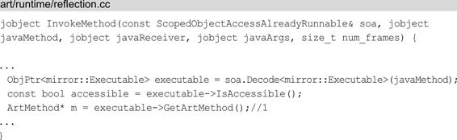
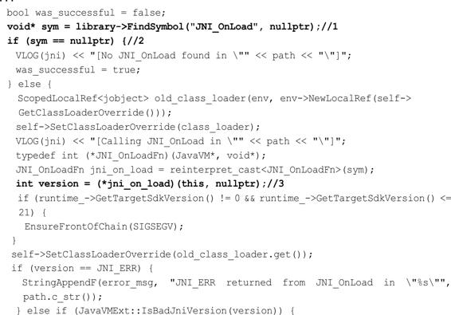

# 热修复原理

关联章节：第9章JNI原理；第12章理解ClassLoader

在Android应用开发中，热修复技术被越来越多的开发者所使用，也出现了很多热修复框架，比如AndFix、Tinker、Dexposed和Nuwa等。如果只是会这些热修复框架的使用那意义并不大，我们还需要了解它们的原理，这样不管热修复框架如何变化，只要基本原理不变，我们就可以很快地掌握它们。这一章不会对某些热修复框架源码进行解析，而是讲解热修复框架的通用原理。另外本章和第12章的内容联系紧密，阅读本章前最好先阅读第12章的内容。

# 13.1热修复的产生

在开发过程中我们有可能遇到如下的情况。

- 刚发布的版本出现了严重的Bug，这就需要去解决Bug、测试并打包在各个应用市场上重新发布，这会耗费大量的人力和物力，代价会比较大。

- 已经改正了此前发布版本的Bug，如果下一个版本是一个大版本，那么两个版本的间隔时间会很长，这样要等到下个大版本发布再修复Bug，此前版本的Bug会长期地影响用户。

- 版本升级率不高，并且需要很长时间来完成版本覆盖，此前版本的Bug就会一直影响不升级版本的用户。

- 有一个小而重要的功能，需要短时间内完成版本覆盖，比如节日活动。

为了解决上面的问题，热修复框架就产生了。对于Bug的处理，开发人员不要过于依赖热修复框架，在开发的过程中还是要按照标准的流程做好自测，配合测试人员完成测试流程。

# 13.2热修复框架的种类和对比

热修复框架的种类繁多，按照公司团队划分主要有如表13-1所示的几种。

表13-1按照公司团队划分热修复框架

虽然热修复框架很多，但热修复框架的核心技术主要有三类，分别是代码修复、资源修复和动态链接库修复，其中每个核心技术又有很多不同的技术方案，每个技术方案又有不同的实现，另外这些热修复框架仍在不断地更新迭代中，可见热修复框架的技术实现是繁多可变的。作为开发者需要了解这些技术方案的基本原理，这样就可以以不变应万变。

部分热修复框架的对比如表13-2所示。

表13-2部分热修复框架的对比我们可以根据表13-2和具体业务来选择合适的热修复框架，当然表13-2所示的信息很难做到完全准确，因为部分的热修复框架还在不断更新迭代。

从表13-2中也可以发现Tinker和Amigo拥有的特性最多，是不是就选它们呢？也不尽然，拥有的特性多也意味着框架的代码量庞大，我们需要根据业务来选择最合适的，假设我们只是要用到方法替换，那么使用Tinker和Amigo显然是大材小用了。另外如果项目需要即时生效，那么使用Tinker和Amigo是无法满足需求的。对于即时生效，AndFix、Robust和Aceso都满足这一点，这是因为AndFix的代码修复采用了底层替换方案，而Robust和Aceso的代码修复借鉴了InstantRun原理，这些原理后文会进行介绍。我们先来学习资源修复。

# 13.3资源修复

很多热修复的框架的资源修复参考了InstantRun的资源修复的原理，因此我们首先要了解InstantRun是什么。

## 13.3.1InstantRun概述

InstantRun是AndroidStudio2.0以后新增的一个运行机制，能够显著减少开发人员第二次及以后的构建和部署时间。在没有使用InstantRun前，我们编译部署应用程序的流程如图13-1所示。

图13-1传统编译部署从图13-1可以看出，传统的编译部署需要重新安装App和重启App，这显然会很耗时，InstantRun会避免这一情况，如图13-2所示。

图13-2InstantRun编译部署

从图13-2可以看出InstantRun的构建和部署都是基于更改的部分的。InstantRun部署有三种方式，InstantRun会根据代码的情况来决定采用哪种部署方式，无论哪种方式都不需要重新安装App，这一点就已经提高了不少的效率。

- Hotswap：从名称也可以看出HotSwap是效率最高的部署方式，代码的增量改变不需要重启App，甚至不需要重启当前的Activity。修改一个现有方法中的代码时会采用HotSwap。

- WarmSwap：App不需重启，但是Activity需要重启。修改或删除一个现有的资源文件时会采用WarmSwap。

- ColdSwap：App需要重启，但是不需要重新安装。采用ColdSwap的情况很多，比如添加、删除或修改一个字段和方法、添加一个类等。

## 13.3.2InstantRun的资源修复

既然很多热修复的框架资源修复参考了InstantRun的资源修复原理，那么我们了解InstantRun的资源修复原理就可以了。InstantRun并不是Android的源码，需要通过反编译获取，可以参考相关书籍。

InstantRun资源修复的核心逻辑在MonkeyPatcher的monkeyPatchExistingResources方法中，如下所示：

在注释1处创建一个新的AssetManager，在注释2和注释3处通过反射调用addAssetPath方法加载外部（SD卡）的资源。在注释4处遍历Activity列表，得到每个Activity的Resources，在注释5处通过反射得到Resources的AssetManager类型的mAssets字段，并在注释6处改写mAssets字段的引用为新的AssetManager。采用同样的方式，在注释7处将Resources.Theme的mAssets字段的引用替换为新创建的AssetManager。紧接着根据SDK版本的不同，用不同的方式得到Resources的弱引用集合，再遍历这个弱引用集合，将弱引用集合中的Resources的mAssets字段引用都替换成新创建的AssetManager。

可以看出InstantRun中的资源热修复可以简单地总结为两个步骤：

（1）创建新的AssetManager，通过反射调用addAssetPath方法加载外部的资源，这样新创建的AssetManager就含有了外部资源。

（2）将AssetManager类型的mAssets字段的引用全部替换为新创建的AssetManager。

# 13.4代码修复

代码修复主要有3个方案，分别是底层替换方案、类加载方案和InstantRun方案。

## 13.4.1类加载方案

类加载方案基于Dex分包方案，什么是Dex分包方案呢？这个得先从65536限制和LinearAlloc限制说起。

### 1.65536限制

随着应用功能越来越复杂，代码量不断地增大，引入的库也越来越多，可能会在编译时提示如下异常：

这说明应用中引用的方法数超过了最大数65536个。产生这一问题的原因就是系统的65536限制，65536限制的主要原因是DVMBytecode的限制，DVM指令集的方法调用指令invoke-kind索引为16bits，最多能引用65535个方法。

### 2.LinearAlloc限制

在安装应用时可能会提示INSTALL_FAILED_DEXOPT，产生的原因就是LinearAlloc限制，DVM中的LinearAlloc是一个固定的缓存区，当方法数超出了缓存区的大小时会报错。

为了解决65536限制和LinearAlloc限制，从而产生了Dex分包方案。Dex分包方案主要做的是在打包时将应用代码分成多个Dex，将应用启动时必须用到的类和这些类的直接引用类放到主Dex中，其他代码放到次Dex中。当应用启动时先加载主Dex，等到应用启动后再动态地加载次Dex，从而缓解了主Dex的65536限制和LinearAlloc限制。

Dex分包方案主要有两种，分别是Google官方方案、Dex自动拆包和动态加载方案。因为Dex分包方案不是本章的重点，这里就不再过多的介绍，我们接着来学习类加载方案。在12.2.3节中学习了ClassLoader的加载过程，其中一个环节就是调用DexPathList的findClass的方法，如下所示：

Element内部封装了DexFile，DexFile用于加载dex文件，因此每：Element内部封装了DexFile，DexFile用于加载dex文件，因此每个dex文件对应一个Element。多个Element组成了有序的Element数组dexElements。当要查找类时，会在注释1处遍历Element数组dexElements（相当于遍历dex文件数组），注释2处调用Element的findClass方法，其方法内部会调用DexFile的loadClassBinaryName方法查找类。如果在Element中（dex文件）找到了该类就返回，如果没有找到就接着在下一个Element中进行查找。根据上面的查找流程，我们将有Bug的类Key.class进行修改，再将Key.class打包成包含dex的补丁包Patch.jar，放在Element数组dexElements的第一个元素，这样会首先找到Patch.dex中的Key.class去替换之前存在Bug的Key.class，排在数组后面的dex文件中存在Bug的Key.class根据ClassLoader的双亲委托模式就不会被加载，这就是类加载方案，如图13-3所示。

图13-3类加载方案

类加载方案需要重启App后让ClassLoader重新加载新的类，为什么需要重启呢？这是因为类是无法被卸载的，要想重新加载新的类就需要重启App，因此采用类加载方案的热修复框架是不能即时生效的。虽然很多热修复框架采用了类加载方案，但具体的实现细节和步骤还是有一些区别的，比如QQ空间的超级补丁和Nuwa是按照上面说的将补丁包放在Element数组的第一个元素得到优先加载。微信Tinker将新旧APK做了diff，得到patch.dex，再将patch.dex与手机中APK的classes.dex做合并，生成新的classes.dex，然后在运行时通过反射将classes.dex放在Element数组的第一个元素。饿了么的Amigo则是将补丁包中每个dex对应的Element取出来，之后组成新的Element数组，在运行时通过反射用新的Element数组替换掉现有的Element数组。

采用类加载方案的主要是以腾讯系为主，包括微信的Tinker、QQ空间的超级补丁、手机QQ的QFix、饿了么的Amigo和Nuwa等。

## 13.4.2底层替换方案

与类加载方案不同的是，底层替换方案不会再次加载新类，而是直接在Native层修改原有类，由于在原有类进行修改限制会比较多，且不能增减原有类的方法和字段，如果我们增加了方法数，那么方法索引数也会增加，这样访问方法时会无法通过索引找到正确的方法，同样的字段也是类似的情况。底层替换方案和反射的原理有些关联，就拿方法替换来说，方法反射我们可以调用java.lang.Class.getDeclaredMethod，假设我们要反射Key的show方法，会调用如下所示的代码：

Android8.0的invoke方法，如下所示：

invoke方法是一个native方法，对于Jni层的代码为：

在Method_invoke函数中又调用了InvokeMethod函数：

注释1处获取传入的javaMethod（Key的show方法）在ART虚拟机中对应的一个ArtMethod指针，ArtMethod结构体中包含了Java方法的所有信息，包括执行入口、访问权限、所属类和代码执行地址等，ArtMethod结构如下所示：

在ArtMethod结构中比较重要的字段是注释1处的dex_cache_resolved_methods和注释2处的entry_point_from_quick_compiled_code，它们是方法的执行入口，当我们调用某一个方法时（比如Key的show方法），就会取得show方法的执行入口，通过执行入口就可以跳过去执行show方法。替换ArtMethod结构体中的字段或者替换整个ArtMethod结构体，这就是底层替换方案。AndFix采用的是替换ArtMethod结构体中的字段，这样会有兼容问题，因为厂商可能会修改ArtMethod结构体，导致方法替换失败。Sophix采用的是替换整个ArtMethod结构体，这样不会存在兼容问题。底层替换方案直接替换了方法，可以立即生效不需要重启。采用底层替换方案主要是阿里系为主，包括AndFix、Dexposed、阿里百川、Sophix。

## 13.4.3InstantRun方案

除了资源修复，代码修复同样也可以借鉴InstantRun的原理，可以说InstantRun的出现推动了热修复框架的发展。InstantRun在第一次构建APK时，使用ASM在每一个方法中注入了类似如下的代码：

其中注释1处是一个成员变量localIncrementalChange，它的值为$change，$change实现了IncrementalChange这个抽象接口。当我们点击InstantRun时，如果方法没有变化则$change为null，就调用return，不做任何处理。如果方法有变化，就生成替换类，这里我们假设MainActivity的onCreate方法做了修改，就会生成替换类MainActivity$override，这个类实现了IncrementalChange接口，同时也会生成一个AppPatchesLoaderImpl类，这个类的getPatchedClasses方法会返回被修改的类的列表（里面包含了MainActivity），根据列表会将MainActivity的$change设置为MainActivity$override，因此满足了注释2的条件，会执行MainActivity$override的access$dispatch方法，在access$dispatch方法中会根据参数"onCreate.（Landroid/os/Bundle；）V"执行`MainActivity$override`的onCreate方法，从而实现了onCreate方法的修改。借鉴InstantRun的原理的热修复框架有Robust和Aceso。

## 什么是ASM？

ASM是一个Java字节码操控框架，它能够动态生成类或者增强现有类的功能。ASM可以直接产生clsss文件，也可以在类被加载到虚拟机之前动态改变类的行为。

# 13.5动态链接库的修复

Android平台的动态链接库主要指的是so库，为了更好地理解，本章动态链接库简称为so。热修复框架的so的修复的主要是更新so，换句话说就是重新加载so，因此so的修复的基础原理就是加载so。

## 13.5.1System的load和loadLibarary方法

加载so主要用到了System类的load和loadLibarary方法，如下所示：

System的load方法传入的参数是so在磁盘的完整路径，用于加载指定路径的so。System的loadLibrary方法传入的参数是so的名称，用于加载App安装后自动从apk包中复制到/data/data/packagename/lib下的so。目前so的修复都是基于这两个方法，这里分别对这两个方法进行讲解。

### 1.System的load方法

注释1处的Runtime.getRuntime（）会得到当前Java应用程序的运行环境Runtime，Runtime的load0方法如下所示：

在注释1处调用了doLoad方法，并将加载该类的类加载器作为参数传入进去：

doLoad方法会调用native方法nativeLoad，关于nativeLoad方法后面会讲到。

### 2.System的loadLibrary方法

我们接着来查看System的loadLibrary方法，其中会调用Runtime的loadLibrary0方法：

loadLibrary0方法分为两个部分，一个是传入的ClassLoader不为null的部分，另一个是ClassLoader为null的部分，我们先来看ClassLoader为null的部分。在注释3处遍历getLibPaths方法，这个方法会返回java.library.path选项配置的路径数组。在注释4处拼接出so路径并传入注释5处调用的doLoad方法中。当ClassLoader不为null时，在注释2处同样调用了doLoad方法，其中第一个参数是通过注释1处的ClassLoader的findLibrary方法来得到的，findLibrary方法在ClassLoader的实现类BaseDexClassLoader中实现。

在findLibrary方法中调用了DexPathList的findLibrary方法：

这和13.3.1节讲到的DexPathList的findClass方法类似，在NativeLibraryElement数组中的每一个NativeLibraryElement对应一个so库，在注释1处调用NativeLibraryElement的findNativeLibrary方法就可以返回so的路径。上面的代码结合13.3.1节的类加载方案，就可以得到so的修复的一种方案，就是将so补丁插入到NativeLibraryElement数组的前部，让so补丁的路径先被返回，并调用Runtime的doLoad方法进行加载，在doLoad方法中会调用native方法nativeLoad。看来System的load方法和loadLibrary方法在JavaFrameWork层最终调用的都是nativeLoad方法。我们接着来分析nativeLoad方法。

## 13.5.2nativeLoad方法分析

nativeLoad方法对应的JNI层函数如下所示：

在Runtime_nativeLoad函数中调用了JVM_NativeLoad函数：

在注释1处获取当前运行时的JavaVMExt类型指针，JavaVMExt用于代表一个虚拟机实例，紧接着调用JavaVMExt的LoadNativeLibrary函数来加载so。LoadNativeLibrary函数代码有些多，这里分为3个部分来讲解。

### 1.LoadNativeLibrary函数part1

在注释1处根据so的名称从libraries_中获取对应的SharedLibrary类型指针library，如果满足注释2处的条件就说明此前加载过该so。在注释3处如果此前加载用的ClassLoader和当前传入的ClassLoader不相同的话，就会返回false，在注释4处判断上次加载so的结果，如果有异常也会返回false，中断so加载。如果满足了注释

2、注释3、注释4处的条件就会返回true，不再重复加载so。

### 2.LoadNativeLibrary函数part2

在注释1处根据so的路径path_str来打开该so，并返回得到so句柄，在注释2处如果获取so句柄失败就会返回false，中断so加载。在注释3处新创建SharedLibrary，并将so句柄作为参数传入进去。在注释4处获取传入path对应的library，如果library为空指针，就将新创建的SharedLibrary赋值给library，并将library存储到libraries_中。

### 3.LoadNativeLibrary函数part3

在注释1处查找JNI_OnLoad函数的指针并赋值给空指针sym，在9.2.3节中我们知道JNI_OnLoad函数用于native方法的动态注册。在注释2处如果没有找到JNI_OnLoad函数就将was_successful赋值为true，说明已经加载成功，没有找到JNI_OnLoad函数也算加载成功，这是因为并不是所有so都定义了JNI_OnLoad函数，因为native方法除了动态注册，还有静态注册。如果找到了JNI_OnLoad函数，就在注释3处执行JNI_OnLoad函数并将结果赋值给version，如果version为JNI_ERR或者BadJniVersion，说明没有执行成功，was_successful的值仍旧为默认的false，否则就将was_successful赋值为true，最终会返回该was_successful。

### 4.LoadNativeLibrary函数总结

LoadNativeLibrary函数的行数很多，这里来做一个总结，LoadNativeLibrary函数主要做了如下3方面工作。

（1）判断so是否被加载过，两次ClassLoader是否是同一个，避免so重复加载。

（2）打开so并得到so句柄，如果so句柄获取失败，就返回false。创建新的SharedLibrary，如果传入path对应的library为空指针，就将新创建的SharedLibrary赋值给library，并将library存储到libraries_中。

（3）查找JNI_OnLoad的函数指针，根据不同情况设置was_successful的值，最终返回该was_successful。这样总结可能有些抽象，LoadNativeLibrary函数的流程图如图13-4所示。

图13-4LoadNativeLibrary函数的流程图讲到这里总结一下so修复主要有两个方案：

（1）将so补丁插入到NativeLibraryElement数组的前部，让so补

丁的路径先被返回和加载。

（2）调用System的load方法来接管so的加载入口。

# 13.6本章小结

本章没有像《Android进阶之光》一样直接去介绍这些框架的源码，主要有两点原因：一个是热修复的框架太多了；另一个就是这些框架还在不断地更新迭代中。因此本章直接从热修复的原理角度入手，目前所有的热修复框架都是基于这些原理开发的，我们掌握这些原理就可以以不变应万变，一方面可以更好地理解热修复框架，应用于开发之中；另一方面对阅读热修复框架的源码起到了铺垫作用。

# 参考

《Android进阶解密》