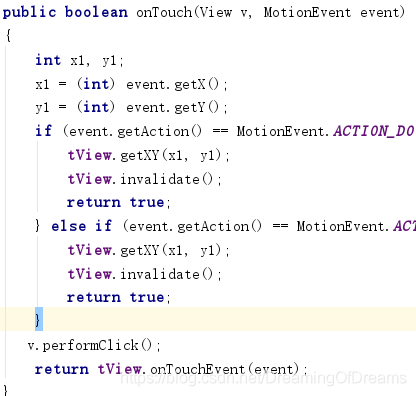
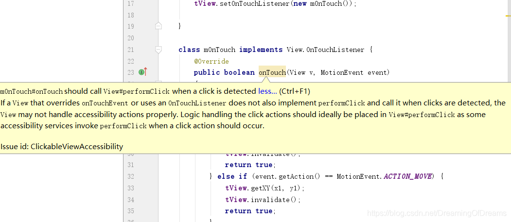

# 问题

Custom view `TextView` has setOnTouchListener called on it but does not override performClick

## 一、问题的出现

当我对控件使用setOnTouchLister()时重写了onTouch()方法时就出现了这个警告

## 二、原因

- onTouchListener的onTouch方法优先级比onTouchEvent高，会先触发
- 假如onTouch方法返回false会接着触发onTouchEvent，反之onTouchEvent方法不会被调用
- 内置诸如click事件的实现等等都基于onTouchEvent，假如onTouch返回true，这些事件将不会被触发
- 顺序为: onTouch—–>onTouchEvent—>onClick

## 三、解决办法

为了解决这个警告，我们应该在重写onTouch的时候，在合适的位置处调用一下View#performClick方法，如下示例：
iew既设置了setOnTouchListener()方法，又设置了setOnClickListener()方法的时候,记得在OnTouchListener的onTouch()方法里调用一下performClick()方法。
因为如果你重写了onTouch，并且返回值返回true的话，就有可能把performClick()方法给屏蔽了，这样这些点击操作就没办法完成了。

# 参考

