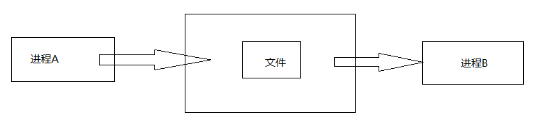

> 在阅读Android源码时，总是会见到Stub，IBinder等字样，如果不理解Binder机制，那在Android源码的世界便寸步难行。Binder机制作为系统底层原理的基石，必须掌握。但要学好Binder，最好先掌握IPC机制。本文就对IPC机制做一个小结，希望可以成为我深入理解Android的坚实一步。
>

### 一、Linux 和 Android 中的 IPC 机制

IPC全称 Inter-Process Communication，进程间通信，是指在两个进程之间进行数据交换的过程。在Android 和 Linux中都有各自的 IPC 机制。下面进行介绍。

#### 1.1 Linux中的Ipc机制

Linux中提供了很多进程间通信机制。主要有管道、信号、信号量、消失队列、共享内存和套接字等。

##### **管道**

管道是linux从unix继承过来的，是UNIX早期的一个重要通信机制。管道的主要思想是在内存中创建一个共享文件，从而使通信双方利用这个共享文件传递信息。它不属于文件系统，并且只存在于内存中。另外，管道采用半双工通信方式，数据只能在一个方向上流动。管道的简单模型如图所示。

##### **信号**

信号是软件层次上对中断机制的一种模拟，是一种异步通信方式。进程不必通过任何操作来等待信号的到达。信号可以在用户空间进程和内核之间直接交互。内核可以利用信号来通知用户空间的进程。发生了哪些系统事件。信号不适用于信息交换，比较适用于进程中断控制。

**信号量**

信号量是一个计数器。用来控制多个进程对共享资源的访问。信号量常作为一种锁机制。防止某进程正在访问共享资源时，其他进程也访问该资源。信号量主要作为进程间及同一进程不同线程之间的同步手段。

**消息队列**

消失队列是消息的链表，有特定的格式。消失队列存放在内存中由消息队列标识符进行标识。并且允许一个或多个进程向它写入与读取消息。使用消息队列会使信息复制两次。因此，对于频繁通信或者信息量大的通信，不宜使用消息队列。

**共享内存**

共享内存的多个进程可以直接读写一块内存空间，是针对其他通信机制运行效率较低而设置的。为了在多个进程间交换信息，内核专门留出了一块内存。可以由需要访问的进程将其映射到自己的私有地址空间。这样进程就可以直接读写这一块内存而不需要进行数据的复制，从而大幅度提高效率。

**套接字**

套接字是更基础进程间通信，与其他通信机制不同的是，套接字可用于不同机器之间的进程间通信。

#### 1.2 Android 中的 IPC 机制

Android系统基于linux内核，并且在它的基础上新增了一些 IPC 机制。包括序列化、Messenger、AIDL、Binder、Bundle、文件共享、ContentProvider等。下面一一介绍。

**序列化**

序列化指的是Serializable/Parcelable接口。Serializable是java提供的，是一个空接口，为对象提供标准的序列化和反序列化操作。Parcelable接口是Android中的序列化方式，更适合在Android平台使用，虽然Parcelable用起来比较麻烦，但效率很高。

**Messenger**

Messenger在Android应用开发中使用频率不高。它可以在不同进程中传递Message对象。在Message中加入要传递的数据就可以了。Messenger是一种轻量级的IPC，对AIDL进行了封装。

**AIDL**

AIDL全称Android Interface Definition Language，指Android接口定义语言。Messenger是以串行的方式处理客户端发来的消息。如果有大量的消失发送到服务端，那么服务端仍然逐个处理再响应客户端就不合适了。虽然Messenger可以用于进程间数据传递，但是却不能跨进程调用方法。这个时候就需要使用AIDL了。

**Bundle**

Bundle实现了Parcelable。把社保借口。因此它可以在不同的进程间传输。Activity，service，receiver都是在intent中通过binder来进行数据传递的。

**文件共享**

两个进程通过读写同一个文件来进行数据共享。共享的文件可以是文本、XML、json等。文件共享适用于对数据同步要求不高的进程间通信。

**ContentProvider**

ContentProvider为存储和获取数据提供统一的接口，它可以在不同的应用程序之间共享数据。ContentProvider本身就是适合进程间通信的。ContentProvider底层实现也是Binder，但是使用起来比AIDL要容易很多。系统中很多操作都采用了ContentProvider，例如通讯录，音视频等。这些操作本身就是跨进程进行通信的。

参考：

1、《Android进阶指北》