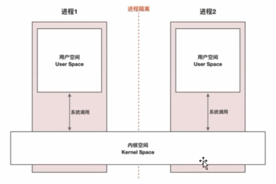
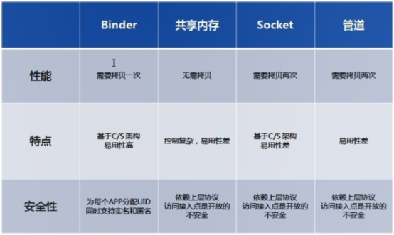
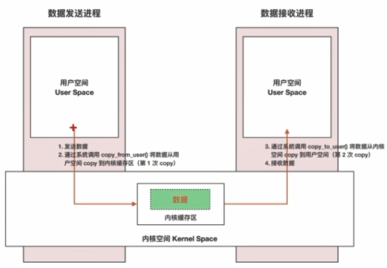
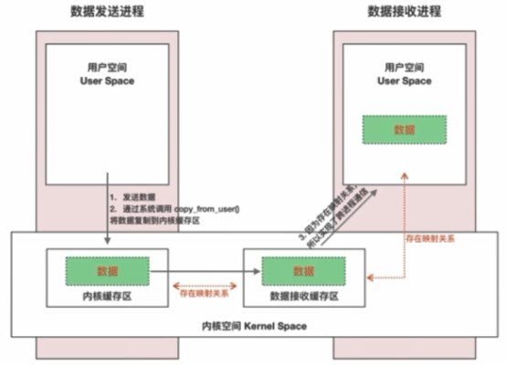
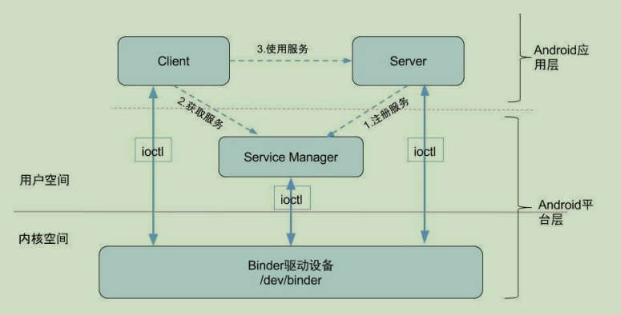
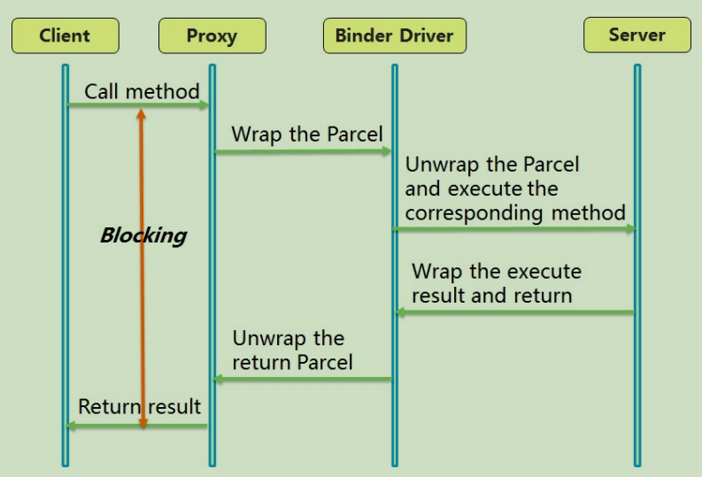

> version：2022/06/28
>
> review：


目录

[TOC]


# 关键词

Parcel。

# 一、前置知识

操作系统：进程间通信。Linux 进程的概念。

设计模式：代理模式。

Java基础：线程、线程池。


# 二、概述

## 1、 Binder是什么，有何作用？

Binder 是 Android 中用来实现进程间通信的一种机制。在整个 Android 系统中，Binder 被大量的使用。比如 Activity 的启动，系统服务的调用等，都用到了 Binder。

从Java层面来看，Binder 是实现了 IBinder 接口的一个类。通过 Binder，具体来说是通过aidl，应用可以很容易的实现跨进程通信，包括进程间对象的传递，方法的调用。

从Linux驱动层来看，它是/dev/binder目录下的一个binder驱动。

> TODO ：Linux角度，需要再学习。

## 2、为什么使用 Binder？

其实 Linux 中已经有了其他的一些 IPC 方式，比如管道、SystemV、Socket、共享内存、消息队列等。


2、 为什么要多进程？

在设备中，单个进程所分配的内存是有限的，根据机型不同，有36/48/64M等，当一个进程的内存不够使用时，就需要多个进程。

为了实现进程保活。

3、 什么时候需要用到进程间通信（使用场景）？

闹钟/打电话、WebView、图片加载库、推送、双进程守护

4、 进程间通信为什么要用到Binder机制？

不同进程之间存在进程隔离，不能直接通信。

内存划分：

 

比如有4G内存，用户空间分配3G，内核空间分配1G。用户空间之间是不能直接进行通信的，需要通过内核空间。（其实用户空间也不能对内核空间进行直接操作，必须通过“系统调用”进行通信，这样才能保证系统的安全性。）

5、 Android增加Binder的原因是什么？

Android特有IPC机制：Binder。

 

性能方面 

在移动设备上（性能受限制的设备，比如要省电），广泛地使用跨进程通信对通信 

机制的性能有严格的要求，Binder相对于传统的Socket方式，更加高效。**Binder**数 

据拷贝只需要一次，而管道、消息队列、**Socket**都需要**2**次，共享内存方式一次内 

存拷贝都不需要，但实现方式又比较复杂。 

安全方面 

传统的进程通信方式对于通信双方的身份并没有做出严格的验证，比如Socket通信 

的IP地址是客户端手动填入，很容易进行伪造。然而，Binder机制从协议本身就支 

持对通信双方做身份校检，从而大大提升了安全性。

传统IPC传输数据：

 

Binder传输数据：

原理：MMAP(memory map)内存映射。

 


# 二、Binder原理

Binder通信采用C/S架构，从组件视角来说，包含Client、Server、ServiceManager 以及 Binder驱动，其中ServiceManager用于管理系统中的各种服务。架构图如下所示：



**Binder**通信的四个角色 

**Client**进程：使用服务的进程。 

**Server**进程：提供服务的进程。 

**ServiceManager**进程：ServiceManager的作用是将字符形式的Binder名字转化成 

Client中对该Binder的引用，使得Client能够通过Binder名字获得对Server中Binder 

实体的引用。 

**Binder**驱动：驱动负责进程之间Binder通信的建立，Binder在进程之间的传递， 

Binder引用计数管理，数据包在进程之间的传递和交互等一系列底层支持。 


**Binder**运行机制 

图中Client/Server/ServiceManage之间的相互通信都是基于Binder机制。既然基于 

Binder机制通信，那么同样也是C/S架构，则图中的3大步骤都有相应的Client端与 

Server端。 

注册服务**(addService)**：Server进程要先注册Service到ServiceManager。该过 

程：Server是客户端，ServiceManager是服务端。 

获取服务**(getService)**：Client进程使用某个Service前，须先向ServiceManager中 

获取相应的Service。该过程：Client是客户端，ServiceManager是服务端。 

使用服务：Client根据得到的Service信息建立与Service所在的Server进程通信的通 

路，然后就可以直接与Service交互。该过程：Client是客户端，Server是服务端。

图中的Client，Server，Service Manager之间交互都是虚线表示，是由于它们彼此 

之间不是直接交互的，而是都通过与Binder驱动进行交互的，从而实现IPC通信 

（Interprocess Communication）方式。其中Binder驱动位于内核空间，Client， 

Server，Service Manager位于用户空间。Binder驱动和Service Manager可以看做 

是Android平台的基础架构，而Client和Server是Android的应用层，开发人员只需自 

定义实现Client、Server端，借助Android的基本平台架构便可以直接进行IPC通 

信。


**Binder**运行的实例解释 

首先我们看看我们的程序跨进程调用系统服务的简单示例，实现浮动窗口部分代 

码

```java
//获取WindowManager服务引用 WindowManager wm = (WindowManager) getSystemService(getApplicati on().WINDOW_SERVICE); 
//布局参数layoutParams相关设置略... 
View view = LayoutInflater.from(getApplication()).inflate(R.layo ut.float_layout, null); 
//添加view 
wm.addView(view, layoutParams);
```

注册服务**(addService)**： 

在Android开机启动过程中，Android会初始化系统的各种 Service，并将这些Service向ServiceManager注册（即让ServiceManager管理）。 这一步是系统完成的。 

获取服务**(getService)**： 

客户端想要得到具体的Service直接向ServiceManager要即可。客户端首先向ServiceManager查询得到具体的Service引用，通常是 Service 引用的代理对象，对数据进行一些处理操作。即第2行代码中，得到的wm是 WindowManager对象的引用。 

使用服务： 

通过这个引用向具体的服务端发送请求，服务端执行完成后就返回。即第6行调用WindowManager的addView函数，将触发远程调用，调用的是运行在 

systemServer进程中的WindowManager的addView函数。 

使用服务的具体执行过程



1. Client通过获得一个Server的代理接口，对Server进行调用。 

2. 代理接口中定义的方法与Server中定义的方法是一一对应的。 

3. Client调用某个代理接口中的方法时，代理接口的方法会将Client传递的参数打 包成Parcel对象。 

4. 代理接口将Parcel发送给内核中的Binder Driver。 

5. Server会读取Binder Driver中的请求数据，如果是发送给自己的，解包Parcel 对象，处理并将结果返回。 

6. 整个的调用过程是一个同步过程，在Server处理的时候，Client会Block住。因 此**Client**调用过程不应在主线程。 


三、其他知识点记录

一个进程只有一个主线程。

 

# 相关问题

<font color='orange'>Q：</font>


<font color='orange'>Q：</font>


<font color='orange'>Q：</font>


<font color='orange'>Q：</font>


<font color='orange'>Q：</font>


<font color='orange'>Q：</font>


<font color='orange'>Q：</font>


# 总结

1、

## 【精益求精】我还能做（补充）些什么？

1、


# 脑图


# 参考

