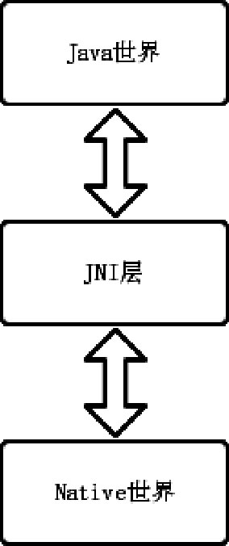

# 关键字

JNI、NDK、Native方法注册（静态注册、动态注册）、数据类型的转换、方法签名、JNIEnv、引用类型。


# JNI原理

> 基于 aosp Android10

JNI是JavaNativeInterface的缩写，译为Java本地接口，是Java与其他语言通信的桥梁。当出现一些用Java无法处理的任务时，开发人员就可以使用JNI技术来完成。一般来说主要有以下情况需要用到JNI技术。

- 需要调用Java语言不支持的依赖于操作系统平台特性的一些功能。例如：需要调用当前的UNIX系统的某个功能，而Java不支持这个功能，就需要用到JNI技术来实现。
- 为了整合一些以前的非Java语言开发的系统。例如：需要用到早期实现的C/C++语言开发的一些功能或系统，将这些功能整合到当前的系统或新的版本中。
- 为了节省程序的运行时间，必须采用其他语言（比如C/C++语言）来提升运行效率。例如：游戏、音视频开发涉及的音视频编解码和图像绘制需要更快的处理速度。

JNI不只是应用于Android开发，它有着非常广泛的应用场景。JNI在Android中的应用场景也十分广泛，主要有音视频开发、热修复和插件化、逆向开发、系统源码调用等。为了更方便地使用JNI技术，Android还提供了NDK这个工具集合，NDK开发是基于JNI的，它和JNI开发本质上并没有区别，理解了JNI原理，NDK开发也会很容易掌握。掌握JNI对理解系统源码有益，也可以为热修复和插件化的原理做知识储备，并且项目中也可能用到，比如我在项目中遇到的给网络接口参数加密。

本文从系统源码调用的角度对JNI原理进行分析。

# 系统源码中的JNI

Android系统按语言来划分的话由两个世界组成，分别是Java世界和Native世界。为什么要这么划分呢？Android系统由Java编写不好吗？除了性能的原因外，最主要的原因就是在Java诞生之前，就有很多程序和库都是由Native语言写的，因此，重复利用这些Native语言编写的库是十分必要的，况且Native语言编写的库具有更好的性能。这样就产生了一个问题，Java世界的代码要怎么使用Native世界的代码呢？这就需要一个桥梁来将它们连接在一起，而JNI就是这个桥梁，如图9-1所示。



通过JNI，Java代码可以访问Native代码，同样地，Native代码也可以访问Java代码。为了讲解JNI我们需要分析系统的源码，本文以MediaRecorder框架举例。

## MediaRecorder框架中的JNI

MediaRecorder用于录音和录像。下面介绍MediaRecorder框架中的JNI，如图所示。


如图所示，JavaFramework层对应的是MediaRecorder.java，也就是我们在应用开发中直接调用的类。JNI层对应的是libmedia_jni.so，可以看到这个动态库的名称含有“_jni”，这说明它是一个JNI的动态库。Native层对应的是libmedia.so，这个动态库完成了实际的调用的功能。下面分别介绍JavaFramework层和JNI层的MediaRecorder。

### Java Framework层的MediaRecorder

截取部分和JNI有关的 MediaRecorder.java 源码：

```kotlin
frameworks/base/media/java/android/media/MediaRecorder.java

public class MediaRecorder{
    static {
        System.loadLibrary("media_jni");//1
        native_init();//2
    }
    private static native final void native_init();//3
    
    public native void start() throws IllegalStateException;
}
```

1. 注释1：在静态代码块中调用 `System.loadLibrary("media_jni")`，用来加载名为media_jni的动态库，也就是libmedia_jni.so。

   > todo：为什么 media_jni 就对应库 libmedia_jni.so 了呢？是因为会自动加上 lib 前缀吗？

2. 注释2：调用 native_init 方法，其内部会调用Native方法，用来完成JNI的注册。

3. 注释3：native_init方法用native来修饰，说明它是一个native方法，表示由JNI来实现。MediaRecorder的start方法同样也是一个native方法。

对于Java Framework层来说只需要加载对应的JNI库，接着声明native方法就可以了，剩下的工作由JNI层来完成。

### JNI层的MediaRecorder

MediaRecorder的JNI层由`frameworks/base/media/jni/android_media_MediaRecorder.cpp`实现，native方法native_init和start的JNI层实现如下所示：

```kotlin
static void
android_media_MediaRecorder_native_init(JNIEnv *env)
{
    jclass clazz;
    clazz = env->FindClass("android/media/MediaRecorder");
    if (clazz == NULL) {
        return;
    }
...
    fields.post_event = env->GetStaticMethodID(clazz, "postEventFromNative",
                                               "(Ljava/lang/Object;IIILjava/lang/Object;)V");
    if (fields.post_event == NULL) {
        return;
    }    
}

static void
android_media_MediaRecorder_start(JNIEnv *env, jobject thiz)
{
    ALOGV("start");
    sp<MediaRecorder> mr = getMediaRecorder(env, thiz);
    if (mr == NULL) {
        jniThrowException(env, "java/lang/IllegalStateException", NULL);
        return;
    }
    process_media_recorder_call(env, mr->start(), "java/lang/RuntimeException", "start failed.");
}
```

- android_media_MediaRecorder_native_init() 方法是native_init方法在JNI层的实现
- android_media_MediaRecorder_start() 方法是start方法在JNI层的实现。

那么 `native_init方法 `是如何找到对应的android_media_MediaRecorder_native_init方法的呢？这就需要了解`JNI方法注册`的知识。

# Native方法注册

Native方法注册分为静态注册和动态注册，其中静态注册多用于NDK开发，而动态注册多用于Framework开发，下面分别对这两种注册方式进行讲解。

## 静态注册

在 AndroidStudio 中新建一个Java Library，命名为media，这里仿照系统的MediaRecorder.java，写一个简单的MediaRecorder.java，如下所示：

```kotlin
media/src/main/java/com/lizw/media/MediaRecorder.java

public class MediaRecorder{
    static {
        System.loadLibrary("media_jni");//1
        native_init();//2
    }
    private static native final void native_init();//3

    public native void start() throws IllegalStateException;
}
```

> 这里不要在乎上段代码在AS中会标红：“找不到native_init和start方法所对应JNI方法”，我们的主要目的是来查看Native方法是如何注册的，AS标红的问题并不是主要的。

**编译和生成JNI方法**

- 对 MediaRecorder.java 进行编译和生成JNI方法，**进入 Java 文件所在目录**（我的是media/src/main/java/com/lizw/media/） 中执行如下命令：

  ```kotlin
  // Java8
  javac ./MediaRecorder.java
  javah ./MediaRecorder
  
  // Java17，用的这个版本 jdk 时，没有javah命令了，使用： javac -h 输出路径 目标Java文件 替代
  // .表示当前目录下
  // 不要用 Java17了，新的 jdk 改了很多东西，很多命令都没有了，比如后面要用的 javap 也没有了，就使用 Java8 了
  javac -h . .\MediaRecorder.java
  ```

  > 注：用Java17 jdk 时，没有 javah 命令了，使用 **javac -h 输出路径 目标Java文件** 替代

  - java8 javah 使用注意事项

    

    1. 在 MediaRecorder.class 所在的目录执行 javah ./MediaRecorder 会报错

    2. 在其他目录，比如 main 中执行 javah main.com.lizw.media.MediaRecorder 也会报错

    3. 正确做法是：在 类 的全名称（包名+类名）的第一级目录下，我这里是java目录下，执行 javah com.lizw.media.MediaRecorder

       .class后缀也不需要。

       生成的 .h 文件也在 java/ 目录下。

       

  - 如果是Java17，则执行完命令后，会生成以下 .h .class 文件：

  

   `com_example_MediaRecorder.h` 文件内容：

  ```kotlin
  /* DO NOT EDIT THIS FILE - it is machine generated */
  #include <jni.h>
  /* Header for class com_lizw_media_MediaRecorder */
  
  #ifndef _Included_com_lizw_media_MediaRecorder
  #define _Included_com_lizw_media_MediaRecorder
  #ifdef __cplusplus
  extern "C" {
  #endif
  /*
   * Class:     com_lizw_media_MediaRecorder
   * Method:    native_init
   * Signature: ()V
   */
  JNIEXPORT void JNICALL Java_com_lizw_media_MediaRecorder_native_1init
    (JNIEnv *, jclass);
  
  /*
   * Class:     com_lizw_media_MediaRecorder
   * Method:    start
   * Signature: ()V
   */
  JNIEXPORT void JNICALL Java_com_lizw_media_MediaRecorder_start
    (JNIEnv *, jobject);
  
  #ifdef __cplusplus
  }
  #endif
  #endif
  ```

首先：记住我们的Java文件路径是：media/src/main/java/com/lizw/media/MediaRecorder.java。

Java 中的 `private static native final void native_init()` 方法被声明为了 `Java_com_lizw_media_MediaRecorder_native_1init` ：

- 以“Java”开头说明是在Java平台中调用JNI方法的
- Java_com_lizw_media_MediaRecorder_native_1init 是 `包名+类名+方法名` 的格式，原本在Java中应该是以“.”来进行分割，这里却用了`_下划线`，这是因为在Native语言中“.”有特殊的含义。
- 另外方法名还多了一个“1”，这是因为 Java 的 `native_init` 方法中包含了 `_下划线` ，转换成JNI方法后会变成 `_1` 。
- JNIEnv是Native中Java环境的代表，通过 `JNIEnv*` 指针就可以在Native中访问Java的代码进行操作，它只在创建它的线程中有效，不能跨线程传递。
- jclass是JNI的数据类型，对应Java的java.lang.Class实例。jobject也是JNI的数据类型，对应于Java的Object。

当在Java中调用native_init方法时，就会从JNI中寻找 `Java_com_lizw_media_MediaRecorder_native_1init` 函数，如果没有就会报错，如果找到就会为native_init 和 Java_com_lizw_media_MediaRecorder_native_1init 建立关联，其实是保存JNI的函数指针，这样再次调用native_init方法时直接使用这个函数指针就可以了。

静态注册就是根据方法名，将Java方法和JNI函数建立关联，但是它有一些缺点：

- JNI层的函数名称过长。
- 声明Native方法的类需要用 `javah 或 javac -h` 生成头文件。
- 初次调用Native方法时需要建立关联，影响效率。

所以，静态注册是Java的Native方法通过JNI来与方法指针（C/C++中的函数）进行关联，那如果Java的Native方法知道它在JNI中对应的函数指针，就可以避免上述的缺点，这就是动态注册。

## 动态注册

JNI中有一种结构用来记录Java的Native方法和JNI方法的关联关系，它就是JNINativeMethod，它在jni.h中被定义：

```kotlin
libnativehelper/include_jni/jni.h

typedef struct {
    const char* name;		// Java 方法的名字
    const char* signature;	// Java 方法的签名信息
    void*       fnPtr;		// JNI 中对应的方法指针
} JNINativeMethod;
```

系统的MediaRecorder采用的就是动态注册，我们来查看它的JNI层是怎么做的：

```kotlin
frameworks/base/media/jni/android_media_MediaRecorder.cpp

static const JNINativeMethod gMethods[] = {
...
    {"start",                "()V",                             (void *)android_media_MediaRecorder_start},
    {"stop",                 "()V",                             (void *)android_media_MediaRecorder_stop},
    {"pause",                "()V",                             (void *)android_media_MediaRecorder_pause},
    {"resume",               "()V",                             (void *)android_media_MediaRecorder_resume},
    {"native_reset",         "()V",                             (void *)android_media_MediaRecorder_native_reset},
    {"release",              "()V",                             (void *)android_media_MediaRecorder_release},
    {"native_init",          "()V",                             (void *)android_media_MediaRecorder_native_init},
...
};
```

上面定义了一个 JNINativeMethod 类型的 gMethods 数组，里面存储的就是 MediaRecorder 的Native方法与JNI层函数的对应关系。

以 `{"start",                "()V",                             (void *)android_media_MediaRecorder_start}` 为例：

- “start”是Java层的Native方法
- (void *)android_media_MediaRecorder_start 是 start() 方法对应的JNI层的函数。
- “()V” 是start方法的签名信息。关于Java方法的签名信息后面会介绍

只定义JNINativeMethod类型的数组是没有用的，还需要注册它，注册的函数为register_android_media_MediaRecorder，这个函数会在哪里调用呢？

```kotlin
frameworks/base/media/jni/android_media_MediaRecorder.cpp

// This function only registers the native methods, and is called from
// JNI_OnLoad in android_media_MediaPlayer.cpp
int register_android_media_MediaRecorder(JNIEnv *env)
{
    return AndroidRuntime::registerNativeMethods(env,
                "android/media/MediaRecorder", gMethods, NELEM(gMethods));
}
```

答案是在 register_android_media_MediaRecorder 函数的注释上：called from JNI_OnLoad in inandroid_media_MediaPlayer.cpp。这个JNI_OnLoad函数会在调用 System.loadLibrary 函数后调用，因为多媒体框架中的很多框架都要进行JNINativeMethod数组注册，因此，注册函数就被统一定义在android_media_MediaPlayer.cpp 的 JNI_OnLoad 函数中，如下所示：

```kotlin
frameworks/base/media/jni/android_media_MediaPlayer.cpp

jint JNI_OnLoad(JavaVM* vm, void* /* reserved */)
{
    JNIEnv* env = NULL;
    jint result = -1;

    if (vm->GetEnv((void**) &env, JNI_VERSION_1_4) != JNI_OK) {
        ALOGE("ERROR: GetEnv failed\n");
        goto bail;
    }
    assert(env != NULL);
...
    if (register_android_media_MediaPlayer(env) < 0) {	//1
        ALOGE("ERROR: MediaPlayer native registration failed\n");
        goto bail;
    }

    if (register_android_media_MediaRecorder(env) < 0) {	//2
        ALOGE("ERROR: MediaRecorder native registration failed\n");
        goto bail;
    }
...
    /* success -- return valid version number */
    result = JNI_VERSION_1_4;

bail:
    return result;
}
```

1. 在JNI_OnLoad函数中调用了整个多媒体框架的注册JNINativeMethod数组的函数
2. 注释1处调用了 MediaPlayer 框架的注册 JNINativeMethod 数组的函数 register_android_media_MediaPlayer。
3. 注释2处调用了 register_android_media_MediaRecorder 函数

下面分析下 register_android_media_MediaRecorder 函数：

```kotlin
frameworks/base/media/jni/android_media_MediaRecorder.cpp

int register_android_media_MediaRecorder(JNIEnv *env)
{
    return AndroidRuntime::registerNativeMethods(env,
                "android/media/MediaRecorder", gMethods, NELEM(gMethods));
}
```

在 `register_android_media_MediaRecorder` 方法中返回了 `AndroidRuntime` 的 `registerNativeMethods` 函数，如下所示：

```kotlin
frameworks/base/core/jni/AndroidRuntime.cpp

/*
 * Register native methods using JNI.
 */
/*static*/ int AndroidRuntime::registerNativeMethods(JNIEnv* env,
    const char* className, const JNINativeMethod* gMethods, int numMethods)
{
    return jniRegisterNativeMethods(env, className, gMethods, numMethods);
}
```

在 registerNativeMethods 函数中又返回了 jniRegisterNativeMethods 函数，它被定义在 JNI 帮助类 JNIHelp.cpp中：

```kotlin
libnativehelper/JNIHelp.cpp

MODULE_API int jniRegisterNativeMethods(C_JNIEnv* env, const char* className,
    const JNINativeMethod* gMethods, int numMethods)
{
    JNIEnv* e = reinterpret_cast<JNIEnv*>(env);
    scoped_local_ref<jclass> c(env, findClass(env, className));
    // 1
    int result = e->RegisterNatives(c.get(), gMethods, numMethods);
    return 0;
}
```

最终通过调用的 JNIEnv 的 RegisterNatives 函数来完成JNI的注册。可以看出动态注册要比静态注册复杂一些，但是一劳永逸。

# 数据类型的转换

JNI数据类型的转换的例子还以 MediaRecorder 举例，查看android_media_MediaRecorder.cpp的android_media_MediaRecorder_start函数：

```kotlin
frameworks/base/media/jni/android_media_MediaRecorder.cpp

static void
android_media_MediaRecorder_start(JNIEnv *env, jobject thiz)
{
    ALOGV("start");
    sp<MediaRecorder> mr = getMediaRecorder(env, thiz);
    if (mr == NULL) {
        jniThrowException(env, "java/lang/IllegalStateException", NULL);
        return;
    }
    process_media_recorder_call(env, mr->start(), "java/lang/RuntimeException", "start failed.");
}
```

android_media_MediaRecorder_start函数的第二个参数为jobject类型，它是JNI层的数据类型，**Java的数据类型到了JNI层就需要转换为JNI层的数据类型**。Java的数据类型分为基本数据类型和引用数据类型，JNI层对于这两种类型也做了区分，先来查看基本数据类型的转换。

## 基本数据类型的转换


基本数据类型转换，除了最后一行的void，其他的数据类型只需要在前面加上“j”就可以了。第三列的Signature代表签名格式，后面会介绍它。

接着来看引用数据类型的转换。

## 引用数据类型的转换


数组的JNI层数据类型需要以“Array”结尾，签名格式的开头都会有“[”。需要注意有些数据类型的签名以“；”结尾。

引用数据类型还具有继承关系，如下图所示。


可以看出jclass、jstring、jarray和jthrowable都继承jobject，而jobjectArray、jintArray和jlongArray等类型都继承jarray。

关于引用数据类型，这里接着列举MediaRecorder框架的Java方法，如下所示：

```java
frameworks/base/media/java/android/media/MediaRecorder.java

private native void _setOutputFile(FileDescriptor fd) throws IllegalStateException, IOException;
```

_setOutputFile方法对应的JNI层的方法为：

```cpp
frameworks/base/media/jni/android_media_MediaRecorder.cpp

static void
android_media_MediaRecorder_setOutputFileFD(JNIEnv *env, jobject thiz, jobject fileDescriptor)
{
...
}
```

可以看到，FileDescriptor类型转换为了jobject类型。

# 方法签名

通过方法签名和方法名可以找到对应的Java方法。


上面是数据类型的签名格式（Signature），方法签名就是由签名格式组成的，那么方法签名有什么作用呢？我们看下面的代码：

```kotlin
frameworks/base/media/jni/android_media_MediaRecorder.cpp

static const JNINativeMethod gMethods[] = {
...
    {"native_init",          "()V",                             (void *)android_media_MediaRecorder_native_init},
    {"native_setup",         "(Ljava/lang/Object;Ljava/lang/String;Ljava/lang/String;)V",
                                                                (void *)android_media_MediaRecorder_native_setup},
...
};
```

gMethods数组中存储的是MediaRecorder的Native方法与JNI层函数的对应关系。

 “`()V`” 和 “`(Ljava/lang/Object；Ljava/lang/String；Ljava/lang/String；)V`” 就是方法签名。

Java是有重载方法的，可以定义方法名相同，但参数不同的方法，正因为如此，在JNI中仅仅通过方法名是无法找到Java中对应的具体方法的，JNI为了解决这一问题就将参数类型和返回值类型组合在一起作为方法签名。通过方法签名和方法名就可以找到对应的Java方法。

JNI的方法签名的格式为：


以上面gMethods数组的native_setup函数举例，它在Java中是如下定义的：

```kotlin
    private native final void native_setup(Object mediarecorder_this,
            String clientName, String opPackageName) throws IllegalStateException;
```

它在JNI中的方法签名为：

```kotlin
(Ljava/lang/Object;Ljava/lang/String;Ljava/lang/String;)V
```

native_setup函数的第一个参数的签名为“Ljava/lang/Object；”，后两个参数的签名为“Ljava/lang/String；”，返回值类型void的签名为“V”，组合起来就是上面的方法签名。

如果我们每次编写JNI时都要组织方法签名，也会是一件比较头疼的事，而且也容易出错，幸好Java提供了javap命令来自动生成方法签名。我们先写一个简单的MediaRecorder.java包含上面的native_setup方法：

```kotlin
public class MediaRecorder{
    static {
        System.loadLibrary("media_jni");//1
        native_init();//2
    }
    private static native final void native_init();//3

    public native void start() throws IllegalStateException;

    private native final void native_setup(Object mediarecorder_this,
                                           String clientName, String opPackageName) throws IllegalStateException;
}
```

- 在Java文件目录下，接着执行如下命令：javac .\MediaRecorder.java

- 执行命令后会生成MediaRecorder.class文件，使用javap命令：

  ```kotlin
  javap -s -p .\MediaRecorder.class
  ```

  其中s表示输出内部类型签名，p表示打印出所有的方法和成员（默认打印public成员），最终在终端中的打印结果如图所示。

  

可以清晰地看到输出的native_setup方法的签名和此前给出的一致。

# 解析JNIEnv

JNIEnv是Native中Java环境的代表，通过JNIEnv*指针就可以在Native中访问Java的代码进行操作，它只在创建它的线程中有效，不能跨线程传递，因此不同线程的JNIEnv是彼此独立的，JNIEnv的主要作用有以下两点：

- 调用Java的方法。
- 操作Java（操作Java中的变量和对象等）。

先来看JNIEnv的定义，如下所示：

```
libnativehelper/include_jni/jni.h

//1 C++ 中 JNIEnv 的类型
#if defined(__cplusplus)
typedef _JNIEnv JNIEnv;
typedef _JavaVM JavaVM;
#else
//2 C 中 JNIEnv 的类型
typedef const struct JNINativeInterface* JNIEnv;
typedef const struct JNIInvokeInterface* JavaVM;
#endif
```

1. 这里使用预定义宏`__cplusplus` 来区分C和C++两种代码，如果定义了`__cplusplus`，就是C++代码中的定义，否则就是C代码中的定义。
2. 还有 JavaVM，它是虚拟机在JNI层的代表，在一个虚拟机进程中只有一个JavaVM，因此，该进程的所有线程都可以使用这个JavaVM。通过JavaVM的AttachCurrentThread函数可以获取这个线程的JNIEnv，这样就可以在不同的线程中调用Java方法了。还要记得在使用AttachCurrentThread函数的线程退出前，务必要调用DetachCurrentThread函数来释放资源。

注释2处可以看出在C中，JNIEnv类型是 JNINativeInterface*，注释1处可以看出在C++中JNIEnv的类型是JNIEnv，JNIEnv是如何定义的呢？如下所示：

```kotlin
libnativehelper/include_jni/jni.h

struct _JNIEnv {
    /* do not rename this; it does not seem to be entirely opaque */
    const struct JNINativeInterface* functions;

#if defined(__cplusplus)

    jclass FindClass(const char* name)
    { return functions->FindClass(this, name); }
    
    jmethodID GetMethodID(jclass clazz, const char* name, const char* sig)
    { return functions->GetMethodID(this, clazz, name, sig); }
    
    jfieldID GetFieldID(jclass clazz, const char* name, const char* sig)
    { return functions->GetFieldID(this, clazz, name, sig); }
    ...
};
```

`_JNIEnv`是一个结构体，其内部又包含了JNINativeInterface。在`_JNIEnv`中定义了很多函数，这里列举了3个比较常用的函数，FindClass用来找到Java中指定名称的类，GetMethodID用来得到Java中的方法，GetFieldID用来得到Java中的成员变量，这里可以发现这三个函数都调用了JNINativeInterface中定义的函数，因此可以得出结论，无论是C还是C++，JNIEnv的类型都和JNINativeInterface结构有关，JNINativeInterface的定义如下所示：

```kotlin
libnativehelper/include_jni/jni.h

struct JNINativeInterface {
...
    jclass      (*FindClass)(JNIEnv*, const char*);
    
    jmethodID   (*GetMethodID)(JNIEnv*, jclass, const char*, const char*);

    jfieldID    (*GetFieldID)(JNIEnv*, jclass, const char*, const char*);
...   
}
```

在JNINativeInterface结构中定义了很多和JNIEnv结构体对应的函数指针，这里只给出了上面JNIEnv结构体中对应的三个函数指针定义。通过这些函数指针的定义，就能够定位到虚拟机中的JNI函数表，从而实现了JNI层在虚拟机中的函数调用，这样JNI层就可以调用Java的方法了。

## jfieldID和jmethodID

在`_JNIEnv`结构体中定义了很多函数，这些函数都会有不同的返回值，如下所示：

```kotlin
libnativehelper/include_jni/jni.h

struct _JNIEnv {
    /* do not rename this; it does not seem to be entirely opaque */
    const struct JNINativeInterface* functions;

#if defined(__cplusplus)

    jmethodID GetMethodID(jclass clazz, const char* name, const char* sig)	//1
    { return functions->GetMethodID(this, clazz, name, sig); }
    
    jfieldID GetFieldID(jclass clazz, const char* name, const char* sig)
    { return functions->GetFieldID(this, clazz, name, sig); }
    ...
};
```

这里列举了两个函数，这两个函数的返回值分别为jmethodID和jfieldID，当然还有其他很多返回值，比如jobject、jbooleanArray和jboolean等，这里我们拿jmethodID和jfieldID来进行举例，来查看这些返回值在JNI层的应用。jfieldID和jmethodID分别用来代表Java类中的成员变量和方法。

在注释1处jclass代表Java类，name代表成员方法或者成员变量的名字，sig 是这个方法或变量的签名。

下面查看MediaRecorder框架的JNI层是如何使用GetMethodID和GetFieldID这两个方法的，如下所示：

```c++
frameworks/base/media/jni/android_media_MediaRecorder.cpp

static void
android_media_MediaRecorder_native_init(JNIEnv *env)
{
    jclass clazz;
    clazz = env->FindClass("android/media/MediaRecorder");	//1
    if (clazz == NULL) {
        return;
    }
    fields.context = env->GetFieldID(clazz, "mNativeContext", "J");		//2
    if (fields.context == NULL) {
        return;
    }
    fields.surface = env->GetFieldID(clazz, "mSurface", "Landroid/view/Surface;");		//3
    if (fields.surface == NULL) {
        return;
    }
    jclass surface = env->FindClass("android/view/Surface");
    if (surface == NULL) {
        return;
    }
    fields.post_event = env->GetStaticMethodID(clazz, "postEventFromNative",
                                               "(Ljava/lang/Object;IIILjava/lang/Object;)V");	//4
    if (fields.post_event == NULL) {
        return;
    }
...
}
```

1. 注释1处，通过FindClass来找到Java层的MediaRecorder的Class对象，并赋值给jclass类型的变量clazz，因此，clazz就是Java层的MediaRecorder在JNI层的代表。

2. 注释2和注释3处的代码用来找到Java层的MediaRecorder中名为mNativeContext和mSurface的成员变量，并分别赋值给context和surface。

3. 注释4处获取Java层的MediaRecorder中名为postEventFromNative的静态方法，并赋值给fields.post_event，其中fields的定义为：

   ```c++
   frameworks/base/media/jni/android_media_MediaRecorder.cpp
       
   struct fields_t {
       jfieldID    context;
       jfieldID    surface;
       jmethodID   post_event;
   };
   static fields_t fields;
   ```

将这些成员变量和方法赋值给jfieldID和jmethodID类型的变量有两个原因：

1. 第一是为了效率考虑，如果每次调用相关方法时都要查询方法和变量，显然会效率很低；
2. 第二是这些成员变量和方法都是本地引用，在android_media_MediaRecorder_native_init函数返回时这些本地引用会被自动释放，因此用fields来进行保存，以便后续使用，关于本地引用会在后面讲到。

结合上面两方面原因，在MediaRecorder框架JNI层的初始化方法android_media_MediaRecorder_native_init中将这些jfieldID和jmethodID类型的变量保存起来，是为了更高效率地供后续使用。

## 使用jfieldID和jmethodID

保存了jfieldID和jmethodID类型的变量，接着怎么使用它们呢？如下所示：

```kotlin
frameworks/base/media/jni/android_media_MediaRecorder.cpp

void JNIMediaRecorderListener::notify(int msg, int ext1, int ext2)
{
    ALOGV("JNIMediaRecorderListener::notify");

    JNIEnv *env = AndroidRuntime::getJNIEnv();
    env->CallStaticVoidMethod(mClass, fields.post_event, mObject, msg, ext1, ext2, NULL);	//1
}
```

在注释1处调用了JNIEnv的CallStaticVoidMethod函数，其中就传入了fields.post_event，在上一节中说到，它其实是保存了Java层MediaRecorder的静态方法postEventFromNative：

```kotlin
frameworks/base/media/java/android/media/MediaRecorder.java

    private static void postEventFromNative(Object mediarecorder_ref,
                                            int what, int arg1, int arg2, Object obj)
    {
        MediaRecorder mr = (MediaRecorder)((WeakReference)mediarecorder_ref).get();
        if (mr == null) {
            return;
        }

        if (mr.mEventHandler != null) {
            Message m = mr.mEventHandler.obtainMessage(what, arg1, arg2, obj);	//1
            mr.mEventHandler.sendMessage(m);	//2
        }
    }
```

在注释1处会创建一个消息，在注释2处将这个消息发送给MediaRecorder内部类mEventHandler来处理，这样做的目的是将代码逻辑运行在应用程序的主线程中。JNIEnv的CallStaticVoidMethod函数会调用Java层MediaRecorder的静态方法postEventFromNative，也就是说JNIEnv的CallStaticVoidMethod函数可以访问Java的静态方法，同理如果想要访问Java的方法则可以使用JNIEnv的CallVoidMethod函数。

上面的例子是使用了jmethodID，接着来查看jfieldID是如何应用的：

```kotlin
frameworks/base/media/jni/android_media_MediaRecorder.cpp

static void
android_media_MediaRecorder_prepare(JNIEnv *env, jobject thiz)
{
    ALOGV("prepare");
    sp<MediaRecorder> mr = getMediaRecorder(env, thiz);
    if (mr == NULL) {
        jniThrowException(env, "java/lang/IllegalStateException", NULL);
        return;
    }

    jobject surface = env->GetObjectField(thiz, fields.surface);	//1
    if (surface != NULL) {
        const sp<Surface> native_surface = get_surface(env, surface);
...
    }
    process_media_recorder_call(env, mr->prepare(), "java/io/IOException", "prepare failed.");
}
```

在注释1处调用了JNIEnv的GetObjectField函数，参数中的fields.surface是jfieldID类型的变量，用来保存Java层MediaRecorde中的成员变量mSurface，mSurface的类型为Surface，这样通过GetObjectField函数就得到了mSurface在JNI层中对应的jobject类型变量surface。

# 引用类型

和Java的引用类型一样，JNI也有引用类型，它们分别是本地引用（LocalReferences）、全局引用（GlobalReferences）和弱全局引用（WeakGlobalReferences），下面分别介绍它们。

## 本地引用

JNIEnv提供的函数所返回的引用基本上都是本地引用，因此本地引用也是JNI中最常见的引用类型。本地引用的特点主要有以下几点：

- 当Native函数返回时，这个本地引用就会被自动释放。
- 只在创建它的线程中有效，不能够跨线程使用。
- 局部引用是JVM负责的引用类型，受JVM管理。

这么说可能有些难理解，仍旧以 android_media_MediaRecorder_native_init 函数来举例，如下所示：

```kotlin
frameworks/base/media/jni/android_media_MediaRecorder.cpp

static void
android_media_MediaRecorder_native_init(JNIEnv *env)
{
    jclass clazz;
    clazz = env->FindClass("android/media/MediaRecorder");	//1
    if (clazz == NULL) {
        return;
    }
...
}
```

注释1处的FindClass会返回clazz，这个clazz就是本地引用，它会在android_media_MediaRecorder_native_init函数调用返回后被自动释放。我们也可以使用JNIEnv的DeleteLocalRef函数来手动删除本地引用，DeleteLocalRef函数的使用场景主要是在native函数返回前占用了大量内存，需要调用DeleteLocalRef函数立即删除本地引用。

## 全局引用

全局引用和本地引用几乎是相反的，它主要有以下特点：

- 在native函数返回时不会被自动释放，因此全局引用需要手动来进行释放，并且不会被GC回收。

- 全局引用可以跨线程使用。
- 全局引用不受到JVM管理。

JNIEnv的 NewGlobalRef 函数用来创建全局引用，调用JNIEnv的DeleteGlobalRef函数来释放全局引用：

```kotlin
frameworks/base/media/jni/android_media_MediaRecorder.cpp

JNIMediaRecorderListener::JNIMediaRecorderListener(JNIEnv* env, jobject thiz, jobject weak_thiz)
{
    jclass clazz = env->GetObjectClass(thiz);	//1
    if (clazz == NULL) {
        ALOGE("Can't find android/media/MediaRecorder");
        jniThrowException(env, "java/lang/Exception", NULL);
        return;
    }
    mClass = (jclass)env->NewGlobalRef(clazz);	//2
    mObject  = env->NewGlobalRef(weak_thiz);
}
```

注释1处返回的clazz是本地引用，并传入到注释2处，在注释2处调用JNIEnv的NewGlobalRef函数将clazz转变为全局引用mClass。那什么时候将全局引用mClass释放呢？我们来查看JNIMediaRecorderListener的析构函数：

```kotlin
frameworks/base/media/jni/android_media_MediaRecorder.cpp

JNIMediaRecorderListener::~JNIMediaRecorderListener()
{
    // remove global references
    JNIEnv *env = AndroidRuntime::getJNIEnv();
    env->DeleteGlobalRef(mObject);
    env->DeleteGlobalRef(mClass);	//1
}
```

从上面的析构函数的注释就可以知道，这个析构函数用来释放全局引用，在注释1处释放了全局引用mClass。

## 弱全局引用

弱全局引用是一种特殊的全局引用，它和全局引用的特点相似，不同的是弱全局是可以被GC回收的，弱全局引用被GC回收之后会指向NULL。

JNIEnv的NewWeakGlobalRef函数用来创建弱全局引用，调用JNIEnv的DeleteWeakGlobalRef函数来释放弱全局引用。

由于弱全局引用可能被GC回收，因此在使用它之前要先判断它是否被回收了，方法就是使用JNIEnv的IsSameObject函数来判断：

```kotlin
if(env->IsSameObject(weakGlobalRef, NULL)) { //1
    return false;
}
... 使用 weakGlobalRef
```

weakGlobalRef是一个弱全局引用，在使用它之前，调用JNIEnv的IsSameObject函数判断传入的两个引用是否相等，如果相等返回JNI_TRUE，不相等返回JNI_FALSE。

注释1处如果返回JNI_TRUE，说明weakGlobalRef等于NULL并被GC回收了，就会调用return false不执行后面的代码逻辑，否则就使用弱全局引用weakGlobalRef。

# 总结

本文从系统的源码的角度讲解了JNI的原理，包括MediaRecorder框架中的JNI的应用、数据类型的转换、方法签名、JNIEnv和引用类型。

> 作为应用开发了解这些知识点就足够了，如果想要了解更多的JNI的知识就需要阅读其他专门讲解JNI的书籍。


# 参考

《Android进阶解密》