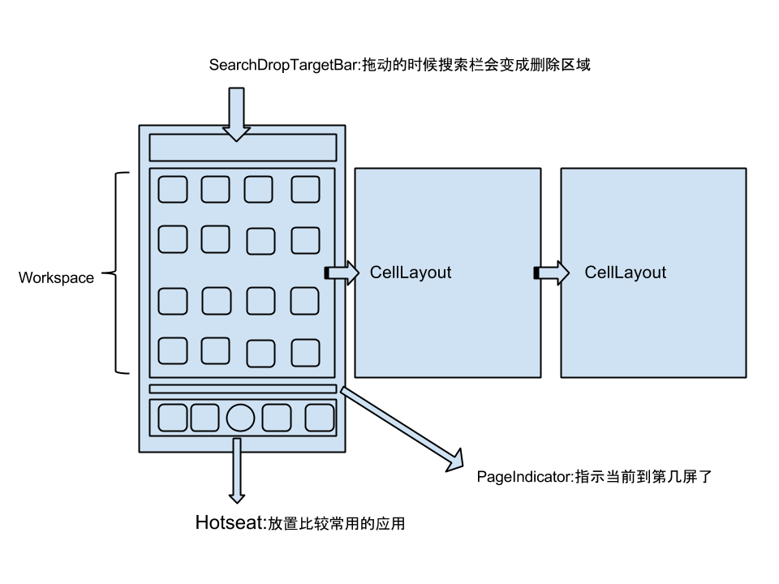

> version：2022/04/
>
> review：

目录

[TOC]

# 一、Launcher

launcher 其实就是一个app，我们的手机桌面其实就是 Launcher。从功能上说，是对其他app的一个管理和启动，也为一些App提供功能的入口。从代码上说，在 AndroidManifest.xml 文件中多了一个“”属性，在启动系统或者按Home键时会过滤这个属性，如果系统中只有一个应用具有这个属性，就会直接跳转到这个界面，也就是这个launcher，如果有多个，会弹出选择框让用户选择并且提示用户是否选择默认设置。

# 二、布局和结构

Launcher3 最主要的是一个Activity，基本上所有的操作都集中在这个Activity上，在 Launcher.java 当中，setContentView的参数是R.layout.launcher，我们暂时只研究下桌面竖屏的情况，相关源码在res/layout-port/launcher.xml 中。

在 launcher.xml 中，布局的最外面是一个FrameLayout，紧紧地包围了一个叫DragLayer的ViewGroup，他继承自FrameLayout，主要功能就是处理拖拽事件，在拖拽一个图标的时候，就是一个view放到了DragLayer里面，跟随你的手在移动。

在手机屏幕上左右滑，有好几屏，这个能滑的东西叫做Workspace，在布局文件里面可以看到的，Workspace能算是Launcher3代码里代码量前三的吧，它的父类的父类是PagedView，一个用来处理左右滑动的ViewGroup。那么Workspace里面可以滑动的单独一屏叫什么呢? 布局文件里面似乎没有写，其实是CellLayout，他负责的是图标和小部件的显示和整齐摆放。

在滑动屏幕的时候看见下方有个指示器，告诉你桌面现在有几屏，当前是在哪一屏上。这个东西叫做PageIndicator。

最下面的4个固定不动的图标，和中间一个Button显示所有应用，这整个叫做Hotseat，用来放置比较常用的应用，比如拨号，短信，相机等等。

屏幕最上方有个搜索框，在我们拖动图标的时候，这个搜索框会替换成“删除”，整个这部分叫做SearchDropTargetBar。

长按桌面空白区域的时候会进入一个界面，这里可以对屏幕进行换序操作，下面有三个按钮“壁纸”，“小部件”和“设置”，这个在布局文件里的id为overview_panel。接下来还有几个为cling结尾的子布局，这些是桌面第一次启动时的帮助界面，告诉你怎么点击怎么用。

最后哈有两个东西我暂时还没有搞懂，ScrimView和DrawableStateProxyView。

一图胜千言：

# 三、核心类

| 类名                   | 功能                                                         |
| ---------------------- | ------------------------------------------------------------ |
| Launcher               | 继承自 Activity，是桌面的主界面。因此可知，桌面其实就是一个activity，用来显示图标、Widget和文件夹等。 |
| LauncherModel          | 负责加载数据。从名字可以看出它跟数据有关系，负责保存桌面运行时的状态信息，同时提供读写数据库的APIs，是在LauncherAppState的构造方法中初始化的。它有一个内部类LoaderTask，桌面启动从数据库中读取数据并把图标和小工具添加上去的时候用的就是它。 |
| LauncherProvider       | 数据库类，继承自 ContentProvider，主要负责处理数据库操作。Launcher3使用了SQLite，数据库文件保存在/data/data/包名/databases/launcher.db 下，有兴趣的同学可以把这个东西拷贝出来，用SQLite的工具看看里面都是怎么保存的。 |
| LauncherAppState       | 单例模式的全局管理类，主要负责在启动的时候初始化一些对象，注册注册了广播监听器和ContentObserver等。 |
| Compat包               | 兼容包，带有这个后缀的都是做兼容处理的类                     |
| BubbleTextView         | 图标都是基于它，它继承自TextView，上面放图片，下面放文字，并不是一个线性布局。 |
| DragController         | DragLayer只是一个ViewGroup，具体的拖拽的处理都放到了DragController中。 |
| DragView               | 在拖动图标的时候跟随手指移动的View就是它。                   |
| DragSource，DropTarget | 跟拖拽相关的接口，DragSource表示图标从哪里被拖出来，DropTarget表示图标可以被拖到哪里去。 |
| Folder                 | 文件夹打开时那个view。                                       |
| FolderIcon             | 文件夹图标。                                                 |
| ItemInfo               | 运行时保存了桌面上每个项目的信息，包括图标在第几屏，第几行第几列，高度宽度等信息，每一个ItemInfo对象都对应着数据库中的一条记录。在Launcher3源码路径下，会有很多以Info结尾的类，这些类都是ItemInfo的子类，具体代表了桌面上的某个项目。比如说FolderIcon和FolderInfo是对应的，BubbleTextView和ShortcutInfo是对应的，AppWidgetHostView和LauncherAppWidgetInfo是对应的。有了对应关系，可以这样通过view获取ItemInfo对象：`ItemInfo info = (ItemInfo)bubbletextview.getTag();`  这样这里的info其实就是ShortcutInfo对象了。 |
| LoaderTask             | 继承自 Runnable，负责为 Launcher 加载数据。包括 workspace icons、widgets、all apps icons、deep shortcuts within apps。 |
|                        |                                                              |
|                        |                                                              |
|                        |                                                              |
|                        |                                                              |
|                        |                                                              |

初始化的过程：

PreviewSurfaceRenderer

LauncherPreviewRenderer

LauncherAppState

​	LauncherModel

​		LoaderTask -> ImportDataTask（真正去加载数据的类，内部也是通过 LauncherProvider 加载的）

# 相关问题

Q：

Q：

# 总结

1、

## 【精益求精】我还能做（补充）些什么？

1、

# 脑图

# 参考

