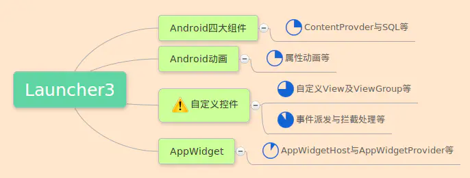
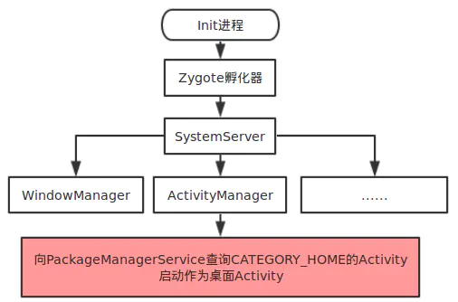
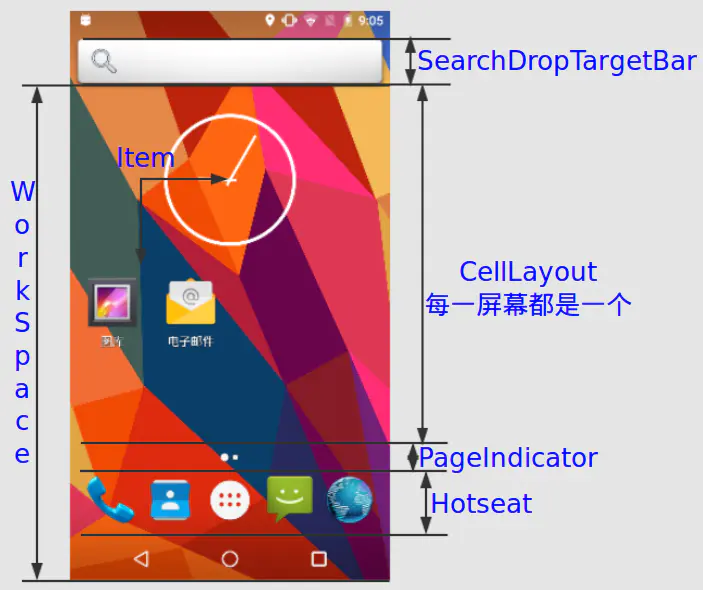
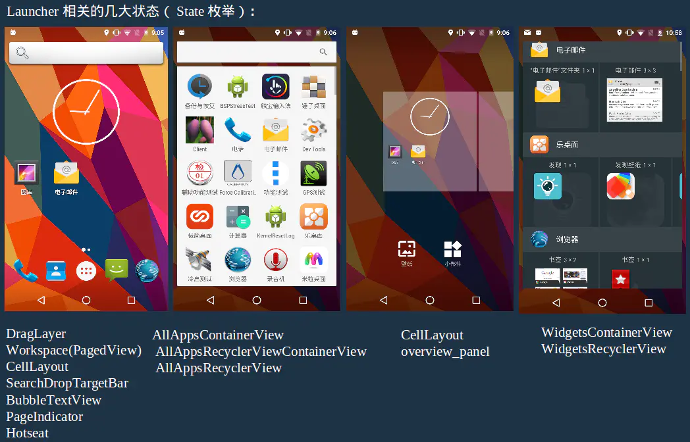

> version：2022/04/
>
> review：

目录

[TOC]

# 一、前置知识

以下知识是Launcher中大量涉及的，需要牢牢掌握这些基础知识。饼状图蓝色部分为Launcher中的大概占比。

整个原生Launcher是以MVC架构、以View为模块的结构；全局有效的核心Activity只有一个，但是其中涉及了多种交互状态，每种状态都至少依赖于一到多个庞大而复杂的自定义View，每一个事件的处理都需要考虑不同状态下不同层级、不同触摸位置的派发拦截处理流程。

# 二、基础知识

Launcher的实质也是一个普通应用，只是比普通应用多配置了Category 的android:name=”android.intent.category.HOME”属性而已。当Android开机启动成功以后框架层会尝试启动包含上面属性配置的Activity，这样被启动的那个Activity就成了桌面。当我们按下设备的Home键时也会触发包含该属性的Activity。只不过当系统中只存在一个包含该属性的应用时，无论开机还是Home键触发都只会自动启动默认的；当存在多个时无论哪种触发都会弹出选择框进行选择设置。

通常选项框会保留着，但是也可以修改框架层的ActivityManagerService服务将该入口写死。下图其实就是Android系统开机启动Launcher的大致过程，如下：

有了大致启动流程之后我们来看看Launcher界面的划分，如下是Launcher结构的模块划分：

 如下是原生

Launcher3 经典的四种UI模式：

通过上面这两幅图可以知道，Launcher3的实质其实就是一个Activity包含N个自定义层级的View，不同模式隐藏显示不同的View而已。

# 三、**Launcher3主流程加载浅析**

下面先给出主要的一些类文件的大致含义，这样才能方便理解代码，如下：

# 相关问题

Q：

Q：

Q：

Q：

Q：

Q：

Q：

# 总结

1、

## 【精益求精】我还能做（补充）些什么？

1、

# 脑图

# 参考

1、https://www.jianshu.com/p/2a2fc902955a

2、