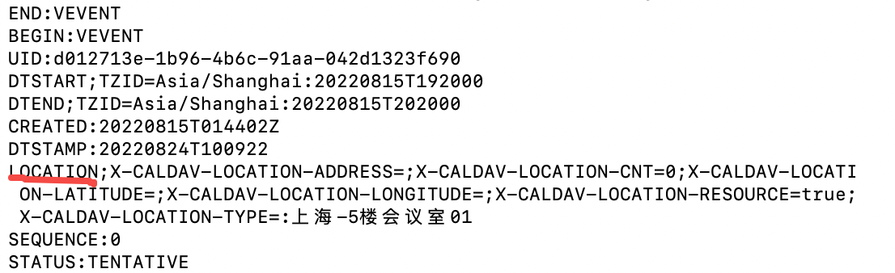

1、什么是caldav协议

caldav协议是一套描述日历日程信息的一套标准，这个标准是大家都遵循的，服务端和客户端可以基于这个协议来完成日程的交换和解析。

从Android应用开发的角度来看，简单来说，就是我们可以拿到日程数据并直接解析，而不需要服务端再来解释每个字段的含义。

2、服务端-客户端交互

目前基于caldav协议来做的功能，大致是下面这样的流程

服务端：提供一个caldav账号和密码，提供服务端的地址，提供日程文件（ics格式的）。

客户端：使用caldav账号向服务端发起请求，拿到日程文件的地址，通过日程文件地址下载文件。然后进行日程数据的解析。

3、ics文件的内容

下面是ics内容的部分截取：

下面解释下一些重要的字段：

VCALENDAR : 日历

​	VEVENT ：日程

​		UID ：日程id

​		DTSTART ：开始时间

​		DTEND：结束时间

​		CERATED：创建时间

​		SUMMARY：概要，跟标题一个意思

​		LOCATION：位置

​		DESCRIPTION：描述

上面就是日程中比较常用的一些字段。

4、小结

# 参考

1、[caldav协议详细字段](https://blog.csdn.net/arv002/article/details/124713756)