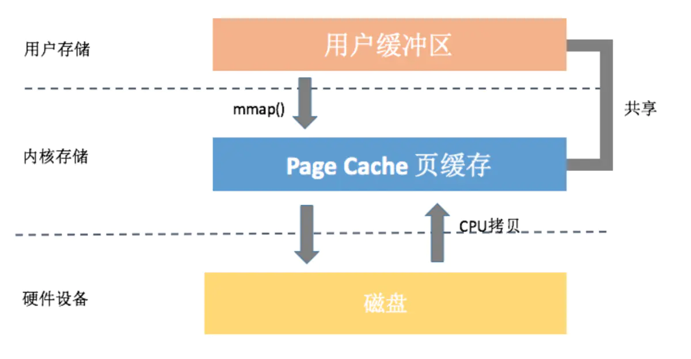

> version：2022/08/27
>
> review：


目录

[TOC]


# 一、SharedPreferences 是什么

SharedPreferences 是用来存放**简单键值对**的一种方式。适用于**单进程、小批量**的数据。SharedPreferences 是基于 XML 文件实现的，并且所有要持久化的数据都是一次性加载到内存，如果数据过大，不合适用 SP。然后 Android 的文件访问也是不支持多进程互斥的，因此 SP 也不支持跨进程（支持，但是有问题），如果多个进程更新一个 XML 文件，就会存在不互斥问题，数据存储会有问题。


# 二、SharedPreferences 内部工作原理

## 1、getSharedPreferences() 

调用 `getSharedPreferences()` 时会创建一个 SharedPreferences 对象，其中会先判断是否存在对应的 xml 文件，如果发现存在则会有一个预加载操作——就是把 xml 文件的内容通过 IO 操作和 XmlUitl 解析后存入一个 map 对象中，所以我们调用 `SharedPreferences::getString()` 等 get 操作是不会对文件做 IO 操作的，而是直接访问刚刚创建的 map 集合的内容，这提高了效率。如果对应的 xml 不存在则重新创建一个对应的 xml 文件。

部分实现如下：

```java
// SharedPreferencesImpl.java
@Override
public SharedPreferences getSharedPreferences(String name, int mode) {
    SharedPreferencesImpl sp;
    //...
    sp = packagePrefs.get(name);
    if (sp == null) {
        File prefsFile = getSharedPrefsFile (name);
        ／／该构造方法会调用 startLoadFromDisk();把数据从硬盘加载到内存
        sp = new SharedPreferencesImpl (prefsFile, mode);
        packagePrefs.put(name, sp);
        return sp;
    }
    //...
    return sp;
}
```


## 2、put 写操作

写操作也有两步，一是把数据先写入内存中，即 map 集合，二是把数据写入硬盘文件中。这样才能保证数据的完整性。

写操作有两个提交的方式：

commit()：线程安全，性能慢，一般来说在当前线程完成写文件操作

apply()：线程不安全，性能高，异步处理 IO 操作，一定会把这个写文件操作放入一个 SingleThreadExecutor 线程池中处理 


## 3、SharedPreferences 多次创建

在第一次创建后会一直维持一个 Singleton ， 每次调用 getSharedPreferences() 都返回唯一的一个实例，从上面的 getSharedPreference() 代码可以看到，每个prefs文件都会以name作为key保存，每次取之前都会判空的。


# 三、SharedPreferences 使用封装

由于 SharedPreferences 的 key 与 value 其实最终都是以 String 类型存在，所以可以这样写一个 SharedPreferences 工具类： 

```java
class PreferenceManager {

    private static final String PERF_NAME = "my_perf";

    private static final int CURRENT_VERSION_CODE = 1;
    private volatile static PreferenceManager instance;
    private final SharedPreferences preferences;

    private PreferenceManager(Context context) {
        preferences = context.getSharedPreferences(PERF_NAME, Context.MODE_PRIVATE);
        checkPrefVersion();
    }

    public static PreferenceManager getInstance(Context context) {
        if (instance == null) {
            synchronized (PreferenceManager.class) {
                if (instance == null)
                    instance = new PreferenceManager(context);
            }
        }
        return instance;
    }

    public final void putValue(String key, String value) {
        preferences.edit().putString(key, value).apply();
    }

    public final String getValue(String key) {
        checkIsLegal(key);
        return preferences.getString(key, "");
    }

    public final void deleteValue(String key) {
        checkIsLegal(key);
        preferences.edit().remove(key).apply();
    }

    public final void clear() {
        preferences.edit().clear().apply();
    }

    private void checkIsLegal(String key) {
        if (TextUtils.isEmpty(key))
            throw new IllegalArgumentException("This parameter is illegal,key : " + key);
    }

    private void checkPrefVersion() {
        final int oldVersion = preferences.getInt(PERF_NAME, 0);
        if (oldVersion < CURRENT_VERSION_CODE) {
            preferences.edit().clear().putInt(PERF_NAME, CURRENT_VERSION_CODE).apply();
        }
    }
}
```

由于应用版本升级时并不会删除 SharedPreferences 文件，所以可以加个版本判断，来进行一些数据更新。

从上面看来，由于每一次调用 getSharedPreferences() 都会有 IO 操作，当内容比较多时，那么就不适宜在 Application 的 onCreate 中进行 SharedPreferences 文件初始化了，最好的办法是开个子线程去完成它的创建和数据的预加载！！！


# 四、使用优化


# 存在的问题

## 1、加载缓慢

虽然在获取 SharedPreferences 对象时做了缓存，但是首次加载 SharedPreferences 文件时使用了异步线程，而且加载线程并没有设置线程优先级，**如果这个时候主线程读取数据就需要等待文件加载线程的结束**。这就可能引起**主线程等待低优先级线程锁**的问题，这种情况在SP文件较大时尤为明显，比如一个 100KB 的 SP 文件读取等待时间大约需要 50~100ms。

耗时主要是集中在 SP 文件的加载和解析，文件中的键值对越多，那这个时间就越久。

```java
    //android.app.ContextImpl.java
    public SharedPreferences getSharedPreferences(File file, int mode) {
        SharedPreferencesImpl sp;
        synchronized (ContextImpl.class) {
            final ArrayMap<File, SharedPreferencesImpl> cache = getSharedPreferencesCacheLocked();
            sp = cache.get(file);
            if (sp == null) {
                ...
                sp = new SharedPreferencesImpl(file, mode);
                cache.put(file, sp);//缓存SharedPreferences对象
                return sp;
            }
        }
        ...
        return sp;
    }

    //android.app.SharedPreferencesImpl.java
    //SharedPreferencesImpl构造函数中调用了startLoadFromDisk
    private void startLoadFromDisk() {
        synchronized (mLock) {
            mLoaded = false;
        }
        //低优先级线程
        new Thread("SharedPreferencesImpl-load") {
            public void run() {
                loadFromDisk();
            }
        }.start();
    }

    private void loadFromDisk() {
        ...
        Map<String, Object> map = null;
        ...
                    map = (Map<String, Object>) XmlUtils.readMapXml(str);//io操作
        ....

        synchronized (mLock) {//竞争锁
            ...
                        mMap = map;//将sp中的内容存到内存中
             ...
        }
    }
```

解决方案

1、应用启动可以分为三步：Application+主页+后续页面。因此为了快速加载主页，可以对 key-value 进行优先级区分，第一个标准可以是“是否是 Application 和主页加载所需要的”，来分成多个 SP 文件，启动时先加载必须的，启动后再加载其他的 SP 文件。（启动优化）

拓展：其他资源的加载也可以用这种思路。


## 2、主线程同步提交可能导致的卡顿

在主线程调用android.app.SharedPreferencesImpl.EditorImpl#commit提交对sp的改动时，无论sp是否有改动，最终都会将内存中的键值对写到磁盘中。当xml中的数据过多时这种主线程中的io就有可能导致卡顿甚至ANR。

```java
        //android.app.SharedPreferencesImpl.EditorImpl.java
        public boolean commit() {
            long startTime = 0;

            if (DEBUG) {
                startTime = System.currentTimeMillis();
            }
            //比较内存中的键值对是否有改动
            MemoryCommitResult mcr = commitToMemory();
            //将内存中存储的键值对写到磁盘
            SharedPreferencesImpl.this.enqueueDiskWrite(
                mcr, null /* sync write on this thread okay */);
            try {
                mcr.writtenToDiskLatch.await();
            } catch (InterruptedException e) {
                return false;
            } finally {
                if (DEBUG) {
                    Log.d(TAG, mFile.getName() + ":" + mcr.memoryStateGeneration
                            + " committed after " + (System.currentTimeMillis() - startTime)
                            + " ms");
                }
            }
            notifyListeners(mcr);
            return mcr.writeToDiskResult;
        }


    //android.app.SharedPreferencesImpl.java
    private void enqueueDiskWrite(final MemoryCommitResult mcr,
                                  final Runnable postWriteRunnable) {
        final boolean isFromSyncCommit = (postWriteRunnable == null);

        final Runnable writeToDiskRunnable = new Runnable() {
                @Override
                public void run() {
                    synchronized (mWritingToDiskLock) {
                        //执行磁盘写入
                        writeToFile(mcr, isFromSyncCommit);
                    }
                    synchronized (mLock) {
                        mDiskWritesInFlight--;
                    }
                    if (postWriteRunnable != null) {
                        postWriteRunnable.run();
                    }
                }
            };

        // Typical #commit() path with fewer allocations, doing a write on
        // the current thread.
        if (isFromSyncCommit) {
            boolean wasEmpty = false;
            synchronized (mLock) {
                wasEmpty = mDiskWritesInFlight == 1;
            }
            if (wasEmpty) {
                writeToDiskRunnable.run();//
                return;
            }
        }

        QueuedWork.queue(writeToDiskRunnable, !isFromSyncCommit);
    }
```


## 3、异步提交可能导致的ANR

与commit()不同，apply()会将写磁盘的操作丢到一个链表中，默认会在100ms后执行io操作。值得注意的是，在ActivityThread#handleStop等地方会检查是否有apply的任务未执行，然后等待这些任务执行完。如果我们疯狂的调用apply()提交了一堆任务，那么此时在页面跳转的过程中就很容易发生ANR。

```java
  //android.app.QueuedWork#queue  
  public static void queue(Runnable work, boolean shouldDelay) {
        Handler handler = getHandler();

        synchronized (sLock) {
            sWork.add(work);//将io操作添加到sWork集合中

            if (shouldDelay && sCanDelay) {
                handler.sendEmptyMessageDelayed(QueuedWorkHandler.MSG_RUN, DELAY);//延时执行这个任务
            } else {
                handler.sendEmptyMessage(QueuedWorkHandler.MSG_RUN);
            }
        }
    }
```


## 4、全量写入

即使只修改了一个键值对，在调用apply()或commit()将这些改动写到本地时都会将内存中的键值对集合重新全部写到sp文件中，这无疑是低效的，我们应该寻找一种能增强更新的方式。

```java
    private void writeToFile(MemoryCommitResult mcr, boolean isFromSyncCommit) {
        ...
            XmlUtils.writeMapXml(mcr.mapToWriteToDisk, str);

            writeTime = System.currentTimeMillis();

            FileUtils.sync(str);
        ...
    }
```


## 5. 跨进程不安全

SP提供了用于跨进程场景下的MODE_MULTI_PROCESS，但是这种方式在跨进程频繁读写时有可能导致**数据全部丢失**。

MODE_MULTI_PROCESS提供的作用在于：每次context#getSharedPreferences取SP时会比较一把SP文件的时间戳以及文件大小与当前进程是否一致，否则一律重新加载SP文件到内存。

修改SP文件的流程如下：先将原SP文件备份一份，再进行全量写入，最后再将原备份文件删除（这种做法的意义在于，写入SP文件时由于进程死亡等原因导致写入失败时，SP仍能恢复回来）。

加载SP文件的流程如下：每次加载SP文件时检查是否存在备份文件，如果备份文件存在，则用备份文件替换原文件。

显然这样的逻辑在处理多进程读写时是有很大缺陷的，比如这样一个场景：A进程在写SP，B进程以多进程模式加载SP，此时由于A进程还没写完，磁盘中同时存在SP和SP备份文件，B进程就会把SP原文件干掉，最终导致A进程写文件失败。

因此，我们需要一把跨进程锁来保证对同一文件跨进程读写的可靠性，或者依赖类似ContentProvider+sql的方式。

```java
    //在context#getSharedPreferences时如果mode是MODE_MULTI_PROCESS则调用此方法
    private boolean hasFileChangedUnexpectedly() {
        ...
        final StructStat stat;
        try {
            /*
             * Metadata operations don't usually count as a block guard
             * violation, but we explicitly want this one.
             */
            BlockGuard.getThreadPolicy().onReadFromDisk();
            stat = Os.stat(mFile.getPath());
        } catch (ErrnoException e) {
            return true;
        }

        synchronized (mLock) {
            return !stat.st_mtim.equals(mStatTimestamp) || mStatSize != stat.st_size;//比较SP文件的时间戳和大小来判断SP是否被更改
        }
    }
```


# MMKV

尽管我们可以通过复写 Application 的 getSharedPreferences 方法替换系统默认实现，比如优化卡顿、合并多次 apply 操作、支持跨进程操作等，但是依然不能彻底解决问题，而腾讯开源的MMKV对如上几点问题都给出了很好的解决方案。

## 1、mmap内存映射

使用mmap内存映射改善了IO延迟，且提升了写入的稳定性

什么是mmap？

**mmap**是linux下的一个系统调用，可以实现把文件映射到内存空间中，使得我们可以像访问普通内存一样对文件进行访问。

> void * mmap(void *start, size_t length, int prot , int flags, int fd, off_t offset)

它能带来如下好处：

1. 减少系统调用。我们只需要一次 mmap() 系统调用，后续所有的调用像操作内存一样，而不会出现大量的 read/write 系统调用。
2. 减少数据拷贝。普通的 read() 调用，数据需要经过两次拷贝；而 mmap 只需要从磁盘拷贝一次就可以了，并且由于做过内存映射，也不需要再拷贝回用户空间。
3. 可靠性高。mmap 把数据写入页缓存后，跟缓存 I/O 的延迟写机制一样，可以依靠内核线程定期写回磁盘。值得一提的是，mmap 在内核崩溃、突然断电的情况下也一样有可能引起内容丢失，当然我们也可以使用 msync 来强制同步写。




## 2、独特的增量更新机制

区别于SP的全量更新，MMKV 可以增量更新。MMKV 采用 protocol buffer 来保存所有的键值对信息，但由于pb不支持增量更新，因此每次 MMKV 数据有更新时，会将新键值序列化后追加到文件末尾，在下一次读取文件抑或其他时机再做文件重整，将重复的键值对删除，再将整个文件重新序列化。


## 3、自定义文件锁实现跨进程的读写<font color='red'>note：还不太懂</font>

考虑到多进程对文件频繁的读写场景，我们期望选择的跨进程锁能满足如下条件：

1. 读读共享，读写互斥。
2. 支持递归加锁。即支持一个进程对一把锁重复加锁，且后续一次解锁也不会导致外层锁全部被释放。
3. 支持锁升/降级。即读锁升级为写锁，写锁降级为读锁。且两个进程同时锁升级时不会导致死锁，某一进程锁降级时不会导致一降就降到没有锁。
4. 持有锁的进程被干掉之后能够把锁释放掉。

我们有如下选择：

1. 创建于共享内存的pthread 库的 pthread_mutex。它天然支持递归加锁和锁的升降级，但是在android上加了锁了进程被杀后不保证锁能够被释放（linux中是可以保证的）。
2. 基于文件描述符的[文件锁](https://www.jianshu.com/p/4a3896292e2e)。它支持递归加锁，但是后续一次解锁会导致外层的锁全部被释放；支持锁的升级，但在两个进程同时锁升级时会导致死锁；不支持锁降级；支持进程被杀时自动释放锁。

若选择第一种方案，需要我们能够自己处理好进程被杀后锁的释放。两个进程之间相互注册死亡通知再手动释放进程锁是一种思路，但是进程自己无法感知自己的死亡，这种情况下有可能导致一个进程被杀后留下一个没有被释放的锁。（关于如何使用pthread_mutex进程锁可以参考[使用共享内存作为进程互斥锁的代码](https://links.jianshu.com/go?to=https%3A%2F%2Fblog.csdn.net%2Fquantum7%2Farticle%2Fdetails%2F85049258)）

若选择第二种方案，则需要我们自己做读写计数来实现锁的升降级以及递归。

MMKV最终选择了第二种方案，具体可以参阅[MMKV for Android 多进程设计与实现](https://links.jianshu.com/go?to=https%3A%2F%2Fgithub.com%2FTencent%2FMMKV%2Fwiki%2Fandroid_ipc)


# 相关问题

<font color='orange'>Q：getSharedPreferences() 在 Application::onCreate 中执行会影响性能吗</font>

如果应用启动时，依赖到了 SP 文件中的数据，那么可能会有很大影响，取决于 SP 文件的大小。另外，即使没有用到，加载 SP 文件时，虽然新建了一个线程，但是线程的执行总归是会影响到主线程的执行速度的。

<font color='orange'>Q：什么情况下会选择用SharedPreference应用场景？注意事项？</font>

适用于单进程、少量的键值对存储。主要是用来保存一些配置信息，这些数据不会频繁的读写，因此适用于SP。

注意事项：

1、要**避免保存过多的数据**，尤其是启动应用是用到的，它是全量的文件读写，会影响到应用性能。

2、避免频繁的提交。

归根结底，就是要减少IO操作。

尤其是commit，如果文件中的数据太多，要避免在主线程中执行，否则可能会导致ANR。

3、SP 文件在使用的使用，是全量加载到内存的，所以单个文件也不能保存太多的数据。否则可能会内存溢出。

<font color='orange'>Q：SharedPreference原理</font>

是基于 XML 文件来实现的。

<font color='orange'>Q：SharedPreference的优化</font>

注意使用规范，只用来存储少量的配置信息。使用时要避免频繁的commit和apply，避免不必要的IO操作。

对要保存的键值对进行区分，两个维度：

1、可以区分是否是应用启动和主页加载必须依赖的

启动所依赖的数据，建议单独用一个文件保存。

2、区分使用频率

不同频率用不同的 SP 文件。

<font color='orange'>Q：SharedPreference的线程安全</font>

是线程安全的。

使用 SP 的时候，put数据和 commit/apply 数据时，可能涉及到并发执行。其中put时，是同步执行的，在Editor内部要拿到同步锁才能去put数据，这个是把数据放到内存中。然后commit和apply是用来将内存中的数据写入到磁盘中，这两个方法也不存在线程安全问题。

<font color='orange'>Q：commit与apply的区别是什么？使用时需要有哪些注意？</font>

commit 和 apply 都是用于将内存中的数据写到 XML 文件中。

| 区别/方法 | commit                                                       | apply                                                       |
| --------- | ------------------------------------------------------------ | ----------------------------------------------------------- |
| 执行线程  | 在调用线程中执行，即可能在主线程执行                         | 创建新的线程去执行写入任务                                  |
| 执行方式  | 同步执行，如果是多线程执行，那后面的会阻塞，前面执行完再执行 | 100ms内，新的apply会覆盖前面的，基于Handle的delay来实现的。 |
| 返回值    | 有返回值，如果需要知道保存结果，可以用commit                 | 无。                                                        |
| 线程安全  | 是。所有读写任务同步执行                                     | 是。                                                        |
| 进程安全  | 否                                                           | 否                                                          |

<font color='orange'>Q：sharepreference.editor的异步提交方法是哪个?</font>

apply()。

<font color='orange'>Q：是否线程安全和进程安全?</font>

线程安全。进程不安全。

<font color='orange'>Q：SP是进程同步的吗?有什么方法做到同步？</font>

不是。SP 是基于 XML 文件实现的，文件的读写是并不能进程互斥。也就是不是同步的。

要同步执行，可以考虑用 ContentProvider 来进行一次保证，在 CP 内部进行同步。

MMKV 好像还有新的方法，我还不是很懂。

<font color='orange'>Q：shareprefrence不是进程安全,假设一个apk两个进程同时修改shareprefrence怎么办?</font>

可以用 ContentProvider 来进行同步。

<font color='orange'>Q：设计进程安全的SharedPreference</font>


# 总结

1. SharePreferences是Android基于xml实现的一种数据持久化手段。

2. sp不适合存储过大的数据,因为它一直保存在内存中,数据过大容易造成内存溢出。

3. SharePreferences的commit与apply一个是同步一个是异步（大部分场景下），sp的commit方法是直接在当前线程执行文件写入操作,而apply方法是在工作线程执行文件写入,尽可能使用apply,因为不会阻塞当前线程。

4. sp并不支持跨进程,因为它不能保证更新本地数据后被另一个进程所知道,而且跨进程的操作标记已经被弃用。

5. sp批量更改数据时,只需要保留最后一个apply即可,避免添加多余的写文件任务。

6. 每个sp存储的键值对不宜过多,否则在加载文件数据到内存时会耗时过长,而阻塞sp的相关`get`或`put`方法,造成ui卡顿。

7. **频繁更改的配置项和不常更改的配置项应该分开为不同的sp存放**,避免不必要的io操作。


## 【精益求精】我还能做（补充）些什么？

1、


# 脑图


# 参考

1、[浅谈sharepreference](https://www.jianshu.com/p/4497f06fd484)

2、https://blog.csdn.net/qq_29882585/article/details/108267867

这个里面的总结还行，可以再看看。
