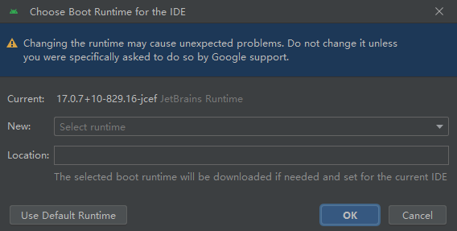

新安装的AS一些好用的配置

一、插件

1、翻译

translation

2、markdown editor

不能预览时，双击shift按钮，输入Choose Boot Java Runtime for the IDE，回车后就会弹出一个新的弹窗。

在这个弹窗中点击下拉列表，选中一个和你的Android studio匹配的版本下载下来然后安装，重启AS就可以了。

3、CodeLocator

很方便开发调试，快速定位到 UI 界面。

https://github.com/bytedance/CodeLocator

4、

