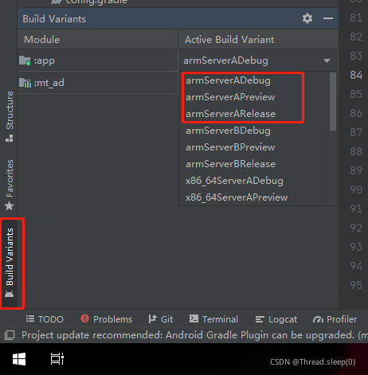

# build.gradle（:app）


## flavorDimensions 与 productFlavors

### 需求场景

在Android开发时常常会遇到这样的情况：在进行APP应用开发时，同样一个项目，在发布到不同的应用市场时，需要使用不同的key等等情况。或者一套代码需要跑到不同的设备上。

当遇到这样的情况时，应该如何处理呢？最笨的方法那就是采用一个全局变量，在业务代码中根据这个全局变量进行不同的操作，这样的方法有一个最大的弊端就是，万一那天发布版本的时候忘记修改这个全局变量，岂不是就炸了。

本文将介绍比较通用的处理方法，即通过配置 flavorDimensions 与 productFlavors 实现同一个项目发布时区分不同的一些属性。

### 原理

flavorDimensions与productFlavors的原理和上诉的笨方法是一样的，当配置了这两个属性以后，在项目打包时就会生成一个全局变量类，这个类就是BuildConfig，它的路径为

C:\project\app\build\generated\source\buildConfig\xxx\debug\package_name\BuildConfig.java

有了这个我们自动生成的全局类，我们就可以在业务中进行判断，例如 BuildConfig.DEBUG 可以判断当前是否是debug版本的包

### 使用

flavorDimensions：代表了这个项目具有那些属性，比如说我的项目具有“设备（机型）”、“业务”两个属性，那就可以进行这样的声明

```kotlin
flavorDimensions 'device', 'model'
```

其中device属性用来代表我的代码跑在哪个设备上、model属性我用来区分不同的业务类型，例如连接的服务器地址

productFlavors：声明了属性，那么属性的具体值是什么呢，这就通过productFlavors来实现。例如，我的设备类型有3种分别是“‘x86’, ‘x86_64’, ‘arm’，业务类型有两种，分别是针对两台服务器，那么我给它的取值为"serverA", “serverB”。

```kotlin
productFlavors {
	x86 {
		dimension 'device'
	}
	x86_64 {
		dimension 'device'
	}          
	arm {
		dimension 'device'
	}
	//=================================
	serverA {
		dimension 'model'
	}
	serverB {
		dimension 'model'
	}
}
```

通过上面的代码，两个属性设置，当我们点击Sync project以后，我们即可在Build Variants处看到效果了：



可以看到已经出现了以两个属性拼接命名的选项了，现在比如我想要编译一个运行在x86设备上连接服务器A的包，那我就可以选择x86ServerADebug选择进行编译，当编译完成以后就会生成BuildConfig文件

```kotlin
public final class BuildConfig {
  public static final boolean DEBUG = Boolean.parseBoolean("true");
  public static final String APPLICATION_ID = "com.xxx.xxx.xxx";
  public static final String BUILD_TYPE = "debug";
  public static final String FLAVOR = "x86ServerA";
  public static final int VERSION_CODE = 1;
  public static final String VERSION_NAME = "0.0.1";
  public static final String FLAVOR_device = "x86";
  public static final String FLAVOR_model = "serverA";
}
```

在这个BuildConfig中我们可以看到生成的全局变量FLAVOR_device 、FLAVOR_model 分别代表着两种属性，同时FLAVOR 也提供将两个属性拼接起来的字符串

注意：如果没有设置flavorDimensions，那么也是可以设置productFlavors的，因为在不设置flavorDimensions时，会自动创建一个默认属性

```kotlin
productFlavors {
    A {}
    B {}
    C {}
}

//=======================上面的代码等同于下面的代码=========================

flavorDimensions 'default'

productFlavors {
    A {
        dimension 'default'
    }
    B {
        dimension 'default'
    }
    C {
        dimension 'default'
    }
}
```

参考：

[Gradle：flavorDimensions与productFlavors的使用](https://blog.csdn.net/gxhuhuhu/article/details/120552650)


## matchingFallbacks

### 使用

```kotlin
android {

   flavorDimensions "default"
   productFlavors {
        flavor3 {
            dimension "default"
            matchingFallbacks = ['flavor1']
        }
    }
}
```

### 问题背景

项目中有 2 个 module，其中 B 依赖 A。

起初两个 module 都没有定义 flavor，由于业务发展，给底层的 module A 定义了两个 flavor(本文中使用 flavor1 和 flavor2 表示)：

module A 中的 flavor 定义如下：

```bash
    flavorDimensions "default"
    productFlavors {
        flavor1 {
            dimension "default"
        }

        flavor2 {
            dimension "default"
        }
    }
```

module B 中未定义任何 flavor。

此时，编译，gradle 编译错误提示如下:

```ruby
* What went wrong:
Could not determine the dependencies of task ':B:compileReleaseRenderscript'.
> Could not resolve all task dependencies for configuration ':B:releaseCompileClasspath'.
   > Could not resolve project :A.
     Required by:
         project :B
      > Cannot choose between the following configurations of project :A:
          - flavor1ReleaseApiElements
          - BReleaseApiElements
        All of them match the consumer attributes:
          - Configuration 'flavor1ReleaseApiElements':
              - Required com.android.build.api.attributes.BuildTypeAttr 'release' and found compatible value 'release'.
              - Found com.android.build.api.attributes.VariantAttr 'flavor1Release' but wasn't required.
              - Required com.android.build.gradle.internal.dependency.AndroidTypeAttr 'Aar' and found compatible value 'Aar'.
              - Found default 'flavor1' but wasn't required.
              - Required org.gradle.usage 'java-api' and found compatible value 'java-api'.
              - Required org.jetbrains.kotlin.platform.type 'androidJvm' and found compatible value 'androidJvm'.
          - Configuration 'BReleaseApiElements':
              - Required com.android.build.api.attributes.BuildTypeAttr 'release' and found compatible value 'release'.
              - Found com.android.build.api.attributes.VariantAttr 'BRelease' but wasn't required.
              - Required com.android.build.gradle.internal.dependency.AndroidTypeAttr 'Aar' and found compatible value 'Aar'.
              - Found default 'B' but wasn't required.
              - Required org.gradle.usage 'java-api' and found compatible value 'java-api'.
              - Required org.jetbrains.kotlin.platform.type 'androidJvm' and found compatible value 'androidJvm'.
```

问题原因：module B 依赖 module A，A 有 2 个 flavor 定义，B 没有 flavor 定义，B 在编译期无法知道该依赖 module A 的哪一个 flavor。

### 解决方法

要解决这个问题，需要给 module B 指定应该依赖 module A 的哪一个 flavor，有两种方法:

**方法一:**

给 module B 定义一个 module A 中同名的 flavor，如:

```bash
    flavorDimensions "default"
    productFlavors {
        flavor1 {
            dimension "default"
        }
    }
```

gradle 会自动根据 flavor name 匹配依赖 module 中对应的 flavor，这里要注意，flavorDimensions 也必须与依赖 module 中的 flavorDimensions 一致。

**方法二:**

module B 中的 flavor 与 module A 中的所有 flavor 都不匹配，可以通过 matchingFallbacks 指定。

```bash
    flavorDimensions "default"
    productFlavors {
        flavor3 {
            dimension "default"
            matchingFallbacks = ['flavor1']
        }
    }
```

### matchingFallbacks 其他作用

matchingFallbacks 不仅可以用于配置 productFlavors，还可以配置 build type。比如，如果module B 有一个特殊的 build type，然后 module A 中只有 debug 和 release 两种 build type，会有同样类似的编译错误，该问题依然可以通过 matchingFallbacks 指定 build type 类型来解决，如 :

```bash
    buildTypes {
        releaseQA {
            matchingFallbacks = ['release']
        }
    }
```

参考：

[gradle 之 matchingFallbacks 作用](https://www.jianshu.com/p/7e2d0e59a2bb)