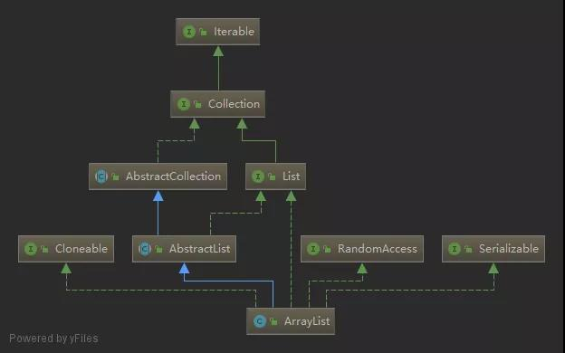
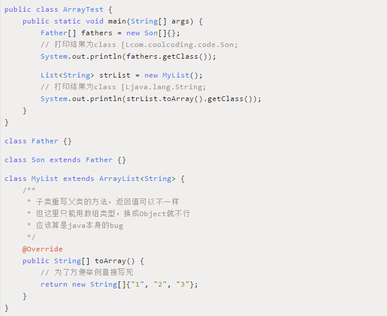

### 一、ArrayList 简介

ArrayList是用数组实现的List，与数组相比，它具有动态扩展的能力，因此也被称为动态数组。

#### 继承体系



ArrayList实现了List、RandomAccess、 Cloneable、 java.io.Serializable等接口。

| 接口         | 功能                                 |
| :----------- | ------------------------------------ |
| List         | 提供了基础的添加、删除、遍历等操作。 |
| RandomAccess | 提供了随机访问的能力。               |
| Cloneable    | 可以被克隆。                         |
| Serializable | 可以被序列化。                       |

### 二、相关问题


### 三、源码解析

#### 1、属性

```java
    /**
默认容量为10。
通过new ArrayList()创建时的默认容量。
     */
    private static final int DEFAULT_CAPACITY = 10;

    /**
空数组。传入容量为0时使用。
通过new ArrayList(0)创建时用的是这个空数组。
     */
    private static final Object[] EMPTY_ELEMENTDATA = {};

    /**
空数组。通过new ArrayList()创建时用的是这个空数组。
与EMPTY_ELEMENTDATA的区别是在添加第一个元素时使用这个空数组的会初始化为DEFAULT_CAPACITY（10）个元素。
     */
    private static final Object[] DEFAULTCAPACITY_EMPTY_ELEMENTDATA = {};

    /**
真正存放元素的地方，使用transient是为了不序列化这个字段。
至于没有使用private修饰，后面注释是写的“为了简化嵌套类的访问”，但是楼主实测加了private嵌套类一样可以访问。
private表示是类私有的属性，只要是在这个类内部都可以访问，嵌套类或者内部类也是在类的内部，所以也可以访问类的私有成员。
     */
    // Android-note: Also accessed from java.util.Collections
    transient Object[] elementData; // non-private to simplify nested class access

    /**
     * 真正存储元素的个数，而不是elementData数组的长度。
     */
    private int size;
```

Q1：elementData为什么不加private？

Q2：transient的作用？

#### 2、构造方法

<font color='orange'>ArrayList(int initialCapacity)构造方法</font>

```java
public ArrayList(int initialCapacity) {
    if (initialCapacity > 0) {
        // 如果传入的初始容量大于0，就新建一个数组存储元素
        this.elementData = new Object[initialCapacity];
    } else if (initialCapacity == 0) {
        // 如果传入的初始容量等于0，使用空数组EMPTY_ELEMENTDATA
        this.elementData = EMPTY_ELEMENTDATA;
    } else {
        // 如果传入的初始容量小于0，抛出异常
        throw new IllegalArgumentException("Illegal Capacity: "+
                                           initialCapacity);
    }
}
```

<font color='orange'>ArrayList()构造方法</font>

```java
public ArrayList() {
    // 如果没有传入初始容量，则使用空数组DEFAULTCAPACITY_EMPTY_ELEMENTDATA
	// 使用这个数组会在添加第一个元素的时候会扩容到默认大小10
    this.elementData = DEFAULTCAPACITY_EMPTY_ELEMENTDATA;
}
```

<font color='orange'>ArrayList(Collection c)构造方法</font>

```java
/**
* 把传入集合的元素初始化到ArrayList中
*/
public ArrayList(Collection<? extends E> c) {
    // 集合转数组
    elementData = c.toArray();
    if ((size = elementData.length) != 0) {
        // 检查c.toArray()返回的是不是Object[]类型，如果不是，重新拷贝成Object[].class类型
        if (elementData.getClass() != Object[].class)
            elementData = Arrays.copyOf(elementData, size, Object[].class);
    } else {
        // 如果c为空集合，则初始化为空数组EMPTY_ELEMENTDATA
        this.elementData = EMPTY_ELEMENTDATA;
    }
}
```

Q：为什么 `c.toArray();`返回的有可能不是Object[]类型呢？请看下面的代码：



Q：为啥非要转换成Object[]呢？

#### 3、核心方法

##### 1）增加

<font color='orange'>add(E e)方法</font>

添加元素到末尾，平均时间复杂度为O(1)。

```java
public boolean add(E e) {
    // 检查是否需要扩容
    ensureCapacityInternal(size + 1);  // Increments modCount!!
    // 把元素插入到最后一位
    elementData[size++] = e;
    return true;
}

    private void ensureCapacityInternal(int minCapacity) {
        // 如果是空数组DEFAULTCAPACITY_EMPTY_ELEMENTDATA，就初始化默认大小为10
        if (elementData == DEFAULTCAPACITY_EMPTY_ELEMENTDATA) {
            minCapacity = Math.max(DEFAULT_CAPACITY, minCapacity);
        }

        ensureExplicitCapacity(minCapacity);
    }

    private void ensureExplicitCapacity(int minCapacity) {
        modCount++;

        // overflow-conscious code
        if (minCapacity - elementData.length > 0)
            // 扩容
            grow(minCapacity);
    }

    private void grow(int minCapacity) {
        // overflow-conscious code
        int oldCapacity = elementData.length;
        // 新容量为旧容量的1.5倍
        int newCapacity = oldCapacity + (oldCapacity >> 1);
        // 如果新容量发现比需要的容量还小，则以需要的容量为准
        if (newCapacity - minCapacity < 0)
            newCapacity = minCapacity;
        // 如果新容量已经超过最大容量了，则使用最大容量
        if (newCapacity - MAX_ARRAY_SIZE > 0)
            newCapacity = hugeCapacity(minCapacity);
        // 以新容量拷贝出来一个新数组
        elementData = Arrays.copyOf(elementData, newCapacity);
    }
```

1. 检查是否需要扩容；
2. 如果elementData等于DEFAULTCAPACITY_EMPTY_ELEMENTDATA则初始化容量大小为DEFAULT_CAPACITY；
3. 新容量是老容量的1.5倍（oldCapacity + (oldCapacity >> 1)），如果加了这么多容量发现比需要的容量还小，则以需要的容量为准；
4. 创建新容量的数组并把老数组拷贝到新数组；

<font color='orange'>add(int index, E element)方法</font>

添加元素到指定位置，平均时间复杂度为O(n)。

```java
public void add(int index, E element) {
	// 检查是否越界
    if (index > size || index < 0)
        throw new IndexOutOfBoundsException(outOfBoundsMsg(index));
	// 检查是否需要扩容
    ensureCapacityInternal(size + 1);  // Increments modCount!!
    
	// 将index及其之后的元素往后挪一位，则index位置处就空出来了
    System.arraycopy(elementData, index, elementData, index + 1,
                     size - index);
    // 将元素插入到index的位置
    elementData[index] = element;
    // 大小增1
    size++;
}
```

1. 检查索引是否越界；
2. 检查是否需要扩容；
3. 把插入索引位置后的元素都往后挪一位；
4. 在插入索引位置放置插入的元素；
5. 大小加1；

<font color='orange'>addAll(Collection c)方法</font>

求两个集合的并集。

```java
/**
* 将集合c中所有元素添加到当前ArrayList中
*/
public boolean addAll(Collection<? extends E> c) {
    // 将集合c转为数组
    Object[] a = c.toArray();
    int numNew = a.length;
    // 检查是否需要扩容
    ensureCapacityInternal(size + numNew);  // Increments modCount
    // 将c中元素全部拷贝到数组的最后
    System.arraycopy(a, 0, elementData, size, numNew);
    // 大小增加c的大小
    size += numNew;
    // 如果c不为空就返回true，否则返回false
    return numNew != 0;
}
```

1. 拷贝c中的元素到数组a中；
2. 检查是否需要扩容；
3. 把数组a中的元素拷贝到elementData的尾部；

##### 2）删除

<font color='orange'>remove(int index)方法</font>

删除指定索引位置的元素，时间复杂度为O(n)。

```java
public E remove(int index) {
    // 检查是否越界
    if (index >= size)
        throw new IndexOutOfBoundsException(outOfBoundsMsg(index));

    modCount++;
    // 获取index位置的元素
    E oldValue = (E) elementData[index];

    int numMoved = size - index - 1;
    // 如果index不是最后一位，则将index之后的元素往前挪一位
    if (numMoved > 0)
        System.arraycopy(elementData, index+1, elementData, index,
                         numMoved);
    // 将最后一个元素删除，帮助GC
    elementData[--size] = null; // clear to let GC do its work
	// 返回旧值
    return oldValue;
}
```

1. 检查索引是否越界；
2. 获取指定索引位置的元素；
3. 如果删除的不是最后一位，则其它元素往前移一位；
4. 将最后一位置为null，方便GC回收；
5. 返回删除的元素。

可以看到，ArrayList删除元素的时候并没有缩容。

<font color='orange'>remove(Object o)方法</font>

删除指定元素值的元素，时间复杂度为O(n)。

```java
public boolean remove(Object o) {
    if (o == null) {
        // 遍历整个数组，找到元素第一次出现的位置，并将其快速删除
        for (int index = 0; index < size; index++)
            // 如果要删除的元素为null，则以null进行比较，使用==
            if (elementData[index] == null) {
                fastRemove(index);
                return true;
            }
    } else {
        // 遍历整个数组，找到元素第一次出现的位置，并将其快速删除
        for (int index = 0; index < size; index++)
            // 如果要删除的元素不为null，则进行比较，使用equals()方法
            if (o.equals(elementData[index])) {
                fastRemove(index);
                return true;
            }
    }
    return false;
}

    private void fastRemove(int index) {
        // 少了一个越界的检查
        modCount++;
        // 如果index不是最后一位，则将index之后的元素往前挪一位
        int numMoved = size - index - 1;
        if (numMoved > 0)
            System.arraycopy(elementData, index+1, elementData, index,
                             numMoved);
        // 将最后一个元素删除，帮助GC
        elementData[--size] = null; // clear to let GC do its work
    }
```

1. 找到第一个等于指定元素值的元素；
2. 快速删除。fastRemove(int index)相对于remove(int index)少了检查索引越界的操作，可见jdk将性能优化到极致。

<font color='orange'>removeAll(Collection c)方法</font>

求两个集合的单方向差集，只保留当前集合中不在c中的元素。

```java
public boolean removeAll(Collection<?> c) {
    Objects.requireNonNull(c);
    return batchRemove(c, false);
}

	/**
	* 批量删除元素
	* complement为true表示删除c中不包含的元素
	* complement为false表示删除c中包含的元素
	*/
    private boolean batchRemove(Collection<?> c, boolean complement) {
        final Object[] elementData = this.elementData;
        // 使用读写两个指针同时遍历数组
		// 读指针每次自增1，写指针放入元素的时候才加1
		// 这样不需要额外的空间，只需要在原有的数组上操作就可以了
        int r = 0, w = 0;
        boolean modified = false;
        try {
            // 遍历整个数组，如果c中包含该元素，则把该元素放到写指针的位置（以complement为准）
            for (; r < size; r++)
                if (c.contains(elementData[r]) == complement)
                    elementData[w++] = elementData[r];
        } finally {
            // 正常来说r最后是等于size的，除非c.contains()抛出了异常
            if (r != size) {
                // 如果c.contains()抛出了异常，则把未读的元素都拷贝到写指针之后
                System.arraycopy(elementData, r,
                                 elementData, w,
                                 size - r);
                w += size - r;
            }
            if (w != size) {
                // 将写指针之后的元素置为空，帮助GC
                for (int i = w; i < size; i++)
                    elementData[i] = null;
                modCount += size - w;
                // 新大小等于写指针的位置（因为每写一次写指针就加1，所以新大小正好等于写指针的位置）
                size = w;
                modified = true;
            }
        }
        // 有修改返回true
        return modified;
    }
```

1. 遍历elementData数组；
2. 如果元素在c中，则把这个元素添加到elementData数组的w位置并将w位置往后移一位；
3. 遍历完之后，w之前的元素都是两者共有的，w之后（包含）的元素不是两者共有的；
4. 将w之后（包含）的元素置为null，方便GC回收；

<font color='orange'>retainAll(Collection c)方法</font>

求两个集合的交集。

```java
public boolean retainAll(Collection<?> c) {
    // 集合c不能为null
    Objects.requireNonNull(c);
    // 调用批量删除方法，这时complement传入true，表示删除不包含在c中的元素
    return batchRemove(c, true);
}


```

与removeAll(Collection c)方法类似，只是这里保留的是在c中的元素。

##### 3）查询

<font color='orange'>get(int index)方法</font>

获取指定索引位置的元素，时间复杂度为O(1)。

```java
public E get(int index) {
    // 检查是否越界
    if (index >= size)
        throw new IndexOutOfBoundsException(outOfBoundsMsg(index));
	// 返回数组index位置的元素
    return (E) elementData[index];
}
```

1. 检查索引是否越界，这里只检查是否越上界，如果越上界抛出IndexOutOfBoundsException异常，如果越下界抛出的是ArrayIndexOutOfBoundsException异常。
2. 返回索引位置处的元素；

### 四、总结

1. ArrayList内部使用数组存储元素，当数组长度不够时进行扩容，每次加一半的空间，ArrayList不会进行缩容；
2. ArrayList支持随机访问，通过索引访问元素极快，时间复杂度为O(1)；
3. ArrayList添加元素到尾部极快，平均时间复杂度为O(1)；
4. ArrayList添加元素到中间比较慢，因为要搬移元素，平均时间复杂度为O(n)；
5. ArrayList从尾部删除元素极快，时间复杂度为O(1)；
6. ArrayList从中间删除元素比较慢，因为要搬移元素，平均时间复杂度为O(n)；
7. ArrayList支持求并集，调用addAll(Collection c)方法即可；
8. ArrayList支持求交集，调用retainAll(Collection c)方法即可；
9. ArrayList支持求单向差集，调用removeAll(Collection c)方法即可；

### 五、其他

Q：elementData设置成了transient，那ArrayList是怎么把元素序列化的呢？

```java
private void writeObject(java.io.ObjectOutputStream s)
    throws java.io.IOException{
    // 防止序列化期间有修改
    int expectedModCount = modCount;
    // 写出非transient非static属性（会写出size属性）
    s.defaultWriteObject();

    // 写出元素个数
    s.writeInt(size);

    // 依次写出元素
    for (int i=0; i<size; i++) {
        s.writeObject(elementData[i]);
    }

	// 如果有修改，抛出异常
    if (modCount != expectedModCount) {
        throw new ConcurrentModificationException();
    }
}

    private void readObject(java.io.ObjectInputStream s)
        throws java.io.IOException, ClassNotFoundException {
        // 声明为空数组
        elementData = EMPTY_ELEMENTDATA;

        // 读入非transient非static属性（会读取size属性）
        s.defaultReadObject();

        // 读入元素个数，没什么用，只是因为写出的时候写了size属性，读的时候也要按顺序来读
        s.readInt(); // ignored

        if (size > 0) {
            // 计算容量,检查是否需要扩容
            ensureCapacityInternal(size);

            Object[] a = elementData;
            // 依次读取元素到数组中
            for (int i=0; i<size; i++) {
                a[i] = s.readObject();
            }
        }
    }
```

查看writeObject()方法可知，先调用s.defaultWriteObject()方法，再把size写入到流中，再把元素一个一个的写入到流中。

一般地，只要实现了Serializable接口即可自动序列化，writeObject()和readObject()是为了自己控制序列化的方式，这两个方法必须声明为private，在java.io.ObjectStreamClass#getPrivateMethod()方法中通过反射获取到writeObject()这个方法。

在ArrayList的writeObject()方法中先调用了s.defaultWriteObject()方法，这个方法是写入非static非transient的属性，在ArrayList中也就是size属性。同样地，在readObject()方法中先调用了s.defaultReadObject()方法解析出了size属性。

elementData定义为transient的优势，自己根据size序列化真实的元素，而不是根据数组的长度序列化元素，减少了空间占用。


参考：

[死磕 Java集合之ArrayList源码分析](https://mp.weixin.qq.com/s/pSUL_MalgFJQ-Uc3N2zqpw)