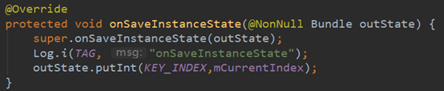
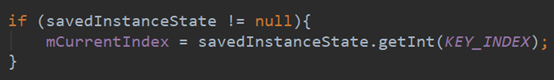
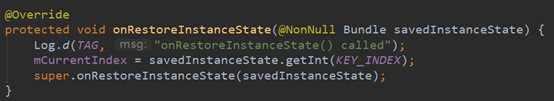

#### 一、生命周期相关问题

<font color='orange'>Q1：一个 A Activity 跳转到一个 B Activity 中，生命周期的走动。点击Back返回呢。</font>

<font color='orange'>Q1-1：如果 B Activity是透明的呢？如果 B Activity是一个Dialog呢？</font>

```java
1）一个 A Activity 跳转到 B Activity 中，生命周期的走动
A：onPause
B：onCreate，onStart，onResume
A：onStop

2）点击Back返回
B：onPause
A：onRestart，onStart，onResume
B：onStop，onDestroy

3）如果B Activity是透明的
A：onPause
B：onCreate，onStart，onResume
A没有onStop了。

此时，返回键Back回到A：
B：onPause
A：onResume
B：onStop，onDestroy

4）如果 B Activity是一个Dialog
A：onPause
B：onCreate->onStart->onResume
A没有onStop了。

此时，返回键Back回到A：
B：onPause
A：onResume
B：onStop，onDestroy
```

注：如果是弹出一个非Activity的Dialog，是不会走onPause的。

小结：

1）中A被完全覆盖，会有onStop，恢复时有onRestart和onStart；

3）、4）中A被部分覆盖，不会有onStop，恢复时只有onResume。

<font color='orange'>Q2：什么时候 Activity 单独走 onPause()不走 onStop()？</font>

<font color='orange'>Q2-1：onStop()一定会执行吗？</font>

启动 `Dialog类型`或`透明的` Activity时，只走onPause。取决于当前Activity是否被完全覆盖，是，则走onStop，否则只走onPause。

<font color='orange'>Q2-2：onPause与onStop的区别？</font>


<font color='orange'>Q3：什么时候 Activity 的 onDestory()不执行？</font>

<font color='orange'>Q3-1：onDestory()一定会执行吗？</font>

当返回栈中仅有一个 Activity 实例时，用户从后台强杀应用程序，会去执行 onDestroy 方法。

当返回栈中存在多个 Activity 实例时，只有栈中的第一个未销毁的 Activity 会执行 onDestroy 方法，其他的则不会执行。比如：从 MainActivity 跳转到activity-A（或者继续从 activity-A 再跳转到 activity-B），这时候从后台强杀，只会执行 MainActivity 的 onDestroy 方法，activity-A（以及 activity-B）的 onDestroy 方法都不会执行。

<font color='orange'>Q4：横竖屏切换时 Activity 的生命周期变化？</font>

和上面的场景（一般情况）不同，横竖屏切换属于特殊情况下生命周期变化。

与横竖屏切换生命周期函数调用有关的属性是"android:configChanges"，关于它的属性值设置影响如下：

- orientation：消除横竖屏的影响
- keyboardHidden：消除键盘的影响
- screenSize：消除屏幕大小的影响

下面看一下横竖屏切换时的生命周期流程：

情况一：当 Activity 的 android:configChanges 属性不设置的时候：

```java
1）启动Activity
onCreate --> 
onStart --> 
onResume

2）切换为横屏
onSaveInstanceState --> 
onPause -->
onStop -->
onDestroy-->
onCreate -->
onStart --> 
onRestoreInstanceState --> 
onResume

3）再次切换为竖屏，执行了两次
onSaveInstanceState-->
onPause-->
onStop-->
onDestroy-->
onCreate-->
onStart-->
onRestoreInstanceState-->
onResume-->

onSaveInstanceState-->
onPause-->
onStop-->
onDestroy-->
onCreate-->
onStart-->
onRestoreInstanceState-->
onResume
```

> 有的手机只会调用一次，可能是手机厂商对源码进行了修改。不同手机、Android版本应该有不同的回调方式。
>
> 我用 vivoX6Plus-Android5.1.1 测试，只会执行一次流程。  

情况二：当我们设置 Activity 的 android:configChanges 属性为 orientation，它的生命周期如下：

```java
4）切换为横屏
onSaveInstanceState-->
onPause-->
onStop-->
onDestroy-->
onCreate-->
onStart-->
onRestoreInstanceState-->
onResume

5）再切换为竖屏，此时不会执行两次生命周期，但是多了一个onConfigurationChanged
onSaveInstanceState-->
onPause-->
onStop-->
onDestroy-->
onCreate-->
onStart-->
onRestoreInstanceState-->
onResume-->
onConfigurationChanged
```

切换为竖屏时，不会执行两次生命周期了，但是调用了 onConfigurationChanged()。

切屏不会重新调用各个生命周期，只会执行onConfigurationChanged方法。

> 有的版本还需要加上 screenSize 才是此效果。即orientation|screenSize|keyboardHidden

总结：

1、不设置Activity的android:configChanges时，切屏会重新调用各个生命周期，
切横屏时会执行一次，切竖屏时会执行两次
2、设置Activity的android:configChanges="orientation"时，切屏还是会重新调
用各个生命周期，切横、竖屏时只会执行一次
3、设置Activity的android:configChanges="orientation|keyboardHidden"时，
切屏不会重新调用各个生命周期，只会执行onConfigurationChanged方法

<font color='orange'>Q4-1：是否了解onConfigurationChanged()？</font>

当Configuration改变后，ActivityManagerService将会发送"配置改变"的广播，会要求ActivityThread 重新启动当前focus的 Activity，这是默认情况，我们不做任何处理。如果我们用android:configChanges来配置 Activity 信息，那么就可以避免对 Activity 销毁再重新创建，而是调用onConfigurationChanged方法。

onConfigurationChanged方法一般与android:configChanges属性成双成对，android:configChanges属性指定了当前 Activity 可以自己处理的”配置信息“，然后调用onConfigurationChanged进行处理。

最常见的就是通过android:configChanges="orientation"告诉系统，当屏幕配置改变时，我们的Activity会自己处理，不需要再次onCreate。

<font color='orange'>Q：Activity调用finish()后怎么走到onDestroy的？</font>


<font color='orange'>Q：两个Activity之间跳转时必然会执行的是哪几个方法？</font>


#### 二、状态保存与恢复相关

<font color='orange'>Q5：说说onSaveInstanceState()和onRestoreInstanceState()？</font>

Activity 的 onSaveInstanceState() 和 onRestoreInstanceState() 并不是生命周期方法，不同于 onCreate()、onPause()等生命周期方法，它们并不一定会被调用。当应用遇到意外情况（如：内存不足、用户直接按 Home 键或者横竖屏切换）由系统销毁一个 Activity 时，onSaveInstanceState() 会被调用。但是当用户主动去销毁一个 Activity 时，例如在应用中按返回键，onSaveInstanceState()就不会被调用。 因为在这种情况下，用户的行为决定了不需要保存 Activity 的状态。

通常 onSaveInstanceState() 只适合用于保存一些临时性的状态，而 onPause()适用于数据的持久化保存。 在 Activity 被杀掉之前调用保存每个实例的状态，确保该状态可以在 onCreate(Bundle) 或者 onRestoreInstanceState(Bundle) (传入的 Bundle参数是由onSaveInstanceState封装好的)中恢复。这个方法在一个activity 被杀死前调用，当该 activity 在将来某个时刻回来时可以恢复其先前状态。例如，如果 activity B 启用后位于 activity A 的前端，在某个时刻 activity A 因为系统回收资源的问题要被杀掉，A 通过 onSaveInstanceState 将有机会保存其用户界面状态，使得将来用户返回到 activity A 时能通过 onCreate(Bundle)或者 onRestoreInstanceState(Bundle)恢复到界面之前的状态。

例：在此方法中对用户写的内容进行保存



并在再次创建活动时恢复：

在onCreate中恢复：需要判断savedInstanceState是否为空。



或者在onRestoreInstanceState()中恢复，不需要判空。



注：需要注意的是， onRestoreInstanceState()的回调是在onStart()之后的，所以如果保存的数据是希望用来恢复界面的，就不太适合放在这里取出了，而应该放到onCreate()中。

<font color='orange'>Q：onSaveInstanceState()的使用场景？</font>


<font color='orange'>Q：onSaveInstanceState()保存的那个参数叫什么？</font>


<font color='orange'>Q：Bundle是什么。Bundle里面都放一些什么东西？</font>


<font color='orange'>Q：Activity是如何保存状态的？</font>


<font color='orange'>Q：Activity保存状态的函数是？</font>


#### 三、Dialog相关

<font color='orange'>Q：Dialog会让Activity调用生命周期方法吗？</font>


<font color='orange'>Q：Dialog会不会影响Activity的生命周期，为什么？</font>


<font color='orange'>Q：Activity上有Dialog的时候按Home键时的生命周期？</font>


<font color='orange'>Q：弹出Dialog，生命周期回调方法。</font>


<font color='orange'>Q：</font>

<font color='orange'>Q：</font>

<font color='orange'>Q：</font>

<font color='orange'>Q：</font>

<font color='orange'>Q：</font>

<font color='orange'>Q：</font>


