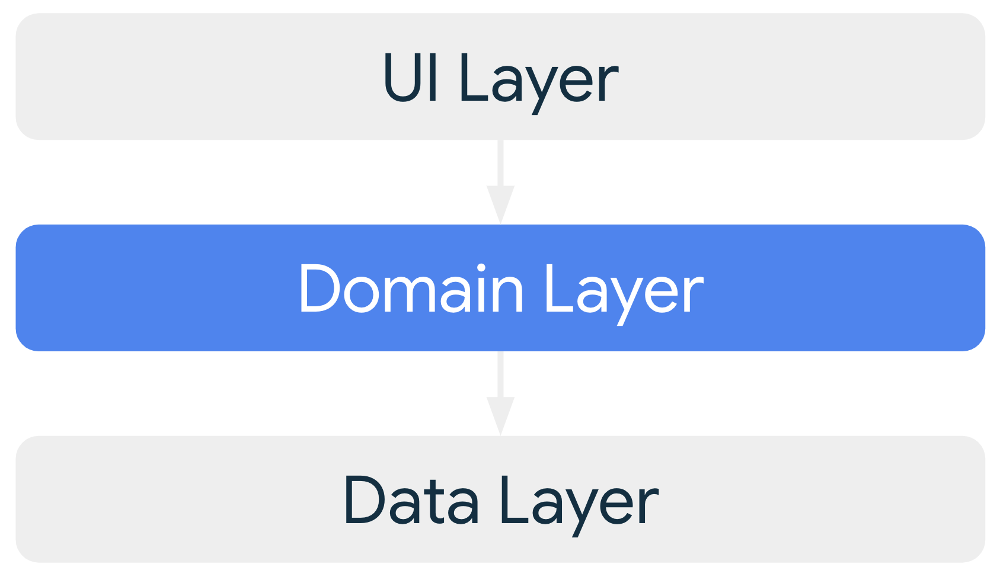
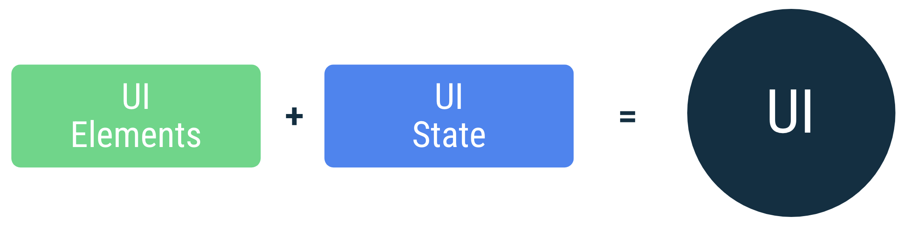
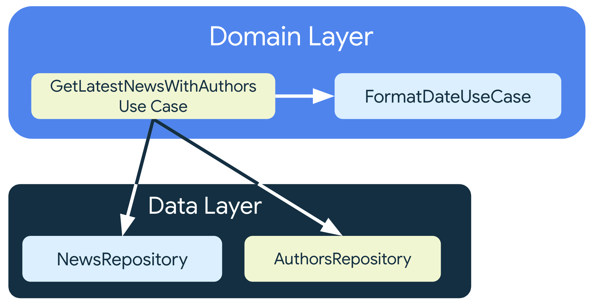

# 应用架构指南

本指南包含一些最佳做法和[推荐架构](https://developer.android.google.cn/topic/architecture?hl=zh-cn#recommended-app-arch)，有助于构建强大而优质的应用。

## 移动应用用户体验

典型的 Android 应用包含多个[应用组件](https://developer.android.google.cn/guide/components/fundamentals?hl=zh-cn#components)，包括 [Activity](https://developer.android.google.cn/guide/components/activities/intro-activities?hl=zh-cn)、[Fragment](https://developer.android.google.cn/guide/fragments?hl=zh-cn)、[Service](https://developer.android.google.cn/guide/components/services?hl=zh-cn)、[内容提供程序](https://developer.android.google.cn/guide/topics/providers/content-providers?hl=zh-cn)和[广播接收器](https://developer.android.google.cn/guide/components/broadcasts?hl=zh-cn)。需要在[应用清单](https://developer.android.google.cn/guide/topics/manifest/manifest-intro?hl=zh-cn)中声明其中的大多数应用组件。Android 系统会使用此文件来决定如何将 App 集成到设备的整体用户体验中。典型的 Android 应用可能包含多个组件，并且用户经常会在短时间内与多个应用进行互动，因此应用需要适应不同类型的用户驱动型工作流和任务。

请注意，由于设备的资源有限，因此系统可能随时终止某些应用进程以便为新的进程腾出空间。

鉴于这种环境条件，应用组件可以不按顺序地单独启动，并且系统或用户可以随时销毁它们。由于这些事件不受 App 的控制，因此不应在内存中存储或保留任何应用数据或状态，并且应用组件不应相互依赖。

## 常见的架构原则

如果不应使用应用组件存储应用数据和状态，那么应该如何设计应用呢？

应用架构务必要能利于应用扩缩（也就是具备好的拓展性和可维护性）、提升应用的稳健性并且方便对应用进行测试。

**应用架构定义了应用各部分的界限及其职责。**为了满足上述需求，应该按照某些特定原则设计应用架构。

### 分离关注点

要遵循的最重要的原则是[分离关注点](https://en.wikipedia.org/wiki/Separation_of_concerns)。 一种常见的错误是在 [`Activity`](https://developer.android.google.cn/reference/android/app/Activity?hl=zh-cn) 或 [`Fragment`](https://developer.android.google.cn/reference/android/app/Fragment?hl=zh-cn) 中编写所有代码。这些基于界面的类应该仅包含处理界面和交互的逻辑。应使这些类尽可能保持精简，这样可以避免许多与组件生命周期相关的问题，并提高这些类的可测试性。

请注意，你并非拥有 `Activity` 和 `Fragment` 的实现；它们只是表示 Android 系统与应用之间关系的粘合类。系统可能会根据用户互动或因内存不足等条件随时销毁它们。为了提供令人满意的用户体验和更易于管理的应用维护体验，最好尽量减少对它们的依赖。

### 通过数据模型驱动界面

另一个重要原则是应该通过数据模型驱动界面（最好是持久性模型）。数据模型代表应用的数据，独立于应用中的界面元素和其他组件，与界面和应用组件的生命周期没有关联，但仍会在系统移除应用进程时被销毁。

持久性模型是理想之选，原因如下：

- 如果系统销毁应用以释放资源，用户不会丢失数据。
- 当网络连接不稳定或不可用时，应用会继续工作。

### 单一数据源

在应用中定义新数据类型时，应为其分配单一数据源 (SSOT，Single source of truth)。SSOT 是该数据的所有者，而且只有此 SSOT 可以修改或转变该数据。为了实现这一点，SSOT 会以不可变类型公开数据；而且为了修改数据，SSOT 会公开函数或接收其他类型可以调用的事件。

此模式具有多种优势：

- 将对特定类型数据的所有更改集中到一处。
- 保护数据，防止其他类型篡改此数据。
- 更易于跟踪对数据的更改。因此，也就更容易发现 bug。

在离线优先应用中，应用数据的单一数据源通常是数据库。在其他某些情况下，单一数据源可以是 ViewModel 甚至是界面。

### 单向数据流

在官方的指南中，[单一数据源原则](#单一数据源)常常与单向数据流 (UDF，Unidirectional Data Flow) 模式一起使用。在 UDF 中，**状态**仅朝一个方向流动。修改数据的**事件**朝相反方向流动。

在 Android 中，状态或数据通常从层次结构中较高范围类型流向较低范围类型。事件通常在层次结构中较低范围类型触发，直到其到达 SSOT 的对应数据类型。例如，应用数据通常从数据源流向界面。用户事件（例如按钮按下操作）从界面流向 SSOT，在 SSOT 中应用数据被修改并以不可变类型公开。

此模式可以更好地保证数据一致性，不易出错、更易于调试，并且具备 SSOT 模式的所有优势。

> 注：这几条原则还是有点抽象的，需要结合实际项目才能加深理解。
>
> 对较高较低范围的理解：我理解这里的范围是指使用范围，比如数据源，使用范围可以是整个应用，影响范围比单个界面要大，所以相对来说数据源是较高范围，界面是较低范围。

## 推荐的应用架构

本部分将演示如何按照建议的最佳做法构建应用。

> **注意**：本页中提供的建议和最佳实践可应用于各种应用。遵循这些建议和最佳实践可以提升应用的可扩展性、质量和稳健性，并可使应用更易于测试。不过，你应该将这些提示视为指南，并视需要进行调整来满足你的要求。

基于上一部分提到的常见架构原则，每个应用应至少有两个层：

- 界面层 - 在屏幕上显示应用数据。
- 数据层 - 包含应用的业务逻辑并公开应用数据。

你可以额外添加一个名为“网域层”的架构层，以简化和重复使用界面层与数据层之间的交互。


**图 1.** 典型应用架构的示意图。

> **注意**：本指南示意图中的箭头表示各个类之间的依赖关系。例如，网域层依赖于数据层类。

### 现代应用架构

现代应用架构鼓励采用以下方法及其他一些方法：

- 反应式分层架构。
- 应用的所有层中的单向数据流 (UDF)。
- 包含状态容器的界面层，用于管理界面的复杂性。
- 协程和数据流。
- 依赖项注入最佳实践。【Hilt 笔记中有介绍】

### 界面层

界面层的作用是在屏幕上显示应用数据。每当数据发生变化时，无论是因为用户互动（例如按了某个按钮），还是因为外部输入（例如网络响应），界面都应随之更新，以反映这些变化。

界面层由以下两部分组成：

- 在屏幕上呈现数据的界面元素。使用 View 或 [Jetpack Compose](https://developer.android.google.cn/jetpack/compose?hl=zh-cn) 实现。
- 用于存储数据、向界面提供数据以及处理逻辑的状态容器（如 [ViewModel](https://developer.android.google.cn/topic/libraries/architecture/viewmodel?hl=zh-cn) 类）。


**图 2.**界面层在应用架构中的作用。

### 数据层

应用的数据层包含*业务逻辑*。业务逻辑决定应用的价值，它包含决定应用如何创建、存储和更改数据的规则。

数据层由多个仓库组成，其中每个仓库都可以包含零到多个数据源。你应该为应用中处理的每种不同类型的数据分别创建一个存储库类。例如，你可以为与电影相关的数据创建一个 `MoviesRepository` 类，或者为与付款相关的数据创建一个 `PaymentsRepository` 类。


**图 3.** 数据层在应用架构中的作用。

存储库类负责以下任务：

- 向应用的其余部分公开数据。
- 集中处理数据变化。
- 解决多个数据源之间的冲突。
- 对应用其余部分的数据源进行抽象化处理。
- 包含业务逻辑。

每个数据源类应仅负责处理一个数据源，数据源可以是文件、网络来源或本地数据库。数据源类是应用与数据操作系统之间的桥梁。

### 领域层 Domain Layer

领域层是位于界面与数据层之间的可选层。

领域层负责封装复杂的业务逻辑，或者由多个 ViewModel 重复使用的简单业务逻辑。此层是可选的，因为并非所有应用都有这类需求。请仅在需要时使用该层，例如处理复杂逻辑或支持可重用性。



**图 4.**领域层在应用架构中的作用。

此层中的类通常称为“用例”或“交互方”。每个用例都应仅负责单个功能。例如，如果多个 ViewModel 依赖时区在屏幕上显示适当的消息，则你的应用可能具有 `GetTimeZoneUseCase` 类。

## 管理组件之间的依赖关系

应用中的类要依赖其他类才能正常工作。可以使用以下任一设计模式来收集特定类的依赖项：

- [依赖注入 (DI)](https://developer.android.google.cn/training/dependency-injection?hl=zh-cn)：依赖注入**使类能够只定义其依赖项而不构造它们**。在运行时，另一个类负责提供这些依赖项。
- [服务定位器](https://en.wikipedia.org/wiki/Service_locator_pattern)：服务定位器模式提供了一个注册表，类可以从中获取其依赖项而不构造它们。

可以借助这些模式来扩展代码，因为它们可提供清晰的依赖项管理模式（无需复制代码，也不会增添复杂性）。 此外，还可以借助这些模式在测试和生产实现之间快速切换。

**我们建议在 Android 应用中采用依赖项注入模式并使用 [Hilt 库](https://developer.android.google.cn/training/dependency-injection/hilt-android?hl=zh-cn)。**Hilt 通过遍历依赖项树自动构造对象，为依赖项提供编译时保证，并为 Android 框架类创建依赖项容器。

## 常见的最佳实践

编程是一个创造性的领域，构建 Android 应用也不例外。 无论是在多个 activity 或 fragment 之间传递数据，检索远程数据并将其保留在本地以在离线模式下使用，还是复杂应用遇到的任何其他常见情况，解决问题的方法都会有很多种。

虽然以下建议不是强制性的，但在大多数情况下，遵循这些建议会使你的代码库更强大、可测试性更高且更易维护：

**不要将数据存储在应用组件中。**

请避免将应用的入口点（如 activity、Service 和广播接收器）指定为数据源。相反，你应只将其与其他组件协调，以检索与该入口点相关的数据子集。每个应用组件存在的时间都很短暂，具体取决于用户与其设备的交互情况以及系统当前的整体运行状况。

**减少对 Android 类的依赖**。

你的应用组件应该是唯一依赖于 Android 框架 SDK API（例如 [`Context`](https://developer.android.google.cn/reference/android/content/Context?hl=zh-cn) 或 [`Toast`](https://developer.android.google.cn/guide/topics/ui/notifiers/toasts?hl=zh-cn)）的类。将应用中的其他类与这些类分离开来有助于改善可测试性，并减少应用中的[耦合](https://en.wikipedia.org/wiki/Coupling_(computer_programming))。

**在应用的各个模块之间设定明确定义的职责界限。**

例如，请勿在代码库中将从网络加载数据的代码散布到多个类或软件包中。同样，也不要将不相关的职责（如数据缓存和数据绑定）定义到同一个类中。遵循[推荐的应用架构](#推荐的应用架构)可以帮助你解决此问题。

**尽量少公开每个模块中的代码。**

例如，请勿试图创建从模块提供内部实现细节的快捷方式。短期内，你可能会省点时间，但随着代码库的不断发展，你可能会反复陷入技术上的麻烦。

**专注于应用的独特核心，以使其从其他应用中脱颖而出。**

不要一次又一次地编写相同的样板代码，这是在做无用功。 相反，你应将时间和精力集中放在能让应用与众不同的方面上，并让 Jetpack 库以及建议的其他库处理重复的样板。

**考虑如何使应用的每个部分可独立测试。**

例如，如果使用明确定义的 API 从网络获取数据，将会更容易测试在本地数据库中保留该数据的模块。如果你将这两个模块的逻辑混放在一处，或将网络代码分散在整个代码库中，那么即便能够进行有效测试，难度也会大很多。

**类型负责其并发政策**。

如果某种类型正在执行长时间运行的阻塞工作，则应负责将该计算移至正确的线程。该特定类型知道它正在执行的计算类型及其应在哪个线程中执行。类型应该具有主线程安全性，这意味着，你可以安全地从主线程调用这些类型而不会阻塞。

**保留尽可能多的相关数据和最新数据**。

这样，即使用户的设备处于离线模式，他们也可以使用你应用的功能。请记住，并非所有用户都能享受到稳定的高速连接 - 即使有时可以使用，在比较拥挤的地方网络信号也可能不佳。

## 架构的优势

在应用中实现良好的架构会为项目和工程团队带来诸多好处：

- 提高整个应用的可维护性、质量和稳健性。
- 允许应用扩缩。尽可能减少代码冲突，使更多人和更多团队可以为同一代码库做贡献。
- 有助于新手上手。架构能使你的项目保持一致性，让团队中的新成员可以快速上手，并在更短时间内提高效率。
- 更易于测试。良好的架构鼓励使用更简单的类型，这些类型通常更易于测试。
- 可以使用明确定义的流程有条理地调查 bug。

在架构方面的投入也会对你的用户产生直接积极影响。用户能从更稳定的应用中获益；同时，由于工程团队效率提高，用户还可以享受更多功能。但是，架构也需要前期时间投入。请阅读这些[案例研究](https://developer.android.google.cn/quality?hl=zh-cn)，了解其他公司在应用中使用良好架构的成功案例，这有助于你向公司其他人员证明时间的合理性。

# 界面层

界面的作用是在屏幕上显示应用数据，并充当主要的用户互动点。每当数据发生变化时，无论是因为用户互动（例如按了某个按钮），还是因为外部输入（例如网络响应），界面都应随之更新，以反映这些变化。实际上，界面是从数据层获取的应用状态的直观呈现。

不过，从数据层获取的应用数据的格式通常不同于你需要显示的信息的格式。例如，你可能只需要在界面中显示部分数据，或者可能需要合并两个不同的数据源，以便提供切合用户需求的信息。无论你应用的是什么逻辑，都需要向界面传递完全呈现界面所需的所有信息。界面层是一个流水线，负责将应用数据变化转换为界面可以呈现的形式，然后将其显示出来。


**图 1.** 界面层在应用架构中的作用。

## 基本案例研究

让我们以一个可获取新闻报道供用户阅读的应用为例。该应用有一个报道屏幕，用于显示可供阅读的报道；另外，该应用允许已登录的用户为真正出众的报道添加书签。考虑到随时都可能有大量的报道，读者应能够按类别浏览报道。总的来说，该应用可让用户执行以下操作：

- 查看报道。
- 按类别浏览报道。
- 登录账号并为特定报道添加书签。
- 使用部分收费功能（如果符合相应条件）。


**图 2.** 界面案例研究使用的示例“新闻”应用。

以下几个部分使用此示例作为案例研究，以便介绍单向数据流的原则，并展示在界面层的应用架构上下文中，这些原则有助于解决的问题。

## 界面层架构

“界面”指用于显示数据的 activity 和 fragment 等界面元素，无论它们使用哪个 API（Views 还是 [Jetpack Compose](https://developer.android.google.cn/jetpack/compose?hl=zh-cn)）来显示数据。由于[数据层](https://developer.android.google.cn/jetpack/guide/data-layer?hl=zh-cn)的作用是存储和管理应用数据，以及提供对应用数据的访问权限，因此界面层必须执行以下步骤：

1. 使用应用数据，并将其转换为界面可以呈现的数据。
2. 使用界面可呈现的数据，并将其转换为用于向用户呈现的界面元素。
3. 使用来自这些组合在一起的界面元素的用户输入事件，并根据需要反映它们对界面数据的影响。
4. 根据需要重复第 1-3 步。

本指南的其余部分展示了如何实现用于执行这些步骤的界面层。具体来说，本指南涵盖以下任务和概念：

- 如何定义界面状态。
- 单向数据流 (UDF)，作为提供和管理界面状态的方式。
- 如何根据 UDF 原则使用可观察数据类型公开界面状态。
- 如何实现使用可观察界面状态的界面。

其中最基本的便是定义界面状态。

## 定义界面状态

界面会显示一个新闻列表，以及每篇新闻的部分元数据。该应用向用户显示的这些信息便是界面状态。

换言之，如果界面是相对用户而言的，那么界面状态就是相对应用而言的。这就像同一枚硬币的两面，界面是界面状态的直观呈现。对界面状态所做的任何更改都会立即反映在界面中。



**图 3.** 界面是将屏幕上的界面元素与界面状态绑定在一起的结果。

为了满足“新闻”应用的要求，可以将完全呈现界面所需的信息封装在如下定义的 `NewsUiState` 数据类中：

```kotlin
data class NewsUiState(
    val isSignedIn: Boolean = false,
    val isPremium: Boolean = false,
    val newsItems: List<NewsItemUiState> = listOf(),
    val userMessages: List<Message> = listOf()
)

data class NewsItemUiState(
    val title: String,
    val body: String,
    val bookmarked: Boolean = false,
    ...
)
```

### 不可变性

以上示例中的界面状态定义是不可变的。这样的主要好处是，不可变对象可保证即时提供应用的状态。这样一来，界面便可专注于发挥单一作用：读取状态并相应地更新其界面元素。因此，切勿直接在界面中修改界面状态，除非界面本身是其数据的唯一来源。违反这个原则会导致同一条信息有多个可信来源，从而导致数据不一致和轻微的 bug。

例如，如果本例中来自界面状态的 `NewsItemUiState` 对象中的 `bookmarked` 标记在 `Activity` 类中已更新，那么该标记会与数据层展开竞争，以争取成为报道的“已添加书签”状态的来源。不可变数据类对于防止此类反模式非常有用。

**要点**：只有数据源或数据所有者才应负责更新其公开的数据。

### 本指南中的命名惯例

在本指南中，界面状态类是根据其描述的屏幕或部分屏幕的功能命名的。具体命名惯例如下：

功能 + UiState。

例如，用于显示新闻的屏幕的状态可以称为 `NewsUiState`，新闻报道列表中的新闻报道的状态可以为 `NewsItemUiState`。

## 使用单向数据流管理状态

上一部分中指出，界面状态是呈现界面所需的详细信息的不可变快照。不过，应用中数据的动态特性意味着状态可能会随时间而变化。这可能是因为用户互动，也可能是因为其他事件修改了用于填充应用的底层数据。

这些互动可以受益于处理它们的 mediator，从而定义要为每个事件应用的逻辑，并对后备数据源执行必要的转换，以便创建界面状态。这些互动及其逻辑可以位于界面本身中，但随着界面开始担任其名称所表明的角色以外的角色（数据所有者、提供方、转换器等），这可能很快就会变得难以掌控。此外，这可能会影响可测试性，因为生成的代码是紧密耦合的代码，没有可辨别的边界。归根结底，界面能够受益于减轻的负担。除非界面状态非常简单，否则界面的唯一职责应该是使用和显示界面状态。

本部分介绍了单向数据流 (UDF)，这是一种架构模式，有助于强制实施这种健康的职责分离。

### 状态容器

符合以下条件的类称为状态容器：负责提供界面状态，并且包含执行相应任务所必需的逻辑。状态容器有多种大小，具体取决于所管理的界面元素的作用域（从[底部应用栏](https://material.io/components/app-bars-bottom)等单个微件，到整个屏幕或导航目的地，不一而足）。

在后一种情况下，典型的实现是 [ViewModel](https://developer.android.google.cn/topic/libraries/architecture/viewmodel?hl=zh-cn) 的实例，不过根据应用的要求，使用简单的类可能就足够了。例如，[案例研究](https://developer.android.google.cn/topic/architecture/ui-layer?hl=zh-cn#case-study)中的“新闻”应用使用 `NewsViewModel` 类作为状态容器，以便为该部分显示的屏幕画面提供界面状态。

**要点**：[`ViewModel`](https://developer.android.google.cn/topic/libraries/architecture/viewmodel?hl=zh-cn) 类型是推荐的实现，用于管理屏幕级界面状态，具有数据层访问权限。此外，它会在配置发生变化后自动继续存在。**`ViewModel` 类用于定义要为应用中的事件应用的逻辑，并提供更新后的状态作为结果**。

可以通过多种方式为界面与其状态提供方之间的互相依赖关系建模。不过，由于界面与其 `ViewModel` 类之间的互动在很大程度上可以理解为事件输入及其随后的状态输出，因此这种关系可以按下图所示来表示：


**图 4.** UDF 在应用架构中的运作方式图示。

状态向下流动、事件向上流动的这种模式称为单向数据流 (UDF)。这种模式对应用架构的影响如下：

- ViewModel 会存储并公开界面要使用的状态。界面状态是经过 ViewModel 转换的应用数据。
- 界面会向 ViewModel 发送用户事件通知。
- ViewModel 会处理用户操作并更新状态。
- 更新后的状态将反馈给界面以进行呈现。
- 系统会对导致状态更改的所有事件重复上述操作。

对于导航目的地或屏幕，ViewModel 会使用存储库或用例类来获取数据并将其转换为界面状态，同时纳入可能会导致状态更改的事件的影响。前面提到的[案例研究](https://developer.android.google.cn/topic/architecture/ui-layer?hl=zh-cn#case-study)包含一个报道列表，其中每篇报道都有标题、说明、来源、作者名称、发布日期，以及是否添加了书签。每篇报道的界面如下所示：


**图 5.** 案例研究应用中的报道界面。

用户请求为报道添加书签就是一个可能会导致状态更改的事件示例。作为状态提供方，ViewModel 的职责是定义所有必需的逻辑，以便填充界面状态中的所有字段，并处理界面完全呈现所需的事件。


**图 6.** UDF 中的事件和数据周期的示意图。

以下几个部分更详细地介绍了导致状态变化的事件，以及如何使用 UDF 处理这些事件。

### 逻辑类型

为报道添加书签就是一个业务逻辑示例。除此之外，还有其他类型的重要逻辑需要定义：

- **业务逻辑**决定着应用数据的产品要求的实现。业务逻辑通常位于网域层或数据层中，但**绝不能位于界面层中**。
- **界面行为逻辑**（即**界面逻辑**）决定着如何在屏幕上显示状态变化。示例包括：使用 Android [`Resources`](https://developer.android.google.cn/reference/android/content/res/Resources?hl=zh-cn) 获取要在屏幕上显示的文本、在用户点击某个按钮时前往特定屏幕，或使用 [消息框](https://developer.android.google.cn/guide/topics/ui/notifiers/toasts?hl=zh-cn)或[信息提示控件](https://developer.android.google.cn/training/snackbar?hl=zh-cn) 显示消息。

界面逻辑（尤其是在涉及 [`Context`](https://developer.android.google.cn/reference/android/content/Context?hl=zh-cn) 等界面类型时）应位于界面中，而非 ViewModel 中。如果界面变得越来越复杂，并且你希望将界面逻辑委托给另一个类，以便有利于进行测试和关注点分离，**你可以创建一个简单的类作为状态容器**。在界面中创建的简单类可以采用 Android SDK 依赖项，因为它们遵循界面的生命周期；ViewModel 对象具有更长的生命周期。

如需详细了解状态容器以及如何利用它们更好地构建界面，请参阅 [Jetpack Compose 状态指南](https://developer.android.google.cn/jetpack/compose/state?hl=zh-cn#managing-state)。

### 为何使用 UDF？

UDF 可为状态提供周期建模（如图 4 所示）。它还可以将以下位置分离开来：状态变化来源位置、转换位置以及最终使用位置。这种分离可让界面只发挥其名称所表明的作用：通过观察状态变化来显示信息，并通过将这些变化传递给 ViewModel 来传递用户 intent。

换句话说，UDF 有助于实现以下几点：

- **数据一致性**。界面只有一个可信来源。
- **可测试性**。状态来源是独立的，因此可独立于界面进行测试。
- **可维护性**。状态的更改遵循明确定义的模式，即状态更改是用户事件及其数据拉取来源共同作用的结果。

## 公开界面状态

定义界面状态并确定如何管理相应状态的提供后，下一步是将提供的状态发送给界面。由于你使用 UDF 管理状态的提供，因此你可以将提供的状态视为数据流，换句话说，随着时间的推移，将提供状态的多个版本。因此，你应在 `LiveData` 或 `StateFlow` 等可观察数据容器中公开界面状态。这样做是为了使界面可以对状态的任何变化做出反应，而无需直接从 ViewModel 手动拉取数据。这些类型还有一个好处是，始终缓存界面状态的最新版本，这对于在配置发生变化后快速恢复状态非常有用。

```kotlin
class NewsViewModel(...) : ViewModel() {

    val uiState: StateFlow<NewsUiState> = …
}
```

> 如需关于将 `LiveData` 用作可观察数据容器的介绍，请参阅[此 Codelab](https://developer.android.google.cn/codelabs/basic-android-kotlin-training-livedata?hl=zh-cn)。如需关于 Kotlin 数据流的类似介绍，请参阅 [Android 上的 Kotlin 数据流](https://developer.android.google.cn/kotlin/flow?hl=zh-cn)。
>
> 在 Jetpack Compose 应用中，可以使用 Compose 的可观察[状态 API](https://developer.android.google.cn/jetpack/compose/state?hl=zh-cn#state-in-composables)（例如 `mutableStateOf` 或 `snapshotFlow`），以便公开界面状态。在 Compose 中，你可以通过适当的[扩展程序](https://developer.android.google.cn/jetpack/compose/libraries?hl=zh-cn#streams)，轻松使用本指南中提到的任何类型的可观察数据容器，例如 `StateFlow` 或 `LiveData`。

如果向界面公开的数据相当简单，通常值得将数据封装在界面状态类型中，因为它能传达出状态容器与其关联的界面元素之间的关系。此外，随着界面元素变得越来越复杂，添加界面状态的定义来容纳呈现界面元素所需的额外信息始终会更加容易。

创建 `UiState` 流的一种常用方法是，将可变数据流作为来自 ViewModel 的不可变数据流进行公开，例如将 `MutableStateFlow<UiState>` 作为 `StateFlow<UiState>` 进行公开。

```kotlin
class NewsViewModel(...) : ViewModel() {

    private val _uiState = MutableStateFlow(NewsUiState())
    val uiState: StateFlow<NewsUiState> = _uiState.asStateFlow()

    ...

}
```

这样一来，ViewModel 便可以公开在内部更改状态的方法，以便发布供界面使用的更新。以需要执行异步操作的情况为例，可以使用 [`viewModelScope`](https://developer.android.google.cn/topic/libraries/architecture/coroutines?hl=zh-cn#viewmodelscope) 启动协程，并且可以在操作完成时更新可变状态。

```kotlin
class NewsViewModel(
    private val repository: NewsRepository,
    ...
) : ViewModel() {

    private val _uiState = MutableStateFlow(NewsUiState())
    val uiState: StateFlow<NewsUiState> = _uiState.asStateFlow()

    private var fetchJob: Job? = null

    fun fetchArticles(category: String) {
        fetchJob?.cancel()
        fetchJob = viewModelScope.launch {
            try {
                val newsItems = repository.newsItemsForCategory(category)
                _uiState.update {
                    it.copy(newsItems = newsItems)
                }
            } catch (ioe: IOException) {
                // Handle the error and notify the UI when appropriate.
                _uiState.update {
                    val messages = getMessagesFromThrowable(ioe)
                    it.copy(userMessages = messages)
                 }
            }
        }
    }
}
```

在上面的示例中，`NewsViewModel` 类会尝试获取特定类别的报道，然后在界面状态中反映尝试结果（成功或失败），其中界面可以对其做出适当反应。如需详细了解错误处理，请参阅[在屏幕上显示错误](https://developer.android.google.cn/topic/architecture/ui-layer?hl=zh-cn#show-errors)部分。

**注意**：单向数据流有多种常用的实现，上面示例中显示的模式（通过 ViewModel 上的函数更改状态）便是其中的一种。

### 其他注意事项

除了前面的指南之外，公开界面状态时还要考虑以下事项：

- **界面状态对象应处理彼此相关的状态。** 这样可以减少不一致的情况，并让代码更易于理解。如果你在两个不同的数据流中分别公开新闻报道列表和书签数量，可能会发现其中一个已更新，但另一个没有更新。当你使用单个数据流时，这两个元素都会保持最新状态。此外，某些业务逻辑可能需要组合使用数据源。例如，可能只有在用户已登录并且是付费新闻服务订阅者时，你才需要显示书签按钮。你可以按如下方式定义界面状态类：

  ```kotlin
  data class NewsUiState(
      val isSignedIn: Boolean = false,
      val isPremium: Boolean = false,
      val newsItems: List<NewsItemUiState> = listOf()
  )
  
  val NewsUiState.canBookmarkNews: Boolean get() = isSignedIn && isPremium
  ```

  在此声明中，书签按钮的可见性是两个其他属性的派生属性。随着业务逻辑变得越来越复杂，拥有单个 `UiState`类，并且其中的所有属性都是立即可用的，变得越来越重要。

- **界面状态：单个数据流还是多个数据流？**是选择在单个数据流中还是在多个数据流中公开界面状态，关键指导原则是前面提到的要点：发出的内容之间的关系。在单个数据流中进行公开的最大优势是便捷性和数据一致性：状态的使用方随时都能立即获取最新信息。不过，在有些情况下，可能适合使用来自 ViewModel 的单独的状态流：

  - **不相关的数据类型**：呈现界面所需的某些状态可能是完全相互独立的。在此类情况下，将这些不同的状态捆绑在一起的代价可能会超过其优势，尤其是当其中某个状态的更新频率高于其他状态的更新频率时。
  - **`UiState` diffing**：`UiState` 对象中的字段越多，数据流就越有可能因为其中一个字段被更新而发出。由于视图没有 diffing 机制来了解连续发出的数据流是否相同，因此每次发出都会导致视图更新。这意味着，可能必须要对 `LiveData` 使用 `Flow` API 或 [`distinctUntilChanged()`](https://kotlin.github.io/kotlinx.coroutines/kotlinx-coroutines-core/kotlinx.coroutines.flow/distinct-until-changed.html) 等方法来缓解这个问题。

## 使用界面状态

如需在界面中使用 `UiState` 对象流，你可以对所使用的可观察数据类型使用终端运算符。例如，对于 `LiveData`，你可以使用 `observe()` 方法；对于 Kotlin 数据流，你可以使用 `collect()` 方法或其变体。

在界面中使用可观察数据容器时，务必考虑界面的生命周期。这非常重要，因为当未向用户显示视图时，界面不应观察界面状态。如需详细了解此主题，请参阅[这篇博文](https://medium.com/androiddevelopers/a-safer-way-to-collect-flows-from-android-uis-23080b1f8bda)。使用 `LiveData` 时，`LifecycleOwner` 会隐式处理生命周期问题。使用数据流时，最好通过适当的协程作用域和 `repeatOnLifecycle` API 来处理这一任务：

```kotlin
class NewsActivity : AppCompatActivity() {

    private val viewModel: NewsViewModel by viewModels()

    override fun onCreate(savedInstanceState: Bundle?) {
        ...

        lifecycleScope.launch {
            repeatOnLifecycle(Lifecycle.State.STARTED) {
                viewModel.uiState.collect {
                    // Update UI elements
                }
            }
        }
    }
}
```

**注意**：本示例中使用的StateFlow对象在没有收集器时也会继续工作，当你使用flows时，你可能不知道flow是如何实现的。使用生命周期感知流集合，你可以稍后对ViewModel流进行更改，而无需重新访问下游收集器代码。

### 显示正在执行的操作

在 `UiState` 类中表示加载状态的一种简单方法是使用布尔值字段：

```kotlin
data class NewsUiState(
    val isFetchingArticles: Boolean = false,
    ...
)
```

此标记的值表示界面中是否存在进度条。

```kotlin
class NewsActivity : AppCompatActivity() {

    private val viewModel: NewsViewModel by viewModels()

    override fun onCreate(savedInstanceState: Bundle?) {
        ...

        lifecycleScope.launch {
            repeatOnLifecycle(Lifecycle.State.STARTED) {
                // Bind the visibility of the progressBar to the state
                // of isFetchingArticles.
                viewModel.uiState
                    .map { it.isFetchingArticles }
                    .distinctUntilChanged()
                    .collect { progressBar.isVisible = it }
            }
        }
    }
}
```

### 在屏幕上显示错误

在界面中显示错误与显示正在执行的操作类似，因为无论是错误，还是正在执行的操作，都能通过用于表明它们是否存在的布尔值来轻松表示。不过，错误可能还包括要传回给用户的关联消息，或包含与其关联的操作（旨在重试失败的操作）。因此，无论正在执行的操作是否正在加载，可能都需要使用托管以下数据的数据类对错误状态进行建模：适合错误上下文的元数据。

在获取报道时会显示进度条。如果此操作导致错误，可能希望向用户显示一条或多条消息，详细说明出现了什么错误。

```kotlin
data class Message(val id: Long, val message: String)

data class NewsUiState(
    val userMessages: List<Message> = listOf(),
    ...
)
```

然后，错误消息便能够以界面元素（例如[信息提示控件](https://material.io/components/snackbars/android)）的形式呈现给用户。由于这与界面事件的提供和使用方式有关，因此请参阅[界面事件](https://developer.android.google.cn/jetpack/guide/ui-layer/events?hl=zh-cn)页面了解详情。

## 线程处理和并发

在 ViewModel 中执行的所有工作都应具有主线程安全性（即从主线程调用是安全的）。这是因为数据层和网域层负责将工作移至其他线程。

如果 ViewModel 执行长时间运行的操作，则还要负责将相应逻辑移至后台线程。Kotlin 协程是管理并发操作的绝佳方式，Jetpack 架构组件则为其提供内置支持。如需详细了解如何在 Android 应用中使用协程，请参阅 [Android 上的 Kotlin 协程](https://developer.android.google.cn/kotlin/coroutines?hl=zh-cn)。

## 导航

应用导航的变化通常是靠发出事件驱动的。例如，在 `SignInViewModel` 类执行登录后，`UiState` 可能会有一个 `isSignedIn` 字段被设为 `true`。此类触发器的使用方式应与上面[使用界面状态](https://developer.android.google.cn/topic/architecture/ui-layer?hl=zh-cn#consume-ui-state)部分介绍的方式相同，不过使用实现应遵从[导航组件](https://developer.android.google.cn/guide/navigation?hl=zh-cn)。

## Paging

[Paging 库](https://developer.android.google.cn/topic/libraries/architecture/paging/v3-overview?hl=zh-cn)通过一个称为 `PagingData` 的类型在界面中使用。由于 `PagingData` 表示并包含可以随时间变化的内容（换句话说，它不是不可变类型），因此它不应以不可变界面状态表示。相反，你应在单独的流中独立地从 ViewModel 中公开它。如需具体示例，请参阅 [Android Paging](https://developer.android.google.cn/codelabs/android-paging?hl=zh-cn) Codelab。

## 动画

为了提供流畅的过渡，你可能需要等待第二个屏幕加载数据，然后再启动动画。Android 视图框架提供了一些钩子，以便通过 [`postponeEnterTransition()`](https://developer.android.google.cn/reference/androidx/fragment/app/Fragment?hl=zh-cn#postponeEnterTransition()) 和 [`startPostponedEnterTransition()`](https://developer.android.google.cn/reference/androidx/fragment/app/Fragment?hl=zh-cn#startPostponedEnterTransition()) API 延迟 fragment 目的地之间的过渡。这些 API 提供了一种方法来确保做到以下一点：在界面通过动画过渡到第二个屏幕之前，第二个屏幕上的界面元素（通常是从网络获取的图片）已做好显示准备。如需了解更多详情和实现细节，请参阅 [Android Motion 示例](https://github.com/android/animation-samples/tree/main/Motion)。

# 界面层-界面事件

“界面事件”是指应由界面或 ViewModel 在界面层处理的操作。最常见的事件类型是“用户事件”。用户通过与应用互动（例如，点按屏幕或生成手势）来生成用户事件。随后，界面会使用 `onClick()` 监听器等回调来使用这些事件。

**关键术语**：

**界面**：用于处理界面的基于视图的代码或 Compose 代码。

**界面事件**：应在界面层处理的操作。

**用户事件**：用户在与应用互动时生成的事件。

ViewModel 通常负责处理特定用户事件的业务逻辑。例如，用户点击某个按钮以刷新部分数据。ViewModel 通常通过公开界面可以调用的函数来处理这种情况。用户事件可能还有界面可以直接处理的界面行为逻辑。例如转到其他屏幕或显示 [`Snackbar`](https://developer.android.google.cn/reference/com/google/android/material/snackbar/Snackbar?hl=zh-cn)。

虽然同一应用的业务逻辑在不同移动平台或设备类型上保持不变，但界面行为逻辑在实现方面可能有所不同。[界面层页](https://developer.android.google.cn/jetpack/guide/ui-layer?hl=zh-cn#logic-types)定义了这些类型的逻辑，如下所示：

- **业务逻辑**是指如何处理状态更改，例如付款或存储用户偏好设置。网域和数据层通常负责处理此逻辑。在本指南中，[架构组件 ViewModel](https://developer.android.google.cn/topic/libraries/architecture/viewmodel?hl=zh-cn) 类用作处理业务逻辑的类的特色解决方案。
- **界面行为逻辑**（即**界面逻辑**）是指如何显示状态更改，例如导航逻辑或如何向用户显示消息。界面会处理此逻辑。

**注意**：本页中提供的建议和最佳实践可应用于广泛的应用。遵循这些建议和最佳实践可以提升应用的可扩展性、质量和稳健性，并使应用更易于测试。不过，你应该将这些提示视为指南，并视需要进行调整来满足你的要求。

## 界面事件决策树

下图这个决策树展示了如何寻找处理特定事件使用场景的最佳实践。本指南的其余部分将详细介绍这些方法。


**图 1.** 事件处理决策树。

## 处理用户事件

如果用户事件与修改界面元素的状态（如可展开项的状态）相关，界面便可以直接处理这些事件。如果事件需要执行业务逻辑（如刷新屏幕上的数据），则应用由 ViewModel 处理此事件。

以下示例展示了如何使用不同的按钮来展开界面元素（界面逻辑）和刷新屏幕上的数据（业务逻辑）：

```kotlin
class LatestNewsActivity : AppCompatActivity() {

    private lateinit var binding: ActivityLatestNewsBinding
    private val viewModel: LatestNewsViewModel by viewModels()

    override fun onCreate(savedInstanceState: Bundle?) {
        /* ... */

        // The expand details event is processed by the UI that
        // modifies a View's internal state.
        binding.expandButton.setOnClickListener {
            binding.expandedSection.visibility = View.VISIBLE
        }

        // The refresh event is processed by the ViewModel that is in charge
        // of the business logic.
        binding.refreshButton.setOnClickListener {
            viewModel.refreshNews()
        }
    }
}
```

### RecyclerView 中的用户事件

如果操作是在界面树中比较靠下一层生成的，例如在 `RecyclerView` 项或自定义 `View` 中，`ViewModel` 应仍是处理用户事件的操作。

例如，假设 `NewsActivity` 中的所有新闻项都包含一个书签按钮。`ViewModel` 需要知道已添加书签的新闻项目的 ID。当用户为新闻内容添加书签时，`RecyclerView` 适配器不会调用 `ViewModel` 中已公开的 `addBookmark(newsId)` 函数，该函数需要一个对 `ViewModel` 的依赖项。取而代之的是，`ViewModel` 会公开一个名为 `NewsItemUiState` 的状态对象，其中包含用于处理事件的实现：

```kotlin
data class NewsItemUiState(
    val title: String,
    val body: String,
    val bookmarked: Boolean = false,
    val publicationDate: String,
    val onBookmark: () -> Unit
)

class LatestNewsViewModel(
    private val formatDateUseCase: FormatDateUseCase,
    private val repository: NewsRepository
)
    val newsListUiItems = repository.latestNews.map { news ->
        NewsItemUiState(
            title = news.title,
            body = news.body,
            bookmarked = news.bookmarked,
            publicationDate = formatDateUseCase(news.publicationDate),
            // Business logic is passed as a lambda function that the
            // UI calls on click events.
            onBookmark = {
                repository.addBookmark(news.id)
            }
        )
    }
}
```

这样，`RecyclerView` 适配器就会仅使用它需要的数据：`NewsItemUiState` 对象列表。该适配器无法访问整个 ViewModel，因此不太可能滥用 ViewModel 公开的功能。如果仅允许 activity 类使用 ViewModel，即表示职责已分开。这样可确保界面专属对象（如视图或 `RecyclerView` 适配器）不会直接与 ViewModel 互动。

**警告**：将 ViewModel 传入 `RecyclerView` 适配器是一种不妥的做法，因为它会将适配器与 ViewModel 类紧密耦合。

**注意**：另一种常见方案是让 `RecyclerView` 适配器具有用于用户操作的 `Callback` 接口。在这种情况下，activity 或 fragment 可以处理绑定，并直接从回调接口调用 ViewModel 函数。

### 用户事件函数的命名惯例

在本指南中，用于处理用户事件的 ViewModel 函数根据其处理的操作（例如，`addBookmark(id)` 或 `logIn(username, password)`）以动词命名。

## 处理 ViewModel 事件

**源自 ViewModel 的界面操作（ViewModel 事件）应始终引发[界面状态](https://developer.android.google.cn/jetpack/guide/ui-layer?hl=zh-cn#expose-ui-state)更新**。这符合[单向数据流](https://developer.android.google.cn/jetpack/guide/ui-layer?hl=zh-cn#udf)的原则。让事件在配置更改后可重现，并保证界面操作不会丢失。如果你使用[已保存的状态模块](https://developer.android.google.cn/topic/libraries/architecture/viewmodel-savedstate?hl=zh-cn)，则还可以让事件在进程终止后可重现（可选操作）。

将界面操作映射到界面状态并不总是一个简单的过程，但确实可以简化逻辑。例如，你不单单要想办法确定如何将界面导航到特定屏幕，还需要进一步思考如何在界面状态中表示该用户流。**换句话说：不需要考虑界面需要执行哪些操作，而是要思考这些操作会对界面状态造成什么影响。**

**要点**：ViewModel 事件应始终会引发界面状态更新。

例如，要考虑在用户登录时从登录屏幕切换到主屏幕的情况。你可以在界面状态中进行如下建模：

```kotlin
data class LoginUiState(
    val isLoading: Boolean = false,
    val errorMessage: String? = null,
    val isUserLoggedIn: Boolean = false
)
```

此界面会对 `isUserLoggedIn` 状态的更改做出响应，并根据需要导航到正确的目的地：

```kotlin
class LoginViewModel : ViewModel() {
    private val _uiState = MutableStateFlow(LoginUiState())
    val uiState: StateFlow<LoginUiState> = _uiState.asStateFlow()
    /* ... */
}

class LoginActivity : AppCompatActivity() {
    private val viewModel: LoginViewModel by viewModels()

    override fun onCreate(savedInstanceState: Bundle?) {
        /* ... */

        lifecycleScope.launch {
            repeatOnLifecycle(Lifecycle.State.STARTED) {
                viewModel.uiState.collect { uiState ->
                    if (uiState.isUserLoggedIn) {
                        // Navigate to the Home screen.
                    }
                    ...
                }
            }
        }
    }
}
```

**注意**：要看懂此部分中的代码示例，需要你了解[协程](https://developer.android.google.cn/kotlin/coroutines?hl=zh-cn)及[如何将协程与生命周期感知型组件一起使用](https://developer.android.google.cn/topic/libraries/architecture/coroutines?hl=zh-cn)。

### 使用事件可能会触发状态更新

使用界面中的某些 ViewModel 事件可能会引发其他界面状态更新。例如，当屏幕上显示瞬时消息以告知用户发生的情况时，界面需要通知 ViewModel 以在消息显示于屏幕上时触发另一状态更新。用户处理消息（通过关闭消息或超时）后发生的事件可被视为“用户输入”，因此 ViewModel 应该知道这一点。在这种情况下，界面状态可按以下方式建模：

```kotlin
// Models the UI state for the Latest news screen.
data class LatestNewsUiState(
    val news: List<News> = emptyList(),
    val isLoading: Boolean = false,
    val userMessage: String? = null
)
```

当业务逻辑需要向用户显示新的瞬时消息时，ViewModel 会更新界面状态，如下所示：

```kotlin
class LatestNewsViewModel(/* ... */) : ViewModel() {

    private val _uiState = MutableStateFlow(LatestNewsUiState(isLoading = true))
    val uiState: StateFlow<LatestNewsUiState> = _uiState

    fun refreshNews() {
        viewModelScope.launch {
            // If there isn't internet connection, show a new message on the screen.
            if (!internetConnection()) {
                _uiState.update { currentUiState ->
                    currentUiState.copy(userMessage = "No Internet connection")
                }
                return@launch
            }

            // Do something else.
        }
    }

    fun userMessageShown() {
        _uiState.update { currentUiState ->
            currentUiState.copy(userMessage = null)
        }
    }
}
```

ViewModel 不需要知道界面如何在屏幕上显示消息；只需要知道有一条用户消息需要显示。显示瞬时消息后，界面需要通知 ViewModel，这会引发另一个界面状态更新并清除 `userMessage` 属性：

```kotlin
class LatestNewsActivity : AppCompatActivity() {
    private val viewModel: LatestNewsViewModel by viewModels()

    override fun onCreate(savedInstanceState: Bundle?) {
        /* ... */

        lifecycleScope.launch {
            repeatOnLifecycle(Lifecycle.State.STARTED) {
                viewModel.uiState.collect { uiState ->
                    uiState.userMessage?.let {
                        // TODO: Show Snackbar with userMessage.

                        // Once the message is displayed and
                        // dismissed, notify the ViewModel.
                        viewModel.userMessageShown()
                    }
                    ...
                }
            }
        }
    }
}
```

尽管消息是瞬态的，但界面状态能够忠实反映每个时间点屏幕上显示的内容。用户消息要么显示，要么不显示。

**注意**：如需了解更高级的用例，其中包含要在屏幕上显示的用户消息列表，请查看 [Jetsnack Compose 示例](https://github.com/android/compose-samples/blob/main/Jetsnack/app/src/main/java/com/example/jetsnack/model/SnackbarManager.kt)。

## 导航事件

导航事件是应用中一种常见的事件类型。如果因用户点按某个按钮而在界面中触发了该事件，界面便会通过以下方式处理该事件：调用导航控制器，或将该事件公开给调用方可组合项。

```kotlin
class LoginActivity : AppCompatActivity() {

    private lateinit var binding: ActivityLoginBinding
    private val viewModel: LoginViewModel by viewModels()

    override fun onCreate(savedInstanceState: Bundle?) {
        /* ... */

        binding.helpButton.setOnClickListener {
            navController.navigate(...) // Open help screen
        }
    }
}
```

如果数据输入需要先进行一些业务逻辑验证，然后才能进行导航，ViewModel 需要将该状态公开给界面。界面会响应该状态变化，并相应地进行导航。[“处理 ViewModel 事件”部分](https://developer.android.google.cn/topic/architecture/ui-layer/events?hl=zh-cn#handle-viewmodel-events)介绍了这种用例。类似代码如下：

```kotlin
class LoginActivity : AppCompatActivity() {
    private val viewModel: LoginViewModel by viewModels()

    override fun onCreate(savedInstanceState: Bundle?) {
        /* ... */

        lifecycleScope.launch {
            repeatOnLifecycle(Lifecycle.State.STARTED) {
                viewModel.uiState.collect { uiState ->
                    if (uiState.isUserLoggedIn) {
                        // Navigate to the Home screen.
                    }
                    ...
                }
            }
        }
    }
}
```

在上面的示例中，应用会按预期运行，因为当前的目的地（即“登录”）不会保留在返回堆栈中。用户按“返回”按钮并不能返回。不过，如果可能发生这种情况，解决方案将需要额外的逻辑。

### 目的地保留在返回堆栈中时的导航事件

如果 ViewModel 设置了某种状态，使其生成从屏幕 A 到屏幕 B 的导航事件，并且屏幕 A 保留在导航返回堆栈中，你可能需要其他逻辑，以免继续自动进入屏幕 B。为实现这一点，你必须设置其他状态，以指示界面是否应该考虑前往其他屏幕。通常，该状态会保留在界面中，因为导航逻辑与界面有关，而与 ViewModel 无关。为了说明这一点，我们来看以下用例。

假设你已进入应用的注册流程。在“出生日期”验证屏幕中，如果用户输入某个日期，当用户点按“继续”按钮时，ViewModel 会验证该日期。ViewModel 会将相应验证逻辑委托给数据层。如果日期有效，用户会进入下一个屏幕。作为一项额外功能，用户可以在不同的注册屏幕之间来回切换，以便在想要更改某些数据时能够进行所需的操作。因此，注册流程中的所有目的地都保留在同一个返回堆栈中。根据这些要求，你可以按如下方式实现此屏幕：

```kotlin
// Key that identifies the `validationInProgress` state in the Bundle
private const val DOB_VALIDATION_KEY = "dobValidationKey"

class DobValidationFragment : Fragment() {

    private var validationInProgress: Boolean = false
    private val viewModel: DobValidationViewModel by viewModels()

    override fun onViewCreated(view: View, savedInstanceState: Bundle?) {
        super.onViewCreated(view, savedInstanceState)
        val binding = // ...
        validationInProgress = savedInstanceState?.getBoolean(DOB_VALIDATION_KEY) ?: false

        binding.continueButton.setOnClickListener {
            viewModel.validateDob()
            validationInProgress = true
        }

        viewLifecycleOwner.lifecycleScope.launch {
            viewModel.uiState
                .flowWithLifecycle(viewLifecycleOwner.lifecycle)
                .collect { uiState ->
                    // Update other parts of the UI ...

                    // If the input is valid and the user wants
                    // to navigate, navigate to the next screen
                    // and reset `validationInProgress` flag
                    if (uiState.isDobValid && validationInProgress) {
                        validationInProgress = false
                        navController.navigate(...) // Navigate to next screen
                    }
                }
        }

        return binding
    }

    override fun onSaveInstanceState(outState: Bundle) {
        super.onSaveInstanceState(outState)
        outState.putBoolean(DOB_VALIDATION_KEY, validationInProgress)
    }
}
```

出生日期验证是 ViewModel 所负责的“业务逻辑”。大多数情况下，ViewModel 会将该逻辑委托给数据层。用于让用户进入下一个屏幕的逻辑属于“界面逻辑”，因为这些要求可能因界面配置而异。例如，在平板电脑上，如果你要同时显示多个注册步骤，那么你可能不希望自动进入其他屏幕。以上代码中的 `validationInProgress` 变量将实现此功能，并处理当出生日期有效且用户想要继续执行后续注册步骤时，界面是否应该自动进行导航。

## 其他用例

如果你认为界面事件用例无法通过界面状态更新得以解决，可能需要重新考虑数据在应用中的流动方式。请考虑以下原则：

- **每个类都应各司其职，不能越界。**界面负责屏幕专属行为逻辑，例如导航调用、点击事件以及获取权限请求。ViewModel 包含业务逻辑，并将结果从层次结构的较低层转换为界面状态。
- **考虑事件的发起点**。请遵循本指南开头介绍的[决策树](https://developer.android.google.cn/topic/architecture/ui-layer/events?hl=zh-cn#decision-tree)，并让每个类各司其职。例如，如果事件源自界面并导致出现导航事件，则必须在界面中处理该事件。某些逻辑可能会委托给 ViewModel，但事件的处理无法完全委托给 ViewModel。
- **如果事件有多个使用方，则当你对某个事件会被使用多次而感到担忧时，可能需要重新考虑你的应用架构。** 同时有多个使用方会导致“恰好交付一次”协定变得非常难以保证，因此复杂性和细微行为的数量也会急剧增加。如果你遇到此问题，不妨考虑提升这些问题在界面树上的层级；你可能需要在层次结构中较高层级设定其他实体。
- **考虑何时需要使用状态。**在某些情况下，你可能不想在应用处于后台时保留使用状态（例如显示 `Toast`）。在这些情况下，请考虑在界面位于前台时使用状态。

**注意**：在某些应用中，你可能会看到 ViewModel 事件通过 [Kotlin 渠道](https://kotlinlang.org/docs/channels.html)或其他响应式数据流提供给界面。当生产方 (ViewModel) 的存在时间比使用方（界面 Compose 或 View）更长时，这些解决方案不能保证这些事件的传递和处理。这可能会导致开发者日后遇到问题，而且对大多数应用来说也是不可接受的用户体验，因为这可能会导致应用处于不一致状态、可能会引入 bug，或者用户可能会错过关键信息。

如果你遇到上述某种情况，请重新考虑这种一次性 ViewModel 事件对你的界面的实际意义。请立即处理这些情况并将其降低为界面状态。界面状态可以更好地表示给定时间点的界面，可以提供更多交付和处理保证，通常更易于测试，并且可以与应用的其余部分保持统一。

如需详细了解为什么不应使用上述 API 以及一些代码示例，请阅读 [ViewModel：一次性事件反模式](https://medium.com/androiddevelopers/viewmodel-one-off-event-antipatterns-16a1da869b95)博文。

# 界面层-状态容器和界面状态

单向数据流 (UDF) 可作为为界面层提供和管理面状态的方式，[界面层指南](https://developer.android.google.cn/topic/architecture/ui-layer?hl=zh-cn)介绍了这种方式。

**图 1**：单向数据流

此外，该指南还重点介绍了将 UDF 管理委托给名为状态容器的特殊类的好处。你可以通过 `ViewModel` 或普通类实现状态容器。本文档详细介绍了状态容器及其在界面层中的作用。

学完本文档后，你应了解如何在界面层中管理应用状态；这就是界面状态生成流水线。你应该能够了解和掌握以下内容：

- 了解界面层中存在的界面状态类型。
- 了解在界面层中对这些界面状态执行的逻辑类型。
- 知道如何选择合适的状态容器实现方式，例如 `ViewModel` 或简单类。

## 界面状态生成流水线的元素

界面状态以及生成该状态的逻辑定义了界面层。

### 界面状态

[界面状态](https://developer.android.google.cn/topic/architecture/ui-layer?hl=zh-cn#define-ui-state)是描述界面的属性。界面状态有两种类型：

- **屏幕界面状态**是需要在屏幕上显示的内容。例如，`NewsUiState` 类可以包含呈现界面所需的新闻报道和其他信息。由于该状态包含应用数据，因此通常会与层次结构中的其他层相关联。
- **界面元素状态**是指界面元素的固有属性，这些属性会影响界面元素的呈现方式。界面元素可能处于显示或隐藏状态，并且可能具有特定的字体、字号或颜色。在 Android View 中，View 会自行管理此状态（因为它本身是有状态的），并公开用于修改或查询其状态的方法。例如，[`TextView`](https://developer.android.google.cn/reference/android/widget/TextView?hl=zh-cn) 类的 [`get`](https://developer.android.google.cn/reference/android/widget/TextView?hl=zh-cn#getText()) 和 [`set`](https://developer.android.google.cn/reference/android/widget/TextView?hl=zh-cn#setText(java.lang.CharSequence)) 方法用于显示该类的文本。在 Jetpack Compose 中，状态在可组合项之外，你甚至可以将状态从可组合项附近提升到执行调用的可组合函数或状态容器中。例如，[`Scaffold`](https://developer.android.google.cn/reference/kotlin/androidx/compose/material/package-summary?hl=zh-cn#Scaffold(androidx.compose.ui.Modifier,androidx.compose.material.ScaffoldState,kotlin.Function0,kotlin.Function0,kotlin.Function1,kotlin.Function0,androidx.compose.material.FabPosition,kotlin.Boolean,kotlin.Function1,kotlin.Boolean,androidx.compose.ui.graphics.Shape,androidx.compose.ui.unit.Dp,androidx.compose.ui.graphics.Color,androidx.compose.ui.graphics.Color,androidx.compose.ui.graphics.Color,androidx.compose.ui.graphics.Color,androidx.compose.ui.graphics.Color,kotlin.Function1)) 可组合项的 [`ScaffoldState`](https://developer.android.google.cn/reference/kotlin/androidx/compose/material/ScaffoldState?hl=zh-cn)。

### 逻辑

界面状态不是静态属性，因为应用数据和用户事件会导致界面状态随时间而变化。逻辑决定了变化的具体细节，包括界面状态的哪些部分发生了变化、为什么发生变化以及应该在何时发生变化。

**图 2**：作为界面状态生成方的逻辑

应用中的逻辑可以是业务逻辑或界面逻辑：

- **业务逻辑**决定着应用数据的产品要求的实现。例如，在新闻阅读器应用中，当用户点按相应按钮时，就会为报道添加书签。这种用于将书签保存到文件或数据库的逻辑通常放置在网域层或数据层中。状态容器通常通过调用这类层公开的方法，将此逻辑委托给相应的层。
- **界面逻辑**决定着如何在屏幕上显示界面状态。例如，在用户选择了某个类别时获取正确的搜索栏提示、滚动至列表中的特定项，或者在用户点击某按钮时便进入特定屏幕的导航逻辑。

## Android 生命周期以及界面状态和逻辑的类型

界面层包含两个部分：一部分依赖于界面生命周期，另一部分不依赖于界面生命周期。这种分离决定了每个部分可用的数据源，因此需要不同类型的界面状态和逻辑。

- **不依赖于界面生命周期**：界面层的这一部分用于处理应用的数据生成层（数据层或网域层），由业务逻辑定义。界面中的生命周期、配置更改和 `Activity` 重新创建可能会影响界面状态生成流水线是否处于活动状态，但不会影响生成的数据的有效性。
- **依赖于界面生命周期**：界面层的这一部分用于处理界面逻辑，受生命周期或配置更改的直接影响。这些更改会直接影响从中读取数据的来源的有效性，因此其状态只会在其生命周期处于活动状态时发生变化。例如运行时权限，以及获取依赖于配置的资源（例如本地化字符串）。

上述内容可用下表总结：

| 不依赖于界面生命周期 | 依赖于界面生命周期 |
| :------------------- | :----------------- |
| 业务逻辑             | 界面逻辑           |
| 屏幕界面状态         |                    |

### 界面状态生成流水线

界面状态生成流水线是指为生成界面状态而执行的步骤。相关步骤包括应用上文定义的各类逻辑，并且完全取决于界面的需求。*有些界面可能会受益于流水线中不依赖于界面生命周期的部分和/或依赖于界面生命周期的部分，也可能不会受益于其中任一部分*。

也就是说，界面层流水线的以下排列是有效的：

- 由界面本身生成和管理的界面状态。例如，一个简单且可重复使用的基本计数器：

  ```kotlin
  @Composable
  fun Counter() {
      // The UI state is managed by the UI itself
      var count by remember { mutableStateOf(0) }
      Row {
          Button(onClick = { ++count }) {
              Text(text = "Increment")
          }
          Button(onClick = { --count }) {
              Text(text = "Decrement")
          }
      }
  }
  ```

- 界面逻辑 → 界面。例如，显示或隐藏允许用户跳转到列表顶部的按钮。

  ```kotlin
  @Composable
  fun ContactsList(contacts: List<Contact>) {
      val listState = rememberLazyListState()
      val isAtTopOfList by remember {
          derivedStateOf {
              listState.firstVisibleItemIndex < 3
          }
      }
  
      // Create the LazyColumn with the lazyListState
      ...
  
      // Show or hide the button (UI logic) based on the list scroll position
      AnimatedVisibility(visible = !isAtTopOfList) {
          ScrollToTopButton()
      }
  }
  ```

- 业务逻辑 → 界面。在屏幕上展示当前用户的照片的界面元素。

  ```kotlin
  @Composable
  fun UserProfileScreen(viewModel: UserProfileViewModel = hiltViewModel()) {
      // Read screen UI state from the business logic state holder
      val uiState by viewModel.uiState.collectAsStateWithLifecycle()
  
      // Call on the UserAvatar Composable to display the photo
      UserAvatar(picture = uiState.profilePicture)
  }
  ```

- 业务逻辑 → 界面逻辑 → 界面。会针对给定界面状态在屏幕上滚动以显示正确信息的界面元素。

  ```kotlin
  @Composable
  fun ContactsList(viewModel: ContactsViewModel = hiltViewModel()) {
      // Read screen UI state from the business logic state holder
      val uiState by viewModel.uiState.collectAsStateWithLifecycle()
      val contacts = uiState.contacts
      val deepLinkedContact = uiState.deepLinkedContact
  
      val listState = rememberLazyListState()
  
      // Create the LazyColumn with the lazyListState
      ...
  
      // Perform UI logic that depends on information from business logic
      if (deepLinkedContact != null && contacts.isNotEmpty()) {
          LaunchedEffect(listState, deepLinkedContact, contacts) {
              val deepLinkedContactIndex = contacts.indexOf(deepLinkedContact)
              if (deepLinkedContactIndex >= 0) {
                // Scroll to deep linked item
                listState.animateScrollToItem(deepLinkedContactIndex)
              }
          }
      }
  }
  ```

如果将这两种逻辑都应用于界面状态生成流水线，则**必须始终先应用业务逻辑，然后再应用界面逻辑**。如果尝试先应用界面逻辑，再应用业务逻辑，则意味着业务逻辑依赖于界面逻辑。下面几部分将深入探讨不同类型的逻辑及其状态容器，从而解释为什么这样做会带来问题。


**图 3**：界面层中的逻辑应用

## 状态容器及其责任

状态容器的责任是存储状态，以便应用读取状态。 在需要逻辑时，它会充当中介，并提供对托管所需逻辑的数据源的访问权限。这样，状态容器就会将逻辑委托给相应的数据源。

这会带来以下好处：

- **简单的界面**：界面仅绑定了其状态。
- **可维护性**：可以对状态容器中定义的逻辑进行迭代，而无需更改界面本身。
- **可测试性**：界面及其状态生成逻辑可独立进行测试。
- **可读性**：代码读者可以清楚地看出界面呈现代码与界面状态生成代码之间的差异。

无论大小或作用域如何，每个界面元素都与其对应的状态容器具有 1 对 1 关系。此外，状态容器必须能够接受和处理任何可能导致界面状态发生变化的用户操作，并且必须生成随后的状态变化。

**注意**：状态容器并非绝对必要。简单的界面可能会托管内嵌到其呈现代码中的逻辑。

### 状态容器的类型

与界面状态和逻辑的类型类似，界面层中有两种类型的状态容器，它们根据自身与界面生命周期的关系而定义：

- 业务逻辑状态容器。
- 界面逻辑状态容器。

以下几个部分更详细地介绍了状态容器的类型，首先讲的就是业务逻辑状态容器。

**注意**：如果界面逻辑状态容器依赖于数据层或网域层中的信息，你应从业务逻辑状态容器向界面逻辑状态容器传递该信息。这是因为与界面逻辑状态容器相比，业务逻辑状态容器的存在期更长，原因是后者不依赖于界面生命周期。

## 业务逻辑及其状态容器

业务逻辑状态容器会处理用户事件，并将数据从数据层或网域层转换为屏幕界面状态。在考虑 Android 生命周期和应用配置更改时，为了提供最佳用户体验，利用业务逻辑的状态容器应具有以下属性：

| 属性                               | 详细信息                                                     |
| :--------------------------------- | :----------------------------------------------------------- |
| 生成界面状态                       | 业务逻辑状态容器负责为其界面提供界面状态。此界面状态通常是处理用户事件以及从网域层和数据层读取数据的结果。 |
| 在 activity 重新创建后保留下来     | 业务逻辑状态容器会在 `Activity` 重新创建后保留其状态和状态处理流水线，从而帮助提供无缝的用户体验。如果会重新创建（通常是在[进程终止](https://developer.android.google.cn/guide/components/activities/process-lifecycle?hl=zh-cn)后）状态容器，但无法保留其状态，则状态容器必须能够轻松地重新创建最近一个状态，以确保一致的用户体验。 |
| 具有长期存在的状态                 | 业务逻辑状态容器通常用于管理导航目的地的状态。因此，它们往往会在导航发生变化时保留其状态，直到从导航图中移除它们为止。 |
| 对界面来说独一无二，且不可重复使用 | 业务逻辑状态容器通常会针对某个应用函数（如 `TaskEditViewModel` 或 `TaskListViewModel`）生成状态，因此仅适用于该应用函数。同一状态容器可以支持在不同外形规格的设备上使用这些应用函数。例如，应用的手机版本、电视版本和平板电脑版本都可以重复使用同一个业务逻辑状态容器。 |

**注意**：业务逻辑状态容器通常使用 [`ViewModel`](https://developer.android.google.cn/topic/libraries/architecture/viewmodel?gclid=CjwKCAjwv-GUBhAzEiwASUMm4jGM5Xw9jQrNGwjdH6dspujLXTiJAfDYLC3bOuur7QFYn1tRnojAKRoCqE0QAvD_BwE&%3Bgclsrc=aw.ds&hl=zh-cn) 实例来实现，因为 `ViewModel` 实例支持上述很多功能，尤其是在 `Activity` 重新创建后仍然有效。

例如，设想一下[“Now in Android](https://github.com/android/nowinandroid)”应用中的作者导航目的地：


**图 4**：Now in Android 应用

在本例中，作为业务逻辑状态容器，[`AuthorViewModel`](https://github.com/android/nowinandroid/blob/main/feature-author/src/main/java/com/google/samples/apps/nowinandroid/feature/author/AuthorViewModel.kt) 会生成界面状态：

```Kotlin
@HiltViewModel
class AuthorViewModel @Inject constructor(
    savedStateHandle: SavedStateHandle,
    private val authorsRepository: AuthorsRepository,
    newsRepository: NewsRepository
) : ViewModel() {

    val uiState: StateFlow<AuthorScreenUiState> = …

    // Business logic
    fun followAuthor(followed: Boolean) {
      …
    }
}
```

请注意，`AuthorViewModel` 具有之前概述的属性：

| 属性                             | 详细信息                                                     |
| :------------------------------- | :----------------------------------------------------------- |
| 生成 `AuthorScreenUiState`       | `AuthorViewModel` 从 `AuthorsRepository` 和 `NewsRepository` 中读取数据，并使用这些数据来生成 `AuthorScreenUiState`。通过委托给 `AuthorsRepository`，它还会在用户希望关注或取消关注 `Author` 时应用业务逻辑。 |
| 有权访问数据层                   | 将 `AuthorsRepository` 和 `NewsRepository` 的实例传递至其构造函数，从而让其实现遵循 `Author` 的业务逻辑。 |
| 在 `Activity` 重新创建后仍然有效 | 由于它是使用 [`ViewModel`](https://developer.android.google.cn/topic/libraries/architecture/viewmodel?gclid=Cj0KCQjw4uaUBhC8ARIsANUuDjWnr2D2RL5QDLrOFZBl4TQSF7AF4hkuEEtsz1EV3fbPN-6DD4PLH1MaAvF1EALw_wcB&gclsrc=aw.ds&hl=zh-cn) 实现的，因此会在快速重新创建 `Activity` 后保留下来。在进程终止情形中，可以读取 [`SavedStateHandle`](https://developer.android.google.cn/topic/libraries/architecture/viewmodel-savedstate?hl=zh-cn) 对象，以提供从数据层恢复界面状态所需的最少量信息。 |
| 具有长期存在的状态               | `ViewModel` 的作用域限定为导航图，因此，除非从导航图中移除作者目标位置，否则 `uiState``StateFlow` 中的界面状态会保留在内存中。使用 `StateFlow` 还增加了通过应用业务逻辑来产生状态延迟的优势，因为只有当存在界面状态的收集器时才会生成状态。 |
| 对界面来说独一无二               | `AuthorViewModel` 仅适用于作者导航目的地，不能在其他地方重复使用。如果存在任何可为不同导航目的地重复使用的业务逻辑，该业务逻辑必须封装在数据层或网域层范围的组件中。 |

**注意**：你只能将 `ViewModel` 用于目标位置级界面，而不应将其用于界面中可重复使用的部分，例如搜索栏或条状标签组。在这些情况下，更适合使用普通类。

**警告**：请勿将 ViewModel 实例向下传递到其他可组合函数。 这样做会导致可组合函数与 ViewModel 类型形成耦合，从而降低其可重用性，而且会更难以测试和预览。此外，没有明确的单一数据源 (SSOT) 可以管理 ViewModel 实例。向下传递 ViewModel 可允许多个可组合项调用 ViewModel 函数并修改其状态，从而导致更难以调试 bug。作为替代方案，请遵循 UDF 最佳实践并仅向下传递必要的状态。同样，请向上传递传播事件，直到它们到达 ViewModel 的可组合 SSOT。这是负责处理事件并调用相应 ViewModel 方法的 SSOT。

### 将 ViewModel 用作业务逻辑状态容器

**ViewModel 在 Android 开发中的优势**使其适用于提供对业务逻辑的访问权限以及准备要在屏幕上呈现的应用数据。这些优势包括如下各项：

- ViewModel 触发的操作在配置发生变化后仍然有效。
- 与 Navigation 集成：
  - 当屏幕位于返回堆栈中时，Navigation 会缓存 ViewModel。这对在返回目标位置时即时提供之前加载的数据非常重要。使用遵循可组合项屏幕的生命周期的状态容器时，这种情况会更难处理。
  - 当目标位置从返回堆栈弹出后，ViewModel 也会被一并清除，以确保自动清理状态。这不同于监听可组合项的处理，监听的原因可能有多种，例如转到新屏幕、配置发生变化等。
- 与其他 Jetpack 库（如 [Hilt](https://developer.android.google.cn/training/dependency-injection/hilt-jetpack?hl=zh-cn#compose)）集成。

**注意**：如果 `ViewModel` 的优势不适用于你的用例，或者你以其他方式执行操作，则可以将 ViewModel 的责任转移到对普通状态容器类中。

## 界面逻辑及其状态容器

界面逻辑是对界面本身提供的数据执行操作的逻辑。它可能依赖于界面元素的状态或界面数据源（如权限 API 或 [`Resources`](https://developer.android.google.cn/reference/android/content/res/Resources?hl=zh-cn)）。利用界面逻辑的状态容器通常具有以下属性：

- **生成界面状态并管理界面元素状态**。
- **在 `Activity` 重新创建后不再有效**：托管在界面逻辑中的状态容器通常依赖于界面本身的数据源，并且在很多情况下，尝试在配置发生变化后保留此信息会导致内存泄漏。如果状态容器需要数据在配置发生变化后保持不变，则需要将其委托给更适合在 `Activity` 重新创建后继续留存的其他组件。例如，在 Jetpack Compose 中，使用 `remembered` 函数创建的可组合界面元素状态通常会委托给 `rememberSaveable`，以便在 `Activity` 重新创建后保留状态。此类函数的示例包括 `rememberScaffoldState()` 和 `rememberLazyListState()`。
- **引用了界面范围的数据源**：生命周期 API 和资源等数据源可以安全地引用和读取，因为界面逻辑状态容器与界面具有相同的生命周期。
- **可在多个不同的界面中重复使用**：同一界面逻辑状态容器的不同实例可以在应用的不同部分中重复使用。例如，用于管理条状标签组的用户输入事件的状态容器可用在过滤条件块的搜索页上，也可以用于表示电子邮件接收者的“收件人”字段。

界面逻辑状态容器通常使用普通类实现。这是因为界面本身负责创建界面逻辑状态容器，而界面逻辑状态容器与界面本身具有相同的生命周期。例如，在 Jetpack Compose 中，状态容器是组合的一部分，并遵循组合的生命周期。

**注意**：当界面逻辑足够复杂，可以移出界面时，会使用普通类状态容器。否则，界面逻辑可以在界面中以内嵌方式实现。

在下面的示例中，[Now in Android 示例](https://github.com/android/nowinandroid)演示了上述操作：


**图 5**：Now in Android 示例应用

Now in Android 示例会根据设备的屏幕大小来显示用于导航的底部应用栏或导航栏。较小的屏幕使用底部应用栏，较大的屏幕则使用导航栏。

由于决定 `NiaApp` 可组合函数中使用的适当导航界面元素的逻辑不依赖于业务逻辑，因此可以通过名称为 [`NiaAppState`](https://github.com/android/nowinandroid/blob/main/app/src/main/java/com/google/samples/apps/nowinandroid/ui/NiaAppState.kt) 的普通类状态容器来管理：

```kotlin
@Stable
class NiaAppState(
    val navController: NavHostController,
    val windowSizeClass: WindowSizeClass
) {

    // UI logic
    val shouldShowBottomBar: Boolean
        get() = windowSizeClass.widthSizeClass == WindowWidthSizeClass.Compact ||
            windowSizeClass.heightSizeClass == WindowHeightSizeClass.Compact

    // UI logic
    val shouldShowNavRail: Boolean
        get() = !shouldShowBottomBar

   // UI State
    val currentDestination: NavDestination?
        @Composable get() = navController
            .currentBackStackEntryAsState().value?.destination

    // UI logic
    fun navigate(destination: NiaNavigationDestination, route: String? = null) { /* ... */ }

     /* ... */
}
```

在上面的示例中，关于 `NiaAppState` 的以下详细信息值得注意：

- **在 `Activity` 重新创建后不再有效**：通过使用遵循 Compose 命名惯例的可组合函数 [`rememberNiaAppState`](https://github.com/android/nowinandroid/blob/main/app/src/main/java/com/google/samples/apps/nowinandroid/ui/NiaAppState.kt#L46) 创建 `NiaAppState`，在组合中 `remembered` 了该容器。重新创建 `Activity` 后，之前的实例会丢失，并会使用传入的所有依赖项（适用于重新创建的 `Activity` 的新配置）创建一个新实例。这些依赖项可能是新的，也可能是根据以前的配置恢复的。例如，`NiaAppState` 构造函数中使用了 `rememberNavController()`，后者会委托给 `rememberSaveable` 以在重新创建 `Activity` 的过程中保留状态。
- **引用了界面范围的数据源**：对 `navigationController`、`Resources` 和其他类似生命周期范围的类型的引用可以安全地保存在 `NiaAppState` 中，因为它们具有相同的生命周期作用域。

**注意**：建议为可重用的界面部分（如搜索栏或条状标签组）使用普通状态容器类。在这种情况下，你不应使用 ViewModel，因为 ViewModel 最适合用于管理导航目的地的状态和对业务逻辑的访问权限。

## 为状态容器选择 ViewModel 和普通类

在上面几部分中，选择 `ViewModel` 还是普通类状态容器取决于对界面状态应用的逻辑以及执行该逻辑的数据源。

**注意**：大多数应用会选择执行内嵌在界面本身中的界面逻辑，而这些逻辑原本可以放在普通类状态容器中。这适用于简单的情况，但在其他情况下，你可以通过将逻辑拉取到普通类状态容器中来提高可读性。

总而言之，下图显示了状态容器在界面状态生成流水线中的位置：


**图 6**：界面状态生成流水线中的状态容器。箭头表示数据流。

**最终，你应根据离使用界面状态的位置最近的状态容器生成界面状态**。一项不太正式的原则是，在尽可能低的位置存储状态，同时保留适当的所有权。如果你需要使用业务逻辑并且希望只要导航到某个屏幕，界面状态就会持续存在（即使是在 `Activity` 重新创建后），那么 [`ViewModel`](https://developer.android.google.cn/topic/libraries/architecture/viewmodel?gclid=Cj0KCQjw4uaUBhC8ARIsANUuDjWnr2D2RL5QDLrOFZBl4TQSF7AF4hkuEEtsz1EV3fbPN-6DD4PLH1MaAvF1EALw_wcB&%3Bgclsrc=aw.ds&hl=zh-cn) 是实现业务逻辑状态容器的合适之选。对于存在时间较短的界面状态和界面逻辑，使用生命周期仅依赖于界面的普通类应该就足够了。

## 状态容器可组合

状态容器可以依赖于另一个状态容器，前提是依赖项的生命周期与状态容器相同或更短。示例如下：

- 界面逻辑状态容器可以依赖于另一个界面逻辑状态容器。
- 屏幕级状态容器可以依赖于界面逻辑状态容器。

以下代码段展示了 [Compose 的 `DrawerState`](https://developer.android.google.cn/reference/kotlin/androidx/compose/material/DrawerState?hl=zh-cn) 如何依赖于另一个内部状态容器，即 [`SwipeableState`](https://developer.android.google.cn/reference/kotlin/androidx/compose/material/SwipeableState?hl=zh-cn)；还展示了应用的界面逻辑状态容器可以如何依赖于 `DrawerState`：

```kotlin
@Stable
class DrawerState(/* ... */) {
  internal val swipeableState = SwipeableState(/* ... */)
  // ...
}

@Stable
class MyAppState(
  private val drawerState: DrawerState,
  private val navController: NavHostController
) { /* ... */ }

@Composable
fun rememberMyAppState(
  drawerState: DrawerState = rememberDrawerState(DrawerValue.Closed),
  navController: NavHostController = rememberNavController()
): MyAppState = remember(drawerState, navController) {
  MyAppState(drawerState, navController)
}
```

**注意**： 鉴于屏幕级状态容器管理一个屏幕或部分屏幕的业务逻辑复杂性，因此屏幕级状态容器依赖于另一个屏幕级状态容器将毫无意义。如果你遇到这种情况，请重新考虑相关屏幕和状态容器，确定你是否真的需要这样做。

举例来说，如果界面逻辑状态容器依赖于屏幕级状态容器，那么依赖项的生命周期就比状态容器更长。这会降低生命周期较短的状态容器的可重用性，并使其能够访问超出实际需要的逻辑和状态。

如果生命周期较短的状态容器需要来自较高层级范围的状态容器的某些信息，请仅将它需要的信息作为参数传递，而不是传递状态容器实例。例如，在以下代码段中，界面逻辑状态容器类仅从 ViewModel 接收所需信息，而不是将整个 ViewModel 实例作为依赖项传递。

```kotlin
class MyScreenViewModel(/* ... */) {
  val uiState: StateFlow<MyScreenUiState> = /* ... */
  fun doSomething() { /* ... */ }
  fun doAnotherThing() { /* ... */ }
  // ...
}

@Stable
class MyScreenState(
  // DO NOT pass a ViewModel instance to a plain state holder class
  // private val viewModel: MyScreenViewModel,

  // Instead, pass only what it needs as a dependency
  private val someState: StateFlow<SomeState>,
  private val doSomething: () -> Unit,

  // Other UI-scoped types
  private val scaffoldState: ScaffoldState
) {
  /* ... */
}

@Composable
fun rememberMyScreenState(
  someState: StateFlow<SomeState>,
  doSomething: () -> Unit,
  scaffoldState: ScaffoldState = rememberScaffoldState()
): MyScreenState = remember(someState, doSomething, scaffoldState) {
  MyScreenState(someState, doSomething, scaffoldState)
}

@Composable
fun MyScreen(
  modifier: Modifier = Modifier,
  viewModel: MyScreenViewModel = viewModel(),
  state: MyScreenState = rememberMyScreenState(
    someState = viewModel.uiState.map { it.toSomeState() },
    doSomething = viewModel::doSomething
  ),
  // ...
) {
  /* ... */
}
```

下图显示了上一个代码段中界面与不同状态容器之间的依赖关系：

**图 7**：依赖于不同状态容器的界面。箭头表示依赖关系。

# 界面层-界面状态生成

现在，静态界面已十分罕见。当用户与界面互动或应用需要显示新数据时，界面状态会发生变化。

本文档将介绍界面状态的生成和管理指南。阅读完本文档后，你应能够：

- 了解应使用哪些 API 来生成界面状态。这取决于状态容器 (state holder) 中可用的状态变化来源的性质，并遵循[单向数据流](https://developer.android.google.cn/topic/architecture/ui-layer?hl=zh-cn#udf)原则。
- 了解你应该如何限定界面状态生成的作用域，以便密切注意系统资源。
- 了解应该如何公开界面状态以供界面使用。

从根本上说，状态生成是将这些变化逐步应用于界面状态的过程。状态始终存在，并且会随着事件而发生变化。下表总结了事件和状态之间的差异：

| 事件                               | 状态             |
| :--------------------------------- | :--------------- |
| 暂时性、不可预测，且存在时间有限。 | 始终存在。       |
| 状态生成的输入。                   | 状态生成的输出。 |
| 界面或其他来源的生成对象。         | 供界面使用。     |

以下总结可以很好地帮助你记住二者的区别：**状态始终存在，而事件则不时发生**。下图以时间轴的形式直观展示了在事件发生时的状态变化。每个事件都由适当的[状态容器](https://developer.android.google.cn/topic/architecture/ui-layer/stateholders?hl=zh-cn)进行处理，这会导致状态发生变化：

**图 1**：事件导致状态发生变化

事件可能来自以下来源：

- **用户**：当用户与应用界面进行互动时。
- **状态变化的其他来源**：呈现来自界面层、网域层或数据层的应用数据（示例分别为信息条超时事件、用例或仓库）的 API。

## 界面状态生成流水线

Android 应用中的状态生成可以理解为一种处理流水线，其中包含：

- 输入：状态变化的来源。这些来源可能包括：
  - 界面层本地：可能是用户事件（例如用户在任务管理应用中输入“待办事项”的标题），也可能是提供对[界面逻辑](https://developer.android.google.cn/topic/architecture/ui-layer/stateholders?hl=zh-cn#ui-logic)的访问权限的 API，这些事件/API 会导致界面状态发生变化。例如，在 Jetpack Compose 中对 [`DrawerState`](https://developer.android.google.cn/reference/kotlin/androidx/compose/material/DrawerState?hl=zh-cn) 调用 [`open`](https://developer.android.google.cn/reference/kotlin/androidx/compose/material/DrawerState?hl=zh-cn#open()) 方法。
  - 界面层外部：这些来源来自网域层或数据层，并会导致界面状态发生变化。例如，从 `NewsRepository` 或其他事件完成加载的新闻。
  - 以上各项兼而有之。
- [**状态容器**](https://developer.android.google.cn/topic/architecture/ui-layer/stateholders?hl=zh-cn)：用于将[业务逻辑](https://developer.android.google.cn/topic/architecture/ui-layer/stateholders?hl=zh-cn#business-logic)和/或[界面逻辑](https://developer.android.google.cn/topic/architecture/ui-layer/stateholders?hl=zh-cn#ui-logic)应用于状态变化来源并处理用户事件以生成界面状态的类型。
- **输出**：应用可以呈现以向用户提供所需信息的界面状态。

**图 2**：状态生成流水线

## 状态生成 API

状态生成过程主要用到两个 API，具体取决于你处于流水线的哪个阶段：

| 流水线阶段 | API                                                          |
| :--------- | :----------------------------------------------------------- |
| 输入       | 你应使用异步 API 在界面线程外执行工作，以保证界面不会卡顿。 例如 Kotlin 中的协程或 Flow，以及 Java 编程语言中的 RxJava 或回调。 |
| 输出       | 当状态发生变化时，你应使用可观测的数据容器 API 使界面失效并重新渲染。例如 StateFlow、Compose State 或 LiveData。可观测的数据容器可保证界面始终具有要在屏幕上显示的界面状态 |

在这两者中，与对用于输出的可观测 API 的选择相比，对用于输入的异步 API 的选择对于状态生成流水线的性质具有更大的影响。这是因为输入**决定了可能应用于流水线的处理的类型**。

## 状态生成流水线组建

后续部分将介绍各种输入最适合采用的状态生成技术，以及匹配的输出 API。每个状态生成流水线都是输入和输出的组合，并应满足以下条件：

- **可感知生命周期**：如果界面不可见或未处于活动状态，除非明确要求，否则状态生成流水线不应消耗任何资源。
- **易于使用**：界面应能够轻松呈现生成的界面状态。状态生成流水线输出的相关注意事项因不同的 View API（例如 View 系统或 Jetpack Compose）而异。

**注意**：在接下来的部分中，我们讨论的所有 API 都使用惯用的 Kotlin 和 Jetpack Compose 代码。不过，对于 Java 编程语言或 Kotlin 的其他 API 中等效的类似代码，此指南同样适用。

## 状态生成流水线中的输入

状态生成流水线中的输入可以通过以下方式提供其状态变化来源：

- 可能是同步或异步的一次性操作，例如对 `suspend` 函数的调用。
- 流 API，例如 `Flows`。
- 以上二者兼用。

以下各部分介绍了如何为上述每项输入组建状态生成流水线。

### 使用一次性 API 作为状态变化来源

将 [`MutableStateFlow`](https://kotlinlang.org/api/kotlinx.coroutines/kotlinx-coroutines-core/kotlinx.coroutines.flow/-mutable-state-flow/) API 用作可观测的可变状态容器。在 Jetpack Compose 应用中，你还可以考虑 [`mutableStateOf`](https://developer.android.google.cn/reference/kotlin/androidx/compose/runtime/package-summary?hl=zh-cn#mutableStateOf(kotlin.Any,androidx.compose.runtime.SnapshotMutationPolicy))，尤其是在使用 [Compose Text API](https://medium.com/androiddevelopers/effective-state-management-for-textfield-in-compose-d6e5b070fbe5) 时。这两个 API 都提供了允许对它们托管的值进行安全原子更新的方法（无论更新是同步的还是异步的）。

以简单的掷骰子应用中的状态更新为例。用户每次掷骰子都会调用同步 [`Random.nextInt()`](https://kotlinlang.org/api/latest/jvm/stdlib/kotlin.random/next-int.html) 方法，并且系统会将结果写入界面状态。

```kotlin
data class DiceUiState(
    val firstDieValue: Int? = null,
    val secondDieValue: Int? = null,
    val numberOfRolls: Int = 0,
)

class DiceRollViewModel : ViewModel() {

    private val _uiState = MutableStateFlow(DiceUiState())
    val uiState: StateFlow<DiceUiState> = _uiState.asStateFlow()

    // Called from the UI
    fun rollDice() {
        _uiState.update { currentState ->
            currentState.copy(
            firstDieValue = Random.nextInt(from = 1, until = 7),
            secondDieValue = Random.nextInt(from = 1, until = 7),
            numberOfRolls = currentState.numberOfRolls + 1,
            )
        }
    }
}
```

#### 通过异步调用更改界面状态

对于需要异步结果的状态更改，请在相应的 `CoroutineScope` 中启动协程。这样，在 `CoroutineScope` 取消后，应用便会舍弃相应工作。然后，状态容器会将挂起方法调用的结果写入用于公开界面状态的可观测 API。

以[架构示例](https://github.com/android/architecture-samples)中的 `AddEditTaskViewModel` 为例。当挂起的 `saveTask()` 方法异步保存任务时，MutableStateFlow 上的 [`update`](https://kotlinlang.org/api/kotlinx.coroutines/kotlinx-coroutines-core/kotlinx.coroutines.flow/update.html) 方法会将状态变化传播到界面状态。

```kotlin
data class AddEditTaskUiState(
    val title: String = "",
    val description: String = "",
    val isTaskCompleted: Boolean = false,
    val isLoading: Boolean = false,
    val userMessage: String? = null,
    val isTaskSaved: Boolean = false
)

class AddEditTaskViewModel(...) : ViewModel() {

   private val _uiState = MutableStateFlow(AddEditTaskUiState())
   val uiState: StateFlow<AddEditTaskUiState> = _uiState.asStateFlow()

   private fun createNewTask() {
        viewModelScope.launch {
            val newTask = Task(uiState.value.title, uiState.value.description)
            try {
                tasksRepository.saveTask(newTask)
                // Write data into the UI state.
                _uiState.update {
                    it.copy(isTaskSaved = true)
                }
            }
            catch(cancellationException: CancellationException) {
                throw cancellationException
            }
            catch(exception: Exception) {
                _uiState.update {
                    it.copy(userMessage = getErrorMessage(exception))
                }
            }
        }
    }
}
```

**注意** ：协程在 [AAC](https://developer.android.google.cn/topic/libraries/architecture/viewmodel?hl=zh-cn) [`ViewModel`](https://developer.android.google.cn/topic/libraries/architecture/viewmodel?hl=zh-cn) 的 `viewModelScope` 中启动，无论出现异常情况或其他情况，都会运行至结束。无论界面是否可见，这都会发生，除非显式取消了协程或清除了 `ViewModel`。对大多数请求来说，这通常没什么问题，因为这些请求往往是短期的。你不应使用 `viewModelScope` 运行持续 5 秒或更长时间的请求。相反，你应该使用 WorkManager 将它们作为推迟或长期运行的工作加入队列。

#### 通过后台线程更改界面状态

最好在主调度程序上启动协程以生成界面状态。也就是说，在以下代码段中的 `withContext` 代码块之外。不过，如果你需要在其他后台上下文中更新界面状态，可以通过使用以下 API 来实现：

- 使用 [`withContext`](https://kotlinlang.org/api/kotlinx.coroutines/kotlinx-coroutines-core/kotlinx.coroutines/with-context.html) 方法可在其他并发上下文中运行协程。
- 使用 `MutableStateFlow` 时，照常使用 [`update`](https://kotlinlang.org/api/kotlinx.coroutines/kotlinx-coroutines-core/kotlinx.coroutines.flow/update.html) 方法。
- 使用 Compose State 时，使用 [`Snapshot.withMutableSnapshot`](https://developer.android.google.cn/reference/kotlin/androidx/compose/runtime/snapshots/Snapshot.Companion?hl=zh-cn#withMutableSnapshot(kotlin.Function0)) 来保证在并发上下文中对 State 进行原子更新。

例如，假设在下面的 `DiceRollViewModel` 代码段中，`SlowRandom.nextInt()` 是一个计算密集型 `suspend` 函数，需要从受 CPU 限制的协程进行调用。

```kotlin
class DiceRollViewModel(
    private val defaultDispatcher: CoroutineScope = Dispatchers.Default
) : ViewModel() {

    private val _uiState = MutableStateFlow(DiceUiState())
    val uiState: StateFlow<DiceUiState> = _uiState.asStateFlow()

  // Called from the UI
  fun rollDice() {
        viewModelScope.launch() {
            // Other Coroutines that may be called from the current context
            …
            withContext(defaultDispatcher) {
                _uiState.update { currentState ->
                    currentState.copy(
                        firstDieValue = SlowRandom.nextInt(from = 1, until = 7),
                        secondDieValue = SlowRandom.nextInt(from = 1, until = 7),
                        numberOfRolls = currentState.numberOfRolls + 1,
                    )
                }
            }
        }
    }
}
```

**注意**：如果启动的所有协程都需要从不同的上下文进行调用，你可以直接调用 `viewModelScope.launch(defaultDispatcher){ }`。

**警告**：从非界面线程更新 Compose 状态而不使用 `Snapshot.withMutableSnapshot{ }`，可能会导致所生成的状态不一致。

### 使用流 API 作为状态变化来源

对于随着时间推移连续生成多个值的状态变化来源，一种简单直接的状态生成方法是将所有来源的输出聚合为一个紧密的整体。

使用 Kotlin Flow 时，你可以通过 [combine](https://kotlinlang.org/api/kotlinx.coroutines/kotlinx-coroutines-core/kotlinx.coroutines.flow/combine.html) 函数来实现此目的。你可在 InterestsViewModel 中的“Now [in Android”示例](https://github.com/android/nowinandroid)中查看示例：

```kotlin
class InterestsViewModel(
    authorsRepository: AuthorsRepository,
    topicsRepository: TopicsRepository
) : ViewModel() {

    val uiState = combine(
        authorsRepository.getAuthorsStream(),
        topicsRepository.getTopicsStream(),
    ) { availableAuthors, availableTopics ->
        InterestsUiState.Interests(
            authors = availableAuthors,
            topics = availableTopics
        )
    }
        .stateIn(
            scope = viewModelScope,
            started = SharingStarted.WhileSubscribed(5_000),
            initialValue = InterestsUiState.Loading
    )
}
```

**注意**： 你可以使用 [`stateIn`](https://kotlinlang.org/api/kotlinx.coroutines/kotlinx-coroutines-core/kotlinx.coroutines.flow/state-in.html) 运算符将组合的 `Flow` 转换为 [`StateFlow`](https://developer.android.google.cn/kotlin/flow/stateflow-and-sharedflow?hl=zh-cn)，作为界面状态的可观察 API。

使用 `stateIn` 运算符创建 `StateFlows`，可使界面能够更精细地控制状态生成流水线的活动，因为它可能只需在界面可见时才处于活动状态。

- 如果仅当界面可见，同时正在以生命周期感知方式收集数据流时，流水线才应处于活动状态，则使用 `SharingStarted.WhileSubscribed()`。
- 如果只要用户可能返回界面（即界面位于后台堆栈上或屏幕外的其他标签页中），流水线就应该处于活动状态，则使用 `SharingStarted.Lazily`。

如果聚合基于数据流的状态来源不适用，Kotlin Flow 等流 API 可提供一组丰富的转换（例如[合并](https://kotlinlang.org/api/kotlinx.coroutines/kotlinx-coroutines-core/kotlinx.coroutines.flow/merge.html?query=fun  merge(vararg flows: Flow)、[扁平化](https://kotlinlang.org/api/kotlinx.coroutines/kotlinx-coroutines-core/kotlinx.coroutines.flow/flat-map-latest.html?query=inline fun  Flow.flatMapLatest(crossinline transform: suspend (T)等），以帮助将数据流处理为界面状态。

**要点**：在大多数情况下，combine 都是从流 API 生成状态的可行方法。

### 使用一次性的流 API 作为状态变化来源

如果状态生成流水线依赖一次性调用和数据流作为状态变化来源，则数据流就是决定性的约束条件。因此，应将一次性调用转换为数据流 API，或将其输出传输到数据流中并恢复处理，如上文的数据流部分中所述。

对于数据流，这通常意味着创建一个或多个专用后备 `MutableStateFlow` 实例以传播状态变化。你还可以从 Compose 状态[创建快照流](https://developer.android.google.cn/reference/kotlin/androidx/compose/runtime/package-summary?hl=zh-cn#snapshotFlow(kotlin.Function0))。

以下面的 [architecture-samples](https://github.com/android/architecture-samples) 代码库中的 `TaskDetailViewModel` 为例：

```kotlin
class TaskDetailViewModel @Inject constructor(
    private val tasksRepository: TasksRepository,
    savedStateHandle: SavedStateHandle
) : ViewModel() {

    private val _isTaskDeleted = MutableStateFlow(false)
    private val _task = tasksRepository.getTaskStream(taskId)

    val uiState: StateFlow<TaskDetailUiState> = combine(
        _isTaskDeleted,
        _task
    ) { isTaskDeleted, task ->
        TaskDetailUiState(
            task = taskAsync.data,
            isTaskDeleted = isTaskDeleted
        )
    }
        // Convert the result to the appropriate observable API for the UI
        .stateIn(
            scope = viewModelScope,
            started = SharingStarted.WhileSubscribed(5_000),
            initialValue = TaskDetailUiState()
        )

    fun deleteTask() = viewModelScope.launch {
        tasksRepository.deleteTask(taskId)
        _isTaskDeleted.update { true }
    }
}
```

**注意**：可使用 [`snapshotFlow { }`](https://developer.android.google.cn/reference/kotlin/androidx/compose/runtime/package-summary?hl=zh-cn#snapshotFlow(kotlin.Function0)) API 将 Compose `State` 转换为数据流。如需查看其他示例，请参阅“Now In Android”示例中的 [ForYouViewModel](https://github.com/android/nowinandroid/blob/main/feature-foryou/src/main/java/com/google/samples/apps/nowinandroid/feature/foryou/ForYouViewModel.kt)。

## 状态生成流水线中的输出类型

界面状态的输出 API 的选择及其呈现方式的性质在很大程度上取决于应用用于呈现界面的 API。在 Android 应用中，你可以选择使用 View 或 Jetpack Compose。此时，请注意以下事项：

- 以[生命周期感知](https://medium.com/androiddevelopers/consuming-flows-safely-in-jetpack-compose-cde014d0d5a3)方式读取状态。
- 状态是否应该在状态持有者的[一个或多个字段中公开](https://developer.android.google.cn/topic/architecture/ui-layer?hl=zh-cn#additional-considerations)。

下表总结了对于任何给定的输入和使用方，应该在状态生成流水线中使用哪些 API：

| 输入                | 使用方  | 输出                           |
| :------------------ | :------ | :----------------------------- |
| 一次性 API          | View    | `StateFlow` 或 `LiveData`      |
| 一次性 API          | Compose | `StateFlow` 或 Compose `State` |
| 流 API              | View    | `StateFlow` 或 `LiveData`      |
| 流 API              | Compose | `StateFlow`                    |
| 一次性 API 和流 API | View    | `StateFlow` 或 `LiveData`      |
| 一次性 API 和流 API | Compose | `StateFlow`                    |

## 状态生成流水线初始化

初始化状态生成流水线需要设置流水线运行的初始条件。这可能涉及提供对启动流水线至关重要的初始输入值（例如，适用于新闻报道详情视图的 `id`），或提供对启动异步加载至关重要的初始输入值。

你应该尽可能延迟状态生成流水线的初始化，以节省系统资源。实际上，这通常意味着等到出现输出的使用方。`Flow`API 通过 [`stateIn`](https://developer.android.google.cn/topic/architecture/ui-layer/17?hl=zh-cn) 方法中的 [`started`](https://developer.android.google.cn/topic/architecture/ui-layer/31?hl=zh-cn) 参数允许执行此操作。如果这种做法不适用，请定义[幂等](https://en.wikipedia.org/wiki/Idempotence)`initialize()` 函数，以明确启动状态生成流水线，如以下代码段所示：

```kotlin
class MyViewModel : ViewModel() {

    private var initializeCalled = false

    // This function is idempotent provided it is only called from the UI thread.
    @MainThread
    fun initialize() {
        if(initializeCalled) return
        initializeCalled = true

        viewModelScope.launch {
            // seed the state production pipeline
        }
    }
}
```

**警告**： 请避免在 `ViewModel` 的 `init` 块或构造函数中启动异步操作。异步操作不应是创建对象时的附带效应，因为异步代码在对象完全初始化之前可能会对该对象执行读写操作。这也称为对象泄露，可能会导致细微且难以诊断的错误。使用 Compose 状态时，这一点尤为重要。当 ViewModel 存储了 Compose 状态字段时，请勿在更新 Compose 状态字段的 `ViewModel` 的 `init` 块中启动协程，否则可能会出现 `IllegalStateException`。

# 网域层

网域层是位于界面层和数据层之间的可选层。


**图 1.** 网域层在应用架构中的作用。

网域层负责封装复杂的业务逻辑，或者由多个 ViewModel 重复使用的简单业务逻辑。此层是可选的，因为并非所有应用都有这类需求。因此，你应仅在需要时使用该层，例如处理复杂逻辑或支持可重用性。

网域层具有以下优势：

- 避免代码重复。
- 改善使用网域层类的类的可读性。
- 改善应用的可测试性。
- 让你能够划分好职责，从而避免出现大型类。

为了使这些类保持简单轻量化，每个用例都应仅负责单个功能，且不应包含可变数据。你应在界面或数据层中处理可变的数据。

**注意**：本页中提供的建议和最佳实践可应用于各种应用。遵循这些建议和最佳实践可以提升应用的可伸缩性、质量和稳健性，并可使应用更易于测试。不过，你应该将这些提示视为指南，并视需要进行调整来满足你的要求。

## 本指南中的命名惯例

在本指南中，用例以其负责的单一操作命名。具体命名惯例如下：

动词原形 + 名词/内容（可选）+ 用例。

例如：`FormatDateUseCase`、`LogOutUserUseCase`、`GetLatestNewsWithAuthorsUseCase` 或 `MakeLoginRequestUseCase`。

## 依赖项

在典型的应用架构中，用例类适合界面层的 ViewModel 与数据层的仓库。这意味着用例类通常依赖于仓库类，并且它们与界面层的通信方式和仓库与界面层的通信方式相同 - 使用回调（Java 代码）或协程（Kotlin 代码）。如需了解详情，请参阅[数据层页面](https://developer.android.google.cn/jetpack/guide/data-layer?hl=zh-cn)。

例如，你的应用中可能有一个用例类，用于从新闻仓库和作者仓库中提取数据并对它们进行合并：

```kotlin
class GetLatestNewsWithAuthorsUseCase(
  private val newsRepository: NewsRepository,
  private val authorsRepository: AuthorsRepository
) { /* ... */ }
```

由于用例包含可重复使用的逻辑，因此其他用例也可以使用这些用例。在网域层有多个用例层级是正常现象。例如，如果界面层中的多个类依赖时区在屏幕上显示适当的消息，则以下示例中定义的用例可以使用 `FormatDateUseCase` 用例：

```kotlin
class GetLatestNewsWithAuthorsUseCase(
  private val newsRepository: NewsRepository,
  private val authorsRepository: AuthorsRepository,
  private val formatDateUseCase: FormatDateUseCase
) { /* ... */ }
```



**图 2.** 依赖于其他用例的用例的依赖关系图示例。

## 在 Kotlin 中调用用例

在 Kotlin 中，你可以使用 `operator` 修饰符定义 `invoke()` 函数，将用例类实例作为函数进行调用。请参阅以下示例：

```kotlin
class FormatDateUseCase(userRepository: UserRepository) {

    private val formatter = SimpleDateFormat(
        userRepository.getPreferredDateFormat(),
        userRepository.getPreferredLocale()
    )

    operator fun invoke(date: Date): String {
        return formatter.format(date)
    }
}
```

在此示例中，`FormatDateUseCase` 中的 `invoke()` 方法允许你像调用函数一样调用类的实例。`invoke()` 方法不限于任何特定签名，它可以接受任意数量的参数并返回任何类型。你还可以在类中使用不同的签名使 `invoke()` 重载。你可以按照如下方式调用上例中的用例：

```kotlin
class MyViewModel(formatDateUseCase: FormatDateUseCase) : ViewModel() {
    init {
        val today = Calendar.getInstance()
        val todaysDate = formatDateUseCase(today)
        /* ... */
    }
}
```

如需详细了解 `invoke()` 运算符，请参阅 [Kotlin 文档](https://kotlinlang.org/docs/operator-overloading.html#invoke-operator)。

## 生命周期

用例没有自己的生命周期，而是受限于使用它们的类。这意味着，你可以从界面层中的类、服务或 `Application` 类本身调用用例。由于用例不应包含可变数据，因此你每次将用例类作为依赖项传递时，都应该创建一个新实例。

## 线程处理

来自网域层的用例必须是*主线程安全的*；换句话说，从主线程调用它们必须是安全的。如果用例类执行长期运行的阻塞操作，那么它们负责将该逻辑移至适当的线程。不过，在执行此操作之前，请检查这些阻塞操作是否最好放置在层次结构的其他层中。通常，数据层中会进行复杂的计算，以支持可重用性或缓存。例如，如果某项结果需要缓存起来，以便在应用的多个屏幕上重复使用，那么在数据层中对大列表执行资源密集型操作比在网域层中执行会更好。

以下示例显示了一个在后台线程上执行工作的用例：

```kotlin
class MyUseCase(
    private val defaultDispatcher: CoroutineDispatcher = Dispatchers.Default
) {

    suspend operator fun invoke(...) = withContext(defaultDispatcher) {
        // Long-running blocking operations happen on a background thread.
    }
}
```

## 常见任务

本部分介绍如何执行常见网域层任务。

### 可重复使用的简单业务逻辑

你应将界面层中存在的可重复业务逻辑封装到用例类中。这样你就可以更轻松地在使用该逻辑的所有位置应用任何更改，以及单独测试该逻辑。

以前面介绍的 `FormatDateUseCase` 为例。如果将来关于日期格式的业务要求发生变化，你只需在一个地方更改代码。

**注意**：在某些情况下，用例中可能存在的逻辑可以包含在 `Util` 类中的静态方法内。不过，不建议采用后一种方式，因为 `Util` 类通常很难找到，而且其功能也很难发现。此外，用例还可以共享通用功能（例如基类中的线程处理和错误处理），这对规模较大的大型团队很有助益。

### 合并仓库

在新闻应用中，你可能会使用分别用于处理新闻和作者数据操作的 `NewsRepository` 和 `AuthorsRepository` 类。`NewsRepository` 提供的 `Article` 类仅包含作者的姓名，但你希望在界面上显示关于作者的更多信息。作者信息可通过 `AuthorsRepository` 获取。


**图 3.** 用于合并多个仓库中所含数据的用例的依赖关系图。

由于该逻辑涉及多个仓库并且可能会变得很复杂，因此你可以创建 `GetLatestNewsWithAuthorsUseCase` 类，将逻辑从 ViewModel 中提取出来并提高其可读性。这也使得逻辑更易于单独测试，并且可在应用的不同部分重复使用。

```kotlin
/**
 * This use case fetches the latest news and the associated author.
 */
class GetLatestNewsWithAuthorsUseCase(
  private val newsRepository: NewsRepository,
  private val authorsRepository: AuthorsRepository,
  private val defaultDispatcher: CoroutineDispatcher = Dispatchers.Default
) {
    suspend operator fun invoke(): List<ArticleWithAuthor> =
        withContext(defaultDispatcher) {
            val news = newsRepository.fetchLatestNews()
            val result: MutableList<ArticleWithAuthor> = mutableListOf()
            // This is not parallelized, the use case is linearly slow.
            for (article in news) {
                // The repository exposes suspend functions
                val author = authorsRepository.getAuthor(article.authorId)
                result.add(ArticleWithAuthor(article, author))
            }
            result
        }
}
```

该逻辑会映射 `news` 列表中的所有项；因此，即使数据层是主线程安全的，此工作也不应该阻塞主线程，因为你并不知道它会处理多少项。正因如此，该用例使用默认调度程序将工作移到后台线程。

**注意**：借助 [Room 库](https://developer.android.google.cn/training/data-storage/room?hl=zh-cn)，你可以查询数据库中不同实体之间的[关系](https://developer.android.google.cn/training/data-storage/room/relationships?hl=zh-cn)。如果数据库是[可信来源](https://developer.android.google.cn/jetpack/guide/data-layer?hl=zh-cn#source-of-truth)，你可以创建一个查询，让系统为你执行所有工作。在这种情况下，最好创建仓库类（例如 `NewsWithAuthorsRepository`），而不是用例。

## 其他使用方

除了界面层之外，其他类（如服务和 `Application` 类）也可以重复使用网域层。此外，如果其他平台（如 TV 或 Wear）与移动应用共享代码库，那么它们的界面层还可以重复使用用例，从而获得网域层的上述所有优势。

## 数据层访问权限限制

实现网域层时，还需要考虑应该仍然允许从界面层直接访问数据层，还是应该强制要求所有访问都必须通过网域层进行。


**图 4.** 显示系统拒绝界面层访问数据层的依赖关系图。

设置此限制的好处之一是，这会阻止界面绕过网域层逻辑，例如，当你对针对数据层的每个访问请求执行分析日志记录时。

不过，**潜在的重要缺陷**在于，你不得不添加相关用例，即使只是对数据层进行简单的函数调用时也是如此，而这可能会增加复杂性，却几乎没有什么好处。

一种很好的方法是仅在需要时才添加用例。如果你发现界面层几乎完全通过用例访问数据，那么仅以这种方式访问数据可能是合理的。

最终，是否限制对数据层的访问权限取决于你的具体代码库，以及你倾向于采用更严格的规则还是更灵活的方法。

## 测试

测试网域层时，请遵循[通用测试指南](https://developer.android.google.cn/training/testing?hl=zh-cn)。对于其他界面测试，开发者通常使用虚构代码库，因此在测试网域层时，最好使用虚构代码库。

# 数据层

界面层包含与界面相关的状态和界面逻辑，数据层则包含应用数据和业务逻辑。业务逻辑决定应用的价值，它由现实世界的业务规则组成，这些规则决定着应用数据的创建、存储和更改方式。

这种关注点分离使得数据层可用于多个屏幕、在应用的不同部分之间共享信息，以及在界面以外复制业务逻辑以进行单元测试。如需详细了解数据层的优势，请参阅[“架构概览”页面](https://developer.android.google.cn/jetpack/guide?hl=zh-cn)。

**注意**：本页中提供的建议和最佳实践可应用于各种应用。遵循这些建议和最佳实践可以提升应用的可扩展性、质量和稳健性，并可使应用更易于测试。不过，你应该将这些提示视为指南，并视需要进行调整来满足你的要求。

## 数据层架构

数据层由多个仓库组成，其中每个仓库都可以包含零到多个数据源。你应该为应用中处理的每种不同类型的数据分别创建一个存储库类。例如，你可以为与电影相关的数据创建一个 `MoviesRepository` 类，或者为与付款相关的数据创建一个 `PaymentsRepository` 类。


**图 1.** 界面层在应用架构中的作用。

存储库类负责以下任务：

- 向应用的其余部分公开数据。
- 集中处理数据变化。
- 解决多个数据源之间的冲突。
- 对应用其余部分的数据源进行抽象化处理。
- 包含业务逻辑。

每个数据源类应仅负责处理一个数据源，数据源可以是文件、网络来源或本地数据库。数据源类是应用与数据操作系统之间的桥梁。

层次结构中的其他层绝不能直接访问数据源；数据层的入口点始终是存储库类。状态容器类（请参阅[界面层指南](https://developer.android.google.cn/jetpack/guide/ui-layer?hl=zh-cn#state-holders)）或用例类（请参阅[网域层指南](https://developer.android.google.cn/jetpack/guide/domain-layer?hl=zh-cn)）绝不能将数据源作为直接依赖项。如果使用仓库类作为入口点，架构的不同层便可以独立扩缩。

**该层公开的数据应该是不可变的**，这样就可以避免数据被其他类篡改，从而避免数值不一致的风险。不可变数据也可以由多个线程安全地处理。如需了解详情，请参阅[线程处理部分](https://developer.android.google.cn/topic/architecture/data-layer?hl=zh-cn#threading)。

按照[依赖项注入](https://developer.android.google.cn/training/dependency-injection?hl=zh-cn)方面的最佳实践，存储库应在其构造函数中将数据源作为依赖项：

```kotlin
class ExampleRepository(
    private val exampleRemoteDataSource: ExampleRemoteDataSource, // network
    private val exampleLocalDataSource: ExampleLocalDataSource // database
) { /* ... */ }
```

**注意**： 通常，当代码库仅包含单个数据源且不依赖于其他代码库时，开发者会将代码库和数据源的职责合并到代码库类中。如果你这样做，在应用的更高版本中，如果仓库需要处理来自其他来源的数据，请不要忘记拆分功能。

## 公开 API

数据层中的类通常会公开函数，以执行一次性的创建、读取、更新和删除 (CRUD) 调用，或接收关于数据随时间变化的通知。对于每种情况，数据层都应公开以下内容：

- **一次性操作**：在 Kotlin 中，数据层应公开挂起函数；对于 Java 编程语言，数据层应公开用于提供回调来通知操作结果的函数，或公开 RxJava `Single`、`Maybe` 或 `Completable` 类型。
- **接收关于数据随时间变化的通知**：在 Kotlin 中，数据层应公开[数据流](https://developer.android.google.cn/kotlin/flow?hl=zh-cn)；对于 Java 编程语言，数据层应公开用于发出新数据的回调，或公开 RxJava `Observable` 或 `Flowable` 类型。

```kotlin
class ExampleRepository(
    private val exampleRemoteDataSource: ExampleRemoteDataSource, // network
    private val exampleLocalDataSource: ExampleLocalDataSource // database
) {

    val data: Flow<Example> = ...

    suspend fun modifyData(example: Example) { ... }
}
```

## 本指南中的命名惯例

在本指南中，存储库类以其负责的数据命名。具体命名惯例如下：

数据类型 + Repository。

例如：`NewsRepository`、`MoviesRepository` 或 `PaymentsRepository`。

数据源类以其负责的数据以及使用的来源命名。具体命名惯例如下：

数据类型 + 来源类型 + DataSource。

对于数据的类型，可以使用 Remote 或 Local，以使其更加通用，因为实现是可以变化的。例如：`NewsRemoteDataSource` 或 `NewsLocalDataSource`。在来源非常重要的情况下，为了更加具体，可以使用来源的类型。例如：`NewsNetworkDataSource` 或 `NewsDiskDataSource`。

请勿根据实现细节来为数据源命名（例如 `UserSharedPreferencesDataSource`），因为使用相应数据源的存储库应该不知道数据是如何保存的。如果你遵循此规则，便可以更改数据源的实现（例如，从 [SharedPreferences](https://developer.android.google.cn/training/data-storage/shared-preferences?hl=zh-cn) 迁移到 [DataStore](https://developer.android.google.cn/topic/libraries/architecture/datastore?hl=zh-cn)），而不会影响调用相应数据源的层。

**注意**：迁移到数据源的新实现时，你可以为数据源创建接口，并使用两种数据源实现：一种用于旧的后备技术，另一种用于新的技术。在这种情况下，你可以将技术名称用作数据源类名称（尽管它是一个实现细节），因为存储库只能看到接口，而看不到数据源类本身。完成迁移后，你可以重命名新类，使其名称中不包含实现细节。

## 多层存储库

在某些涉及更复杂业务要求的情况下，存储库可能需要依赖于其他存储库。这可能是因为所涉及的数据是来自多个数据源的数据聚合，或者是因为相应职责需要封装在其他存储库类中。

例如，负责处理用户身份验证数据的存储库 `UserRepository` 可以依赖于其他存储库（例如 `LoginRepository` 和 `RegistrationRepository`），以满足其要求。


**图 2.** 某个存储库与其他存储库的依赖关系图。

**注意**：传统上，一些开发者将依赖于其他存储库类的存储库类称为 manager，例如称为 `UserManager` 而非 `UserRepository`。如果你愿意，可以使用此命名惯例。

## 可信来源

每个存储库都只定义单个可信来源，这一点非常重要。可信来源始终包含一致、正确且最新的数据。实际上，从存储库公开的数据应始终是直接来自可信来源的数据。

可信来源可以是数据源（例如数据库），甚至可以是存储库可能包含的内存中缓存。存储库可合并不同的数据源，并解决数据源之间的所有潜在冲突，以便定期更新或因应用户输入事件更新单个可信来源。

应用中的不同存储库可以具有不同的可信来源。例如，`LoginRepository` 类可以将其缓存用作可信来源，`PaymentsRepository` 类则可以使用网络数据源。

为了提供离线优先支持，**建议使用本地数据源（例如数据库）作为可信来源**。

## 线程处理

调用数据源和存储库应该具有主线程安全性（即从主线程调用是安全的）。在执行长时间运行的阻塞操作时，这些类负责将其逻辑的执行移至适当的线程。例如，对于数据源，从文件读取数据应该具有主线程安全性；对于仓库，对大列表执行非常耗费资源的过滤应该具有主线程安全性。

请注意，大部分数据源都已提供具有主线程安全性的 API，例如 [Room](https://developer.android.google.cn/training/data-storage/room?hl=zh-cn)、[Retrofit](https://square.github.io/retrofit/) 或 [Ktor](https://ktor.io/) 提供的挂起方法调用。在这些 API 可用时，你的仓库可以充分利用它们。

如需详细了解线程处理，请参阅[后台处理指南](https://developer.android.google.cn/guide/background?hl=zh-cn)。对于 Kotlin 用户，建议使用[协程](https://developer.android.google.cn/kotlin/coroutines?hl=zh-cn)。如需了解针对 Java 编程语言的推荐选项，请参阅[在后台线程中运行 Android 任务](https://developer.android.google.cn/guide/background/threading?hl=zh-cn)。

## 生命周期

数据层中的类的实例会保留在内存中，前提是它们可以从垃圾回收根访问 - 通常是从应用中的其他对象引用。

如果某个类包含内存中的数据（例如缓存），你可能希望在特定时间段内重复使用该类的同一实例。这也称为类实例的生命周期。

如果该类的职责对于整个应用至关重要，你可以将该类的实例的作用域限定为 `Application` 类。这可让该实例遵循应用的生命周期。或者，如果你只需要在应用内的特定流程（例如注册流程或登录流程）中重复使用同一实例，则应将该实例的作用域限定为负责相应流程的生命周期的类。例如，你可以将包含内存中数据的 `RegistrationRepository` 的作用域限定为 `RegistrationActivity`，或限定为注册流程的[导航图](https://developer.android.google.cn/guide/navigation/navigation-getting-started?hl=zh-cn#create-nav-graph)。

每个实例的生命周期都是决定如何在应用内提供依赖项的关键因素。建议你遵循[依赖项注入](https://developer.android.google.cn/training/dependency-injection?hl=zh-cn)方面的最佳实践来管理依赖项，并可以将依赖项的作用域限定为依赖项容器。如需详细了解 Android 中的作用域限定，请参阅 [Android 和 Hilt 中的作用域限定](https://medium.com/androiddevelopers/scoping-in-android-and-hilt-c2e5222317c0)博文。

## 表示业务模式

你想要从数据层公开的数据模型可能是你从不同数据源获取的信息的子集。理想情况下，不同数据源（网络数据源和本地数据源）应该只返回应用需要的信息；但通常并非如此。

例如，假设有一个 News API 服务器，它不仅返回报道信息，还会返回修改记录、用户评论和部分元数据：

```kotlin
data class ArticleApiModel(
    val id: Long,
    val title: String,
    val content: String,
    val publicationDate: Date,
    val modifications: Array<ArticleApiModel>,
    val comments: Array<CommentApiModel>,
    val lastModificationDate: Date,
    val authorId: Long,
    val authorName: String,
    val authorDateOfBirth: Date,
    val readTimeMin: Int
)
```

该应用不需要这么多关于报道的信息，因为它在屏幕上只显示报道内容，以及关于作者的基本信息。一种很好的做法是，分离模型类，并让存储库仅公开层次结构的其他层所需的数据。例如，以下代码段展示了你可以如何从网络中删减 `ArticleApiModel`，以便将 `Article` 模型类公开给网域层和界面层：

```kotlin
data class Article(
    val id: Long,
    val title: String,
    val content: String,
    val publicationDate: Date,
    val authorName: String,
    val readTimeMin: Int
)
```

分离模型类可以带来以下好处：

- 将数据减少到只包含需要的内容，从而节省应用内存。
- 根据应用所使用的数据类型来调整外部数据类型 - 例如，应用可以使用不同的数据类型来表示日期。
- 更好地分离关注点 - 例如，如果预先定义了模型类，大型团队的成员便可以在功能的网络层和界面层单独开展工作。

你可以扩展这种做法，并可以在应用架构的其他部分（例如，在数据源类和 ViewModel 中）定义单独的模型类。不过，这需要你定义额外的类和逻辑，并且你应正确记录和测试这些类和逻辑。**至少，我们建议你在数据源接收的数据与应用其余部分所需的数据不符时，创建新模型。**

## 数据操作类型

数据层可以处理的操作类型会因操作的重要程度而异：面向界面的操作、面向应用的操作和面向业务的操作。

### 面向界面的操作

面向界面的操作仅在用户位于特定屏幕上时才相关，当用户离开相应屏幕时便会被取消。例如，显示从数据库获取的部分数据。

面向界面的操作通常由界面层触发，并且遵循调用方的生命周期，例如 ViewModel 的生命周期。如需查看面向界面的操作的示例，请参阅[发出网络请求](https://developer.android.google.cn/topic/architecture/data-layer?hl=zh-cn#network-request)部分。

### 面向应用的操作

只要应用处于打开状态，面向应用的操作就一直相关。如果应用关闭或进程终止，这些操作将会被取消。例如，缓存网络请求结果，以便在以后需要时使用。如需了解详情，请参阅[实现内存中数据缓存](https://developer.android.google.cn/topic/architecture/data-layer?hl=zh-cn#in-memory-cache)部分。

这些操作通常遵循 `Application` 类或数据层的生命周期。如需查看示例，请参阅[让操作拥有比屏幕更长的生命周期](https://developer.android.google.cn/topic/architecture/data-layer?hl=zh-cn#make_an_operation_live_longer_than_the_screen)部分。

### 面向业务的操作

面向业务的操作无法取消。它们应该会在进程终止后继续执行。例如，完成上传用户想要发布到其个人资料的照片。

对于面向业务的操作，建议使用 WorkManager。如需了解详情，请参阅[使用 WorkManager 调度任务](https://developer.android.google.cn/topic/architecture/data-layer?hl=zh-cn#workmanager)部分。

## 公开错误

与存储库和数据源的互动可能会成功，也可能会在出现故障时抛出异常。对于协程和数据流，你应使用 Kotlin 的[内置错误处理机制](https://kotlinlang.org/docs/exception-handling.html)。对于可以由挂起函数触发的错误，请根据需要使用 `try/catch` 块；在数据流中，请使用 [`catch`](https://kotlin.github.io/kotlinx.coroutines/kotlinx-coroutines-core/kotlinx.coroutines.flow/catch.html) 运算符。如果使用这种方式，界面层应负责处理在调用数据层时出现的异常。

数据层可以理解和处理不同类型的错误，并可以使用自定义异常（例如 `UserNotAuthenticatedException`）公开这些错误。

**注意**：若要为与数据层的互动结果建模，另一种方法是使用 `Result` 类。此模式会为在处理结果时可能出现的错误和其他信号进行建模。在此模式中，数据层会返回 `Result<T>` 类型，而非 `T`，以便让界面知道在特定情况下可能发生的已知错误。对于没有适当异常处理机制的反应式编程 API（例如 [LiveData](https://developer.android.google.cn/topic/architecture/data-layer/topic/libraries/architecture/livedata?hl=zh-cn)）来说，必须要使用这种方法。

如需详细了解协程中的错误，请参阅[协程中的异常](https://medium.com/androiddevelopers/exceptions-in-coroutines-ce8da1ec060c)博文。

## 常见任务

以下几个部分举例说明了如何使用和构建数据层来执行 Android 应用中常见的特定任务。这些示例基于本指南前面提到的典型“新闻”应用。

### 发出网络请求

发出网络请求是 Android 应用可能执行的最常见任务之一。“新闻”应用需要向用户提供从网络获取的最新新闻。因此，该应用需要一个数据源类来管理网络操作：`NewsRemoteDataSource`。为了向该应用的其余部分公开信息，我们创建了一个用于处理新闻数据操作的新存储库：`NewsRepository`。

该应用需要满足的要求是，当用户打开屏幕时，该应用一律需要更新最新新闻。因此，这是一项面向界面的操作。

#### 创建数据源

数据源需要公开一个用于返回最新新闻（`ArticleHeadline` 实例的列表）的函数。数据源需要提供一种具有主线程安全性的方式，以便从网络获取最新新闻。为此，它需要依赖于 `CoroutineDispatcher` 或 `Executor` 来运行任务。

发出网络请求是由新的 `fetchLatestNews()` 方法处理的一次性调用：

```kotlin
class NewsRemoteDataSource(
  private val newsApi: NewsApi,
  private val ioDispatcher: CoroutineDispatcher
) {
    /**
     * Fetches the latest news from the network and returns the result.
     * This executes on an IO-optimized thread pool, the function is main-safe.
     */
    suspend fun fetchLatestNews(): List<ArticleHeadline> =
        // Move the execution to an IO-optimized thread since the ApiService
        // doesn't support coroutines and makes synchronous requests.
        withContext(ioDispatcher) {
            newsApi.fetchLatestNews()
        }
    }

// Makes news-related network synchronous requests.
interface NewsApi {
    fun fetchLatestNews(): List<ArticleHeadline>
}
```

`NewsApi` 接口会隐藏网络 API 客户端的实现；接口是由 [Retrofit](https://square.github.io/retrofit/) 还是由 [`HttpURLConnection`](https://developer.android.google.cn/reference/java/net/HttpURLConnection?hl=zh-cn) 提供支持，并没有区别。依赖于接口能够使 API 实现在应用中可交换。

**要点**：**依赖于接口能够使 API 实现在应用中可交换。**除了提供可扩缩性并可让你更轻松地替换依赖项之外，这还有利于进行测试，因为你可以在测试时注入虚构的数据源实现。

#### 创建存储库

存储库类中不需要任何额外的逻辑，即可执行此任务，因此 `NewsRepository` 可充当网络数据源的代理。[内存中缓存](https://developer.android.google.cn/topic/architecture/data-layer?hl=zh-cn#in-memory-cache)部分介绍了添加这一额外抽象层的好处。

```kotlin
// NewsRepository is consumed from other layers of the hierarchy.
class NewsRepository(
    private val newsRemoteDataSource: NewsRemoteDataSource
) {
    suspend fun fetchLatestNews(): List<ArticleHeadline> =
        newsRemoteDataSource.fetchLatestNews()
}
```

如需了解如何直接从界面层使用存储库类，请参阅[界面层](https://developer.android.google.cn/jetpack/guide/ui-layer?hl=zh-cn)指南。

### 实现内存中数据缓存

假设为“新闻”应用引入了一项新的要求：当用户打开屏幕时，如果用户之前已发出请求，那么该应用必须向用户显示缓存的新闻。否则，该应用应发出网络请求以获取最新新闻。

鉴于这项新的要求，当用户已打开该应用时，该应用必须在内存中保留最新新闻。因此，这是一项面向应用的操作。

#### 缓存

通过添加内存中数据缓存，你可以在用户位于你的应用中时保留数据。缓存旨在使一些信息在内存中保存特定的时间长度，在此示例中，只要用户位于该应用中，就一直保存相应信息。缓存实现可以采用不同的形式。从简单的可变变量，到更为复杂、可以防止在多个线程上进行读/写操作的类，不一而足。可以在存储库中实现缓存，也可以在数据源类中实现缓存，具体取决于用例。

#### 缓存网络请求结果

为了简单起见，`NewsRepository` 使用可变变量来缓存最新新闻。为了保护来自不同线程的读写操作，使用了 [`Mutex`](https://kotlin.github.io/kotlinx.coroutines/kotlinx-coroutines-core/kotlinx.coroutines.sync/-mutex/)。如需详细了解共享的可变状态和并发，请参阅 [Kotlin 文档](https://kotlinlang.org/docs/shared-mutable-state-and-concurrency.html#shared-mutable-state-and-concurrency)。

以下实现会将最新新闻信息缓存到存储库中的一个变量，该变量由 `Mutex` 提供写保护。如果网络请求结果是成功，数据将分配给 `latestNews` 变量。

```kotlin
class NewsRepository(
  private val newsRemoteDataSource: NewsRemoteDataSource
) {
    // Mutex to make writes to cached values thread-safe.
    private val latestNewsMutex = Mutex()

    // Cache of the latest news got from the network.
    private var latestNews: List<ArticleHeadline> = emptyList()

    suspend fun getLatestNews(refresh: Boolean = false): List<ArticleHeadline> {
        if (refresh || latestNews.isEmpty()) {
            val networkResult = newsRemoteDataSource.fetchLatestNews()
            // Thread-safe write to latestNews
            latestNewsMutex.withLock {
                this.latestNews = networkResult
            }
        }

        return latestNewsMutex.withLock { this.latestNews }
    }
}
```

#### 让操作拥有比屏幕更长的生命周期

如果用户在网络请求正在进行时离开屏幕，系统将取消该请求，并且不会缓存结果。`NewsRepository` 不应使用调用方的 `CoroutineScope` 来执行此逻辑。`NewsRepository` 应使用附加到其生命周期的 `CoroutineScope`。**获取最新新闻必须是面向应用的操作。**

为了遵循依赖项注入方面的最佳实践，`NewsRepository` 应在其构造函数中接收一个作用域作为参数，而不是创建自己的 `CoroutineScope`。由于存储库应在后台线程中执行大部分工作，因此你应使用 `Dispatchers.Default` 或你自己的线程池来配置 `CoroutineScope`。

```kotlin
class NewsRepository(
    ...,
    // This could be CoroutineScope(SupervisorJob() + Dispatchers.Default).
    private val externalScope: CoroutineScope
) { ... }
```

由于 `NewsRepository` 已准备好使用外部 `CoroutineScope` 来执行面向应用的操作，因此它必须调用数据源，并使用由相应作用域启动的新协程来保存其结果：

```kotlin
class NewsRepository(
    private val newsRemoteDataSource: NewsRemoteDataSource,
    private val externalScope: CoroutineScope
) {
    /* ... */

    suspend fun getLatestNews(refresh: Boolean = false): List<ArticleHeadline> {
        return if (refresh) {
            externalScope.async {
                newsRemoteDataSource.fetchLatestNews().also { networkResult ->
                    // Thread-safe write to latestNews.
                    latestNewsMutex.withLock {
                        latestNews = networkResult
                    }
                }
            }.await()
        } else {
            return latestNewsMutex.withLock { this.latestNews }
        } 
    }
}
```

`async` 用于在外部作用域内启动协程。`await` 在新的协程上调用，以便在网络请求返回结果并且结果保存到缓存中之前，一直保持挂起状态。如果届时用户仍位于屏幕上，就会看到最新新闻；如果用户已离开屏幕，`await` 将被取消，但 `async` 内部的逻辑将继续执行。

如需详细了解 `CoroutineScope` 的模式，请参阅[这篇博文](https://medium.com/androiddevelopers/coroutines-patterns-for-work-that-shouldnt-be-cancelled-e26c40f142ad)。

### 将数据保存到磁盘以及从磁盘检索数据

假设你要保存一些数据，例如添加了书签的新闻和用户偏好设置。这种类型的数据需要在进程终止后继续保留，并且即使用户未连接到网络，也必须可供用户访问。

如果你处理的数据需要在进程终止后继续保留，则你需要通过以下方式之一将其存储在磁盘上：

- 对于需要查询、需要实现引用完整性或需要部分更新的大型数据集，请将数据保存在 Room 数据库中。在“新闻”应用示例中，新闻报道或作者信息可以保存在该数据库中。
- 对于只需要检索和设置（不需要查询，也不需要部分更新）的小型数据集，请使用 DataStore。在“新闻”应用示例中，用户的首选日期格式或其他显示偏好设置可以保存在 DataStore 中。
- 对于数据块（例如 JSON 对象），可以使用文件。

如[可信来源](https://developer.android.google.cn/topic/architecture/data-layer?hl=zh-cn#source-of-truth)部分所述，每个数据源都只能处理一个来源，并且与特定的数据类型（例如 `News`、`Authors`、`NewsAndAuthors` 或 `UserPreferences`）相对应。使用数据源的类应该不知道数据是如何保存的，例如是保存在数据库中，还是保存在文件中。

#### 使用 Room 作为数据源

由于每个数据源都应只负责处理一种特定类型的数据的一个数据源，因此 Room 数据源会接收[数据访问对象 (DAO)](https://developer.android.google.cn/training/data-storage/room/accessing-data?hl=zh-cn) 或数据库本身作为参数。例如，`NewsLocalDataSource` 可以接收 `NewsDao` 的实例作为参数，`AuthorsLocalDataSource`则可以接收 `AuthorsDao` 的实例。

在某些情况下，如果不需要额外的逻辑，你可以直接将 DAO 注入存储库，因为 DAO 是一种可以在测试中轻松替换的接口。

如需详细了解如何使用 Room API，请参阅 [Room 指南](https://developer.android.google.cn/training/data-storage/room?hl=zh-cn)。

#### 使用 DataStore 作为数据源

[DataStore](https://developer.android.google.cn/topic/libraries/architecture/datastore?hl=zh-cn) 非常适合存储键值对，例如用户设置，具体示例可能包括时间格式、通知偏好设置，以及是显示还是隐藏用户已阅读的新闻报道。DataStore 还可以使用[协议缓冲区](https://developers.google.cn/protocol-buffers?hl=zh-cn)来存储类型化对象。

与任何其他对象一样，由 DataStore 提供支持的数据源应包含与特定类型相对应或与应用的特定部分相对应的数据。对于 DataStore 来说更是如此，因为 DataStore 读取操作会作为一个每次值更新后都会发出的数据流进行公开。因此，你应将相关偏好设置存储在同一个 DataStore 中。

例如，你可以创建一个仅处理通知相关偏好设置的 `NotificationsDataStore`，并创建一个仅处理新闻屏幕相关偏好设置的 `NewsPreferencesDataStore`。这样，你就可以更好地限定更新作用域，因为只有当与相应屏幕相关的偏好设置发生变化时，`newsScreenPreferencesDataStore.data` 流才会发出。这也意味着，该对象的生命周期可以更短，因为它只能在新闻屏幕显示时存在。

如需详细了解如何使用 DataStore API，请参阅 [DataStore 指南](https://developer.android.google.cn/topic/libraries/architecture/datastore?hl=zh-cn)。

#### 使用文件作为数据源

处理大型对象（例如 JSON 对象或位图）时，你需要使用 `File` 对象并处理线程切换。

如需详细了解如何使用文件存储空间，请参阅[存储空间概览](https://developer.android.google.cn/training/data-storage?hl=zh-cn)页面。

### 使用 WorkManager 调度任务

假设为“新闻”应用引入了一项新的要求：只要设备正在充电并且已连接到不按流量计费的网络，该应用就必须为用户提供用于选择定期自动获取最新新闻的选项。这会使此操作成为一项面向业务的操作。如果该应用实现了这一要求，那么在用户打开该应用时，即使设备没有连接到网络，用户仍然可以看到最近的新闻。

借助 [WorkManager](https://developer.android.google.cn/topic/libraries/architecture/workmanager?hl=zh-cn)，可以轻松调度异步的可靠工作，并可以负责管理约束条件。我们建议使用该库执行持久性工作。为了执行上面定义的任务，我们创建了一个 [`Worker`](https://developer.android.google.cn/topic/libraries/architecture/workmanager/advanced/coroutineworker?hl=zh-cn) 类：`RefreshLatestNewsWorker`。此类以 `NewsRepository` 作为依赖项，以便获取最新新闻并将其缓存到磁盘中。

```kotlin
class RefreshLatestNewsWorker(
    private val newsRepository: NewsRepository,
    context: Context,
    params: WorkerParameters
) : CoroutineWorker(context, params) {

    override suspend fun doWork(): Result = try {
        newsRepository.refreshLatestNews()
        Result.success()
    } catch (error: Throwable) {
        Result.failure()
    }
}
```

此类任务的业务逻辑应封装在其自己的类中，并且应被视为单独的数据源。这样一来，WorkManager 将仅负责确保工作会在所有约束条件都得到满足时在后台线程中执行。通过遵循此模式，你可以根据需要在不同环境中快速交换实现。

在此示例中，必须从 `NewsRepository` 调用这个与新闻相关的任务，前者会将一个新的数据源作为依赖项：`NewsTasksDataSource`。实现方式如下：

```kotlin
private const val REFRESH_RATE_HOURS = 4L
private const val FETCH_LATEST_NEWS_TASK = "FetchLatestNewsTask"
private const val TAG_FETCH_LATEST_NEWS = "FetchLatestNewsTaskTag"

class NewsTasksDataSource(
    private val workManager: WorkManager
) {
    fun fetchNewsPeriodically() {
        val fetchNewsRequest = PeriodicWorkRequestBuilder<RefreshLatestNewsWorker>(
            REFRESH_RATE_HOURS, TimeUnit.HOURS
        ).setConstraints(
            Constraints.Builder()
                .setRequiredNetworkType(NetworkType.TEMPORARILY_UNMETERED)
                .setRequiresCharging(true)
                .build()
        )
            .addTag(TAG_FETCH_LATEST_NEWS)

        workManager.enqueueUniquePeriodicWork(
            FETCH_LATEST_NEWS_TASK,
            ExistingPeriodicWorkPolicy.KEEP,
            fetchNewsRequest.build()
        )
    }

    fun cancelFetchingNewsPeriodically() {
        workManager.cancelAllWorkByTag(TAG_FETCH_LATEST_NEWS)
    }
}
```

这些类型的类以其负责的数据命名，例如 `NewsTasksDataSource` 或 `PaymentsTasksDataSource`。与特定类型的数据相关的所有任务都应封装在同一个类中。

如果任务需要在应用启动时触发，建议使用从 [`Initializer`](https://developer.android.google.cn/reference/kotlin/androidx/startup/Initializer?hl=zh-cn) 调用存储库的 [App Startup](https://developer.android.google.cn/topic/libraries/app-startup?hl=zh-cn) 库触发 WorkManager 请求。

如需详细了解如何使用 WorkManager API，请参阅 [WorkManager 指南](https://developer.android.google.cn/topic/libraries/architecture/workmanager?hl=zh-cn)。

## 测试

遵循[依赖项注入](https://developer.android.google.cn/training/dependency-injection?hl=zh-cn)方面的最佳实践有助于你测试自己的应用。对于与外部资源进行通信的类，依赖于接口也很有帮助。测试某个单元时，你可以注入其依赖项的虚构版本，以使测试具有确定性和可靠性。

### 单元测试

测试数据层时，请遵循[常规测试指南](https://developer.android.google.cn/training/testing?hl=zh-cn)。对于单元测试，可以在需要时使用真实对象，并虚构所有会联系外部来源（例如从文件读取内容或从网络读取内容）的依赖项。

### 集成测试

需要访问外部来源的集成测试往往不太具有确定性，因为它们需要在实际设备上运行。建议你在受控环境中执行这些测试，以便使集成测试更加可靠。

对于数据库，Room 允许创建一个你可以在测试时完全控制的内存中数据库。如需了解详情，请参阅[测试和调试数据库](https://developer.android.google.cn/training/data-storage/room/testing-db?hl=zh-cn#android)页面。

对于网络，有一些常用的库（如 [WireMock](http://wiremock.org/) 或 [MockWebServer](https://github.com/square/okhttp/tree/master/mockwebserver)）可用于虚构 HTTP 和 HTTPS 调用并验证请求是否按预期发出。

# 数据层-构建离线优先应用

离线优先应用是无需访问互联网就能执行全部核心功能或一部分关键核心功能的应用。也就是说，它可以离线执行部分或全部业务逻辑。

构建离线优先应用首先要考虑[数据层](https://developer.android.google.cn/topic/architecture/data-layer?hl=zh-cn)，它提供对应用数据和业务逻辑的访问。应用可能需要不时刷新这些来自设备外部来源的数据。为此，它可能需要调用网络资源来保持更新。

网络的可用性并不一定总是能得到保证。设备往往免不了会遇到网络连接不稳定或速度缓慢的问题。用户也可能会遇到以下情况：

- 互联网带宽有限。
- 连接短暂中断，例如在电梯或隧道中。
- 偶尔才能访问数据。例如，使用的平板电脑仅支持 Wi-Fi 连接。

不管原因如何，应用通常可以在上述情况下正常运行。为了确保应用可在离线状态下正常运行，它应该具备以下能力：

- 在没有可靠网络连接的情况下仍可使用。
- 立即向用户提供本地数据，而不是等待第一次网络调用完成或失败。
- 提取数据的方式考虑到电池和数据状态。例如，仅在理想情况下（例如充电或有 Wi-Fi 连接时）请求提取数据。

满足上述标准的应用通常称为离线优先应用。

## 设计离线优先应用

在设计离线优先应用时，首先应该设计[数据层](https://developer.android.google.cn/topic/architecture/data-layer?hl=zh-cn)以及你可以对应用数据执行的以下两项主要操作：

- **读取**：检索数据以供应用的其他部分使用，例如向用户显示信息。
- **写入**：持久存储用户输入供日后检索之用。

数据层中的[存储库](https://developer.android.google.cn/topic/architecture/data-layer?hl=zh-cn#architecture)负责组合数据源以提供应用数据。在离线优先应用中，必须至少有一个数据源无需访问网络即可执行其最关键的任务。其中一项关键任务是读取数据。

**注意**：离线优先应用至少应能在不访问网络的情况下执行读取操作。

## 离线优先应用中的模型数据

对于需要使用网络资源的每个存储库，离线优先应用至少有 2 个数据源：

- 本地数据源
- 网络数据源

**图 1**：离线优先存储库

**注意**：离线优先应用中需要访问网络数据源的存储库应当始终具有本地数据源。

### 本地数据源

本地数据源是应用的规范[可信来源](https://developer.android.google.cn/topic/architecture/data-layer?hl=zh-cn#source-of-truth)。应用的较高层读取任何数据，都应将其作为专属来源。这样可在处于两次连接之间的状态时确保数据一致性。本地数据源通常由存储空间提供支持并持久存储到磁盘。下面是将数据持久存储到磁盘的一些常用方法：

- 结构化数据源，例如 [Room](https://developer.android.google.cn/training/data-storage/room?hl=zh-cn) 等关系型数据库。
- 非结构化数据源。例如，Datastore 的协议缓冲区。
- 简单文件

### 网络数据源

网络数据源是应用的实际状态。最好将本地数据源与网络数据源同步。本地数据源也有可能滞后于网络数据源，在这种情况下，应用需要在重新联网后进行更新。相反，网络数据源可以滞后于本地数据源，待连接恢复后，应用便可对其进行更新。应用的网域层和界面层绝不应直接与网络层通信，而应由托管 `repository` 负责与其通信并用其更新本地数据源。

### 公开资源

应用对本地数据源和网络数据源执行读写操作的方式存在根本差异。查询本地数据源既快速又灵活，例如在使用 SQL 查询时。相反，查询网络数据源可能又慢又受到限制，例如在通过 ID 逐步访问 RESTful 资源时。这导致每种数据源对其提供的数据通常需要采用自己的表示形式。因此，本地数据源和网络数据源可能有自己的模型。

下面的目录结构直观体现了这一概念。`AuthorEntity` 表示从应用的本地数据库读取的作者，而 `NetworkAuthor` 表示通过网络序列化的作者：

```text
data/
├─ local/
│ ├─ entities/
│ │ ├─ AuthorEntity
│ ├─ dao/
│ ├─ NiADatabase
├─ network/
│ ├─ NiANetwork
│ ├─ models/
│ │ ├─ NetworkAuthor
├─ model/
│ ├─ Author
├─ repository/
```

接下来是 `AuthorEntity` 和 `NetworkAuthor` 的详细信息：

```kotlin
/**
 * Network representation of [Author]
 */
@Serializable
data class NetworkAuthor(
    val id: String,
    val name: String,
    val imageUrl: String,
    val twitter: String,
    val mediumPage: String,
    val bio: String,
)

/**
 * Defines an author for either an [EpisodeEntity] or [NewsResourceEntity].
 * It has a many-to-many relationship with both entities
 */
@Entity(tableName = "authors")
data class AuthorEntity(
    @PrimaryKey
    val id: String,
    val name: String,
    @ColumnInfo(name = "image_url")
    val imageUrl: String,
    @ColumnInfo(defaultValue = "")
    val twitter: String,
    @ColumnInfo(name = "medium_page", defaultValue = "")
    val mediumPage: String,
    @ColumnInfo(defaultValue = "")
    val bio: String,
)
```

最好将 `AuthorEntity` 和 `NetworkAuthor` 都留在数据层内部，公开第三种类型供外部层使用。这可以保护外部层免受本地数据源和网络数据源中不会从根本上改变应用行为的细微更改影响。这种做法如以下代码段所示：

```kotlin
/**
 * External data layer representation of a "Now in Android" Author
 */
data class Author(
    val id: String,
    val name: String,
    val imageUrl: String,
    val twitter: String,
    val mediumPage: String,
    val bio: String,
)
```

然后，网络模型可定义一种用于将其转换为本地模型的扩展方法，本地模型同样也可定义一种用于将其转换为外部表示形式的扩展方法，如下所示：

```kotlin
/**
 * Converts the network model to the local model for persisting
 * by the local data source
 */
fun NetworkAuthor.asEntity() = AuthorEntity(
    id = id,
    name = name,
    imageUrl = imageUrl,
    twitter = twitter,
    mediumPage = mediumPage,
    bio = bio,
)

/**
 * Converts the local model to the external model for use
 * by layers external to the data layer
 */
fun AuthorEntity.asExternalModel() = Author(
    id = id,
    name = name,
    imageUrl = imageUrl,
    twitter = twitter,
    mediumPage = mediumPage,
    bio = bio,
)
```

**注意：**如上所示的映射器通常在不同模块中定义的模型之间进行映射。因此，在使用这些映射器的模块中对其进行定义以免模块紧密耦合通常是一种有益的做法。如需了解详情，请参阅[模块化指南](https://developer.android.google.cn/topic/modularization/patterns?hl=zh-cn#communication)。

## 读取

读取是离线优先应用中应用数据的基本操作。因此，你必须确保你的应用可以读取数据，并确保一旦有新数据可用，应用便可以显示这些数据。能够做到这一点的应用属于响应式**应用**，因为它们会公开具有可观察类型的读取 API。

在下面的代码段中，`OfflineFirstTopicRepository` 会为其所有读取 API 返回 `Flows`。这样，当它收到来自网络数据源的更新时，便可以更新自己的读取器。换言之，它允许 `OfflineFirstTopicRepository` 在本地数据源失效时推送更改。因此，`OfflineFirstTopicRepository` 的每个读取器都必须准备好在应用恢复网络连接时处理可能触发的数据更改。此外，`OfflineFirstTopicRepository` 还会直接从本地数据源读取数据。它只能先更新本地数据源，通过这种更新将数据更改通知读取器。

```kotlin
class OfflineFirstTopicsRepository(
    private val topicDao: TopicDao,
    private val network: NiaNetworkDataSource,
) : TopicsRepository {

    override fun getTopicsStream(): Flow<List<Topic>> =
        topicDao.getTopicEntitiesStream()
            .map { it.map(TopicEntity::asExternalModel) }
}
```

**注意：**从离线优先应用中的存储库读取数据应直接从本地数据源读取。所有更新均应先写入本地数据源，本地数据源会更新其使用方，因为它可观察。

### 错误处理策略

离线优先应用采用特有的错误处理方式，具体方式取决于出现错误的是哪一种数据源。以下几小节将概要介绍这些策略。

#### 本地数据源

从本地数据源读取数据时遇到的错误应当极少。为防止读取器出错，请对读取器从中收集数据的 `Flows` 使用 `catch` 操作符。

在 `ViewModel` 中使用 [`catch`](https://kotlinlang.org/api/kotlinx.coroutines/kotlinx-coroutines-core/kotlinx.coroutines.flow/catch.html) 操作符的代码如下所示：

```kotlin
class AuthorViewModel(
    authorsRepository: AuthorsRepository,
    ...
) : ViewModel() {
   private val authorId: String = ...

   // Observe author information
    private val authorStream: Flow<Author> =
        authorsRepository.getAuthorStream(
            id = authorId
        )
        .catch { emit(Author.empty()) }
}
```

**注意：**`catch` 操作符只能防止因异常而导致应用崩溃，后备 `Flow` 仍会终止。如需在发生异常后恢复从该数据流收集数据，请考虑使用 [`retry`](https://kotlinlang.org/api/kotlinx.coroutines/kotlinx-coroutines-core/kotlinx.coroutines.flow/retry.html) 方法。

#### 网络数据源

从网络数据源读取数据时如果发生错误，应用需要采用启发法来重试提取数据。常见的启发法包括：

##### 指数退避算法

在[指数退避算法](https://en.wikipedia.org/wiki/Exponential_backoff)中，应用不断尝试从网络数据源读取数据，两次尝试间的时间间隔也不断增加，直到读取成功或其他条件决定其应停止读取为止。

**图 2**：使用指数退避算法读取数据

评估应用是否应继续退避的标准包括：

- 网络数据源指出的错误类型。例如，如果网络调用返回的错误指出没有连接，就应该重试该网络调用。反之，如果 HTTP 请求未获授权，那么在获得正确的凭据之前，就不应重试该 HTTP 请求。
- 允许的最大重试次数。

##### 网络连接监控

在此方法中，在应用确定可以连接到网络数据源之前，系统会将读取请求加入队列。连接建立后，系统会将读取请求移出队列，读取数据并更新本地数据源。在 Android 上，可使用 Room 数据库维护此队列，并使用 WorkManager 将其作为持久性工作排空。

**图 3**：使用网络监控的读取队列

## 写入

读取离线优先应用中数据的建议方式是使用可观察类型，而写入 API 的等效方式是**异步 API**，例如挂起函数。这可以避免阻塞界面线程，并且有助于处理错误，因为离线优先应用中的写入操作可能会在跨越网络边界时失败。

```kotlin
interface UserDataRepository {
    /**
     * Updates the bookmarked status for a news resource
     */
    suspend fun updateNewsResourceBookmark(newsResourceId: String, bookmarked: Boolean)
}
```

在上面的代码段中，所选的异步 API 是[协程](https://developer.android.google.cn/kotlin/coroutines?hl=zh-cn)，因为上述方法挂起。

### 写入策略

在离线优先应用中写入数据时，可以考虑采取三种策略。具体选择哪种策略取决于要写入的数据类型以及应用的要求：

#### 仅在线写入

尝试跨网络边界写入数据。如果成功，就更新本地数据源，否则抛出异常并留待调用方进行适当响应。


**图 4**：仅在线写入

此策略通常用于必须近乎实时地在线执行的写入事务。例如，银行转账。由于写入可能会失败，因此通常有必要告知用户写入失败，或者从一开始就阻止用户尝试写入数据。在此类情况下，你可以采取的策略可能包括：

- 如果应用需要访问互联网才能写入数据，可以选择不向用户显示可供用户写入数据的界面，或至少也要停用该界面。
- 你可以使用一个用户无法关闭的弹出式消息或一个短暂提示来通知用户他们处于离线状态。

#### 加入队列的写入

如果你有想要写入的对象，请将其插入队列。当应用恢复在线状态时，继续使用指数退避算法排空队列。在 Android 上，排空离线队列是一项持久性工作，通常委托给 [`WorkManager`](https://developer.android.google.cn/topic/libraries/architecture/workmanager?hl=zh-cn)。

**图 5**：使用重试的写入队列

此方法适合以下情况：

- 将数据写入网络并非必不可少。
- 事务对时效的要求不高。
- 如果操作失败，并非一定要通知用户。

适合此方法的用例包括分析事件和日志记录。

#### 延迟写入

先写入本地数据源，然后将写入请求加入队列，以便尽快通知网络数据源。这一点非常重要，因为当应用恢复在线状态时，网络数据源与本地数据源之间可能会存在冲突。下一部分将详细介绍如何解决冲突。


**图 6**：延迟写入

当数据对应用至关重要时，此方法是正确的选择。例如，在待办事项列表离线优先应用中，用户离线添加的任何任务都必须存储在本地，以避免数据丢失的风险。

**注意**：由于存在潜在冲突，在离线优先应用中写入数据通常比读取数据需要考虑更多方面。离线优先应用想要被视为离线优先，并不一定需要在离线状态下能够写入数据。

## 同步和解决冲突

离线优先应用恢复连接时，需要使本地数据源中的数据与网络数据源中的数据一致。此过程称为**同步**。应用与网络数据源同步主要有两种方式：

- 基于拉取的同步
- 基于推送的同步

### 基于拉取的同步

在基于拉取的同步中，应用在需要的时候连接到网络数据源读取最新应用数据。此方法的一种常用启发法基于用户导航，采用这种方法时，应用仅在向用户提供数据之前提取数据。

当应用预计短时间到中等长度的时间内没有网络连接时，最适合使用此方法。这是因为数据刷新需要伺机而为，长时间没有网络连接会提高用户尝试使用过时缓存或空缓存访问应用目的地的几率。

**图 7**：基于拉取的同步：设备 A 只为屏幕 A 和屏幕 B 访问资源，而设备 B 只为屏幕 B、屏幕 C 和屏幕 D 访问资源

假设在一个应用中，使用页面令牌为某个特定屏幕提取无限滚动列表中的项目。该应用的实现可延迟连接到网络数据源，将数据持久存储到本地数据源，然后从本地数据源读取数据以向用户显示信息。在没有网络连接的情况下，存储库可以只向本地数据源请求数据。以下是 [Jetpack Paging 库](https://developer.android.google.cn/topic/libraries/architecture/paging/v3-network-db?hl=zh-cn)通过其 [RemoteMediator](https://developer.android.google.cn/reference/kotlin/androidx/paging/RemoteMediator?hl=zh-cn) API 使用的模式。

```kotlin
class FeedRepository(...) {

    fun feedPagingSource(): PagingSource<FeedItem> { ... }
}

class FeedViewModel(
    private val repository: FeedRepository
) : ViewModel() {
    private val pager = Pager(
        config = PagingConfig(
            pageSize = NETWORK_PAGE_SIZE,
            enablePlaceholders = false
        ),
        remoteMediator = FeedRemoteMediator(...),
        pagingSourceFactory = feedRepository::feedPagingSource
    )

    val feedPagingData = pager.flow
}
```

下表总结了基于拉取的同步的优缺点：

| 优点                     | 缺点                                                         |
| :----------------------- | :----------------------------------------------------------- |
| 实现起来相对容易。       | 容易消耗大量流量。这是因为重复访问导航目的地会触发不必要的操作，重新提取未更改的信息。你可以通过适当的缓存来减少此问题。若要使用缓存，可在界面层使用 [`cachedIn`](https://developer.android.google.cn/reference/kotlin/androidx/paging/package-summary?hl=zh-cn#(kotlinx.coroutines.flow.Flow).cachedIn(kotlinx.coroutines.CoroutineScope)) 操作符或在网络层使用 HTTP 缓存。 |
| 绝不会提取不需要的数据。 | 不能使用关系型数据很好地扩展，因为拉取的模型需要自给自足。如果待同步的模型依赖于需要提取的其他模型来填充自己，那么上面提到的消耗大量流量的问题将变得更加严重。此外，它还可能导致父模型的存储库与嵌套模型的存储库之间存在依赖关系。 |

### 基于推送的同步

在基于推送的同步中，本地数据源会尽力尝试模拟网络数据源的副本集。它会在首次启动时主动提取适当数量的数据来设置基准，之后依靠来自服务器的通知提醒自己数据何时过时。

**图 8**：基于推送的同步：网络数据源在数据更改时通知应用，应用通过提取经过更改的数据做出响应

收到过时通知后，应用连接到网络数据源，只更新标记为过时的数据。这项工作将委托给 `Repository`，由其连接到网络数据源，并将提取的数据持久存储到本地数据源。由于存储库通过可观测类型公开其数据，因此读取器将收到所有更改的通知。

```kotlin
class UserDataRepository(...) {

    suspend fun synchronize() {
        val userData = networkDataSource.fetchUserData()
        localDataSource.saveUserData(userData)
    }
}
```

在此方法中，应用对网络数据源的依赖要低得多，而且长时间无法使用网络数据源也能正常运行。它可以在离线状态下提供读写访问，因为系统假定本地存储着来自网络数据源的最新信息。

下表总结了基于推送的同步的优缺点：

| 优点                                                         | 缺点                                       |
| :----------------------------------------------------------- | :----------------------------------------- |
| 应用可以无限期离线使用。                                     | 为了解决冲突，对数据进行版本控制非常重要。 |
| 可将流量消耗降到最低。应用仅提取经过更改的数据。             | 需要考虑同步期间的写入问题。               |
| 非常适合关系型数据。每个存储库只负责为其支持的模型提取数据。 | 网络数据源需要支持同步。                   |

### 混合同步

某些应用采用混合方法，具体基于拉取还是基于推送根据数据而定。例如，某个社交媒体应用可能会使用基于拉取的同步按需提取用户的关注 Feed，因为 Feed 更新的频率较高。然而，同一应用可能会选择使用基于推送的同步来提取已登录用户的相关数据，包括其用户名、个人资料照片等。

最终，离线优先同步的选择取决于产品要求和可用的技术基础架构。

**注意**：应用的同步方法取决于应用的需求以及支持本地数据源和网络数据源的基础架构的限制。

## 冲突解决

如果应用处于离线状态时在本地写入的数据与网络数据源的数据不一致，说明存在冲突，必须解决冲突后才能进行同步。

解决冲突问题通常需要借助版本控制。应用需要通过一些簿记来跟踪发生更改的时间。这样，它就能将元数据传递给网络数据源。然后，由网络数据源负责提供绝对可信来源。根据应用的需求，可以考虑的冲突解决策略还有很多。对于移动应用，常见的方法是“最后写入内容生效”。

### 最后写入内容生效

在此方法中，设备将时间戳元数据附加到其写入网络数据源的数据中。网络数据源在收到这些数据后，会舍弃比当前状态旧的所有数据而接受比当前状态新的数据。

**图 9**：“最后写入内容生效”：数据的可信来源由最后一个写入数据的实体决定

在上图中，两部设备都处于离线状态，并且最初都与网络数据源同步。离线时，它们都在本地写入数据并跟踪自己写入数据的时间。当二者恢复在线状态并与网络数据源同步时，网络数据源通过持久存储来自设备 B 的数据来解决冲突，因为设备 B 写入数据的时间更晚。

## 离线优先应用中的 WorkManager

在前面介绍的读取和写入策略中，有两个常用的实用程序：

- 队列
  - 读取：用于将读取操作**推迟**到网络连接可用时。
  - 写入：用于将写入操作**推迟**到网络连接可用时，并将写入操作重新加入队列进行重试。
- 网络连接监视器
  - 读取：在应用连接时用作排空读取队列的信号，也用于同步
  - 写入：在应用连接时用作排空写入队列的信号，也用于同步

这两种情况都是 [WorkManager](https://developer.android.google.cn/topic/libraries/architecture/workmanager?gclid=Cj0KCQjwlemWBhDUARIsAFp1rLWaF1OPHb6MKiUb_KzRlCoCPE3GJYPE7PnlZhhx816Fgyx7mZMehT8aAsREEALw_wcB&%3Bgclsrc=aw.ds&hl=zh-cn) 擅长的[持久性工作](https://developer.android.google.cn/topic/libraries/architecture/workmanager?gclid=Cj0KCQjwlemWBhDUARIsAFp1rLWaF1OPHb6MKiUb_KzRlCoCPE3GJYPE7PnlZhhx816Fgyx7mZMehT8aAsREEALw_wcB&%3Bgclsrc=aw.ds&hl=zh-cn#types)的例子。例如，在 [Now in Android](https://github.com/android/nowinandroid) 示例应用中，同步本地数据源时将 WorkManager 用作读取队列监视器和网络监视器。在启动时，该应用会执行以下操作：

1. 将读取同步工作加入队列，以确保本地数据源和网络数据源相同。
2. 排空读取同步队列，并在应用处于在线状态时开始同步。
3. 使用指数退避算法执行从网络数据源读取数据的操作。
4. 将读取结果持久存储到本地数据源中，解决可能发生的任何冲突。
5. 公开本地数据源中的数据，供应用的其他层使用。

上述过程如下图所示：

**图 10**：Now in Android 应用中的数据同步

使用 [WorkManager](https://developer.android.google.cn/topic/libraries/architecture/workmanager?gclid=Cj0KCQjwio6XBhCMARIsAC0u9aHzO8I5koMyVoXhyCg9M5fkH4CnUhjDAo4MlC5lgKV2kO9iUTsMaEcaAsWDEALw_wcB&%3Bgclsrc=aw.ds&hl=zh-cn) 将同步工作加入队列后，使用 `KEEP` [`ExistingWorkPolicy`](https://developer.android.google.cn/reference/androidx/work/ExistingWorkPolicy?hl=zh-cn) 将其指定为[唯一工作](https://developer.android.google.cn/topic/libraries/architecture/workmanager/how-to/managing-work?hl=zh-cn#unique-work)：

```kotlin
class SyncInitializer : Initializer<Sync> {
   override fun create(context: Context): Sync {
       WorkManager.getInstance(context).apply {
           // Queue sync on app startup and ensure only one
           // sync worker runs at any time
           enqueueUniqueWork(
               SyncWorkName,
               ExistingWorkPolicy.KEEP,
               SyncWorker.startUpSyncWork()
           )
       }
       return Sync
   }
}
```

**注意：**“Now in Android”中的读取队列非常简单，使用 [`enqueueUniqueWork`](https://developer.android.google.cn/reference/androidx/work/WorkManager?hl=zh-cn#enqueueUniqueWork(java.lang.String, androidx.work.ExistingWorkPolicy, java.util.List)) API 来表示就足矣。为了进一步保证队列的排空顺序，需要使用 Room 或 Datastore 等数据持久化 API 实现更可靠的队列实现。然后，你可以设置一个 `Worker` 来按顺序排空此队列。

其中，`SyncWorker.startupSyncWork()` 的定义如下：

```kotlin
/**
 Create a WorkRequest to call the SyncWorker using a DelegatingWorker.
 This allows for dependency injection into the SyncWorker in a different
 module than the app module without having to create a custom WorkManager
 configuration.
*/
fun startUpSyncWork() = OneTimeWorkRequestBuilder<DelegatingWorker>()
    // Run sync as expedited work if the app is able to.
    // If not, it runs as regular work.
   .setExpedited(OutOfQuotaPolicy.RUN_AS_NON_EXPEDITED_WORK_REQUEST)
   .setConstraints(SyncConstraints)
    // Delegate to the SyncWorker.
   .setInputData(SyncWorker::class.delegatedData())
   .build()

val SyncConstraints
   get() = Constraints.Builder()
       .setRequiredNetworkType(NetworkType.CONNECTED)
       .build()
```

具体而言，由 `SyncConstraints` 定义的 [`Constraints`](https://developer.android.google.cn/reference/androidx/work/Constraints?hl=zh-cn) 要求 [`NetworkType`](https://developer.android.google.cn/reference/androidx/work/NetworkType?hl=zh-cn) 为 `NetworkType.CONNECTED`。也就是说，它会等到网络可用后再运行。

当网络可用后，[工作器](https://developer.android.google.cn/reference/androidx/work/Worker?hl=zh-cn)将 `SyncWorkName` 指定的唯一工作队列委托给适当的 `Repository` 实例来排空该队列。如果同步失败，`doWork()` 方法会返回 `Result.retry()`。WorkManager 将采用指数退避算法自动重试同步。否则，返回 `Result.success()` 完成同步。

```kotlin
class SyncWorker(...) : CoroutineWorker(appContext, workerParams), Synchronizer {

    override suspend fun doWork(): Result = withContext(ioDispatcher) {
        // First sync the repositories in parallel
        val syncedSuccessfully = awaitAll(
            async { topicRepository.sync() },
            async { authorsRepository.sync() },
            async { newsRepository.sync() },
        ).all { it }

        if (syncedSuccessfully) Result.success()
        else Result.retry()
    }
}
```

# 有关 Android 架构的建议

本页介绍了一些与[架构](https://developer.android.google.cn/topic/architecture?hl=zh-cn)有关的最佳实践和建议。采用这些最佳实践和建议不仅可以提高应用的质量、稳健性和可伸缩性，还可以让你的应用更便于维护和测试。

**注意**：本文档中的建议并非严格要求。你可以视需要对其进行调整。

以下最佳实践按主题分组。每项最佳实践都具有对应的优先级，反映了我们团队的建议程度。优先级列表如下：

- **强烈建议**：只要未与你的做法发生根本冲突，你就应该按照相应实践的要求操作。
- **建议**：按照相应实践的要求操作很有可能让你的应用变得更优秀。
- **可选**：按照相应实践的要求操作在某些情况下能让你的应用变得更优秀。

**注意**：为理解这些建议，你应该熟悉[架构指南](https://developer.android.google.cn/topic/architecture?hl=zh-cn)。

## 分层架构

我们建议采用的[分层架构](https://developer.android.google.cn/topic/architecture?gclid=CjwKCAjw6raYBhB7EiwABge5Klm_5PN8nJF0Jrb_ymrPP0JAEsbmemmGv_nsn0nBQKQtQMCBuvjehRoC7qcQAvD_BwE&%3Bgclsrc=aw.ds&hl=zh-cn#recommended-app-arch)有助于实现关注点分离。这种架构可以通过数据模型来驱动界面，符合单一可信来源原则，也符合[单向数据流](https://developer.android.google.cn/topic/architecture?gclid=CjwKCAjw6raYBhB7EiwABge5Klm_5PN8nJF0Jrb_ymrPP0JAEsbmemmGv_nsn0nBQKQtQMCBuvjehRoC7qcQAvD_BwE&%3Bgclsrc=aw.ds&hl=zh-cn#unidirectional-data-flow)原则。以下是一些与分层架构有关的最佳实践：

| 建议                                                         | 说明                                                         |
| :----------------------------------------------------------- | :----------------------------------------------------------- |
| 使用明确定义的[数据层](https://developer.android.google.cn/jetpack/guide/data-layer?hl=zh-cn)。**强烈建议** | [数据层](https://developer.android.google.cn/jetpack/guide/data-layer?hl=zh-cn)用于向应用的其余部分公开应用数据，并且包含应用的绝大部分业务逻辑。你应该创建[代码库](https://developer.android.google.cn/topic/architecture/data-layer?hl=zh-cn#architecture)，即使它们只包含一个数据源也不例外。在小型应用中，你可以选择将数据层类型放置在 `data` 软件包或模块中。 |
| 使用明确定义的[界面层](https://developer.android.google.cn/jetpack/guide/ui-layer?hl=zh-cn)。**强烈建议** | [界面层](https://developer.android.google.cn/jetpack/guide/ui-layer?hl=zh-cn)用于在屏幕上显示应用数据，并充当主要的用户互动点。在小型应用中，你可以选择将数据层类型放置在 `ui` 软件包或模块中。[如需了解更多有关界面层的最佳实践，请访问此处](https://developer.android.google.cn/topic/architecture/recommendations?hl=zh-cn#ui-layer)。 |
| [数据层](https://developer.android.google.cn/jetpack/guide/data-layer?hl=zh-cn)应该使用代码库来公开应用数据。**强烈建议** | 界面层中的组件（如可组合项、activity 或 ViewModel）不应直接与数据源交互。数据源示例：数据库、DataStore、SharedPreferences、Firebase API。GPS 位置信息提供程序。蓝牙数据提供程序。网络连接状态提供程序。 |
| 使用[协程和数据流](https://developer.android.google.cn/kotlin/coroutines?gclid=CjwKCAjwhNWZBhB_EiwAPzlhNtReVIBfrUFBUt6SqZz3YLezP9YEiGuBube4YSTrOF-0ovxzpNGNaRoCiYsQAvD_BwE&gclsrc=aw.ds&hl=zh-cn)。**强烈建议** | 使用[协程和数据流](https://developer.android.google.cn/kotlin/coroutines?gclid=CjwKCAjwhNWZBhB_EiwAPzlhNtReVIBfrUFBUt6SqZz3YLezP9YEiGuBube4YSTrOF-0ovxzpNGNaRoCiYsQAvD_BwE&gclsrc=aw.ds&hl=zh-cn)在层之间进行通信。[如需了解更多有关协程的最佳实践，请访问此处](https://developer.android.google.cn/kotlin/coroutines/coroutines-best-practices?hl=zh-cn)。 |
| 使用[网域层](https://developer.android.google.cn/jetpack/guide/domain-layer?hl=zh-cn)。**建议在大型应用中使用** | 如果你需要在多个 ViewModel 中重复使用与数据层交互的业务逻辑，或者想要简化特定 ViewModel 业务逻辑的复杂程度，请使用[网域层](https://developer.android.google.cn/jetpack/guide/domain-layer?hl=zh-cn) |

## 界面层

[界面层](https://developer.android.google.cn/topic/architecture/ui-layer?hl=zh-cn)的作用是在屏幕上显示应用数据，并充当主要的用户互动点。以下是一些有关界面层的最佳实践：

| 建议                                                         | 说明                                                         |
| :----------------------------------------------------------- | :----------------------------------------------------------- |
| 遵循[单向数据流 (UDF)](https://developer.android.google.cn/jetpack/compose/architecture?hl=zh-cn#udf) 原则。**强烈建议** | 遵循[单向数据流 (UDF)](https://developer.android.google.cn/jetpack/compose/architecture?hl=zh-cn#udf) 原则，即 ViewModel 使用观察者模式来公开界面状态，并通过方法调用接收来自界面的操作。 |
| 如果 [AAC ViewModel](https://developer.android.google.cn/topic/libraries/architecture/viewmodel?hl=zh-cn) 的优势适用于你的应用，请加以使用。**强烈建议** | 使用 [AAC ViewModel](https://developer.android.google.cn/topic/libraries/architecture/viewmodel?hl=zh-cn) [处理业务逻辑](https://developer.android.google.cn/jetpack/guide/ui-layer?hl=zh-cn#logic-types)，并提取应用数据以向界面公开界面状态（Compose 或 Android View）。[如需详细了解有关 ViewModel 的最佳实践，请访问此处](https://developer.android.google.cn/topic/architecture/recommendations?hl=zh-cn#viewmodel)。[如需了解 ViewModel 的优势，请访问此处](https://developer.android.google.cn/topic/architecture/ui-layer/stateholders?hl=zh-cn#viewmodel-as)。 |
| 使用生命周期感知型界面状态收集方式。**强烈建议**             | 使用适当的生命周期感知型协程构建器从界面收集界面状态：View 系统中使用 [`repeatOnLifecycle`](https://developer.android.google.cn/reference/kotlin/androidx/lifecycle/package-summary?hl=zh-cn#(androidx.lifecycle.Lifecycle).repeatOnLifecycle(androidx.lifecycle.Lifecycle.State,kotlin.coroutines.SuspendFunction1))，Jetpack Compose 中使用 [`collectAsStateWithLifecycle`](https://developer.android.google.cn/reference/kotlin/androidx/lifecycle/compose/package-summary?hl=zh-cn#(kotlinx.coroutines.flow.StateFlow).collectAsStateWithLifecycle(androidx.lifecycle.LifecycleOwner,androidx.lifecycle.Lifecycle.State,kotlin.coroutines.CoroutineContext))。详细了解 [`repeatOnLifecycle`](https://medium.com/androiddevelopers/a-safer-way-to-collect-flows-from-android-uis-23080b1f8bda)。详细了解 [`collectAsStateWithLifecycle`](https://medium.com/androiddevelopers/consuming-flows-safely-in-jetpack-compose-cde014d0d5a3)。 |
| 请勿将来自 ViewModel 的事件发送到界面。**强烈建议**          | 在 ViewModel 中立即处理事件，并通过事件的处理结果引发状态更新。[如需详细了解界面事件，请访问此处](https://developer.android.google.cn/topic/architecture/ui-layer/events?hl=zh-cn#handle-viewmodel-events)。 |
| 使用单 activity 应用。**建议**                               | 如果你的应用包含多个屏幕，请使用 [Navigation fragment](https://developer.android.google.cn/guide/navigation?hl=zh-cn) 或 [Navigation Compose](https://developer.android.google.cn/jetpack/compose/navigation?hl=zh-cn) 在屏幕以及指向你应用的深层链接之间导航。 |
| 使用 [Jetpack Compose](https://developer.android.google.cn/jetpack/compose?hl=zh-cn)。**建议** | 使用 [Jetpack Compose](https://developer.android.google.cn/jetpack/compose?hl=zh-cn) 为手机、平板电脑、可折叠设备和 Wear OS 构建新应用。 |

以下代码段简要说明了如何以生命周期感知型方式收集界面状态：

```kotlin
class MyFragment : Fragment() {

    private val viewModel: MyViewModel by viewModel()

    override fun onViewCreated(view: View, savedInstanceState: Bundle?) {
        super.onViewCreated(view, savedInstanceState)

        viewLifecycleOwner.lifecycleScope.launch {
            viewLifecycleOwner.repeatOnLifecycle(Lifecycle.State.STARTED) {
                viewModel.uiState.collect {
                    // Process item
                }
            }
        }
    }
}
```

## ViewModel

[ViewModel](https://developer.android.google.cn/topic/architecture/ui-layer/stateholders?hl=zh-cn#business-logic) 负责提供界面状态和对数据层的访问权限。以下是一些有关 ViewModel 的最佳实践：

| 建议                                                         | 说明                                                         |
| :----------------------------------------------------------- | :----------------------------------------------------------- |
| ViewModel 应该与 Android 生命周期无关。**强烈建议**          | ViewModel 不应存储对任何与生命周期相关的类型的引用。请勿将 `Activity, Fragment,Context` 或 `Resources` 作为依赖项传递。如果某元素需要在 ViewModel 中使用 `Context`，你应该严格评估其是否位于正确的层中。 |
| 使用[协程和数据流](https://developer.android.google.cn/kotlin/coroutines?gclid=CjwKCAjwhNWZBhB_EiwAPzlhNtReVIBfrUFBUt6SqZz3YLezP9YEiGuBube4YSTrOF-0ovxzpNGNaRoCiYsQAvD_BwE&gclsrc=aw.ds&hl=zh-cn)。**强烈建议** | ViewModel 通过以下方式与数据层或网域层交互：通过 Kotlin 数据流接收应用数据；通过 `suspend` 函数使用 [`viewModelScope`](https://developer.android.google.cn/topic/libraries/architecture/coroutines?hl=zh-cn#viewmodelscope) 执行操作。 |
| 在屏幕级别使用 ViewModel。**强烈建议**                       | 请勿在可重复使用的界面部分中使用 ViewModel。你应该在以下位置使用 ViewModel：屏幕级别的可组合项；View 中的 activity/fragment；使用 [Jetpack Navigation](https://developer.android.google.cn/guide/navigation?hl=zh-cn) 时的目的地或图表。 |
| 在可重复使用的界面组件中使用[普通状态容器类](https://developer.android.google.cn/topic/architecture/ui-layer/stateholders?hl=zh-cn#ui-logic)。**强烈建议** | 使用[普通状态容器类](https://developer.android.google.cn/topic/architecture/ui-layer/stateholders?hl=zh-cn#ui-logic)处理可重复使用的界面组件中的复杂工作。这样即可从外部对状态进行提升和控制。 |
| 请勿使用 [`AndroidViewModel`](https://developer.android.google.cn/reference/androidx/lifecycle/AndroidViewModel?hl=zh-cn)。**建议** | 使用 [`ViewModel`](https://developer.android.google.cn/reference/androidx/lifecycle/ViewModel?hl=zh-cn) 类，而非 [`AndroidViewModel`](https://developer.android.google.cn/reference/androidx/lifecycle/AndroidViewModel?hl=zh-cn)。不应在 ViewModel 中使用 `Application` 类。正确做法是将依赖项移至界面层或数据层。 |
| 公开界面状态。**建议**                                       | ViewModel 应该通过名为 `uiState` 的单个属性向界面公开数据。如果界面显示多块不相关的数据，虚拟机可能会[公开多个界面状态属性](https://developer.android.google.cn/jetpack/guide/ui-layer?hl=zh-cn#additional-considerations)。你应该将 `uiState` 设置为 `StateFlow`。如果数据作为来自层次结构中的其他层的数据流传入，你应该使用 [`stateIn`](https://kotlinlang.org/api/kotlinx.coroutines/kotlinx-coroutines-core/kotlinx.coroutines.flow/state-in.html) 运算符和 [`WhileSubscribed(5000)`](https://medium.com/androiddevelopers/migrating-from-livedata-to-kotlins-flow-379292f419fb) 政策[（示例）](https://github.com/android/compose-samples/blob/main/JetNews/app/src/main/java/com/example/jetnews/ui/interests/InterestsViewModel.kt#L56)来创建 `uiState`。如果没有来自数据层的数据流，则属于较简单的情况，可以使用作为不可变的 `StateFlow` [（示例）](https://github.com/android/compose-samples/blob/main/Jetcaster/app/src/main/java/com/example/jetcaster/ui/home/category/PodcastCategoryViewModel.kt#L37)公开的 `MutableStateFlow`。你可以选择将 `${Screen}UiState` 作为能够包含数据、错误和加载信号的数据类。如果不同状态是互斥的，该类也可以是密封的类。 |

以下代码段简要说明了如何从 ViewModel 公开界面状态：

```Kotlin
@HiltViewModel
class BookmarksViewModel @Inject constructor(
    newsRepository: NewsRepository
) : ViewModel() {

    val feedState: StateFlow<NewsFeedUiState> =
        newsRepository
            .getNewsResourcesStream()
            .mapToFeedState(savedNewsResourcesState)
            .stateIn(
                scope = viewModelScope,
                started = SharingStarted.WhileSubscribed(5_000),
                initialValue = NewsFeedUiState.Loading
            )

    // ...
}
```

## 生命周期

以下是一些有关如何使用 [Android 生命周期](https://developer.android.google.cn/guide/components/activities/activity-lifecycle?hl=zh-cn)的最佳实践：

| 建议                                                         | 说明                                                         |
| :----------------------------------------------------------- | :----------------------------------------------------------- |
| 请勿替换 activity 或 fragment 中的生命周期方法。**强烈建议** | 请勿替换 activity 或 fragment 中的 `onResume` 等生命周期方法。可以改为使用 [`LifecycleObserver`](https://developer.android.google.cn/reference/androidx/lifecycle/LifecycleObserver?hl=zh-cn)。如果应用需要在生命周期达到特定 `Lifecycle.State` 时执行工作，请使用 [`repeatOnLifecycle`](https://developer.android.google.cn/reference/kotlin/androidx/lifecycle/package-summary?hl=zh-cn#(androidx.lifecycle.Lifecycle).repeatOnLifecycle(androidx.lifecycle.Lifecycle.State,kotlin.coroutines.SuspendFunction1)) API。 |

以下代码段简要说明了如何在特定生命周期状态下执行操作：

```kotlin
class MyFragment: Fragment() {
    override fun onViewCreated(view: View, savedInstanceState: Bundle?) {
        super.onViewCreated(view, savedInstanceState)

        viewLifecycleOwner.lifecycle.addObserver(object : DefaultLifecycleObserver {
            override fun onResume(owner: LifecycleOwner) {
                // ...
            }
            override fun onPause(owner: LifecycleOwner) {
                // ...
            }
        }
    }
}
```

## 处理依赖关系

在管理组件之间的依赖关系时，你应遵循以下几项最佳实践：

| 建议                                                         | 说明                                                         |
| :----------------------------------------------------------- | :----------------------------------------------------------- |
| 使用[依赖项注入](https://developer.android.google.cn/training/dependency-injection?hl=zh-cn)。**强烈建议** | 尽可能使用[依赖项注入](https://developer.android.google.cn/training/dependency-injection?hl=zh-cn)最佳实践，主要是[构造函数注入](https://developer.android.google.cn/training/dependency-injection?hl=zh-cn#what-is-di)。 |
| 在必要时将作用域限定为某个组件。**强烈建议**                 | 如果类型包含多项需要共享的可变数据，或者类型初始化开销高昂且在应用中广泛使用，则将作用域限定为某个[依赖项容器](https://developer.android.google.cn/training/dependency-injection/manual?hl=zh-cn#dependencies-container)。 |
| 使用 [Hilt](https://developer.android.google.cn/training/dependency-injection/hilt-android?hl=zh-cn)。**建议** | 在简单应用中使用 [Hilt](https://developer.android.google.cn/training/dependency-injection/hilt-android?hl=zh-cn) 或[手动依赖项注入](https://developer.android.google.cn/training/dependency-injection/manual?hl=zh-cn)。如果你的项目足够复杂，则使用 [Hilt](https://developer.android.google.cn/training/dependency-injection/hilt-android?hl=zh-cn)。例如，如果你：有多个包含 ViewModel 的屏幕：集成使用 WorkManager：集成对 Navigation 进行高级运用，例如作用域限定为导航图的 ViewModel：集成。 |

## 测试

以下是一些有关[测试](https://developer.android.google.cn/training/testing/fundamentals?hl=zh-cn)的最佳实践：

| 建议                                                         | 说明                                                         |
| :----------------------------------------------------------- | :----------------------------------------------------------- |
| [了解要测试的内容](https://developer.android.google.cn/training/testing/fundamentals/what-to-test?hl=zh-cn)。**强烈建议** | 除非项目基本上像“Hello World”应用一样简单，否则你至少应对其进行以下几项测试：对 ViewModel（包括 Flow）进行单元测试。对数据层实体进行单元测试。即对代码库和数据源进行单元测试。进行界面导航测试（可在持续集成环境中用作回归测试）。 |
| 尽量采用虚假实现，而非模拟实现。**强烈建议**                 | 如需了解详情，请参阅 [Android 文档中的“使用测试替身”](https://developer.android.google.cn/training/testing/fundamentals/test-doubles?hl=zh-cn)。 |
| 测试 StateFlow。**强烈建议**                                 | 测试 `StateFlow` 时：尽可能[对 `value` 属性进行断言](https://developer.android.google.cn/kotlin/flow/test?hl=zh-cn#stateflows)如果使用 `WhileSubscribed`，你应该[创建一个 `collectJob`](https://developer.android.google.cn/kotlin/flow/test?hl=zh-cn#statein) |

如需了解详情，请参阅 [Android DAC 指南中的“要测试的内容”](https://developer.android.google.cn/training/testing/fundamentals/what-to-test?hl=zh-cn)。

## 模型

在应用中开发模型时，应该遵循以下最佳实践：

| 建议                                           | 说明                                                         |
| :--------------------------------------------- | :----------------------------------------------------------- |
| 对于复杂应用，要为每个层创建一个模型。**建议** | 在复杂应用中，必要时可以在不同的层或组件中创建新模型。请参考以下示例：远程数据源可以将通过网络接收的模型映射到仅包含应用所需的数据的简单类。代码库可以将 DAO 模型映射到仅包含界面层所需的数据的简单数据类型。ViewModel 可以在 `UiState` 类中包含数据层模型。 |

## 命名惯例

为代码库命名时，你应了解以下最佳实践：

| 建议                     | 说明                                                         |
| :----------------------- | :----------------------------------------------------------- |
| 命名方法。**可选**       | 为方法命名时应该使用动词短语。例如，`makePayment()`。        |
| 为属性命名。**可选**     | 为属性命名时应该使用名词短语。例如，`inProgressTopicSelection`。 |
| 为数据流命名。**可选**   | 如果某个类公开了 Flow 流、LiveData 或任何其他流，则命名惯例为 `get{model}Stream()`。例如，`getAuthorStream(): Flow<Author>` 如果函数会返回模型列表，则模型名称应该采用复数形式：`getAuthorsStream(): Flow<List<Author>>` |
| 为接口实现命名。**可选** | 接口实现的名称应该有意义。如果找不到更好的名称，请使用 `Default` 作为前缀。例如，对于 `NewsRepository` 接口，你可以使用 `OfflineFirstNewsRepository` 或 `InMemoryNewsRepository`。如果找不到合适的名称，请使用 `DefaultNewsRepository`。 虚假实现应该添加前缀 `Fake`，例如 `FakeAuthorsRepository`。 |


# 参考

[应用架构指南](https://developer.android.google.cn/topic/architecture?hl=zh-cn)