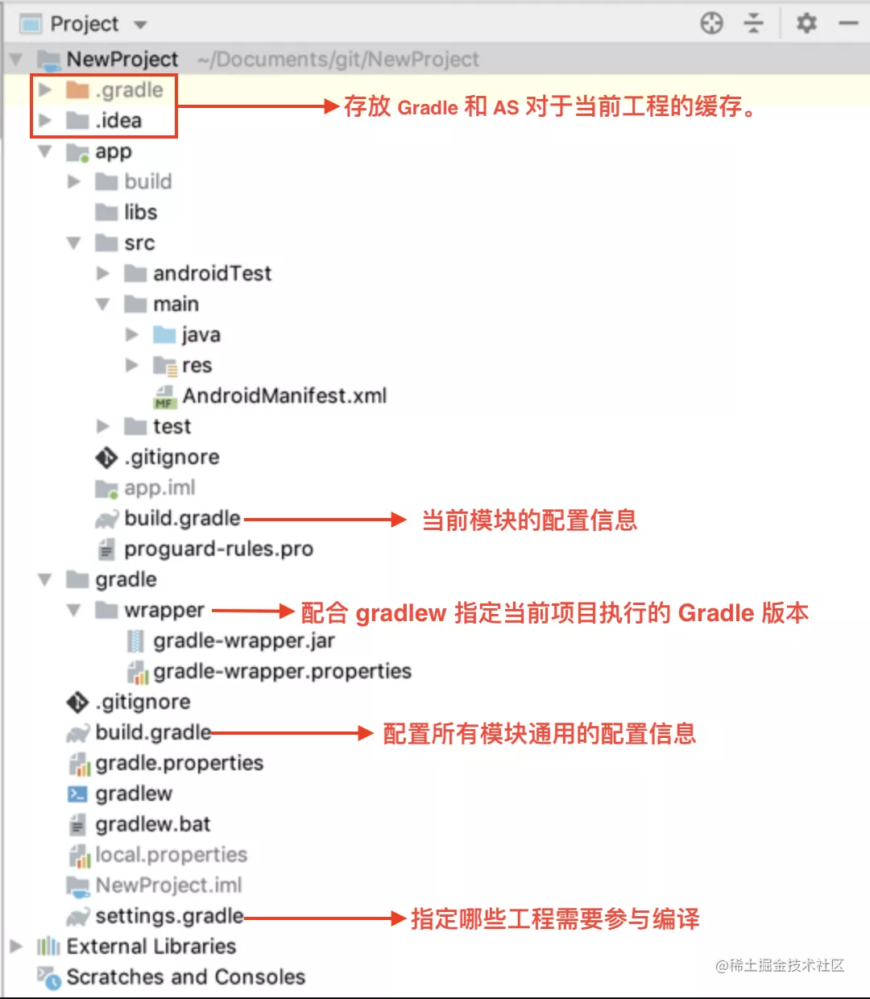
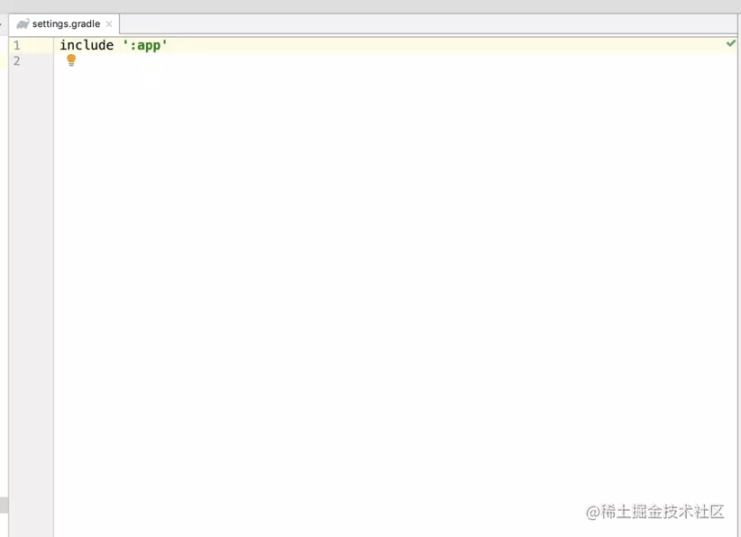
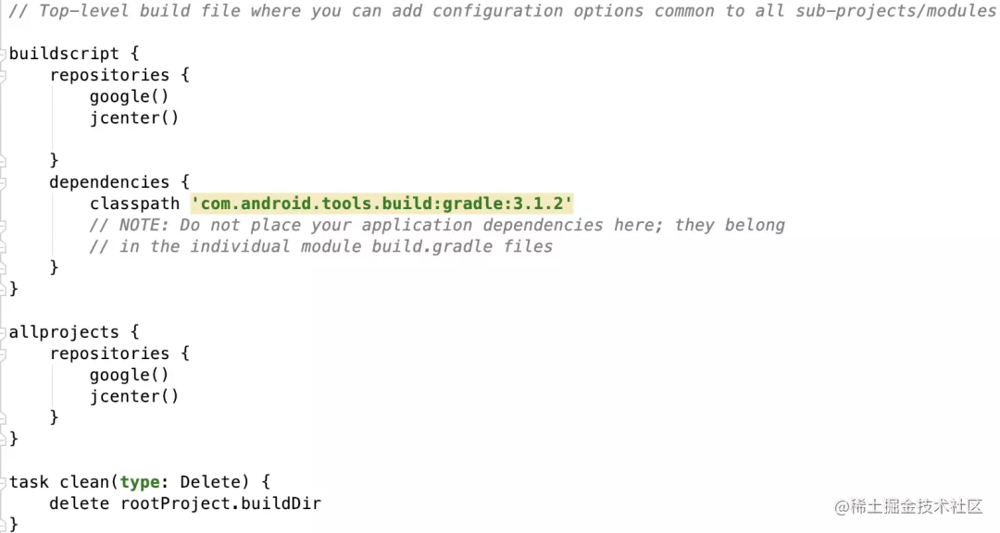
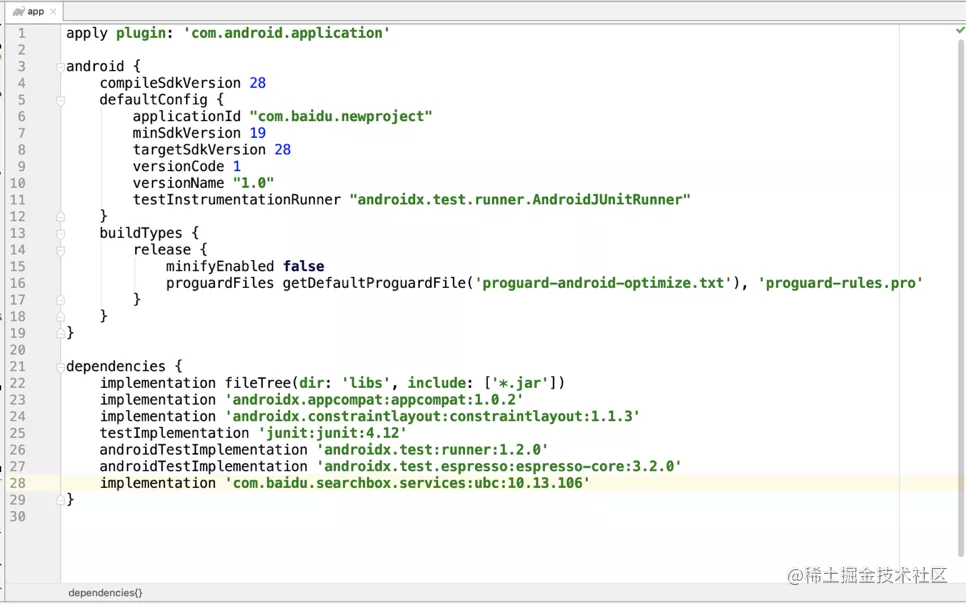
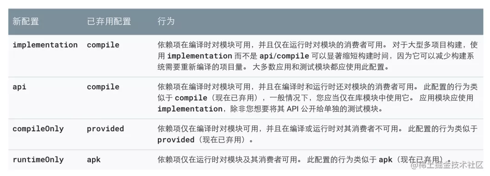

# 默认Android工程目录结构


# 一、目录结构概述




## 1、.gradle 与 .idea

.gradle 与 .idea 存放 Gradle 和 AS 对于当前工程的缓存。

最常见的一个应用就是点击 sync 后，AS 会在每个工程下生成 .iml 文件，他们与 .gradle、.idea 配合为我们提供了代码提示等常见功能。所以如果你的代码飘红而你确认依赖没有问题，可以尝试下面步骤清除 AS 缓存：

- 删.idea 删.gradle 文件
- 命令行执行 ./gradlew clean
- 选择 File -> invalidate caches/restart
- Sync

### 2、gradle/wrapper 与 gradlew gradlew.bat

当我们初次配置 Android 环境时，需要安装 Java，安装 AS，但并不需要安装 Gradle，这其中就是 gradle/wrapper 的功劳。

当执行 gradlew 脚本时，它可以保证每个项目都使用自己期望的 Gradle 版本，而其中的奥秘就在 gradlew 的这段代码中

```bash
exec "$JAVACMD" "${JVM_OPTS[@]}" -classpath "$CLASSPATH" org.gradle.wrapper.GradleWrapperMain "$@"
```

gradlew 并没有直接启动 Gradle 而是启动 gradle-wrapper.jar，它会判断如果没有 Gradle 环境，从 gradle-wrapper.properties 中的 distributionUrl 中下载相应环境，并启动 Gradle。

因为 Gradle 允许命令行启动时附加参数来自定义 Gradle 的运行环境，所以可以通过自定义 gradle-wrapper.jar，实现通过配置文件为不同内存大小的电脑、debug/release 包指定不同 gradle 运行内存，提升编译速度。

## 3、setting.gradle



setting.gradle 中最关键的就是其提供的 include 方法，通过这个方法可以指定哪些工程需要参与编译

## 4、根目录 build.gradle （Project: NewProject）




**buildscript 代码块**： gradle 默认是自顶向下执行，无论 buildscript 代码块在哪，它都会第一个执行

**repositories**：指定 dependencies 声明的依赖去哪些仓库找，google、jcenter、mavenCentral 都是第三方 Maven 仓库。同时，也可以通过 maven 方法添加自己的 Maven 仓库。需要注意的是，不应该假设组件一定会从特定仓库拉取，如果 Gradle 请求一个仓库超时，它会自动请求其他仓库。

**dependencies**：代表 Gradle 执行需要哪些依赖。比如需要 Android Gradle Plugin 插件为我们打包 apk 包，就需要添加: classpath 'com.android.tools.build:gradle:3.4.0'

**allprojects 和 repositories**： 在 allprojects 中的配置会对所有工程生效而里面的 repositories 则表示工程声明的 dependencies 去哪些仓库查找

## 5、app build.gradle



**apply plugin: 'com.android.application'** ：当应用这个插件后，它会为我们创建一系列 Task，比如 assembleDebug、assembleRelease，执行这些 Task，就会得到最终的 APK。

**android 代码块**：是插件为我们提供的 API，允许我们修改 Task 的行为。

**dependencies 代码块** ：指定当前 Project 依赖哪些组件，而不同的依赖声明会有不同的结果，具体内容我们在下一节分析。


## 依赖管理

### 依赖配置

在 Android Gradle Plugin 3.0 时代，Google 使用 implementation 和 api 选项取代过去的 compile 选项。既然接口都变了，Google 索性将其他的配置项也进行了改名，方便大家理解其配置的含义。需要注意的是，老版本的接口没有被立刻删除，但是在下一个主要版本中会被删除。下面是各个配置项的官方中文解释：



举个例子： 假设 A 依赖 B，B 依赖 C。
如果 B 对 C 使用 implementation 依赖，则 A 无法调用 C 的代码
如果 B 对 C 使用 api 依赖，则 A 可以调用 C 的代码
如果 B 对 C 使用 compileOnly 依赖，则 A 无法调用 C 的代码，且 C 的代码不会被打包到 APK 中
如果 B 对 C 使用 runtimeOnly 依赖，则 A、B 无法调用 C 的代码，但 C 的代码会被打包到 APK 中


实际上每一个组件都有自己的 compileClasspath 和 runtimeClasspath
当一个组件参与编译时，Gradle 就会将其放在 compileClasspath 中
当一个组件参与打包时，Gradle 就会将其放在 runtimeClasspath 中

不同的依赖配置项，其实就是将声明的依赖放入不同组件的不同的 classpath 中，回到上面的例子 对于 implementation ，其实就是将 C 放入 B 的 compileClasspath 和 runtimeClasspath，放入 A 的 runtimeClasspath 中，从而实现 A 如果调用 C 的代码，在 A 的编译阶段 javac 报错，但最终 C 会被打包到 APK 包中

对于 api、compileOnly、runtimeOnly 原理相同


# 参考

1、[Gradle 与 Android 构建入门](https://juejin.cn/post/6844904121217056782#heading-1)

2、