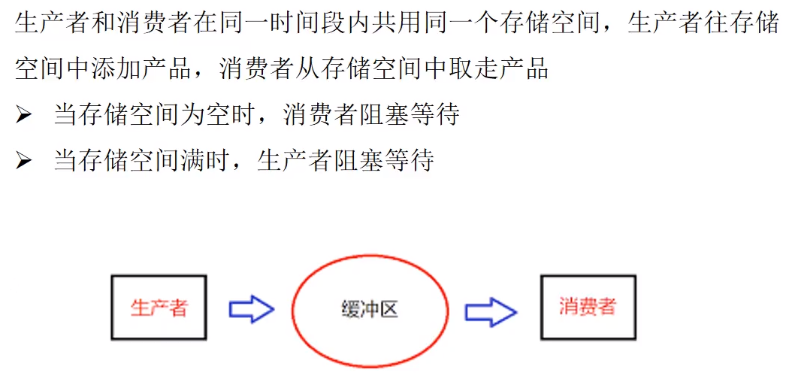

> version：2022/06/26
>
> review：

目录

[TOC]

# 一、前置知识

1、并发

2、BlockingQueue

# 二、生产者消费者模式介绍

# 三、生产者消费者各种实现方式

# 相关问题

Q：讲讲队列

Q：BlockingQueue和BlockingDeque的区别？

Q：生产者-消费者在Android源码中的使用例子？

Q：

Q：

Q：

Q：

# 总结

1、

## 【精益求精】我还能做（补充）些什么？

1、

# 脑图

# 参考

